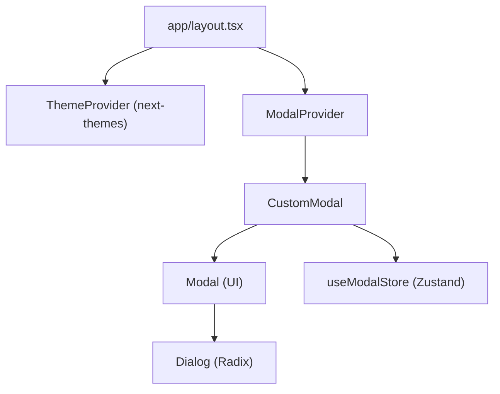
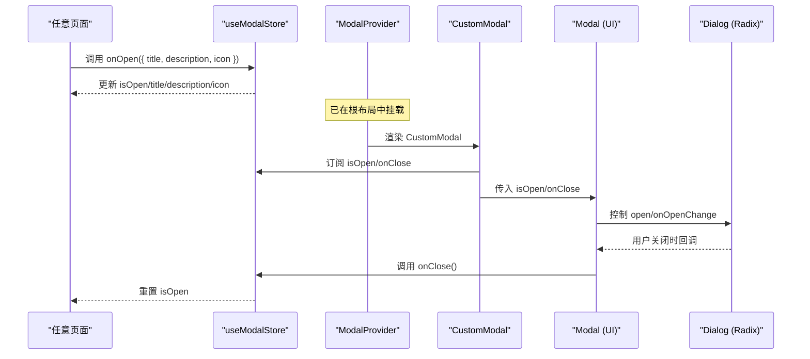
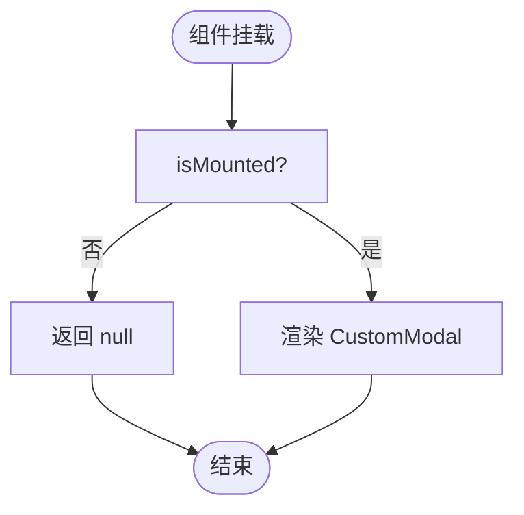
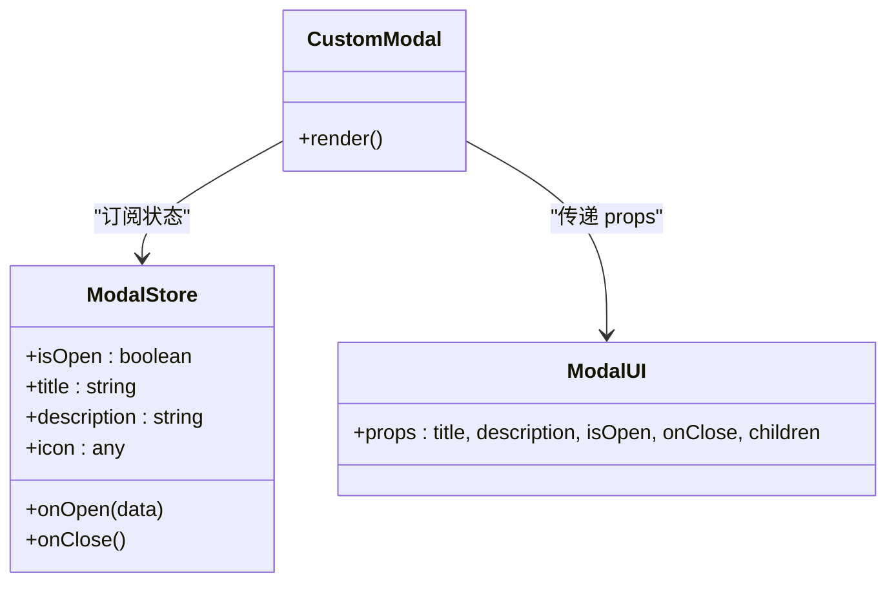
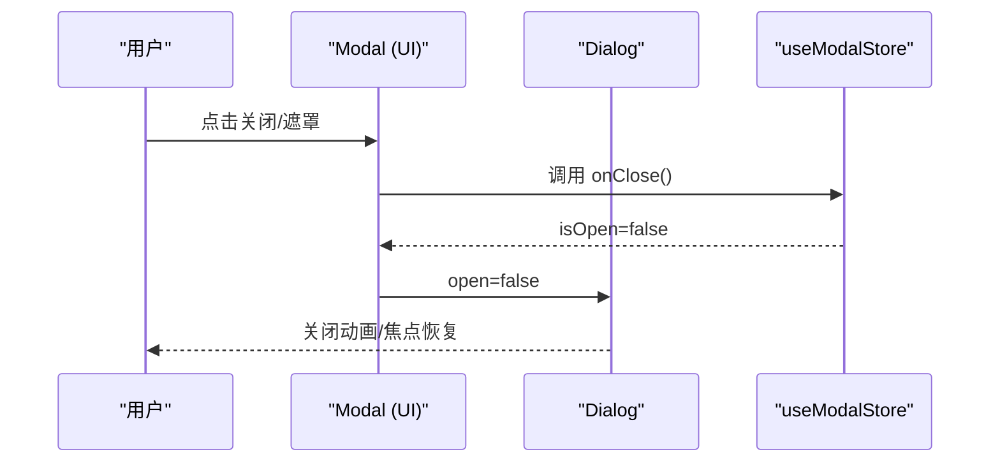
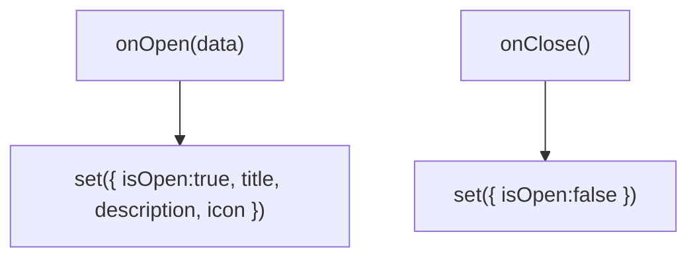
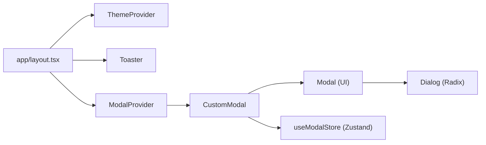

# 提供者目录结构

<cite>
**本文引用的文件**
- [providers/modal-provider.tsx](file://providers/modal-provider.tsx)
- [providers/animation-provider.tsx](file://providers/animation-provider.tsx)
- [hooks/use-modal-store.ts](file://hooks/use-modal-store.ts)
- [components/modals/custom-modal.tsx](file://components/modals/custom-modal.tsx)
- [components/ui/modal.tsx](file://components/ui/modal.tsx)
- [components/ui/dialog.tsx](file://components/ui/dialog.tsx)
- [app/layout.tsx](file://app/layout.tsx)
- [components/common/theme-provider.tsx](file://components/common/theme-provider.tsx)
</cite>

## 目录
1. [简介](#简介)
2. [项目结构](#项目结构)
3. [核心组件](#核心组件)
4. [架构总览](#架构总览)
5. [详细组件分析](#详细组件分析)
6. [依赖关系分析](#依赖关系分析)
7. [性能考量](#性能考量)
8. [故障排查指南](#故障排查指南)
9. [结论](#结论)
10. [附录](#附录)

## 简介
本文件聚焦于 Next.js 项目中 providers 目录的结构与实现，重点说明：
- Providers 模式在 Next.js 中的应用场景与落地方式
- ModalProvider 模态框状态管理原理与使用方法
- AnimationProvider 动画状态管理的扩展点与最佳实践
- Context API 的最佳实践、状态提升策略与性能优化技巧
- Provider 组合模式、错误边界处理与调试工具的使用建议

## 项目结构
本项目采用“功能域 + 层次化”的组织方式。与 Providers 相关的核心位置如下：
- providers：应用级上下文与全局能力注入（如模态框、动画）
- hooks：跨组件共享的状态与逻辑（如 useModalStore）
- components/ui：可复用 UI 基础组件（如 Dialog、Modal）
- components/modals：业务层模态容器（如 CustomModal）
- app/layout.tsx：根布局，负责挂载 ThemeProvider、Toaster、ModalProvider 等

图表来源
- [app/layout.tsx:99-133](file://app/layout.tsx#L99-L133)
- [providers/modal-provider.tsx:7-22](file://providers/modal-provider.tsx#L7-L22)
- [components/modals/custom-modal.tsx:6-29](file://components/modals/custom-modal.tsx#L6-L29)
- [components/ui/modal.tsx:21-39](file://components/ui/modal.tsx#L21-L39)
- [components/ui/dialog.tsx:9-55](file://components/ui/dialog.tsx#L9-L55)

章节来源
- [app/layout.tsx:99-133](file://app/layout.tsx#L99-L133)

## 核心组件
- ModalProvider：在客户端挂载时渲染全局 CustomModal，避免服务端渲染差异
- CustomModal：基于 Zustand store 驱动显示/隐藏，并承载内容
- Modal：封装 Radix Dialog，提供 open/onClose 控制
- useModalStore：集中式模态状态（isOpen、title、description、icon）与 onOpen/onClose 方法
- AnimationProvider：当前为占位 Provider，便于后续接入动画库或全局动画上下文

章节来源
- [providers/modal-provider.tsx:7-22](file://providers/modal-provider.tsx#L7-L22)
- [components/modals/custom-modal.tsx:6-29](file://components/modals/custom-modal.tsx#L6-L29)
- [components/ui/modal.tsx:21-39](file://components/ui/modal.tsx#L21-L39)
- [hooks/use-modal-store.ts:22-35](file://hooks/use-modal-store.ts#L22-L35)
- [providers/animation-provider.tsx:9-11](file://providers/animation-provider.tsx#L9-L11)

## 架构总览
下图展示了从页面触发到模态框显示的完整调用链，以及 Provider 的挂载位置。

图表来源
- [hooks/use-modal-store.ts:22-35](file://hooks/use-modal-store.ts#L22-L35)
- [components/modals/custom-modal.tsx:6-29](file://components/modals/custom-modal.tsx#L6-L29)
- [components/ui/modal.tsx:21-39](file://components/ui/modal.tsx#L21-L39)
- [components/ui/dialog.tsx:9-55](file://components/ui/dialog.tsx#L9-L55)
- [app/layout.tsx:115-133](file://app/layout.tsx#L115-L133)

## 详细组件分析

### ModalProvider：全局模态容器
- 职责：确保 CustomModal 仅在客户端挂载，避免 SSR 水合不一致
- 关键点：使用 isMounted 标记，首次渲染返回 null，effect 后渲染实际模态
- 挂载位置：根布局 body 内，ThemeProviders 之下，保证主题一致

图表来源
- [providers/modal-provider.tsx:7-22](file://providers/modal-provider.tsx#L7-L22)

章节来源
- [providers/modal-provider.tsx:7-22](file://providers/modal-provider.tsx#L7-L22)
- [app/layout.tsx:115-133](file://app/layout.tsx#L115-L133)

### CustomModal：业务模态容器
- 职责：读取 Zustand store 中的标题、描述、图标，并渲染到 UI Modal
- 数据流：通过 useModalStore 订阅 isOpen，调用 onClose 关闭
- 可扩展性：children 区域可替换为任意内容，支持多形态弹窗

图表来源
- [components/modals/custom-modal.tsx:6-29](file://components/modals/custom-modal.tsx#L6-L29)
- [components/ui/modal.tsx:13-39](file://components/ui/modal.tsx#L13-L39)
- [hooks/use-modal-store.ts:13-35](file://hooks/use-modal-store.ts#L13-L35)

章节来源
- [components/modals/custom-modal.tsx:6-29](file://components/modals/custom-modal.tsx#L6-L29)
- [components/ui/modal.tsx:13-39](file://components/ui/modal.tsx#L13-L39)
- [hooks/use-modal-store.ts:13-35](file://hooks/use-modal-store.ts#L13-L35)

### Modal（UI 层）：基于 Radix Dialog 的封装
- 职责：将 open/onClose 映射到 Radix Dialog 的 open/onOpenChange
- 交互：点击遮罩或关闭按钮时，触发 onClose
- 可访问性：继承 Radix Dialog 的可访问性与键盘行为

图表来源
- [components/ui/modal.tsx:21-39](file://components/ui/modal.tsx#L21-L39)
- [components/ui/dialog.tsx:9-55](file://components/ui/dialog.tsx#L9-L55)
- [hooks/use-modal-store.ts:22-35](file://hooks/use-modal-store.ts#L22-L35)

章节来源
- [components/ui/modal.tsx:21-39](file://components/ui/modal.tsx#L21-L39)
- [components/ui/dialog.tsx:9-55](file://components/ui/dialog.tsx#L9-L55)

### useModalStore：集中式模态状态
- 状态字段：isOpen、title、description、icon
- 动作：onOpen(data) 打开并设置内容；onClose() 关闭
- 优势：跨组件共享模态状态，无需逐层 prop 传递

图表来源
- [hooks/use-modal-store.ts:22-35](file://hooks/use-modal-store.ts#L22-L35)

章节来源
- [hooks/use-modal-store.ts:22-35](file://hooks/use-modal-store.ts#L22-L35)

### AnimationProvider：动画上下文占位
- 现状：当前仅透传 children，未包含具体动画逻辑
- 用途：作为未来接入动画库（如 framer-motion）或全局动画配置的入口
- 建议：可在其中注入动画配置、缓动曲线、全局开关等

章节来源
- [providers/animation-provider.tsx:9-11](file://providers/animation-provider.tsx#L9-L11)

## 依赖关系分析
- 根布局 app/layout.tsx 挂载了 ThemeProvider、Toaster、ModalProvider，形成应用级上下文树
- ModalProvider 依赖 CustomModal，后者依赖 UI 层的 Modal 与 Zustand store
- Modal 依赖 Radix Dialog，提供可访问性与样式
- 所有 Provider 均为客户端组件（"use client"），确保在浏览器环境运行

图表来源
- [app/layout.tsx:115-133](file://app/layout.tsx#L115-L133)
- [providers/modal-provider.tsx:7-22](file://providers/modal-provider.tsx#L7-L22)
- [components/modals/custom-modal.tsx:6-29](file://components/modals/custom-modal.tsx#L6-L29)
- [components/ui/modal.tsx:21-39](file://components/ui/modal.tsx#L21-L39)
- [components/ui/dialog.tsx:9-55](file://components/ui/dialog.tsx#L9-L55)
- [hooks/use-modal-store.ts:22-35](file://hooks/use-modal-store.ts#L22-L35)

章节来源
- [app/layout.tsx:115-133](file://app/layout.tsx#L115-L133)

## 性能考量
- 客户端条件渲染：ModalProvider 使用 isMounted 避免 SSR 水合差异，减少不必要的重渲染
- 状态最小化：Zustand store 仅暴露必要字段与方法，降低订阅范围
- 组件粒度：UI 层与业务层分离，CustomModal 专注内容与状态绑定，Modal 专注交互
- 第三方库选择：Radix Dialog 提供高性能与可访问性，减少自研成本
- 主题与样式：ThemeProvider 包裹全局，避免重复计算主题类名

[本节为通用性能建议，不直接分析具体代码]

## 故障排查指南
- 模态框不显示
  - 检查是否在客户端组件中使用 onOpen
  - 确认 ModalProvider 已正确挂载在根布局
  - 验证 store 的 isOpen 是否被设置为 true
- 关闭无效
  - 检查 Modal 的 onOpenChange 是否正确调用 onClose
  - 确认 store 的 onClose 是否执行
- 水合警告
  - 确保 Provider 与 UI 组件均标注 "use client"
  - 避免在服务端渲染期间访问浏览器 API
- 主题不一致
  - 确认 ThemeProvider 包裹顺序在 ModalProvider 之前
  - 检查 CSS 变量与 Tailwind 配置

章节来源
- [providers/modal-provider.tsx:7-22](file://providers/modal-provider.tsx#L7-L22)
- [components/ui/modal.tsx:21-39](file://components/ui/modal.tsx#L21-L39)
- [app/layout.tsx:115-133](file://app/layout.tsx#L115-L133)

## 结论
- ModalProvider 以极简方式解决了 SSR 水合问题，并通过 Zustand 实现了跨组件的模态状态管理
- 组件分层清晰：Provider → 业务容器 → UI 封装 → 第三方库，便于维护与扩展
- AnimationProvider 预留了动画上下文的扩展点，可按需接入更丰富的动画能力
- 建议在复杂场景中引入错误边界与调试工具，进一步提升稳定性与可观测性

[本节为总结性内容，不直接分析具体代码]

## 附录

### Provider 组合模式与最佳实践
- 组合顺序：先主题（ThemeProvider），再功能（ModalProvider、Toaster），最后业务内容
- 客户端限定：涉及 DOM/Browser API 的 Provider 必须使用 "use client"
- 状态提升：将跨组件共享的状态提升到 store 或顶层 Provider，避免深层 prop 传递
- 单一职责：每个 Provider 只负责一个领域的能力（主题、模态、通知、动画等）

### 错误边界处理建议
- 在根布局或关键分支处添加错误边界，捕获渲染异常并降级展示
- 对异步加载的 Provider 或外部脚本进行错误隔离，防止影响主流程
- 结合日志上报与监控，快速定位问题

### 调试工具使用建议
- 使用 React DevTools 查看组件树与状态变化
- 使用 Zustand 中间件（如 logger）记录 store 变更
- 在开发环境开启严格模式，尽早发现潜在问题

[本节为通用指导，不直接分析具体代码]