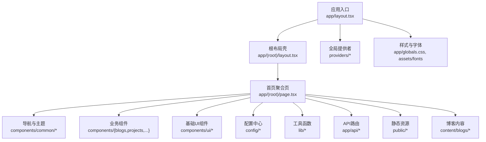
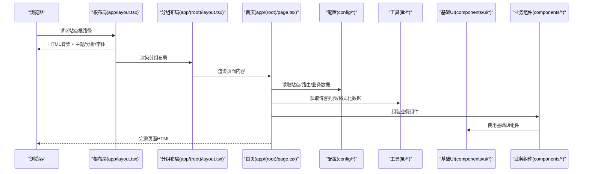
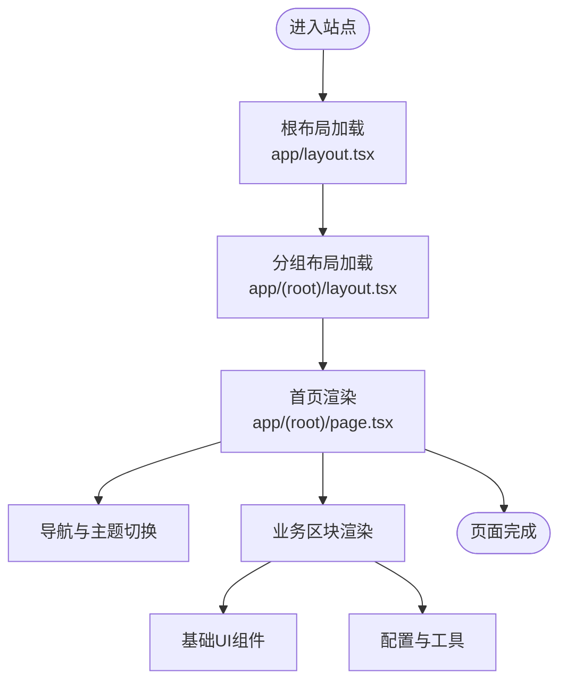
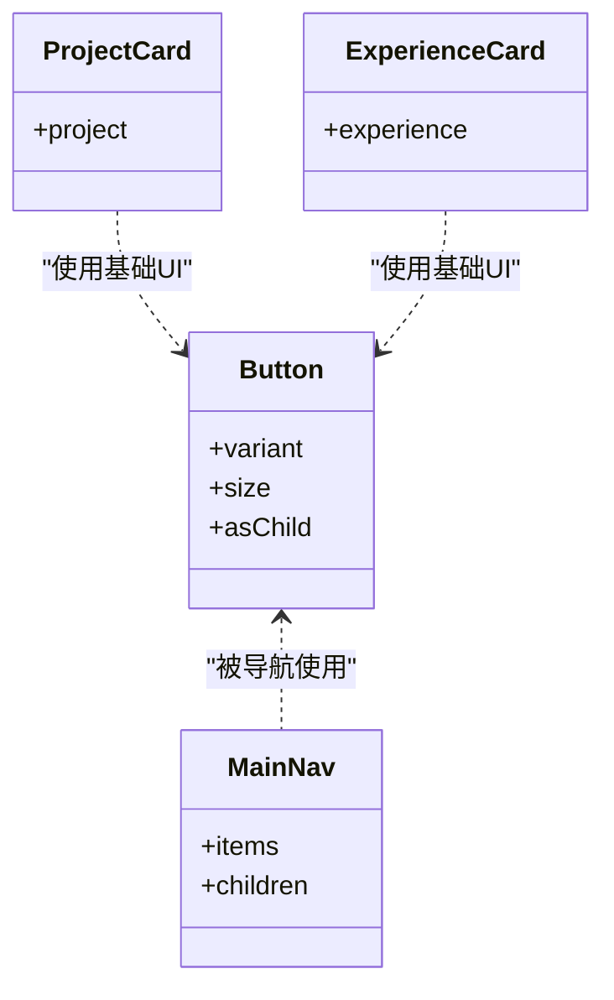
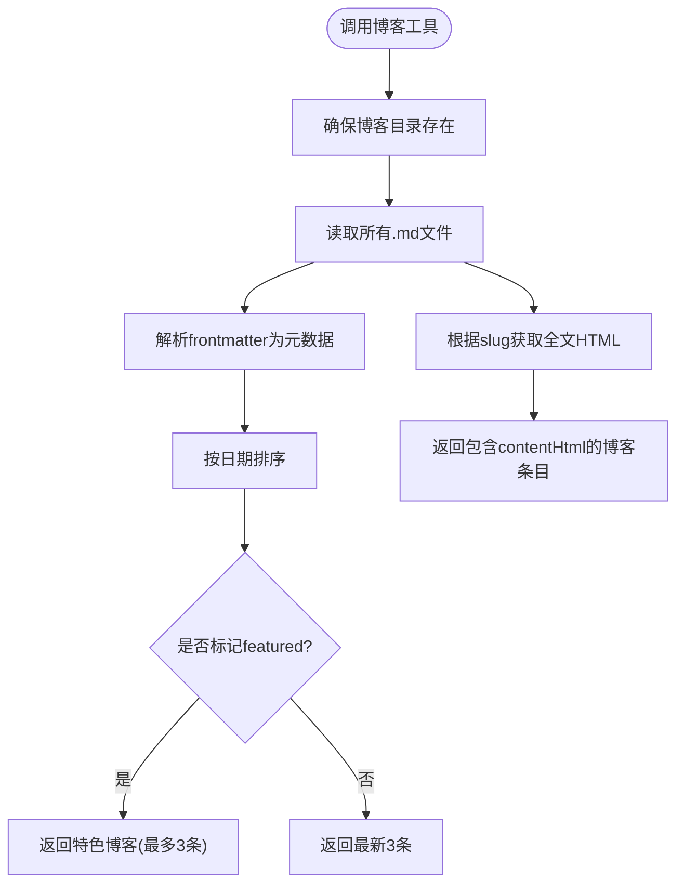
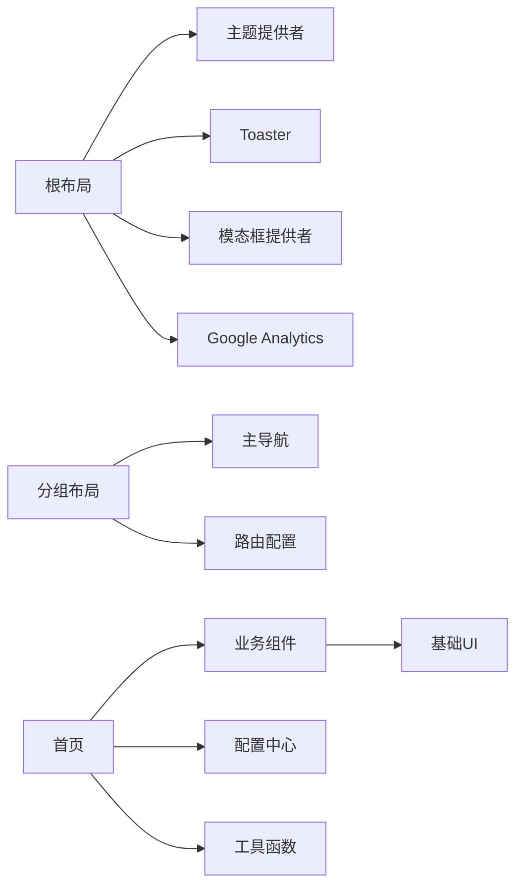

# 目录结构设计

<cite>
**本文引用的文件**
- [README.md](file://README.md)
- [next.config.js](file://next.config.js)
- [components.json](file://components.json)
- [app/layout.tsx](file://app/layout.tsx)
- [app/(root)/layout.tsx](file://app/(root)/layout.tsx)
- [app/(root)/page.tsx](file://app/(root)/page.tsx)
- [config/site.ts](file://config/site.ts)
- [config/routes.ts](file://config/routes.ts)
- [lib/utils.ts](file://lib/utils.ts)
- [lib/blogs.ts](file://lib/blogs.ts)
- [hooks/use-modal-store.ts](file://hooks/use-modal-store.ts)
- [providers/modal-provider.tsx](file://providers/modal-provider.tsx)
- [components/common/main-nav.tsx](file://components/common/main-nav.tsx)
- [components/ui/button.tsx](file://components/ui/button.tsx)
</cite>

## 目录
1. [简介](#简介)
2. [项目结构总览](#项目结构总览)
3. [核心目录与职责](#核心目录与职责)
4. [架构总览](#架构总览)
5. [详细组件与目录分析](#详细组件与目录分析)
6. [依赖关系分析](#依赖关系分析)
7. [性能考量](#性能考量)
8. [故障排查指南](#故障排查指南)
9. [结论](#结论)
10. [附录：命名约定与最佳实践](#附录：命名约定与最佳实践)

## 简介
本文件面向Next.js项目的目录结构设计，系统化说明各目录的职责、子目录设计原则、文件命名约定与组织模式。重点覆盖：
- app目录的路由组织（分组路由、页面与布局）
- components目录的组件分类（common、ui、feature等）
- config目录的配置管理（站点信息、路由、业务数据）
- lib目录的工具函数与数据处理
- hooks与providers的全局状态与能力注入
- public与content的资源与内容管理

目标是帮助开发者快速理解代码组织方式，遵循一致的最佳实践，提升可维护性与可扩展性。

## 项目结构总览
本项目采用Next.js App Router与功能域划分的组合式目录结构：
- 路由层：app/按功能域划分页面与布局，使用分组路由(根组)统一全局外壳
- 组件层：components/按“通用UI”、“领域组件”、“业务特性”分层组织
- 配置层：config/集中站点、路由、业务数据等静态配置
- 工具层：lib/提供跨模块复用的工具函数与数据处理逻辑
- 状态与能力：hooks/与providers/提供客户端状态与全局能力注入
- 资源与内容：public/存放静态资源；content/存放Markdown博客内容

图表来源
- [app/layout.tsx:1-145](file://app/layout.tsx#L1-L145)
- [app/(root)/layout.tsx:1-33](file://app/(root)/layout.tsx#L1-L33)
- [app/(root)/page.tsx:1-357](file://app/(root)/page.tsx#L1-L357)

章节来源
- [README.md:1-151](file://README.md#L1-L151)
- [next.config.js:1-25](file://next.config.js#L1-L25)
- [components.json:1-17](file://components.json#L1-L17)

## 核心目录与职责
- app：Next.js应用路由与元数据、布局、页面、API路由、全局样式与清单
  - (root)：分组路由，承载全局头部、主体、底部与导航
  - api：服务端API路由（如联系表单、GitHub Stars）
  - globals.css：全局样式与主题变量
- components：组件库与业务组件
  - ui：基础UI原子组件（按钮、卡片、表单、对话框等）
  - common：跨页面通用的交互与展示组件（导航、动画、主题切换、页脚等）
  - feature（按业务域）：blogs、projects、experience、skills、forms、modals等
- config：集中化配置
  - site.ts：站点信息与SEO元数据
  - routes.ts：主导航路由表
  - projects.ts、experience.ts、skills.ts、contributions.ts：业务数据配置
- lib：工具函数与数据处理
  - utils.ts：类名合并、日期格式化等
  - blogs.ts：博客Markdown解析、元数据读取、阅读时间估算
- hooks：客户端Hook封装（如模态框状态、滚动锁定）
- providers：全局能力提供者（如模态框容器、动画上下文）
- public：静态资源（图片、图标、robots.txt等）
- content：Markdown博客内容（通过lib/blogs.ts读取并渲染）

章节来源
- [app/layout.tsx:1-145](file://app/layout.tsx#L1-L145)
- [app/(root)/layout.tsx:1-33](file://app/(root)/layout.tsx#L1-L33)
- [config/site.ts:1-41](file://config/site.ts#L1-L41)
- [config/routes.ts:1-29](file://config/routes.ts#L1-L29)
- [lib/utils.ts:1-25](file://lib/utils.ts#L1-L25)
- [lib/blogs.ts:1-97](file://lib/blogs.ts#L1-L97)
- [hooks/use-modal-store.ts:1-36](file://hooks/use-modal-store.ts#L1-L36)
- [providers/modal-provider.tsx:1-24](file://providers/modal-provider.tsx#L1-L24)

## 架构总览
整体架构围绕“路由-布局-页面-组件-配置-工具-提供者”展开：
- 根布局负责全局样式、主题、分析与第三方脚本注入
- 根布局组提供统一的Header/Main/Footer与导航
- 页面聚合业务数据与组件，调用配置与工具函数
- 组件层分为UI原子组件与业务组件，复用性强
- 配置层集中站点、路由与业务数据，便于维护
- 工具层提供跨模块复用的数据处理与格式化工具
- 提供者与Hook提供全局状态与行为注入

图表来源
- [app/layout.tsx:1-145](file://app/layout.tsx#L1-L145)
- [app/(root)/layout.tsx:1-33](file://app/(root)/layout.tsx#L1-L33)
- [app/(root)/page.tsx:1-357](file://app/(root)/page.tsx#L1-L357)
- [config/site.ts:1-41](file://config/site.ts#L1-L41)
- [config/routes.ts:1-29](file://config/routes.ts#L1-L29)
- [lib/blogs.ts:1-97](file://lib/blogs.ts#L1-L97)
- [components/ui/button.tsx:1-57](file://components/ui/button.tsx#L1-L57)

## 详细组件与目录分析

### app目录：路由组织与布局
- 根布局（app/layout.tsx）
  - 定义全局元数据（标题、描述、OpenGraph、Twitter卡片、图标、manifest、robots、验证）
  - 注入主题提供者、Toaster、模态框提供者、Google Analytics与第三方脚本
  - 设置字体变量与全局样式类
- 分组布局（app/(root)/layout.tsx）
  - 提供Header（导航、GitHub Star徽章、主题切换）、Main、Footer
  - 使用routes.mainNav作为导航数据源
- 首页（app/(root)/page.tsx）
  - 聚合各业务区块（项目、经验、贡献、技能、博客、联系）
  - 引入业务组件与基础UI组件，使用配置与工具函数
  - 注入结构化数据（Person、SoftwareApplication）

图表来源
- [app/layout.tsx:1-145](file://app/layout.tsx#L1-L145)
- [app/(root)/layout.tsx:1-33](file://app/(root)/layout.tsx#L1-L33)
- [app/(root)/page.tsx:1-357](file://app/(root)/page.tsx#L1-L357)

章节来源
- [app/layout.tsx:1-145](file://app/layout.tsx#L1-L145)
- [app/(root)/layout.tsx:1-33](file://app/(root)/layout.tsx#L1-L33)
- [app/(root)/page.tsx:1-357](file://app/(root)/page.tsx#L1-L357)

### components目录：组件分类与设计原则
- ui（基础UI原子组件）
  - 职责：提供无业务语义的基础控件（按钮、输入、卡片、对话框、标签页、提示等）
  - 设计原则：纯展示与交互，不耦合业务数据；通过变体与尺寸参数控制外观
  - 示例：按钮组件使用class-variance-authority管理变体与尺寸
- common（通用组件）
  - 职责：跨页面复用的交互与展示（导航、动画、主题切换、页脚、图标、滚动动画等）
  - 设计原则：与具体业务解耦，关注用户体验与一致性
- feature（业务特性组件）
  - 职责：按业务域组织（blogs、projects、experience、skills、forms、modals等）
  - 设计原则：高内聚低耦合，每个文件夹对应一个业务域；组件接收配置或数据对象进行渲染

图表来源
- [components/ui/button.tsx:1-57](file://components/ui/button.tsx#L1-L57)
- [components/common/main-nav.tsx:1-105](file://components/common/main-nav.tsx#L1-L105)

章节来源
- [components/ui/button.tsx:1-57](file://components/ui/button.tsx#L1-L57)
- [components/common/main-nav.tsx:1-105](file://components/common/main-nav.tsx#L1-L105)

### config目录：配置管理
- site.ts：站点名称、作者、链接、OG图像、关键词等，供根布局与页面元数据使用
- routes.ts：主导航项（标题、链接），用于导航组件渲染
- projects.ts、experience.ts、skills.ts、contributions.ts：业务数据配置，供首页与各页面聚合展示
- 设计原则：将易变内容与展示逻辑分离，便于维护与扩展

章节来源
- [config/site.ts:1-41](file://config/site.ts#L1-L41)
- [config/routes.ts:1-29](file://config/routes.ts#L1-L29)
- [config/projects.ts:1-596](file://config/projects.ts#L1-L596)

### lib目录：工具函数与数据处理
- utils.ts：类名合并（clsx+tailwind-merge）与日期格式化
- blogs.ts：博客Markdown解析与元数据读取
  - 读取content/blogs/*.md，解析frontmatter与正文
  - 提供获取全部博客、特色博客、阅读时间估算等能力
  - 自动确保博客目录存在

图表来源
- [lib/blogs.ts:1-97](file://lib/blogs.ts#L1-L97)

章节来源
- [lib/utils.ts:1-25](file://lib/utils.ts#L1-L25)
- [lib/blogs.ts:1-97](file://lib/blogs.ts#L1-L97)

### hooks与providers：全局状态与能力注入
- use-modal-store.ts：基于Zustand的模态框状态管理（打开/关闭、标题、描述、图标）
- modal-provider.tsx：在客户端挂载时渲染自定义模态框容器，避免SSR水合问题
- 设计原则：将全局状态与副作用隔离，提供稳定的API供组件消费

章节来源
- [hooks/use-modal-store.ts:1-36](file://hooks/use-modal-store.ts#L1-L36)
- [providers/modal-provider.tsx:1-24](file://providers/modal-provider.tsx#L1-L24)

### API与外部集成
- next.config.js：为特定API路径设置CORS头，便于外部服务调用
- app/api：服务端路由（如联系表单、GitHub Stars），可在页面中通过fetch调用

章节来源
- [next.config.js:1-25](file://next.config.js#L1-L25)

## 依赖关系分析
- 根布局依赖：
  - 主题提供者、Toaster、模态框提供者、Google Analytics、字体与全局样式
- 分组布局依赖：
  - 导航组件、GitHub Star徽章、主题切换、路由配置
- 首页依赖：
  - 业务组件（项目、经验、贡献、技能、博客、联系）
  - 配置（站点、路由、业务数据）
  - 工具（博客数据、类名合并）
  - 基础UI（按钮等）

图表来源
- [app/layout.tsx:1-145](file://app/layout.tsx#L1-L145)
- [app/(root)/layout.tsx:1-33](file://app/(root)/layout.tsx#L1-L33)
- [app/(root)/page.tsx:1-357](file://app/(root)/page.tsx#L1-L357)
- [config/routes.ts:1-29](file://config/routes.ts#L1-L29)
- [components/common/main-nav.tsx:1-105](file://components/common/main-nav.tsx#L1-L105)
- [components/ui/button.tsx:1-57](file://components/ui/button.tsx#L1-L57)

章节来源
- [app/layout.tsx:1-145](file://app/layout.tsx#L1-L145)
- [app/(root)/layout.tsx:1-33](file://app/(root)/layout.tsx#L1-L33)
- [app/(root)/page.tsx:1-357](file://app/(root)/page.tsx#L1-L357)
- [config/routes.ts:1-29](file://config/routes.ts#L1-L29)
- [components/common/main-nav.tsx:1-105](file://components/common/main-nav.tsx#L1-L105)
- [components/ui/button.tsx:1-57](file://components/ui/button.tsx#L1-L57)

## 性能考量
- 首屏优化
  - 使用Next.js字体优化与本地字体变量，减少重排
  - 根布局按需注入第三方脚本与分析，避免阻塞渲染
- 组件拆分与懒加载
  - 将业务组件拆分为独立文件，便于按需加载与缓存
  - 基础UI组件保持轻量，通过变体与尺寸参数控制样式
- 数据获取与处理
  - 博客内容在服务端解析，减少客户端计算开销
  - 使用工具函数集中处理类名合并与日期格式化，避免重复实现
- 构建与部署
  - 使用Vercel部署，利用CDN与边缘缓存提升访问速度
  - 合理设置CORS头，减少跨域请求失败导致的重试与延迟

[本节为通用性能建议，无需特定文件引用]

## 故障排查指南
- 根布局缺少Google Analytics ID
  - 现象：启动时报错缺失ID
  - 原因：环境变量未配置
  - 解决：在.env中设置NEXT_PUBLIC_GOOGLE_MEASUREMENT_ID
- 博客目录不存在
  - 现象：读取博客失败
  - 原因：content/blogs目录未初始化
  - 解决：工具函数会自动创建目录；也可手动创建并添加.md文件
- 导航高亮异常
  - 现象：当前页面导航未高亮
  - 原因：useSelectedLayoutSegment与路由段不一致
  - 解决：检查路由结构与segment匹配
- 模态框水合错误
  - 现象：客户端与服务端渲染不一致
  - 原因：模态框在SSR阶段渲染
  - 解决：通过provider在客户端挂载后渲染

章节来源
- [app/layout.tsx:99-104](file://app/layout.tsx#L99-L104)
- [lib/blogs.ts:29-33](file://lib/blogs.ts#L29-L33)
- [components/common/main-nav.tsx:41-47](file://components/common/main-nav.tsx#L41-L47)
- [providers/modal-provider.tsx:7-16](file://providers/modal-provider.tsx#L7-L16)

## 结论
本项目采用清晰的目录结构与职责划分，结合Next.js App Router与模块化组件体系，实现了良好的可维护性与扩展性。通过集中配置、工具函数与提供者，降低了耦合度并提升了复用性。遵循本文的命名约定与组织模式，有助于团队保持一致的代码风格与开发效率。

[本节为总结性内容，无需特定文件引用]

## 附录：命名约定与最佳实践
- 目录命名
  - 全小写，使用短横线分隔（如blogs、projects、experience）
  - 路由分组使用括号包裹（如(root)）
- 文件命名
  - 组件文件使用小驼峰（如blog-card.tsx、project-card.tsx）
  - 工具与配置使用小写（如utils.ts、site.ts、routes.ts）
  - Hook以use开头（如use-modal-store.ts）
  - Provider以Provider结尾（如modal-provider.tsx）
- 组件分类
  - ui：基础原子组件，无业务语义
  - common：跨页面通用组件，关注交互与体验
  - feature：按业务域组织，高内聚低耦合
- 配置管理
  - 将站点信息、路由、业务数据集中在config目录
  - 使用TypeScript接口约束数据结构，提高类型安全
- 工具函数
  - 将跨模块复用的逻辑放入lib目录
  - 单一职责，易于测试与维护
- 资源与内容
  - 静态资源放入public，按功能域子目录组织
  - Markdown内容放入content，通过工具函数解析与渲染

[本节为通用规范说明，无需特定文件引用]