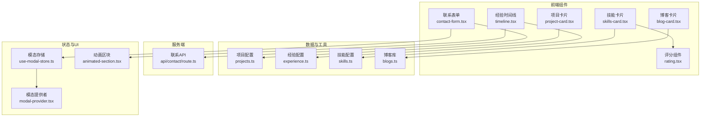
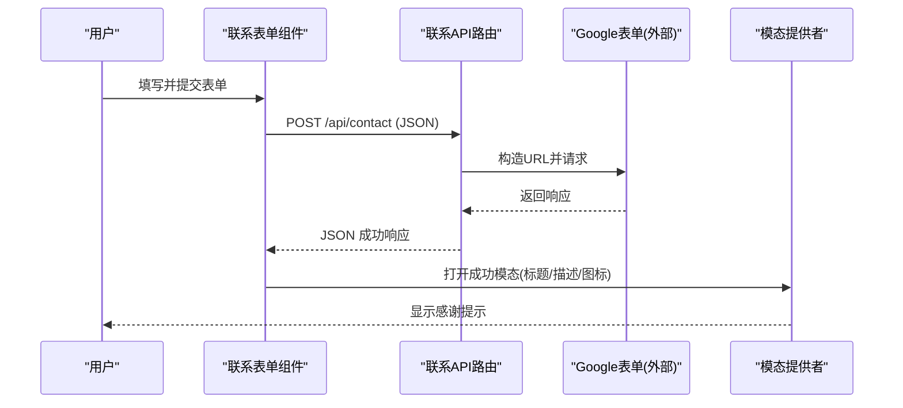
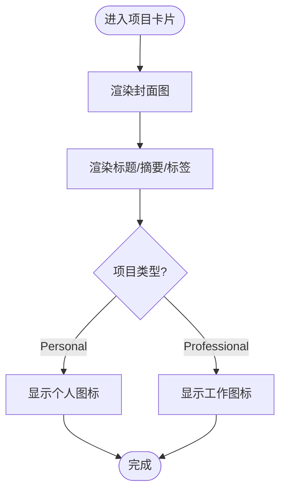
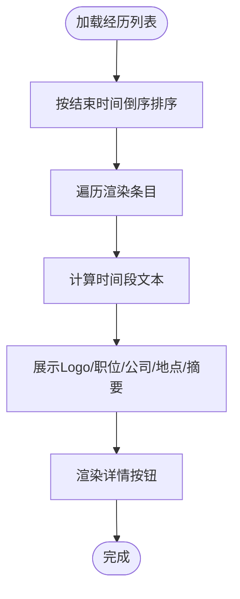
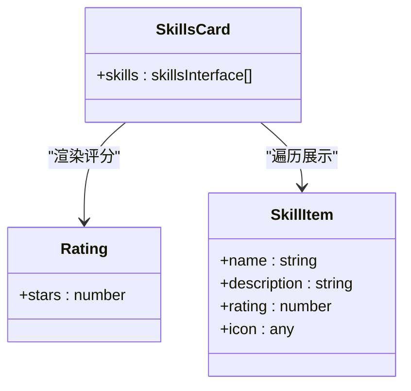
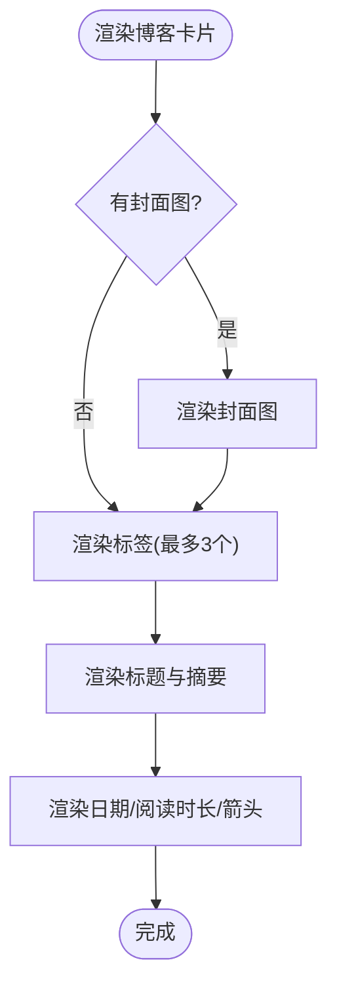
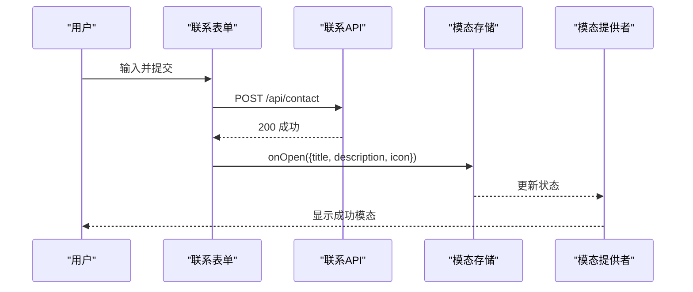
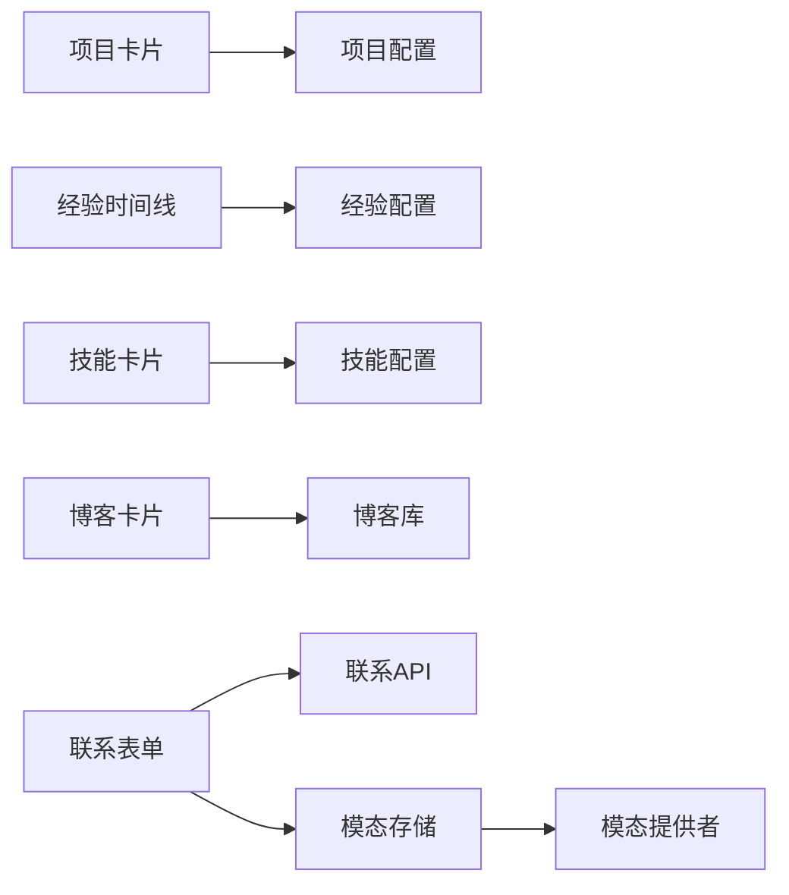

# 功能组件

<cite>
**本文引用的文件**
- [components/projects/project-card.tsx](file://components/projects/project-card.tsx)
- [config/projects.ts](file://config/projects.ts)
- [components/experience/timeline.tsx](file://components/experience/timeline.tsx)
- [config/experience.ts](file://config/experience.ts)
- [components/skills/skills-card.tsx](file://components/skills/skills-card.tsx)
- [components/skills/rating.tsx](file://components/skills/rating.tsx)
- [config/skills.ts](file://config/skills.ts)
- [components/blogs/blog-card.tsx](file://components/blogs/blog-card.tsx)
- [lib/blogs.ts](file://lib/blogs.ts)
- [components/forms/contact-form.tsx](file://components/forms/contact-form.tsx)
- [app/api/contact/route.ts](file://app/api/contact/route.ts)
- [hooks/use-modal-store.ts](file://hooks/use-modal-store.ts)
- [providers/modal-provider.tsx](file://providers/modal-provider.tsx)
- [components/common/animated-section.tsx](file://components/common/animated-section.tsx)
</cite>

## 目录
1. [简介](#简介)
2. [项目结构](#项目结构)
3. [核心组件](#核心组件)
4. [架构总览](#架构总览)
5. [详细组件分析](#详细组件分析)
6. [依赖关系分析](#依赖关系分析)
7. [性能考量](#性能考量)
8. [故障排查指南](#故障排查指南)
9. [结论](#结论)
10. [附录](#附录)

## 简介
本文件面向“按业务功能划分”的功能组件，覆盖以下模块：项目展示、经验时间线、技能展示、博客卡片、联系表单。文档从业务逻辑、数据绑定、用户交互、状态管理、组件通信、数据流与错误处理等维度进行系统化说明，并提供测试方法与调试技巧，帮助读者快速理解并扩展各组件。

## 项目结构
该作品集采用 Next.js App Router，功能组件集中在 components 目录下，按业务域拆分；配置数据集中在 config 目录；博客内容以 Markdown 存放于 content/blogs，并通过 lib/blogs.ts 在构建期读取与解析；服务端 API 位于 app/api。

图表来源
- [components/projects/project-card.tsx:1-51](file://components/projects/project-card.tsx#L1-L51)
- [config/projects.ts:14-28](file://config/projects.ts#L14-L28)
- [components/experience/timeline.tsx:1-117](file://components/experience/timeline.tsx#L1-L117)
- [config/experience.ts:3-15](file://config/experience.ts#L3-L15)
- [components/skills/skills-card.tsx:1-31](file://components/skills/skills-card.tsx#L1-L31)
- [components/skills/rating.tsx:1-41](file://components/skills/rating.tsx#L1-L41)
- [config/skills.ts:3-8](file://config/skills.ts#L3-L8)
- [components/blogs/blog-card.tsx:1-96](file://components/blogs/blog-card.tsx#L1-L96)
- [lib/blogs.ts:11-27](file://lib/blogs.ts#L11-L27)
- [components/forms/contact-form.tsx:1-142](file://components/forms/contact-form.tsx#L1-L142)
- [app/api/contact/route.ts:1-31](file://app/api/contact/route.ts#L1-L31)
- [hooks/use-modal-store.ts:1-36](file://hooks/use-modal-store.ts#L1-L36)
- [providers/modal-provider.tsx:1-24](file://providers/modal-provider.tsx#L1-L24)
- [components/common/animated-section.tsx:1-51](file://components/common/animated-section.tsx#L1-L51)

章节来源
- [components/projects/project-card.tsx:1-51](file://components/projects/project-card.tsx#L1-L51)
- [components/experience/timeline.tsx:1-117](file://components/experience/timeline.tsx#L1-L117)
- [components/skills/skills-card.tsx:1-31](file://components/skills/skills-card.tsx#L1-L31)
- [components/blogs/blog-card.tsx:1-96](file://components/blogs/blog-card.tsx#L1-L96)
- [components/forms/contact-form.tsx:1-142](file://components/forms/contact-form.tsx#L1-L142)

## 核心组件
- 项目卡片：展示项目封面、标题、摘要、标签、类型标识与跳转按钮，数据来源为项目配置数组。
- 经验时间线：将经历按结束时间倒序排列，渲染公司Logo、职位、时间段、地点、描述摘要与详情链接，支持滚动入场动画。
- 技能卡片：网格布局展示技能图标、名称、描述与星级评分，评分由独立组件渲染。
- 博客卡片：渲染封面图、标签、标题、摘要、日期与阅读时长，点击跳转至文章详情页。
- 联系表单：基于表单库与校验库实现字段校验，提交到服务端 API，成功后通过全局模态反馈。

章节来源
- [config/projects.ts:14-28](file://config/projects.ts#L14-L28)
- [config/experience.ts:3-15](file://config/experience.ts#L3-L15)
- [config/skills.ts:3-8](file://config/skills.ts#L3-L8)
- [lib/blogs.ts:11-27](file://lib/blogs.ts#L11-L27)
- [components/forms/contact-form.tsx:21-30](file://components/forms/contact-form.tsx#L21-L30)

## 架构总览
整体遵循“配置驱动 + 组件渲染 + 客户端交互 + 服务端API”的分层模式：
- 配置层：静态数据集中管理（项目、经验、技能），便于维护与扩展。
- 展示层：各业务组件负责 UI 渲染与基础交互（导航、悬停、滚动动画）。
- 状态层：使用轻量状态库管理模态弹窗等跨组件共享状态。
- 服务层：Next.js API Route 处理表单提交，转发至外部系统（如 Google Form）。

图表来源
- [components/forms/contact-form.tsx:47-71](file://components/forms/contact-form.tsx#L47-L71)
- [app/api/contact/route.ts:3-29](file://app/api/contact/route.ts#L3-L29)
- [hooks/use-modal-store.ts:22-35](file://hooks/use-modal-store.ts#L22-L35)
- [providers/modal-provider.tsx:7-23](file://providers/modal-provider.tsx#L7-L23)

## 详细组件分析

### 项目展示（Project Card）
- 业务逻辑
  - 接收单个项目对象作为 props，渲染封面图、公司名称、短描述、分类标签、类型标识与“Read more”按钮。
  - 根据项目类型切换右下角图标（个人/工作）。
- 数据绑定
  - 项目数据结构定义在项目配置中，包含 id、type、category、shortDescription、techStack、起止时间、图片路径、详细描述与页面信息数组等。
- 用户交互
  - 点击“Read more”跳转到项目详情页路由。
- 状态管理
  - 无本地状态，纯展示型组件。
- 可访问性与体验
  - 图片使用填充布局避免抖动；文本截断保证排版稳定。

图表来源
- [components/projects/project-card.tsx:13-49](file://components/projects/project-card.tsx#L13-L49)
- [config/projects.ts:14-28](file://config/projects.ts#L14-L28)

章节来源
- [components/projects/project-card.tsx:1-51](file://components/projects/project-card.tsx#L1-L51)
- [config/projects.ts:14-28](file://config/projects.ts#L14-L28)

### 经验时间线（Timeline）
- 业务逻辑
  - 将经历按结束时间倒序排序（当前任职使用“Present”处理）。
  - 计算并展示时间段文本；展示公司 Logo、职位、公司名、地点、首段描述与“查看详情”按钮。
- 数据绑定
  - 经历数据结构包含 id、position、company、location、起止时间、描述数组、成就、技能、公司链接与 Logo。
- 用户交互
  - 点击“查看详情”跳转到对应经历详情页。
- 状态管理
  - 无本地状态；排序结果在渲染时计算。
- 动画与可访问性
  - 每个条目包裹动画区块，按索引设置延迟，提升滚动体验。

图表来源
- [components/experience/timeline.tsx:12-38](file://components/experience/timeline.tsx#L12-L38)
- [components/experience/timeline.tsx:40-111](file://components/experience/timeline.tsx#L40-L111)
- [config/experience.ts:3-15](file://config/experience.ts#L3-L15)

章节来源
- [components/experience/timeline.tsx:1-117](file://components/experience/timeline.tsx#L1-L117)
- [config/experience.ts:3-15](file://config/experience.ts#L3-L15)

### 技能展示（Skills Card + Rating）
- 业务逻辑
  - 技能卡片网格展示技能图标、名称、描述与评分；评分由子组件渲染星形图标。
- 数据绑定
  - 技能数据结构包含 name、description、rating、icon；配置中提供未排序数组与排序后的数组及精选集合。
- 用户交互
  - 纯展示，无交互。
- 状态管理
  - 无本地状态。
- 性能考虑
  - 评分组件通过固定长度数组生成星形 SVG，复杂度 O(n)，n=5，开销极低。

图表来源
- [components/skills/skills-card.tsx:4-29](file://components/skills/skills-card.tsx#L4-L29)
- [components/skills/rating.tsx:1-41](file://components/skills/rating.tsx#L1-L41)
- [config/skills.ts:3-8](file://config/skills.ts#L3-L8)

章节来源
- [components/skills/skills-card.tsx:1-31](file://components/skills/skills-card.tsx#L1-L31)
- [components/skills/rating.tsx:1-41](file://components/skills/rating.tsx#L1-L41)
- [config/skills.ts:3-8](file://config/skills.ts#L3-L8)

### 博客卡片（Blog Card）
- 业务逻辑
  - 渲染封面图、标签（最多3个，超出显示计数）、标题、摘要、日期与阅读时长；整卡可点击跳转。
- 数据绑定
  - 博客元数据来自博客库，包含 slug、title、date、description、tags、coverImage、readingTime、featured。
- 用户交互
  - 点击卡片跳转到 /blogs/[slug] 详情页。
- 状态管理
  - 无本地状态。
- 可访问性与SEO
  - 使用 time 元素标注日期；alt 文本用于图片可读性。

图表来源
- [components/blogs/blog-card.tsx:11-93](file://components/blogs/blog-card.tsx#L11-L93)
- [lib/blogs.ts:11-27](file://lib/blogs.ts#L11-L27)

章节来源
- [components/blogs/blog-card.tsx:1-96](file://components/blogs/blog-card.tsx#L1-L96)
- [lib/blogs.ts:11-27](file://lib/blogs.ts#L11-L27)

### 联系表单（Contact Form）
- 业务逻辑
  - 使用表单库与校验库定义字段规则（姓名、邮箱、消息、可选社交链接）。
  - 提交时调用服务端 API，成功后重置表单并打开成功模态。
- 数据绑定
  - 表单值通过表单库控制，提交体为 JSON。
- 用户交互
  - 提交触发网络请求；成功时弹出模态提示。
- 状态管理
  - 使用全局模态存储控制模态的开关与内容。
- 错误处理
  - 捕获异常并记录日志；服务端在缺少环境变量或内部错误时返回 5xx。

图表来源
- [components/forms/contact-form.tsx:21-71](file://components/forms/contact-form.tsx#L21-L71)
- [app/api/contact/route.ts:3-29](file://app/api/contact/route.ts#L3-L29)
- [hooks/use-modal-store.ts:22-35](file://hooks/use-modal-store.ts#L22-L35)
- [providers/modal-provider.tsx:7-23](file://providers/modal-provider.tsx#L7-L23)

章节来源
- [components/forms/contact-form.tsx:1-142](file://components/forms/contact-form.tsx#L1-L142)
- [app/api/contact/route.ts:1-31](file://app/api/contact/route.ts#L1-L31)
- [hooks/use-modal-store.ts:1-36](file://hooks/use-modal-store.ts#L1-L36)
- [providers/modal-provider.tsx:1-24](file://providers/modal-provider.tsx#L1-L24)

## 依赖关系分析
- 组件对配置的依赖
  - 项目卡片依赖项目配置中的项目对象结构。
  - 经验时间线依赖经历配置的结构与数据。
  - 技能卡片依赖技能配置与图标资源。
- 组件对工具的依赖
  - 博客卡片依赖博客库提供的元数据接口与解析能力。
  - 联系表单依赖表单库、校验库与服务端 API。
- 跨组件通信
  - 通过全局模态存储与提供者实现跨组件的状态共享（如表单提交后统一提示）。
- 潜在耦合点
  - 表单与服务端 API 强耦合，需确保环境变量正确配置。
  - 时间线排序逻辑依赖结束时间的语义（字符串“Present”与 Date）。

图表来源
- [components/projects/project-card.tsx:1-51](file://components/projects/project-card.tsx#L1-L51)
- [config/projects.ts:14-28](file://config/projects.ts#L14-L28)
- [components/experience/timeline.tsx:1-117](file://components/experience/timeline.tsx#L1-L117)
- [config/experience.ts:3-15](file://config/experience.ts#L3-L15)
- [components/skills/skills-card.tsx:1-31](file://components/skills/skills-card.tsx#L1-L31)
- [config/skills.ts:3-8](file://config/skills.ts#L3-L8)
- [components/blogs/blog-card.tsx:1-96](file://components/blogs/blog-card.tsx#L1-L96)
- [lib/blogs.ts:11-27](file://lib/blogs.ts#L11-L27)
- [components/forms/contact-form.tsx:1-142](file://components/forms/contact-form.tsx#L1-L142)
- [app/api/contact/route.ts:1-31](file://app/api/contact/route.ts#L1-L31)
- [hooks/use-modal-store.ts:1-36](file://hooks/use-modal-store.ts#L1-L36)
- [providers/modal-provider.tsx:1-24](file://providers/modal-provider.tsx#L1-L24)

章节来源
- [components/projects/project-card.tsx:1-51](file://components/projects/project-card.tsx#L1-L51)
- [components/experience/timeline.tsx:1-117](file://components/experience/timeline.tsx#L1-L117)
- [components/skills/skills-card.tsx:1-31](file://components/skills/skills-card.tsx#L1-L31)
- [components/blogs/blog-card.tsx:1-96](file://components/blogs/blog-card.tsx#L1-L96)
- [components/forms/contact-form.tsx:1-142](file://components/forms/contact-form.tsx#L1-L142)

## 性能考量
- 列表渲染优化
  - 经验时间线在渲染前进行一次排序，避免重复计算。
- 图片与布局
  - 项目与博客卡片使用固定高度容器与填充图片，减少重排与抖动。
- 动画性能
  - 动画区块使用视口触发与一次性动画，降低频繁重绘。
- 表单提交
  - 表单提交为单次网络请求，成功后立即重置表单，避免内存占用。
- 可扩展性
  - 配置集中管理，新增项目/经历/技能无需改动组件逻辑。

[本节为通用指导，不直接分析具体文件]

## 故障排查指南
- 联系表单无法提交
  - 检查服务端环境变量是否配置完整（表单链接与各字段 ID）。
  - 确认 API 路由返回状态码；若返回 5xx，查看控制台日志定位错误。
- 模态不显示
  - 确认模态提供者已挂载且状态已更新；检查 store 的 onOpen 调用是否正确传入数据。
- 博客内容缺失
  - 检查 content/blogs 目录是否存在对应的 .md 文件；确认 frontmatter 字段齐全。
- 时间线顺序异常
  - 确认经历结束时间字段是否为 Date 或字符串“Present”；排序逻辑依赖该约定。
- 技能评分显示异常
  - 确认 rating 数值范围与评分组件预期一致（0-5）。

章节来源
- [app/api/contact/route.ts:3-29](file://app/api/contact/route.ts#L3-L29)
- [hooks/use-modal-store.ts:22-35](file://hooks/use-modal-store.ts#L22-L35)
- [lib/blogs.ts:35-89](file://lib/blogs.ts#L35-L89)
- [components/experience/timeline.tsx:12-38](file://components/experience/timeline.tsx#L12-L38)
- [components/skills/rating.tsx:5-39](file://components/skills/rating.tsx#L5-L39)

## 结论
本项目以配置驱动为核心，结合清晰的组件职责划分与轻量状态管理，实现了项目展示、经验时间线、技能展示、博客卡片与联系表单等功能模块。组件间通过明确的数据结构与 API 边界进行通信，错误处理策略清晰，具备良好的可维护性与扩展性。建议后续在关键组件引入单元测试与集成测试，进一步提升质量与稳定性。

[本节为总结性内容，不直接分析具体文件]

## 附录
- 测试方法建议
  - 单元层面：对纯函数（如时间线排序、阅读时长估算）编写单测，验证边界条件与排序结果。
  - 组件层面：使用 React Testing Library 模拟 props 与交互（如表单提交、点击跳转），断言渲染输出与副作用。
  - 集成层面：Mock 服务端 API，验证表单提交流程与模态显示。
- 调试技巧
  - 使用浏览器开发者工具的网络面板观察 API 请求与响应。
  - 在表单提交处添加断点，逐步检查校验结果与请求体。
  - 通过控制台日志与错误堆栈定位服务端异常。

[本节为通用指导，不直接分析具体文件]