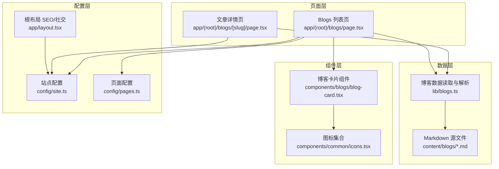
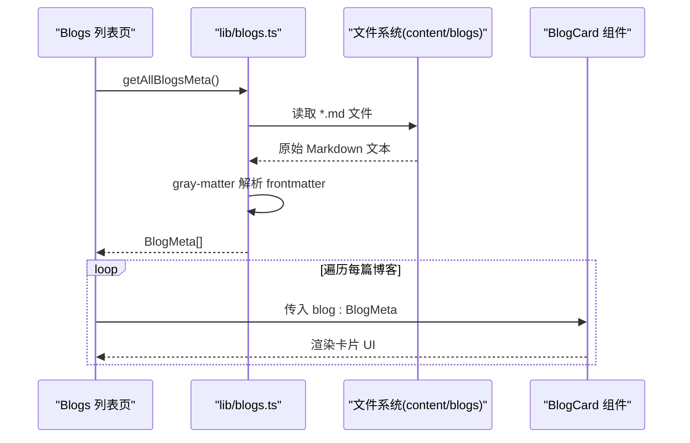
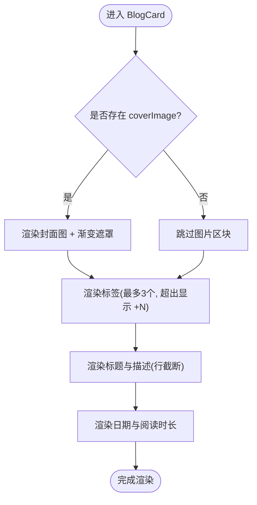
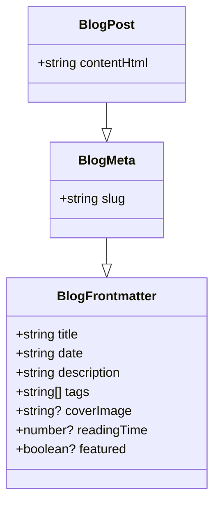
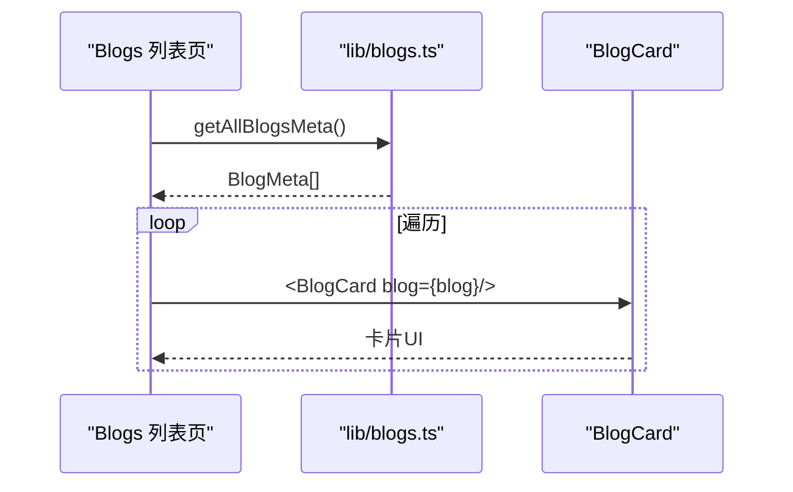
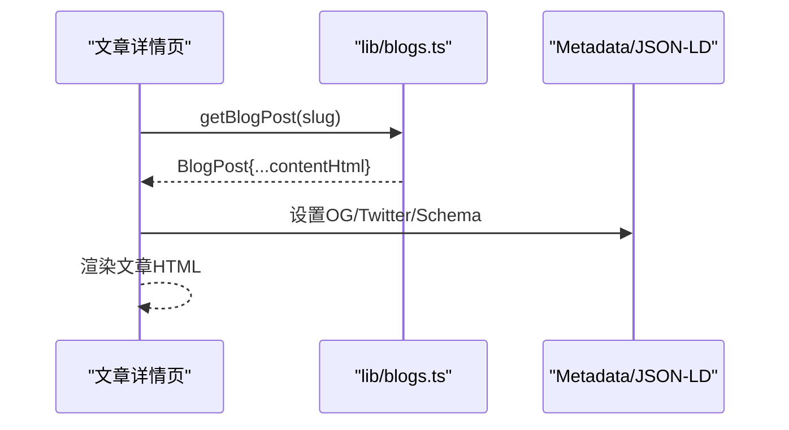
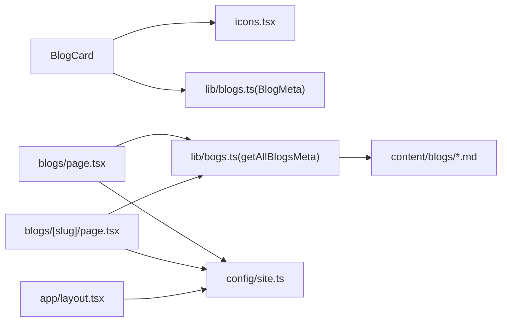

# 博客卡片组件

<cite>
**本文引用的文件**
- [components/blogs/blog-card.tsx](file://components/blogs/blog-card.tsx)
- [lib/blogs.ts](file://lib/blogs.ts)
- [app/(root)/blogs/page.tsx](file://app/(root)/blogs/page.tsx)
- [app/(root)/blogs/[slug]/page.tsx](file://app/(root)/blogs/[slug]/page.tsx)
- [content/blogs/3d-card-threejs-blender.md](file://content/blogs/3d-card-threejs-blender.md)
- [config/site.ts](file://config/site.ts)
- [config/pages.ts](file://config/pages.ts)
- [components/common/icons.tsx](file://components/common/icons.tsx)
- [app/layout.tsx](file://app/layout.tsx)
</cite>

## 目录
1. [简介](#简介)
2. [项目结构](#项目结构)
3. [核心组件](#核心组件)
4. [架构总览](#架构总览)
5. [详细组件分析](#详细组件分析)
6. [依赖关系分析](#依赖关系分析)
7. [性能考量](#性能考量)
8. [故障排查指南](#故障排查指南)
9. [结论](#结论)
10. [附录](#附录)

## 简介
本文件聚焦于博客卡片组件 BlogCard，系统性说明其功能特性与实现细节：包括文章预览、元数据展示（标题、描述、标签、日期、阅读时长）、封面图片渲染、以及从本地 Markdown 博客系统中获取数据并渲染摘要的完整流程。同时阐述该组件与博客管理系统的集成方式、数据流处理、SEO 优化与社交媒体分享能力的落地方案。

## 项目结构
BlogCard 位于组件层，负责以卡片形式呈现单篇博客的摘要信息；博客数据来源于 content/blogs 下的 Markdown 文件，通过 lib/blogs.ts 解析为结构化元数据；页面层 app/(root)/blogs/page.tsx 聚合所有博客元数据并以网格布局渲染多个 BlogCard；文章详情页 app/(root)/blogs/[slug]/page.tsx 提供单篇文章内容与 SEO 增强。站点级 SEO 与社交分享配置集中在 app/layout.tsx 与 config/site.ts。

图表来源
- [components/blogs/blog-card.tsx:1-96](file://components/blogs/blog-card.tsx#L1-L96)
- [lib/blogs.ts:1-97](file://lib/blogs.ts#L1-L97)
- [app/(root)/blogs/page.tsx:1-153](file://app/(root)/blogs/page.tsx#L1-L153)
- [app/(root)/blogs/[slug]/page.tsx:35-177](file://app/(root)/blogs/[slug]/page.tsx#L35-L177)
- [config/site.ts:1-41](file://config/site.ts#L1-L41)
- [config/pages.ts:1-86](file://config/pages.ts#L1-L86)
- [app/layout.tsx:30-97](file://app/layout.tsx#L30-L97)

章节来源
- [components/blogs/blog-card.tsx:1-96](file://components/blogs/blog-card.tsx#L1-L96)
- [lib/blogs.ts:1-97](file://lib/blogs.ts#L1-L97)
- [app/(root)/blogs/page.tsx:1-153](file://app/(root)/blogs/page.tsx#L1-L153)
- [config/site.ts:1-41](file://config/site.ts#L1-L41)
- [config/pages.ts:1-86](file://config/pages.ts#L1-L86)
- [app/layout.tsx:30-97](file://app/layout.tsx#L30-L97)

## 核心组件
- 博客卡片组件 BlogCard
  - 输入：单篇博客的元数据对象（包含 slug、title、date、description、tags、coverImage、readingTime 等）
  - 输出：可点击的卡片 UI，包含封面图、标签、标题、描述、日期、阅读时长与“Read”指示箭头
  - 交互：点击整卡跳转到对应文章详情页 /blogs/[slug]
  - 样式：响应式、悬停动效、渐变遮罩、截断显示标题与描述

章节来源
- [components/blogs/blog-card.tsx:7-96](file://components/blogs/blog-card.tsx#L7-L96)

## 架构总览
BlogCard 作为纯展示组件，不直接访问文件系统，而是由上层页面调用 lib/blogs.ts 提供的数据接口获取博客元数据后传入。数据流如下：
- 构建时或请求时，页面调用 getAllBlogsMeta() 读取 content/blogs 下所有 .md 文件的 frontmatter，生成 BlogMeta[]
- 页面将每个 BlogMeta 实例作为 props 传递给 BlogCard
- BlogCard 根据字段渲染封面图、标签、标题、描述、日期与阅读时长
- 文章详情页使用 getBlogPost(slug) 获取完整 HTML 内容并进行 SEO 注入

图表来源
- [lib/blogs.ts:35-62](file://lib/blogs.ts#L35-L62)
- [app/(root)/blogs/page.tsx:41-147](file://app/(root)/blogs/page.tsx#L41-L147)
- [components/blogs/blog-card.tsx:11-96](file://components/blogs/blog-card.tsx#L11-L96)

章节来源
- [lib/blogs.ts:35-62](file://lib/blogs.ts#L35-L62)
- [app/(root)/blogs/page.tsx:41-147](file://app/(root)/blogs/page.tsx#L41-L147)
- [components/blogs/blog-card.tsx:11-96](file://components/blogs/blog-card.tsx#L11-L96)

## 详细组件分析

### BlogCard 组件
- 功能要点
  - 封面图：条件渲染 coverImage，使用 Next.js Image 进行自适应缩放与懒加载，叠加渐变遮罩提升可读性
  - 标签：最多展示前 3 个标签，超出部分以 “+N” 提示
  - 标题与描述：限制行数显示，保证卡片高度一致
  - 元数据：格式化日期为本地化字符串，ISO 时间用于语义化 time 元素；可选显示阅读时长
  - 导航：整卡包裹 Link，指向 /blogs/[slug]
  - 无障碍：为标签区域设置 aria-label，装饰性箭头使用 aria-hidden

- 数据结构与复杂度
  - 输入类型 BlogMeta 来自 lib/blogs.ts，包含 slug、title、date、description、tags、coverImage、readingTime 等
  - 渲染复杂度 O(n) 与标签数量线性相关；整体为常量级 DOM 节点

- 错误与边界处理
  - 无 coverImage 时不渲染图片区块
  - tags 为空数组时不渲染标签区
  - readingTime 可选，未提供则隐藏阅读时长

- 性能考虑
  - 使用 Next.js Image 自动优化图片尺寸与格式
  - 避免在卡片内执行重计算，仅做轻量格式化

图表来源
- [components/blogs/blog-card.tsx:20-96](file://components/blogs/blog-card.tsx#L20-L96)

章节来源
- [components/blogs/blog-card.tsx:1-96](file://components/blogs/blog-card.tsx#L1-L96)

### 博客数据获取与解析（lib/blogs.ts）
- 能力概览
  - getAllBlogSlugs(): 列出所有 .md 文件名（不含扩展名）
  - getAllBlogsMeta(): 读取所有 .md 的 frontmatter，组装 BlogMeta[]，按 date 降序排序
  - getBlogPost(slug): 读取指定 .md 的 frontmatter 与正文，使用 remark 系列插件转换为 HTML
  - getFeaturedBlogs(): 优先返回标记 featured: true 的文章，否则取最新 3 篇
  - estimateReadingTime(content): 基于字数估算阅读时长

- 数据模型
  - BlogFrontmatter: title、date、description、tags、coverImage、readingTime、featured
  - BlogMeta: 继承 Frontmatter 并增加 slug
  - BlogPost: 继承 Meta 并增加 contentHtml

图表来源
- [lib/blogs.ts:11-27](file://lib/blogs.ts#L11-L27)

章节来源
- [lib/blogs.ts:1-97](file://lib/blogs.ts#L1-L97)

### 博客列表页与卡片集成（app/(root)/blogs/page.tsx）
- 职责
  - 调用 getAllBlogsMeta() 获取全部博客元数据
  - 使用网格布局渲染多个 BlogCard，配合动画组件 AnimatedSection
  - 注入 CollectionPage 与 BreadcrumbList 的 JSON-LD 结构化数据
  - 配置页面级 Metadata（标题、描述、Open Graph、Twitter Card）

- 数据流
  - 页面 -> lib/blogs.ts -> 文件系统 -> 返回 BlogMeta[] -> 映射到 BlogCard

图表来源
- [app/(root)/blogs/page.tsx:41-147](file://app/(root)/blogs/page.tsx#L41-L147)
- [lib/blogs.ts:44-62](file://lib/blogs.ts#L44-L62)
- [components/blogs/blog-card.tsx:11-96](file://components/blogs/blog-card.tsx#L11-L96)

章节来源
- [app/(root)/blogs/page.tsx:1-153](file://app/(root)/blogs/page.tsx#L1-L153)

### 文章详情页与 SEO/社交分享（app/(root)/blogs/[slug]/page.tsx）
- 职责
  - 根据 slug 获取完整文章内容（HTML）
  - 设置页面级 Metadata：标题、描述、作者、关键词、canonical、Open Graph、Twitter Card
  - 注入 BlogPosting 与 BreadcrumbList 的 JSON-LD 结构化数据
  - 动态 OG 图片：优先使用文章 coverImage，否则回退到站点默认图片

- 数据流
  - 页面 -> getBlogPost(slug) -> 返回 BlogPost -> 渲染内容与 SEO

图表来源
- [app/(root)/blogs/[slug]/page.tsx:35-177](file://app/(root)/blogs/[slug]/page.tsx#L35-L177)
- [lib/blogs.ts:64-82](file://lib/blogs.ts#L64-L82)

章节来源
- [app/(root)/blogs/[slug]/page.tsx:35-177](file://app/(root)/blogs/[slug]/page.tsx#L35-L177)

### Markdown 源文件与前端展示映射
- 示例文章 frontmatter 字段与 BlogCard 展示对应关系
  - title -> 卡片标题
  - description -> 卡片摘要
  - tags -> 标签列表（最多3个）
  - coverImage -> 封面图路径
  - date -> 格式化日期
  - readingTime -> 阅读时长（分钟）

章节来源
- [content/blogs/3d-card-threejs-blender.md:1-9](file://content/blogs/3d-card-threejs-blender.md#L1-L9)
- [components/blogs/blog-card.tsx:27-80](file://components/blogs/blog-card.tsx#L27-L80)

### 图标与视觉资源
- 图标来源：统一从 components/common/icons.tsx 引入，如 calendar、clock、chevronRight
- 站点品牌与社交分享图片：config/site.ts 提供 ogImage、authorName、username 等

章节来源
- [components/common/icons.tsx:71-105](file://components/common/icons.tsx#L71-L105)
- [config/site.ts:1-41](file://config/site.ts#L1-L41)

## 依赖关系分析
- 组件耦合
  - BlogCard 仅依赖图标与类型定义，低耦合、高复用
  - 列表页与详情页分别依赖 lib/blogs.ts 的不同函数，职责清晰
- 外部依赖
  - gray-matter：解析 Markdown frontmatter
  - remark/remark-gfm/remark-html：Markdown 转 HTML
  - next/image：图片优化
  - next/link：客户端路由跳转
- 可能的循环依赖
  - 当前结构无循环导入风险，组件与数据层解耦良好

图表来源
- [components/blogs/blog-card.tsx:1-96](file://components/blogs/blog-card.tsx#L1-L96)
- [lib/blogs.ts:1-97](file://lib/blogs.ts#L1-L97)
- [app/(root)/blogs/page.tsx:1-153](file://app/(root)/blogs/page.tsx#L1-L153)
- [app/(root)/blogs/[slug]/page.tsx:35-177](file://app/(root)/blogs/[slug]/page.tsx#L35-L177)
- [config/site.ts:1-41](file://config/site.ts#L1-L41)
- [app/layout.tsx:30-97](file://app/layout.tsx#L30-L97)

章节来源
- [lib/blogs.ts:1-97](file://lib/blogs.ts#L1-L97)
- [components/blogs/blog-card.tsx:1-96](file://components/blogs/blog-card.tsx#L1-L96)
- [app/(root)/blogs/page.tsx:1-153](file://app/(root)/blogs/page.tsx#L1-L153)
- [app/(root)/blogs/[slug]/page.tsx:35-177](file://app/(root)/blogs/[slug]/page.tsx#L35-L177)
- [config/site.ts:1-41](file://config/site.ts#L1-L41)
- [app/layout.tsx:30-97](file://app/layout.tsx#L30-L97)

## 性能考量
- 图片优化
  - 使用 Next.js Image 自动裁剪、压缩与懒加载，减少首屏体积
- 渲染效率
  - BlogCard 为无状态展示组件，计算量小；标签与描述截断避免重排
- 数据获取
  - getAllBlogsMeta 在构建期或请求时一次性读取所有 .md，适合中小规模博客；若文章量大，建议分页或增量构建
- SEO 与社交分享
  - 列表页与详情页均注入 Open Graph 与 Twitter Card，利于社交平台预览
  - 使用 JSON-LD 结构化数据（CollectionPage/BlogPosting/BreadcrumbList）提升搜索引擎理解度

[本节为通用指导，无需特定文件引用]

## 故障排查指南
- 卡片不显示封面图
  - 检查 Markdown frontmatter 中 coverImage 路径是否正确，且资源可被静态服务器访问
  - 确认 Next.js 图片域名白名单（如有自定义域名）
- 标签未显示或显示异常
  - 检查 tags 是否为字符串数组；为空时不会渲染
- 阅读时长未显示
  - 确保 frontmatter 中包含 readingTime；否则该区域隐藏
- 链接跳转无效
  - 确认 slug 与 content/blogs 下的文件名一致；详情页路由为 /blogs/[slug]
- SEO 不生效
  - 检查页面级 metadata 是否覆盖成功；确认 JSON-LD 已注入；验证 robots 与 canonical

章节来源
- [components/blogs/blog-card.tsx:27-80](file://components/blogs/blog-card.tsx#L27-L80)
- [lib/blogs.ts:44-82](file://lib/blogs.ts#L44-L82)
- [app/(root)/blogs/page.tsx:11-120](file://app/(root)/blogs/page.tsx#L11-L120)
- [app/(root)/blogs/[slug]/page.tsx:35-177](file://app/(root)/blogs/[slug]/page.tsx#L35-L177)

## 结论
BlogCard 是一个简洁、可复用的博客摘要卡片组件，专注于展示关键元数据与封面图，并通过 Next.js 生态实现良好的性能与可访问性。结合 lib/blogs.ts 的数据解析能力与页面层的 SEO/社交分享配置，整套方案实现了从 Markdown 源到前端展示的端到端闭环，适用于中小型个人博客与作品集网站。

[本节为总结性内容，无需特定文件引用]

## 附录
- 推荐实践
  - 保持 frontmatter 字段完整：title、date、description、tags、coverImage、readingTime
  - 为每篇文章准备合适的 OG 图片，提升社交分享效果
  - 合理使用 featured 字段控制首页推荐文章
  - 对长文启用阅读时长估算，提升用户体验

[本节为补充建议，无需特定文件引用]