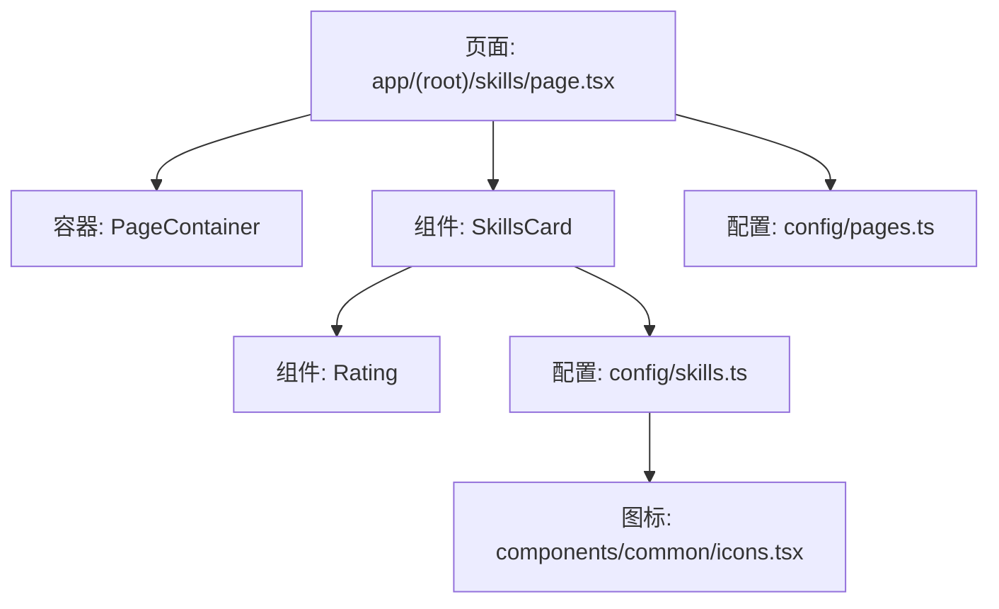
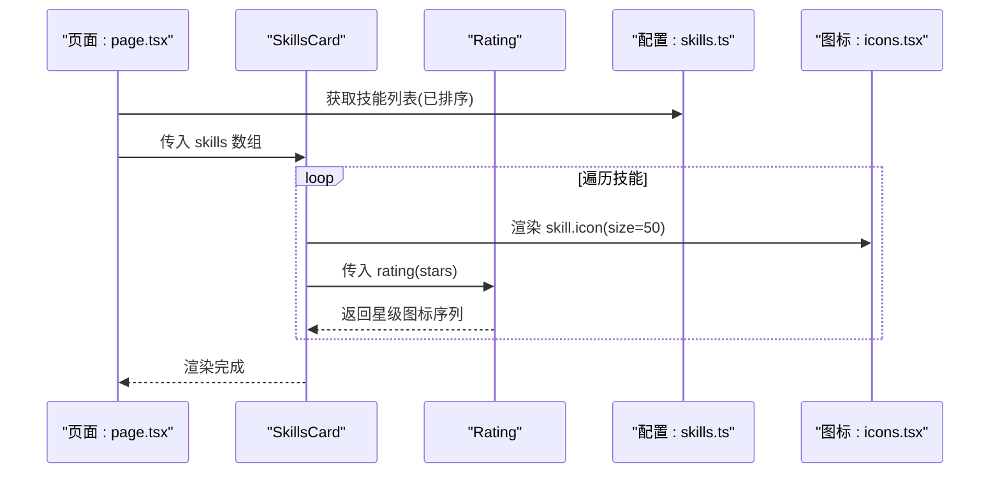
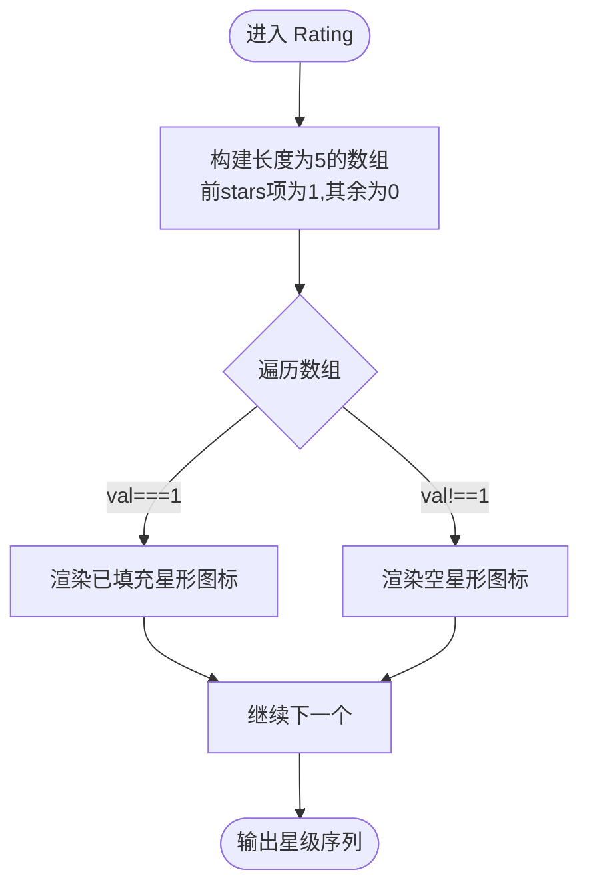
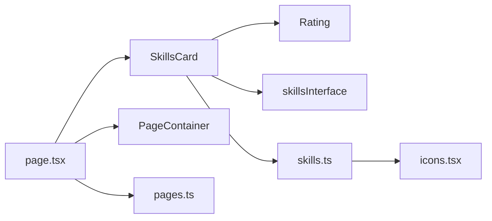

# 技能卡片组件

<cite>
**本文引用的文件**
- [skills-card.tsx](file://components/skills/skills-card.tsx)
- [rating.tsx](file://components/skills/rating.tsx)
- [skills.ts](file://config/skills.ts)
- [page.tsx](file://app/(root)/skills/page.tsx)
- [icons.tsx](file://components/common/icons.tsx)
- [pages.ts](file://config/pages.ts)
- [animated-section.tsx](file://components/common/animated-section.tsx)
- [animation-provider.tsx](file://providers/animation-provider.tsx)
</cite>

## 目录
1. [简介](#简介)
2. [项目结构](#项目结构)
3. [核心组件](#核心组件)
4. [架构总览](#架构总览)
5. [详细组件分析](#详细组件分析)
6. [依赖关系分析](#依赖关系分析)
7. [性能考量](#性能考量)
8. [故障排查指南](#故障排查指南)
9. [结论](#结论)
10. [附录](#附录)

## 简介
本文件围绕“技能卡片组件”进行系统化说明，涵盖设计理念、实现方式与使用集成。重点包括：
- 技能分类展示与排序
- 等级评分系统（星级）与可视化呈现
- 与技能配置文件的解耦集成
- 支持的技能类型与评级标准
- 动画效果与用户交互反馈机制

该组件以数据驱动为核心，通过配置化技能条目渲染卡片，并通过独立的 Rating 组件统一处理星级显示逻辑，便于扩展与维护。

## 项目结构
技能卡片功能由页面路由、组件与配置文件共同组成：
- 页面路由负责组装页面元信息与容器，并传入技能数据
- SkillsCard 组件负责将技能列表渲染为网格卡片
- Rating 组件负责根据星级数值渲染星形图标
- skills.ts 提供技能数据结构定义与数据源（含排序与精选切片）
- icons.tsx 集中管理各技术栈的图标引用
- pages.ts 提供页面标题与描述等元信息

图表来源
- [page.tsx:1-23](file://app/(root)/skills/page.tsx#L1-L23)
- [skills-card.tsx:1-31](file://components/skills/skills-card.tsx#L1-L31)
- [rating.tsx:1-41](file://components/skills/rating.tsx#L1-L41)
- [skills.ts:1-166](file://config/skills.ts#L1-L166)
- [icons.tsx:1-180](file://components/common/icons.tsx#L1-L180)
- [pages.ts:1-86](file://config/pages.ts#L1-L86)

章节来源
- [page.tsx:1-23](file://app/(root)/skills/page.tsx#L1-L23)
- [skills-card.tsx:1-31](file://components/skills/skills-card.tsx#L1-L31)
- [rating.tsx:1-41](file://components/skills/rating.tsx#L1-L41)
- [skills.ts:1-166](file://config/skills.ts#L1-L166)
- [icons.tsx:1-180](file://components/common/icons.tsx#L1-L180)
- [pages.ts:1-86](file://config/pages.ts#L1-L86)

## 核心组件
- SkillsCard：接收技能数组，按响应式网格布局渲染卡片；每张卡片包含图标、名称、描述与星级评分。
- Rating：根据传入的星级数值生成固定数量的星形图标，已填充与未填充分别用不同样式区分。
- 配置层：skills.ts 定义技能接口与数据，并提供排序后的完整列表与精选前若干项。

章节来源
- [skills-card.tsx:1-31](file://components/skills/skills-card.tsx#L1-L31)
- [rating.tsx:1-41](file://components/skills/rating.tsx#L1-L41)
- [skills.ts:1-166](file://config/skills.ts#L1-L166)

## 架构总览
技能卡片的数据流从配置到视图渲染如下：
- 页面读取配置中的技能数据与页面元信息
- 将技能数据传递给 SkillsCard
- SkillsCard 遍历渲染每个技能卡片
- 每个卡片调用 Rating 组件渲染星级
- 图标来自统一的图标集合

图表来源
- [page.tsx:1-23](file://app/(root)/skills/page.tsx#L1-L23)
- [skills-card.tsx:1-31](file://components/skills/skills-card.tsx#L1-L31)
- [rating.tsx:1-41](file://components/skills/rating.tsx#L1-L41)
- [skills.ts:1-166](file://config/skills.ts#L1-L166)
- [icons.tsx:1-180](file://components/common/icons.tsx#L1-L180)

## 详细组件分析

### SkillsCard 组件
- 设计目标：以简洁、可复用的方式将技能数据可视化为卡片网格。
- 关键特性：
  - 响应式网格：在小屏双列、大屏三列布局，保证在不同设备上的可读性。
  - 卡片内容：图标、名称、描述、星级评分。
  - 数据绑定：通过 props.skills 注入，支持任意数量技能。
- 可扩展点：
  - 可在外层包裹动画组件以实现入场动效。
  - 可增加 hover 状态或点击跳转等交互。

章节来源
- [skills-card.tsx:1-31](file://components/skills/skills-card.tsx#L1-L31)

### Rating 组件
- 设计目标：将数字星级转换为直观的星形视觉表达。
- 实现原理：
  - 基于传入的 stars 值构建长度为 5 的数组，前 stars 项标记为已填充，其余为空。
  - 已填充与未填充使用不同的颜色类名区分，形成对比清晰的星级条。
- 复杂度：时间 O(n)，空间 O(n)，其中 n=5，常数级开销。
- 可访问性：为 SVG 添加 aria-hidden，避免重复朗读。

图表来源
- [rating.tsx:1-41](file://components/skills/rating.tsx#L1-L41)

章节来源
- [rating.tsx:1-41](file://components/skills/rating.tsx#L1-L41)

### 技能配置与数据类型
- 数据结构：
  - name：技能名称
  - description：简短描述
  - rating：1~5 的整数，表示熟练度
  - icon：图标组件引用
- 数据处理：
  - 提供未排序原始列表与排序后列表（按 rating 降序）
  - 提供精选前若干项用于首页或其他区域展示
- 图标管理：
  - 所有技术栈图标集中在统一文件中，便于维护与替换

章节来源
- [skills.ts:1-166](file://config/skills.ts#L1-L166)
- [icons.tsx:1-180](file://components/common/icons.tsx#L1-L180)

### 页面集成与元信息
- 页面职责：
  - 设置页面标题与描述（来自 pages.ts）
  - 引入 SkillsCard 并传入 skills 数据
- 优势：
  - 页面与组件解耦，便于复用与测试
  - 元信息集中管理，利于 SEO 与一致性

章节来源
- [page.tsx:1-23](file://app/(root)/skills/page.tsx#L1-L23)
- [pages.ts:1-86](file://config/pages.ts#L1-L86)

### 动画与交互反馈
- 当前实现：
  - 基础卡片无内置 hover 动效，但可通过 Tailwind 类快速扩展
  - 项目提供了通用动画组件（如滚动入场），可用于包装 SkillsCard 或单个卡片
- 建议增强：
  - 为卡片增加 hover 缩放、阴影加深、边框高亮等过渡效果
  - 为 Rating 增加悬停提示（如显示具体分数或等级含义）
  - 使用滚动动画在卡片进入视口时淡入或上移

章节来源
- [animated-section.tsx:1-51](file://components/common/animated-section.tsx#L1-L51)
- [animation-provider.tsx:1-12](file://providers/animation-provider.tsx#L1-L12)

## 依赖关系分析
- SkillsCard 依赖：
  - Rating 组件：用于星级渲染
  - skillsInterface 类型：确保数据结构一致
- Rating 依赖：
  - 无外部业务依赖，仅使用样式类与 SVG
- 配置依赖：
  - skills.ts 提供数据与类型
  - icons.tsx 提供图标组件
- 页面依赖：
  - pages.ts 提供页面元信息
  - PageContainer 作为页面容器

图表来源
- [skills-card.tsx:1-31](file://components/skills/skills-card.tsx#L1-L31)
- [rating.tsx:1-41](file://components/skills/rating.tsx#L1-L41)
- [skills.ts:1-166](file://config/skills.ts#L1-L166)
- [icons.tsx:1-180](file://components/common/icons.tsx#L1-L180)
- [page.tsx:1-23](file://app/(root)/skills/page.tsx#L1-L23)
- [pages.ts:1-86](file://config/pages.ts#L1-L86)

章节来源
- [skills-card.tsx:1-31](file://components/skills/skills-card.tsx#L1-L31)
- [rating.tsx:1-41](file://components/skills/rating.tsx#L1-L41)
- [skills.ts:1-166](file://config/skills.ts#L1-L166)
- [icons.tsx:1-180](file://components/common/icons.tsx#L1-L180)
- [page.tsx:1-23](file://app/(root)/skills/page.tsx#L1-L23)
- [pages.ts:1-86](file://config/pages.ts#L1-L86)

## 性能考量
- 渲染成本：
  - SkillsCard 对每个技能进行一次渲染，整体复杂度 O(n)
  - Rating 内部循环固定长度 5，视为常数时间
- 优化建议：
  - 若技能数量较大，可对卡片进行虚拟滚动或分页加载
  - 对图标进行懒加载或按需引入，减少首屏资源体积
  - 使用 memo 包裹卡片以避免不必要的重渲染（当父级频繁更新时）

[本节为通用指导，不直接分析具体文件]

## 故障排查指南
- 问题：星级显示不正确
  - 检查传入的 stars 是否为 1~5 的整数
  - 确认 Rating 组件是否正确接收 props
- 问题：图标不显示
  - 确认对应技能的 icon 字段是否指向有效的图标组件
  - 检查图标库是否已正确安装与引入
- 问题：页面标题或描述异常
  - 核对 pages.ts 中对应页面的 title/description/metadata 配置
- 问题：动画未生效
  - 确认是否使用了客户端组件（"use client"）
  - 检查动画组件是否被正确包裹并触发滚动条件

章节来源
- [rating.tsx:1-41](file://components/skills/rating.tsx#L1-L41)
- [icons.tsx:1-180](file://components/common/icons.tsx#L1-L180)
- [pages.ts:1-86](file://config/pages.ts#L1-L86)
- [animated-section.tsx:1-51](file://components/common/animated-section.tsx#L1-L51)

## 结论
技能卡片组件采用数据驱动与组件解耦的设计，清晰地将展示逻辑与配置分离。通过 Rating 组件统一星级渲染，提升了可维护性与一致性。配合配置化的技能数据与图标管理，能够快速扩展新的技能条目。未来可在交互与动画方面进一步增强用户体验，例如 hover 效果、滚动入场与工具提示等。

[本节为总结性内容，不直接分析具体文件]

## 附录
- 支持的技能类型：前端框架、后端框架、数据库、云服务、UI 库、语言与工具等，均在配置中以相同结构声明。
- 评级标准：1~5 整数，数值越高代表越熟练；排序默认按 rating 降序展示。
- 推荐实践：
  - 保持描述简洁明确，突出技能用途
  - 合理设置星级，避免过度夸大
  - 为新技能补充图标与描述，保持风格一致

[本节为补充说明，不直接分析具体文件]