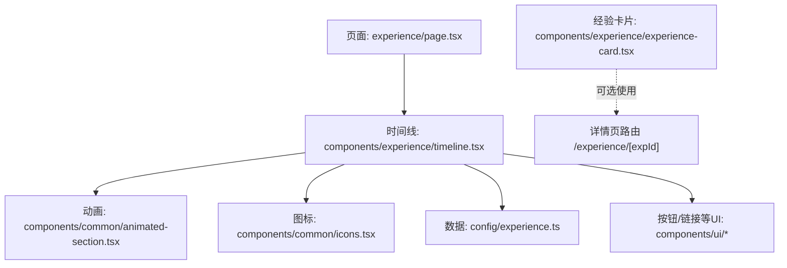
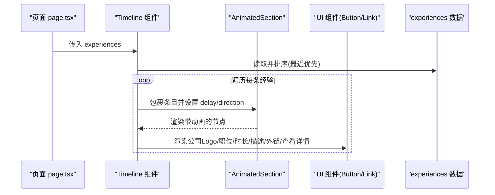
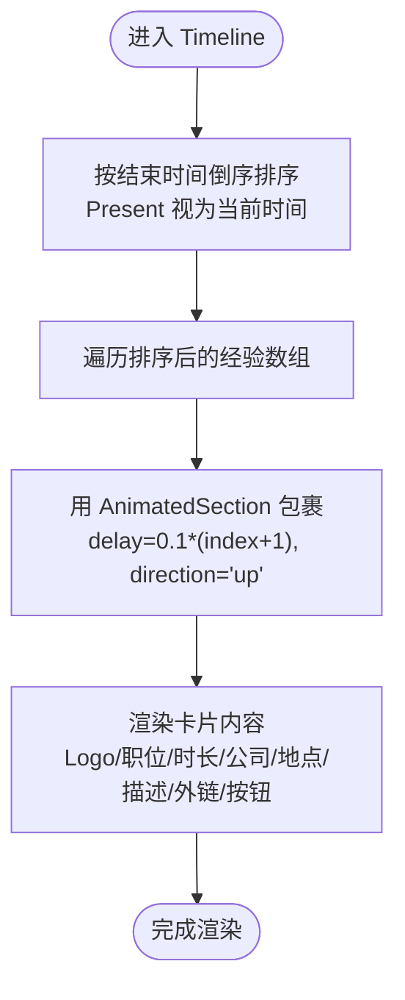
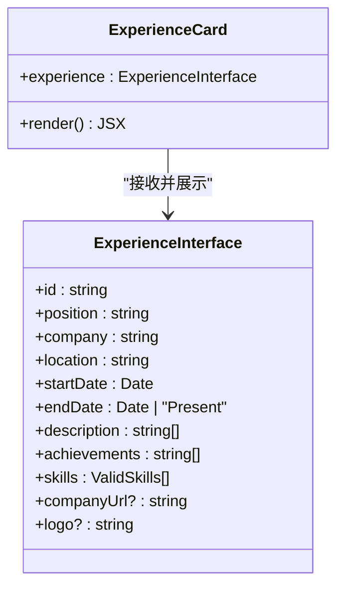
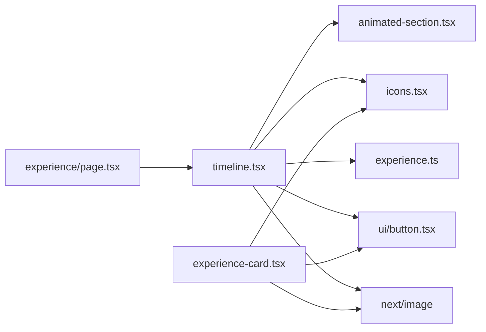

# 时间线组件

<cite>
**本文引用的文件**
- [timeline.tsx](file://components/experience/timeline.tsx)
- [experience-card.tsx](file://components/experience/experience-card.tsx)
- [experience.ts](file://config/experience.ts)
- [page.tsx](file://app/(root)/experience/page.tsx)
- [animated-section.tsx](file://components/common/animated-section.tsx)
- [icons.tsx](file://components/common/icons.tsx)
- [constants.ts](file://config/constants.ts)
</cite>

## 目录
1. [简介](#简介)
2. [项目结构](#项目结构)
3. [核心组件](#核心组件)
4. [架构总览](#架构总览)
5. [详细组件分析](#详细组件分析)
6. [依赖关系分析](#依赖关系分析)
7. [性能考量](#性能考量)
8. [故障排查指南](#故障排查指南)
9. [结论](#结论)
10. [附录](#附录)

## 简介
本文件面向“经验时间线”功能，系统性说明 Timeline 组件的架构设计与实现原理，涵盖：
- 时间轴渲染与数据排序
- 经验卡片展示（Timeline 与 ExperienceCard）
- 动画效果与滚动入场
- 交互体验（查看详情跳转、外链打开）
- 响应式适配与可访问性要点
- 数据模型与传递机制

该组件基于 Next.js 客户端组件构建，使用 Tailwind CSS 进行样式布局，结合 motion/react 提供滚动入场动画。

## 项目结构
经验时间线相关代码主要分布在以下位置：
- 页面入口：app/(root)/experience/page.tsx
- 时间线容器：components/experience/timeline.tsx
- 经验卡片：components/experience/experience-card.tsx
- 数据定义：config/experience.ts
- 动画封装：components/common/animated-section.tsx
- 图标资源：components/common/icons.tsx
- 技能类型约束：config/constants.ts

图表来源
- [page.tsx:1-34](file://app/(root)/experience/page.tsx#L1-L34)
- [timeline.tsx:1-117](file://components/experience/timeline.tsx#L1-L117)
- [animated-section.tsx:1-51](file://components/common/animated-section.tsx#L1-L51)
- [icons.tsx:1-180](file://components/common/icons.tsx#L1-L180)
- [experience.ts:1-93](file://config/experience.ts#L1-L93)

章节来源
- [page.tsx:1-34](file://app/(root)/experience/page.tsx#L1-L34)
- [timeline.tsx:1-117](file://components/experience/timeline.tsx#L1-L117)

## 核心组件
- Timeline：负责接收经验数据、排序、渲染时间线列表，并为每个条目包裹动画容器。
- ExperienceCard：用于在其它场景（如列表或详情摘要）中展示单条经验的卡片视图。
- AnimatedSection：基于 motion/react 的滚动入场动画封装，支持方向与延迟配置。
- 数据模型 ExperienceInterface：统一描述一条经验的字段与类型约束。

章节来源
- [timeline.tsx:28-117](file://components/experience/timeline.tsx#L28-L117)
- [experience-card.tsx:27-112](file://components/experience/experience-card.tsx#L27-L112)
- [animated-section.tsx:6-51](file://components/common/animated-section.tsx#L6-L51)
- [experience.ts:3-15](file://config/experience.ts#L3-L15)

## 架构总览
时间线组件的数据流与渲染流程如下：

图表来源
- [page.tsx:24-31](file://app/(root)/experience/page.tsx#L24-L31)
- [timeline.tsx:32-112](file://components/experience/timeline.tsx#L32-L112)
- [animated-section.tsx:14-49](file://components/common/animated-section.tsx#L14-L49)

## 详细组件分析

### Timeline 组件
职责与行为
- 数据排序：按结束时间倒序排列，当前仍在任的用“Present”参与比较，保证最新在前。
- 时间文本生成：将开始日期与结束日期（或 Present）转换为“YYYY - YYYY/Present”。
- 列表渲染：为每条经验创建卡片容器，包含 Logo、职位、公司、地点、首段描述、外链、查看详情按钮。
- 动画：每个条目由 AnimatedSection 包裹，按索引递增延迟，自下而上淡入。
- 交互：点击“查看详情”跳转到 /experience/[id]；公司外链在新标签页打开。

关键实现要点
- 排序稳定性：对 endDate 为字符串的情况做特殊处理，避免 Date 构造异常。
- 响应式布局：移动端纵向堆叠，桌面端横向对齐，按钮在小屏全宽。
- 可访问性：外链使用 target="_blank" 并配合 rel="noopener noreferrer"；图片 alt 使用公司名称。

图表来源
- [timeline.tsx:12-38](file://components/experience/timeline.tsx#L12-L38)
- [timeline.tsx:40-112](file://components/experience/timeline.tsx#L40-L112)

章节来源
- [timeline.tsx:12-117](file://components/experience/timeline.tsx#L12-L117)

### ExperienceCard 子组件
作用
- 以紧凑卡片形式展示单条经验的关键信息：Logo、职位、公司、地点、时长、首段描述、部分技能标签、查看详情按钮。
- 适用于非时间线场景的独立展示（例如首页精选、侧边栏推荐）。

数据传递
- 通过 props 接收单个 ExperienceInterface 对象。
- 内部复用与 Timeline 相同的“时长文本”计算逻辑，保持展示一致性。

响应式与交互
- 小屏幕技能标签最多显示前两项，超出则以“+N more”提示。
- 外链同样采用安全打开方式；查看详情跳转至 /experience/[id]。

图表来源
- [experience-card.tsx:27-112](file://components/experience/experience-card.tsx#L27-L112)
- [experience.ts:3-15](file://config/experience.ts#L3-L15)

章节来源
- [experience-card.tsx:27-112](file://components/experience/experience-card.tsx#L27-L112)
- [experience.ts:3-15](file://config/experience.ts#L3-L15)

### 动画与滚动入场
- 使用 motion/react 的 motion.div 实现滚动可见时淡入与位移归位。
- 支持方向 up/down/left/right，默认向上；viewport 阈值与 once 策略确保仅触发一次。
- Timeline 为每个条目设置递增延迟，形成瀑布式入场效果。

章节来源
- [animated-section.tsx:6-51](file://components/common/animated-section.tsx#L6-L51)
- [timeline.tsx:43-47](file://components/experience/timeline.tsx#L43-L47)

### 数据模型与常量
- ExperienceInterface：定义经验数据结构，包括起止时间、描述、成就、技能、公司信息与 Logo。
- ValidSkills：限制技能字段的取值范围，提升类型安全。
- 数据源：experiences 数组提供示例数据，供页面与组件消费。

章节来源
- [experience.ts:3-93](file://config/experience.ts#L3-L93)
- [constants.ts:1-63](file://config/constants.ts#L1-L63)

## 依赖关系分析
- 页面层：experience/page.tsx 引入 Timeline 与 experiences，作为根容器渲染。
- 组件层：
  - Timeline 依赖 AnimatedSection、Icons、Button、Link、Next/Image。
  - ExperienceCard 依赖 Icons、Button、Link、Next/Image。
- 数据层：ExperienceInterface 来自 config/experience.ts，ValidSkills 来自 config/constants.ts。
- 外部库：motion/react 提供动画能力；Tailwind CSS 提供样式；Lucide/React-icons 提供图标。

图表来源
- [page.tsx:1-34](file://app/(root)/experience/page.tsx#L1-L34)
- [timeline.tsx:1-117](file://components/experience/timeline.tsx#L1-L117)
- [experience-card.tsx:1-112](file://components/experience/experience-card.tsx#L1-L112)
- [animated-section.tsx:1-51](file://components/common/animated-section.tsx#L1-L51)
- [icons.tsx:1-180](file://components/common/icons.tsx#L1-L180)
- [experience.ts:1-93](file://config/experience.ts#L1-L93)

章节来源
- [page.tsx:1-34](file://app/(root)/experience/page.tsx#L1-L34)
- [timeline.tsx:1-117](file://components/experience/timeline.tsx#L1-L117)
- [experience-card.tsx:1-112](file://components/experience/experience-card.tsx#L1-L112)

## 性能考量
- 排序开销：每次渲染都会对数据进行排序，若数据量较大可考虑在页面层缓存排序结果或使用 useMemo。
- 图片加载：Logo 使用 Next/Image 优化加载；建议为不同尺寸提供合适尺寸的图片资源。
- 动画触发：AnimatedSection 使用 viewport 阈值与 once 策略，避免重复动画带来的重排。
- 长列表渲染：若未来经验数量增长，可考虑虚拟滚动或分页加载以减少首屏压力。

[本节为通用性能建议，不直接分析具体文件]

## 故障排查指南
- 外链未正确打开或安全风险：确认外链使用 target="_blank" 且带有 rel="noopener noreferrer"。
- 时间文本异常：检查 startDate/endDate 是否为有效 Date 或字符串 "Present"。
- 动画不生效：确认组件处于视口内且未被父级 display:none 隐藏；检查 motion 版本与浏览器兼容性。
- 图片不显示：确认 logo 路径存在且可访问；Next/Image 要求固定宽高或容器有明确尺寸。
- 类型错误：确保 skills 值属于 ValidSkills 枚举集合，避免编译期报错。

章节来源
- [timeline.tsx:78-86](file://components/experience/timeline.tsx#L78-L86)
- [experience-card.tsx:52-60](file://components/experience/experience-card.tsx#L52-L60)
- [experience.ts:3-15](file://config/experience.ts#L3-L15)
- [constants.ts:1-63](file://config/constants.ts#L1-L63)

## 结论
Timeline 组件以清晰的数据驱动和模块化设计实现了经验时间线的渲染与交互：
- 通过排序与动画增强可读性与浏览体验
- 借助 ExperienceCard 提供一致的卡片展示模式
- 利用响应式布局与外链安全策略提升可用性与安全性
- 基于类型系统保障数据一致性与可维护性

在实际使用中，可根据业务需求扩展更多交互（如筛选、搜索、展开详情），并结合懒加载与虚拟化优化大规模数据场景。

[本节为总结性内容，不直接分析具体文件]

## 附录
- 页面元信息：experience/page.tsx 设置了标题、描述与关键词，利于 SEO。
- 路由约定：查看详情使用 /experience/[expId]，需确保对应路由存在。
- 主题与样式：整体样式基于 Tailwind CSS 语义化类名，便于切换主题与适配暗色模式。

章节来源
- [page.tsx:9-22](file://app/(root)/experience/page.tsx#L9-L22)