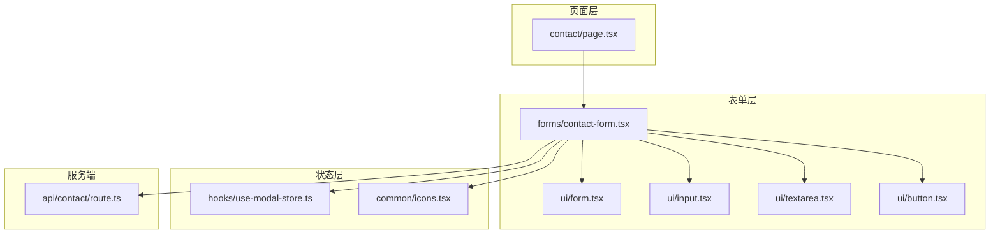
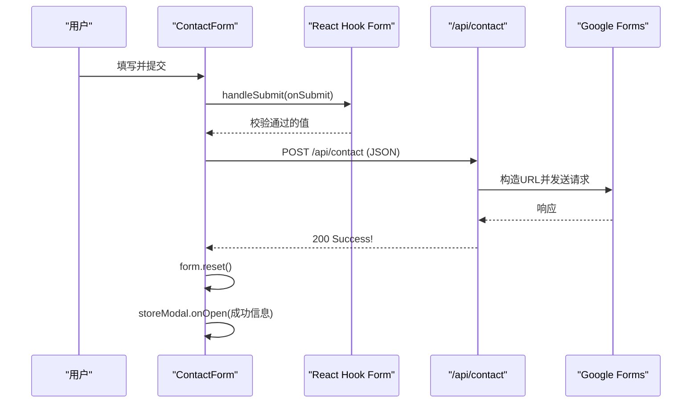
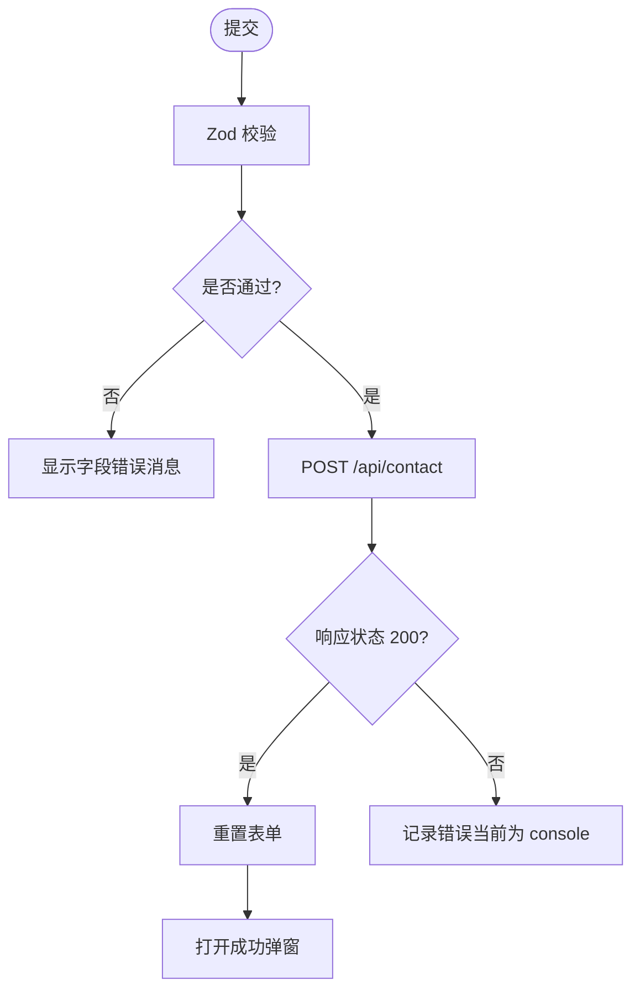
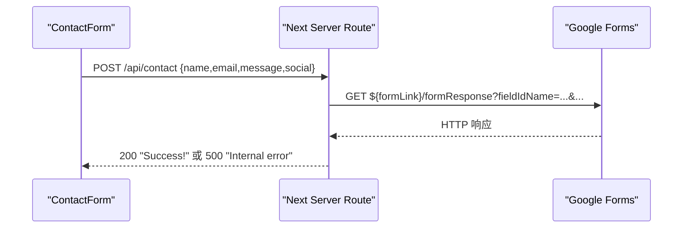
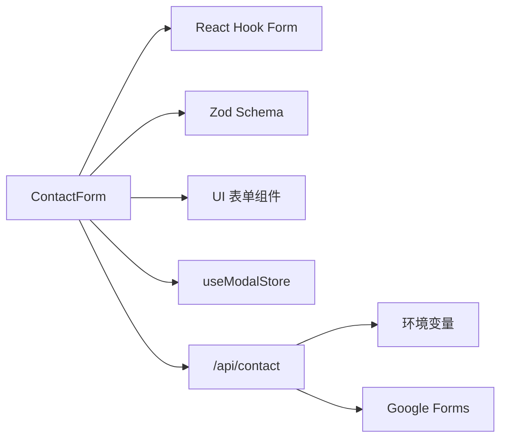

# 联系表单组件

<cite>
**本文引用的文件**
- [components/forms/contact-form.tsx](file://components/forms/contact-form.tsx)
- [app/api/contact/route.ts](file://app/api/contact/route.ts)
- [app/(root)/contact/page.tsx](file://app/(root)/contact/page.tsx)
- [components/ui/form.tsx](file://components/ui/form.tsx)
- [components/ui/input.tsx](file://components/ui/input.tsx)
- [components/ui/textarea.tsx](file://components/ui/textarea.tsx)
- [components/ui/button.tsx](file://components/ui/button.tsx)
- [hooks/use-modal-store.ts](file://hooks/use-modal-store.ts)
- [components/common/icons.tsx](file://components/common/icons.tsx)
- [config/pages.ts](file://config/pages.ts)
</cite>

## 目录
1. [简介](#简介)
2. [项目结构](#项目结构)
3. [核心组件](#核心组件)
4. [架构总览](#架构总览)
5. [详细组件分析](#详细组件分析)
6. [依赖关系分析](#依赖关系分析)
7. [性能考虑](#性能考虑)
8. [故障排查指南](#故障排查指南)
9. [结论](#结论)
10. [附录：定制与扩展指南](#附录定制与扩展指南)

## 简介
本文件面向“联系表单”功能，系统性说明 ContactForm 组件的表单处理逻辑、验证机制、API 集成方式、字段定义、错误处理、成功提交反馈、状态管理、防重复提交与安全措施，并提供定制与扩展指导。该功能基于 Next.js App Router，前端使用 React Hook Form + Zod 进行类型安全校验，后端通过 Server Route 将数据转发至 Google Forms。

## 项目结构
联系表单由页面路由、表单组件、UI 基础组件、状态存储和 API 路由共同组成：
- 页面路由：展示表单并与右侧卡片并列布局
- 表单组件：负责字段渲染、校验、提交与结果反馈
- UI 组件：提供可复用的输入、文本域、按钮与表单容器
- 状态存储：用于打开成功提示弹窗
- API 路由：接收请求并转发到 Google Forms

图表来源
- [app/(root)/contact/page.tsx:13-29](file://app/(root)/contact/page.tsx#L13-L29)
- [components/forms/contact-form.tsx:32-141](file://components/forms/contact-form.tsx#L32-L141)
- [components/ui/form.tsx:16-177](file://components/ui/form.tsx#L16-L177)
- [components/ui/input.tsx:8-23](file://components/ui/input.tsx#L8-L23)
- [components/ui/textarea.tsx:8-22](file://components/ui/textarea.tsx#L8-L22)
- [components/ui/button.tsx:42-54](file://components/ui/button.tsx#L42-L54)
- [hooks/use-modal-store.ts:22-35](file://hooks/use-modal-store.ts#L22-L35)
- [app/api/contact/route.ts:3-30](file://app/api/contact/route.ts#L3-L30)

章节来源
- [app/(root)/contact/page.tsx:1-30](file://app/(root)/contact/page.tsx#L1-L30)
- [components/forms/contact-form.tsx:1-142](file://components/forms/contact-form.tsx#L1-L142)

## 核心组件
- ContactForm：基于 React Hook Form 与 Zod 的类型安全表单，包含 name、email、message、social 四个字段；提交时调用 /api/contact 并将响应状态用于触发成功弹窗；提交成功后重置表单。
- 表单容器与字段：封装了 Form、FormField、FormItem、FormLabel、FormControl、FormMessage，统一错误消息显示与无障碍属性。
- 输入控件：Input、Textarea、Button 提供一致的样式与交互行为。
- 状态管理：useModalStore 控制成功提示弹窗的开关与内容。
- 图标资源：Icons.successAnimated 用于成功提示。

章节来源
- [components/forms/contact-form.tsx:21-71](file://components/forms/contact-form.tsx#L21-L71)
- [components/ui/form.tsx:16-177](file://components/ui/form.tsx#L16-L177)
- [components/ui/input.tsx:8-23](file://components/ui/input.tsx#L8-L23)
- [components/ui/textarea.tsx:8-22](file://components/ui/textarea.tsx#L8-L22)
- [components/ui/button.tsx:42-54](file://components/ui/button.tsx#L42-L54)
- [hooks/use-modal-store.ts:22-35](file://hooks/use-modal-store.ts#L22-L35)
- [components/common/icons.tsx:149-173](file://components/common/icons.tsx#L149-L173)

## 架构总览
用户在前端填写表单，React Hook Form 根据 Zod Schema 进行校验；校验通过后，组件以 JSON 形式 POST 到 /api/contact；后端读取环境变量中的 Google Forms 链接与字段 ID，拼接查询参数后发起请求；成功时返回 200，前端据此打开成功弹窗并清空表单。

图表来源
- [components/forms/contact-form.tsx:48-71](file://components/forms/contact-form.tsx#L48-L71)
- [app/api/contact/route.ts:3-30](file://app/api/contact/route.ts#L3-L30)

## 详细组件分析

### 表单字段定义与校验
- 字段
  - name：必填字符串，最小长度限制
  - email：必填邮箱格式
  - message：必填字符串，最小长度限制
  - social：可选 URL，允许空字符串
- 校验策略
  - 使用 Zod Schema 定义字段规则
  - 通过 zodResolver 接入 React Hook Form
  - 每个字段通过 FormField/FormMessage 展示错误信息

图表来源
- [components/forms/contact-form.tsx:21-30](file://components/forms/contact-form.tsx#L21-L30)
- [components/forms/contact-form.tsx:48-71](file://components/forms/contact-form.tsx#L48-L71)
- [components/ui/form.tsx:144-166](file://components/ui/form.tsx#L144-L166)

章节来源
- [components/forms/contact-form.tsx:21-30](file://components/forms/contact-form.tsx#L21-L30)
- [components/ui/form.tsx:144-166](file://components/ui/form.tsx#L144-L166)

### 用户输入验证
- 实时/提交时校验：React Hook Form 在提交时执行 Zod 校验，并在 FormMessage 中展示错误
- 字段级错误：每个 FormField 绑定 FormMessage，自动获取对应字段的错误信息
- 无障碍支持：FormControl 设置 aria-invalid 等属性，提升可访问性

章节来源
- [components/ui/form.tsx:42-63](file://components/ui/form.tsx#L42-L63)
- [components/ui/form.tsx:104-124](file://components/ui/form.tsx#L104-L124)
- [components/ui/form.tsx:144-166](file://components/ui/form.tsx#L144-L166)

### API 集成方式与通信协议
- 前端请求
  - 方法：POST
  - 路径：/api/contact
  - 头部：Content-Type: application/json
  - 主体：{ name, email, message, social }
- 后端处理
  - 从环境变量读取 Google Forms 链接与各字段 ID
  - 拼接查询参数并发起请求
  - 成功返回 200 与 JSON 文本
  - 失败返回 500 与错误文本
- 前端响应处理
  - 仅判断 status === 200 即视为成功
  - 成功后重置表单并打开成功弹窗
  - 异常捕获仅输出到控制台

图表来源
- [components/forms/contact-form.tsx:48-71](file://components/forms/contact-form.tsx#L48-L71)
- [app/api/contact/route.ts:3-30](file://app/api/contact/route.ts#L3-L30)

章节来源
- [components/forms/contact-form.tsx:48-71](file://components/forms/contact-form.tsx#L48-L71)
- [app/api/contact/route.ts:3-30](file://app/api/contact/route.ts#L3-L30)

### 错误处理与成功反馈
- 前端错误
  - 网络或解析异常：catch 分支打印错误日志
  - 非 200 响应：不触发成功弹窗（当前未区分业务错误码）
- 后端错误
  - 缺少环境变量：返回 500
  - 外部请求异常：返回 500
- 成功反馈
  - 使用 useModalStore 打开成功弹窗，标题与描述固定文案，图标使用成功动画图标

章节来源
- [components/forms/contact-form.tsx:48-71](file://components/forms/contact-form.tsx#L48-L71)
- [hooks/use-modal-store.ts:22-35](file://hooks/use-modal-store.ts#L22-L35)
- [components/common/icons.tsx:149-173](file://components/common/icons.tsx#L149-L173)
- [app/api/contact/route.ts:3-30](file://app/api/contact/route.ts#L3-L30)

### 表单状态管理
- 表单状态：由 React Hook Form 维护，包括值、校验状态、提交状态等
- 全局弹窗状态：useModalStore 集中管理弹窗开关与内容
- 页面元信息：contact 页面的标题与描述来自配置

章节来源
- [components/forms/contact-form.tsx:32-45](file://components/forms/contact-form.tsx#L32-L45)
- [hooks/use-modal-store.ts:22-35](file://hooks/use-modal-store.ts#L22-L35)
- [config/pages.ts:41-48](file://config/pages.ts#L41-L48)

### 防重复提交
- 现状：当前实现未禁用提交按钮或阻止重复提交
- 建议方案
  - 在提交期间禁用按钮
  - 使用本地状态或表单库提供的 isSubmitting 标志
  - 可选：增加节流/去抖或一次性令牌

章节来源
- [components/forms/contact-form.tsx:48-71](file://components/forms/contact-form.tsx#L48-L71)
- [components/ui/button.tsx:42-54](file://components/ui/button.tsx#L42-L54)

### 安全防护措施
- 输入校验：Zod 对字段类型与格式进行校验，减少非法输入
- 环境变量隔离：Google Forms 链接与字段 ID 通过环境变量注入，避免硬编码
- 传输安全：生产环境应启用 HTTPS，确保前后端通信加密
- 建议增强
  - 在后端对输入做二次校验与清洗
  - 添加速率限制与验证码，防止滥用
  - 对敏感信息进行脱敏与最小化传输

章节来源
- [components/forms/contact-form.tsx:21-30](file://components/forms/contact-form.tsx#L21-L30)
- [app/api/contact/route.ts:3-30](file://app/api/contact/route.ts#L3-L30)

## 依赖关系分析
- 组件耦合
  - ContactForm 依赖 UI 表单容器与输入控件，解耦良好
  - 通过 useModalStore 与弹窗系统松耦合
  - 通过 fetch 与 API 路由通信，接口清晰
- 外部依赖
  - React Hook Form、Zod、zodResolver
  - Radix UI 标签与插槽（通过 ui/form.tsx）
  - Lucide 图标与自定义成功动画图标
- 潜在风险
  - 后端强依赖环境变量配置，缺失会导致 500
  - 前端未对非 200 响应做差异化处理

图表来源
- [components/forms/contact-form.tsx:3-19](file://components/forms/contact-form.tsx#L3-L19)
- [app/api/contact/route.ts:3-30](file://app/api/contact/route.ts#L3-L30)

章节来源
- [components/forms/contact-form.tsx:3-19](file://components/forms/contact-form.tsx#L3-L19)
- [app/api/contact/route.ts:3-30](file://app/api/contact/route.ts#L3-L30)

## 性能考虑
- 客户端校验：Zod 校验开销低，且仅在提交时执行，影响小
- 网络请求：每次提交都会发起一次后端转发请求，注意并发与重试策略
- 状态更新：成功后重置表单并打开弹窗，属于轻量操作
- 优化建议
  - 添加提交中禁用按钮，避免重复请求
  - 对后端响应进行超时与重试控制
  - 对大文本消息进行长度限制与压缩

[本节为通用性能建议，无需特定文件引用]

## 故障排查指南
- 常见问题
  - 环境变量未配置：后端返回 500，检查 GOOGLE_FORM_LINK 及字段 ID 环境变量
  - 网络错误：前端 catch 分支会打印错误，检查浏览器控制台与网络面板
  - 非 200 响应：当前不会触发成功弹窗，需检查后端返回状态
- 定位步骤
  - 确认前端表单校验是否通过（查看 FormMessage）
  - 检查 /api/contact 的网络请求与响应
  - 核对 Google Forms 链接与字段 ID 是否正确
- 改进建议
  - 将错误信息提升到用户可见区域（如 Toast）
  - 区分网络错误与业务错误，提供更明确的提示

章节来源
- [components/forms/contact-form.tsx:48-71](file://components/forms/contact-form.tsx#L48-L71)
- [app/api/contact/route.ts:3-30](file://app/api/contact/route.ts#L3-L30)

## 结论
ContactForm 采用 React Hook Form + Zod 实现了类型安全的表单校验，并通过 Next.js Server Route 将数据转发至 Google Forms。整体结构清晰、职责分离明确。当前实现已具备基本的数据收集与成功反馈能力，建议在防重复提交、错误可视化、速率限制与安全性方面进一步增强，以提升健壮性与用户体验。

[本节为总结性内容，无需特定文件引用]

## 附录：定制与扩展指南
- 新增字段
  - 在 Zod Schema 中添加新字段与校验规则
  - 在表单中新增 FormField 与对应的 UI 控件
  - 在后端 route 中解析并转发新字段
- 修改校验规则
  - 调整 Zod 规则（如最小长度、格式）
  - 更新 FormMessage 的错误提示
- 自定义错误展示
  - 将 console.log 替换为 Toast 或模态提示
  - 根据响应状态码展示不同错误信息
- 防重复提交
  - 在提交期间禁用按钮或使用 isSubmitting
  - 可增加节流或一次性令牌
- 安全加固
  - 后端增加输入清洗与二次校验
  - 添加速率限制与验证码
  - 启用 HTTPS 并限制跨域访问

章节来源
- [components/forms/contact-form.tsx:21-30](file://components/forms/contact-form.tsx#L21-L30)
- [components/forms/contact-form.tsx:48-71](file://components/forms/contact-form.tsx#L48-L71)
- [app/api/contact/route.ts:3-30](file://app/api/contact/route.ts#L3-L30)