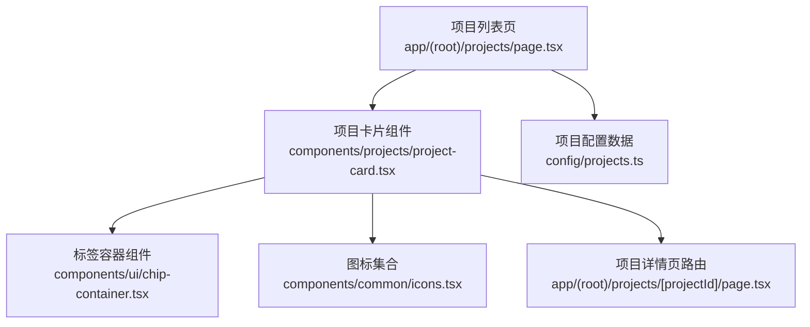
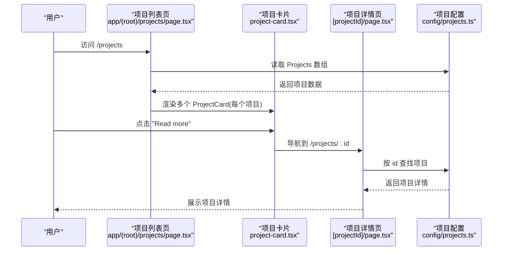
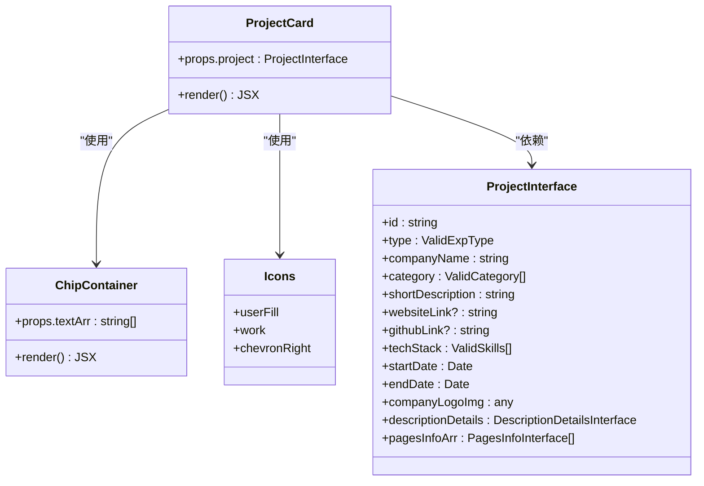

# 项目卡片组件

<cite>
**本文引用的文件**
- [components/projects/project-card.tsx](file://components/projects/project-card.tsx)
- [config/projects.ts](file://config/projects.ts)
- [app/(root)/projects/page.tsx](file://app/(root)/projects/page.tsx)
- [app/(root)/projects/[projectId]/page.tsx](file://app/(root)/projects/[projectId]/page.tsx)
- [components/ui/chip-container.tsx](file://components/ui/chip-container.tsx)
- [config/constants.ts](file://config/constants.ts)
- [components/common/icons.tsx](file://components/common/icons.tsx)
</cite>

## 目录
1. [简介](#简介)
2. [项目结构](#项目结构)
3. [核心组件](#核心组件)
4. [架构总览](#架构总览)
5. [详细组件分析](#详细组件分析)
6. [依赖关系分析](#依赖关系分析)
7. [性能考量](#性能考量)
8. [故障排查指南](#故障排查指南)
9. [结论](#结论)
10. [附录](#附录)

## 简介
本项目卡片组件（ProjectCard）用于在“项目”页面中以卡片形式展示每个项目的关键信息，包括项目图片、标题、简短描述、技术/分类标签以及类型标识。点击“Read more”按钮可导航至对应的项目详情页。该组件与配置文件中的项目数据紧密集成，并通过响应式布局适配不同屏幕尺寸。

## 项目结构
- 组件位置：components/projects/project-card.tsx
- 数据来源：config/projects.ts（包含项目数组与类型定义）
- 使用页面：app/(root)/projects/page.tsx（列表页渲染多个 ProjectCard）
- 详情跳转：app/(root)/projects/[projectId]/page.tsx（根据 id 路由到详情页）
- 标签展示：components/ui/chip-container.tsx（将字符串数组渲染为标签）
- 类型常量：config/constants.ts（ValidCategory、ValidExpType、ValidSkills）
- 图标资源：components/common/icons.tsx（用户/工作等图标）

图表来源
- [app/(root)/projects/page.tsx:14-28](file://app/(root)/projects/page.tsx#L14-L28)
- [components/projects/project-card.tsx:13-49](file://components/projects/project-card.tsx#L13-L49)
- [components/ui/chip-container.tsx:7-14](file://components/ui/chip-container.tsx#L7-L14)
- [config/projects.ts:14-28](file://config/projects.ts#L14-L28)
- [app/(root)/projects/[projectId]/page.tsx:23-28](file://app/(root)/projects/[projectId]/page.tsx#L23-L28)

章节来源
- [app/(root)/projects/page.tsx:14-28](file://app/(root)/projects/page.tsx#L14-L28)
- [components/projects/project-card.tsx:13-49](file://components/projects/project-card.tsx#L13-L49)
- [config/projects.ts:14-28](file://config/projects.ts#L14-L28)

## 核心组件
ProjectCard 是一个无状态函数组件，接收单个项目对象作为 props，并负责：
- 展示项目封面图（固定高度、自适应填充）
- 显示项目名称与简短描述（最多三行截断）
- 渲染分类标签（通过 ChipContainer）
- 提供“Read more”按钮，链接到项目详情页
- 在右下角显示类型标识（个人/职业），使用不同图标

章节来源
- [components/projects/project-card.tsx:9-49](file://components/projects/project-card.tsx#L9-L49)

## 架构总览
项目卡片组件位于 UI 层，依赖配置数据与通用 UI 组件，遵循 Next.js App Router 的页面组织方式。列表页从配置中读取项目数据并按类型筛选后渲染多个卡片；卡片通过 next/link 跳转到动态路由的项目详情页。

图表来源
- [app/(root)/projects/page.tsx:14-28](file://app/(root)/projects/page.tsx#L14-L28)
- [components/projects/project-card.tsx:34-39](file://components/projects/project-card.tsx#L34-L39)
- [app/(root)/projects/[projectId]/page.tsx:23-28](file://app/(root)/projects/[projectId]/page.tsx#L23-L28)
- [config/projects.ts:14-28](file://config/projects.ts#L14-L28)

## 详细组件分析

### 组件 Props 接口与数据绑定
- Props 接口：仅接受一个 project 属性，类型为 ProjectInterface。
- 数据绑定：
  - 图片：companyLogoImg 作为封面图
  - 标题：companyName
  - 描述：shortDescription（限制行数）
  - 标签：category（字符串数组，交由 ChipContainer 渲染）
  - 导航：href 基于项目 id 拼接 /projects/:id
  - 类型标识：type 决定右下角图标（Personal 或 Professional）

章节来源
- [components/projects/project-card.tsx:9-11](file://components/projects/project-card.tsx#L9-L11)
- [components/projects/project-card.tsx:13-49](file://components/projects/project-card.tsx#L13-L49)
- [config/projects.ts:14-28](file://config/projects.ts#L14-L28)

### 项目展示布局
- 外层容器：相对定位、内边距、背景色、边框、圆角、全宽、等高列（flex-grow）
- 图片区域：固定高度、相对定位、图片铺满并裁剪
- 内容区域：垂直排列，标题加粗、描述多行截断、标签横向换行、按钮靠底部对齐
- 类型标识：绝对定位在右下角，圆形背景，仅在中等及以上屏幕显示

章节来源
- [components/projects/project-card.tsx:15-47](file://components/projects/project-card.tsx#L15-L47)

### 图片处理
- 使用 Next.js Image 组件进行图片渲染
- 采用 fill 模式实现自适应填充，保持宽高比
- 添加圆角与边框以提升视觉一致性

章节来源
- [components/projects/project-card.tsx:16-23](file://components/projects/project-card.tsx#L16-L23)

### 技术标签显示
- 通过 ChipContainer 将 category 数组渲染为多个标签
- 标签容器支持换行与间距，保证在小屏下的可读性

章节来源
- [components/projects/project-card.tsx:31-33](file://components/projects/project-card.tsx#L31-L33)
- [components/ui/chip-container.tsx:7-14](file://components/ui/chip-container.tsx#L7-L14)

### 类型标识功能
- 根据 project.type 判断显示“个人”或“职业”图标
- 图标来自统一图标集合，确保风格一致
- 仅在 md 及以上屏幕显示，避免小屏拥挤

章节来源
- [components/projects/project-card.tsx:41-47](file://components/projects/project-card.tsx#L41-L47)
- [components/common/icons.tsx:130-131](file://components/common/icons.tsx#L130-L131)
- [config/constants.ts:74](file://config/constants.ts#L74)

### 用户交互逻辑
- “Read more”按钮包裹在 Link 中，指向 /projects/:id
- 点击后由 Next.js 客户端导航到项目详情页
- 详情页根据 id 查找项目数据并展示完整信息

章节来源
- [components/projects/project-card.tsx:34-39](file://components/projects/project-card.tsx#L34-L39)
- [app/(root)/projects/[projectId]/page.tsx:23-28](file://app/(root)/projects/[projectId]/page.tsx#L23-L28)

### 与项目配置文件的集成
- 列表页从 config/projects.ts 读取 Projects 数组
- 可按 type 过滤（Personal/Professional）以区分展示
- 每个项目对象包含 id、type、category、techStack、图片路径等字段，供卡片与详情页使用

章节来源
- [app/(root)/projects/page.tsx:14-28](file://app/(root)/projects/page.tsx#L14-L28)
- [config/projects.ts:14-28](file://config/projects.ts#L14-L28)

### 响应式设计实现
- 列表网格：在小屏为单列，平板双列，桌面三列
- 卡片内部：图片固定高度、描述截断、标签换行、按钮在不同宽度下自适应
- 类型标识：仅在 md+ 显示，提升小屏体验

章节来源
- [app/(root)/projects/page.tsx:23](file://app/(root)/projects/page.tsx#L23)
- [components/projects/project-card.tsx:15-47](file://components/projects/project-card.tsx#L15-L47)

### 样式定制选项
- 主题变量：使用 background、border、foreground、muted-foreground 等语义化颜色类，便于切换主题
- 布局与间距：通过 Tailwind 的 padding、margin、gap、flex 等工具类调整
- 字体与字号：标题使用 heading 字体族与大字号，描述使用常规字号与 muted 色
- 圆角与边框：统一圆角与边框风格，增强卡片质感

章节来源
- [components/projects/project-card.tsx:15-47](file://components/projects/project-card.tsx#L15-L47)

## 依赖关系分析
- 组件依赖：
  - next/image：图片优化与加载
  - next/link：客户端路由跳转
  - icons：统一图标资源
  - button：基础按钮样式
  - chip-container：标签渲染
  - projects 配置：项目数据与类型定义
- 页面依赖：
  - 列表页依赖 ResponsiveTabs 与 PageContainer
  - 详情页依赖 ProjectDescription、CustomTooltip、utils 格式化日期

图表来源
- [components/projects/project-card.tsx:13-49](file://components/projects/project-card.tsx#L13-L49)
- [components/ui/chip-container.tsx:7-14](file://components/ui/chip-container.tsx#L7-L14)
- [components/common/icons.tsx:130-131](file://components/common/icons.tsx#L130-L131)
- [config/projects.ts:14-28](file://config/projects.ts#L14-L28)

章节来源
- [components/projects/project-card.tsx:13-49](file://components/projects/project-card.tsx#L13-L49)
- [components/ui/chip-container.tsx:7-14](file://components/ui/chip-container.tsx#L7-L14)
- [config/projects.ts:14-28](file://config/projects.ts#L14-L28)

## 性能考量
- 图片优化：使用 Next.js Image 组件，配合 fill 模式与优先级设置，减少布局偏移与加载时间
- 文本截断：使用 line-clamp 控制描述行数，避免过长文本影响布局
- 条件渲染：类型标识仅在较大屏幕显示，降低小屏渲染开销
- 路由跳转：使用 next/link 进行客户端导航，避免整页刷新

章节来源
- [components/projects/project-card.tsx:16-23](file://components/projects/project-card.tsx#L16-L23)
- [components/projects/project-card.tsx:28-29](file://components/projects/project-card.tsx#L28-L29)
- [components/projects/project-card.tsx:41-47](file://components/projects/project-card.tsx#L41-L47)

## 故障排查指南
- 图片未显示：检查 companyLogoImg 路径是否正确，确认 public 目录下存在对应资源
- 链接无效：确认项目 id 存在于配置文件中，且详情页路由能匹配
- 标签不显示：检查 category 是否为空数组，确保传入字符串数组
- 类型标识异常：确认 type 值为 Personal 或 Professional，否则图标可能不符合预期
- 详情页重定向：若找不到项目，详情页会重定向回 /projects，检查 id 是否有效

章节来源
- [app/(root)/projects/[projectId]/page.tsx:23-28](file://app/(root)/projects/[projectId]/page.tsx#L23-L28)
- [config/projects.ts:14-28](file://config/projects.ts#L14-L28)

## 结论
ProjectCard 组件以简洁的方式呈现项目关键信息，结合配置文件与通用 UI 组件，实现了良好的可扩展性与可维护性。通过响应式设计与主题化样式，组件在不同设备与主题下均能提供一致的体验。与 Next.js 路由系统的集成使得从列表到详情的导航流畅自然。

## 附录
- 类型定义参考：
  - ValidCategory：项目分类枚举
  - ValidExpType：项目类型枚举（Personal/Professional）
  - ValidSkills：技术栈枚举
- 图标资源：统一从 icons 模块引入，确保风格一致

章节来源
- [config/constants.ts:65-74](file://config/constants.ts#L65-L74)
- [components/common/icons.tsx:130-131](file://components/common/icons.tsx#L130-L131)