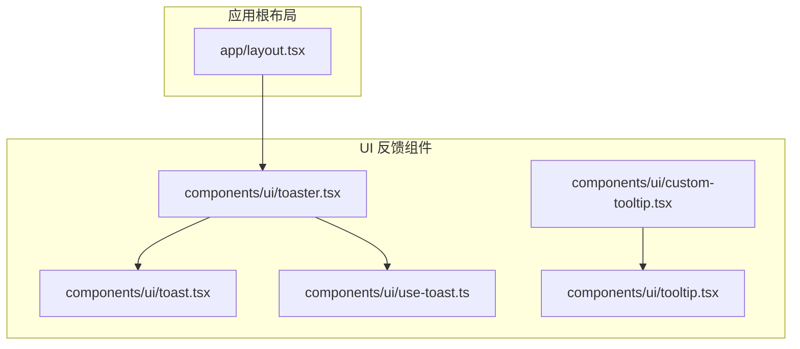
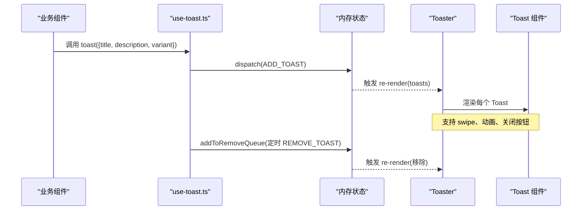
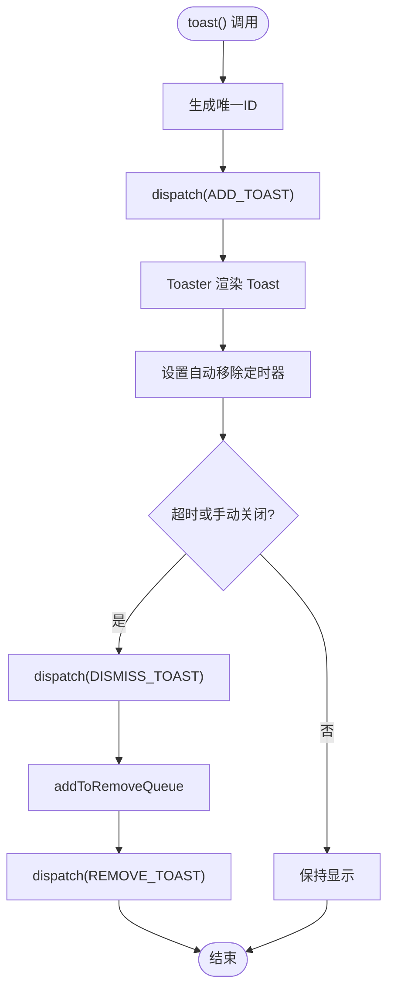
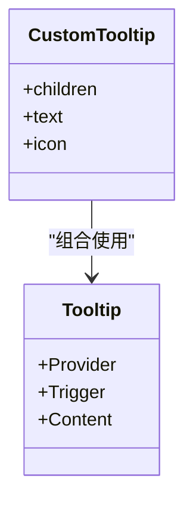
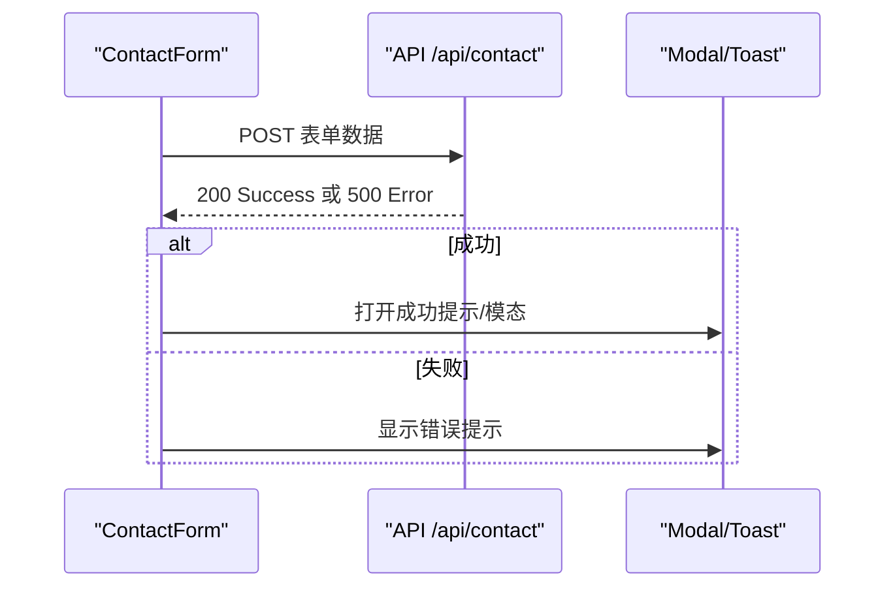
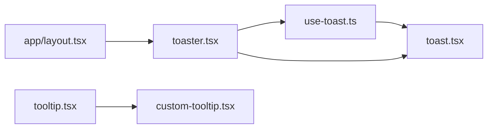

# 反馈组件

<cite>
**本文引用的文件**
- [components/ui/toast.tsx](file://components/ui/toast.tsx)
- [components/ui/toaster.tsx](file://components/ui/toaster.tsx)
- [components/ui/use-toast.ts](file://components/ui/use-toast.ts)
- [components/ui/tooltip.tsx](file://components/ui/tooltip.tsx)
- [components/ui/custom-tooltip.tsx](file://components/ui/custom-tooltip.tsx)
- [app/layout.tsx](file://app/layout.tsx)
- [components/forms/contact-form.tsx](file://components/forms/contact-form.tsx)
- [app/api/contact/route.ts](file://app/api/contact/route.ts)
</cite>

## 目录
1. [简介](#简介)
2. [项目结构](#项目结构)
3. [核心组件](#核心组件)
4. [架构总览](#架构总览)
5. [详细组件分析](#详细组件分析)
6. [依赖关系分析](#依赖关系分析)
7. [性能考量](#性能考量)
8. [故障排查指南](#故障排查指南)
9. [结论](#结论)
10. [附录](#附录)

## 简介
本文件面向“反馈组件”的完整实现与使用，覆盖 Toast 通知、工具提示（Tooltip）等用户反馈机制。重点说明：
- 消息队列管理：基于状态机与监听器的轻量级全局队列
- 自动消失机制：定时器驱动的去重与移除
- 位置控制：视口定位与响应式布局
- 动画效果：进入/退出动画与滑动、缩放
- 主题定制与样式覆盖：通过变体与 CSS 类名进行主题适配
- 多语言支持：以 ReactNode 承载标题与描述，便于国际化
- 异步操作反馈：成功/错误提示的使用模式
- 可访问性：键盘交互、焦点管理与语义化标签

## 项目结构
反馈相关代码集中在 UI 层，采用“基础原子组件 + 组合容器 + 状态 Hook”的分层组织：
- toast.tsx：Toast 原子组件（Root/Viewport/Title/Description/Action/Close）
- toaster.tsx：Toaster 容器，渲染当前队列中的 Toast
- use-toast.ts：全局状态、动作派发、自动移除逻辑
- tooltip.tsx：基础 Tooltip 封装（Provider/Trigger/Content）
- custom-tooltip.tsx：带图标与文案的增强版 Tooltip
- app/layout.tsx：在根布局挂载 Toaster，确保全局可用

图表来源
- [app/layout.tsx:100-133](file://app/layout.tsx#L100-L133)
- [components/ui/toaster.tsx:1-35](file://components/ui/toaster.tsx#L1-L35)
- [components/ui/toast.tsx:1-128](file://components/ui/toast.tsx#L1-L128)
- [components/ui/use-toast.ts:1-190](file://components/ui/use-toast.ts#L1-L190)
- [components/ui/tooltip.tsx:1-31](file://components/ui/tooltip.tsx#L1-L31)
- [components/ui/custom-tooltip.tsx:1-35](file://components/ui/custom-tooltip.tsx#L1-L35)

章节来源
- [app/layout.tsx:100-133](file://app/layout.tsx#L100-L133)

## 核心组件
- Toast 原子组件族：提供 Root、Viewport、Title、Description、Action、Close 等子组件，支持变体与动画
- Toaster 容器：订阅全局 toasts 队列并渲染为列表，包含关闭按钮与可选 action
- use-toast Hook：维护内存状态、派发动作、生成唯一 ID、自动移除队列
- Tooltip 基础封装：基于 Radix 的 Tooltip 组件，提供 Content 默认样式与动画
- CustomTooltip：封装图标+文本的常用提示场景

章节来源
- [components/ui/toast.tsx:1-128](file://components/ui/toast.tsx#L1-L128)
- [components/ui/toaster.tsx:1-35](file://components/ui/toaster.tsx#L1-L35)
- [components/ui/use-toast.ts:1-190](file://components/ui/use-toast.ts#L1-L190)
- [components/ui/tooltip.tsx:1-31](file://components/ui/tooltip.tsx#L1-L31)
- [components/ui/custom-tooltip.tsx:1-35](file://components/ui/custom-tooltip.tsx#L1-L35)

## 架构总览
下图展示了从调用到渲染的完整流程：组件调用 toast() -> 状态更新 -> Toaster 渲染 -> 自动移除。

图表来源
- [components/ui/use-toast.ts:140-167](file://components/ui/use-toast.ts#L140-L167)
- [components/ui/use-toast.ts:54-70](file://components/ui/use-toast.ts#L54-L70)
- [components/ui/toaster.tsx:13-35](file://components/ui/toaster.tsx#L13-L35)
- [components/ui/toast.tsx:10-23](file://components/ui/toast.tsx#L10-L23)

## 详细组件分析

### Toast 通知系统
- 消息队列管理
  - 使用 reducer 管理 toasts 数组，支持 ADD/UPDATE/DISMISS/REMOVE 四种动作
  - 限制同时显示数量（TOAST_LIMIT），新消息插入头部并截断
- 自动消失机制
  - 每个 Toast 入队时加入定时器，超时后执行 REMOVE_TOAST
  - 支持手动 dismiss 或 onOpenChange(false) 触发移除
- 位置控制
  - ToastViewport 固定定位，移动端底部右侧，桌面端右下角，最大宽度限制
- 动画效果
  - 进入/退出动画：slide-in/slide-out、fade-in/fade-out、zoom-in/zoom-out
  - 支持触摸滑动（swipe）反馈
- 主题与样式覆盖
  - 使用 class-variance-authority 定义变体（default、destructive）
  - 通过 className 透传与 cn 工具类合并，支持主题变量
- 多语言支持
  - title/description 接受 ReactNode，可嵌入 i18n 组件或富文本
- 可访问性
  - 基于 Radix 的无障碍能力，支持键盘关闭、焦点管理、语义标签

图表来源
- [components/ui/use-toast.ts:140-167](file://components/ui/use-toast.ts#L140-L167)
- [components/ui/use-toast.ts:54-70](file://components/ui/use-toast.ts#L54-L70)
- [components/ui/use-toast.ts:72-125](file://components/ui/use-toast.ts#L72-L125)

章节来源
- [components/ui/toast.tsx:25-53](file://components/ui/toast.tsx#L25-L53)
- [components/ui/toast.tsx:56-87](file://components/ui/toast.tsx#L56-L87)
- [components/ui/toast.tsx:89-111](file://components/ui/toast.tsx#L89-L111)
- [components/ui/toaster.tsx:13-35](file://components/ui/toaster.tsx#L13-L35)
- [components/ui/use-toast.ts:6-7](file://components/ui/use-toast.ts#L6-L7)
- [components/ui/use-toast.ts:54-70](file://components/ui/use-toast.ts#L54-L70)
- [components/ui/use-toast.ts:72-125](file://components/ui/use-toast.ts#L72-L125)
- [components/ui/use-toast.ts:140-167](file://components/ui/use-toast.ts#L140-L167)

### 工具提示（Tooltip）
- 基础封装
  - 提供 Provider、Trigger、Content，默认侧边偏移与入场/出场动画
- 自定义提示
  - CustomTooltip 封装图标+文案，适合帮助信息、字段说明等场景
- 可访问性
  - 基于 Radix Tooltip，支持键盘导航与屏幕阅读器

图表来源
- [components/ui/tooltip.tsx:8-30](file://components/ui/tooltip.tsx#L8-L30)
- [components/ui/custom-tooltip.tsx:17-33](file://components/ui/custom-tooltip.tsx#L17-L33)

章节来源
- [components/ui/tooltip.tsx:1-31](file://components/ui/tooltip.tsx#L1-L31)
- [components/ui/custom-tooltip.tsx:1-35](file://components/ui/custom-tooltip.tsx#L1-L35)

### 全局集成与挂载
- 根布局中引入并挂载 Toaster，确保全应用可用
- 与主题提供者同层级，保证主题变量生效

章节来源
- [app/layout.tsx:100-133](file://app/layout.tsx#L100-L133)

### 异步操作反馈与错误处理
- 表单提交示例
  - 使用 fetch 调用后端 API，成功后通过模态或提示反馈
  - 失败时记录日志或提示错误
- 服务端错误处理
  - 当环境变量缺失或请求异常时返回非 200 状态码，前端据此展示错误提示

图表来源
- [components/forms/contact-form.tsx:48-71](file://components/forms/contact-form.tsx#L48-L71)
- [app/api/contact/route.ts:3-30](file://app/api/contact/route.ts#L3-L30)

章节来源
- [components/forms/contact-form.tsx:48-71](file://components/forms/contact-form.tsx#L48-L71)
- [app/api/contact/route.ts:3-30](file://app/api/contact/route.ts#L3-L30)

## 依赖关系分析
- 外部依赖
  - @radix-ui/react-toast：提供无障碍的 Toast 基础能力
  - @radix-ui/react-tooltip：提供无障碍的 Tooltip 基础能力
  - class-variance-authority：用于变体样式管理
  - lucide-react：图标资源
- 内部依赖
  - lib/utils：cn 工具类用于类名合并
  - components/common/icons：图标集合

图表来源
- [components/ui/use-toast.ts:1-190](file://components/ui/use-toast.ts#L1-L190)
- [components/ui/toast.tsx:1-128](file://components/ui/toast.tsx#L1-L128)
- [components/ui/toaster.tsx:1-35](file://components/ui/toaster.tsx#L1-L35)
- [components/ui/tooltip.tsx:1-31](file://components/ui/tooltip.tsx#L1-L31)
- [components/ui/custom-tooltip.tsx:1-35](file://components/ui/custom-tooltip.tsx#L1-L35)
- [app/layout.tsx:100-133](file://app/layout.tsx#L100-L133)

章节来源
- [components/ui/use-toast.ts:1-190](file://components/ui/use-toast.ts#L1-L190)
- [components/ui/toast.tsx:1-128](file://components/ui/toast.tsx#L1-L128)
- [components/ui/toaster.tsx:1-35](file://components/ui/toaster.tsx#L1-L35)
- [components/ui/tooltip.tsx:1-31](file://components/ui/tooltip.tsx#L1-L31)
- [components/ui/custom-tooltip.tsx:1-35](file://components/ui/custom-tooltip.tsx#L1-L35)
- [app/layout.tsx:100-133](file://app/layout.tsx#L100-L133)

## 性能考量
- 队列长度限制：TOAST_LIMIT=1，避免过多 Toast 导致重绘开销
- 定时器优化：去重 Map 防止重复添加同一 Toast 的移除定时器
- 动画性能：使用 CSS 过渡与 transform，减少布局抖动
- 条件渲染：仅渲染存在的 title/description/action，降低 DOM 节点数
- 事件委托：关闭按钮与 action 由 Radix 管理，减少自定义事件绑定

[本节为通用性能建议，不直接分析具体文件]

## 故障排查指南
- Toast 未显示
  - 检查根布局是否已挂载 Toaster
  - 确认 use-toast 的 toast() 被正确调用且参数有效
- Toast 无法自动消失
  - 检查 TOAST_REMOVE_DELAY 配置是否合理
  - 确认没有阻止 onOpenChange(false) 触发的逻辑
- 样式异常
  - 检查主题变量是否正确注入
  - 确认 cn 工具类与 Tailwind 配置正常
- Tooltip 不出现
  - 检查 Trigger 包裹元素是否可聚焦/可交互
  - 确认 TooltipProvider 存在（CustomTooltip 内部已提供）
- 表单提交无反馈
  - 检查 API 返回状态码与错误分支
  - 确认成功/失败路径均调用了提示组件

章节来源
- [app/layout.tsx:100-133](file://app/layout.tsx#L100-L133)
- [components/ui/use-toast.ts:54-70](file://components/ui/use-toast.ts#L54-L70)
- [components/ui/toast.tsx:71-87](file://components/ui/toast.tsx#L71-L87)
- [components/ui/tooltip.tsx:14-27](file://components/ui/tooltip.tsx#L14-L27)
- [components/forms/contact-form.tsx:48-71](file://components/forms/contact-form.tsx#L48-L71)
- [app/api/contact/route.ts:3-30](file://app/api/contact/route.ts#L3-L30)

## 结论
该反馈组件体系以轻量、可组合、可访问为核心目标：
- 使用 reducer + 监听器实现简洁的全局消息队列与自动移除
- 通过 Radix 保障无障碍体验与键盘交互
- 借助变体与类名合并实现主题定制与样式覆盖
- 以 ReactNode 承载内容，天然支持多语言与富文本
- 提供 Tooltip 与 CustomTooltip 满足常见提示场景
- 结合表单与 API 的错误/成功反馈，形成完整的用户体验闭环

[本节为总结性内容，不直接分析具体文件]

## 附录

### 使用模式速查
- 显示成功提示
  - 在异步操作成功后调用 toast({ title, description })
- 显示错误提示
  - 捕获异常后调用 toast({ title, description, variant: "destructive" })
- 自定义动作
  - 传入 action 属性，例如重试、查看详情
- 工具提示
  - 使用 Tooltip/TooltipTrigger/TooltipContent 或 CustomTooltip

章节来源
- [components/ui/use-toast.ts:140-167](file://components/ui/use-toast.ts#L140-L167)
- [components/ui/toast.tsx:25-53](file://components/ui/toast.tsx#L25-L53)
- [components/ui/custom-tooltip.tsx:17-33](file://components/ui/custom-tooltip.tsx#L17-L33)

### 可访问性与用户体验建议
- 始终提供明确的标题与描述，必要时附加 action
- 对关键操作使用 destructive 变体强调风险
- 控制同时显示的 Toast 数量，避免遮挡重要信息
- 为 Tooltip 提供简短、准确的辅助文本
- 遵循键盘导航顺序，确保所有交互可通过键盘完成
- 使用语义化标签与 aria 属性（Radix 已内置）

[本节为通用指导，不直接分析具体文件]