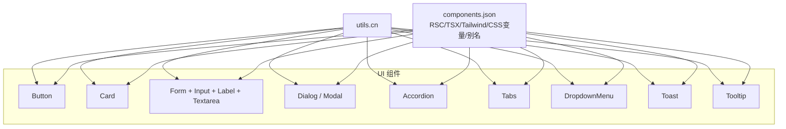
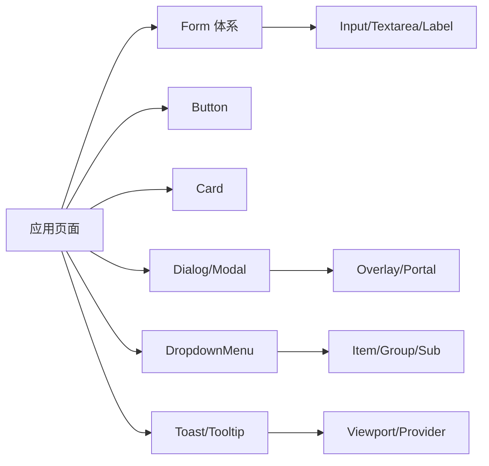
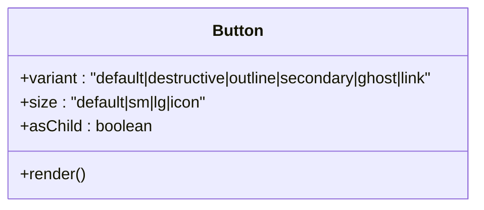
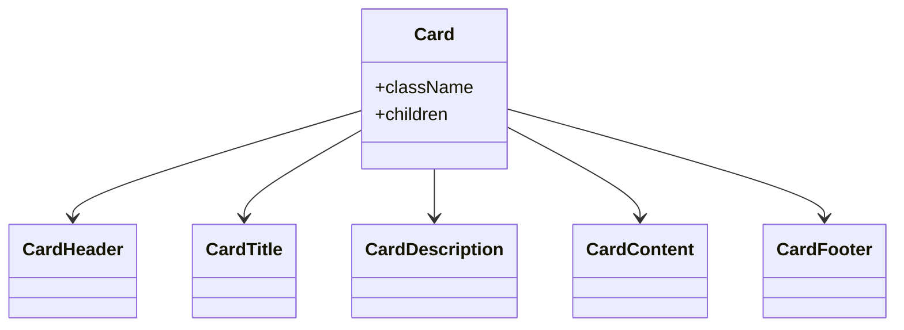
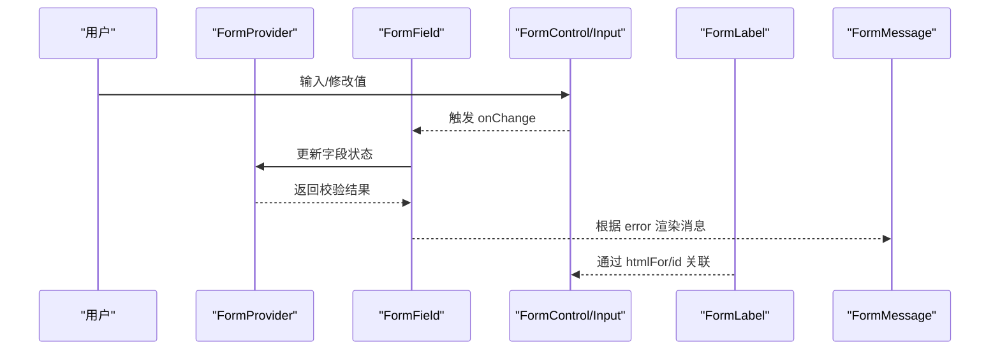
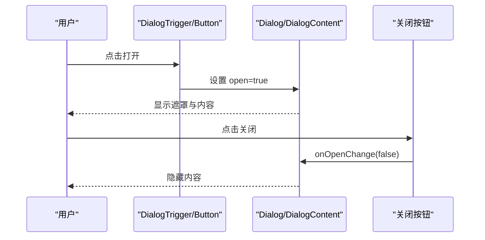
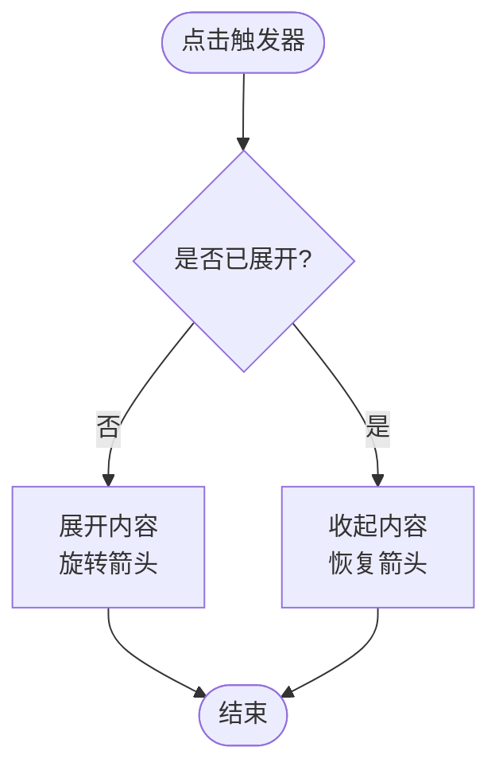
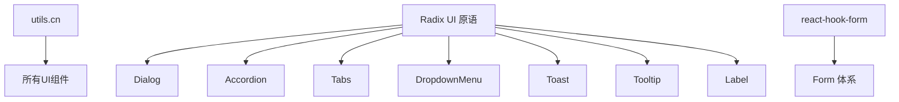

# 基础UI组件 (ui)

<cite>
**本文档引用的文件**
- [components.json](file://components.json)
- [lib/utils.ts](file://lib/utils.ts)
- [components/ui/button.tsx](file://components/ui/button.tsx)
- [components/ui/card.tsx](file://components/ui/card.tsx)
- [components/ui/form.tsx](file://components/ui/form.tsx)
- [components/ui/input.tsx](file://components/ui/input.tsx)
- [components/ui/label.tsx](file://components/ui/label.tsx)
- [components/ui/textarea.tsx](file://components/ui/textarea.tsx)
- [components/ui/dialog.tsx](file://components/ui/dialog.tsx)
- [components/ui/modal.tsx](file://components/ui/modal.tsx)
- [components/ui/accordion.tsx](file://components/ui/accordion.tsx)
- [components/ui/tabs.tsx](file://components/ui/tabs.tsx)
- [components/ui/dropdown-menu.tsx](file://components/ui/dropdown-menu.tsx)
- [components/ui/toast.tsx](file://components/ui/toast.tsx)
- [components/ui/tooltip.tsx](file://components/ui/tooltip.tsx)
</cite>

## 目录
1. [简介](#简介)
2. [项目结构](#项目结构)
3. [核心组件](#核心组件)
4. [架构总览](#架构总览)
5. [详细组件分析](#详细组件分析)
6. [依赖关系分析](#依赖关系分析)
7. [性能考虑](#性能考虑)
8. [故障排查指南](#故障排查指南)
9. [结论](#结论)
10. [附录](#附录)

## 简介
本仓库提供了一套基于 shadcn/ui 的基础 UI 组件库，覆盖按钮、卡片、表单、模态框、手风琴、标签页、下拉菜单、提示与通知等常用交互元素。组件采用 Radix UI 原语构建，结合 Tailwind CSS 与 class-variance-authority（cva）实现样式变体与主题适配；通过 React Context 与组合模式提供可访问性支持与灵活的扩展点。本文档从系统架构、组件关系、数据流、处理逻辑、集成点、错误处理与性能特性等维度进行系统化说明，并提供使用示例、最佳实践与常见问题排查建议。

## 项目结构
- 组件位于 components/ui 目录下，按功能拆分：基础控件（button、input、textarea、label）、布局容器（card）、交互容器（dialog、modal、dropdown-menu、tabs、accordion）、反馈（toast、tooltip）以及表单体系（form）。
- 样式工具集中在 lib/utils.ts 的 cn 函数，用于合并类名并兼容 Tailwind 变量。
- shadcn 配置在 components.json，启用 RSC、TSX、Tailwind CSS 变量与别名映射。

图表来源
- [components.json:1-17](file://components.json#L1-L17)
- [lib/utils.ts:1-6](file://lib/utils.ts#L1-L6)

章节来源
- [components.json:1-17](file://components.json#L1-L17)
- [lib/utils.ts:1-6](file://lib/utils.ts#L1-L6)

## 核心组件
- 按钮 Button：支持多变体（默认、破坏、描边、次要、幽灵、链接）与尺寸（默认、小、大、图标），可通过 asChild 透传为任意元素，便于组合与无障碍语义控制。
- 卡片 Card：由 Card、CardHeader、CardTitle、CardDescription、CardContent、CardFooter 组成，适合信息块展示与内容组织。
- 表单 Form：基于 react-hook-form 封装 FormProvider、FormField、FormItem、FormLabel、FormControl、FormDescription、FormMessage，提供校验状态联动与无障碍关联。
- 输入控件 Input/Textarea：统一边框、聚焦环、禁用态与占位符样式，配合表单组件使用。
- 标签 Label：基于 Radix Label，支持禁用态与可访问性。
- 对话框 Dialog/Modal：基于 Radix Dialog，包含遮罩、内容区、头部、底部、标题与描述，Modal 作为高层封装简化调用。
- 手风琴 Accordion：可折叠面板，含触发器与内容区域，带展开/收起动画。
- 标签页 Tabs：列表、触发器与内容区域，支持键盘导航与焦点管理。
- 下拉菜单 DropdownMenu：分组、子菜单、单选/复选项、分隔符与快捷键提示。
- 提示 Toast：成功/失败等消息通知，支持动作按钮与关闭。
- 提示 Tooltip：悬浮提示，支持定位与动画。

章节来源
- [components/ui/button.tsx:7-56](file://components/ui/button.tsx#L7-L56)
- [components/ui/card.tsx:5-86](file://components/ui/card.tsx#L5-L86)
- [components/ui/form.tsx:16-177](file://components/ui/form.tsx#L16-L177)
- [components/ui/input.tsx:5-25](file://components/ui/input.tsx#L5-L25)
- [components/ui/label.tsx:9-26](file://components/ui/label.tsx#L9-L26)
- [components/ui/textarea.tsx:5-24](file://components/ui/textarea.tsx#L5-L24)
- [components/ui/dialog.tsx:9-120](file://components/ui/dialog.tsx#L9-L120)
- [components/ui/modal.tsx:13-39](file://components/ui/modal.tsx#L13-L39)
- [components/ui/accordion.tsx:9-62](file://components/ui/accordion.tsx#L9-L62)
- [components/ui/tabs.tsx:8-55](file://components/ui/tabs.tsx#L8-L55)
- [components/ui/dropdown-menu.tsx:9-200](file://components/ui/dropdown-menu.tsx#L9-L200)
- [components/ui/toast.tsx:8-127](file://components/ui/toast.tsx#L8-L127)
- [components/ui/tooltip.tsx:8-30](file://components/ui/tooltip.tsx#L8-L30)

## 架构总览
组件整体遵循“轻量原语 + 组合模式”的设计：
- 以 Radix UI 原语为基础，保证可访问性与行为正确性。
- 通过 cva 定义样式变体，集中管理主题色、尺寸与交互态。
- 使用 cn 工具合并类名，确保 Tailwind 变量与响应式断点生效。
- 表单体系通过 Context 传递字段状态，将校验、描述与错误信息解耦到独立子组件。
- 弹窗与浮层通过 Portal 渲染，避免层级与滚动上下文问题。

图表来源
- [components/ui/form.tsx:16-177](file://components/ui/form.tsx#L16-L177)
- [components/ui/button.tsx:7-56](file://components/ui/button.tsx#L7-L56)
- [components/ui/card.tsx:5-86](file://components/ui/card.tsx#L5-L86)
- [components/ui/dialog.tsx:9-120](file://components/ui/dialog.tsx#L9-L120)
- [components/ui/dropdown-menu.tsx:9-200](file://components/ui/dropdown-menu.tsx#L9-L200)
- [components/ui/toast.tsx:8-127](file://components/ui/toast.tsx#L8-L127)
- [components/ui/tooltip.tsx:8-30](file://components/ui/tooltip.tsx#L8-L30)

## 详细组件分析

### 按钮 Button
- 设计要点
  - 使用 cva 定义 variant 与 size 两类变体，默认值明确，便于统一风格。
  - 支持 asChild 透传，可将按钮渲染为 a、span 或其他可聚焦元素，提升组合灵活性。
  - 通过 cn 合并 className，允许外部覆盖或追加样式。
- 可访问性
  - 原生 button 语义，focus-visible 聚焦环清晰，disabled 态不可操作且降低不透明度。
- 响应式与主题
  - 颜色与背景使用 CSS 变量（如 primary、background），切换主题时无需额外代码。
- 扩展点
  - 新增变体：在 cva variants 中扩展新的 variant 键值对。
  - 自定义尺寸：扩展 size 变体或传入 className 微调。

图表来源
- [components/ui/button.tsx:7-56](file://components/ui/button.tsx#L7-L56)

章节来源
- [components/ui/button.tsx:7-56](file://components/ui/button.tsx#L7-L56)

### 卡片 Card
- 设计要点
  - 由多个语义化子组件构成：Header、Title、Description、Content、Footer，便于结构化排版。
  - 统一的圆角、边框、阴影与前景/背景色，适配主题变量。
- 组合模式
  - 通过父子组合表达信息层次，例如标题+描述+内容+操作区。
- 响应式
  - 内边距与字号在不同屏幕下保持一致比例，便于移动端阅读。

图表来源
- [components/ui/card.tsx:5-86](file://components/ui/card.tsx#L5-L86)

章节来源
- [components/ui/card.tsx:5-86](file://components/ui/card.tsx#L5-L86)

### 表单 Form 与输入控件
- 设计要点
  - 基于 react-hook-form 的 Controller 与 FormProvider，统一管理字段状态与校验。
  - FormField 暴露 name，FormItem 生成唯一 id 并通过 Context 共享。
  - FormControl 自动注入 aria-describedby 与 aria-invalid，FormMessage 显示错误信息。
- 可访问性
  - FormLabel 与 FormControl 通过 htmlFor 与 id 建立关联，读屏器友好。
  - 错误时动态更新 aria-invalid，辅助工具可感知。
- 输入控件
  - Input/Textarea 提供一致的边框、聚焦环、禁用态与占位符样式。
  - 与表单组件组合使用时，通过 FormControl 包裹原生 input/textarea。

图表来源
- [components/ui/form.tsx:16-177](file://components/ui/form.tsx#L16-L177)
- [components/ui/input.tsx:5-25](file://components/ui/input.tsx#L5-L25)
- [components/ui/textarea.tsx:5-24](file://components/ui/textarea.tsx#L5-L24)
- [components/ui/label.tsx:9-26](file://components/ui/label.tsx#L9-L26)

章节来源
- [components/ui/form.tsx:16-177](file://components/ui/form.tsx#L16-L177)
- [components/ui/input.tsx:5-25](file://components/ui/input.tsx#L5-L25)
- [components/ui/textarea.tsx:5-24](file://components/ui/textarea.tsx#L5-L24)
- [components/ui/label.tsx:9-26](file://components/ui/label.tsx#L9-L26)

### 对话框 Dialog 与模态 Modal
- 设计要点
  - Dialog 基于 Radix Dialog，包含 Trigger、Overlay、Content、Header、Footer、Title、Description。
  - Content 使用 Portal 渲染，避免父级 overflow 影响；内置关闭按钮与键盘 ESC 关闭。
  - Modal 作为高层封装，接收 title、description、isOpen、onClose 与 children，简化调用。
- 可访问性
  - 焦点陷阱、角色与属性由 Radix 管理；关闭按钮具备 sr-only 文本。
- 响应式
  - 内容宽度在小屏自适应，在大屏全宽显示；动画平滑过渡。

图表来源
- [components/ui/dialog.tsx:9-120](file://components/ui/dialog.tsx#L9-L120)
- [components/ui/modal.tsx:13-39](file://components/ui/modal.tsx#L13-L39)

章节来源
- [components/ui/dialog.tsx:9-120](file://components/ui/dialog.tsx#L9-L120)
- [components/ui/modal.tsx:13-39](file://components/ui/modal.tsx#L13-L39)

### 手风琴 Accordion
- 设计要点
  - 基于 Radix Accordion，包含 Item、Trigger、Content。
  - 触发器带箭头图标，展开/收起有旋转动画；内容区有展开/收起动画。
- 可访问性
  - 键盘导航与焦点管理由 Radix 负责；ARIA 属性自动维护。
- 响应式
  - 字体与间距在小屏更紧凑，提升可读性。

图表来源
- [components/ui/accordion.tsx:9-62](file://components/ui/accordion.tsx#L9-L62)

章节来源
- [components/ui/accordion.tsx:9-62](file://components/ui/accordion.tsx#L9-L62)

### 标签页 Tabs
- 设计要点
  - 基于 Radix Tabs，包含 List、Trigger、Content。
  - 激活态高亮，未激活态保持可读；键盘左右切换。
- 可访问性
  - 角色与属性由 Radix 管理，焦点顺序合理。
- 响应式
  - 列表横向排列，在小屏仍可滚动查看。

章节来源
- [components/ui/tabs.tsx:8-55](file://components/ui/tabs.tsx#L8-L55)

### 下拉菜单 DropdownMenu
- 设计要点
  - 支持分组、子菜单、单选/复选项、分隔符与快捷键提示。
  - 内容通过 Portal 渲染，避免层级问题；打开/关闭带缩放与滑动动画。
- 可访问性
  - 键盘导航、方向键选择、Enter/Space 确认；禁用态不可操作。
- 响应式
  - 最小宽度与内边距适配不同屏幕。

章节来源
- [components/ui/dropdown-menu.tsx:9-200](file://components/ui/dropdown-menu.tsx#L9-L200)

### 提示 Toast
- 设计要点
  - 基于 Radix Toast，提供 Provider、Viewport、Root、Action、Close、Title、Description。
  - 支持 default 与 destructive 两种变体；移动端右下角固定显示。
- 可访问性
  - 自动聚焦与朗读策略由 Radix 管理；关闭按钮可操作。
- 响应式
  - 桌面端最大宽度限制，移动端全屏高度堆叠。

章节来源
- [components/ui/toast.tsx:8-127](file://components/ui/toast.tsx#L8-L127)

### 提示 Tooltip
- 设计要点
  - 基于 Radix Tooltip，提供 Provider、Trigger、Content。
  - 支持 sideOffset 与多种进入/退出动画。
- 可访问性
  - 延迟显示与隐藏，减少干扰；读屏器友好。

章节来源
- [components/ui/tooltip.tsx:8-30](file://components/ui/tooltip.tsx#L8-L30)

## 依赖关系分析
- 内部依赖
  - 所有组件通过 lib/utils.ts 的 cn 函数合并类名，确保 Tailwind 变量与响应式断点正确生效。
  - 表单组件依赖 react-hook-form 的 Controller 与 FormProvider。
  - 交互组件依赖 Radix UI 原语（Dialog、Accordion、Tabs、DropdownMenu、Toast、Tooltip、Label）。
- 外部依赖
  - 图标来自 lucide-react（如 X、ChevronDown、Check、Circle）。
  - 样式基于 Tailwind CSS 与 CSS 变量（shadcn 配置启用 cssVariables）。
- 耦合与内聚
  - 组件间低耦合，主要通过 props 与组合模式协作；表单体系通过 Context 共享状态，提高内聚性。
  - 无循环依赖，入口清晰。

图表来源
- [lib/utils.ts:1-6](file://lib/utils.ts#L1-L6)
- [components/ui/dialog.tsx:9-120](file://components/ui/dialog.tsx#L9-L120)
- [components/ui/accordion.tsx:9-62](file://components/ui/accordion.tsx#L9-L62)
- [components/ui/tabs.tsx:8-55](file://components/ui/tabs.tsx#L8-L55)
- [components/ui/dropdown-menu.tsx:9-200](file://components/ui/dropdown-menu.tsx#L9-L200)
- [components/ui/toast.tsx:8-127](file://components/ui/toast.tsx#L8-L127)
- [components/ui/tooltip.tsx:8-30](file://components/ui/tooltip.tsx#L8-L30)
- [components/ui/form.tsx:16-177](file://components/ui/form.tsx#L16-L177)

章节来源
- [lib/utils.ts:1-6](file://lib/utils.ts#L1-L6)
- [components.json:1-17](file://components.json#L1-L17)

## 性能考虑
- 渲染优化
  - 使用 forwardRef 与 displayName，便于调试与开发工具识别。
  - 弹窗与浮层通过 Portal 渲染，避免重排与层级冲突。
- 样式合并
  - 使用 clsx + tailwind-merge 的 cn 函数，避免重复类名与冲突，减少无用样式。
- 交互体验
  - 动画与过渡使用 CSS 类，GPU 加速；避免在高频事件中执行昂贵计算。
- 可访问性
  - 借助 Radix 的原生能力，减少自定义逻辑带来的性能开销与回归风险。

[本节为通用指导，不直接分析具体文件]

## 故障排查指南
- 表单相关
  - 若出现“useFormField should be used within <FormField>”，请确保 FormControl/FormLabel 等置于 FormField 上下文中。
  - 检查 FormProvider 是否正确包裹表单，FormField 的 name 是否与 schema 一致。
- 对话框相关
  - 若遮罩或内容被裁剪，检查父容器是否有 overflow 或 transform 导致 Portal 渲染异常。
  - 确认 Dialog 的 open 状态与 onOpenChange 正确绑定。
- 下拉菜单/Tooltip/Toast
  - 若位置不正确，检查最近的定位祖先或视口边界；必要时调整 sideOffset。
  - 若无法触发，确认 Trigger 是可聚焦元素且未被 pointer-events 阻止。
- 样式问题
  - 若主题色不生效，确认 Tailwind CSS 变量已启用并在 globals.css 中定义。
  - 若类名冲突，检查是否重复引入或覆盖了默认样式。

章节来源
- [components/ui/form.tsx:42-63](file://components/ui/form.tsx#L42-L63)
- [components/ui/dialog.tsx:33-55](file://components/ui/dialog.tsx#L33-L55)
- [components/ui/dropdown-menu.tsx:59-75](file://components/ui/dropdown-menu.tsx#L59-L75)
- [components/ui/tooltip.tsx:14-28](file://components/ui/tooltip.tsx#L14-L28)
- [components/ui/toast.tsx:10-23](file://components/ui/toast.tsx#L10-L23)

## 结论
该基础 UI 组件库以 Radix UI 原语为核心，结合 Tailwind CSS 与 cva 实现了高内聚、低耦合的可复用组件集合。通过组合模式与 Context 机制，提供了良好的可扩展性与可访问性支持。建议在业务中优先使用这些组件，利用其变体系统与主题变量快速构建一致的用户界面，同时遵循最佳实践以确保性能与可维护性。

[本节为总结性内容，不直接分析具体文件]

## 附录
- 使用示例（路径指引）
  - 按钮：参考 [components/ui/button.tsx:7-56](file://components/ui/button.tsx#L7-L56)
  - 卡片：参考 [components/ui/card.tsx:5-86](file://components/ui/card.tsx#L5-L86)
  - 表单：参考 [components/ui/form.tsx:16-177](file://components/ui/form.tsx#L16-L177)、[components/ui/input.tsx:5-25](file://components/ui/input.tsx#L5-L25)、[components/ui/textarea.tsx:5-25](file://components/ui/textarea.tsx#L5-L25)、[components/ui/label.tsx:9-26](file://components/ui/label.tsx#L9-L26)
  - 对话框/模态：参考 [components/ui/dialog.tsx:9-120](file://components/ui/dialog.tsx#L9-L120)、[components/ui/modal.tsx:13-39](file://components/ui/modal.tsx#L13-L39)
  - 手风琴：参考 [components/ui/accordion.tsx:9-62](file://components/ui/accordion.tsx#L9-L62)
  - 标签页：参考 [components/ui/tabs.tsx:8-55](file://components/ui/tabs.tsx#L8-L55)
  - 下拉菜单：参考 [components/ui/dropdown-menu.tsx:9-200](file://components/ui/dropdown-menu.tsx#L9-L200)
  - 提示 Toast：参考 [components/ui/toast.tsx:8-127](file://components/ui/toast.tsx#L8-L127)
  - 提示 Tooltip：参考 [components/ui/tooltip.tsx:8-30](file://components/ui/tooltip.tsx#L8-L30)
- 配置与工具
  - shadcn 配置：[components.json:1-17](file://components.json#L1-L17)
  - 类名合并工具：[lib/utils.ts:1-6](file://lib/utils.ts#L1-L6)

[本节为附录，不直接分析具体文件]