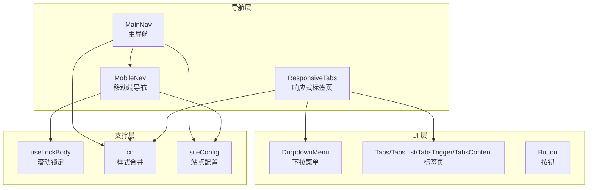
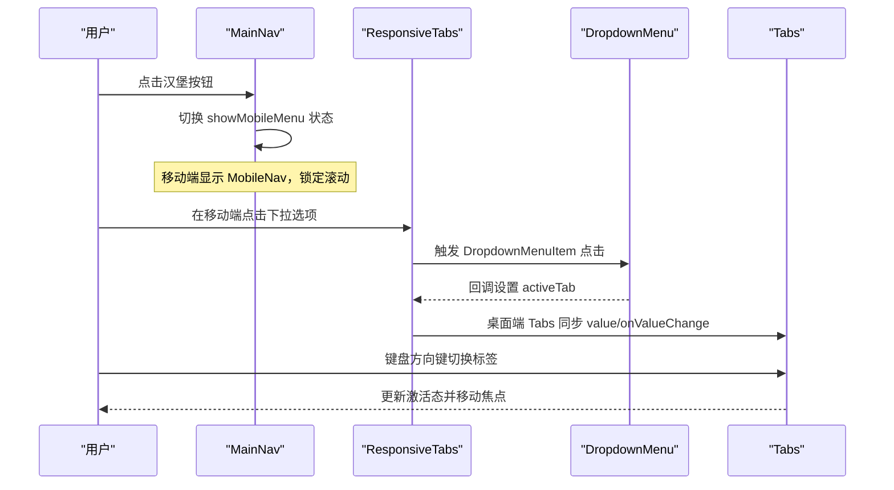
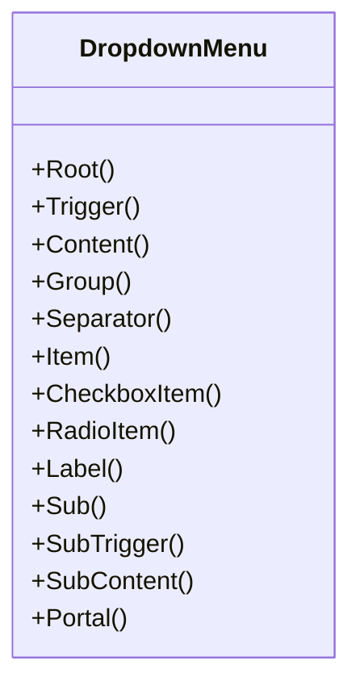
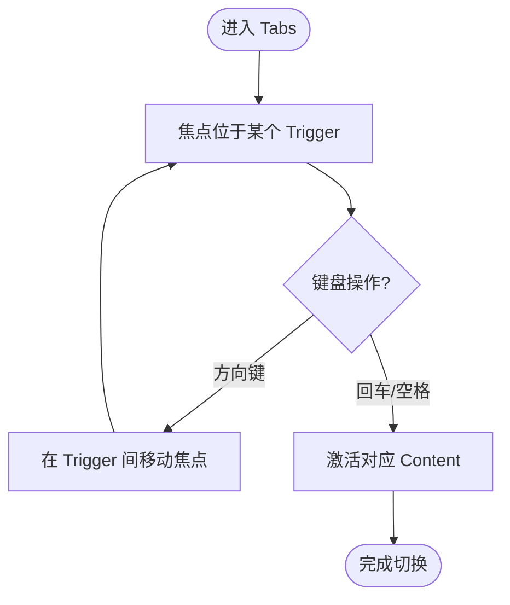
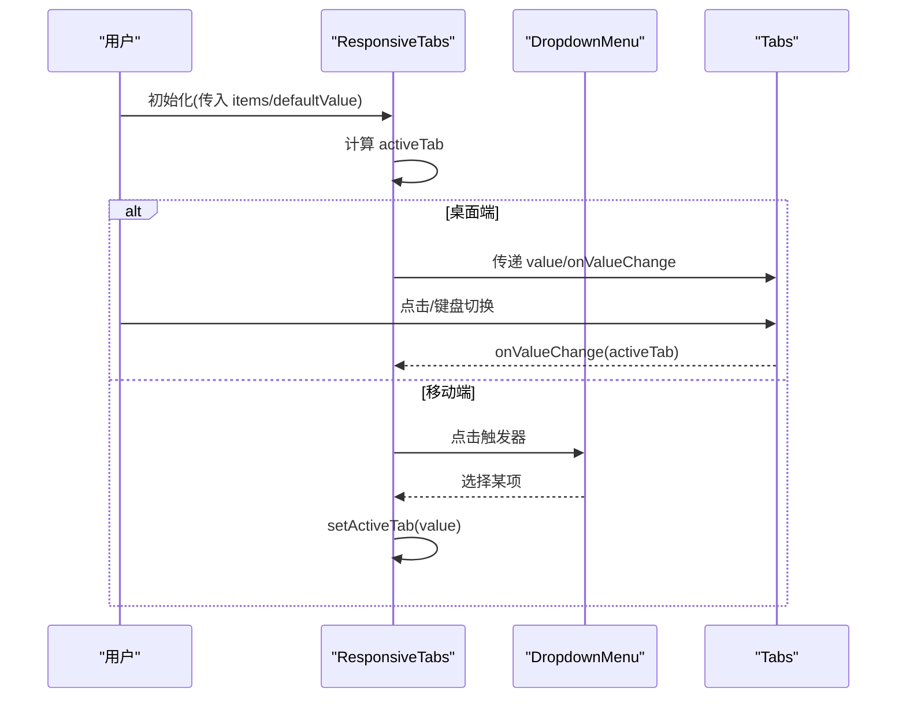
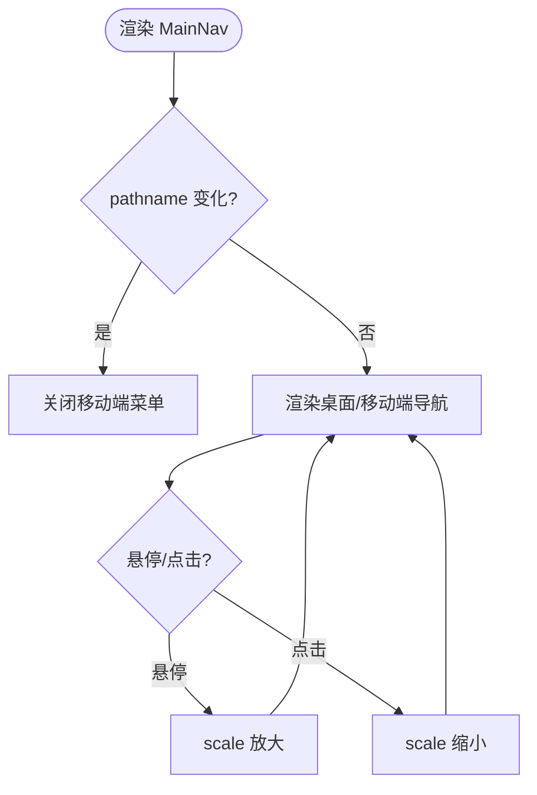
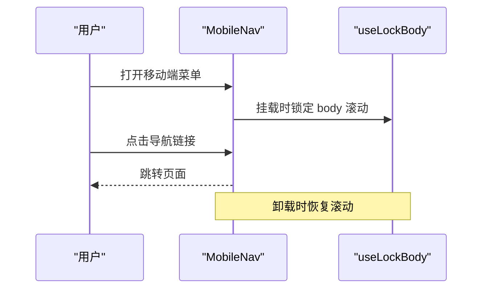
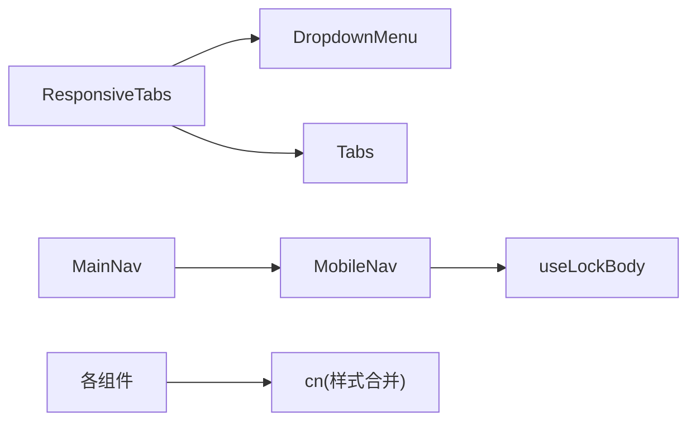

# 导航组件

<cite>
**本文引用的文件**
- [components/ui/dropdown-menu.tsx](file://components/ui/dropdown-menu.tsx)
- [components/ui/tabs.tsx](file://components/ui/tabs.tsx)
- [components/ui/responsive-tabs.tsx](file://components/ui/responsive-tabs.tsx)
- [components/common/main-nav.tsx](file://components/common/main-nav.tsx)
- [components/common/mobile-nav.tsx](file://components/common/mobile-nav.tsx)
- [components/ui/button.tsx](file://components/ui/button.tsx)
- [hooks/use-lock-body.ts](file://hooks/use-lock-body.ts)
- [lib/utils.ts](file://lib/utils.ts)
- [config/site.ts](file://config/site.ts)
</cite>

## 目录
1. [简介](#简介)
2. [项目结构](#项目结构)
3. [核心组件](#核心组件)
4. [架构总览](#架构总览)
5. [详细组件分析](#详细组件分析)
6. [依赖关系分析](#依赖关系分析)
7. [性能考量](#性能考量)
8. [故障排查指南](#故障排查指南)
9. [结论](#结论)
10. [附录](#附录)

## 简介
本文件为导航组件的详细文档，覆盖下拉菜单、标签页、响应式标签页等导航元素的实现。重点说明：
- 状态管理与焦点管理
- 键盘导航与可访问性支持
- 动画效果、过渡动画与交互反馈
- 移动端适配、触摸手势与屏幕阅读器兼容性
- 导航模式与用户体验最佳实践

## 项目结构
导航相关代码主要分布在以下位置：
- UI 基础组件：下拉菜单、标签页、按钮等
- 业务导航组件：主导航、移动端导航
- 工具与配置：样式合并、站点配置、滚动锁定钩子

图表来源
- [components/common/main-nav.tsx:40-105](file://components/common/main-nav.tsx#L40-L105)
- [components/common/mobile-nav.tsx:21-54](file://components/common/mobile-nav.tsx#L21-L54)
- [components/ui/responsive-tabs.tsx:28-88](file://components/ui/responsive-tabs.tsx#L28-L88)
- [components/ui/dropdown-menu.tsx:9-200](file://components/ui/dropdown-menu.tsx#L9-L200)
- [components/ui/tabs.tsx:8-55](file://components/ui/tabs.tsx#L8-L55)
- [components/ui/button.tsx:7-56](file://components/ui/button.tsx#L7-L56)
- [hooks/use-lock-body.ts:4-12](file://hooks/use-lock-body.ts#L4-L12)
- [lib/utils.ts:4-6](file://lib/utils.ts#L4-L6)
- [config/site.ts:1-41](file://config/site.ts#L1-L41)

章节来源
- [components/common/main-nav.tsx:40-105](file://components/common/main-nav.tsx#L40-L105)
- [components/common/mobile-nav.tsx:21-54](file://components/common/mobile-nav.tsx#L21-L54)
- [components/ui/responsive-tabs.tsx:28-88](file://components/ui/responsive-tabs.tsx#L28-L88)
- [components/ui/dropdown-menu.tsx:9-200](file://components/ui/dropdown-menu.tsx#L9-L200)
- [components/ui/tabs.tsx:8-55](file://components/ui/tabs.tsx#L8-L55)
- [components/ui/button.tsx:7-56](file://components/ui/button.tsx#L7-L56)
- [hooks/use-lock-body.ts:4-12](file://hooks/use-lock-body.ts#L4-L12)
- [lib/utils.ts:4-6](file://lib/utils.ts#L4-L6)
- [config/site.ts:1-41](file://config/site.ts#L1-L41)

## 核心组件
- 下拉菜单（Dropdown Menu）
  - 基于 Radix Dropdown Menu，提供触发器、内容、分组、分隔符、复选/单选项、子菜单等能力
  - 内置打开/关闭的缩放与淡入淡出动画，侧边滑入滑出
  - 通过 Portal 渲染，避免层级与溢出问题
- 标签页（Tabs）
  - 基于 Radix Tabs，提供列表、触发器、内容容器
  - 聚焦环与激活态样式，键盘方向键切换
- 响应式标签页（ResponsiveTabs）
  - 桌面端使用 Tabs，移动端使用 Dropdown + 内容直显
  - 内部维护 activeTab 状态，驱动 Tab 切换或下拉选择
- 主导航（MainNav）
  - 桌面端水平导航，移动端汉堡菜单
  - 根据当前路由高亮；页面切换时自动收起移动端菜单
  - 使用 motion 实现入场动画与悬停/点击微交互
- 移动端导航（MobileNav）
  - 全屏抽屉式导航，锁定页面滚动
  - 链接列表与可选的子区域插槽

章节来源
- [components/ui/dropdown-menu.tsx:9-200](file://components/ui/dropdown-menu.tsx#L9-L200)
- [components/ui/tabs.tsx:8-55](file://components/ui/tabs.tsx#L8-L55)
- [components/ui/responsive-tabs.tsx:28-88](file://components/ui/responsive-tabs.tsx#L28-L88)
- [components/common/main-nav.tsx:40-105](file://components/common/main-nav.tsx#L40-L105)
- [components/common/mobile-nav.tsx:21-54](file://components/common/mobile-nav.tsx#L21-L54)

## 架构总览
导航体系由“基础 UI 组件”+“业务导航组件”构成，通过组合形成完整的导航体验。

图表来源
- [components/common/main-nav.tsx:40-105](file://components/common/main-nav.tsx#L40-L105)
- [components/ui/responsive-tabs.tsx:28-88](file://components/ui/responsive-tabs.tsx#L28-L88)
- [components/ui/dropdown-menu.tsx:9-200](file://components/ui/dropdown-menu.tsx#L9-L200)
- [components/ui/tabs.tsx:8-55](file://components/ui/tabs.tsx#L8-L55)

## 详细组件分析

### 下拉菜单（DropdownMenu）
- 功能要点
  - 提供 Root、Trigger、Content、Group、Separator、Item、CheckboxItem、RadioItem、Label、Sub、SubTrigger、SubContent、Portal 等原子组件
  - Content/SubContent 使用 Portal 渲染，确保不受父级 overflow 影响
  - 通过 data-[state=open/closed] 控制动画与样式
- 状态与焦点
  - 由 Radix 管理开闭状态与焦点陷阱，支持 Esc 关闭、方向键导航
- 动画与交互
  - 打开/关闭包含淡入淡出与缩放，按 side 滑入滑出
- 可访问性
  - 原生语义与 ARIA 属性由底层库保证，适合屏幕阅读器

图表来源
- [components/ui/dropdown-menu.tsx:9-200](file://components/ui/dropdown-menu.tsx#L9-L200)

章节来源
- [components/ui/dropdown-menu.tsx:9-200](file://components/ui/dropdown-menu.tsx#L9-L200)

### 标签页（Tabs）
- 功能要点
  - 提供 List、Trigger、Content 三个核心部分
  - 通过 value 与 onValueChange 进行受控切换
- 状态与焦点
  - 支持键盘方向键在 Trigger 间移动，Enter/Space 激活
  - 激活态通过 data-[state=active] 标识
- 动画与交互
  - 聚焦环与激活态背景/文字变化，提升可见性

图表来源
- [components/ui/tabs.tsx:8-55](file://components/ui/tabs.tsx#L8-L55)

章节来源
- [components/ui/tabs.tsx:8-55](file://components/ui/tabs.tsx#L8-L55)

### 响应式标签页（ResponsiveTabs）
- 功能要点
  - 桌面端：使用 Tabs 展示多列网格布局
  - 移动端：使用 Dropdown 作为选择器，直接渲染选中项内容
- 状态管理
  - 内部使用 useState 维护 activeTab，默认取 defaultValue 或首项
  - 桌面端将 value 与 onValueChange 透传给 Tabs
- 可访问性与交互
  - 桌面端继承 Tabs 的键盘与焦点行为
  - 移动端通过 Button + Dropdown 提供触控友好的选择方式

图表来源
- [components/ui/responsive-tabs.tsx:28-88](file://components/ui/responsive-tabs.tsx#L28-L88)
- [components/ui/dropdown-menu.tsx:9-200](file://components/ui/dropdown-menu.tsx#L9-L200)
- [components/ui/tabs.tsx:8-55](file://components/ui/tabs.tsx#L8-L55)

章节来源
- [components/ui/responsive-tabs.tsx:28-88](file://components/ui/responsive-tabs.tsx#L28-L88)

### 主导航（MainNav）
- 功能要点
  - 桌面端水平导航，移动端汉堡菜单
  - 根据当前路由段高亮当前项
  - 页面路径变化时自动收起移动端菜单
- 动画与交互
  - 使用 motion 实现逐项入场动画、悬停放大、点击缩小
- 可访问性
  - 使用 Link 元素，具备原生可访问性；禁用项通过样式提示不可用

图表来源
- [components/common/main-nav.tsx:40-105](file://components/common/main-nav.tsx#L40-L105)

章节来源
- [components/common/main-nav.tsx:40-105](file://components/common/main-nav.tsx#L40-L105)

### 移动端导航（MobileNav）
- 功能要点
  - 全屏抽屉式导航，固定定位，z-index 较高
  - 使用 useLockBody 锁定页面滚动，防止背景滚动
- 可访问性
  - 使用 Link 元素，具备可访问性；禁用项通过样式提示不可用

图表来源
- [components/common/mobile-nav.tsx:21-54](file://components/common/mobile-nav.tsx#L21-L54)
- [hooks/use-lock-body.ts:4-12](file://hooks/use-lock-body.ts#L4-L12)

章节来源
- [components/common/mobile-nav.tsx:21-54](file://components/common/mobile-nav.tsx#L21-L54)
- [hooks/use-lock-body.ts:4-12](file://hooks/use-lock-body.ts#L4-L12)

## 依赖关系分析
- 组件耦合
  - ResponsiveTabs 同时依赖 DropdownMenu 与 Tabs，形成“桌面/移动端双形态”组合
  - MainNav 依赖 MobileNav 以复用移动端导航逻辑
  - MobileNav 依赖 useLockBody 处理滚动锁定
- 外部依赖
  - Radix UI 提供无障碍、焦点管理、键盘导航等基础能力
  - motion 提供动画与交互反馈
  - Tailwind 类名通过 cn 工具合并，保持样式一致性
- 潜在循环依赖
  - 当前结构无循环引用，组件职责清晰

图表来源
- [components/ui/responsive-tabs.tsx:28-88](file://components/ui/responsive-tabs.tsx#L28-L88)
- [components/common/main-nav.tsx:40-105](file://components/common/main-nav.tsx#L40-L105)
- [components/common/mobile-nav.tsx:21-54](file://components/common/mobile-nav.tsx#L21-L54)
- [hooks/use-lock-body.ts:4-12](file://hooks/use-lock-body.ts#L4-L12)
- [lib/utils.ts:4-6](file://lib/utils.ts#L4-L6)

章节来源
- [components/ui/responsive-tabs.tsx:28-88](file://components/ui/responsive-tabs.tsx#L28-L88)
- [components/common/main-nav.tsx:40-105](file://components/common/main-nav.tsx#L40-L105)
- [components/common/mobile-nav.tsx:21-54](file://components/common/mobile-nav.tsx#L21-L54)
- [hooks/use-lock-body.ts:4-12](file://hooks/use-lock-body.ts#L4-L12)
- [lib/utils.ts:4-6](file://lib/utils.ts#L4-L6)

## 性能考量
- 渲染优化
  - 下拉菜单内容通过 Portal 渲染，减少重排与层级冲突
  - 响应式标签页在移动端仅渲染选中内容，减少 DOM 体积
- 动画成本
  - motion 动画仅在必要时触发（如菜单展开、列表项入场），避免过度重绘
- 样式合并
  - 使用 cn 工具合并类名，避免冗余样式导致的样式表膨胀

[本节为通用指导，不直接分析具体文件]

## 故障排查指南
- 移动端菜单无法滚动
  - 检查是否正确使用 useLockBody，并在卸载时恢复滚动
  - 参考：[hooks/use-lock-body.ts:4-12](file://hooks/use-lock-body.ts#L4-L12)
- 标签页键盘切换无效
  - 确认使用了正确的 Tabs 组件并提供 value/onValueChange
  - 参考：[components/ui/tabs.tsx:8-55](file://components/ui/tabs.tsx#L8-L55)
- 下拉菜单被遮挡或溢出
  - 确认使用 Portal 渲染内容，避免父级 overflow 影响
  - 参考：[components/ui/dropdown-menu.tsx:59-75](file://components/ui/dropdown-menu.tsx#L59-L75)
- 样式冲突或类名未生效
  - 使用 cn 工具合并类名，确保 Tailwind 类正确输出
  - 参考：[lib/utils.ts:4-6](file://lib/utils.ts#L4-L6)
- 移动端菜单未关闭
  - 检查 pathname 变化时是否重置 showMobileMenu 状态
  - 参考：[components/common/main-nav.tsx:45-47](file://components/common/main-nav.tsx#L45-L47)

章节来源
- [hooks/use-lock-body.ts:4-12](file://hooks/use-lock-body.ts#L4-L12)
- [components/ui/tabs.tsx:8-55](file://components/ui/tabs.tsx#L8-L55)
- [components/ui/dropdown-menu.tsx:59-75](file://components/ui/dropdown-menu.tsx#L59-L75)
- [lib/utils.ts:4-6](file://lib/utils.ts#L4-L6)
- [components/common/main-nav.tsx:45-47](file://components/common/main-nav.tsx#L45-L47)

## 结论
该导航组件体系基于 Radix UI 构建，具备良好的可访问性与键盘导航支持；通过响应式策略在桌面与移动端提供一致的交互体验；结合 motion 与 Tailwind 实现了流畅的动画与视觉反馈。建议在扩展时继续遵循受控状态、语义化结构与无障碍优先的原则，以保持可维护性与用户体验的一致性。

[本节为总结，不直接分析具体文件]

## 附录
- 按钮组件（Button）
  - 提供多种变体与尺寸，支持 focus-visible 与禁用态
  - 参考：[components/ui/button.tsx:7-56](file://components/ui/button.tsx#L7-L56)
- 站点配置（siteConfig）
  - 集中管理站点元信息，供导航与品牌元素复用
  - 参考：[config/site.ts:1-41](file://config/site.ts#L1-L41)

章节来源
- [components/ui/button.tsx:7-56](file://components/ui/button.tsx#L7-L56)
- [config/site.ts:1-41](file://config/site.ts#L1-L41)