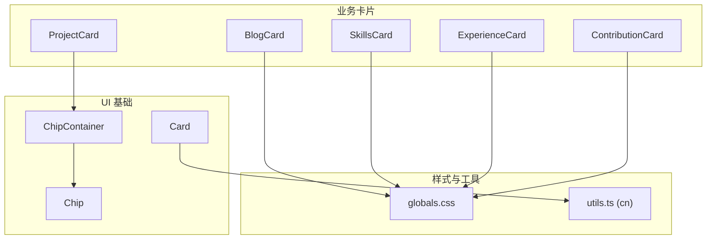
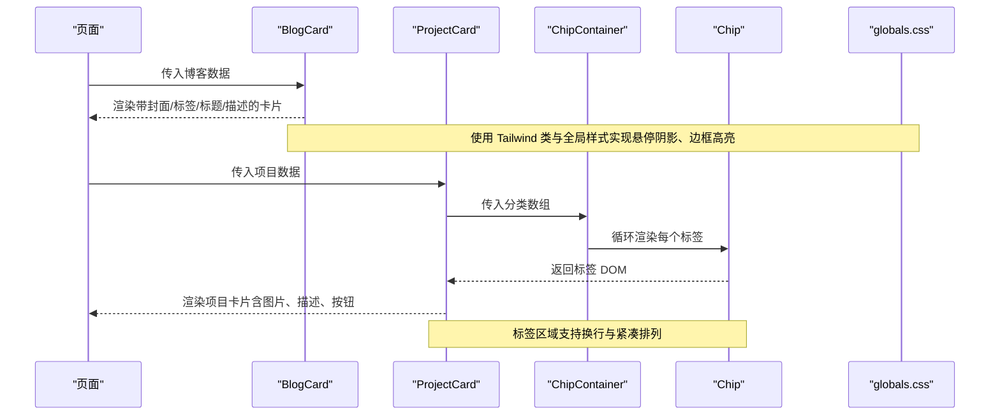
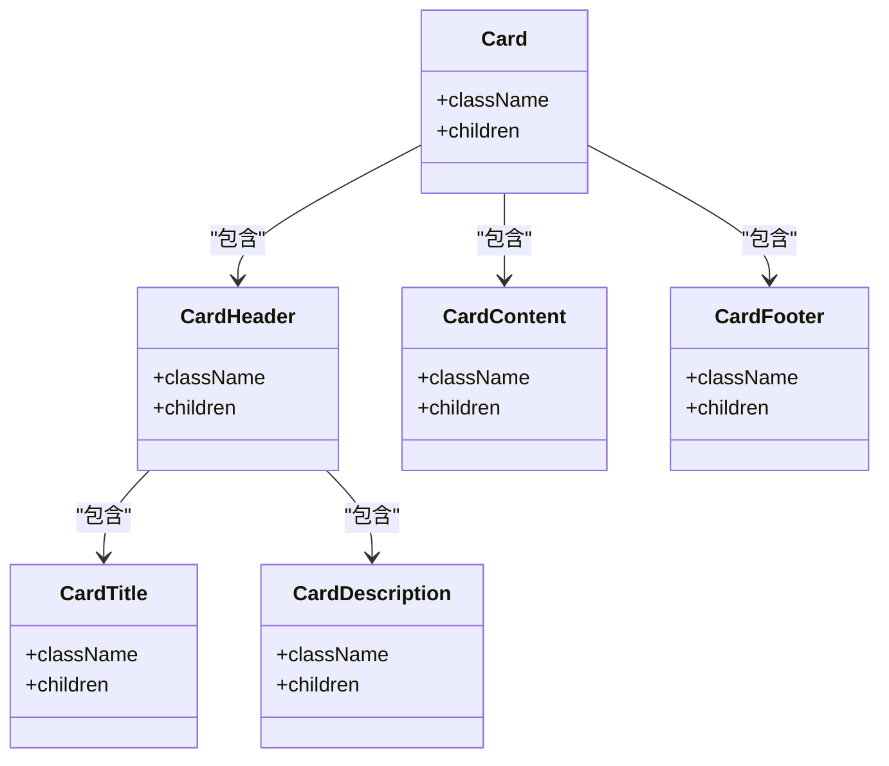
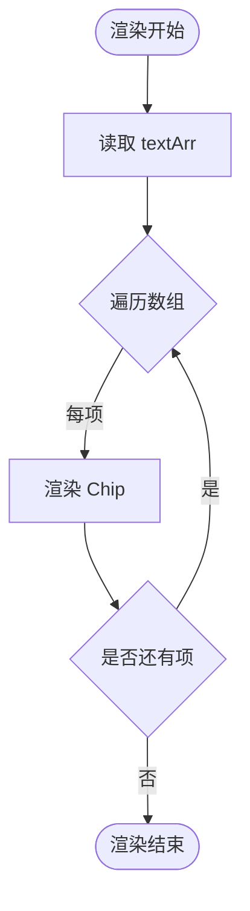
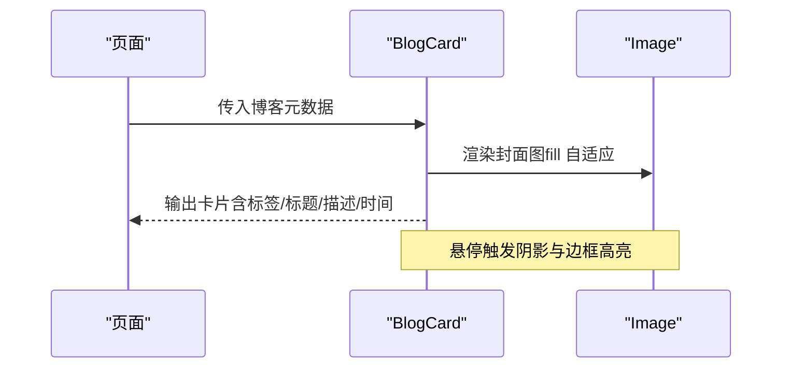
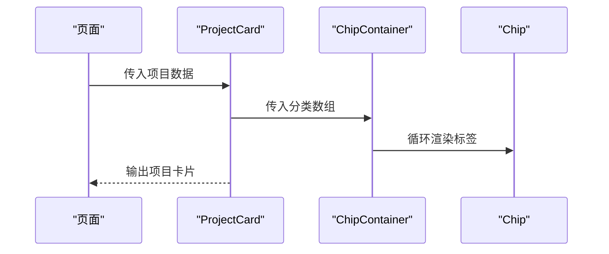
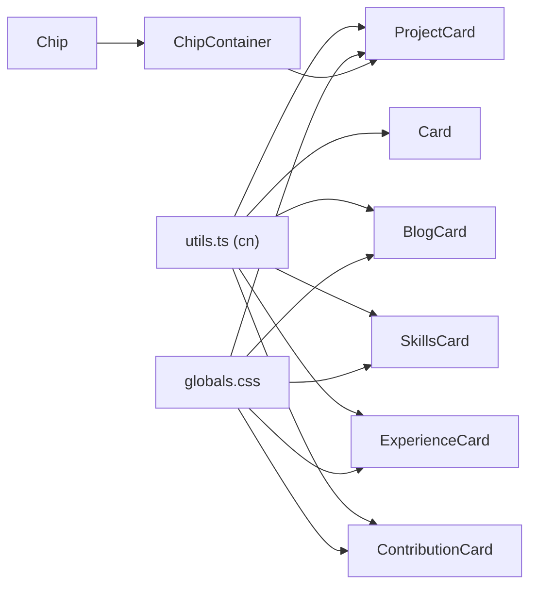

# 布局组件

<cite>
**本文引用的文件**
- [components/ui/card.tsx](file://components/ui/card.tsx)
- [components/ui/chip-container.tsx](file://components/ui/chip-container.tsx)
- [components/ui/chip.tsx](file://components/ui/chip.tsx)
- [app/globals.css](file://app/globals.css)
- [lib/utils.ts](file://lib/utils.ts)
- [components/blogs/blog-card.tsx](file://components/blogs/blog-card.tsx)
- [components/projects/project-card.tsx](file://components/projects/project-card.tsx)
- [components/skills/skills-card.tsx](file://components/skills/skills-card.tsx)
- [components/experience/experience-card.tsx](file://components/experience/experience-card.tsx)
- [components/contributions/contribution-card.tsx](file://components/contributions/contribution-card.tsx)
</cite>

## 目录
1. [简介](#简介)
2. [项目结构](#项目结构)
3. [核心组件](#核心组件)
4. [架构总览](#架构总览)
5. [详细组件分析](#详细组件分析)
6. [依赖关系分析](#依赖关系分析)
7. [性能考量](#性能考量)
8. [故障排查指南](#故障排查指南)
9. [结论](#结论)
10. [附录](#附录)

## 简介
本文件聚焦于项目的布局组件体系，围绕卡片、芯片容器与芯片等基础布局元素，系统阐述其实现方式、样式系统、边框与阴影处理、响应式适配策略，以及组合模式、插槽机制与内容投影。同时覆盖不同尺寸变体、状态管理与交互行为，并提供实际使用场景与性能优化建议，帮助读者快速掌握并高效复用这些组件。

## 项目结构
布局相关代码主要分布在以下位置：
- UI 基础组件：card、chip-container、chip
- 业务卡片：blog-card、project-card、skills-card、experience-card、contribution-card
- 全局样式：globals.css（主题变量、动画、卡片样式）
- 工具函数：utils.ts（类名合并）

图表来源
- [components/ui/card.tsx:1-87](file://components/ui/card.tsx#L1-L87)
- [components/ui/chip-container.tsx:1-16](file://components/ui/chip-container.tsx#L1-L16)
- [components/ui/chip.tsx:1-12](file://components/ui/chip.tsx#L1-L12)
- [app/globals.css:28-333](file://app/globals.css#L28-L333)
- [lib/utils.ts:1-25](file://lib/utils.ts#L1-L25)

章节来源
- [components/ui/card.tsx:1-87](file://components/ui/card.tsx#L1-L87)
- [components/ui/chip-container.tsx:1-16](file://components/ui/chip-container.tsx#L1-L16)
- [components/ui/chip.tsx:1-12](file://components/ui/chip.tsx#L1-L12)
- [app/globals.css:28-333](file://app/globals.css#L28-L333)
- [lib/utils.ts:1-25](file://lib/utils.ts#L1-L25)

## 核心组件
本节对基础布局组件进行拆解，说明其职责、属性、样式与扩展点。

- Card 组件族
  - 包含 Card、CardHeader、CardTitle、CardDescription、CardContent、CardFooter，采用 forwardRef 暴露 ref，通过 className 透传与 cn 工具合并类名，提供统一的圆角、边框、背景色与阴影基线样式。
  - 适合用于信息块、文章摘要、技能展示等结构化内容。

- ChipContainer 与 Chip
  - ChipContainer 接收字符串数组，渲染为可换行的标签列表；Chip 为单个标签的原子样式，具备内边距、边框、背景与字体设置。
  - 适合用于分类、标签、技能维度等小体量信息的聚合展示。

- 工具函数
  - utils.ts 中的 cn 基于 clsx 与 tailwind-merge，确保类名冲突时正确合并，是样式可扩展性的关键支撑。

章节来源
- [components/ui/card.tsx:1-87](file://components/ui/card.tsx#L1-L87)
- [components/ui/chip-container.tsx:1-16](file://components/ui/chip-container.tsx#L1-L16)
- [components/ui/chip.tsx:1-12](file://components/ui/chip.tsx#L1-L12)
- [lib/utils.ts:1-25](file://lib/utils.ts#L1-L25)

## 架构总览
布局组件遵循“基础组件 + 业务卡片”的分层设计：
- 基础组件提供稳定的视觉与交互基线（圆角、边框、阴影、间距、排版）。
- 业务卡片组合基础组件与图标、图片、链接等，承载具体领域语义。
- 全局样式集中管理主题变量、多主题切换与通用动画，保证一致性与可维护性。

图表来源
- [components/blogs/blog-card.tsx:1-96](file://components/blogs/blog-card.tsx#L1-L96)
- [components/projects/project-card.tsx:1-51](file://components/projects/project-card.tsx#L1-L51)
- [components/ui/chip-container.tsx:1-16](file://components/ui/chip-container.tsx#L1-L16)
- [components/ui/chip.tsx:1-12](file://components/ui/chip.tsx#L1-L12)
- [app/globals.css:28-333](file://app/globals.css#L28-L333)

## 详细组件分析

### 卡片组件族（Card）
- 结构与职责
  - Card：外层容器，统一圆角、边框、背景与阴影。
  - CardHeader/CardTitle/CardDescription：头部区块与标题、描述排版。
  - CardContent：内容区，默认顶部留白以对齐 Header。
  - CardFooter：底部操作区，水平居中或两端对齐。
- 样式系统
  - 通过 cn 合并外部 className，便于覆盖默认样式。
  - 颜色与圆角来自主题变量，支持多主题切换。
- 组合与插槽
  - 通过 children 注入任意内容，形成灵活的组合模式。
- 响应式与交互
  - 结合 Tailwind 断点与 hover/focus-within 实现悬停阴影与边框高亮。
- 扩展建议
  - 可增加 size 变体（如 sm/md/lg），通过 props 控制 padding 与字号。
  - 可增加 variant 变体（如 outline/ghost），通过条件类名切换边框与背景。

图表来源
- [components/ui/card.tsx:1-87](file://components/ui/card.tsx#L1-L87)

章节来源
- [components/ui/card.tsx:1-87](file://components/ui/card.tsx#L1-L87)

### 芯片容器与芯片（ChipContainer & Chip）
- 结构与职责
  - ChipContainer：接收字符串数组，渲染为 flex-wrap 的标签集合。
  - Chip：单个标签，具备固定内边距、边框、背景与字体大小。
- 样式系统
  - 使用主题色与边框变量，确保在不同主题下保持一致对比度。
- 组合与插槽
  - 通过数组驱动渲染，无需额外插槽即可扩展。
- 响应式与交互
  - 自动换行，适配窄屏；可叠加 hover 态增强反馈。
- 扩展建议
  - 增加 size 变体（xs/sm/md），通过 props 控制字号与内边距。
  - 增加 variant 变体（如 solid/outlined），通过条件类名切换样式。

图表来源
- [components/ui/chip-container.tsx:1-16](file://components/ui/chip-container.tsx#L1-L16)
- [components/ui/chip.tsx:1-12](file://components/ui/chip.tsx#L1-L12)

章节来源
- [components/ui/chip-container.tsx:1-16](file://components/ui/chip-container.tsx#L1-L16)
- [components/ui/chip.tsx:1-12](file://components/ui/chip.tsx#L1-L12)

### 博客卡片（BlogCard）
- 功能要点
  - 封面图、标签截断、标题与描述、日期与阅读时长、箭头指示。
  - 悬停时提升阴影、边框高亮、轻微上移，增强点击意图。
- 样式与响应式
  - 使用 Tailwind 栅格与断点控制布局；图片使用 fill 自适应容器。
- 交互行为
  - 整体作为 Link 包裹，支持键盘导航与焦点可见性。
- 性能建议
  - 图片懒加载与占位色块减少首屏压力；避免过多重绘。

图表来源
- [components/blogs/blog-card.tsx:1-96](file://components/blogs/blog-card.tsx#L1-L96)

章节来源
- [components/blogs/blog-card.tsx:1-96](file://components/blogs/blog-card.tsx#L1-L96)

### 项目卡片（ProjectCard）
- 功能要点
  - 公司 Logo 图、名称、简短描述、分类标签（ChipContainer）、“了解更多”按钮。
  - 右下角类型标识（个人/工作）在宽屏显示。
- 样式与响应式
  - 图片区域固定高度，内容区弹性增长；按钮在小屏全宽、大屏自适应。
- 交互行为
  - 按钮作为 Link，支持键盘与屏幕阅读器。
- 性能建议
  - 图片按需加载；标签数量较多时可考虑虚拟滚动或分页。

图表来源
- [components/projects/project-card.tsx:1-51](file://components/projects/project-card.tsx#L1-L51)
- [components/ui/chip-container.tsx:1-16](file://components/ui/chip-container.tsx#L1-L16)
- [components/ui/chip.tsx:1-12](file://components/ui/chip.tsx#L1-L12)

章节来源
- [components/projects/project-card.tsx:1-51](file://components/projects/project-card.tsx#L1-L51)

### 技能卡片（SkillsCard）
- 功能要点
  - 网格布局展示多个技能卡片，包含图标、名称、描述与评分。
- 样式与响应式
  - 使用响应式栅格（sm/lg）自适应列数；卡片内部固定高度保持对齐。
- 交互行为
  - 可通过 hover 态增强反馈（如边框高亮）。
- 性能建议
  - 大量技能条目时考虑分页或懒加载。

章节来源
- [components/skills/skills-card.tsx:1-31](file://components/skills/skills-card.tsx#L1-L31)

### 经验卡片（ExperienceCard）
- 功能要点
  - 公司 Logo、职位、公司名、地点、时间段、技能标签、详情按钮。
- 样式与响应式
  - 移动端紧凑布局，桌面端更宽松；标签与按钮在小屏全宽。
- 交互行为
  - 按钮作为 Link，支持键盘导航。
- 性能建议
  - 图片使用合适尺寸与格式；避免过度嵌套导致重排。

章节来源
- [components/experience/experience-card.tsx:1-112](file://components/experience/experience-card.tsx#L1-L112)

### 贡献卡片（ContributionCard）
- 功能要点
  - 仓库名、贡献描述、组织信息，右上角外链图标。
- 样式与响应式
  - 网格布局，卡片等高；外链图标绝对定位不干扰内容流。
- 交互行为
  - 整卡可点击跳转，支持键盘与焦点可见性。
- 性能建议
  - 列表较长时可采用虚拟滚动或分页。

章节来源
- [components/contributions/contribution-card.tsx:1-64](file://components/contributions/contribution-card.tsx#L1-L64)

## 依赖关系分析
- 组件耦合
  - 业务卡片依赖 UI 基础组件（Card、ChipContainer、Chip）与全局样式（主题变量、动画）。
  - 工具函数 cn 被多处使用，确保类名合并的正确性。
- 外部依赖
  - Tailwind CSS 提供原子化样式能力。
  - next/image 用于图片优化。
- 潜在风险
  - 若主题变量缺失或命名不一致，可能导致样式异常。
  - 图片未设置 alt 或尺寸不当会影响可访问性与性能。

图表来源
- [lib/utils.ts:1-25](file://lib/utils.ts#L1-L25)
- [app/globals.css:28-333](file://app/globals.css#L28-L333)
- [components/ui/card.tsx:1-87](file://components/ui/card.tsx#L1-L87)
- [components/ui/chip-container.tsx:1-16](file://components/ui/chip-container.tsx#L1-L16)
- [components/ui/chip.tsx:1-12](file://components/ui/chip.tsx#L1-L12)
- [components/blogs/blog-card.tsx:1-96](file://components/blogs/blog-card.tsx#L1-L96)
- [components/projects/project-card.tsx:1-51](file://components/projects/project-card.tsx#L1-L51)
- [components/skills/skills-card.tsx:1-31](file://components/skills/skills-card.tsx#L1-L31)
- [components/experience/experience-card.tsx:1-112](file://components/experience/experience-card.tsx#L1-L112)
- [components/contributions/contribution-card.tsx:1-64](file://components/contributions/contribution-card.tsx#L1-L64)

章节来源
- [lib/utils.ts:1-25](file://lib/utils.ts#L1-L25)
- [app/globals.css:28-333](file://app/globals.css#L28-L333)

## 性能考量
- 图片优化
  - 使用 next/image 的 fill 与 object-cover 自适应容器，减少布局抖动。
  - 为图片设置合适的宽高与占位背景，降低 CLS。
- 样式与主题
  - 通过主题变量统一管理颜色与圆角，减少重复样式，利于缓存。
  - 使用 Tailwind 原子类，避免自定义 CSS 膨胀。
- 交互与动画
  - 合理使用 transform 与 opacity 实现动画，避免触发布局重排。
  - 限制复杂动画的使用范围，仅在必要时启用。
- 列表与长内容
  - 对大量卡片使用分页或虚拟滚动，减少初始渲染开销。
  - 对标签与描述进行截断（line-clamp），避免溢出影响布局。
- 可访问性
  - 为图片添加 alt，为链接提供明确的文本或 aria-label。
  - 确保焦点可见性与键盘可达性。

[本节为通用指导，不直接分析具体文件]

## 故障排查指南
- 主题变量未生效
  - 检查 globals.css 中主题变量是否正确定义与应用。
  - 确认组件使用的变量名与主题一致。
- 卡片阴影与边框不明显
  - 检查 hover 态类名是否正确应用，浏览器是否支持相应特性。
  - 确认父容器 overflow 未隐藏阴影。
- 图片变形或拉伸
  - 检查 next/image 的 fill 与父容器尺寸，确保对象适配模式正确。
- 标签换行异常
  - 检查 ChipContainer 的 flex-wrap 与 gap 设置，确认内容宽度与容器匹配。
- 链接不可点击或焦点不可见
  - 检查 Link 包裹层级与 pointer-events，确保焦点样式可见。

章节来源
- [app/globals.css:28-333](file://app/globals.css#L28-L333)
- [components/blogs/blog-card.tsx:1-96](file://components/blogs/blog-card.tsx#L1-L96)
- [components/projects/project-card.tsx:1-51](file://components/projects/project-card.tsx#L1-L51)
- [components/ui/chip-container.tsx:1-16](file://components/ui/chip-container.tsx#L1-L16)

## 结论
本项目布局组件体系以 Card、ChipContainer、Chip 为基础，配合业务卡片实现丰富的信息展示。通过主题变量与 Tailwind 原子类，实现了统一的视觉风格与良好的可维护性。结合合理的响应式策略与交互细节，提供了良好的用户体验。建议在后续迭代中继续完善尺寸与变体、优化长列表性能，并加强可访问性测试。

[本节为总结，不直接分析具体文件]

## 附录
- 使用示例路径参考
  - 博客卡片：[components/blogs/blog-card.tsx](file://components/blogs/blog-card.tsx)
  - 项目卡片：[components/projects/project-card.tsx](file://components/projects/project-card.tsx)
  - 技能卡片：[components/skills/skills-card.tsx](file://components/skills/skills-card.tsx)
  - 经验卡片：[components/experience/experience-card.tsx](file://components/experience/experience-card.tsx)
  - 贡献卡片：[components/contributions/contribution-card.tsx](file://components/contributions/contribution-card.tsx)
  - 基础卡片：[components/ui/card.tsx](file://components/ui/card.tsx)
  - 芯片容器与芯片：[components/ui/chip-container.tsx](file://components/ui/chip-container.tsx)、[components/ui/chip.tsx](file://components/ui/chip.tsx)
  - 全局样式：[app/globals.css](file://app/globals.css)
  - 工具函数：[lib/utils.ts](file://lib/utils.ts)

[本节为索引，不直接分析具体文件]