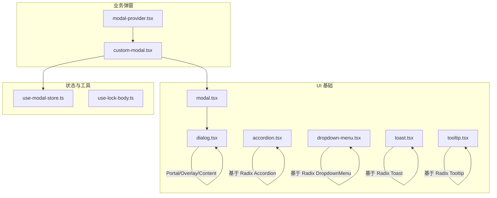
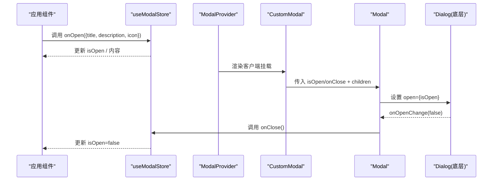
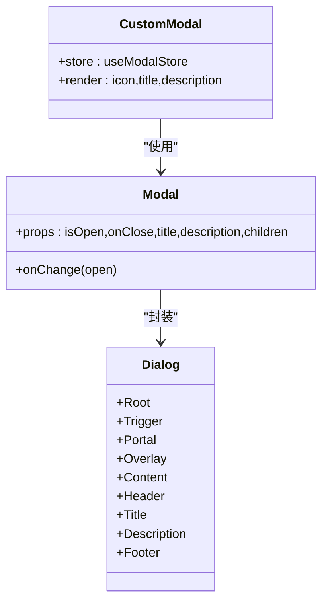
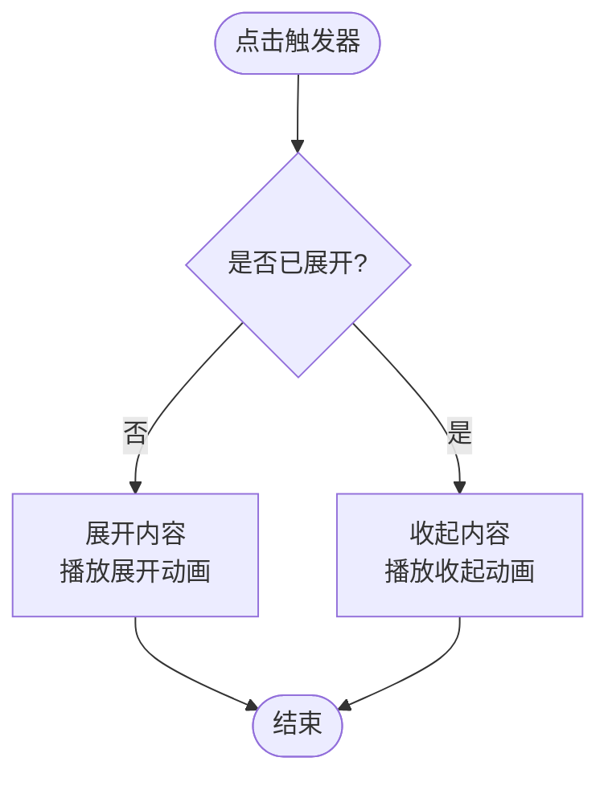
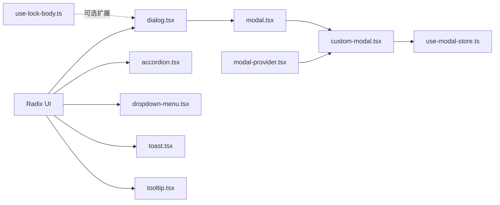

# 模态组件

<cite>
**本文引用的文件**
- [components/ui/dialog.tsx](file://components/ui/dialog.tsx)
- [components/ui/modal.tsx](file://components/ui/modal.tsx)
- [components/modals/custom-modal.tsx](file://components/modals/custom-modal.tsx)
- [providers/modal-provider.tsx](file://providers/modal-provider.tsx)
- [hooks/use-modal-store.ts](file://hooks/use-modal-store.ts)
- [hooks/use-lock-body.ts](file://hooks/use-lock-body.ts)
- [components/ui/accordion.tsx](file://components/ui/accordion.tsx)
- [components/ui/dropdown-menu.tsx](file://components/ui/dropdown-menu.tsx)
- [components/ui/toast.tsx](file://components/ui/toast.tsx)
- [components/ui/tooltip.tsx](file://components/ui/tooltip.tsx)
</cite>

## 目录
1. [简介](#简介)
2. [项目结构](#项目结构)
3. [核心组件](#核心组件)
4. [架构总览](#架构总览)
5. [详细组件分析](#详细组件分析)
6. [依赖关系分析](#依赖关系分析)
7. [性能考虑](#性能考虑)
8. [故障排查指南](#故障排查指南)
9. [结论](#结论)
10. [附录](#附录)

## 简介
本文件围绕项目中的弹出层与浮层类组件进行系统化文档化，重点覆盖：
- 模态框（Modal/Dialog）：层级管理、焦点陷阱、键盘导航、ESC 关闭、动画过渡、响应式布局。
- 手风琴（Accordion）：展开/收起的交互与动画。
- 下拉菜单（Dropdown Menu）、提示（Tooltip）、通知（Toast）等辅助浮层组件的行为与可访问性。
- 全局状态与 Provider：通过 Zustand store 控制模态开关与内容注入。
- 最佳实践：嵌套模态、动态内容与异步加载、无障碍支持（a11y）与 SEO 注意事项。

## 项目结构
本项目将“基础 UI 原子”放在 components/ui，业务级弹窗封装在 components/modals，并通过 providers 挂载到应用根节点；状态集中在 hooks 中，使用 Zustand 管理。

图表来源
- [components/ui/dialog.tsx:1-121](file://components/ui/dialog.tsx#L1-L121)
- [components/ui/modal.tsx:1-40](file://components/ui/modal.tsx#L1-L40)
- [components/modals/custom-modal.tsx:1-30](file://components/modals/custom-modal.tsx#L1-L30)
- [providers/modal-provider.tsx:1-24](file://providers/modal-provider.tsx#L1-L24)
- [hooks/use-modal-store.ts:1-36](file://hooks/use-modal-store.ts#L1-L36)
- [hooks/use-lock-body.ts:1-13](file://hooks/use-lock-body.ts#L1-L13)
- [components/ui/accordion.tsx:1-63](file://components/ui/accordion.tsx#L1-L63)
- [components/ui/dropdown-menu.tsx:1-201](file://components/ui/dropdown-menu.tsx#L1-L201)
- [components/ui/toast.tsx:1-128](file://components/ui/toast.tsx#L1-L128)
- [components/ui/tooltip.tsx:1-31](file://components/ui/tooltip.tsx#L1-L31)

章节来源
- [components/ui/dialog.tsx:1-121](file://components/ui/dialog.tsx#L1-L121)
- [components/ui/modal.tsx:1-40](file://components/ui/modal.tsx#L1-L40)
- [components/modals/custom-modal.tsx:1-30](file://components/modals/custom-modal.tsx#L1-L30)
- [providers/modal-provider.tsx:1-24](file://providers/modal-provider.tsx#L1-L24)
- [hooks/use-modal-store.ts:1-36](file://hooks/use-modal-store.ts#L1-L36)
- [hooks/use-lock-body.ts:1-13](file://hooks/use-lock-body.ts#L1-L13)

## 核心组件
- 对话框基座（Dialog）：基于 Radix Dialog，提供 Portal 渲染、遮罩层、内容容器、标题/描述/页眉/页脚等语义化子组件，内置开合动画与聚焦管理。
- 模态封装（Modal）：对 Dialog 的二次封装，统一传入 title、description、children，并桥接 open/onClose。
- 自定义模态（CustomModal）：消费全局 store，展示图标、标题、描述等内容，作为应用级弹窗入口。
- 模态提供者（ModalProvider）：在客户端挂载 CustomModal，避免 SSR 水合差异。
- 模态状态（useModalStore）：Zustand 全局 store，集中管理 isOpen、title、description、icon 以及 onOpen/onClose。
- 滚动锁定（useLockBody）：用于在需要时锁定页面滚动（当前未直接绑定到 Dialog，但可作为扩展能力）。

章节来源
- [components/ui/dialog.tsx:1-121](file://components/ui/dialog.tsx#L1-L121)
- [components/ui/modal.tsx:1-40](file://components/ui/modal.tsx#L1-L40)
- [components/modals/custom-modal.tsx:1-30](file://components/modals/custom-modal.tsx#L1-L30)
- [providers/modal-provider.tsx:1-24](file://providers/modal-provider.tsx#L1-L24)
- [hooks/use-modal-store.ts:1-36](file://hooks/use-modal-store.ts#L1-L36)
- [hooks/use-lock-body.ts:1-13](file://hooks/use-lock-body.ts#L1-L13)

## 架构总览
下图展示了从触发到关闭的完整调用链，包括状态管理与 DOM 渲染位置。

图表来源
- [hooks/use-modal-store.ts:1-36](file://hooks/use-modal-store.ts#L1-L36)
- [providers/modal-provider.tsx:1-24](file://providers/modal-provider.tsx#L1-L24)
- [components/modals/custom-modal.tsx:1-30](file://components/modals/custom-modal.tsx#L1-L30)
- [components/ui/modal.tsx:1-40](file://components/ui/modal.tsx#L1-L40)
- [components/ui/dialog.tsx:1-121](file://components/ui/dialog.tsx#L1-L121)

## 详细组件分析

### 对话框与模态（Dialog/Modal）
- 层级管理
  - 使用 Portal 将内容渲染到独立 DOM 树，确保 z-index 可控且不受父级堆叠上下文影响。
  - 遮罩层与内容容器固定定位，居中显示，具备响应式宽度。
- 焦点陷阱与键盘导航
  - 基于 Radix Dialog，自动处理焦点进入/移出、Tab 循环、Esc 关闭等行为。
  - 关闭按钮包含屏幕阅读器文本，提升可访问性。
- 动画与过渡
  - 打开/关闭使用 data-[state] 驱动的入场/出场动画（淡入淡出、缩放、滑入滑出），时长与缓动由样式类控制。
- 响应式行为
  - 移动端全宽、桌面端最大宽度限制；圆角与间距随断点调整。
- 组合与扩展
  - 通过 DialogHeader/Title/Description/Footer 快速构建标准对话框。
  - 可通过 className 覆盖默认样式，满足定制需求。

图表来源
- [components/ui/dialog.tsx:1-121](file://components/ui/dialog.tsx#L1-L121)
- [components/ui/modal.tsx:1-40](file://components/ui/modal.tsx#L1-L40)
- [components/modals/custom-modal.tsx:1-30](file://components/modals/custom-modal.tsx#L1-L30)

章节来源
- [components/ui/dialog.tsx:1-121](file://components/ui/dialog.tsx#L1-L121)
- [components/ui/modal.tsx:1-40](file://components/ui/modal.tsx#L1-L40)
- [components/modals/custom-modal.tsx:1-30](file://components/modals/custom-modal.tsx#L1-L30)

### 手风琴（Accordion）
- 交互与动画
  - 基于 Radix Accordion，点击触发器切换展开/收起。
  - 内容区域使用数据状态驱动动画（向上/向下滑动），箭头图标旋转指示状态。
- 可访问性
  - 使用语义化 Header/Trigger/Content，配合键盘操作与屏幕阅读器。
- 响应式
  - 字体大小与间距在小屏上更紧凑，适配移动端阅读。

图表来源
- [components/ui/accordion.tsx:1-63](file://components/ui/accordion.tsx#L1-L63)

章节来源
- [components/ui/accordion.tsx:1-63](file://components/ui/accordion.tsx#L1-L63)

### 下拉菜单（Dropdown Menu）
- 浮层定位与层级
  - 使用 Portal 渲染，z-index 较高，避免被其他元素遮挡。
- 动画与过渡
  - 打开/关闭具备淡入淡出与缩放动画，并根据侧边方向滑入。
- 键盘与可访问性
  - 支持 Tab 导航、方向键选择、Esc 关闭等标准行为。

章节来源
- [components/ui/dropdown-menu.tsx:1-201](file://components/ui/dropdown-menu.tsx#L1-L201)

### 提示（Tooltip）
- 轻量浮层，适合补充说明信息。
- 具备入场/出场动画与偏移量配置。
- 通过 Provider 包裹，统一管理 tooltip 行为。

章节来源
- [components/ui/tooltip.tsx:1-31](file://components/ui/tooltip.tsx#L1-L31)

### 通知（Toast）
- 非阻塞提示，支持多种变体（默认/破坏性）。
- 自动或手动关闭，支持滑动手势关闭。
- 视口定位与堆叠顺序合理，避免遮挡关键内容。

章节来源
- [components/ui/toast.tsx:1-128](file://components/ui/toast.tsx#L1-L128)

## 依赖关系分析
- 外部依赖
  - Radix UI 系列（Dialog/Accordion/DropdownMenu/Toast/Tooltip）提供无障碍与状态机能力。
  - Lucide React 提供图标。
  - Zustand 提供轻量全局状态。
- 内部依赖
  - dialog.tsx 为所有浮层的基础；modal.tsx 在其之上做业务封装；custom-modal.tsx 消费 store 渲染具体视图；modal-provider.tsx 负责挂载。
  - use-lock-body.ts 可用于扩展滚动锁定能力（当前未与 Dialog 强耦合）。

图表来源
- [components/ui/dialog.tsx:1-121](file://components/ui/dialog.tsx#L1-L121)
- [components/ui/accordion.tsx:1-63](file://components/ui/accordion.tsx#L1-L63)
- [components/ui/dropdown-menu.tsx:1-201](file://components/ui/dropdown-menu.tsx#L1-L201)
- [components/ui/toast.tsx:1-128](file://components/ui/toast.tsx#L1-L128)
- [components/ui/tooltip.tsx:1-31](file://components/ui/tooltip.tsx#L1-L31)
- [components/ui/modal.tsx:1-40](file://components/ui/modal.tsx#L1-L40)
- [components/modals/custom-modal.tsx:1-30](file://components/modals/custom-modal.tsx#L1-L30)
- [providers/modal-provider.tsx:1-24](file://providers/modal-provider.tsx#L1-L24)
- [hooks/use-modal-store.ts:1-36](file://hooks/use-modal-store.ts#L1-L36)
- [hooks/use-lock-body.ts:1-13](file://hooks/use-lock-body.ts#L1-L13)

章节来源
- [components/ui/dialog.tsx:1-121](file://components/ui/dialog.tsx#L1-L121)
- [components/ui/modal.tsx:1-40](file://components/ui/modal.tsx#L1-L40)
- [components/modals/custom-modal.tsx:1-30](file://components/modals/custom-modal.tsx#L1-L30)
- [providers/modal-provider.tsx:1-24](file://providers/modal-provider.tsx#L1-L24)
- [hooks/use-modal-store.ts:1-36](file://hooks/use-modal-store.ts#L1-L36)
- [hooks/use-lock-body.ts:1-13](file://hooks/use-lock-body.ts#L1-L13)

## 性能考虑
- 渲染位置优化
  - 使用 Portal 将浮层渲染到根节点附近，减少重排与回流。
- 动画性能
  - 使用 CSS 动画与 transform 属性，避免触发布局抖动。
- 条件渲染
  - 仅在 isOpen 为真时渲染内容，减少不必要的 DOM 与事件监听。
- 客户端挂载
  - ModalProvider 通过 isMounted 判断避免 SSR 水合不一致导致的闪烁。
- 滚动锁定
  - 如需在弹窗期间禁用页面滚动，可在 Dialog 打开时启用 useLockBody，并在关闭时恢复。

[本节为通用指导，不直接分析具体文件]

## 故障排查指南
- 弹窗无法关闭
  - 检查 onOpenChange 是否正确回调 onClose；确认 store 的 isOpen 状态是否被正确更新。
- 焦点异常
  - 若自定义内容包含复杂表单，确保第一个可聚焦元素可访问；必要时在内容顶部添加 tabIndex 或使用 ref 聚焦。
- 动画卡顿
  - 检查是否存在大量重绘元素；尽量使用 transform/opacity 动画。
- 层级冲突
  - 确认 z-index 未被父级覆盖；Portal 应渲染到顶层容器。
- 滚动条跳动
  - 在弹窗打开时锁定 body 滚动，关闭后恢复原始 overflow 值。

章节来源
- [components/ui/modal.tsx:21-39](file://components/ui/modal.tsx#L21-L39)
- [components/ui/dialog.tsx:33-55](file://components/ui/dialog.tsx#L33-L55)
- [hooks/use-modal-store.ts:22-35](file://hooks/use-modal-store.ts#L22-L35)
- [hooks/use-lock-body.ts:4-12](file://hooks/use-lock-body.ts#L4-L12)

## 结论
本项目以 Radix UI 为基础构建了稳定、可访问的弹出层体系：
- Dialog/Modal 提供开箱即用的焦点管理、键盘交互与动画。
- 通过 Zustand store 实现跨组件的状态共享与内容注入。
- 手风琴、下拉菜单、提示、通知等组件完善了丰富的浮层场景。
- 建议在生产环境中结合 useLockBody 完善滚动锁定，按需扩展嵌套模态与异步加载策略，并遵循无障碍与 SEO 最佳实践。

[本节为总结性内容，不直接分析具体文件]

## 附录

### 使用示例与集成要点
- 打开模态
  - 在任意组件中调用 store.onOpen({ title, description, icon }) 即可显示 CustomModal。
- 关闭模态
  - 调用 store.onClose() 或通过 Dialog 的关闭按钮触发。
- 动态内容
  - 通过 store 的 title/description/icon 字段注入内容，便于复用同一弹窗模板。
- 异步加载
  - 建议在 store 中增加 loading 状态，或在 children 中懒加载重型内容，避免首屏阻塞。
- 嵌套模态
  - 当前实现为单例弹窗；如需嵌套，需引入栈式管理器（如维护一个 modalStack），并确保焦点与 ESC 行为按层级处理。
- 无障碍与 SEO
  - 使用语义化标签与 aria-* 属性（Radix 已内置）；为图片与图标提供替代文本；避免将重要 SEO 内容仅放入弹窗，优先放置在主文档流中。

章节来源
- [hooks/use-modal-store.ts:1-36](file://hooks/use-modal-store.ts#L1-L36)
- [components/modals/custom-modal.tsx:1-30](file://components/modals/custom-modal.tsx#L1-L30)
- [components/ui/dialog.tsx:1-121](file://components/ui/dialog.tsx#L1-L121)