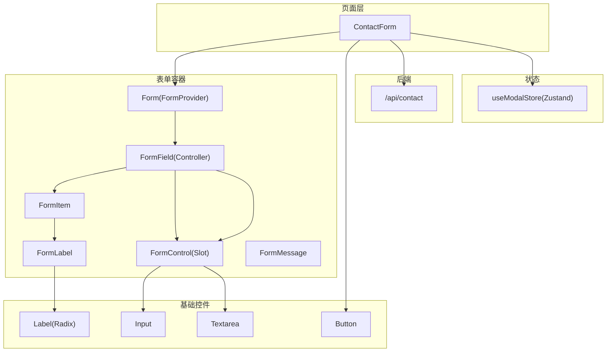
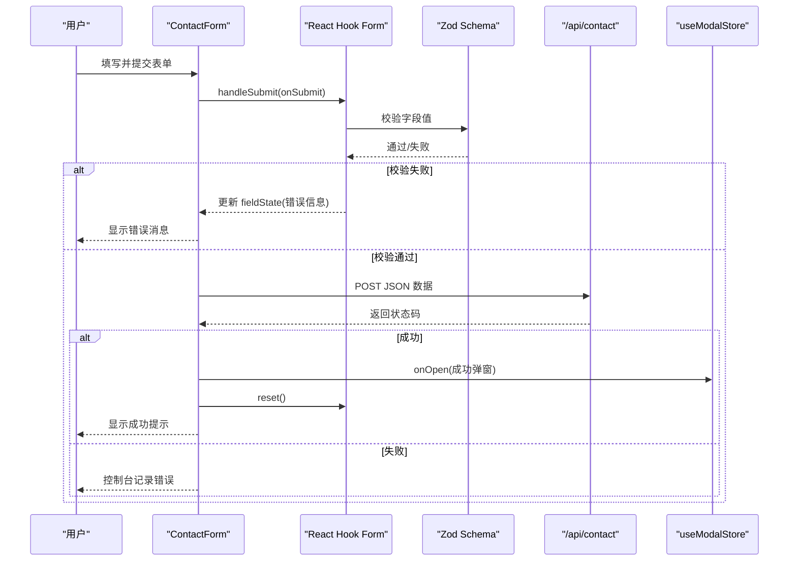
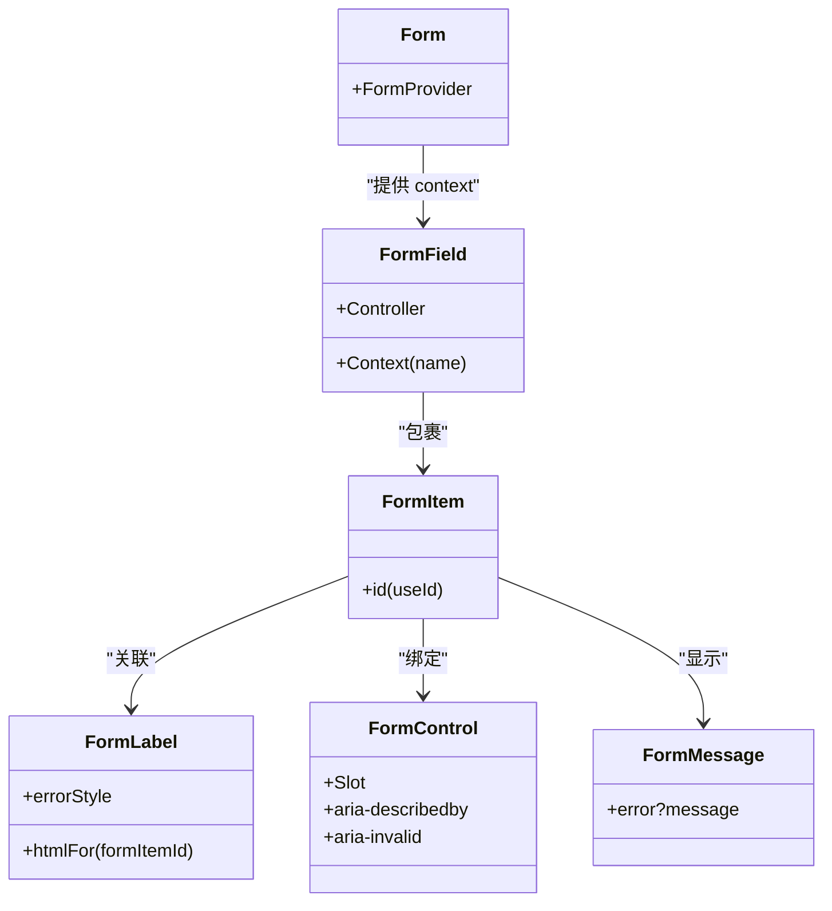
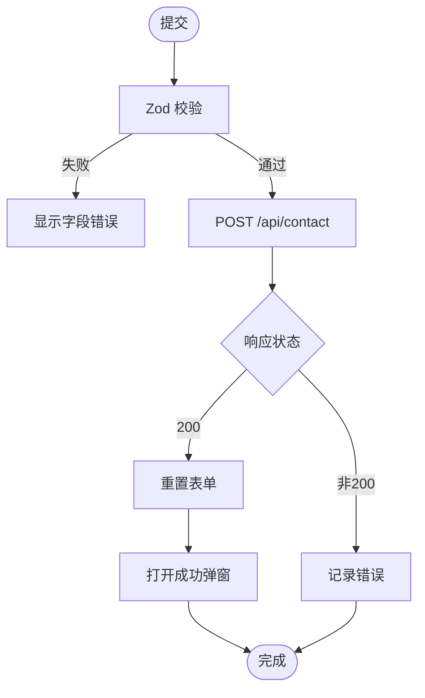
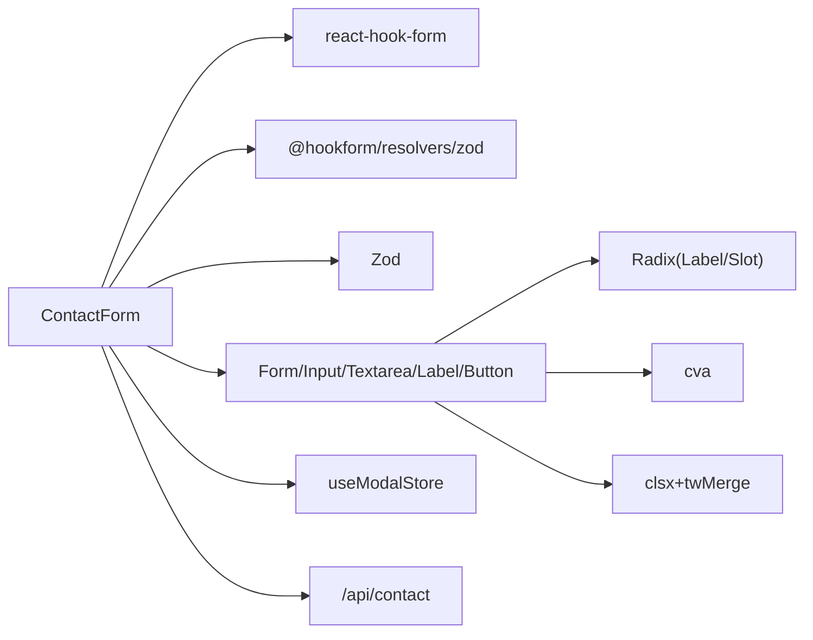

# 表单组件

<cite>
**本文引用的文件**
- [contact-form.tsx](file://components/forms/contact-form.tsx)
- [form.tsx](file://components/ui/form.tsx)
- [input.tsx](file://components/ui/input.tsx)
- [textarea.tsx](file://components/ui/textarea.tsx)
- [label.tsx](file://components/ui/label.tsx)
- [button.tsx](file://components/ui/button.tsx)
- [route.ts](file://app/api/contact/route.ts)
- [use-modal-store.ts](file://hooks/use-modal-store.ts)
- [utils.ts](file://lib/utils.ts)
</cite>

## 目录
1. [简介](#简介)
2. [项目结构](#项目结构)
3. [核心组件](#核心组件)
4. [架构总览](#架构总览)
5. [详细组件分析](#详细组件分析)
6. [依赖关系分析](#依赖关系分析)
7. [性能考量](#性能考量)
8. [故障排查指南](#故障排查指南)
9. [结论](#结论)
10. [附录](#附录)

## 简介
本文件为基于 React Hook Form 与 Zod 的表单系统实现文档，覆盖输入框、文本域、标签等基础表单元素，以及表单验证机制、错误处理、数据绑定与提交流程。同时说明组件的可访问性支持、响应式行为与主题定制选项，并提供表单组合模式、自定义验证规则与最佳实践示例。

## 项目结构
该表单系统由“业务表单”和“UI 基础组件”两部分组成：
- 业务表单：ContactForm 负责定义字段、校验规则、提交逻辑与用户反馈。
- UI 基础组件：Form/FormField/FormItem/FormLabel/FormControl/FormMessage 封装了 React Hook Form 的上下文与可访问性属性；Input、Textarea、Label、Button 提供样式与交互能力。
- API 路由：Next.js Serverless 函数将表单数据转发到外部服务（如 Google Forms）。
- 状态管理：使用 Zustand store 控制成功提示弹窗。

图表来源
- [contact-form.tsx:32-140](file://components/forms/contact-form.tsx#L32-L140)
- [form.tsx:16-177](file://components/ui/form.tsx#L16-L177)
- [input.tsx:8-23](file://components/ui/input.tsx#L8-L23)
- [textarea.tsx:8-22](file://components/ui/textarea.tsx#L8-L22)
- [label.tsx:13-24](file://components/ui/label.tsx#L13-L24)
- [button.tsx:42-54](file://components/ui/button.tsx#L42-L54)
- [route.ts:3-30](file://app/api/contact/route.ts#L3-L30)
- [use-modal-store.ts:22-35](file://hooks/use-modal-store.ts#L22-L35)

章节来源
- [contact-form.tsx:32-140](file://components/forms/contact-form.tsx#L32-L140)
- [form.tsx:16-177](file://components/ui/form.tsx#L16-L177)

## 核心组件
- ContactForm：定义 Zod Schema、初始化 useForm、绑定字段、处理提交并展示结果。
- Form/FormField/FormItem/FormLabel/FormControl/FormMessage：封装 React Hook Form 的 Provider/Controller/Context，注入可访问性属性与错误消息。
- Input/Textarea/Label/Button：可复用 UI 控件，具备焦点环、禁用态、主题变量等样式。
- /api/contact：服务端接收表单数据并转发至外部表单服务。
- useModalStore：集中管理弹窗开关与内容。

章节来源
- [contact-form.tsx:21-71](file://components/forms/contact-form.tsx#L21-L71)
- [form.tsx:16-177](file://components/ui/form.tsx#L16-L177)
- [input.tsx:8-23](file://components/ui/input.tsx#L8-L23)
- [textarea.tsx:8-22](file://components/ui/textarea.tsx#L8-L22)
- [label.tsx:13-24](file://components/ui/label.tsx#L13-L24)
- [button.tsx:42-54](file://components/ui/button.tsx#L42-L54)
- [route.ts:3-30](file://app/api/contact/route.ts#L3-L30)
- [use-modal-store.ts:22-35](file://hooks/use-modal-store.ts#L22-L35)

## 架构总览
表单从用户输入到提交完成的完整流程如下：

图表来源
- [contact-form.tsx:37-71](file://components/forms/contact-form.tsx#L37-L71)
- [route.ts:3-30](file://app/api/contact/route.ts#L3-L30)
- [use-modal-store.ts:22-35](file://hooks/use-modal-store.ts#L22-L35)

## 详细组件分析

### 表单容器与字段绑定（Form/FormField/FormItem/FormLabel/FormControl/FormMessage）
- 职责
  - Form：作为 FormProvider，向下传递 form 实例。
  - FormField：使用 Controller 将受控字段接入 React Hook Form，并通过 Context 暴露字段名。
  - FormItem：生成唯一 id，组织布局间距。
  - FormLabel：关联 FormControl 的 id，并在错误时改变样式。
  - FormControl：通过 Slot 透传原生 input/textarea 属性，设置 aria-describedby 与 aria-invalid。
  - FormMessage：根据错误状态渲染错误消息或自定义子节点。
- 可访问性
  - 使用 htmlFor/id 建立 label 与控件的关联。
  - 使用 aria-describedby 描述说明与错误信息。
  - 使用 aria-invalid 表达当前字段是否无效。
- 主题与样式
  - 通过 cn 合并类名，支持传入 className 覆盖默认样式。
  - 颜色与尺寸遵循设计系统的 CSS 变量（如 ring、destructive）。

图表来源
- [form.tsx:16-177](file://components/ui/form.tsx#L16-L177)

章节来源
- [form.tsx:16-177](file://components/ui/form.tsx#L16-L177)

### 输入控件（Input/Textarea/Label/Button）
- Input/Textarea
  - 全宽、圆角、边框、占位符、焦点环、禁用态。
  - 通过 forwardRef 支持 ref 透传，便于测试与聚焦。
- Label
  - 基于 Radix Label，语义化且可访问。
- Button
  - 多 variant/size，统一 focus-visible 与禁用态。
  - 支持 asChild 以嵌入其他元素。

章节来源
- [input.tsx:8-23](file://components/ui/input.tsx#L8-L23)
- [textarea.tsx:8-22](file://components/ui/textarea.tsx#L8-L22)
- [label.tsx:13-24](file://components/ui/label.tsx#L13-L24)
- [button.tsx:42-54](file://components/ui/button.tsx#L42-L54)

### 业务表单（ContactForm）
- 字段与校验
  - 使用 zodResolver 将 Zod Schema 与 React Hook Form 集成。
  - 字段包括 name、email、message、social（可选 URL）。
- 数据绑定
  - 通过 FormField.render 获取 field，并将 {...field} 透传给 Input/Textarea。
- 提交流程
  - 调用 fetch 向 /api/contact 发送 JSON。
  - 成功后重置表单并打开成功弹窗。
  - 失败时在控制台输出错误。
- 用户体验
  - 错误即时显示在 FormMessage。
  - 成功弹窗通过 useModalStore 控制。

图表来源
- [contact-form.tsx:21-71](file://components/forms/contact-form.tsx#L21-L71)
- [route.ts:3-30](file://app/api/contact/route.ts#L3-L30)
- [use-modal-store.ts:22-35](file://hooks/use-modal-store.ts#L22-L35)

章节来源
- [contact-form.tsx:21-71](file://components/forms/contact-form.tsx#L21-L71)

### 服务端接口（/api/contact）
- 功能
  - 读取环境变量中的 Google Forms 链接与字段 ID。
  - 解析请求体，拼接查询参数后转发到 Google Forms。
  - 成功返回 JSON，异常返回 500。
- 注意事项
  - 必须配置环境变量，否则返回 500。
  - 字段映射需与实际 Google Forms 字段一致。

章节来源
- [route.ts:3-30](file://app/api/contact/route.ts#L3-L30)

### 弹窗状态（useModalStore）
- 使用 Zustand 创建全局 store，包含 isOpen、title、description、icon 及 onOpen/onClose。
- 表单提交成功后通过 onOpen 触发成功弹窗。

章节来源
- [use-modal-store.ts:22-35](file://hooks/use-modal-store.ts#L22-L35)

## 依赖关系分析
- ContactForm 依赖
  - react-hook-form：表单状态与生命周期。
  - @hookform/resolvers/zod：类型安全的校验器。
  - Zod：声明式校验规则。
  - UI 组件：Form/Input/Textarea/Label/Button。
  - 状态：useModalStore。
  - 网络：fetch 调用 /api/contact。
- UI 组件依赖
  - Radix UI：Label、Slot。
  - class-variance-authority：按钮变体。
  - clsx/tailwind-merge：样式合并工具。

图表来源
- [contact-form.tsx:3-19](file://components/forms/contact-form.tsx#L3-L19)
- [form.tsx:1-14](file://components/ui/form.tsx#L1-L14)
- [button.tsx:1-5](file://components/ui/button.tsx#L1-L5)
- [utils.ts:1-6](file://lib/utils.ts#L1-L6)

章节来源
- [contact-form.tsx:3-19](file://components/forms/contact-form.tsx#L3-L19)
- [form.tsx:1-14](file://components/ui/form.tsx#L1-L14)
- [button.tsx:1-5](file://components/ui/button.tsx#L1-L5)
- [utils.ts:1-6](file://lib/utils.ts#L1-L6)

## 性能考量
- 表单重渲染优化
  - 使用 React Hook Form 的 Controller 仅对受控字段进行最小化更新。
  - 避免在 render 中创建新对象或函数，减少不必要的 re-render。
- 校验策略
  - 使用 Zod 进行同步校验，延迟到提交或失焦时触发可减少主线程压力。
- 网络请求
  - 提交前确保表单已校验通过，避免无效请求。
  - 考虑添加防抖与加载态，防止重复提交。
- 样式与主题
  - 通过 Tailwind 变量与 cva 统一管理主题，降低样式分支复杂度。

[本节为通用建议，不直接分析具体文件]

## 故障排查指南
- 校验不生效
  - 确认 FormField 的 name 与 Zod Schema 字段一致。
  - 检查 zodResolver 是否正确传入 schema。
- 错误消息未显示
  - 确保 FormMessage 在 FormItem 内且未被条件渲染隐藏。
  - 检查 FormLabel 的 htmlFor 是否与 FormControl 的 id 对应。
- 提交失败
  - 检查 /api/contact 的环境变量是否配置正确。
  - 查看浏览器网络面板与服务端日志，确认请求体字段映射。
- 弹窗不出现
  - 确认 useModalStore 的 onOpen 被调用，且弹窗组件已挂载。

章节来源
- [contact-form.tsx:21-71](file://components/forms/contact-form.tsx#L21-L71)
- [form.tsx:87-166](file://components/ui/form.tsx#L87-L166)
- [route.ts:3-30](file://app/api/contact/route.ts#L3-L30)
- [use-modal-store.ts:22-35](file://hooks/use-modal-store.ts#L22-L35)

## 结论
该表单系统以 React Hook Form 为核心，结合 Zod 实现类型安全与声明式校验；通过自研 Form 系列组件封装可访问性与主题样式；配合 Next.js API 路由与 Zustand 弹窗，形成完整的“前端校验—后端转发—用户反馈”闭环。整体结构清晰、扩展性强，适合快速构建生产级表单。

[本节为总结性内容，不直接分析具体文件]

## 附录

### 可访问性清单
- 标签关联：FormLabel.htmlFor 指向 FormControl.id。
- 描述与错误：FormControl.aria-describedby 指向描述与错误消息的 id。
- 状态表达：FormControl.aria-invalid 反映字段有效性。
- 键盘交互：所有控件支持 Tab/Enter/Space 操作。

章节来源
- [form.tsx:87-124](file://components/ui/form.tsx#L87-L124)

### 响应式与主题定制
- 响应式
  - 输入框与文本域采用全宽布局，适配移动端。
  - 焦点环与禁用态在不同设备上保持一致体验。
- 主题定制
  - 通过 Tailwind 变量（如 ring、destructive）统一色彩。
  - 使用 cva 为按钮提供多套变体，便于扩展。
  - 借助 cn 工具合并类名，支持外层覆盖样式。

章节来源
- [input.tsx:10-19](file://components/ui/input.tsx#L10-L19)
- [textarea.tsx:10-19](file://components/ui/textarea.tsx#L10-L19)
- [button.tsx:7-34](file://components/ui/button.tsx#L7-L34)
- [utils.ts:4-6](file://lib/utils.ts#L4-L6)

### 表单组合模式与自定义规则示例
- 组合模式
  - 将常用字段（如姓名+邮箱）封装为独立组件，内部仍使用 FormField 与 Zod 校验，便于复用。
- 自定义规则
  - 在 Zod 中使用 .refine/.superRefine 编写复杂校验逻辑（如密码强度、字段联动）。
  - 通过 message 自定义错误文案，提升可读性。
- 最佳实践
  - 始终提供 defaultValues，避免空值导致的渲染异常。
  - 提交前进行客户端校验，减少无效请求。
  - 对异步提交增加 loading 与重试机制，提升健壮性。

[本节为概念性指导，不直接分析具体文件]