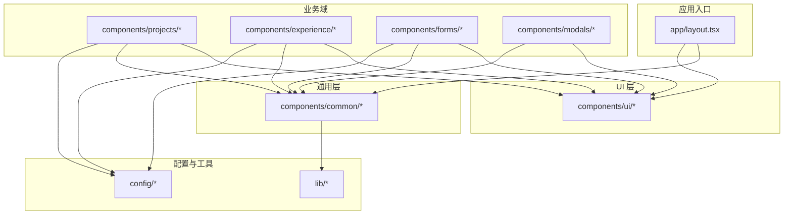
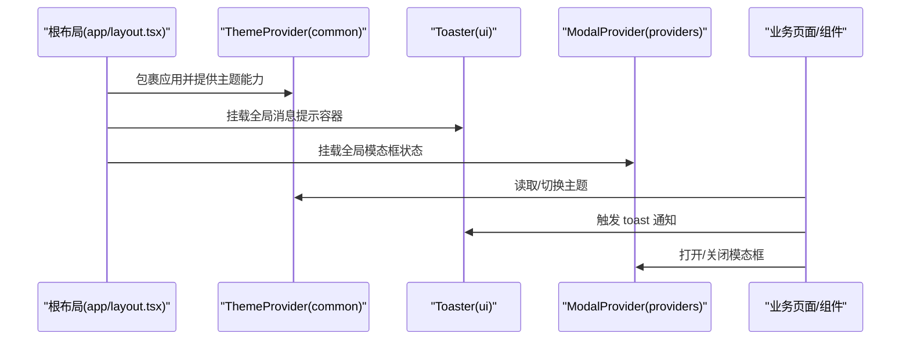
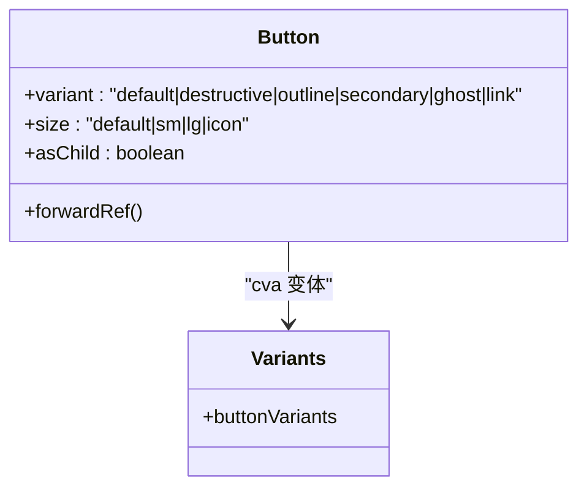
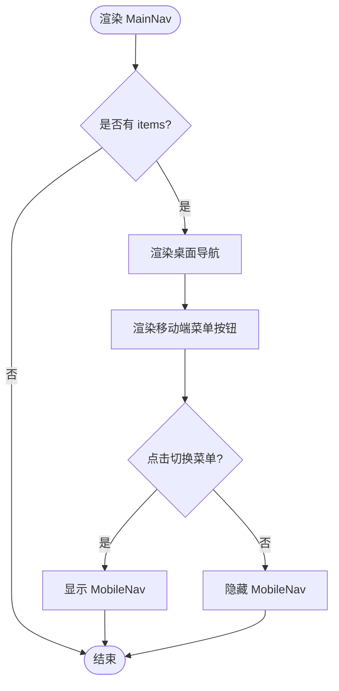
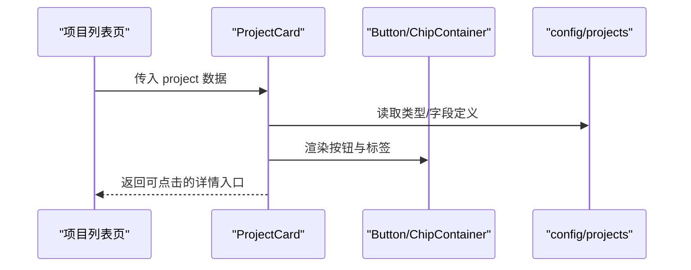
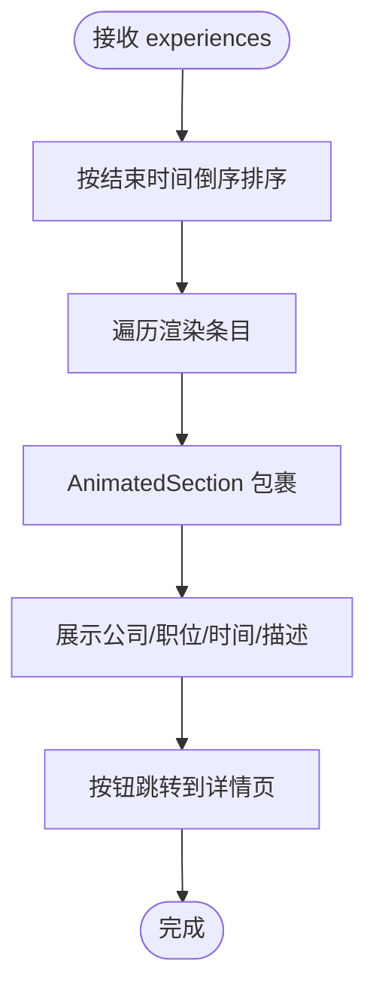
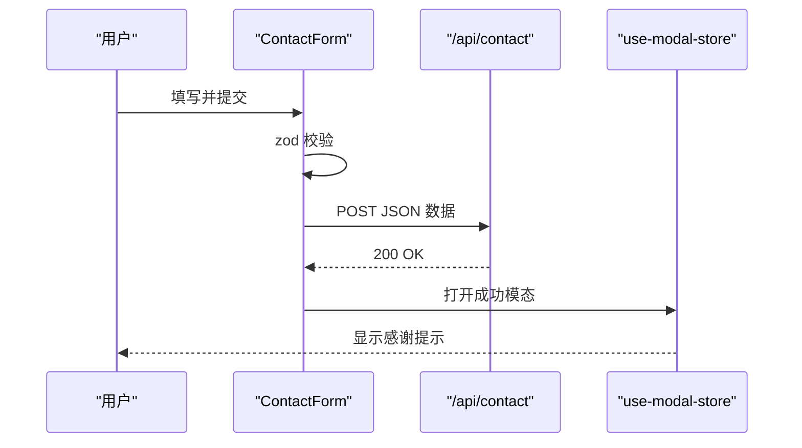
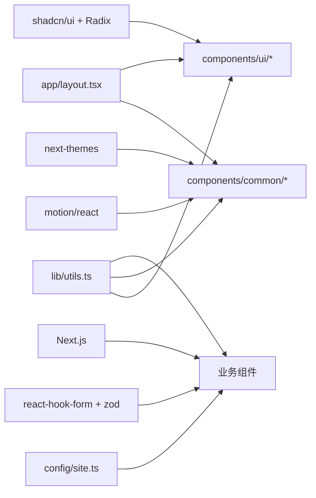

# 组件目录结构

<cite>
**本文引用的文件**
- [components.json](file://components.json)
- [package.json](file://package.json)
- [app/layout.tsx](file://app/layout.tsx)
- [lib/utils.ts](file://lib/utils.ts)
- [config/site.ts](file://config/site.ts)
- [components/common/main-nav.tsx](file://components/common/main-nav.tsx)
- [components/ui/button.tsx](file://components/ui/button.tsx)
- [components/projects/project-card.tsx](file://components/projects/project-card.tsx)
- [components/experience/timeline.tsx](file://components/experience/timeline.tsx)
- [components/forms/contact-form.tsx](file://components/forms/contact-form.tsx)
- [components/common/theme-provider.tsx](file://components/common/theme-provider.tsx)
</cite>

## 目录
1. [简介](#简介)
2. [项目结构](#项目结构)
3. [核心组件分类与职责](#核心组件分类与职责)
4. [架构总览](#架构总览)
5. [详细组件分析](#详细组件分析)
6. [依赖关系分析](#依赖关系分析)
7. [性能考虑](#性能考虑)
8. [故障排查指南](#故障排查指南)
9. [结论](#结论)
10. [附录](#附录)

## 简介
本文件聚焦于 components 目录的组件组织方式，解释 common、ui、feature（按业务域划分的子目录）的职责边界与协作模式；说明命名约定、文件组织结构、组件间依赖管理方式；详细描述 shadcn/ui 集成方式与自定义组件开发规范；并给出组件复用策略、性能优化技巧与可访问性最佳实践。

## 项目结构
- components/ui：基础 UI 组件，基于 shadcn/ui + Radix UI，提供原子化、可组合的 UI 原语（如 Button、Input、Dialog、Tabs、Toast 等）。
- components/common：通用组件，跨页面复用的业务无关或弱业务相关能力（导航、主题、动画、页眉页脚、图标等）。
- 业务域目录（projects、experience、blogs、contact、contributions、skills、forms、modals 等）：按功能/页面领域组织的“功能组件”，聚合多个 ui/common 组件以表达具体业务视图。
- config：站点配置与数据常量（site、routes、pages、projects、experience、skills、socials 等），被各层组件消费。
- lib：工具函数（如样式合并 cn、日期格式化等），供全仓使用。
- providers：应用级上下文提供者（如主题、模态框状态）。
- app：Next.js App Router 路由与根布局，负责注入全局 Provider、Toaster、Analytics 等。

图表来源
- [app/layout.tsx:105-133](file://app/layout.tsx#L105-L133)
- [components/common/main-nav.tsx:1-105](file://components/common/main-nav.tsx#L1-L105)
- [components/ui/button.tsx:1-57](file://components/ui/button.tsx#L1-L57)
- [components/projects/project-card.tsx:1-51](file://components/projects/project-card.tsx#L1-L51)
- [components/experience/timeline.tsx:1-117](file://components/experience/timeline.tsx#L1-L117)
- [components/forms/contact-form.tsx:1-142](file://components/forms/contact-form.tsx#L1-L142)
- [config/site.ts:1-41](file://config/site.ts#L1-L41)
- [lib/utils.ts:1-25](file://lib/utils.ts#L1-L25)

章节来源
- [app/layout.tsx:105-133](file://app/layout.tsx#L105-L133)
- [components.json:1-17](file://components.json#L1-L17)

## 核心组件分类与职责
- ui（基础 UI 组件）
  - 职责：提供无业务语义的原子组件，封装交互细节与样式变体，遵循 shadcn/ui 风格与 Radix 无障碍基元。
  - 典型成员：Button、Input、Textarea、Form、Dialog、DropdownMenu、Tabs、Tooltip、Toast、Modal、Chip 系列等。
  - 设计要点：通过 class-variance-authority 管理 variant/size 等变体；统一使用 cn 合并类名；暴露 asChild 支持透传宿主元素；保持纯展示与最小副作用。
- common（通用组件）
  - 职责：跨页面复用的通用能力，如导航、主题切换、动画容器、页眉页脚、图标集、客户端包装器等。
  - 典型成员：MainNav、MobileNav、SiteFooter、PageHeader、PageContainer、AnimatedSection、ThemeToggle、ThemeProvider、Icons、ClientPageWrapper 等。
  - 设计要点：尽量无业务耦合；对客户端能力进行隔离（如 "use client" 仅用于必要处）；对外暴露稳定 props 接口。
- 业务域（功能组件）
  - 职责：围绕具体页面/模块的组合型组件，将 ui 与 common 组合为完整视图，消费 config 中的数据模型。
  - 典型成员：ProjectCard、Timeline、ContactForm、BlogCard、ContributionCard、SkillsCard、CustomModal 等。
  - 设计要点：单一职责、可组合；数据与展示分离；表单校验与提交逻辑集中在该层；避免直接操作 DOM。

章节来源
- [components/ui/button.tsx:1-57](file://components/ui/button.tsx#L1-L57)
- [components/common/main-nav.tsx:1-105](file://components/common/main-nav.tsx#L1-L105)
- [components/projects/project-card.tsx:1-51](file://components/projects/project-card.tsx#L1-L51)
- [components/experience/timeline.tsx:1-117](file://components/experience/timeline.tsx#L1-L117)
- [components/forms/contact-form.tsx:1-142](file://components/forms/contact-form.tsx#L1-L142)

## 架构总览
- 根布局在 app/layout.tsx 中注入 ThemeProvider、Toaster、ModalProvider、Analytics，确保全局可用。
- 业务组件通过 import 路径引用 ui 与 common，并通过 config 获取静态数据与站点信息。
- 样式系统基于 Tailwind CSS，通过 lib/utils.ts 的 cn 工具统一合并类名，保证样式一致性与可维护性。
- shadcn/ui 通过 components.json 配置别名与样式变量，Radix UI 作为底层无障碍组件库。

图表来源
- [app/layout.tsx:105-133](file://app/layout.tsx#L105-L133)
- [components/common/theme-provider.tsx:1-8](file://components/common/theme-provider.tsx#L1-L8)

章节来源
- [app/layout.tsx:105-133](file://app/layout.tsx#L105-L133)
- [components.json:1-17](file://components.json#L1-L17)

## 详细组件分析

### 基础 UI 组件：Button（shadcn/ui）
- 使用 class-variance-authority 定义 variant/size 变体，默认值集中管理。
- 通过 Slot 支持 asChild 透传，便于与 Link、a 等元素无缝组合。
- 使用 cn 合并 className，保证外部样式覆盖可控。
- 可访问性：原生 button 语义、focus-visible 环、禁用态处理。

图表来源
- [components/ui/button.tsx:1-57](file://components/ui/button.tsx#L1-L57)

章节来源
- [components/ui/button.tsx:1-57](file://components/ui/button.tsx#L1-L57)

### 通用组件：主导航 MainNav
- 响应式导航：桌面端显示链接列表，移动端折叠为菜单按钮与抽屉。
- 动画：使用 motion/react 实现入场与交互反馈。
- 状态：根据当前路由高亮当前项；pathname 变化时自动收起移动端菜单。
- 依赖：Icons、MobileNav、siteConfig、next/navigation。

图表来源
- [components/common/main-nav.tsx:1-105](file://components/common/main-nav.tsx#L1-L105)

章节来源
- [components/common/main-nav.tsx:1-105](file://components/common/main-nav.tsx#L1-L105)

### 功能组件：项目卡片 ProjectCard
- 展示项目封面、标题、摘要、标签、详情跳转按钮。
- 组合 ui 组件：Button、ChipContainer；消费 config 中的项目数据结构。
- 图片使用 Next/Image 优化加载；按钮使用 asChild 与 Link 组合。

图表来源
- [components/projects/project-card.tsx:1-51](file://components/projects/project-card.tsx#L1-L51)

章节来源
- [components/projects/project-card.tsx:1-51](file://components/projects/project-card.tsx#L1-L51)

### 功能组件：时间线 Timeline
- 将经验数据按时间倒序排序后渲染。
- 每个条目使用 AnimatedSection 实现滚动入场动画。
- 组合 ui 组件：Button（asChild 与 Link 组合）。
- 辅助函数：从日期提取年份、计算持续时间文本。

图表来源
- [components/experience/timeline.tsx:1-117](file://components/experience/timeline.tsx#L1-L117)

章节来源
- [components/experience/timeline.tsx:1-117](file://components/experience/timeline.tsx#L1-L117)

### 功能组件：联系表单 ContactForm
- 使用 react-hook-form + zod 进行表单建模与校验。
- 组合 ui 组件：Form、FormField、FormItem、FormLabel、FormControl、FormMessage、Input、Textarea、Button。
- 提交逻辑：POST /api/contact，成功后通过 storeModal 打开成功提示。
- 可访问性：label 与 field 关联、错误消息可读、键盘可操作。

图表来源
- [components/forms/contact-form.tsx:1-142](file://components/forms/contact-form.tsx#L1-L142)

章节来源
- [components/forms/contact-form.tsx:1-142](file://components/forms/contact-form.tsx#L1-L142)

## 依赖关系分析
- 组件到工具：ui/common/业务组件普遍依赖 lib/utils.ts 的 cn 进行样式合并。
- 组件到配置：业务组件通过 config/* 获取站点信息与数据模型。
- 组件到第三方：
  - shadcn/ui + Radix UI：提供基础 UI 与无障碍能力。
  - motion/react：动画效果。
  - next-themes：主题切换。
  - react-hook-form + zod：表单与校验。
  - next/image/link/navigation：Next.js 生态。
- 根布局注入全局能力：ThemeProvider、Toaster、ModalProvider、Analytics。

图表来源
- [lib/utils.ts:1-25](file://lib/utils.ts#L1-L25)
- [config/site.ts:1-41](file://config/site.ts#L1-L41)
- [components.json:1-17](file://components.json#L1-L17)
- [package.json:11-43](file://package.json#L11-L43)
- [app/layout.tsx:105-133](file://app/layout.tsx#L105-L133)

章节来源
- [package.json:11-43](file://package.json#L11-L43)
- [components.json:1-17](file://components.json#L1-L17)
- [app/layout.tsx:105-133](file://app/layout.tsx#L105-L133)

## 性能考虑
- 组件粒度与惰性加载
  - 将重型或仅在客户端使用的逻辑放入 "use client" 组件，减少服务端渲染开销。
  - 对非首屏内容使用懒加载或按需引入（例如动画、第三方脚本）。
- 样式与渲染
  - 使用 cn 合并类名，避免重复样式与冲突。
  - 合理使用 Tailwind 原子类，减少自定义 CSS。
- 网络与资源
  - 图片使用 Next/Image 的 fill/尺寸控制与占位策略。
  - 第三方脚本使用 afterInteractive 策略延迟加载。
- 交互与动画
  - 使用 motion/react 的轻量动画，避免过度重排。
  - 列表渲染时使用稳定的 key，减少不必要的重渲染。
- 表单与校验
  - 使用 zod 进行前端快速校验，减少无效请求。
  - 提交前防抖/节流，避免重复提交。

[本节为通用指导，不直接分析具体文件]

## 故障排查指南
- 主题未生效
  - 检查根布局是否正确包裹 ThemeProvider，并确保 attribute="class" 已设置。
  - 确认 Tailwind 变量与 baseColor 配置正确。
- 表单提交失败
  - 检查 zod schema 是否与后端字段一致。
  - 查看 /api/contact 返回状态码与错误日志。
- 导航高亮异常
  - 检查 useSelectedLayoutSegment/usePathname 的使用场景与路由层级。
- 动画闪烁或卡顿
  - 检查是否对大量元素同时触发动画；必要时拆分动画或使用 will-change。
- 模态框无法打开
  - 确认 ModalProvider 已在根布局挂载；检查 store 状态更新是否被拦截。

章节来源
- [app/layout.tsx:105-133](file://app/layout.tsx#L105-L133)
- [components/forms/contact-form.tsx:1-142](file://components/forms/contact-form.tsx#L1-L142)
- [components/common/main-nav.tsx:1-105](file://components/common/main-nav.tsx#L1-L105)

## 结论
本项目采用清晰的三层组件架构：ui 原子组件、common 通用组件、业务域功能组件。通过 shadcn/ui 与 Radix 构建一致的 UI 基座，结合 Next.js 生态与 Tailwind 样式体系，实现了高内聚、低耦合的可维护代码组织。配合统一的配置与工具函数，保证了跨组件的一致性与扩展性。遵循本文的命名约定、依赖管理与最佳实践，可进一步提升项目的可测试性、性能与可访问性。

## 附录

### 组件命名约定
- 文件名：小写下划线或驼峰（如 main-nav.tsx、project-card.tsx），组件导出名使用 PascalCase。
- 目录划分：ui 存放原子组件；common 存放通用能力；业务域按功能模块划分。
- Props 命名：语义化、明确用途（如 variant、size、items、project）。
- 事件回调：onXxx 形式（如 onOpen、onClose）。

### 文件组织结构
- 每个组件独立文件，导出默认或具名组件。
- 复杂组件可拆分子文件（如 hooks、utils、types）。
- 配置集中管理，避免硬编码。

### 组件间依赖管理
- 严格单向依赖：业务组件 -> common/ui -> lib/config。
- 避免循环依赖：通过抽象公共逻辑到 lib 或 common。
- 使用路径别名 @/ 简化导入。

### shadcn/ui 集成与自定义规范
- 通过 components.json 配置别名与样式变量，启用 tsx/rsc。
- 所有 ui 组件使用 cva 管理变体，统一使用 cn 合并类名。
- 优先使用 Radix 提供的无障碍基元，保持键盘与屏幕阅读器友好。
- 自定义组件需暴露稳定接口，支持 asChild 与 ref 转发。

### 组件复用策略
- 原子优先：将可复用片段下沉到 ui 或 common。
- 组合优于继承：通过 props 与插槽组合出复杂视图。
- 配置驱动：将文案、路由、样式变体抽离至 config。

### 性能优化技巧
- 客户端/服务端边界清晰："use client" 仅用于必要处。
- 图片与媒体资源优化：Next/Image、懒加载、CDN。
- 动画与交互：按需触发、避免阻塞主线程。
- 表单与网络：前端校验、去抖/节流、错误重试。

### 可访问性最佳实践
- 语义化 HTML：button、a、form、label 等正确使用。
- 键盘可达：焦点顺序合理，支持 Tab/Enter/Escape。
- 屏幕阅读器：alt、aria-* 属性完善，错误消息可朗读。
- 对比度与主题：确保明暗主题下均满足对比度要求。