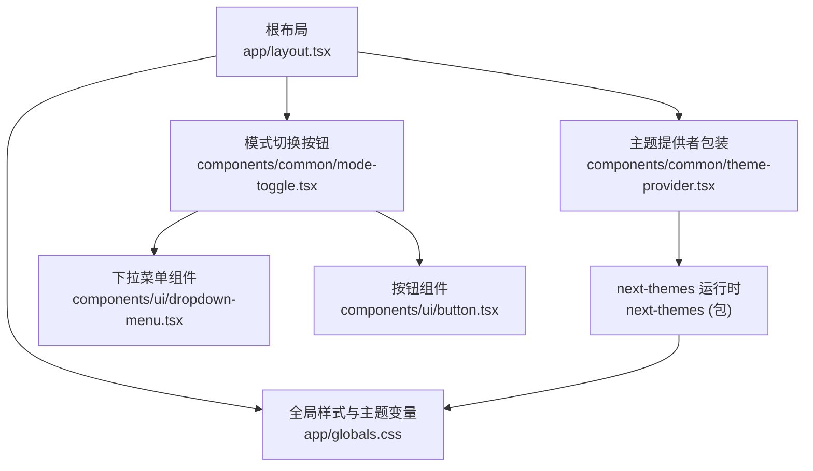
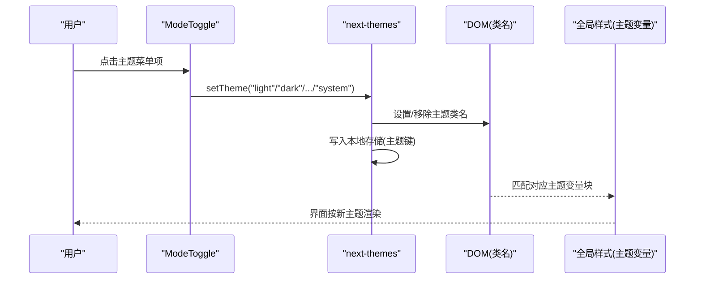
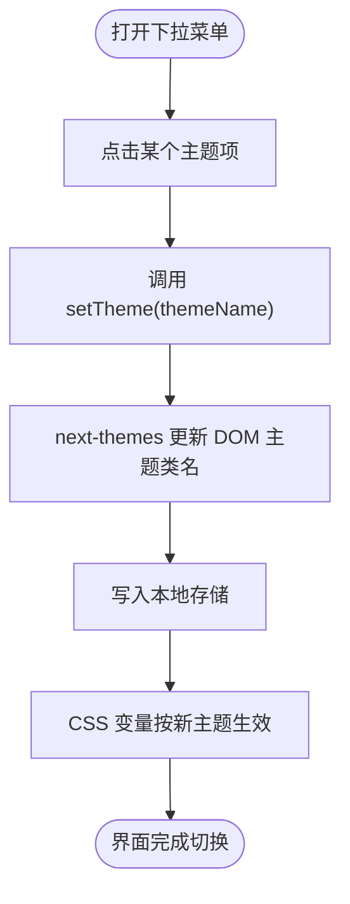
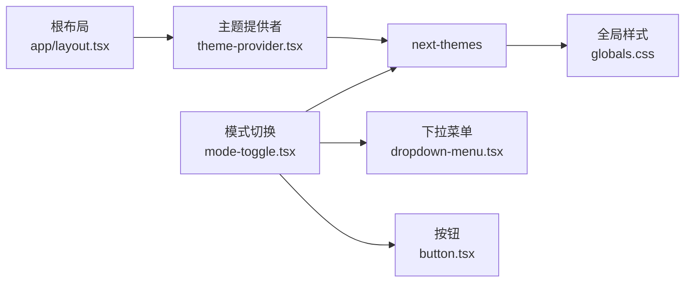

# 主题管理系统

<cite>
**本文引用的文件**
- [app/layout.tsx](file://app/layout.tsx)
- [components/common/theme-provider.tsx](file://components/common/theme-provider.tsx)
- [components/common/mode-toggle.tsx](file://components/common/mode-toggle.tsx)
- [components/common/icons.tsx](file://components/common/icons.tsx)
- [components/ui/dropdown-menu.tsx](file://components/ui/dropdown-menu.tsx)
- [components/ui/button.tsx](file://components/ui/button.tsx)
- [app/globals.css](file://app/globals.css)
- [package.json](file://package.json)
</cite>

## 目录
1. [简介](#简介)
2. [项目结构](#项目结构)
3. [核心组件](#核心组件)
4. [架构总览](#架构总览)
5. [详细组件分析](#详细组件分析)
6. [依赖关系分析](#依赖关系分析)
7. [性能考量](#性能考量)
8. [故障排查指南](#故障排查指南)
9. [结论](#结论)
10. [附录](#附录)

## 简介
本文件系统性地梳理了基于 next-themes 的主题管理机制，覆盖 ThemeProvider 的集成方式、主题切换流程、本地存储持久化与系统主题检测；详解 ModeToggle 的用户交互实现（状态管理、动画效果、可访问性）；并提供主题配置选项、自定义主题开发指南与最佳实践示例。目标是帮助开发者快速理解并扩展该项目的主题能力。

## 项目结构
主题相关代码主要分布在以下位置：
- 根布局中注入主题提供者与主题列表
- 通用组件封装 next-themes 的 ThemeProvider
- 模式切换按钮组件提供 UI 与交互
- 全局样式定义多套主题变量
- UI 基础组件（下拉菜单、按钮）支撑交互体验

图表来源
- [app/layout.tsx:105-133](file://app/layout.tsx#L105-L133)
- [components/common/theme-provider.tsx:1-7](file://components/common/theme-provider.tsx#L1-L7)
- [components/common/mode-toggle.tsx:1-70](file://components/common/mode-toggle.tsx#L1-L70)
- [components/ui/dropdown-menu.tsx:1-201](file://components/ui/dropdown-menu.tsx#L1-L201)
- [components/ui/button.tsx:1-57](file://components/ui/button.tsx#L1-L57)
- [app/globals.css:28-333](file://app/globals.css#L28-L333)

章节来源
- [app/layout.tsx:105-133](file://app/layout.tsx#L105-L133)
- [components/common/theme-provider.tsx:1-7](file://components/common/theme-provider.tsx#L1-L7)
- [components/common/mode-toggle.tsx:1-70](file://components/common/mode-toggle.tsx#L1-L70)
- [app/globals.css:28-333](file://app/globals.css#L28-L333)

## 核心组件
- ThemeProvider（应用级主题上下文）
  - 在根布局中以 attribute="class" 的方式包裹应用，启用 next-themes 的能力，包括主题切换、本地存储持久化、系统主题检测等。
  - 通过 themes 数组声明可用主题集合，供 UI 暴露选择项。
- ModeToggle（用户交互入口）
  - 使用 useTheme 提供的 setTheme 与 theme 进行状态读取与更新。
  - 通过下拉菜单提供“浅色/深色/复古/赛博朋克/纸张/极光/合成波/跟随系统”等多主题切换。
  - 图标根据当前主题动态显示，配合 CSS 过渡实现平滑切换。
- 全局样式（主题变量）
  - 在 :root 与 .dark/.retro/.cyberpunk/.paper/.aurora/.synthwave 等类下定义完整的 HSL 色彩变量，供 Tailwind 与设计令牌引用。

章节来源
- [app/layout.tsx:105-133](file://app/layout.tsx#L105-L133)
- [components/common/mode-toggle.tsx:1-70](file://components/common/mode-toggle.tsx#L1-L70)
- [app/globals.css:87-333](file://app/globals.css#L87-L333)

## 架构总览
主题系统的运行流程如下：
- 根布局渲染时，ThemeProvider 以 class 属性模式挂载到 <html> 或 <body>，并初始化默认主题与系统主题监听。
- 首次加载时，next-themes 会尝试从本地存储恢复上次主题；若不存在则回退到 defaultTheme 或系统主题。
- 用户通过 ModeToggle 触发 setTheme，next-themes 更新 DOM 上的主题类名，同时写入本地存储。
- 全局样式中的主题变量随类名变化而生效，UI 组件通过 Tailwind 设计令牌自动适配新主题。

图表来源
- [components/common/mode-toggle.tsx:15-67](file://components/common/mode-toggle.tsx#L15-L67)
- [app/layout.tsx:115-128](file://app/layout.tsx#L115-L128)
- [app/globals.css:87-333](file://app/globals.css#L87-L333)

## 详细组件分析

### ThemeProvider 与 next-themes 集成
- 集成方式
  - 在根布局中引入自定义 ThemeProvider，传入 attribute="class"、defaultTheme="system"、enableSystem 以及 themes 列表。
  - 这样 next-themes 会在 DOM 上切换主题类名，并通过 enableSystem 自动跟随系统主题。
- 本地存储持久化
  - next-themes 默认将主题值持久化到本地存储（键名由库内部维护），刷新页面后自动恢复。
- 系统主题检测
  - 开启 enableSystem 后，当 defaultTheme 为 system 且无本地存储时，将读取系统偏好；后续也可通过 setTheme("system") 切换回跟随系统。

章节来源
- [app/layout.tsx:115-128](file://app/layout.tsx#L115-L128)
- [components/common/theme-provider.tsx:1-7](file://components/common/theme-provider.tsx#L1-L7)

### ModeToggle 用户交互实现
- 状态管理
  - 使用 useTheme() 获取 setTheme 与 theme，点击菜单项调用 setTheme 切换主题。
- 动画效果
  - 按钮内多个图标通过绝对定位与 scale/rotate 过渡，结合主题类名（如 dark、retro 等）控制显隐与缩放，形成平滑切换动效。
- 可访问性支持
  - 按钮包含 sr-only 文本说明，确保屏幕阅读器可读。
  - 下拉菜单基于 Radix UI，具备键盘导航与焦点管理。
- 主题选项
  - 提供 light、dark、retro、cyberpunk、paper、aurora、synthwave、system 等选项，全部通过 setTheme 切换。

图表来源
- [components/common/mode-toggle.tsx:15-67](file://components/common/mode-toggle.tsx#L15-L67)
- [components/ui/dropdown-menu.tsx:59-75](file://components/ui/dropdown-menu.tsx#L59-L75)
- [components/ui/button.tsx:7-34](file://components/ui/button.tsx#L7-L34)

章节来源
- [components/common/mode-toggle.tsx:1-70](file://components/common/mode-toggle.tsx#L1-L70)
- [components/ui/dropdown-menu.tsx:1-201](file://components/ui/dropdown-menu.tsx#L1-L201)
- [components/ui/button.tsx:1-57](file://components/ui/button.tsx#L1-L57)

### 主题配置与样式体系
- 主题变量
  - 在 :root 中定义默认浅色主题变量；在 .dark、.retro、.cyberpunk、.paper、.aurora、.synthwave 等类下分别覆盖变量，形成多套主题。
- 设计令牌
  - 通过 @theme inline 将 CSS 变量映射到 Tailwind 的设计令牌（如 --color-background、--color-primary 等），使组件无需关心具体颜色值。
- 自定义主题
  - 新增主题只需在 globals.css 中添加一个类名块并定义完整变量集，同时在 layout 的 themes 数组中注册即可。

章节来源
- [app/globals.css:28-333](file://app/globals.css#L28-L333)
- [app/layout.tsx:115-128](file://app/layout.tsx#L115-L128)

## 依赖关系分析
- 运行时依赖
  - next-themes：提供主题上下文、持久化、系统主题检测与 API（useTheme、setTheme）。
  - Radix UI Dropdown Menu：提供无障碍的下拉菜单交互。
  - Tailwind CSS：通过设计令牌消费 CSS 变量。
- 组件耦合
  - ModeToggle 依赖 icons 图标集与 UI 基础组件，但不直接依赖主题实现细节，仅通过 useTheme 与 next-themes 通信。
  - 根布局负责装配 ThemeProvider 与主题白名单，是主题能力的入口。

图表来源
- [app/layout.tsx:105-133](file://app/layout.tsx#L105-L133)
- [components/common/theme-provider.tsx:1-7](file://components/common/theme-provider.tsx#L1-L7)
- [components/common/mode-toggle.tsx:1-70](file://components/common/mode-toggle.tsx#L1-L70)
- [components/ui/dropdown-menu.tsx:1-201](file://components/ui/dropdown-menu.tsx#L1-L201)
- [components/ui/button.tsx:1-57](file://components/ui/button.tsx#L1-L57)
- [app/globals.css:28-333](file://app/globals.css#L28-L333)

章节来源
- [package.json:11-44](file://package.json#L11-L44)
- [app/layout.tsx:105-133](file://app/layout.tsx#L105-L133)

## 性能考量
- 首屏闪烁
  - 使用 attribute="class" 并在根布局设置 suppressHydrationWarning，可减少 SSR/CSR 切换时的闪烁风险。
- 主题切换开销
  - 切换本质是类名变更与 CSS 变量重算，开销极低；避免在切换过程中执行昂贵计算。
- 本地存储读写
  - next-themes 仅在必要时读写本地存储；如需频繁操作，建议合并批量更新。
- 动画与过渡
  - 合理使用 transition-all 与 transform，避免对大量元素同时触发重排；当前实现仅对少量图标做变换，性能良好。

[本节为通用指导，不直接分析具体文件]

## 故障排查指南
- 主题未生效
  - 检查根布局是否正确包裹 ThemeProvider 并传入 themes 列表。
  - 确认全局样式中已定义对应主题类的变量块。
- 切换后刷新丢失
  - 确认浏览器允许本地存储；检查 next-themes 是否被正确引入。
- 系统主题不同步
  - 确认启用了 enableSystem 并将 defaultTheme 设为 system；或在菜单中提供“跟随系统”选项。
- 图标显示异常
  - 检查 mode-toggle 中各图标的主题类名条件是否与 CSS 变量一致；确保图标组件已正确导出。

章节来源
- [app/layout.tsx:115-128](file://app/layout.tsx#L115-L128)
- [components/common/mode-toggle.tsx:21-29](file://components/common/mode-toggle.tsx#L21-L29)
- [app/globals.css:87-333](file://app/globals.css#L87-L333)

## 结论
本项目通过 next-themes 实现了轻量、可扩展的主题系统：以 ThemeProvider 作为能力入口，ModeToggle 提供直观的多主题切换，全局样式以 CSS 变量组织主题资产。借助 Tailwind 的设计令牌，主题切换对业务组件透明。遵循本文的配置与最佳实践，可轻松扩展更多主题并保持一致的交互与可访问性。

[本节为总结，不直接分析具体文件]

## 附录

### 主题配置选项速查
- 根布局中的关键配置
  - attribute: "class"（在 DOM 上切换类名）
  - defaultTheme: "system"（默认跟随系统）
  - enableSystem: true（启用系统主题检测）
  - themes: ["light","dark","retro","cyberpunk","paper","aurora","synthwave"]（可用主题集合）

章节来源
- [app/layout.tsx:115-128](file://app/layout.tsx#L115-L128)

### 自定义主题开发指南
- 步骤
  1. 在全局样式中添加新的主题类名块，定义完整的 CSS 变量集（背景、前景、主色、强调色等）。
  2. 在根布局的 themes 数组中注册新主题名。
  3. 在 ModeToggle 的菜单中添加对应选项，调用 setTheme("your-theme")。
  4. 如需图标指示，可在按钮中增加对应主题类的显隐逻辑。
- 注意事项
  - 保持变量命名一致，确保所有设计令牌均有值。
  - 为新主题编写对比度合理的配色，保证可访问性。
  - 测试在不同设备与系统主题下的表现。

章节来源
- [app/globals.css:87-333](file://app/globals.css#L87-L333)
- [app/layout.tsx:115-128](file://app/layout.tsx#L115-L128)
- [components/common/mode-toggle.tsx:32-67](file://components/common/mode-toggle.tsx#L32-L67)

### 最佳实践示例
- 统一使用设计令牌而非硬编码颜色
  - 通过 Tailwind 令牌（如 bg-background、text-primary）消费 CSS 变量，便于主题切换。
- 保持可访问性
  - 为交互控件添加合适的 aria 与键盘支持；为图标按钮提供 sr-only 文本。
- 渐进增强
  - 在 SSR 环境下尽量减少闪烁；在客户端再应用主题切换逻辑。
- 集中管理主题
  - 将主题变量集中在样式文件中，通过类名隔离；避免分散的样式片段。

[本节为通用指导，不直接分析具体文件]