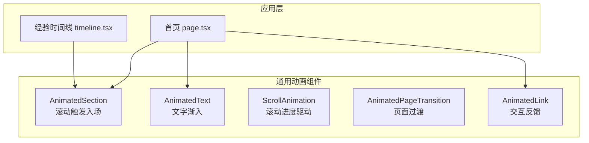
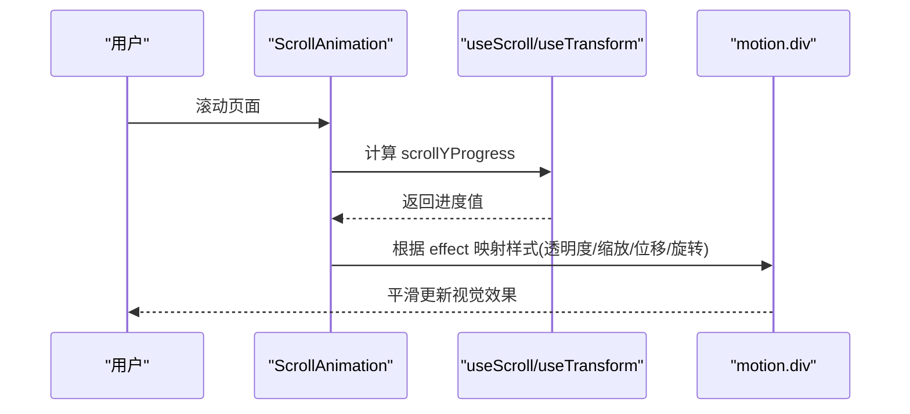
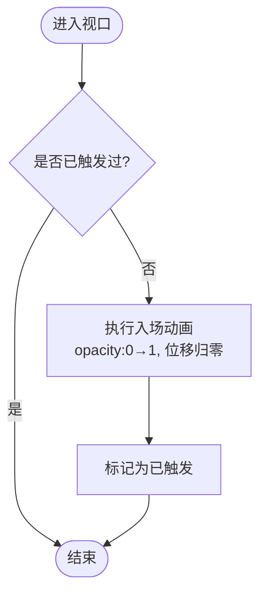
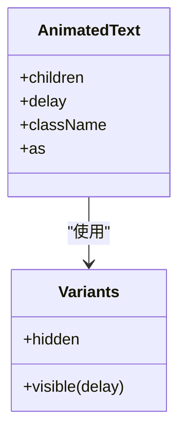
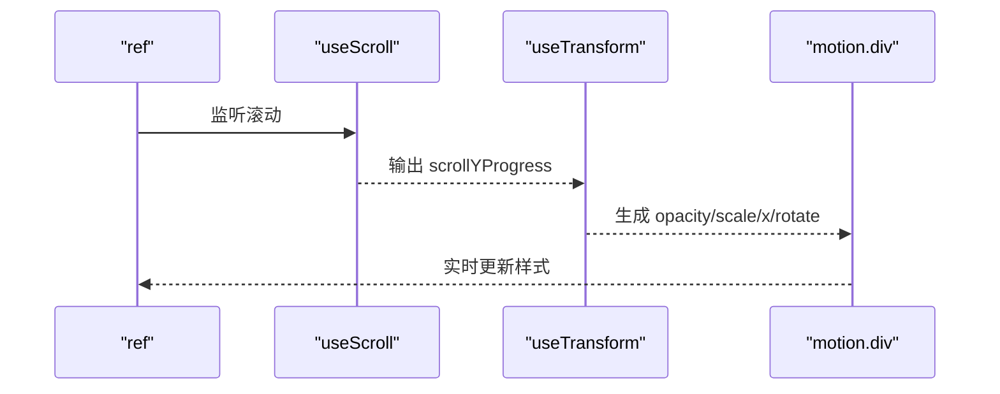
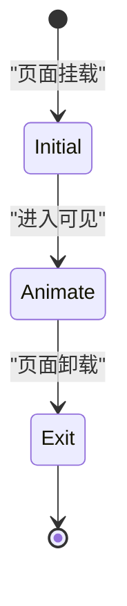
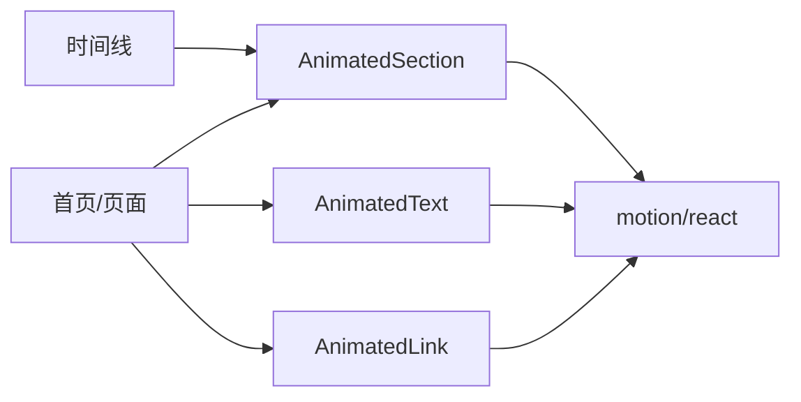

# 动画组件

<cite>
**本文引用的文件**
- [components/common/animated-section.tsx](file://components/common/animated-section.tsx)
- [components/common/animated-text.tsx](file://components/common/animated-text.tsx)
- [components/common/scroll-animation.tsx](file://components/common/scroll-animation.tsx)
- [components/common/animated-page-transition.tsx](file://components/common/animated-page-transition.tsx)
- [providers/animation-provider.tsx](file://providers/animation-provider.tsx)
- [components/common/animated-link.tsx](file://components/common/animated-link.tsx)
- [app/(root)/page.tsx](file://app/(root)/page.tsx)
- [components/experience/timeline.tsx](file://components/experience/timeline.tsx)
</cite>

## 目录
1. [简介](#简介)
2. [项目结构](#项目结构)
3. [核心组件](#核心组件)
4. [架构总览](#架构总览)
5. [详细组件分析](#详细组件分析)
6. [依赖关系分析](#依赖关系分析)
7. [性能考量](#性能考量)
8. [故障排查指南](#故障排查指南)
9. [结论](#结论)
10. [附录：定制与扩展指南](#附录定制与扩展指南)

## 简介
本文件系统化梳理基于 Framer Motion（motion/react）的动画系统，覆盖以下能力：
- 滚动触发的区块入场动画（AnimatedSection）
- 文字渐入动画（AnimatedText）
- 滚动进度驱动的样式变换（ScrollAnimation）
- 页面过渡动画（AnimatedPageTransition）
- 交互反馈增强（AnimatedLink）

文档将解释各组件的实现原理、配置选项、性能优化策略、浏览器兼容性处理以及用户交互反馈，并提供可操作的定制示例与自定义开发指南。

## 项目结构
动画相关代码集中在 components/common 与 providers 目录，配合页面级使用示例（如首页与经验时间线）。整体组织方式以“功能组件 + 提供者”为主，便于在 Next.js App Router 中按需组合。

图表来源
- [components/common/animated-section.tsx:1-51](file://components/common/animated-section.tsx#L1-L51)
- [components/common/animated-text.tsx:1-49](file://components/common/animated-text.tsx#L1-L49)
- [components/common/scroll-animation.tsx:1-51](file://components/common/scroll-animation.tsx#L1-L51)
- [components/common/animated-page-transition.tsx:1-48](file://components/common/animated-page-transition.tsx#L1-L48)
- [components/common/animated-link.tsx:1-42](file://components/common/animated-link.tsx#L1-L42)
- [app/(root)/page.tsx:1-357](file://app/(root)/page.tsx#L1-L357)
- [components/experience/timeline.tsx:1-117](file://components/experience/timeline.tsx#L1-L117)

章节来源
- [app/(root)/page.tsx:1-357](file://app/(root)/page.tsx#L1-L357)
- [components/experience/timeline.tsx:1-117](file://components/experience/timeline.tsx#L1-L117)

## 核心组件
- AnimatedSection：基于视口检测的滚动触发动画，支持方向与延迟控制，适合区块级内容入场。
- AnimatedText：基于变体的文字渐入动画，支持多种 HTML 标签与延迟。
- ScrollAnimation：基于滚动进度的实时样式映射，提供淡入、缩放、滑动、旋转等效果。
- AnimatedPageTransition：页面进入/离开的过渡动画，用于路由切换时的视觉衔接。
- AnimatedLink：链接的悬停与点击反馈，提升交互体验。
- AnimationProvider：当前为占位提供者，预留全局动画配置扩展点。

章节来源
- [components/common/animated-section.tsx:1-51](file://components/common/animated-section.tsx#L1-L51)
- [components/common/animated-text.tsx:1-49](file://components/common/animated-text.tsx#L1-L49)
- [components/common/scroll-animation.tsx:1-51](file://components/common/scroll-animation.tsx#L1-L51)
- [components/common/animated-page-transition.tsx:1-48](file://components/common/animated-page-transition.tsx#L1-L48)
- [components/common/animated-link.tsx:1-42](file://components/common/animated-link.tsx#L1-L42)
- [providers/animation-provider.tsx:1-12](file://providers/animation-provider.tsx#L1-L12)

## 架构总览
动画系统围绕 motion/react 提供的声明式 API 构建：
- 滚动监听：useScroll + useTransform 实现滚动进度到样式的映射。
- 视口检测：whileInView + viewport 控制元素进入可视区域时触发动画。
- 变体系统：variants + initial/animate/exit 管理状态机式动画。
- 页面过渡：结合路由框架（Next.js）的挂载/卸载生命周期进行进出场动画。

图表来源
- [components/common/scroll-animation.tsx:1-51](file://components/common/scroll-animation.tsx#L1-L51)

章节来源
- [components/common/scroll-animation.tsx:1-51](file://components/common/scroll-animation.tsx#L1-L51)

## 详细组件分析

### AnimatedSection（滚动触发的区块入场）
- 作用：当区块进入视口时执行淡入与位移归零的动画，支持 up/down/left/right 四种方向与延迟。
- 关键机制：
  - whileInView 触发条件：元素进入视口时执行动画。
  - viewport.once=true：仅触发一次，避免重复播放。
  - viewport.margin="-100px"：提前触发，提升感知流畅度。
  - transition.duration/ease/delay：统一缓动与时长，保证一致节奏。
- 适用场景：首屏分区、卡片列表、时间线条目等。

图表来源
- [components/common/animated-section.tsx:1-51](file://components/common/animated-section.tsx#L1-L51)

章节来源
- [components/common/animated-section.tsx:1-51](file://components/common/animated-section.tsx#L1-L51)

### AnimatedText（文字渐入）
- 作用：为文本提供从下方淡入的动画，支持不同 HTML 标签与延迟。
- 关键机制：
  - variants 定义 hidden/visible 两种状态。
  - animate="visible" 与 custom={delay} 控制延迟。
  - 通过 motion[as] 动态渲染对应标签，保持语义化。
- 适用场景：标题、副标题、引导文案等。

图表来源
- [components/common/animated-text.tsx:1-49](file://components/common/animated-text.tsx#L1-L49)

章节来源
- [components/common/animated-text.tsx:1-49](file://components/common/animated-text.tsx#L1-L49)

### ScrollAnimation（滚动进度驱动）
- 作用：根据滚动进度实时改变元素的透明度、缩放、位移或旋转，形成沉浸式滚动动画。
- 关键机制：
  - useScroll(target, offset) 获取目标容器的滚动进度。
  - useTransform 将进度映射为具体属性（opacity/scale/x/rotate）。
  - effect 选择器决定最终应用的样式组合。
- 适用场景：英雄区背景、数据可视化、图文混排等。

图表来源
- [components/common/scroll-animation.tsx:1-51](file://components/common/scroll-animation.tsx#L1-L51)

章节来源
- [components/common/scroll-animation.tsx:1-51](file://components/common/scroll-animation.tsx#L1-L51)

### AnimatedPageTransition（页面过渡）
- 作用：页面进入时淡入并上移归位，离开时淡出并上移，营造平滑过渡。
- 关键机制：
  - variants 定义 initial/animate/exit 三态。
  - 通过路由框架的生命周期（挂载/卸载）驱动动画。
- 适用场景：SPA 路由切换、详情页进入/退出。

图表来源
- [components/common/animated-page-transition.tsx:1-48](file://components/common/animated-page-transition.tsx#L1-L48)

章节来源
- [components/common/animated-page-transition.tsx:1-48](file://components/common/animated-page-transition.tsx#L1-L48)

### AnimatedLink（交互反馈）
- 作用：为链接添加弹性缩放悬停与点击反馈，提升交互质感。
- 关键机制：
  - whileHover/whileTap 驱动微交互。
  - spring 过渡参数提供自然回弹感。
- 适用场景：按钮、导航链接、卡片入口等。

章节来源
- [components/common/animated-link.tsx:1-42](file://components/common/animated-link.tsx#L1-L42)

### 使用示例与集成
- 首页（app/(root)/page.tsx）大量使用 AnimatedSection 与 AnimatedText 构建分区与标题动画，并通过 delay 实现交错入场。
- 经验时间线（components/experience/timeline.tsx）使用 AnimatedSection 包裹每条经历，按索引递增延迟，形成瀑布式入场。

章节来源
- [app/(root)/page.tsx:1-357](file://app/(root)/page.tsx#L1-L357)
- [components/experience/timeline.tsx:1-117](file://components/experience/timeline.tsx#L1-L117)

## 依赖关系分析
- 外部依赖：motion/react（Framer Motion），提供 motion 组件与 hooks（useScroll、useTransform）。
- 内部依赖：
  - 页面与子组件通过 props 传递 children、className、delay、direction、effect 等配置。
  - 动画提供者（AnimationProvider）目前为空壳，便于未来注入全局配置（如默认 duration、easing、prefers-reduced-motion 处理）。

图表来源
- [app/(root)/page.tsx:1-357](file://app/(root)/page.tsx#L1-L357)
- [components/experience/timeline.tsx:1-117](file://components/experience/timeline.tsx#L1-L117)
- [components/common/animated-section.tsx:1-51](file://components/common/animated-section.tsx#L1-L51)
- [components/common/animated-text.tsx:1-49](file://components/common/animated-text.tsx#L1-L49)
- [components/common/animated-link.tsx:1-42](file://components/common/animated-link.tsx#L1-L42)

章节来源
- [app/(root)/page.tsx:1-357](file://app/(root)/page.tsx#L1-L357)
- [components/experience/timeline.tsx:1-117](file://components/experience/timeline.tsx#L1-L117)

## 性能考量
- 视口检测优化：
  - viewport.once=true 避免重复触发，减少不必要的重绘。
  - viewport.margin 提前触发，降低感知延迟。
- 滚动动画优化：
  - useTransform 将滚动进度映射为 GPU 友好的 transform/opacity，减少布局抖动。
  - 合理设置 offset，避免频繁计算。
- 动画时长与缓动：
  - 统一 duration 与 easeOut/easeInOut，确保一致性并降低 CPU 压力。
- 列表交错动画：
  - 通过 index * step 的延迟实现交错，避免同时大量动画导致卡顿。
- 可访问性与降级：
  - 建议结合 prefers-reduced-motion 媒体查询，在低偏好动画环境下禁用或简化动画。
  - 对关键交互保留基础可用性与焦点管理。

[本节为通用指导，不直接分析具体文件]

## 故障排查指南
- 动画未触发：
  - 检查父容器是否有足够高度/滚动空间，确保 useScroll 的目标 ref 正确绑定。
  - 确认 whileInView 的 viewport 配置是否过于严格。
- 动画重复播放：
  - 确认 viewport.once 是否为 true；若需重复，请移除该限制并自行管理状态。
- 滚动动画不生效：
  - 检查 useTransform 的输入范围与输出范围是否匹配预期。
  - 确认 effect 分支是否正确返回样式对象。
- 页面过渡异常：
  - 确认路由框架是否正确触发挂载/卸载生命周期。
  - 检查 variants 的 initial/animate/exit 是否完整定义。
- 性能问题：
  - 减少同时运行的动画数量，拆分复杂动画为多个简单动画。
  - 避免在高频回调中创建新对象，尽量复用常量与配置。

[本节为通用指导，不直接分析具体文件]

## 结论
本项目基于 motion/react 构建了清晰、可扩展的动画体系：
- 通过 AnimatedSection/AnimatedText 提供易用的滚动与文字动画。
- 通过 ScrollAnimation 实现高自由度的滚动进度驱动效果。
- 通过 AnimatedPageTransition 提升页面切换体验。
- 通过 AnimatedLink 增强交互反馈。
建议在 AnimationProvider 中逐步引入全局配置与可访问性降级策略，进一步统一风格与性能表现。

[本节为总结，不直接分析具体文件]

## 附录：定制与扩展指南

### 配置选项速览
- AnimatedSection
  - direction：up | down | left | right
  - delay：数字，单位秒
  - className/id：样式与标识
- AnimatedText
  - as：h1-h6/p/span/div
  - delay：数字
  - className：样式
- ScrollAnimation
  - effect：fade | zoom | slide | rotate
  - className：样式
- AnimatedPageTransition
  - 无额外 props，通过 variants 控制
- AnimatedLink
  - href/target/rel/onClick/className

章节来源
- [components/common/animated-section.tsx:1-51](file://components/common/animated-section.tsx#L1-L51)
- [components/common/animated-text.tsx:1-49](file://components/common/animated-text.tsx#L1-L49)
- [components/common/scroll-animation.tsx:1-51](file://components/common/scroll-animation.tsx#L1-L51)
- [components/common/animated-page-transition.tsx:1-48](file://components/common/animated-page-transition.tsx#L1-L48)
- [components/common/animated-link.tsx:1-42](file://components/common/animated-link.tsx#L1-L42)

### 定制示例思路
- 新增滚动效果：
  - 在 ScrollAnimation 的 effect 分支中添加新的 useTransform 映射，并在 switch 中返回样式对象。
- 自定义页面过渡：
  - 修改 pageVariants 的 initial/animate/exit，调整 duration、ease、位移幅度。
- 批量交错动画：
  - 在列表渲染中使用 index * step 作为 delay，实现瀑布式入场。
- 可访问性降级：
  - 在 AnimationProvider 中读取 prefers-reduced-motion，并据此关闭或简化动画。

章节来源
- [components/common/scroll-animation.tsx:1-51](file://components/common/scroll-animation.tsx#L1-L51)
- [components/common/animated-page-transition.tsx:1-48](file://components/common/animated-page-transition.tsx#L1-L48)
- [providers/animation-provider.tsx:1-12](file://providers/animation-provider.tsx#L1-L12)

### 浏览器兼容性与最佳实践
- 现代浏览器均支持 CSS Transform/Opacity 与 requestAnimationFrame，motion/react 会做必要降级。
- 建议：
  - 在低性能设备上减少并发动画数量。
  - 优先使用 transform/opacity 以提升合成层性能。
  - 结合媒体查询与系统设置，尊重用户的动画偏好。

[本节为通用指导，不直接分析具体文件]