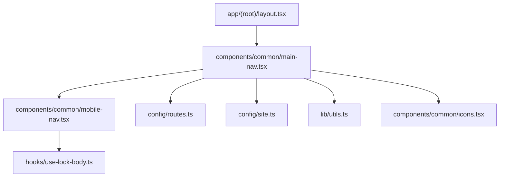
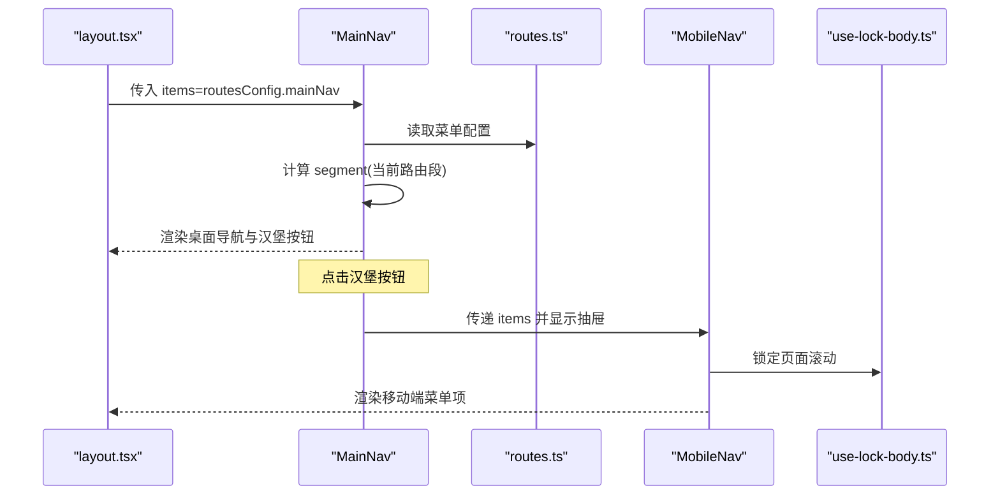
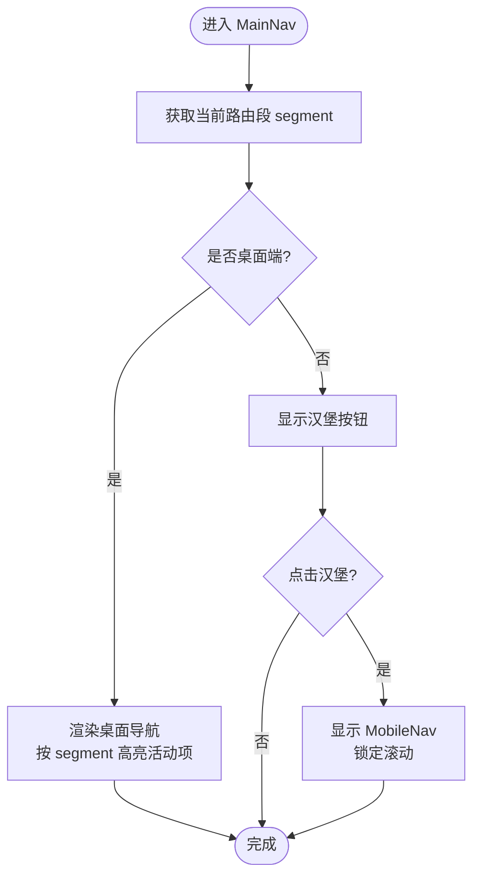
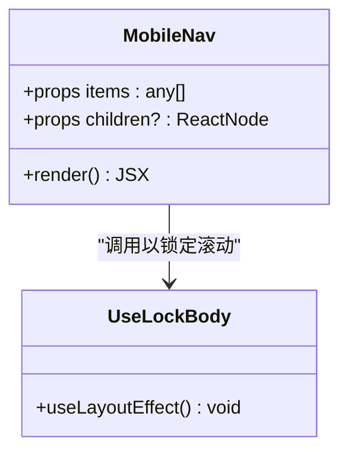
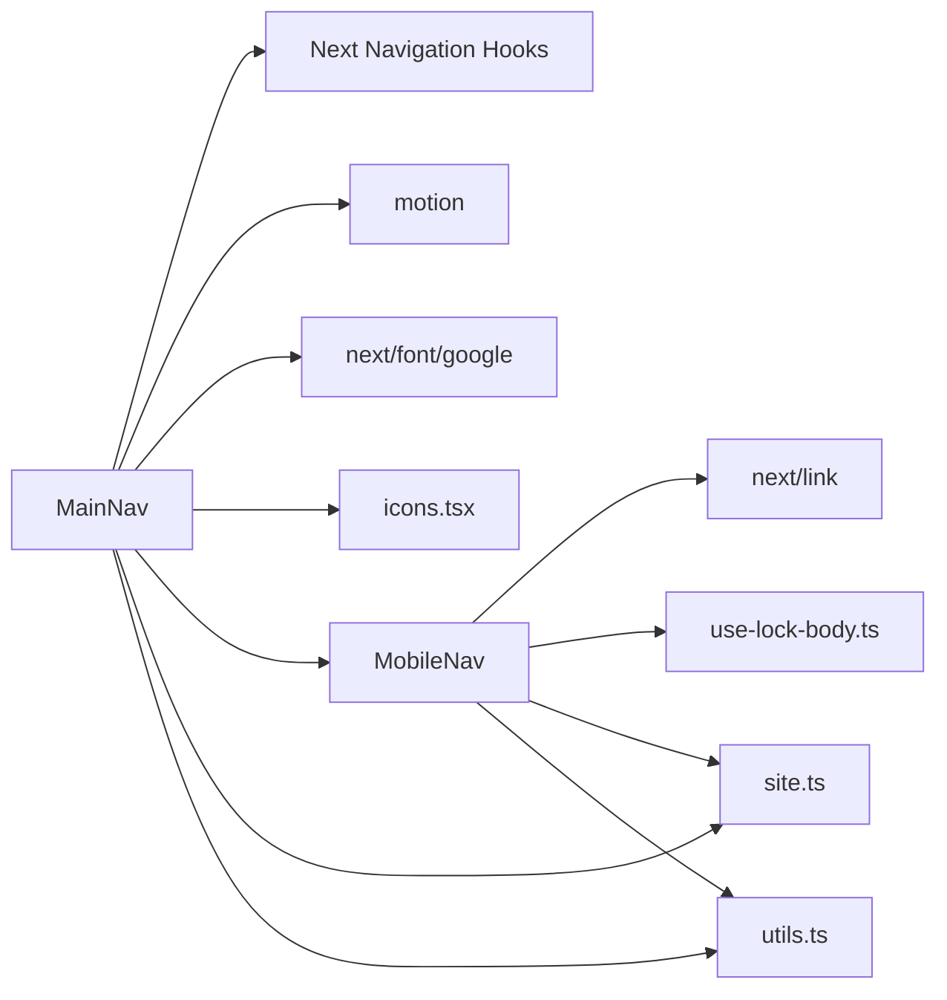

# 导航系统

<cite>
**本文引用的文件**
- [main-nav.tsx](file://components/common/main-nav.tsx)
- [mobile-nav.tsx](file://components/common/mobile-nav.tsx)
- [routes.ts](file://config/routes.ts)
- [layout.tsx](file://app/(root)/layout.tsx)
- [site.ts](file://config/site.ts)
- [use-lock-body.ts](file://hooks/use-lock-body.ts)
- [utils.ts](file://lib/utils.ts)
- [icons.tsx](file://components/common/icons.tsx)
</cite>

## 目录
1. [简介](#简介)
2. [项目结构](#项目结构)
3. [核心组件](#核心组件)
4. [架构总览](#架构总览)
5. [详细组件分析](#详细组件分析)
6. [依赖关系分析](#依赖关系分析)
7. [性能考量](#性能考量)
8. [故障排查指南](#故障排查指南)
9. [结论](#结论)
10. [附录](#附录)

## 简介
本导航系统基于 Next.js App Router，提供桌面与移动端一致的响应式导航体验。核心由两个组件构成：
- main-nav：桌面端主导航与汉堡菜单触发器，负责活动状态检测、路由链接渲染与动画效果。
- mobile-nav：移动端全屏抽屉式菜单，锁定页面滚动并渲染导航项。

导航数据集中配置于 routes.ts，通过 layout 注入到 MainNav，实现“配置即菜单”的动态生成。当前实现已支持：
- 响应式布局（桌面/移动）
- 基于路由段的活动状态高亮
- 移动端汉堡菜单开关与滚动锁定
- 基础的可访问性语义（nav、Link）

尚未内置的功能包括：键盘导航、屏幕阅读器增强（aria 属性）、无障碍焦点管理、子菜单等。文档后续章节将给出定制建议与优化方案。

## 项目结构
导航相关代码组织清晰，遵循“组件 + 配置 + 布局”的分层方式：
- 组件层：main-nav.tsx、mobile-nav.tsx
- 配置层：routes.ts（菜单项）、site.ts（站点信息）
- 布局层：app/(root)/layout.tsx（组装 Header、MainNav、Footer）
- 工具层：use-lock-body.ts（滚动锁定）、utils.ts（样式合并）、icons.tsx（图标集合）

图表来源
- [layout.tsx:11-26](file://app/(root)/layout.tsx#L11-L26)
- [main-nav.tsx:40-101](file://components/common/main-nav.tsx#L40-L101)
- [mobile-nav.tsx:21-53](file://components/common/mobile-nav.tsx#L21-L53)
- [routes.ts:1-28](file://config/routes.ts#L1-L28)
- [site.ts:1-41](file://config/site.ts#L1-L41)
- [use-lock-body.ts:4-12](file://hooks/use-lock-body.ts#L4-L12)
- [utils.ts:4-6](file://lib/utils.ts#L4-L6)
- [icons.tsx:71-97](file://components/common/icons.tsx#L71-L97)

章节来源
- [layout.tsx:11-26](file://app/(root)/layout.tsx#L11-L26)
- [main-nav.tsx:40-101](file://components/common/main-nav.tsx#L40-L101)
- [mobile-nav.tsx:21-53](file://components/common/mobile-nav.tsx#L21-L53)
- [routes.ts:1-28](file://config/routes.ts#L1-L28)
- [site.ts:1-41](file://config/site.ts#L1-L41)
- [use-lock-body.ts:4-12](file://hooks/use-lock-body.ts#L4-L12)
- [utils.ts:4-6](file://lib/utils.ts#L4-L6)
- [icons.tsx:71-97](file://components/common/icons.tsx#L71-L97)

## 核心组件
- MainNav
  - 职责：渲染品牌标识、桌面导航链接、移动端汉堡按钮；根据当前路由段高亮活动项；控制移动端菜单显示。
  - 关键特性：使用 Next 的 useSelectedLayoutSegment 进行活动判断；motion 动画增强交互；响应式隐藏/显示。
- MobileNav
  - 职责：在移动端以全屏抽屉形式展示导航；锁定页面滚动；复用站点信息与导航数据。
  - 关键特性：useLockBody 锁定 body 滚动；固定定位与层级管理；网格布局自适应内容高度。

章节来源
- [main-nav.tsx:40-101](file://components/common/main-nav.tsx#L40-L101)
- [mobile-nav.tsx:21-53](file://components/common/mobile-nav.tsx#L21-L53)

## 架构总览
导航数据流与控制流如下：
- 配置驱动：routes.ts 定义菜单项数组，包含标题与路径。
- 布局注入：layout.tsx 将 routesConfig.mainNav 作为 items 传入 MainNav。
- 渲染逻辑：MainNav 遍历 items 渲染 Link；MobileNav 同样遍历 items 渲染移动端菜单。
- 活动状态：MainNav 使用 useSelectedLayoutSegment 获取当前段，匹配 href 前缀决定高亮。
- 移动端交互：点击汉堡按钮切换 showMobileMenu；打开时调用 useLockBody 锁定滚动。

图表来源
- [layout.tsx:11-26](file://app/(root)/layout.tsx#L11-L26)
- [main-nav.tsx:40-101](file://components/common/main-nav.tsx#L40-L101)
- [routes.ts:1-28](file://config/routes.ts#L1-L28)
- [mobile-nav.tsx:21-53](file://components/common/mobile-nav.tsx#L21-L53)
- [use-lock-body.ts:4-12](file://hooks/use-lock-body.ts#L4-L12)

## 详细组件分析

### MainNav 组件
- 输入与输出
  - props：items（菜单项数组）、children（可选扩展区域）
  - 输出：桌面导航链接、品牌标识、移动端汉堡按钮与抽屉入口
- 活动状态检测
  - 使用 useSelectedLayoutSegment 获取当前段，比较 item.href 是否以 /segment 开头，从而应用高亮样式。
- 响应式行为
  - 桌面端显示 nav 区块；移动端隐藏 nav 并显示汉堡按钮。
  - 点击汉堡按钮切换 showMobileMenu，并在 pathname 变化时自动关闭菜单。
- 动画与交互
  - 使用 motion 为菜单项添加入场动画与悬停/点击缩放反馈。
- 可访问性现状
  - 使用原生 <nav> 与 <Link> 提供基本语义。
  - 未设置 aria 属性或键盘事件处理，需扩展以实现完整无障碍。

图表来源
- [main-nav.tsx:40-101](file://components/common/main-nav.tsx#L40-L101)

章节来源
- [main-nav.tsx:40-101](file://components/common/main-nav.tsx#L40-L101)

### MobileNav 组件
- 输入与输出
  - props：items（菜单项数组）、children（可选扩展区域）
  - 输出：全屏抽屉菜单，包含品牌标识与导航链接列表
- 滚动锁定
  - 使用 useLockBody 在进入抽屉时锁定 body 滚动，离开时恢复。
- 布局与层级
  - 固定定位、z-index 层级确保覆盖内容；网格布局自适应行高。
- 可访问性现状
  - 使用 <nav> 与 <Link>；未设置 aria 属性或键盘事件处理。

图表来源
- [mobile-nav.tsx:21-53](file://components/common/mobile-nav.tsx#L21-L53)
- [use-lock-body.ts:4-12](file://hooks/use-lock-body.ts#L4-L12)

章节来源
- [mobile-nav.tsx:21-53](file://components/common/mobile-nav.tsx#L21-L53)
- [use-lock-body.ts:4-12](file://hooks/use-lock-body.ts#L4-L12)

### 导航数据配置与动态菜单生成
- 配置位置：routes.ts 中的 routesConfig.mainNav 定义了所有菜单项，每项包含 title 与 href。
- 注入方式：layout.tsx 将 routesConfig.mainNav 作为 items 传入 MainNav。
- 动态渲染：MainNav 与 MobileNav 均通过 map(items) 渲染 Link，支持 disabled 字段禁用交互。
- 扩展建议：可在配置中增加 icon、subItems、权限标记等字段，配合组件逻辑实现更丰富的菜单能力。

章节来源
- [routes.ts:1-28](file://config/routes.ts#L1-L28)
- [layout.tsx:11-26](file://app/(root)/layout.tsx#L11-L26)
- [main-nav.tsx:62-88](file://components/common/main-nav.tsx#L62-L88)
- [mobile-nav.tsx:36-49](file://components/common/mobile-nav.tsx#L36-L49)

### 活动状态检测机制
- 原理：使用 Next 的 useSelectedLayoutSegment 获取当前段，比较 item.href 是否以 /segment 开头，若匹配则应用高亮样式。
- 适用场景：适用于一级路由段的高亮；对于深层路由或嵌套路由，可根据需要调整匹配策略（例如使用 startsWith 或正则）。
- 注意事项：当路由段与 href 不完全一致时，需确保匹配逻辑正确，避免误判。

章节来源
- [main-nav.tsx:40-88](file://components/common/main-nav.tsx#L40-L88)

### 移动端汉堡菜单实现
- 触发：点击汉堡按钮切换 showMobileMenu 状态。
- 显示：showMobileMenu 为真时渲染 MobileNav，使用 fixed 定位与 z-index 覆盖内容。
- 滚动锁定：MobileNav 内部调用 useLockBody，在挂载时锁定 body 滚动，卸载时恢复。
- 关闭：pathname 变化时自动关闭菜单，保证路由切换后状态一致。

章节来源
- [main-nav.tsx:40-101](file://components/common/main-nav.tsx#L40-L101)
- [mobile-nav.tsx:21-53](file://components/common/mobile-nav.tsx#L21-L53)
- [use-lock-body.ts:4-12](file://hooks/use-lock-body.ts#L4-L12)

### 键盘导航支持与屏幕阅读器兼容性
- 现状
  - 使用 <nav> 与 <Link> 提供基本语义。
  - 未实现键盘导航（如 Tab 顺序、Enter/Space 激活、Esc 关闭菜单）。
  - 未设置 aria-* 属性（如 aria-expanded、aria-controls、aria-label），屏幕阅读器无法感知菜单展开状态与用途。
- 建议改进
  - 为汉堡按钮添加 aria-expanded 与 aria-controls，关联菜单容器 id。
  - 为菜单容器添加 role="navigation" 与 aria-label="主导航"。
  - 实现键盘导航：Tab 聚焦、Enter/Space 激活链接、Esc 关闭菜单并将焦点返回触发按钮。
  - 焦点陷阱：在移动端菜单打开时将焦点限制在菜单内，关闭时恢复。
  - 为图标按钮添加 aria-hidden="true" 与文本标签，确保可读性。

章节来源
- [main-nav.tsx:90-101](file://components/common/main-nav.tsx#L90-L101)
- [mobile-nav.tsx:24-53](file://components/common/mobile-nav.tsx#L24-L53)
- [icons.tsx:71-97](file://components/common/icons.tsx#L71-L97)

### 导航定制示例
- 新增菜单项：在 routes.ts 的 mainNav 中添加对象，包含 title 与 href。
- 禁用菜单项：为项添加 disabled: true，组件会禁用交互并降低不透明度。
- 自定义图标：在 icons.tsx 中注册新图标，并在菜单项中引用（可扩展数据结构以支持 icon 字段）。
- 主题与样式：通过 Tailwind 类名与 cn 工具函数组合样式，支持 hover、active、disabled 等状态。

章节来源
- [routes.ts:1-28](file://config/routes.ts#L1-L28)
- [main-nav.tsx:62-88](file://components/common/main-nav.tsx#L62-L88)
- [mobile-nav.tsx:36-49](file://components/common/mobile-nav.tsx#L36-L49)
- [utils.ts:4-6](file://lib/utils.ts#L4-L6)
- [icons.tsx:71-97](file://components/common/icons.tsx#L71-L97)

### 样式覆盖方法
- 使用 Tailwind 类名：通过 className 组合不同状态样式（hover、active、disabled）。
- 使用 cn 工具：合并条件类名，避免冲突与冗余。
- 主题变量：通过 CSS 变量与 Tailwind 的 text-foreground、bg-background 等语义化类名适配明暗主题。
- 组件级覆盖：在父组件中通过 props 或 wrapper 包裹，注入额外类名或样式。

章节来源
- [main-nav.tsx:62-88](file://components/common/main-nav.tsx#L62-L88)
- [mobile-nav.tsx:24-53](file://components/common/mobile-nav.tsx#L24-L53)
- [utils.ts:4-6](file://lib/utils.ts#L4-L6)

### 性能优化技巧
- 减少重渲染：将 items 配置提升到模块级常量，避免每次渲染创建新数组。
- 动画性能：合理使用 motion 的 initial/animate/transition，避免过度动画导致卡顿。
- 懒加载与分割：对非首屏菜单项或大型图标资源考虑按需加载。
- 滚动锁定：仅在移动端菜单打开时锁定滚动，避免不必要的布局抖动。
- 路由段匹配：使用轻量字符串匹配（startsWith）而非复杂正则，提升性能。

章节来源
- [main-nav.tsx:26-38](file://components/common/main-nav.tsx#L26-L38)
- [main-nav.tsx:40-101](file://components/common/main-nav.tsx#L40-L101)
- [mobile-nav.tsx:21-53](file://components/common/mobile-nav.tsx#L21-L53)

## 依赖关系分析
- 组件依赖
  - MainNav 依赖：Next Navigation Hooks（usePathname、useSelectedLayoutSegment）、motion、next/font/google、Icons、MobileNav、siteConfig、cn。
  - MobileNav 依赖：next/link、siteConfig、useLockBody、cn。
- 配置依赖
  - routes.ts 提供菜单数据；site.ts 提供站点元信息。
- 工具依赖
  - utils.ts 提供样式合并；use-lock-body.ts 提供滚动锁定；icons.tsx 提供图标集合。

图表来源
- [main-nav.tsx:1-13](file://components/common/main-nav.tsx#L1-L13)
- [mobile-nav.tsx:1-8](file://components/common/mobile-nav.tsx#L1-L8)
- [routes.ts:1-28](file://config/routes.ts#L1-L28)
- [site.ts:1-41](file://config/site.ts#L1-L41)
- [utils.ts:4-6](file://lib/utils.ts#L4-L6)
- [use-lock-body.ts:4-12](file://hooks/use-lock-body.ts#L4-L12)
- [icons.tsx:71-97](file://components/common/icons.tsx#L71-L97)

章节来源
- [main-nav.tsx:1-13](file://components/common/main-nav.tsx#L1-L13)
- [mobile-nav.tsx:1-8](file://components/common/mobile-nav.tsx#L1-L8)
- [routes.ts:1-28](file://config/routes.ts#L1-L28)
- [site.ts:1-41](file://config/site.ts#L1-L41)
- [utils.ts:4-6](file://lib/utils.ts#L4-L6)
- [use-lock-body.ts:4-12](file://hooks/use-lock-body.ts#L4-L12)
- [icons.tsx:71-97](file://components/common/icons.tsx#L71-L97)

## 性能考量
- 动画与过渡：motion 的入场动画与悬停/点击缩放带来良好交互，但应避免过多动画叠加导致性能下降。
- 路由段匹配：使用字符串前缀匹配，时间复杂度 O(n)，n 为菜单项数量，通常可接受。
- 滚动锁定：仅在移动端菜单打开时启用，减少不必要的 DOM 操作。
- 资源加载：字体与图标按需加载，避免阻塞首屏。

[本节为通用性能讨论，不直接分析具体文件]

## 故障排查指南
- 菜单不显示
  - 检查 routes.ts 中 mainNav 是否为空或未正确导入。
  - 确认 layout.tsx 是否正确传入 items。
- 活动状态不正确
  - 检查 useSelectedLayoutSegment 返回值与 item.href 的匹配逻辑。
  - 对于深层路由，可能需要调整匹配策略。
- 移动端菜单无法关闭
  - 检查 pathname 变化时是否重置 showMobileMenu。
  - 确认 MobileNav 的关闭逻辑与焦点管理。
- 滚动未锁定
  - 确认 useLockBody 是否正确挂载与卸载。
  - 检查是否有其他样式覆盖 body 的 overflow。

章节来源
- [main-nav.tsx:40-101](file://components/common/main-nav.tsx#L40-L101)
- [mobile-nav.tsx:21-53](file://components/common/mobile-nav.tsx#L21-L53)
- [use-lock-body.ts:4-12](file://hooks/use-lock-body.ts#L4-L12)
- [routes.ts:1-28](file://config/routes.ts#L1-L28)
- [layout.tsx:11-26](file://app/(root)/layout.tsx#L11-L26)

## 结论
该导航系统以配置驱动为核心，实现了桌面与移动端的一致体验，具备活动状态高亮、汉堡菜单与滚动锁定等关键功能。当前实现简洁高效，适合快速迭代与定制。未来可进一步增强无障碍支持（键盘导航、aria 属性、焦点管理）与高级交互（子菜单、搜索、权限控制），以提升用户体验与可访问性。

[本节为总结性内容，不直接分析具体文件]

## 附录
- 常用配置项
  - routes.ts：mainNav 数组，每项包含 title、href、可选 disabled。
  - site.ts：authorName、links、keywords 等站点元信息。
- 扩展点
  - 在 icons.tsx 中注册新图标。
  - 在 utils.ts 中扩展样式工具函数。
  - 在 hooks 中新增焦点管理与键盘事件处理。

[本节为补充信息，不直接分析具体文件]