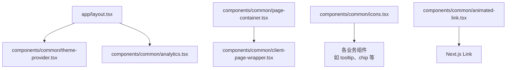
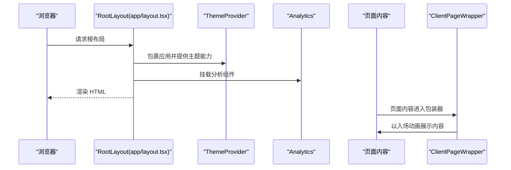
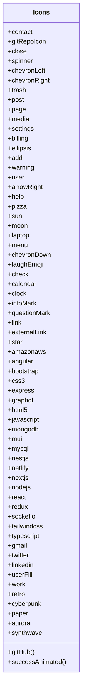
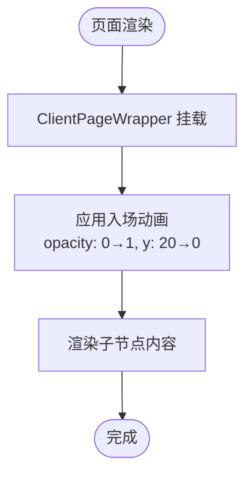
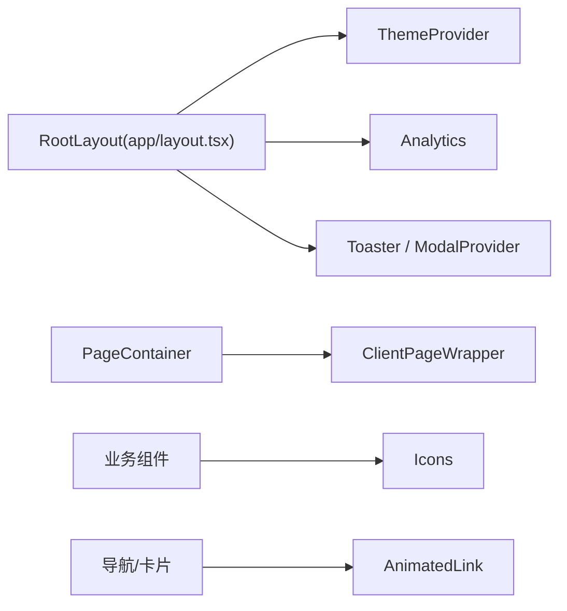

# 工具组件

<cite>
**本文引用的文件**
- [components/common/icons.tsx](file://components/common/icons.tsx)
- [components/common/animated-link.tsx](file://components/common/animated-link.tsx)
- [components/common/analytics.tsx](file://components/common/analytics.tsx)
- [components/common/client-page-wrapper.tsx](file://components/common/client-page-wrapper.tsx)
- [components/common/theme-provider.tsx](file://components/common/theme-provider.tsx)
- [app/layout.tsx](file://app/layout.tsx)
- [components/common/page-container.tsx](file://components/common/page-container.tsx)
- [config/site.ts](file://config/site.ts)
</cite>

## 目录
1. [简介](#简介)
2. [项目结构](#项目结构)
3. [核心组件](#核心组件)
4. [架构总览](#架构总览)
5. [详细组件分析](#详细组件分析)
6. [依赖关系分析](#依赖关系分析)
7. [性能考量](#性能考量)
8. [故障排查指南](#故障排查指南)
9. [结论](#结论)
10. [附录：使用示例与扩展方法](#附录使用示例与扩展方法)

## 简介
本文件聚焦于四个工具组件，提供系统化、可操作的文档：
- icons 图标组件：集中管理 SVG 图标，支持多来源图标库统一导出、主题色适配与可扩展注册。
- animated-link 动画链接：基于 Next.js Link 的封装，提供悬停与点击动效，增强路由跳转的视觉反馈。
- analytics 分析组件：集成 Vercel Analytics，用于客户端行为数据采集与分析。
- client-page-wrapper 客户端页面包装器：为页面内容提供入场动画，提升页面切换体验；在 SSR 场景下配合父级布局实现优化。

## 项目结构
这些工具组件位于 components/common 目录下，被全局布局与页面容器复用。根布局负责注入主题、分析与第三方脚本；页面容器通过包装器为页面内容添加统一的过渡动画。



图表来源
- [app/layout.tsx:1-145](file://app/layout.tsx#L1-L145)
- [components/common/theme-provider.tsx:1-8](file://components/common/theme-provider.tsx#L1-L8)
- [components/common/analytics.tsx:1-8](file://components/common/analytics.tsx#L1-L8)
- [components/common/page-container.tsx:1-26](file://components/common/page-container.tsx#L1-L26)
- [components/common/client-page-wrapper.tsx:1-37](file://components/common/client-page-wrapper.tsx#L1-L37)
- [components/common/icons.tsx:1-180](file://components/common/icons.tsx#L1-L180)
- [components/common/animated-link.tsx:1-42](file://components/common/animated-link.tsx#L1-L42)

章节来源
- [app/layout.tsx:1-145](file://app/layout.tsx#L1-L145)
- [components/common/page-container.tsx:1-26](file://components/common/page-container.tsx#L1-L26)

## 核心组件
- Icons 图标系统：集中导出图标，便于统一管理与主题适配。
- AnimatedLink 动画链接：封装 Next.js Link，提供交互动效。
- Analytics 分析组件：轻量封装 Vercel Analytics。
- ClientPageWrapper 页面包装器：为页面内容提供入场动画。

章节来源
- [components/common/icons.tsx:1-180](file://components/common/icons.tsx#L1-L180)
- [components/common/animated-link.tsx:1-42](file://components/common/animated-link.tsx#L1-L42)
- [components/common/analytics.tsx:1-8](file://components/common/analytics.tsx#L1-L8)
- [components/common/client-page-wrapper.tsx:1-37](file://components/common/client-page-wrapper.tsx#L1-L37)

## 架构总览
整体采用“布局层 + 通用组件层”的分层设计：
- 根布局 app/layout.tsx 注入主题提供者、分析组件与全局样式/字体。
- 通用组件集中在 components/common，供业务页面与 UI 组件复用。
- 页面容器 page-container 组合 ClientPageWrapper 与 PageHeader，形成一致的页面骨架。



图表来源
- [app/layout.tsx:99-145](file://app/layout.tsx#L99-L145)
- [components/common/theme-provider.tsx:1-8](file://components/common/theme-provider.tsx#L1-L8)
- [components/common/analytics.tsx:1-8](file://components/common/analytics.tsx#L1-L8)
- [components/common/client-page-wrapper.tsx:10-36](file://components/common/client-page-wrapper.tsx#L10-L36)

## 详细组件分析

### Icons 图标组件：SVG 图标管理系统
- 功能概述
  - 统一管理来自多个图标库的图标（如 lucide-react、react-icons），通过单一命名空间导出，降低引入成本与维护复杂度。
  - 支持将函数式组件作为图标值，允许自定义 SVG 或带样式的图标。
  - 通过 CSS 变量与 Tailwind 类名，结合 next-themes 的主题切换，实现图标颜色随主题变化。
- 关键设计
  - 集中导出对象 Icons，键名为语义化名称，值为具体图标组件或函数组件。
  - 内置部分技术栈图标与社交图标，便于快速构建技能展示、社交链接等模块。
  - 提供 successAnimated 等复合图标，包含结构与样式，便于复用。
- 主题适配
  - 图标颜色通过 currentColor 继承，由主题上下文控制，无需额外配置即可跟随主题切换。
- 扩展方式
  - 新增图标：在 Icons 对象中添加新键值对，指向目标图标组件或自定义函数组件。
  - 动态选择：根据运行时状态或配置项选择不同图标，例如按语言或角色显示不同图标。
  - 主题定制：通过主题变量或 Tailwind 类名覆盖图标颜色与尺寸。



图表来源
- [components/common/icons.tsx:71-179](file://components/common/icons.tsx#L71-L179)

章节来源
- [components/common/icons.tsx:1-180](file://components/common/icons.tsx#L1-L180)

### AnimatedLink 动画链接：路由跳转与视觉反馈
- 功能概述
  - 基于 Next.js Link 的封装，提供悬停放大与点击缩小的弹簧动画，增强交互反馈。
  - 保留 Link 的全部属性（href、className、onClick、target、rel），便于无缝替换原有 Link。
- 路由跳转
  - 内部使用 Next.js Link，确保客户端路由跳转与 SEO 友好性。
- 视觉反馈
  - 使用 motion/react 的 whileHover 与 whileTap 实现平滑缩放动画，transition 参数调优手感。
- 使用建议
  - 在导航、卡片、按钮等需要强调交互的元素上替换原生 Link。
  - 可通过 className 进一步定制样式，或通过 onClick 附加埋点逻辑。

```mermaid
sequenceDiagram
participant User as "用户"
participant AL as "AnimatedLink"
participant Link as "Next.js Link"
User->>AL : 鼠标悬停/点击
AL->>AL : 触发 whileHover / whileTap 动画
AL->>Link : 执行路由跳转
Link-->>User : 导航到新页面
```

图表来源
- [components/common/animated-link.tsx:16-41](file://components/common/animated-link.tsx#L16-L41)

章节来源
- [components/common/animated-link.tsx:1-42](file://components/common/animated-link.tsx#L1-L42)

### Analytics 分析组件：数据收集与分析集成
- 功能概述
  - 轻量封装 Vercel Analytics，提供开箱即用的前端行为采集能力。
  - 在根布局中挂载，确保全站点生效。
- 集成方式
  - 在 app/layout.tsx 中引入并渲染 Analytics 组件，自动初始化分析 SDK。
- 扩展建议
  - 如需更多指标或事件上报，可在业务组件中调用 Vercel Analytics 提供的 API（如 trackEvent）。
  - 结合环境变量控制启用/禁用，便于开发环境与生产环境差异化配置。

章节来源
- [components/common/analytics.tsx:1-8](file://components/common/analytics.tsx#L1-L8)
- [app/layout.tsx:105-133](file://app/layout.tsx#L105-L133)

### ClientPageWrapper 客户端页面包装器：服务端渲染优化
- 功能概述
  - 为页面内容提供统一的入场动画（淡入+上移），提升页面切换体验。
  - 使用 motion/react 的 variants 与 initial/animate 生命周期，确保动画在服务端与客户端一致。
- SSR 优化要点
  - 动画仅在客户端生效，避免与服务端渲染冲突；通过 suppressHydrationWarning 减少警告。
  - 与根布局中的 ThemeProvider 配合，保证主题切换时动画不受影响。
- 使用位置
  - 通常由页面容器（如 page-container）包裹页面主体内容，统一入口动画。



图表来源
- [components/common/client-page-wrapper.tsx:10-36](file://components/common/client-page-wrapper.tsx#L10-L36)

章节来源
- [components/common/client-page-wrapper.tsx:1-37](file://components/common/client-page-wrapper.tsx#L1-L37)
- [components/common/page-container.tsx:1-26](file://components/common/page-container.tsx#L1-L26)
- [app/layout.tsx:105-133](file://app/layout.tsx#L105-L133)

## 依赖关系分析
- 根布局依赖
  - ThemeProvider：提供主题能力，影响图标颜色与全局样式。
  - Analytics：注入分析 SDK。
  - Toaster、ModalProvider：全局提示与模态框能力。
- 组件间耦合
  - page-container 依赖 client-page-wrapper，形成页面骨架。
  - 业务组件通过 Icons 统一获取图标，降低重复导入。
  - animated-link 依赖 Next.js Link，保持路由能力不变。



图表来源
- [app/layout.tsx:99-145](file://app/layout.tsx#L99-L145)
- [components/common/page-container.tsx:1-26](file://components/common/page-container.tsx#L1-L26)
- [components/common/icons.tsx:1-180](file://components/common/icons.tsx#L1-L180)
- [components/common/animated-link.tsx:1-42](file://components/common/animated-link.tsx#L1-L42)

章节来源
- [app/layout.tsx:99-145](file://app/layout.tsx#L99-L145)
- [components/common/page-container.tsx:1-26](file://components/common/page-container.tsx#L1-L26)

## 性能考量
- 图标系统
  - 集中导出减少重复导入，利于 Tree Shaking 与打包体积优化。
  - 使用函数式图标时注意不要引入额外大依赖。
- 动画与 SSR
  - 动画仅在客户端执行，避免首屏阻塞；合理设置 duration 与 easing，避免过度重排。
- 分析组件
  - 按需启用，避免在开发环境产生不必要网络请求。
  - 结合环境变量控制开关，减少生产环境的冗余代码。

[本节为通用指导，不直接分析具体文件]

## 故障排查指南
- 根布局缺少 Google Analytics ID
  - 现象：启动时报错提示缺少 GA_ID。
  - 处理：在环境变量中配置 NEXT_PUBLIC_GOOGLE_MEASUREMENT_ID。
- 主题未生效或图标颜色异常
  - 检查 ThemeProvider 是否包裹应用，确认 themes 列表包含所需主题。
  - 确认图标通过 currentColor 继承，且外层容器具备正确的文本颜色。
- 页面动画闪烁或不播放
  - 确认 ClientPageWrapper 正确包裹页面内容。
  - 检查是否存在多次渲染导致动画重置，必要时调整 key 或条件渲染。

章节来源
- [app/layout.tsx:100-103](file://app/layout.tsx#L100-L103)
- [app/layout.tsx:115-128](file://app/layout.tsx#L115-L128)
- [components/common/client-page-wrapper.tsx:10-36](file://components/common/client-page-wrapper.tsx#L10-L36)

## 结论
- Icons 提供了统一、可扩展的图标管理能力，结合主题系统实现无缝配色。
- AnimatedLink 在不牺牲路由能力的前提下增强了交互反馈。
- Analytics 以最小侵入方式接入前端分析，便于后续数据驱动优化。
- ClientPageWrapper 为页面提供一致的入场体验，并与 SSR 良好兼容。
- 通过根布局与页面容器的组合，形成稳定、易维护的工具层。

[本节为总结，不直接分析具体文件]

## 附录：使用示例与扩展方法
- 使用 Icons
  - 在任意组件中导入 Icons，并通过键名访问对应图标组件，传入 className 控制尺寸与颜色。
  - 参考路径：[icons.tsx 导出定义:71-179](file://components/common/icons.tsx#L71-L179)
- 使用 AnimatedLink
  - 将现有 Link 替换为 AnimatedLink，保持 props 一致，即可获得悬停与点击动效。
  - 参考路径：[animated-link.tsx 组件定义:16-41](file://components/common/animated-link.tsx#L16-L41)
- 集成 Analytics
  - 在根布局中已挂载，无需额外操作；如需事件上报，可在业务组件中调用相关 API。
  - 参考路径：[analytics.tsx 组件定义:1-8](file://components/common/analytics.tsx#L1-L8)、[layout.tsx 挂载位置:105-133](file://app/layout.tsx#L105-L133)
- 使用 ClientPageWrapper
  - 在页面容器中包裹页面主体内容，以获得统一的入场动画。
  - 参考路径：[client-page-wrapper.tsx 动画定义:10-36](file://components/common/client-page-wrapper.tsx#L10-L36)、[page-container.tsx 组合使用:1-26](file://components/common/page-container.tsx#L1-L26)
- 扩展主题与图标
  - 在 ThemeProvider 的 themes 列表中增加新主题，并在样式文件中定义对应变量。
  - 在 Icons 对象中新增键值对，指向新的图标组件或自定义函数组件。
  - 参考路径：[theme-provider.tsx:1-8](file://components/common/theme-provider.tsx#L1-L8)、[layout.tsx 主题配置:115-128](file://app/layout.tsx#L115-L128)、[icons.tsx 扩展点:71-179](file://components/common/icons.tsx#L71-L179)

章节来源
- [components/common/icons.tsx:71-179](file://components/common/icons.tsx#L71-L179)
- [components/common/animated-link.tsx:16-41](file://components/common/animated-link.tsx#L16-L41)
- [components/common/analytics.tsx:1-8](file://components/common/analytics.tsx#L1-L8)
- [components/common/client-page-wrapper.tsx:10-36](file://components/common/client-page-wrapper.tsx#L10-L36)
- [components/common/page-container.tsx:1-26](file://components/common/page-container.tsx#L1-L26)
- [components/common/theme-provider.tsx:1-8](file://components/common/theme-provider.tsx#L1-L8)
- [app/layout.tsx:115-128](file://app/layout.tsx#L115-L128)