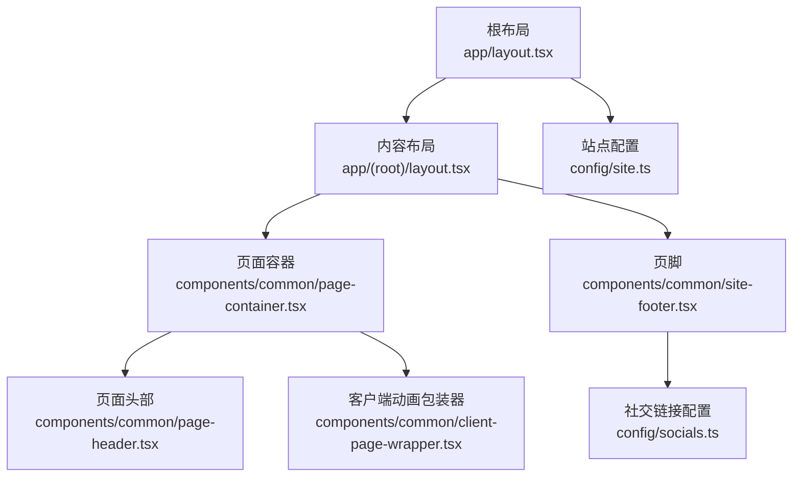
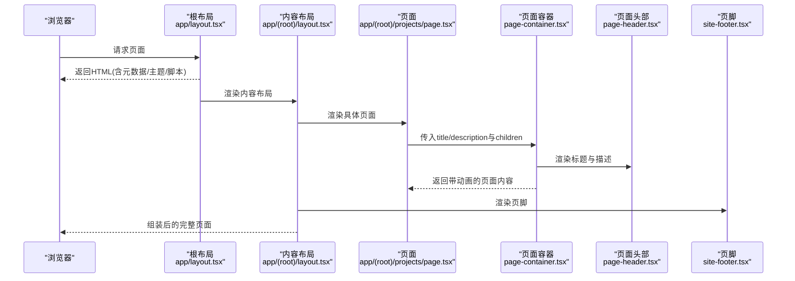
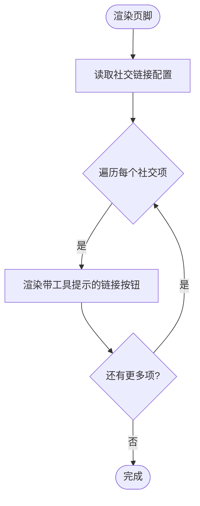
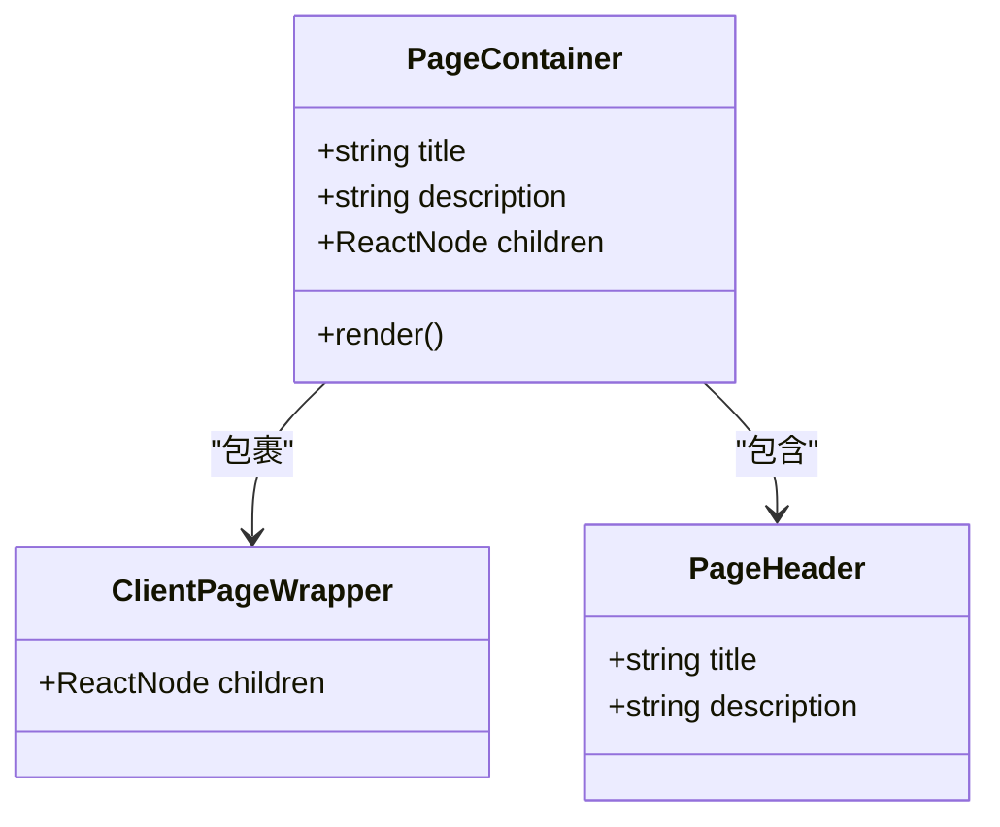
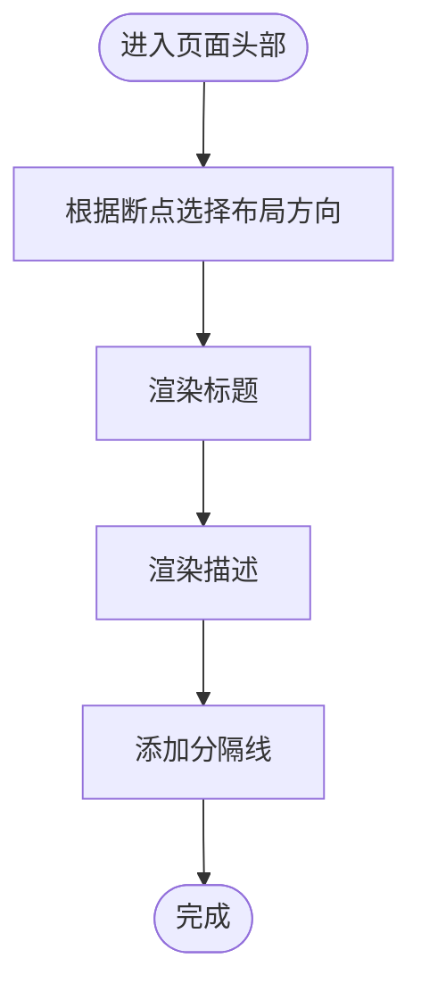
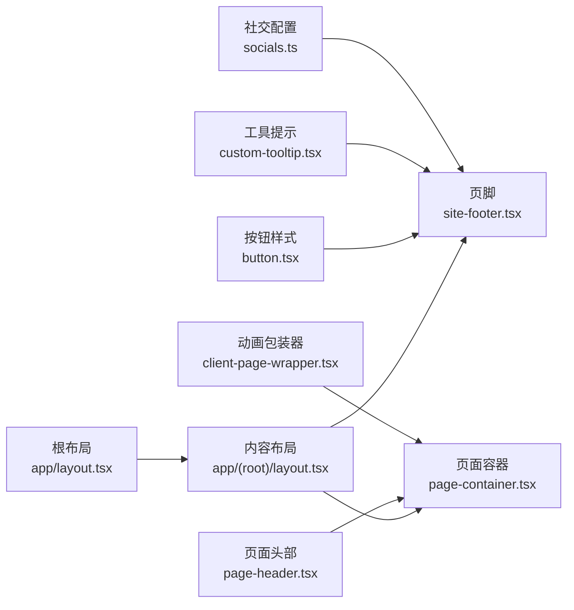

# 布局组件

<cite>
**本文引用的文件**
- [site-footer.tsx](file://components/common/site-footer.tsx)
- [page-container.tsx](file://components/common/page-container.tsx)
- [page-header.tsx](file://components/common/page-header.tsx)
- [client-page-wrapper.tsx](file://components/common/client-page-wrapper.tsx)
- [custom-tooltip.tsx](file://components/ui/custom-tooltip.tsx)
- [button.tsx](file://components/ui/button.tsx)
- [socials.ts](file://config/socials.ts)
- [site.ts](file://config/site.ts)
- [app layout.tsx](file://app/layout.tsx)
- [root layout.tsx](file://app/(root)/layout.tsx)
- [projects page.tsx](file://app/(root)/projects/page.tsx)
</cite>

## 目录
1. [简介](#简介)
2. [项目结构](#项目结构)
3. [核心组件](#核心组件)
4. [架构总览](#架构总览)
5. [详细组件分析](#详细组件分析)
6. [依赖关系分析](#依赖关系分析)
7. [性能考虑](#性能考虑)
8. [故障排查指南](#故障排查指南)
9. [结论](#结论)
10. [附录](#附录)

## 简介
本文件聚焦于站点布局相关的三个关键组件：页脚（SiteFooter）、页面容器（PageContainer）与页面头部（PageHeader）。文档将解释它们的结构设计、响应式布局与间距管理、标题展示与面包屑导航的实现方式，并提供布局定制方法、SEO优化技巧与可访问性支持方案。

## 项目结构
布局相关代码主要位于 components/common 与 app 层：
- 根级布局负责全局元数据、主题与脚本注入
- 营销/内容区域布局负责顶部导航、主体内容与页脚
- 页面容器统一包裹页面内容，提供一致的头部与内边距

图表来源
- [app layout.tsx:1-145](file://app/layout.tsx#L1-L145)
- [root layout.tsx:1-33](file://app/(root)/layout.tsx#L1-L33)
- [page-container.tsx:1-27](file://components/common/page-container.tsx#L1-L27)
- [page-header.tsx:1-21](file://components/common/page-header.tsx#L1-L21)
- [client-page-wrapper.tsx:1-37](file://components/common/client-page-wrapper.tsx#L1-L37)
- [site-footer.tsx:1-34](file://components/common/site-footer.tsx#L1-L34)
- [socials.ts:1-36](file://config/socials.ts#L1-L36)
- [site.ts:1-41](file://config/site.ts#L1-L41)

章节来源
- [app layout.tsx:1-145](file://app/layout.tsx#L1-L145)
- [root layout.tsx:1-33](file://app/(root)/layout.tsx#L1-L33)

## 核心组件
- 页脚 SiteFooter：集中展示社交媒体图标链接，使用工具提示显示用户名或账号名，采用统一的按钮样式与间距。
- 页面容器 PageContainer：组合客户端动画包装器与页面头部，为子内容提供响应式左右边距与横向溢出隐藏。
- 页面头部 PageHeader：渲染页面标题与描述，提供清晰的视觉层次与分隔线。

章节来源
- [site-footer.tsx:1-34](file://components/common/site-footer.tsx#L1-L34)
- [page-container.tsx:1-27](file://components/common/page-container.tsx#L1-L27)
- [page-header.tsx:1-21](file://components/common/page-header.tsx#L1-L21)

## 架构总览
页面渲染流程从根布局开始，逐步进入内容布局与具体页面。页面容器作为页面的标准外壳，确保每个页面拥有一致的头部与内容区样式；页脚在所有页面底部统一呈现。

图表来源
- [app layout.tsx:1-145](file://app/layout.tsx#L1-L145)
- [root layout.tsx:1-33](file://app/(root)/layout.tsx#L1-L33)
- [projects page.tsx:1-59](file://app/(root)/projects/page.tsx#L1-L59)
- [page-container.tsx:1-27](file://components/common/page-container.tsx#L1-L27)
- [page-header.tsx:1-21](file://components/common/page-header.tsx#L1-L21)
- [site-footer.tsx:1-34](file://components/common/site-footer.tsx#L1-L34)

## 详细组件分析

### 页脚 SiteFooter
- 功能要点
  - 通过社交链接配置数组动态渲染多个社交图标链接，每个链接带有工具提示，便于屏幕阅读器与鼠标悬停时获取更多信息。
  - 使用统一的按钮变体与尺寸，保证视觉一致性。
  - 外层容器使用居中对齐与固定高度，适配移动端到桌面端的间距变化。
- 数据结构
  - 社交链接来自配置文件，包含名称、用户名、图标组件与链接地址。
- 可访问性
  - 链接具备明确的 href 与 target="_blank"，配合工具提示文本提升可理解性。
  - 图标由外部图标库提供，建议为链接添加 aria-label 以增强无障碍体验（当前实现依赖工具提示文案）。
- 扩展点
  - 可在配置文件中新增社交平台条目，无需修改组件逻辑。
  - 可通过 className 覆盖容器样式，实现品牌化定制。

图表来源
- [site-footer.tsx:1-34](file://components/common/site-footer.tsx#L1-L34)
- [socials.ts:1-36](file://config/socials.ts#L1-L36)
- [custom-tooltip.tsx:1-35](file://components/ui/custom-tooltip.tsx#L1-L35)
- [button.tsx:1-57](file://components/ui/button.tsx#L1-L57)

章节来源
- [site-footer.tsx:1-34](file://components/common/site-footer.tsx#L1-L34)
- [socials.ts:1-36](file://config/socials.ts#L1-L36)
- [custom-tooltip.tsx:1-35](file://components/ui/custom-tooltip.tsx#L1-L35)
- [button.tsx:1-57](file://components/ui/button.tsx#L1-L57)

### 页面容器 PageContainer
- 功能要点
  - 组合客户端动画包装器，使页面内容在挂载时具有淡入与上移的入场动画。
  - 内部包含页面头部与内容区，内容区设置响应式水平边距并隐藏横向溢出，避免长表格或宽卡片导致滚动条问题。
- 响应式与间距
  - 小屏设备使用较小边距，大屏设备增加边距，保持内容可读性与留白。
- 使用方式
  - 页面组件只需传入 title、description 与 children，即可获得一致的结构与样式。

图表来源
- [page-container.tsx:1-27](file://components/common/page-container.tsx#L1-L27)
- [client-page-wrapper.tsx:1-37](file://components/common/client-page-wrapper.tsx#L1-L37)
- [page-header.tsx:1-21](file://components/common/page-header.tsx#L1-L21)

章节来源
- [page-container.tsx:1-27](file://components/common/page-container.tsx#L1-L27)
- [client-page-wrapper.tsx:1-37](file://components/common/client-page-wrapper.tsx#L1-L37)

### 页面头部 PageHeader
- 功能要点
  - 渲染页面主标题与描述，采用响应式布局在小屏下垂直堆叠，在大屏下水平分布并两端对齐。
  - 标题使用标题字体与较大字号，描述使用次要文字颜色，形成清晰层级。
  - 底部添加分隔线，视觉上区分头部与正文。
- 可扩展点
  - 可在此处集成面包屑导航组件，或在右侧放置操作按钮（如导出、分享等），保持布局不变。

图表来源
- [page-header.tsx:1-21](file://components/common/page-header.tsx#L1-L21)

章节来源
- [page-header.tsx:1-21](file://components/common/page-header.tsx#L1-L21)

### 面包屑导航实现说明
- 当前页面头部未直接内置面包屑可视化组件。
- 项目中存在基于 Schema.org 的面包屑结构化数据示例，用于 SEO 增强，而非 UI 面包屑。
- 若需在前端展示面包屑，建议在 PageHeader 中引入通用面包屑组件，并结合路由配置生成路径节点。

章节来源
- [projects page.tsx:1-59](file://app/(root)/projects/page.tsx#L1-L59)

## 依赖关系分析
- 页脚依赖社交链接配置与工具提示、按钮组件，解耦了内容与样式。
- 页面容器依赖客户端动画包装器与页面头部，提供一致的页面外壳。
- 根布局与内容布局负责整体结构与全局资源（主题、脚本、元数据）。

图表来源
- [socials.ts:1-36](file://config/socials.ts#L1-L36)
- [site-footer.tsx:1-34](file://components/common/site-footer.tsx#L1-L34)
- [custom-tooltip.tsx:1-35](file://components/ui/custom-tooltip.tsx#L1-L35)
- [button.tsx:1-57](file://components/ui/button.tsx#L1-L57)
- [client-page-wrapper.tsx:1-37](file://components/common/client-page-wrapper.tsx#L1-L37)
- [page-header.tsx:1-21](file://components/common/page-header.tsx#L1-L21)
- [page-container.tsx:1-27](file://components/common/page-container.tsx#L1-L27)
- [app layout.tsx:1-145](file://app/layout.tsx#L1-L145)
- [root layout.tsx:1-33](file://app/(root)/layout.tsx#L1-L33)

章节来源
- [socials.ts:1-36](file://config/socials.ts#L1-L36)
- [site-footer.tsx:1-34](file://components/common/site-footer.tsx#L1-L34)
- [custom-tooltip.tsx:1-35](file://components/ui/custom-tooltip.tsx#L1-L35)
- [button.tsx:1-57](file://components/ui/button.tsx#L1-L57)
- [client-page-wrapper.tsx:1-37](file://components/common/client-page-wrapper.tsx#L1-L37)
- [page-header.tsx:1-21](file://components/common/page-header.tsx#L1-L21)
- [page-container.tsx:1-27](file://components/common/page-container.tsx#L1-L27)
- [app layout.tsx:1-145](file://app/layout.tsx#L1-L145)
- [root layout.tsx:1-33](file://app/(root)/layout.tsx#L1-L33)

## 性能考虑
- 客户端动画包装器仅在页面挂载时执行一次入场动画，对首屏影响有限。
- 页脚社交图标数量通常较少，渲染开销低；如需大量图标，可考虑懒加载或按需引入图标。
- 页面容器的响应式边距与溢出隐藏有助于减少不必要的重排与滚动计算。

[本节为通用性能建议，不直接分析具体文件]

## 故障排查指南
- 页脚图标不显示或工具提示无文案
  - 检查社交配置是否包含有效的图标组件与用户名字段。
  - 确认工具提示组件已正确接收 text 与 icon 参数。
- 页面内容出现横向滚动条
  - 页面容器已设置横向溢出隐藏；若仍出现，检查子组件是否存在过宽元素或负边距。
- 页面头部标题或描述未渲染
  - 确认页面组件向 PageContainer 传入了正确的 title 与 description。
- 根布局报错缺少 Google Analytics ID
  - 检查环境变量是否配置，避免构建期抛出错误。

章节来源
- [site-footer.tsx:1-34](file://components/common/site-footer.tsx#L1-L34)
- [custom-tooltip.tsx:1-35](file://components/ui/custom-tooltip.tsx#L1-L35)
- [page-container.tsx:1-27](file://components/common/page-container.tsx#L1-L27)
- [page-header.tsx:1-21](file://components/common/page-header.tsx#L1-L21)
- [app layout.tsx:1-145](file://app/layout.tsx#L1-L145)

## 结论
该布局体系通过页脚、页面容器与页面头部的职责分离，实现了可复用、易扩展且响应友好的页面结构。页脚以配置驱动的方式管理社交链接，页面容器统一处理动画与间距，页面头部提供清晰的标题与描述展示。结合根布局的全局元数据与主题能力，整体具备良好的 SEO 基础与可访问性潜力。

[本节为总结性内容，不直接分析具体文件]

## 附录

### 布局定制方法
- 自定义页脚样式
  - 通过 className 覆盖外层 footer 容器样式，调整间距、背景或高度。
  - 在社交配置中新增或移除平台，无需改动组件逻辑。
- 调整页面容器间距
  - 修改内容区的响应式边距类，以适应不同设计稿的留白需求。
- 扩展页面头部
  - 在 PageHeader 中添加面包屑、操作按钮或副标题，保持响应式布局不变。

[本节为通用指导，不直接分析具体文件]

### SEO优化技巧
- 根布局已配置站点元数据、Open Graph 与 Twitter Card，确保标题模板、描述、图片与作者信息完整。
- 结构化数据
  - 博客文章页面已包含文章与面包屑的 JSON-LD 结构化数据，有助于搜索引擎理解内容层级。
- 站点地图与机器人指令
  - 根布局启用 robots 策略与验证信息，利于爬虫抓取与索引。

章节来源
- [app layout.tsx:1-145](file://app/layout.tsx#L1-L145)
- [site.ts:1-41](file://config/site.ts#L1-L41)

### 可访问性支持方案
- 语义化标签
  - 页面头部使用 h1 与 p 标签，符合文档大纲规范。
- 交互反馈
  - 页脚链接使用工具提示提供额外上下文，便于键盘与屏幕阅读器用户理解。
- 焦点与对比度
  - 按钮组件包含焦点环与禁用态样式，确保键盘导航可见性与状态反馈。
- 建议增强
  - 为社交链接补充 aria-label，明确目标平台与账号名。
  - 为所有图标链接提供可访问的名称，避免仅依赖图片传达信息。

章节来源
- [page-header.tsx:1-21](file://components/common/page-header.tsx#L1-L21)
- [site-footer.tsx:1-34](file://components/common/site-footer.tsx#L1-L34)
- [button.tsx:1-57](file://components/ui/button.tsx#L1-L57)