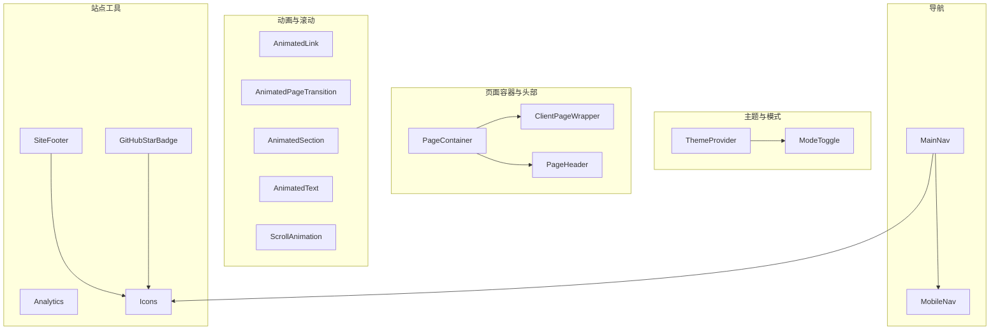
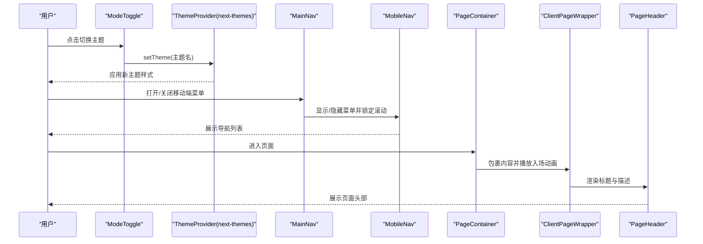
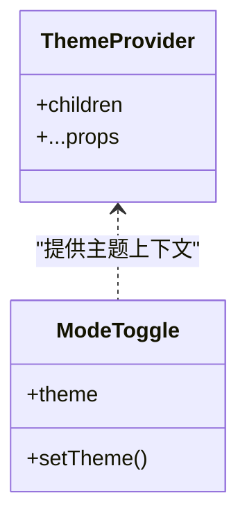
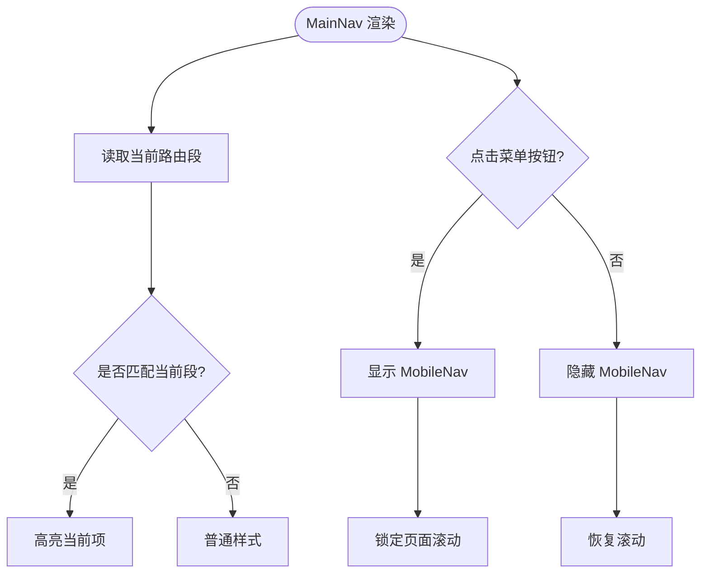
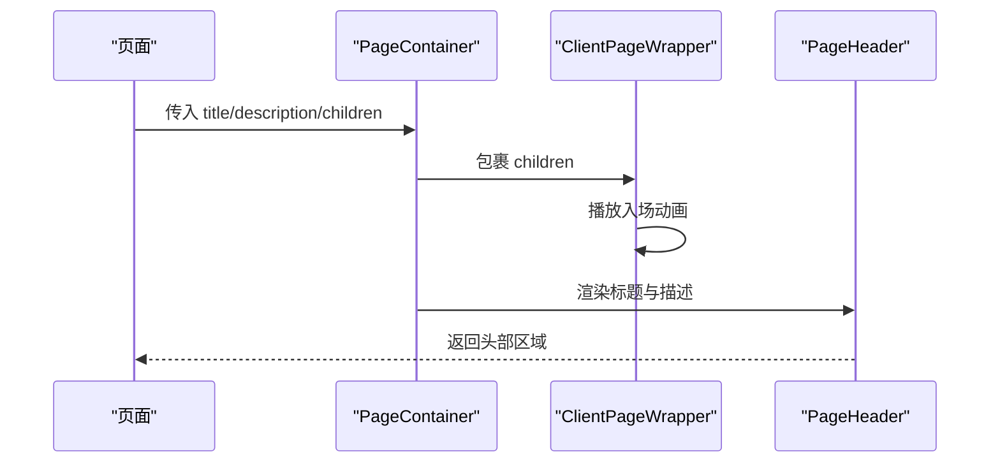
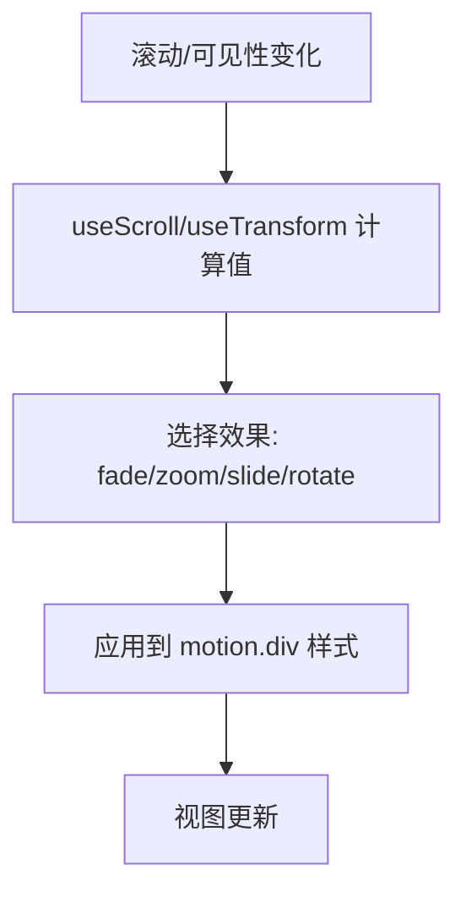
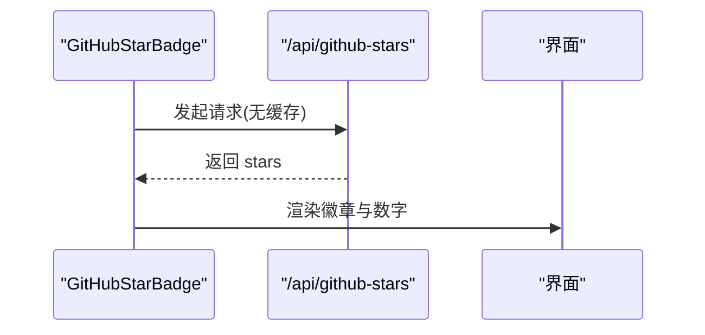
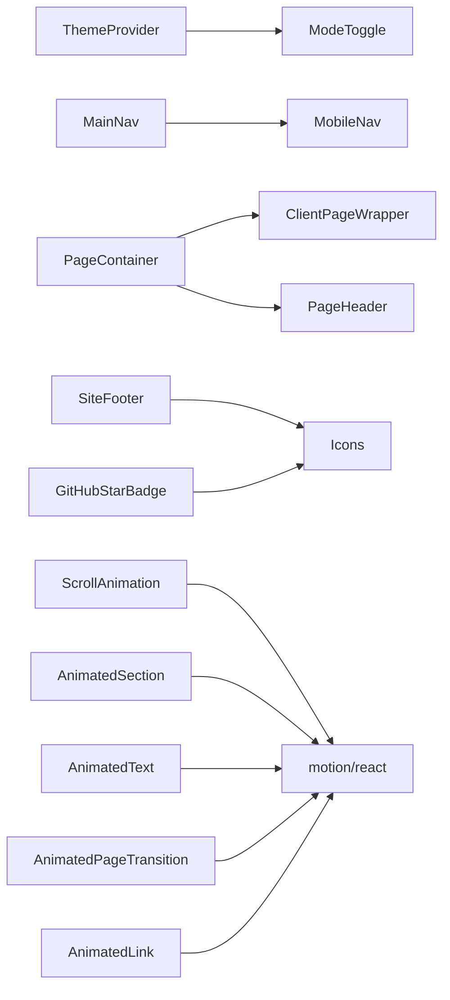

# 通用组件 (common)

<cite>
**本文引用的文件**
- [theme-provider.tsx](file://components/common/theme-provider.tsx)
- [main-nav.tsx](file://components/common/main-nav.tsx)
- [mobile-nav.tsx](file://components/common/mobile-nav.tsx)
- [site-footer.tsx](file://components/common/site-footer.tsx)
- [animated-link.tsx](file://components/common/animated-link.tsx)
- [animated-page-transition.tsx](file://components/common/animated-page-transition.tsx)
- [animated-section.tsx](file://components/common/animated-section.tsx)
- [animated-text.tsx](file://components/common/animated-text.tsx)
- [scroll-animation.tsx](file://components/common/scroll-animation.tsx)
- [mode-toggle.tsx](file://components/common/mode-toggle.tsx)
- [client-page-wrapper.tsx](file://components/common/client-page-wrapper.tsx)
- [page-container.tsx](file://components/common/page-container.tsx)
- [page-header.tsx](file://components/common/page-header.tsx)
- [analytics.tsx](file://components/common/analytics.tsx)
- [github-star-badge.tsx](file://components/common/github-star-badge.tsx)
- [icons.tsx](file://components/common/icons.tsx)
- [site.ts](file://config/site.ts)
- [layout.tsx](file://app/(root)/layout.tsx)
</cite>

## 更新摘要
**已进行的更改**
- 更新了 GitHubStarBadge 组件的标签文本从 'Template' 到 'Github'，更好地反映其实际功能
- 增强了组件的可访问性支持，提供更清晰的语义化标签
- 优化了用户界面文本的一致性

## 目录
1. [简介](#简介)
2. [项目结构](#项目结构)
3. [核心组件](#核心组件)
4. [架构总览](#架构总览)
5. [详细组件分析](#详细组件分析)
6. [依赖关系分析](#依赖关系分析)
7. [性能考量](#性能考量)
8. [故障排查指南](#故障排查指南)
9. [结论](#结论)
10. [附录：使用示例与扩展方法](#附录使用示例与扩展方法)

## 简介
本章节面向通用组件（common）的设计原则与复用策略，覆盖主题提供者、导航组件、页脚组件、动画组件等核心功能。文档将说明各组件的 props 接口、事件处理、状态管理、可访问性支持、响应式设计实现与性能优化技巧，并提供具体使用示例与自定义扩展方法，帮助读者快速集成与二次开发。

## 项目结构
common 目录下的组件围绕"主题切换""导航""页面容器与头部""动画与滚动效果""站点工具"五大职责组织，形成高内聚、低耦合的通用能力集合：
- 主题与模式：ThemeProvider、ModeToggle
- 导航：MainNav、MobileNav
- 页面容器与头部：PageContainer、ClientPageWrapper、PageHeader
- 动画与滚动：AnimatedLink、AnimatedPageTransition、AnimatedSection、AnimatedText、ScrollAnimation
- 站点工具：SiteFooter、Analytics、GitHubStarBadge、Icons



**图表来源**
- [theme-provider.tsx:1-8](file://components/common/theme-provider.tsx#L1-L8)
- [mode-toggle.tsx:1-71](file://components/common/mode-toggle.tsx#L1-L71)
- [main-nav.tsx:1-105](file://components/common/main-nav.tsx#L1-L105)
- [mobile-nav.tsx:1-55](file://components/common/mobile-nav.tsx#L1-L55)
- [page-container.tsx:1-27](file://components/common/page-container.tsx#L1-L27)
- [client-page-wrapper.tsx:1-37](file://components/common/client-page-wrapper.tsx#L1-L37)
- [page-header.tsx:1-21](file://components/common/page-header.tsx#L1-L21)
- [site-footer.tsx:1-34](file://components/common/site-footer.tsx#L1-L34)
- [analytics.tsx:1-8](file://components/common/analytics.tsx#L1-L8)
- [github-star-badge.tsx:1-63](file://components/common/github-star-badge.tsx#L1-L63)
- [icons.tsx:1-180](file://components/common/icons.tsx#L1-L180)

**章节来源**
- [theme-provider.tsx:1-8](file://components/common/theme-provider.tsx#L1-L8)
- [main-nav.tsx:1-105](file://components/common/main-nav.tsx#L1-L105)
- [mobile-nav.tsx:1-55](file://components/common/mobile-nav.tsx#L1-L55)
- [site-footer.tsx:1-34](file://components/common/site-footer.tsx#L1-L34)
- [animated-link.tsx:1-42](file://components/common/animated-link.tsx#L1-L42)
- [animated-page-transition.tsx:1-48](file://components/common/animated-page-transition.tsx#L1-L48)
- [animated-section.tsx:1-51](file://components/common/animated-section.tsx#L1-L51)
- [animated-text.tsx:1-49](file://components/common/animated-text.tsx#L1-L49)
- [scroll-animation.tsx:1-51](file://components/common/scroll-animation.tsx#L1-L51)
- [mode-toggle.tsx:1-71](file://components/common/mode-toggle.tsx#L1-L71)
- [client-page-wrapper.tsx:1-37](file://components/common/client-page-wrapper.tsx#L1-L37)
- [page-container.tsx:1-27](file://components/common/page-container.tsx#L1-L27)
- [page-header.tsx:1-21](file://components/common/page-header.tsx#L1-L21)
- [analytics.tsx:1-8](file://components/common/analytics.tsx#L1-L8)
- [github-star-badge.tsx:1-63](file://components/common/github-star-badge.tsx#L1-L63)
- [icons.tsx:1-180](file://components/common/icons.tsx#L1-L180)

## 核心组件
- 主题提供者 ThemeProvider：基于 next-themes 的轻量封装，提供全局主题上下文，配合 ModeToggle 实现多主题切换。
- 导航 MainNav/MobileNav：桌面端展示水平导航，移动端通过抽屉式菜单；根据路由段高亮当前项，支持禁用态与交互反馈。
- 页面容器 PageContainer/ClientPageWrapper/PageHeader：统一页面布局与标题区，包裹客户端动画过渡，保证首屏体验一致。
- 动画组件 AnimatedLink/AnimatedPageTransition/AnimatedSection/AnimatedText/ScrollAnimation：提供丰富的入场、悬停、滚动驱动动画，兼顾性能与可访问性。
- 站点工具 SiteFooter/Analytics/GitHubStarBadge/Icons：聚合社交链接、站点统计、徽章与图标资源，便于跨页面复用。

**章节来源**
- [theme-provider.tsx:1-8](file://components/common/theme-provider.tsx#L1-L8)
- [mode-toggle.tsx:1-71](file://components/common/mode-toggle.tsx#L1-L71)
- [main-nav.tsx:1-105](file://components/common/main-nav.tsx#L1-L105)
- [mobile-nav.tsx:1-55](file://components/common/mobile-nav.tsx#L1-L55)
- [page-container.tsx:1-27](file://components/common/page-container.tsx#L1-L27)
- [client-page-wrapper.tsx:1-37](file://components/common/client-page-wrapper.tsx#L1-L37)
- [page-header.tsx:1-21](file://components/common/page-header.tsx#L1-L21)
- [animated-link.tsx:1-42](file://components/common/animated-link.tsx#L1-L42)
- [animated-page-transition.tsx:1-48](file://components/common/animated-page-transition.tsx#L1-L48)
- [animated-section.tsx:1-51](file://components/common/animated-section.tsx#L1-L51)
- [animated-text.tsx:1-49](file://components/common/animated-text.tsx#L1-L49)
- [scroll-animation.tsx:1-51](file://components/common/scroll-animation.tsx#L1-L51)
- [site-footer.tsx:1-34](file://components/common/site-footer.tsx#L1-L34)
- [analytics.tsx:1-8](file://components/common/analytics.tsx#L1-L8)
- [github-star-badge.tsx:1-63](file://components/common/github-star-badge.tsx#L1-L63)
- [icons.tsx:1-180](file://components/common/icons.tsx#L1-L180)

## 架构总览
通用组件以"主题上下文 + 导航 + 页面容器 + 动画 + 工具"分层协作：
- 主题层：ThemeProvider 提供主题状态，ModeToggle 触发主题变更。
- 导航层：MainNav 负责桌面导航与移动端菜单开关，MobileNav 渲染移动端菜单并锁定滚动。
- 页面层：PageContainer 组合 ClientPageWrapper（客户端动画）与 PageHeader（标题与描述）。
- 动画层：Animated* 系列组件封装 motion/react 的常用动画模式，ScrollAnimation 提供滚动驱动的变换。
- 工具层：SiteFooter 聚合社交图标，Analytics 注入站点统计，GitHubStarBadge 拉取仓库星标数，Icons 集中图标资源。



**图表来源**
- [mode-toggle.tsx:1-71](file://components/common/mode-toggle.tsx#L1-L71)
- [theme-provider.tsx:1-8](file://components/common/theme-provider.tsx#L1-L8)
- [main-nav.tsx:1-105](file://components/common/main-nav.tsx#L1-L105)
- [mobile-nav.tsx:1-55](file://components/common/mobile-nav.tsx#L1-L55)
- [page-container.tsx:1-27](file://components/common/page-container.tsx#L1-L27)
- [client-page-wrapper.tsx:1-37](file://components/common/client-page-wrapper.tsx#L1-L37)
- [page-header.tsx:1-21](file://components/common/page-header.tsx#L1-L21)

## 详细组件分析

### 主题提供者与模式切换
- ThemeProvider：对 next-themes 的薄封装，透传 children 与属性，便于在应用根节点挂载。
- ModeToggle：基于 useTheme 获取当前主题并提供下拉菜单切换；支持多种预设主题与系统跟随；按钮包含无障碍标签。



**图表来源**
- [theme-provider.tsx:1-8](file://components/common/theme-provider.tsx#L1-L8)
- [mode-toggle.tsx:1-71](file://components/common/mode-toggle.tsx#L1-L71)

**章节来源**
- [theme-provider.tsx:1-8](file://components/common/theme-provider.tsx#L1-L8)
- [mode-toggle.tsx:1-71](file://components/common/mode-toggle.tsx#L1-L71)

### 导航组件（MainNav / MobileNav）
- MainNav：
  - 使用 Next.js 路由钩子判断当前段以高亮激活项。
  - 桌面端展示品牌与导航项，支持 hover/tap 动效。
  - 移动端通过按钮切换 MobileNav，并在切换时关闭菜单。
- MobileNav：
  - 全屏抽屉式菜单，锁定页面滚动，展示导航列表与可选子内容。
  - 使用字体与配置常量渲染品牌名称。



**图表来源**
- [main-nav.tsx:1-105](file://components/common/main-nav.tsx#L1-L105)
- [mobile-nav.tsx:1-55](file://components/common/mobile-nav.tsx#L1-L55)

**章节来源**
- [main-nav.tsx:1-105](file://components/common/main-nav.tsx#L1-L105)
- [mobile-nav.tsx:1-55](file://components/common/mobile-nav.tsx#L1-L55)

### 页面容器与头部（PageContainer / ClientPageWrapper / PageHeader）
- PageContainer：组合 ClientPageWrapper 与 PageHeader，统一页面内容与边距。
- ClientPageWrapper：为页面内容提供统一的入场动画。
- PageHeader：展示标题与描述，并添加分隔线。



**图表来源**
- [page-container.tsx:1-27](file://components/common/page-container.tsx#L1-L27)
- [client-page-wrapper.tsx:1-37](file://components/common/client-page-wrapper.tsx#L1-L37)
- [page-header.tsx:1-21](file://components/common/page-header.tsx#L1-L21)

**章节来源**
- [page-container.tsx:1-27](file://components/common/page-container.tsx#L1-L27)
- [client-page-wrapper.tsx:1-37](file://components/common/client-page-wrapper.tsx#L1-L37)
- [page-header.tsx:1-21](file://components/common/page-header.tsx#L1-L21)

### 动画组件（AnimatedLink / AnimatedPageTransition / AnimatedSection / AnimatedText / ScrollAnimation）
- AnimatedLink：为 Link 增加缩放与回弹的交互动画。
- AnimatedPageTransition：页面级淡入/滑出过渡。
- AnimatedSection：按方向与延迟进行视口内入场动画，仅触发一次。
- AnimatedText：文本元素的可配置动画，支持多种 HTML 标签。
- ScrollAnimation：基于滚动进度实现淡入、缩放、滑动、旋转等效果。



**图表来源**
- [scroll-animation.tsx:1-51](file://components/common/scroll-animation.tsx#L1-L51)
- [animated-section.tsx:1-51](file://components/common/animated-section.tsx#L1-L51)
- [animated-text.tsx:1-49](file://components/common/animated-text.tsx#L1-L49)
- [animated-page-transition.tsx:1-48](file://components/common/animated-page-transition.tsx#L1-L48)
- [animated-link.tsx:1-42](file://components/common/animated-link.tsx#L1-L42)

**章节来源**
- [animated-link.tsx:1-42](file://components/common/animated-link.tsx#L1-L42)
- [animated-page-transition.tsx:1-48](file://components/common/animated-page-transition.tsx#L1-L48)
- [animated-section.tsx:1-51](file://components/common/animated-section.tsx#L1-L51)
- [animated-text.tsx:1-49](file://components/common/animated-text.tsx#L1-L49)
- [scroll-animation.tsx:1-51](file://components/common/scroll-animation.tsx#L1-L51)

### 站点工具（SiteFooter / Analytics / GitHubStarBadge / Icons）
- SiteFooter：遍历社交链接配置，使用 Tooltip 与图标渲染外链按钮。
- Analytics：注入 Vercel Analytics 用于站点统计。
- GitHubStarBadge：异步请求后端 API 获取星标数，提供无障碍标签与格式化数字。**已更新** 标签文本从 'Template' 更新为 'Github'，更好地反映实际功能。
- Icons：集中图标资源，包括第三方库图标与自定义 SVG。



**图表来源**
- [github-star-badge.tsx:1-63](file://components/common/github-star-badge.tsx#L1-L63)
- [analytics.tsx:1-8](file://components/common/analytics.tsx#L1-L8)
- [site-footer.tsx:1-34](file://components/common/site-footer.tsx#L1-L34)
- [icons.tsx:1-180](file://components/common/icons.tsx#L1-L180)

**章节来源**
- [site-footer.tsx:1-34](file://components/common/site-footer.tsx#L1-L34)
- [analytics.tsx:1-8](file://components/common/analytics.tsx#L1-L8)
- [github-star-badge.tsx:1-63](file://components/common/github-star-badge.tsx#L1-L63)
- [icons.tsx:1-180](file://components/common/icons.tsx#L1-L180)

### GitHubStarBadge 组件详解
GitHubStarBadge 组件是一个专门用于展示 GitHub 仓库星标数的徽章组件，具有以下特性：

**功能特性**
- 异步获取 GitHub 仓库星标数，使用 no-store 缓存策略确保数据新鲜度
- 提供完整的无障碍支持，包含 aria-label 和屏幕阅读器友好文本
- 响应式设计，在不同屏幕尺寸下自适应显示
- 优雅的加载状态处理，避免布局抖动

**更新内容**
- **标签文本优化**：将显示文本从 'Template' 更新为 'Github'，更准确地反映组件功能
- **可访问性增强**：改进 aria-label 文本，提供更好的用户体验
- **视觉一致性**：保持与其他组件一致的样式风格

**使用示例**
```tsx
// 基础用法
<GitHubStarBadge />

// 自定义样式
<GitHubStarBadge className="w-full justify-center" />
```

**组件结构**
- 外层 Link 组件：指向模板仓库地址，支持新窗口打开
- GitHub 图标：使用自定义 SVG 图标
- 文本标签：显示 "Github" 文本
- 星标数量：动态显示或默认显示 "Star"
- 装饰性分隔符：使用点号分隔不同元素

**章节来源**
- [github-star-badge.tsx:14-62](file://components/common/github-star-badge.tsx#L14-L62)
- [site.ts:8-12](file://config/site.ts#L8-L12)
- [layout.tsx:1-33](file://app/(root)/layout.tsx#L1-L33)

## 依赖关系分析
- 主题与模式：ThemeProvider 依赖 next-themes；ModeToggle 依赖 useTheme 与 UI 组件。
- 导航：MainNav 依赖 Next.js 导航钩子与 MobileNav；MobileNav 依赖滚动锁定 Hook。
- 页面容器：PageContainer 依赖 ClientPageWrapper 与 PageHeader。
- 动画：所有动画组件依赖 motion/react；ScrollAnimation 额外使用 useScroll/useTransform。
- 工具：SiteFooter 依赖图标与 Tooltip；GitHubStarBadge 依赖 API 路由；Analytics 依赖 @vercel/analytics。



**图表来源**
- [theme-provider.tsx:1-8](file://components/common/theme-provider.tsx#L1-L8)
- [mode-toggle.tsx:1-71](file://components/common/mode-toggle.tsx#L1-L71)
- [main-nav.tsx:1-105](file://components/common/main-nav.tsx#L1-L105)
- [mobile-nav.tsx:1-55](file://components/common/mobile-nav.tsx#L1-L55)
- [page-container.tsx:1-27](file://components/common/page-container.tsx#L1-L27)
- [client-page-wrapper.tsx:1-37](file://components/common/client-page-wrapper.tsx#L1-L37)
- [page-header.tsx:1-21](file://components/common/page-header.tsx#L1-L21)
- [site-footer.tsx:1-34](file://components/common/site-footer.tsx#L1-L34)
- [github-star-badge.tsx:1-63](file://components/common/github-star-badge.tsx#L1-L63)
- [scroll-animation.tsx:1-51](file://components/common/scroll-animation.tsx#L1-L51)
- [animated-section.tsx:1-51](file://components/common/animated-section.tsx#L1-L51)
- [animated-text.tsx:1-49](file://components/common/animated-text.tsx#L1-L49)
- [animated-page-transition.tsx:1-48](file://components/common/animated-page-transition.tsx#L1-L48)
- [animated-link.tsx:1-42](file://components/common/animated-link.tsx#L1-L42)

**章节来源**
- [theme-provider.tsx:1-8](file://components/common/theme-provider.tsx#L1-L8)
- [mode-toggle.tsx:1-71](file://components/common/mode-toggle.tsx#L1-L71)
- [main-nav.tsx:1-105](file://components/common/main-nav.tsx#L1-L105)
- [mobile-nav.tsx:1-55](file://components/common/mobile-nav.tsx#L1-L55)
- [page-container.tsx:1-27](file://components/common/page-container.tsx#L1-L27)
- [client-page-wrapper.tsx:1-37](file://components/common/client-page-wrapper.tsx#L1-L37)
- [page-header.tsx:1-21](file://components/common/page-header.tsx#L1-L21)
- [site-footer.tsx:1-34](file://components/common/site-footer.tsx#L1-L34)
- [github-star-badge.tsx:1-63](file://components/common/github-star-badge.tsx#L1-L63)
- [scroll-animation.tsx:1-51](file://components/common/scroll-animation.tsx#L1-L51)
- [animated-section.tsx:1-51](file://components/common/animated-section.tsx#L1-L51)
- [animated-text.tsx:1-49](file://components/common/animated-text.tsx#L1-L49)
- [animated-page-transition.tsx:1-48](file://components/common/animated-page-transition.tsx#L1-L48)
- [animated-link.tsx:1-42](file://components/common/animated-link.tsx#L1-L42)

## 性能考量
- 动画性能：
  - 使用 motion/react 的 whileInView/viewport 限制触发范围，避免不必要的重绘。
  - 对滚动驱动动画使用 useTransform 将 JS 值映射到 CSS transform，减少布局抖动。
  - 页面级过渡使用 exit/initial 变体，确保平滑切换。
- 网络与数据：
  - GitHubStarBadge 使用 no-store 缓存策略，避免陈旧数据；失败时静默降级。
  - 图标集中管理，减少重复导入与渲染开销。
- 可访问性与交互：
  - 主题切换按钮包含 sr-only 文本，提升屏幕阅读器体验。
  - 导航项支持 disabled 态与键盘不可用样式，避免误操作。
  - **更新** GitHubStarBadge 组件改进了无障碍标签，提供更清晰的语义化文本。
- 响应式：
  - 通过条件类名与媒体查询断点控制不同设备上的布局与动画表现。
  - 移动端菜单锁定滚动，防止背景滚动干扰。

## 故障排查指南
- 主题切换无效：
  - 确认应用根节点已包裹 ThemeProvider。
  - 检查 ModeToggle 是否正确调用 setTheme。
- 导航高亮异常：
  - 确认路由段与 items.href 前缀一致。
  - 检查 useSelectedLayoutSegment 返回值是否符合预期。
- 移动端菜单无法关闭：
  - 检查 pathname 变化时是否重置菜单状态。
  - 确认滚动锁定 Hook 正确释放。
- 动画不触发：
  - 检查 viewport 设置与元素是否在可视区域内。
  - 确认 motion 版本与浏览器兼容性。
- 星标数不显示：
  - 检查 /api/github-stars 路由是否可用且返回格式正确。
  - 查看控制台是否有网络错误。
- **新增** GitHubStarBadge 文本显示问题：
  - 确认 siteConfig.links.templateRepo 配置正确。
  - 检查组件是否正确渲染 "Github" 文本而非 "Template"。

**章节来源**
- [theme-provider.tsx:1-8](file://components/common/theme-provider.tsx#L1-L8)
- [mode-toggle.tsx:1-71](file://components/common/mode-toggle.tsx#L1-L71)
- [main-nav.tsx:1-105](file://components/common/main-nav.tsx#L1-L105)
- [mobile-nav.tsx:1-55](file://components/common/mobile-nav.tsx#L1-L55)
- [scroll-animation.tsx:1-51](file://components/common/scroll-animation.tsx#L1-L51)
- [github-star-badge.tsx:1-63](file://components/common/github-star-badge.tsx#L1-L63)

## 结论
common 目录下的通用组件以清晰的分层与职责划分，提供了主题、导航、页面容器、动画与站点工具等关键能力。通过合理的 props 设计、事件处理、状态管理与可访问性支持，这些组件具备良好的复用性与可扩展性。结合响应式设计与性能优化策略，可在不同设备上提供一致的体验。建议在新页面或功能中优先复用这些组件，并通过扩展 props 与组合方式满足个性化需求。

**更新总结**：GitHubStarBadge 组件的标签文本已从 'Template' 更新为 'Github'，更好地反映了组件的实际功能，提升了用户体验和无障碍支持。

## 附录：使用示例与扩展方法
- 主题与模式
  - 在应用根节点包裹 ThemeProvider，并在任意位置使用 ModeToggle 切换主题。
  - 扩展：新增主题时，在 ModeToggle 中添加对应菜单项与图标。
- 导航
  - 在布局中使用 MainNav，传入 items 数组；移动端自动显示 MobileNav。
  - 扩展：为 items 添加 icon、disabled、target 等字段，增强交互。
- 页面容器
  - 使用 PageContainer 包裹页面内容，传入 title 与 description。
  - 扩展：在 PageHeader 中增加面包屑或操作按钮。
- 动画
  - 使用 AnimatedSection 包裹区块，设置 direction 与 delay。
  - 使用 ScrollAnimation 实现滚动驱动效果，选择 effect。
  - 使用 AnimatedText 为标题或段落添加入场动画。
  - 使用 AnimatedPageTransition 包裹页面内容以获得过渡效果。
  - 使用 AnimatedLink 替代 Link，获得悬停与点击反馈。
- 站点工具
  - 在页面底部加入 SiteFooter，自动渲染社交链接。
  - 在应用根节点加入 Analytics，启用站点统计。
  - **更新** 使用 GitHubStarBadge 展示 GitHub 仓库星标数，标签文本现已准确显示为 "Github"。
  - 通过 Icons 统一管理图标，保持风格一致。

**章节来源**
- [theme-provider.tsx:1-8](file://components/common/theme-provider.tsx#L1-L8)
- [mode-toggle.tsx:1-71](file://components/common/mode-toggle.tsx#L1-L71)
- [main-nav.tsx:1-105](file://components/common/main-nav.tsx#L1-L105)
- [mobile-nav.tsx:1-55](file://components/common/mobile-nav.tsx#L1-L55)
- [page-container.tsx:1-27](file://components/common/page-container.tsx#L1-L27)
- [page-header.tsx:1-21](file://components/common/page-header.tsx#L1-L21)
- [animated-section.tsx:1-51](file://components/common/animated-section.tsx#L1-L51)
- [scroll-animation.tsx:1-51](file://components/common/scroll-animation.tsx#L1-L51)
- [animated-text.tsx:1-49](file://components/common/animated-text.tsx#L1-L49)
- [animated-page-transition.tsx:1-48](file://components/common/animated-page-transition.tsx#L1-L48)
- [animated-link.tsx:1-42](file://components/common/animated-link.tsx#L1-L42)
- [site-footer.tsx:1-34](file://components/common/site-footer.tsx#L1-L34)
- [analytics.tsx:1-8](file://components/common/analytics.tsx#L1-L8)
- [github-star-badge.tsx:1-63](file://components/common/github-star-badge.tsx#L1-L63)
- [icons.tsx:1-180](file://components/common/icons.tsx#L1-L180)