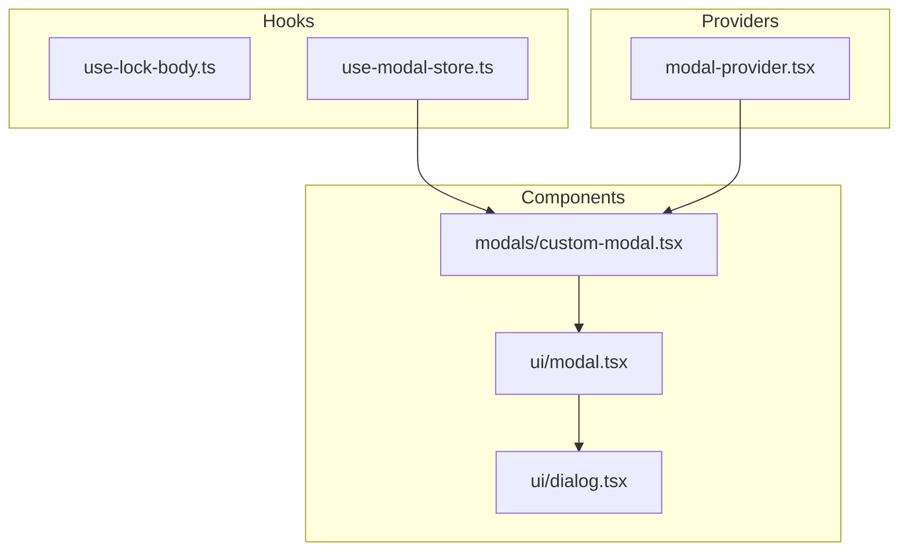
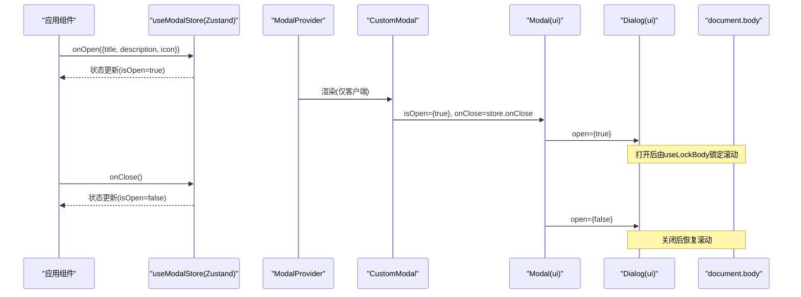
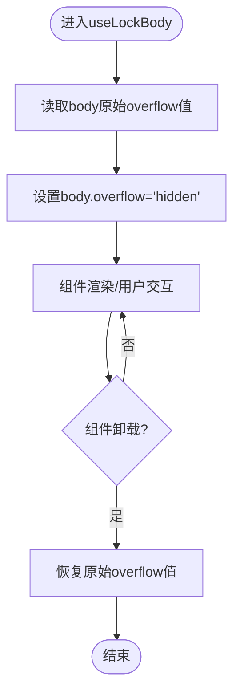
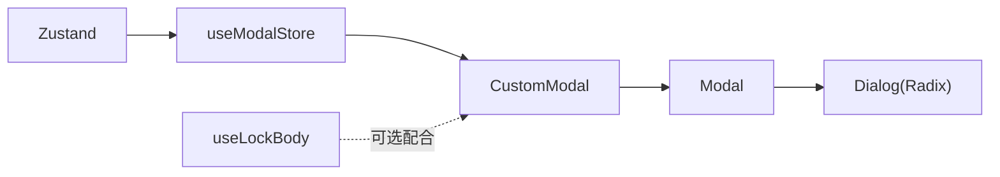

# 自定义Hooks目录结构

<cite>
**本文引用的文件**
- [use-lock-body.ts](file://hooks/use-lock-body.ts)
- [use-modal-store.ts](file://hooks/use-modal-store.ts)
- [modal.tsx](file://components/ui/modal.tsx)
- [custom-modal.tsx](file://components/modals/custom-modal.tsx)
- [dialog.tsx](file://components/ui/dialog.tsx)
- [modal-provider.tsx](file://providers/modal-provider.tsx)
</cite>

## 目录
1. [简介](#简介)
2. [项目结构](#项目结构)
3. [核心组件](#核心组件)
4. [架构总览](#架构总览)
5. [详细组件分析](#详细组件分析)
6. [依赖关系分析](#依赖关系分析)
7. [性能考量](#性能考量)
8. [故障排查指南](#故障排查指南)
9. [结论](#结论)
10. [附录：最佳实践与示例](#附录：最佳实践与示例)

## 简介
本文件聚焦于项目中“自定义Hooks”的目录结构与实现，重点解析以下两个Hook的设计原则、组织方式与使用场景：
- useLockBody：用于在模态框等场景中锁定页面滚动。
- useModalStore：基于Zustand的轻量全局状态管理，驱动模态框的打开/关闭与内容渲染。

文档同时涵盖命名规范、参数设计、返回值约定、组合使用、性能优化、测试策略以及实际使用示例与最佳实践。

## 项目结构
本项目采用按功能域划分的目录组织方式，其中与自定义Hooks相关的核心位置如下：
- hooks：存放可复用的自定义Hook（如滚动锁定、模态框状态）。
- components/ui：基础UI组件（如Dialog、Modal）。
- components/modals：业务级模态框封装（CustomModal）。
- providers：应用级Provider（如ModalProvider），负责挂载全局模态框实例。

图表来源
- [use-modal-store.ts:1-36](file://hooks/use-modal-store.ts#L1-L36)
- [custom-modal.tsx:1-30](file://components/modals/custom-modal.tsx#L1-L30)
- [modal.tsx:1-40](file://components/ui/modal.tsx#L1-L40)
- [dialog.tsx:1-121](file://components/ui/dialog.tsx#L1-L121)
- [modal-provider.tsx:1-24](file://providers/modal-provider.tsx#L1-L24)

章节来源
- [use-lock-body.ts:1-13](file://hooks/use-lock-body.ts#L1-L13)
- [use-modal-store.ts:1-36](file://hooks/use-modal-store.ts#L1-L36)
- [modal.tsx:1-40](file://components/ui/modal.tsx#L1-L40)
- [custom-modal.tsx:1-30](file://components/modals/custom-modal.tsx#L1-L30)
- [dialog.tsx:1-121](file://components/ui/dialog.tsx#L1-L121)
- [modal-provider.tsx:1-24](file://providers/modal-provider.tsx#L1-L24)

## 核心组件
- useLockBody：通过布局副作用在挂载时锁定body滚动，并在卸载时恢复原始样式，避免模态框出现时的背景滚动。
- useModalStore：基于Zustand创建全局模态框状态，包含是否打开、标题、描述、图标及打开/关闭方法。
- Modal（UI层）：基于Radix Dialog封装的可复用模态容器，负责受控显示与关闭回调。
- CustomModal（业务层）：消费useModalStore，将状态映射到UI层Modal，并渲染具体图标、标题与描述。
- ModalProvider：确保客户端挂载后再渲染CustomModal，避免服务端/客户端不一致问题。

章节来源
- [use-lock-body.ts:1-13](file://hooks/use-lock-body.ts#L1-L13)
- [use-modal-store.ts:1-36](file://hooks/use-modal-store.ts#L1-L36)
- [modal.tsx:1-40](file://components/ui/modal.tsx#L1-L40)
- [custom-modal.tsx:1-30](file://components/modals/custom-modal.tsx#L1-L30)
- [modal-provider.tsx:1-24](file://providers/modal-provider.tsx#L1-L24)

## 架构总览
下图展示了从触发打开到渲染模态框的完整调用链，以及滚动锁定的作用点。

图表来源
- [use-modal-store.ts:22-35](file://hooks/use-modal-store.ts#L22-L35)
- [custom-modal.tsx:6-29](file://components/modals/custom-modal.tsx#L6-L29)
- [modal.tsx:21-39](file://components/ui/modal.tsx#L21-L39)
- [dialog.tsx:9-55](file://components/ui/dialog.tsx#L9-L55)
- [use-lock-body.ts:4-11](file://hooks/use-lock-body.ts#L4-L11)
- [modal-provider.tsx:7-23](file://providers/modal-provider.tsx#L7-L23)

## 详细组件分析

### useLockBody：滚动锁定Hook
- 设计原则
  - 最小副作用：仅在挂载时修改body样式，卸载时恢复原值，避免内存泄漏或样式残留。
  - 无侵入式：不依赖任何外部库，直接操作DOM，保证通用性。
  - 时序正确：使用布局副作用，确保在浏览器绘制前完成样式变更，避免闪烁。
- 关键实现要点
  - 记录原始overflow值，以便恢复。
  - 设置body overflow为hidden以禁用滚动。
  - 清理函数恢复原始样式。
- 适用场景
  - 模态框、抽屉、全屏遮罩等需要阻止背景滚动的交互。
- 注意事项
  - 若多个地方同时使用，需考虑叠加锁；当前实现为简单覆盖，适合单点控制。
  - SSR环境下window/document不可用，应在客户端条件执行（例如在Provider中包裹或使用useEffect）。

章节来源
- [use-lock-body.ts:1-13](file://hooks/use-lock-body.ts#L1-L13)

### useModalStore：模态框状态管理Hook
- 设计原则
  - 单一数据源：集中管理isOpen、title、description、icon等状态。
  - 动作语义化：onOpen/onClose明确表达意图，便于追踪与测试。
  - 类型安全：使用TypeScript接口约束数据结构。
- 关键实现要点
  - 使用Zustand create创建store，返回读写方法与状态。
  - onOpen接收结构化数据，一次性设置所有字段。
  - onClose仅重置isOpen，保持其他字段不变（按需可扩展重置逻辑）。
- 适用场景
  - 全局弹窗提示、确认对话框、信息展示等跨组件共享的模态内容。
- 扩展建议
  - 可增加堆栈支持（多模态框）、动画状态、持久化等。

章节来源
- [use-modal-store.ts:1-36](file://hooks/use-modal-store.ts#L1-L36)

### Modal（UI层）与Dialog（基础层）
- 职责分离
  - Dialog提供底层无障碍与交互能力（基于Radix）。
  - Modal封装业务常用属性（title、description、children、isOpen、onClose）。
- 行为说明
  - 当open变为false时，调用onClose回调，交由上层状态管理。
  - 通过Portal渲染，避免层级与样式污染。

章节来源
- [dialog.tsx:1-121](file://components/ui/dialog.tsx#L1-L121)
- [modal.tsx:1-40](file://components/ui/modal.tsx#L1-L40)

### CustomModal（业务层）
- 职责
  - 订阅useModalStore的状态，并将状态映射到Modal的props。
  - 渲染图标、标题与描述，提供统一的视觉风格。
- 组合模式
  - 通过Provider挂载，确保只在客户端渲染，避免SSR/CSR差异。

章节来源
- [custom-modal.tsx:1-30](file://components/modals/custom-modal.tsx#L1-L30)
- [modal-provider.tsx:1-24](file://providers/modal-provider.tsx#L1-L24)

### 滚动锁定流程（算法流程图）

图表来源
- [use-lock-body.ts:4-11](file://hooks/use-lock-body.ts#L4-L11)

## 依赖关系分析
- useModalStore依赖Zustand进行状态管理。
- CustomModal依赖useModalStore与Modal。
- Modal依赖Dialog（Radix封装）。
- ModalProvider确保CustomModal在客户端渲染。
- useLockBody独立存在，可在任意需要锁定滚动的组件中使用。

图表来源
- [use-modal-store.ts:1-36](file://hooks/use-modal-store.ts#L1-L36)
- [custom-modal.tsx:1-30](file://components/modals/custom-modal.tsx#L1-L30)
- [modal.tsx:1-40](file://components/ui/modal.tsx#L1-L40)
- [dialog.tsx:1-121](file://components/ui/dialog.tsx#L1-L121)

章节来源
- [use-modal-store.ts:1-36](file://hooks/use-modal-store.ts#L1-L36)
- [custom-modal.tsx:1-30](file://components/modals/custom-modal.tsx#L1-L30)
- [modal.tsx:1-40](file://components/ui/modal.tsx#L1-L40)
- [dialog.tsx:1-121](file://components/ui/dialog.tsx#L1-L121)

## 性能考量
- 使用useLayoutEffect：在useLockBody中避免首次渲染闪烁，确保样式在绘制前生效。
- 客户端渲染保护：ModalProvider通过isMounted判断，避免SSR/CSR不一致导致的警告与重渲染。
- 状态粒度：useModalStore将相关状态聚合，减少跨组件传递成本；可按需拆分以避免不必要重渲染。
- 事件处理：Modal内部对close事件进行节流式处理（仅变化为false时触发），降低无效回调。
- 建议
  - 对频繁触发的onOpen/onClose可进行防抖/节流（视业务而定）。
  - 大型图标或复杂内容可懒加载，减少首屏开销。

[本节为通用性能指导，不直接分析具体代码文件]

## 故障排查指南
- 模态框打开后仍可滚动
  - 检查是否在模态框所在组件中调用了useLockBody。
  - 确认ModalProvider已正确包裹且处于客户端环境。
  - 检查是否存在多层Dialog导致焦点/滚动冲突。
- 服务端报错或hydration错误
  - 确认涉及DOM的操作均在客户端执行（如useLockBody、ModalProvider中的isMounted）。
- 状态不同步
  - 确认onOpen传入的数据结构符合ModalDataProps定义。
  - 检查是否有其他地方覆盖了store状态。
- 样式异常
  - 检查Tailwind/shadcn主题变量是否正确配置。
  - 确认Dialog的z-index与父容器层级未发生遮挡。

章节来源
- [use-lock-body.ts:4-11](file://hooks/use-lock-body.ts#L4-L11)
- [modal-provider.tsx:7-23](file://providers/modal-provider.tsx#L7-L23)
- [modal.tsx:21-39](file://components/ui/modal.tsx#L21-L39)
- [use-modal-store.ts:22-35](file://hooks/use-modal-store.ts#L22-L35)

## 结论
本项目通过清晰的目录划分与职责分离，实现了可复用的滚动锁定Hook与轻量级全局模态框状态管理。useLockBody保证了交互体验的一致性，useModalStore提供了简洁的状态模型，配合UI层的Modal与Dialog，形成稳定、易扩展的模态框体系。遵循本文的命名规范、参数设计与性能优化建议，可在更大规模项目中保持一致性与可维护性。

[本节为总结性内容，不直接分析具体代码文件]

## 附录：最佳实践与示例

### 自定义Hooks命名规范
- 统一以use开头，动词+名词形式，清晰表达用途（如useLockBody、useModalStore）。
- 避免在Hook内做UI渲染，专注逻辑与副作用。
- 对外暴露的API尽量小且语义化（如onOpen/onClose）。

章节来源
- [use-lock-body.ts:4-11](file://hooks/use-lock-body.ts#L4-L11)
- [use-modal-store.ts:22-35](file://hooks/use-modal-store.ts#L22-L35)

### 参数设计与返回值约定
- 参数
  - onOpen(data)：集中传入标题、描述、图标等，避免分散传参。
  - onClose()：无参，语义明确。
- 返回值
  - 状态：isOpen、title、description、icon。
  - 动作：onOpen、onClose。
- 类型
  - 使用接口约束数据结构，提升可维护性与IDE提示。

章节来源
- [use-modal-store.ts:3-20](file://hooks/use-modal-store.ts#L3-L20)
- [use-modal-store.ts:22-35](file://hooks/use-modal-store.ts#L22-L35)

### Hooks的组合使用
- 在业务组件中调用onOpen打开模态框，并在需要时调用onClose关闭。
- 在模态框组件中结合useLockBody锁定滚动，确保用户体验一致。
- 通过ModalProvider统一挂载CustomModal，避免重复实例。

章节来源
- [custom-modal.tsx:6-29](file://components/modals/custom-modal.tsx#L6-L29)
- [modal-provider.tsx:7-23](file://providers/modal-provider.tsx#L7-L23)
- [use-lock-body.ts:4-11](file://hooks/use-lock-body.ts#L4-L11)

### 性能优化建议
- 将ModalProvider置于应用顶层，减少重复渲染。
- 对复杂图标或大内容使用懒加载或虚拟列表。
- 避免在高频事件中创建新对象，必要时缓存引用。

[本节为通用优化指导，不直接分析具体代码文件]

### 测试策略
- 单元测试
  - 验证onOpen能正确设置isOpen、title、description、icon。
  - 验证onClose能将isOpen置为false。
  - 验证useLockBody在挂载时设置overflow，卸载时恢复。
- 集成测试
  - 模拟用户点击触发onOpen，检查Modal是否显示。
  - 检查关闭按钮或遮罩点击是否能触发onClose。
- 工具建议
  - 使用React Testing Library进行组件测试。
  - 使用Zustand测试工具验证store状态变化。

[本节为通用测试指导，不直接分析具体代码文件]

### 实际使用示例（步骤指引）
- 打开模态框
  - 在任意组件中调用useModalStore的onOpen，传入{ title, description, icon }。
  - 确保ModalProvider已在应用根节点附近挂载。
- 关闭模态框
  - 调用useModalStore的onClose，或在Modal内部触发关闭事件。
- 锁定滚动
  - 在需要锁定滚动的组件中调用useLockBody，或在模态框组件中组合使用。

章节来源
- [use-modal-store.ts:22-35](file://hooks/use-modal-store.ts#L22-L35)
- [custom-modal.tsx:6-29](file://components/modals/custom-modal.tsx#L6-L29)
- [modal-provider.tsx:7-23](file://providers/modal-provider.tsx#L7-L23)
- [use-lock-body.ts:4-11](file://hooks/use-lock-body.ts#L4-L11)