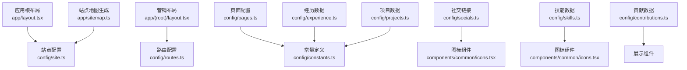
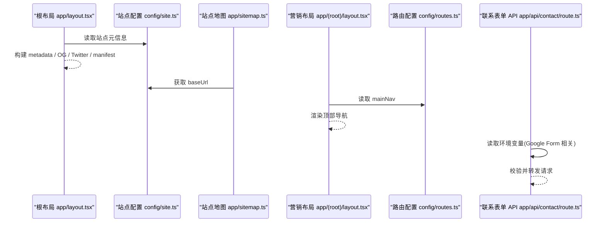
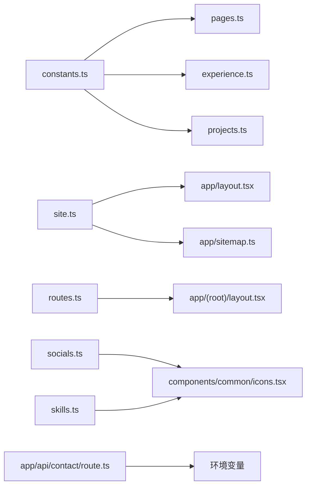

# 配置目录结构

<cite>
**本文引用的文件**
- [site.ts](file://config/site.ts)
- [routes.ts](file://config/routes.ts)
- [constants.ts](file://config/constants.ts)
- [pages.ts](file://config/pages.ts)
- [socials.ts](file://config/socials.ts)
- [experience.ts](file://config/experience.ts)
- [projects.ts](file://config/projects.ts)
- [skills.ts](file://config/skills.ts)
- [contributions.ts](file://config/contributions.ts)
- [layout.tsx](file://app/layout.tsx)
- [(root)/layout.tsx](file://app/(root)/layout.tsx)
- [sitemap.ts](file://app/sitemap.ts)
- [route.ts](file://app/api/contact/route.ts)
- [next.config.js](file://next.config.js)
</cite>

## 目录
1. [简介](#简介)
2. [项目结构](#项目结构)
3. [核心组件](#核心组件)
4. [架构总览](#架构总览)
5. [详细组件分析](#详细组件分析)
6. [依赖关系分析](#依赖关系分析)
7. [性能与可维护性](#性能与可维护性)
8. [故障排查指南](#故障排查指南)
9. [结论](#结论)
10. [附录：扩展与迁移最佳实践](#附录：扩展与迁移最佳实践)

## 简介
本文件聚焦 config 目录的配置体系，系统化说明站点、路由、常量、页面等配置的职责边界与组织原则；并给出环境变量管理、配置验证机制、热重载策略、类型安全以及配置迁移的最佳实践。通过图示与分步流程，帮助读者快速理解如何扩展配置项、新增站点信息、集成第三方服务。

## 项目结构
config 目录采用“按领域拆分 + 类型约束”的组织方式：
- site.ts：站点元信息与品牌资源（名称、描述、图标、社交链接、SEO 关键词等）
- routes.ts：主导航与路由菜单数据
- constants.ts：全局枚举与联合类型（技能、分类、经验类型、页面键名等）
- pages.ts：各页面的标题、描述与 SEO 元信息
- socials.ts：社交账号列表（名称、用户名、图标、链接）
- experience.ts：工作经历数据模型与条目
- projects.ts：项目数据模型与条目（含精选集合）
- skills.ts：技能列表、评分与精选集合
- contributions.ts：开源贡献记录与精选集合

图表来源
- [layout.tsx:30-97](file://app/layout.tsx#L30-L97)
- [(root)/layout.tsx:11-26](file://app/(root)/layout.tsx#L11-L26)
- [sitemap.ts:6-71](file://app/sitemap.ts#L6-L71)
- [pages.ts:1-86](file://config/pages.ts#L1-L86)
- [constants.ts:1-85](file://config/constants.ts#L1-L85)
- [socials.ts:1-36](file://config/socials.ts#L1-L36)
- [experience.ts:1-93](file://config/experience.ts#L1-L93)
- [projects.ts:1-596](file://config/projects.ts#L1-L596)
- [skills.ts:1-166](file://config/skills.ts#L1-L166)

章节来源
- [site.ts:1-41](file://config/site.ts#L1-L41)
- [routes.ts:1-29](file://config/routes.ts#L1-L29)
- [constants.ts:1-85](file://config/constants.ts#L1-L85)
- [pages.ts:1-86](file://config/pages.ts#L1-L86)
- [socials.ts:1-36](file://config/socials.ts#L1-L36)
- [experience.ts:1-93](file://config/experience.ts#L1-L93)
- [projects.ts:1-596](file://config/projects.ts#L1-L596)
- [skills.ts:1-166](file://config/skills.ts#L1-L166)
- [contributions.ts:1-48](file://config/contributions.ts#L1-L48)
- [layout.tsx:30-97](file://app/layout.tsx#L30-L97)
- [(root)/layout.tsx:11-26](file://app/(root)/layout.tsx#L11-L26)
- [sitemap.ts:6-71](file://app/sitemap.ts#L6-L71)

## 核心组件
- 站点配置 siteConfig：集中管理站点名称、作者、URL、社交链接、OG 图片、图标、SEO 关键词等，被根布局用于构建 metadata、Open Graph、Twitter Card、manifest、canonical、robots 等。
- 路由配置 routesConfig：提供主导航菜单项（标题与路径），被营销布局渲染为顶部导航。
- 常量定义 constants.ts：以 TypeScript 联合类型定义 ValidSkills、ValidCategory、ValidExpType、ValidPages，确保跨模块数据一致性。
- 页面配置 pagesConfig：为每个页面提供 title、description、metadata.title/description，便于统一 SEO 与页面文案。
- 社交链接 SocialLinks：声明式社交账号数组，包含名称、用户名、图标引用与外链。
- 经历/项目/技能/贡献数据：结构化数据模型与条目数组，支持排序与精选切片。

章节来源
- [site.ts:1-41](file://config/site.ts#L1-L41)
- [routes.ts:1-29](file://config/routes.ts#L1-L29)
- [constants.ts:1-85](file://config/constants.ts#L1-L85)
- [pages.ts:1-86](file://config/pages.ts#L1-L86)
- [socials.ts:1-36](file://config/socials.ts#L1-L36)
- [experience.ts:1-93](file://config/experience.ts#L1-L93)
- [projects.ts:1-596](file://config/projects.ts#L1-L596)
- [skills.ts:1-166](file://config/skills.ts#L1-L166)
- [contributions.ts:1-48](file://config/contributions.ts#L1-L48)

## 架构总览
配置层位于业务组件之上，作为“单一事实源”向 UI 层输出数据。根布局将站点配置注入到 Next.js metadata；营销布局读取路由配置渲染导航；站点地图生成器使用站点 URL 与博客元数据生成 sitemap；API 路由通过环境变量对接外部表单服务。

图表来源
- [layout.tsx:30-97](file://app/layout.tsx#L30-L97)
- [sitemap.ts:6-71](file://app/sitemap.ts#L6-L71)
- [(root)/layout.tsx:11-26](file://app/(root)/layout.tsx#L11-L26)
- [routes.ts:1-29](file://config/routes.ts#L1-L29)
- [route.ts:3-29](file://app/api/contact/route.ts#L3-L29)

## 详细组件分析

### 站点配置 site.ts
- 职责：集中站点品牌与 SEO 资产（名称、描述、URL、社交链接、OG 图片、图标、关键词）。
- 使用点：
  - 根布局 metadata：title、description、keywords、authors、openGraph、twitter、icons、manifest、alternates、robots、verification。
  - 站点地图：baseUrl。
- 类型安全：对象字面量导出，字段由使用者在布局中强类型消费。
- 扩展建议：如需多语言站点，可在 siteConfig 下增加 locales 或 i18n 映射；如需多域名，可增加 domains 数组并在运行时选择。

章节来源
- [site.ts:1-41](file://config/site.ts#L1-L41)
- [layout.tsx:30-97](file://app/layout.tsx#L30-L97)
- [sitemap.ts:6-71](file://app/sitemap.ts#L6-L71)

### 路由配置 routes.ts
- 职责：定义主导航菜单项（标题与 href）。
- 使用点：营销布局 MainNav 渲染顶部导航。
- 类型安全：当前为 any 类型，建议改为严格接口（如 { title: string; href: string }[]），避免误用。
- 扩展建议：支持嵌套路由、权限控制（role）、动态菜单（根据登录态切换）。

章节来源
- [routes.ts:1-29](file://config/routes.ts#L1-L29)
- [(root)/layout.tsx:11-26](file://app/(root)/layout.tsx#L11-L26)

### 常量定义 constants.ts
- 职责：以联合类型定义 ValidSkills、ValidCategory、ValidExpType、ValidPages，保证跨模块数据一致。
- 使用点：
  - experience.ts 的 skills 字段类型为 ValidSkills[]。
  - projects.ts 的 category 与 type 使用 ValidCategory、ValidExpType。
  - pages.ts 的 key 受 ValidPages 约束。
- 类型安全：联合类型在编译期即可拦截非法值。
- 扩展建议：新增技能/分类时，务必同步更新联合类型，否则 TS 会报错提示。

章节来源
- [constants.ts:1-85](file://config/constants.ts#L1-L85)
- [experience.ts:1-93](file://config/experience.ts#L1-L93)
- [projects.ts:1-596](file://config/projects.ts#L1-L596)
- [pages.ts:1-86](file://config/pages.ts#L1-L86)

### 页面配置 pages.ts
- 职责：为每个页面提供 title、description、metadata.title/description。
- 类型安全：通过 ValidPages 索引类型限制键名，新增页面需同时添加键与内容。
- 使用点：可用于页面级 SEO、面包屑、文档化页面清单。
- 扩展建议：可扩展 featuredDescription、lang、i18n 文本等。

章节来源
- [pages.ts:1-86](file://config/pages.ts#L1-L86)
- [constants.ts:76-85](file://config/constants.ts#L76-L85)

### 社交链接 socials.ts
- 职责：声明式社交账号列表，包含 name、username、icon、link。
- 使用点：用于页脚或侧边栏展示社交入口。
- 类型安全：SocialInterface 约束字段；图标来自组件库 Icons。
- 扩展建议：支持平台优先级排序、是否可见开关、多账号聚合。

章节来源
- [socials.ts:1-36](file://config/socials.ts#L1-L36)

### 经历数据 experience.ts
- 职责：工作经历的数据模型与条目数组。
- 类型安全：ExperienceInterface 约束 id、position、company、location、日期、描述、成就、技能、公司链接与 Logo。
- 使用点：时间线/卡片展示。
- 扩展建议：支持多语言描述、远程/现场标签、技能权重。

章节来源
- [experience.ts:1-93](file://config/experience.ts#L1-L93)
- [constants.ts:1-63](file://config/constants.ts#L1-L63)

### 项目数据 projects.ts
- 职责：项目数据模型与条目数组，并提供 featuredProjects 精选集合。
- 类型安全：ProjectInterface 约束 id、type、category、shortDescription、网站/GitHub 链接、技术栈、起止时间、Logo、描述详情、页面信息数组。
- 使用点：项目列表、详情页、精选展示。
- 扩展建议：支持状态（进行中/已归档）、发布渠道、指标（stars、downloads）。

章节来源
- [projects.ts:1-596](file://config/projects.ts#L1-L596)
- [constants.ts:65-74](file://config/constants.ts#L65-L74)

### 技能数据 skills.ts
- 职责：技能列表、评分与精选集合。
- 类型安全：skillsInterface 约束 name、description、rating、icon。
- 使用点：技能展示、排序、精选。
- 扩展建议：支持等级语义（入门/熟练/专家）、学习进度、关联课程。

章节来源
- [skills.ts:1-166](file://config/skills.ts#L1-L166)

### 贡献数据 contributions.ts
- 职责：开源贡献记录与精选集合。
- 类型安全：contributionsInterface 约束 repo、描述、仓库所有者、链接。
- 使用点：贡献墙、影响力展示。
- 扩展建议：支持 PR/Merge 状态、影响范围、评审者。

章节来源
- [contributions.ts:1-48](file://config/contributions.ts#L1-L48)

## 依赖关系分析
- 类型耦合：constants.ts 被 pages.ts、experience.ts、projects.ts 广泛引用，是类型契约的核心。
- 运行时耦合：
  - layout.tsx 依赖 site.ts 构建 metadata。
  - (root)/layout.tsx 依赖 routes.ts 渲染导航。
  - sitemap.ts 依赖 site.ts 的 baseUrl。
  - api/contact/route.ts 依赖环境变量（Google Form 相关）。
- 外部依赖：
  - 图标组件 icons.tsx 被 socials.ts、skills.ts 引用。
  - Next.js 内置能力（metadata、sitemap、script）被根布局与站点地图使用。

图表来源
- [constants.ts:1-85](file://config/constants.ts#L1-L85)
- [pages.ts:1-86](file://config/pages.ts#L1-L86)
- [experience.ts:1-93](file://config/experience.ts#L1-L93)
- [projects.ts:1-596](file://config/projects.ts#L1-L596)
- [site.ts:1-41](file://config/site.ts#L1-L41)
- [layout.tsx:30-97](file://app/layout.tsx#L30-L97)
- [sitemap.ts:6-71](file://app/sitemap.ts#L6-L71)
- [routes.ts:1-29](file://config/routes.ts#L1-L29)
- [(root)/layout.tsx:11-26](file://app/(root)/layout.tsx#L11-L26)
- [socials.ts:1-36](file://config/socials.ts#L1-L36)
- [skills.ts:1-166](file://config/skills.ts#L1-L166)
- [route.ts:3-29](file://app/api/contact/route.ts#L3-L29)

章节来源
- [constants.ts:1-85](file://config/constants.ts#L1-L85)
- [site.ts:1-41](file://config/site.ts#L1-L41)
- [routes.ts:1-29](file://config/routes.ts#L1-L29)
- [pages.ts:1-86](file://config/pages.ts#L1-L86)
- [socials.ts:1-36](file://config/socials.ts#L1-L36)
- [experience.ts:1-93](file://config/experience.ts#L1-L93)
- [projects.ts:1-596](file://config/projects.ts#L1-L596)
- [skills.ts:1-166](file://config/skills.ts#L1-L166)
- [contributions.ts:1-48](file://config/contributions.ts#L1-L48)
- [layout.tsx:30-97](file://app/layout.tsx#L30-L97)
- [(root)/layout.tsx:11-26](file://app/(root)/layout.tsx#L11-L26)
- [sitemap.ts:6-71](file://app/sitemap.ts#L6-L71)
- [route.ts:3-29](file://app/api/contact/route.ts#L3-L29)

## 性能与可维护性
- 构建期优化：配置均为静态导出，Next.js 可在构建期内联，减少运行时开销。
- 类型安全：通过联合类型与接口约束，降低运行时错误概率，提升重构安全性。
- 数据分层：将内容与展示分离，UI 仅消费配置，便于独立迭代。
- 可测试性：配置对象可单独断言（字段完整性、必填项、枚举值）。
- 可维护性：新增页面/技能/项目只需修改对应配置文件，无需改动组件逻辑。

[本节为通用指导，不直接分析具体文件]

## 故障排查指南
- 根布局缺少 Google Analytics ID：会在启动时报错，需在环境变量中设置 NEXT_PUBLIC_GOOGLE_MEASUREMENT_ID。
- 联系表单 API 未配置环境变量：当 GOOGLE_FORM_LINK 缺失时返回 500；需补充 GOOGLE_FORM_FIELD_ID_* 系列变量。
- 路由配置类型宽松：当前 routesConfig 为 any，建议在后续版本中引入严格类型以避免拼写错误。
- 站点地图 baseUrl 不一致：请确保 siteConfig.url 与实际部署域名一致。

章节来源
- [layout.tsx:100-103](file://app/layout.tsx#L100-L103)
- [route.ts:3-29](file://app/api/contact/route.ts#L3-L29)
- [routes.ts:1-29](file://config/routes.ts#L1-L29)
- [sitemap.ts:6-71](file://app/sitemap.ts#L6-L71)

## 结论
config 目录通过“类型驱动 + 数据集中”的方式，实现了站点元信息、路由、页面、内容数据的清晰治理。配合 Next.js 的 metadata、sitemap、script 等能力，形成从 SEO、导航到内容展示的完整链路。遵循本文的扩展与迁移建议，可在保持类型安全的前提下持续演进配置体系。

[本节为总结性内容，不直接分析具体文件]

## 附录：扩展与迁移最佳实践

### 扩展配置项
- 新增站点信息：在 site.ts 中添加字段，并在 layout.tsx 的 metadata 中消费；若涉及多语言，可在 siteConfig 下增加 locale 映射。
- 新增页面：在 constants.ts 的 ValidPages 中添加新键，在 pages.ts 中补齐 title、description、metadata；必要时在 sitemap.ts 中注册。
- 新增技能/分类：在 constants.ts 的联合类型中追加值，随后在 skills.ts 或项目中引用。
- 新增社交账号：在 socials.ts 中追加条目，确保 icon 来自统一的图标库。

章节来源
- [site.ts:1-41](file://config/site.ts#L1-L41)
- [layout.tsx:30-97](file://app/layout.tsx#L30-L97)
- [constants.ts:1-85](file://config/constants.ts#L1-L85)
- [pages.ts:1-86](file://config/pages.ts#L1-L86)
- [sitemap.ts:6-71](file://app/sitemap.ts#L6-L71)
- [socials.ts:1-36](file://config/socials.ts#L1-L36)

### 环境变量管理
- 用途：敏感或环境相关配置（如 Google Analytics、Google Form 字段）通过 process.env 注入。
- 最佳实践：
  - 区分 NEXT_PUBLIC_ 与非公开变量，避免泄露。
  - 在 API 路由中对必需变量进行存在性检查并返回明确错误。
  - 在根布局中对关键变量（如 GA_ID）做启动期校验。

章节来源
- [layout.tsx:100-103](file://app/layout.tsx#L100-L103)
- [route.ts:3-29](file://app/api/contact/route.ts#L3-L29)

### 配置验证机制
- 编译期验证：利用 TypeScript 联合类型与接口约束，确保字段与取值合法。
- 运行期验证：对关键环境变量进行存在性与格式校验（如邮箱、URL、ID）。
- 建议：引入轻量校验库（如 zod）对复杂配置对象进行运行时校验，结合 CI 中的类型检查。

章节来源
- [constants.ts:1-85](file://config/constants.ts#L1-L85)
- [route.ts:3-29](file://app/api/contact/route.ts#L3-L29)

### 配置热重载
- 开发体验：Next.js 开发服务器支持代码变更热重载；修改 config 下的导出对象后，依赖该配置的页面/布局会自动刷新。
- 注意事项：环境变量变更需要重启开发服务器；生产环境通过重新部署生效。

[本节为通用指导，不直接分析具体文件]

### 类型安全
- 统一类型来源：将枚举与键名集中在 constants.ts，所有模块引用同一来源。
- 严格模式：启用 TypeScript strict 模式，避免隐式 any。
- 渐进增强：逐步收紧现有 any 类型（如 routesConfig），提升类型覆盖率。

章节来源
- [constants.ts:1-85](file://config/constants.ts#L1-L85)
- [routes.ts:1-29](file://config/routes.ts#L1-L29)

### 配置迁移
- 增量迁移：保留旧字段兼容一段时间，逐步废弃；通过别名或适配器映射旧到新。
- 回滚策略：配置变更应可回滚（Git 提交粒度），必要时提供降级默认值。
- 文档化：在 README 或内部 Wiki 中记录配置项含义、示例与迁移步骤。

[本节为通用指导，不直接分析具体文件]

### 第三方服务集成
- 联系表单：在 app/api/contact/route.ts 中通过环境变量接入 Google Form；确保字段 ID 与环境变量一致。
- 站点地图：在 sitemap.ts 中使用 siteConfig.url 作为 baseUrl，并动态加入博客条目。
- 分析统计：在根布局中注入 Google Analytics，并通过环境变量控制 ID。

章节来源
- [route.ts:3-29](file://app/api/contact/route.ts#L3-L29)
- [sitemap.ts:6-71](file://app/sitemap.ts#L6-L71)
- [layout.tsx:100-103](file://app/layout.tsx#L100-L103)