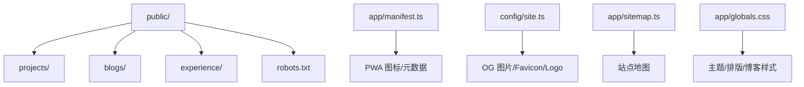
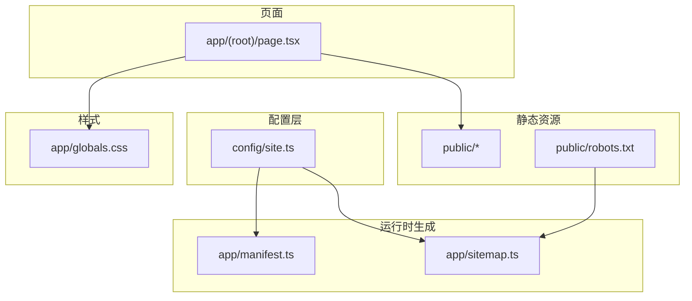
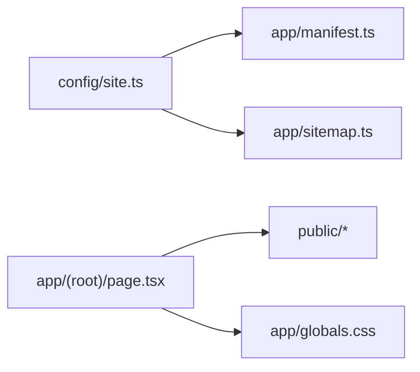

# 静态资源目录结构

<cite>
**本文引用的文件**
- [next.config.js](file://next.config.js)
- [app/manifest.ts](file://app/manifest.ts)
- [app/sitemap.ts](file://app/sitemap.ts)
- [config/site.ts](file://config/site.ts)
- [app/globals.css](file://app/globals.css)
- [app/(root)/page.tsx](file://app/(root)/page.tsx)
</cite>

## 目录
1. [简介](#简介)
2. [项目结构](#项目结构)
3. [核心组件](#核心组件)
4. [架构总览](#架构总览)
5. [详细组件分析](#详细组件分析)
6. [依赖关系分析](#依赖关系分析)
7. [性能考虑](#性能考虑)
8. [故障排查指南](#故障排查指南)
9. [结论](#结论)
10. [附录](#附录)

## 简介
本文件面向维护者与开发者，系统化说明 Next.js 项目中 public 目录的静态资源组织原则与管理策略，覆盖图片、字体、PDF、SEO 相关文件的存放规范；并给出资源优化、CDN 集成、缓存策略、加载性能优化（含懒加载）、压缩与转换的最佳实践，以及资源管理与维护的工作流程。

## 项目结构
- 根级 public 目录用于存放浏览器可直接访问的静态资源：
  - public/projects：按项目维度分目录存放项目截图、演示图等
  - public/blogs：博客文章配图或附件
  - public/experience：经历相关图片
  - public/robots.txt：搜索引擎爬虫规则
- assets/fonts：预留字体目录（当前为空），建议将自定义字体放入此处并通过 CSS 引入
- app/manifest.ts：定义 PWA 清单，包含站点名称、主题色、图标等
- app/sitemap.ts：动态生成站点地图，包含各页面 URL、修改时间、优先级等
- config/site.ts：集中站点元信息，包括域名、OG 图片、Favicon、Logo 等
- app/globals.css：全局样式，定义主题变量、排版与博客内容样式
- next.config.js：Next 配置，当前仅设置 API 跨域响应头

图表来源
- [app/manifest.ts:1-39](file://app/manifest.ts#L1-L39)
- [app/sitemap.ts:1-72](file://app/sitemap.ts#L1-L72)
- [config/site.ts:1-41](file://config/site.ts#L1-L41)
- [app/globals.css:1-750](file://app/globals.css#L1-L750)

章节来源
- [next.config.js:1-25](file://next.config.js#L1-L25)
- [app/manifest.ts:1-39](file://app/manifest.ts#L1-L39)
- [app/sitemap.ts:1-72](file://app/sitemap.ts#L1-L72)
- [config/site.ts:1-41](file://config/site.ts#L1-L41)
- [app/globals.css:1-750](file://app/globals.css#L1-L750)

## 核心组件
- 静态资源入口
  - public 目录：浏览器可直访的资源根路径，适合放置不需要构建时处理的静态文件
  - robots.txt：搜索引擎爬虫控制
- SEO 与 PWA
  - manifest.ts：声明 PWA 名称、主题、图标、语言、作用域等
  - sitemap.ts：根据站点配置与博客元数据生成 sitemap
  - site.ts：集中站点元信息（域名、OG 图、Favicon、Logo）
- 样式与字体
  - globals.css：主题变量、排版、博客内容样式；通过 CSS 变量管理多主题
- 资源使用示例
  - page.tsx：使用 Next Image 组件加载本地图片，并设置 priority 提升首屏关键资源加载优先级

章节来源
- [app/manifest.ts:1-39](file://app/manifest.ts#L1-L39)
- [app/sitemap.ts:1-72](file://app/sitemap.ts#L1-L72)
- [config/site.ts:1-41](file://config/site.ts#L1-L41)
- [app/globals.css:1-750](file://app/globals.css#L1-L750)
- [app/(root)/page.tsx:1-200](file://app/(root)/page.tsx#L1-L200)

## 架构总览
下图展示静态资源在应用中的角色与流向：站点元信息来自配置，PWA 与站点地图由运行时生成，图片等资源通过 Next Image 或浏览器直接请求 public 路径，样式由全局 CSS 注入。

图表来源
- [config/site.ts:1-41](file://config/site.ts#L1-L41)
- [app/manifest.ts:1-39](file://app/manifest.ts#L1-L39)
- [app/sitemap.ts:1-72](file://app/sitemap.ts#L1-L72)
- [app/globals.css:1-750](file://app/globals.css#L1-L750)
- [app/(root)/page.tsx:1-200](file://app/(root)/page.tsx#L1-L200)

## 详细组件分析

### 图片资源组织与使用
- 存放规范
  - 项目图片：public/projects/<项目名>/，每个项目一个子目录，便于隔离与维护
  - 博客图片：public/blogs/，可按文章 slug 再细分
  - 经历图片：public/experience/
  - 头像/Logo/Favicon：优先通过 CDN 托管并在配置中引用（见“CDN 集成”）
- 使用方式
  - 使用 Next Image 组件加载本地图片，支持 sizes、priority 等属性以优化加载
  - 对首屏关键图片设置 priority，非关键图片延迟加载
- 最佳实践
  - 统一尺寸与格式：优先 WebP/AVIF，提供 fallback
  - 合理命名：语义化文件名，避免过长路径
  - 图片裁剪与响应式：利用 Next Image 的 sizes 与 srcSet 能力

章节来源
- [app/(root)/page.tsx:1-200](file://app/(root)/page.tsx#L1-L200)

### 字体文件管理
- 存放位置
  - 建议将自定义字体放入 assets/fonts，并通过 CSS @font-face 或 CSS 变量引入
- 加载策略
  - 使用 display=swap 避免 FOIT
  - 预加载关键字体，减少首屏阻塞
- 主题与排版
  - 在 globals.css 中定义字体变量，配合主题切换

章节来源
- [app/globals.css:1-750](file://app/globals.css#L1-L750)

### PDF 文档管理
- 存放位置
  - 建议新增 public/resumes/ 或 public/docs/ 子目录，按类型或版本组织
- 访问方式
  - 通过链接直接访问，或使用 iframe/embed 嵌入预览
- 安全与权限
  - 如需限制访问，可在 next.config.js 中通过 headers 或路由中间件控制

[本节为通用指导，不直接分析具体代码]

### SEO 相关文件
- robots.txt
  - 位于 public/robots.txt，控制搜索引擎抓取行为
- 站点地图
  - app/sitemap.ts 动态生成，包含主页、功能页与博客列表，设置 lastModified、changeFrequency、priority
- Open Graph 与 Favicon
  - config/site.ts 集中 OG 图片、Favicon、Logo 等站点元信息
  - app/manifest.ts 声明 PWA 图标与元数据

章节来源
- [app/sitemap.ts:1-72](file://app/sitemap.ts#L1-L72)
- [config/site.ts:1-41](file://config/site.ts#L1-L41)
- [app/manifest.ts:1-39](file://app/manifest.ts#L1-L39)

### 资源优化策略
- 图片优化
  - 使用 Next Image 自动优化（WebP/AVIF 转换、响应式尺寸、懒加载）
  - 对首屏关键图设置 priority，其他图片默认懒加载
- 字体优化
  - 使用 font-display: swap，减少白屏
  - 仅加载必要字重与字符集
- 脚本与样式
  - 按需加载第三方脚本，避免阻塞渲染
  - 使用 Tailwind 等原子化 CSS 减少冗余

[本节为通用指导，不直接分析具体代码]

### CDN 集成
- 现状
  - 站点元信息（OG 图片、Favicon、Logo）已托管于外部 CDN（Cloudinary）
- 建议
  - 所有静态资源（图片、字体、PDF）均通过 CDN 分发
  - 在 config/site.ts 集中管理 CDN 地址，便于切换与灰度
  - 启用 CDN 缓存与压缩，配置合适的 Cache-Control

章节来源
- [config/site.ts:1-41](file://config/site.ts#L1-L41)

### 缓存策略配置
- 浏览器缓存
  - 对静态资源设置长期缓存（如一年），并通过文件名哈希或版本号更新
- Next 头部
  - next.config.js 可通过 headers 为特定路径设置 CORS 与缓存策略
- CDN 缓存
  - 结合 CDN 的缓存规则，区分热更新资源与冷资源

章节来源
- [next.config.js:1-25](file://next.config.js#L1-L25)

### 资源加载性能优化与懒加载实现
- 首屏关键资源
  - 使用 Next Image 的 priority 提升关键图片优先级
- 非关键资源
  - 使用 lazy loading（Next Image 默认行为）延迟加载
- 字体与脚本
  - 使用 preload 与 defer 控制加载时机
- 网络优化
  - 启用 HTTP/2、Gzip/Brotli、CDN 边缘缓存

章节来源
- [app/(root)/page.tsx:1-200](file://app/(root)/page.tsx#L1-L200)

### 资源压缩与转换最佳实践
- 图片
  - 构建期或上传期转换为 WebP/AVIF，保留 PNG/JPG 作为 fallback
  - 控制质量与尺寸，避免过大图片
- 字体
  - 使用 woff2，裁剪字符集，减少体积
- 文档
  - PDF 使用最小化导出，移除不必要元数据

[本节为通用指导，不直接分析具体代码]

### 资源管理与维护工作流程
- 新增资源
  - 确定资源类型与归属目录（projects/blogs/experience）
  - 命名规范：语义化、小写、短横线分隔
  - 上传至 CDN 或在 public 下提交
- 更新资源
  - 变更文件名或添加版本号，确保缓存失效
  - 同步更新配置（site.ts）与页面引用
- 清理与归档
  - 定期清理未引用资源，归档历史版本
- 审核与发布
  - 通过代码审查确认资源路径与引用正确
  - 发布前检查缓存与 CDN 生效

[本节为通用指导，不直接分析具体代码]

## 依赖关系分析
- 配置到资源的依赖
  - config/site.ts 提供站点元信息，被 manifest.ts 与页面引用
- 运行时生成
  - sitemap.ts 读取站点配置与博客元数据，生成站点地图
- 页面到资源
  - 页面通过 Next Image 引用本地图片，或通过 CDN 地址引用远程资源
- 样式到主题
  - globals.css 定义主题变量，影响全站视觉一致性

图表来源
- [config/site.ts:1-41](file://config/site.ts#L1-L41)
- [app/manifest.ts:1-39](file://app/manifest.ts#L1-L39)
- [app/sitemap.ts:1-72](file://app/sitemap.ts#L1-L72)
- [app/(root)/page.tsx:1-200](file://app/(root)/page.tsx#L1-L200)
- [app/globals.css:1-750](file://app/globals.css#L1-L750)

章节来源
- [config/site.ts:1-41](file://config/site.ts#L1-L41)
- [app/manifest.ts:1-39](file://app/manifest.ts#L1-L39)
- [app/sitemap.ts:1-72](file://app/sitemap.ts#L1-L72)
- [app/(root)/page.tsx:1-200](file://app/(root)/page.tsx#L1-L200)
- [app/globals.css:1-750](file://app/globals.css#L1-L750)

## 性能考虑
- 首屏优化
  - 关键图片 priority，字体 swap，脚本 defer
- 缓存策略
  - 静态资源长期缓存，动态资源短期缓存
- CDN 加速
  - 全球节点分发，降低延迟
- 资源体积
  - 图片压缩与格式转换，字体裁剪，PDF 最小化

[本节为通用指导，不直接分析具体代码]

## 故障排查指南
- 资源 404
  - 检查 public 目录结构与路径是否正确
  - 确认 CDN 链接有效且可访问
- 缓存未更新
  - 更改文件名或添加版本号，强制刷新缓存
- 字体显示异常
  - 检查字体文件格式与 CSS 引入路径
  - 使用 font-display: swap 避免 FOIT
- 图片加载慢
  - 检查是否启用 Next Image 优化与 CDN
  - 评估图片尺寸与格式是否合适

[本节为通用指导，不直接分析具体代码]

## 结论
本项目采用清晰的 public 目录组织静态资源，结合 Next.js 的图片优化、PWA 清单与站点地图生成，以及集中化的站点配置，形成了可扩展、易维护的静态资源管理体系。建议持续完善字体与 PDF 的管理规范，全面接入 CDN 与缓存策略，进一步提升加载性能与用户体验。

## 附录
- 常用目录约定
  - public/projects：项目截图与演示资源
  - public/blogs：博客配图与附件
  - public/experience：经历相关图片
  - public/robots.txt：搜索引擎规则
  - assets/fonts：自定义字体（待填充）
- 推荐工具
  - 图片：WebP/AVIF 转换、压缩
  - 字体：woff2 转换、字符集裁剪
  - CDN：Cloudinary 或其他对象存储+CDN 服务

[本节为通用指导，不直接分析具体代码]