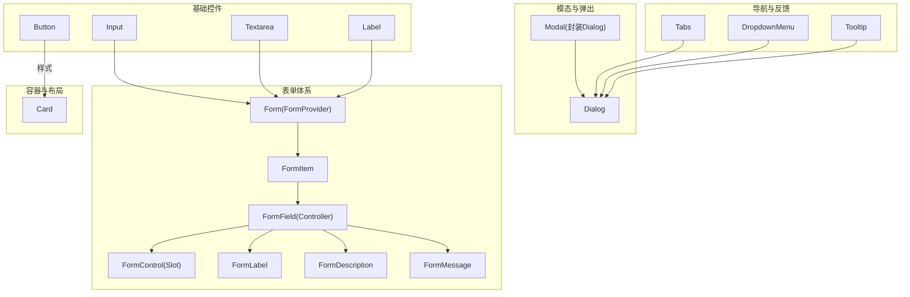
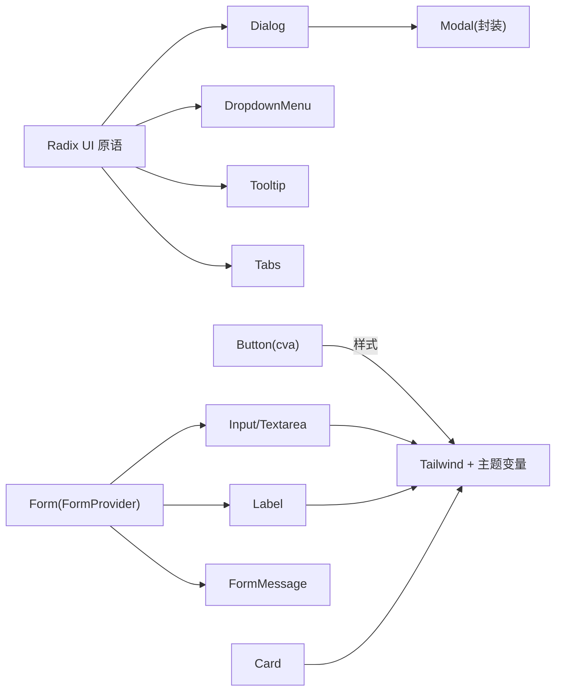
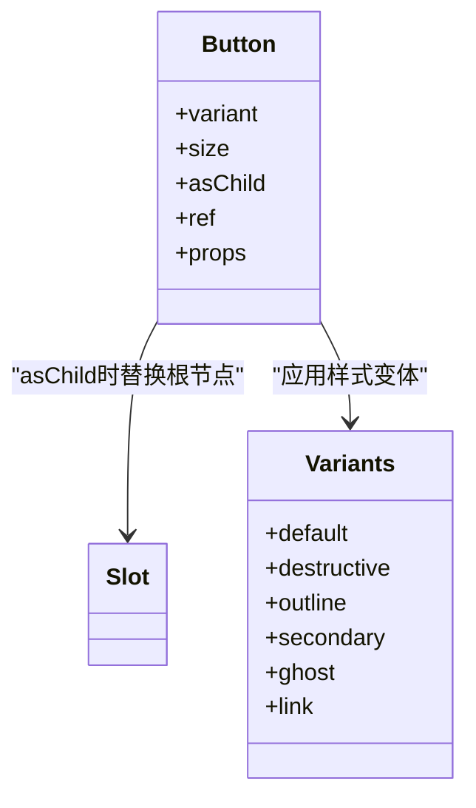
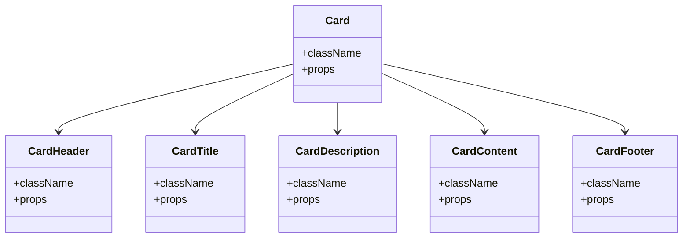
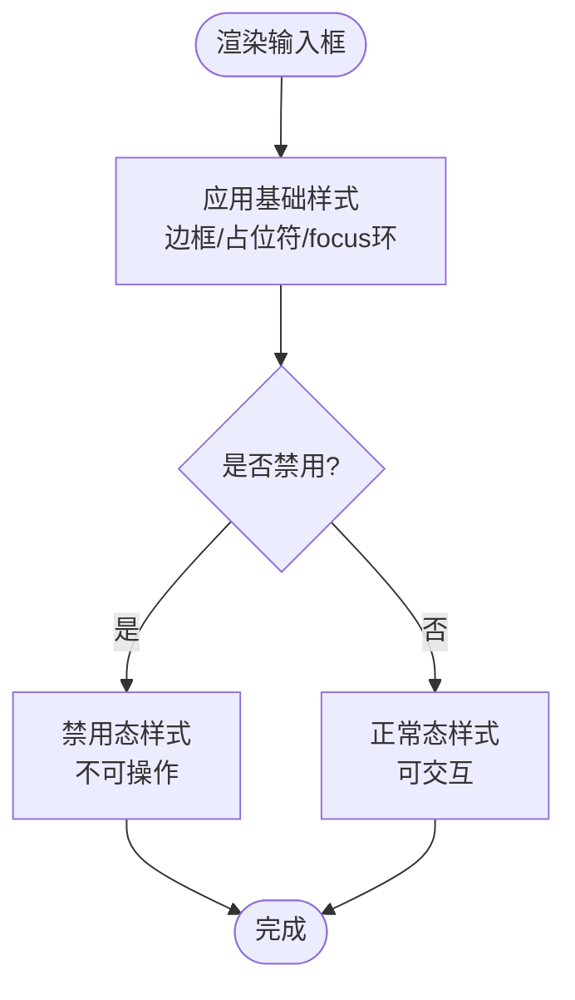
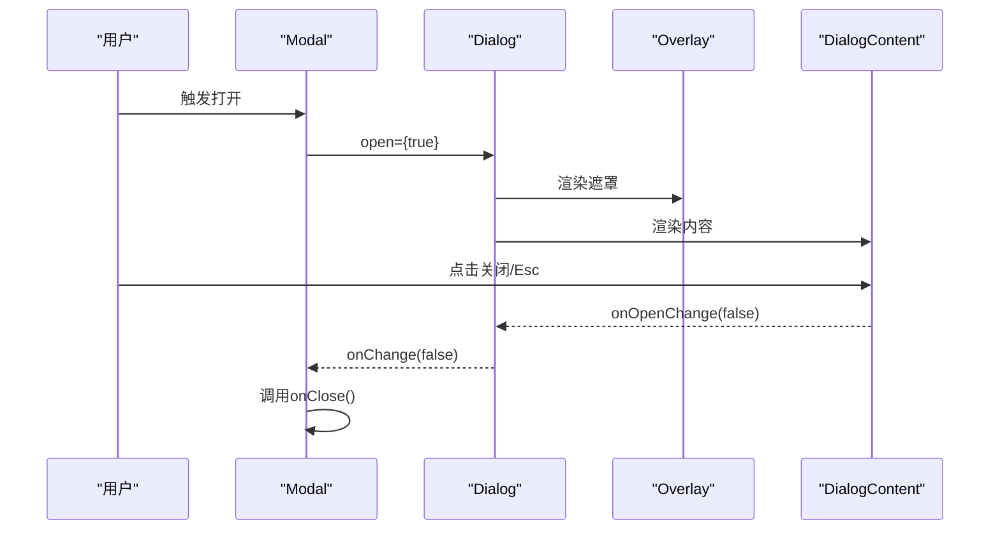
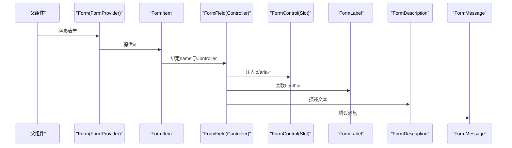
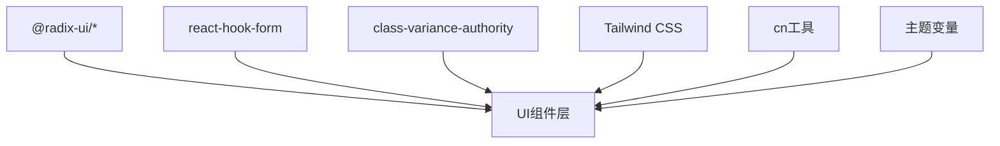

# UI基础组件

<cite>
**本文引用的文件**
- [button.tsx](file://components/ui/button.tsx)
- [card.tsx](file://components/ui/card.tsx)
- [input.tsx](file://components/ui/input.tsx)
- [dialog.tsx](file://components/ui/dialog.tsx)
- [modal.tsx](file://components/ui/modal.tsx)
- [form.tsx](file://components/ui/form.tsx)
- [label.tsx](file://components/ui/label.tsx)
- [textarea.tsx](file://components/ui/textarea.tsx)
- [tabs.tsx](file://components/ui/tabs.tsx)
- [dropdown-menu.tsx](file://components/ui/dropdown-menu.tsx)
- [tooltip.tsx](file://components/ui/tooltip.tsx)
</cite>

## 目录
1. [简介](#简介)
2. [项目结构](#项目结构)
3. [核心组件](#核心组件)
4. [架构总览](#架构总览)
5. [详细组件分析](#详细组件分析)
6. [依赖关系分析](#依赖关系分析)
7. [性能考量](#性能考量)
8. [故障排查指南](#故障排查指南)
9. [结论](#结论)
10. [附录](#附录)

## 简介
本文件为Next.js投资组合项目的UI基础组件文档，聚焦于基于Radix UI构建的可复用、可访问、主题化的基础组件库。内容涵盖Button、Card、Input、Modal（Dialog封装）、表单相关组件（Form/Label/Input/Textarea）以及Tabs、Dropdown Menu、Tooltip等常用交互组件的实现原理、Props接口、事件处理、状态管理、样式与主题、可访问性与响应式设计，并提供使用示例、最佳实践与性能优化建议，帮助开发者快速理解并高效复用这些组件。

## 项目结构
- 组件集中位于 components/ui 目录，按功能拆分：
  - 基础控件：Button、Input、Textarea、Label
  - 复合容器：Card
  - 模态与弹出：Dialog（含Overlay/Content/Header/Footer/Title/Description）、Modal（对Dialog的轻量封装）
  - 表单体系：Form（基于react-hook-form）、FormItem、FormField、FormLabel、FormControl、FormDescription、FormMessage
  - 导航与反馈：Tabs、DropdownMenu、Tooltip
- 样式策略：
  - 通过 class-variance-authority（cva）定义变体（variant/size），结合 Tailwind CSS 原子类实现主题化与响应式
  - 统一的 className 合并工具 cn 保证样式组合与覆盖能力
- 可访问性：
  - 基于Radix UI原语，内置键盘导航、焦点管理、ARIA属性
  - 表单组件通过 htmlFor、aria-describedby、aria-invalid 等增强无障碍体验

图表来源
- [button.tsx:1-58](file://components/ui/button.tsx#L1-L58)
- [card.tsx:1-87](file://components/ui/card.tsx#L1-L87)
- [input.tsx:1-25](file://components/ui/input.tsx#L1-L25)
- [textarea.tsx:1-24](file://components/ui/textarea.tsx#L1-L24)
- [label.tsx:1-27](file://components/ui/label.tsx#L1-L27)
- [dialog.tsx:1-121](file://components/ui/dialog.tsx#L1-L121)
- [modal.tsx:1-40](file://components/ui/modal.tsx#L1-L40)
- [form.tsx:1-178](file://components/ui/form.tsx#L1-L178)
- [tabs.tsx:1-56](file://components/ui/tabs.tsx#L1-L56)
- [dropdown-menu.tsx:1-201](file://components/ui/dropdown-menu.tsx#L1-L201)
- [tooltip.tsx:1-31](file://components/ui/tooltip.tsx#L1-L31)

章节来源
- [button.tsx:1-58](file://components/ui/button.tsx#L1-L58)
- [card.tsx:1-87](file://components/ui/card.tsx#L1-L87)
- [input.tsx:1-25](file://components/ui/input.tsx#L1-L25)
- [dialog.tsx:1-121](file://components/ui/dialog.tsx#L1-L121)
- [modal.tsx:1-40](file://components/ui/modal.tsx#L1-L40)
- [form.tsx:1-178](file://components/ui/form.tsx#L1-L178)
- [label.tsx:1-27](file://components/ui/label.tsx#L1-L27)
- [textarea.tsx:1-24](file://components/ui/textarea.tsx#L1-L24)
- [tabs.tsx:1-56](file://components/ui/tabs.tsx#L1-L56)
- [dropdown-menu.tsx:1-201](file://components/ui/dropdown-menu.tsx#L1-L201)
- [tooltip.tsx:1-31](file://components/ui/tooltip.tsx#L1-L31)

## 核心组件
本节概述各组件的职责、Props接口、事件与状态、样式与主题、可访问性与响应式要点。

- Button
  - 职责：提供统一风格的按钮，支持多种变体与尺寸，支持 asChild 透传至任意元素
  - Props：继承原生按钮属性；新增 variant、size、asChild
  - 事件：透传所有原生事件（onClick、onKeyDown等）
  - 样式：基于 cva 定义默认/破坏性/描边/次要/幽灵/链接等变体；sm/lg/icon等尺寸；focus-visible环与禁用态
  - 主题：通过CSS变量（如 primary、background、ring）实现主题切换
  - 可访问性：保留原生语义，focus-visible可见焦点；禁用态不可操作
  - 响应式：Tailwind断点控制间距与字号
  - 参考路径
    - [button.tsx:7-34](file://components/ui/button.tsx#L7-L34)
    - [button.tsx:36-57](file://components/ui/button.tsx#L36-L57)

- Card
  - 职责：卡片容器，包含Header/Title/Description/Content/Footer子组件
  - Props：每个子组件均接受className与标准HTML属性
  - 事件：透传
  - 样式：圆角、边框、阴影、内边距；标题加粗、描述色弱对比
  - 主题：背景、前景、边框颜色来自主题变量
  - 可访问性：语义化标签（h3用于标题）
  - 响应式：flex布局与间距适配不同屏幕
  - 参考路径
    - [card.tsx:5-17](file://components/ui/card.tsx#L5-L17)
    - [card.tsx:20-77](file://components/ui/card.tsx#L20-L77)

- Input / Textarea
  - 职责：输入框与多行文本输入，统一样式与焦点环
  - Props：继承原生input/textarea属性
  - 事件：onChange、onFocus、onBlur等透传
  - 样式：边框、占位符颜色、禁用态、focus-visible环
  - 主题：背景、边框、文字颜色来自主题
  - 可访问性：placeholder提示、禁用态不可操作
  - 响应式：宽度自适应，移动端友好
  - 参考路径
    - [input.tsx:7-22](file://components/ui/input.tsx#L7-L22)
    - [textarea.tsx:7-21](file://components/ui/textarea.tsx#L7-L21)

- Label
  - 职责：可访问性友好的标签，常与表单控件关联
  - Props：继承原生label属性
  - 事件：透传
  - 样式：字体大小、禁用态透明度
  - 可访问性：配合htmlFor与表单控件建立关联
  - 参考路径
    - [label.tsx:9-24](file://components/ui/label.tsx#L9-L24)

- Dialog / Modal
  - 职责：Dialog提供遮罩、内容区、头部、底部、标题、描述、关闭按钮；Modal是对Dialog的简化封装，暴露isOpen/onClose/title/description/children
  - Props：
    - Dialog：透传Radix Dialog原语属性
    - Modal：title、description、isOpen、onClose、children
  - 事件：onOpenChange（由Dialog内部触发），Modal中将其映射到onClose
  - 样式：居中定位、动画过渡、响应式宽度
  - 可访问性：焦点陷阱、Esc关闭、关闭按钮sr-only文本
  - 响应式：小屏全宽、大屏最大宽度限制
  - 参考路径
    - [dialog.tsx:18-55](file://components/ui/dialog.tsx#L18-L55)
    - [dialog.tsx:57-110](file://components/ui/dialog.tsx#L57-L110)
    - [modal.tsx:13-39](file://components/ui/modal.tsx#L13-L39)

- Form（基于react-hook-form）
  - 职责：提供表单上下文、字段绑定、错误消息、描述信息、无障碍关联
  - 关键组件：
    - Form：包裹整个表单（FormProvider）
    - FormItem：字段容器，生成唯一id
    - FormField：绑定字段名与Controller
    - FormLabel/FormControl/FormDescription/FormMessage：标签、控件、描述、错误消息
  - 事件：通过react-hook-form的onChange/onBlur等
  - 状态：fieldState（值、错误、触摸状态）
  - 可访问性：自动设置htmlFor、aria-describedby、aria-invalid
  - 参考路径
    - [form.tsx:16-40](file://components/ui/form.tsx#L16-L40)
    - [form.tsx:42-63](file://components/ui/form.tsx#L42-L63)
    - [form.tsx:73-85](file://components/ui/form.tsx#L73-L85)
    - [form.tsx:87-125](file://components/ui/form.tsx#L87-L125)
    - [form.tsx:127-166](file://components/ui/form.tsx#L127-L166)

- Tabs
  - 职责：标签页切换，提供List/Trigger/Content
  - Props：透传Radix Tabs原语属性
  - 事件：选中态变化由内部状态管理
  - 样式：激活态高亮、焦点环、过渡
  - 可访问性：键盘方向键切换、role/tablist/tab/tabpanel
  - 参考路径
    - [tabs.tsx:8-53](file://components/ui/tabs.tsx#L8-L53)

- DropdownMenu
  - 职责：下拉菜单，支持分组、分隔线、复选/单选项、子菜单
  - Props：透传Radix DropdownMenu原语属性
  - 事件：open/close、选择项回调
  - 样式：弹出位置、动画、悬停/焦点态
  - 可访问性：箭头键导航、Enter选择、Esc关闭
  - 参考路径
    - [dropdown-menu.tsx:9-75](file://components/ui/dropdown-menu.tsx#L9-L75)
    - [dropdown-menu.tsx:77-182](file://components/ui/dropdown-menu.tsx#L77-L182)

- Tooltip
  - 职责：悬浮提示，提供Trigger与Content
  - Props：sideOffset、透传原语属性
  - 事件：显示/隐藏由Radix管理
  - 样式：圆角、阴影、动画、从不同方向滑入
  - 可访问性：延迟显示、键盘可达
  - 参考路径
    - [tooltip.tsx:8-28](file://components/ui/tooltip.tsx#L8-L28)

章节来源
- [button.tsx:7-57](file://components/ui/button.tsx#L7-L57)
- [card.tsx:5-77](file://components/ui/card.tsx#L5-L77)
- [input.tsx:7-22](file://components/ui/input.tsx#L7-L22)
- [textarea.tsx:7-21](file://components/ui/textarea.tsx#L7-L21)
- [label.tsx:9-24](file://components/ui/label.tsx#L9-L24)
- [dialog.tsx:18-110](file://components/ui/dialog.tsx#L18-L110)
- [modal.tsx:13-39](file://components/ui/modal.tsx#L13-L39)
- [form.tsx:16-166](file://components/ui/form.tsx#L16-L166)
- [tabs.tsx:8-53](file://components/ui/tabs.tsx#L8-L53)
- [dropdown-menu.tsx:9-182](file://components/ui/dropdown-menu.tsx#L9-L182)
- [tooltip.tsx:8-28](file://components/ui/tooltip.tsx#L8-L28)

## 架构总览
下图展示组件之间的依赖与调用关系，体现Radix原语作为底层能力，上层组件进行样式封装与业务扩展。

图表来源
- [dialog.tsx:1-121](file://components/ui/dialog.tsx#L1-L121)
- [modal.tsx:1-40](file://components/ui/modal.tsx#L1-L40)
- [button.tsx:1-58](file://components/ui/button.tsx#L1-L58)
- [input.tsx:1-25](file://components/ui/input.tsx#L1-L25)
- [textarea.tsx:1-24](file://components/ui/textarea.tsx#L1-L24)
- [label.tsx:1-27](file://components/ui/label.tsx#L1-L27)
- [form.tsx:1-178](file://components/ui/form.tsx#L1-L178)
- [card.tsx:1-87](file://components/ui/card.tsx#L1-L87)
- [dropdown-menu.tsx:1-201](file://components/ui/dropdown-menu.tsx#L1-L201)
- [tooltip.tsx:1-31](file://components/ui/tooltip.tsx#L1-L31)
- [tabs.tsx:1-56](file://components/ui/tabs.tsx#L1-L56)

## 详细组件分析

### Button 组件
- 设计模式：组合式组件 + 变体系统（cva）+ Slot透传
- 复杂度：O(1)渲染，样式计算为常量
- 依赖链：@radix-ui/react-slot → cva → Tailwind → 主题变量
- 优化点：避免重复创建变体对象；按需加载Slot
- 错误处理：无效prop透传由React校验
- 性能：无额外state，纯函数组件

图表来源
- [button.tsx:7-34](file://components/ui/button.tsx#L7-L34)
- [button.tsx:36-57](file://components/ui/button.tsx#L36-L57)

章节来源
- [button.tsx:7-57](file://components/ui/button.tsx#L7-L57)

### Card 组件族
- 设计模式：复合组件（Card + Header/Title/Description/Content/Footer）
- 复杂度：线性组合，无状态
- 依赖链：cn → Tailwind → 主题变量
- 优化点：合理拆分子组件便于复用与样式覆盖
- 错误处理：无
- 性能：轻量DOM结构

图表来源
- [card.tsx:5-77](file://components/ui/card.tsx#L5-L77)

章节来源
- [card.tsx:5-77](file://components/ui/card.tsx#L5-L77)

### Input / Textarea 组件
- 设计模式：受控/非受控均可（由父组件决定），透传原生属性
- 复杂度：O(1)
- 依赖链：cn → Tailwind → 主题变量
- 优化点：避免不必要的重渲染（父组件memo）
- 错误处理：disabled与只读由原生行为保障
- 性能：无state，纯渲染

图表来源
- [input.tsx:7-22](file://components/ui/input.tsx#L7-L22)
- [textarea.tsx:7-21](file://components/ui/textarea.tsx#L7-L21)

章节来源
- [input.tsx:7-22](file://components/ui/input.tsx#L7-L22)
- [textarea.tsx:7-21](file://components/ui/textarea.tsx#L7-L21)

### Dialog / Modal 组件
- 设计模式：Dialog为Radix封装，Modal为高层API（isOpen/onClose）
- 复杂度：状态由Radix管理，Modal仅做桥接
- 依赖链：@radix-ui/react-dialog → Portal/Overlay/Content → 动画与焦点管理
- 优化点：Portal隔离层级；动画时长短，避免阻塞
- 错误处理：关闭逻辑在Modal中映射到onClose
- 性能：仅在打开时挂载内容

图表来源
- [modal.tsx:21-39](file://components/ui/modal.tsx#L21-L39)
- [dialog.tsx:18-55](file://components/ui/dialog.tsx#L18-L55)

章节来源
- [modal.tsx:13-39](file://components/ui/modal.tsx#L13-L39)
- [dialog.tsx:18-55](file://components/ui/dialog.tsx#L18-L55)

### Form 表单体系
- 设计模式：Context + Provider + Controller 组合
- 复杂度：中等（状态与验证由react-hook-form管理）
- 依赖链：react-hook-form → Context → Radix Label/Slot
- 优化点：useMemo/useCallback在父组件中稳定引用；避免频繁re-render
- 错误处理：FormMessage根据error显示或隐藏
- 性能：局部更新，仅受影响字段重渲染

图表来源
- [form.tsx:16-40](file://components/ui/form.tsx#L16-L40)
- [form.tsx:73-166](file://components/ui/form.tsx#L73-L166)

章节来源
- [form.tsx:16-166](file://components/ui/form.tsx#L16-L166)

### Tabs / DropdownMenu / Tooltip
- 设计模式：Radix原语 + 样式封装
- 复杂度：低到中等（状态由原语管理）
- 依赖链：@radix-ui/* → Tailwind → 主题变量
- 优化点：避免在高频交互处创建新对象；合理使用侧边偏移
- 错误处理：无
- 性能：按需渲染内容，动画轻量

章节来源
- [tabs.tsx:8-53](file://components/ui/tabs.tsx#L8-L53)
- [dropdown-menu.tsx:9-182](file://components/ui/dropdown-menu.tsx#L9-L182)
- [tooltip.tsx:8-28](file://components/ui/tooltip.tsx#L8-L28)

## 依赖关系分析
- 外部依赖
  - @radix-ui/react-*：提供无样式、高可访问性的基础组件
  - react-hook-form：表单状态与验证
  - lucide-react：图标（如Dialog关闭按钮）
  - class-variance-authority：变体系统
  - Tailwind CSS：原子样式与主题变量
- 内部依赖
  - cn工具函数：合并className
  - 主题变量：primary、background、ring等，确保一致的主题风格

图表来源
- [button.tsx:1-58](file://components/ui/button.tsx#L1-L58)
- [form.tsx:1-178](file://components/ui/form.tsx#L1-L178)
- [dialog.tsx:1-121](file://components/ui/dialog.tsx#L1-L121)
- [dropdown-menu.tsx:1-201](file://components/ui/dropdown-menu.tsx#L1-L201)
- [tooltip.tsx:1-31](file://components/ui/tooltip.tsx#L1-L31)
- [tabs.tsx:1-56](file://components/ui/tabs.tsx#L1-L56)

章节来源
- [button.tsx:1-58](file://components/ui/button.tsx#L1-L58)
- [form.tsx:1-178](file://components/ui/form.tsx#L1-L178)
- [dialog.tsx:1-121](file://components/ui/dialog.tsx#L1-L121)
- [dropdown-menu.tsx:1-201](file://components/ui/dropdown-menu.tsx#L1-L201)
- [tooltip.tsx:1-31](file://components/ui/tooltip.tsx#L1-L31)
- [tabs.tsx:1-56](file://components/ui/tabs.tsx#L1-L56)

## 性能考量
- 渲染优化
  - 使用React.memo包装高频重渲染的子组件（如列表中的Card）
  - 将大段内容放入Modal/Dialog，仅在需要时挂载
  - 避免在循环中创建新的函数或对象（如变体配置）
- 样式与主题
  - 利用Tailwind的原子类减少自定义CSS体积
  - 通过主题变量统一管理颜色，避免硬编码
- 可访问性
  - 保持Radix原语的键盘导航与焦点管理
  - 表单组件使用正确的ARIA属性，确保屏幕阅读器友好
- 交互反馈
  - 使用Tooltip/DropdownMenu提供即时反馈，减少页面跳转
  - 使用Toast（若引入）提供非阻塞通知

[本节为通用指导，不直接分析具体文件]

## 故障排查指南
- 表单问题
  - 现象：字段未更新或验证不生效
  - 排查：确认FormField正确绑定name；检查FormProvider包裹范围；查看FormMessage是否正确渲染
  - 参考路径
    - [form.tsx:29-40](file://components/ui/form.tsx#L29-L40)
    - [form.tsx:144-166](file://components/ui/form.tsx#L144-L166)
- 模态问题
  - 现象：无法关闭或焦点丢失
  - 排查：确认Modal的onClose被正确调用；检查Dialog的onOpenChange；确保关闭按钮存在且可聚焦
  - 参考路径
    - [modal.tsx:21-39](file://components/ui/modal.tsx#L21-L39)
    - [dialog.tsx:18-55](file://components/ui/dialog.tsx#L18-L55)
- 样式覆盖失败
  - 现象：传入className未生效
  - 排查：确认使用cn合并；检查优先级与主题变量；避免冲突类名
  - 参考路径
    - [button.tsx:43-51](file://components/ui/button.tsx#L43-L51)
    - [input.tsx:7-22](file://components/ui/input.tsx#L7-L22)

章节来源
- [form.tsx:29-40](file://components/ui/form.tsx#L29-L40)
- [form.tsx:144-166](file://components/ui/form.tsx#L144-L166)
- [modal.tsx:21-39](file://components/ui/modal.tsx#L21-L39)
- [dialog.tsx:18-55](file://components/ui/dialog.tsx#L18-L55)
- [button.tsx:43-51](file://components/ui/button.tsx#L43-L51)
- [input.tsx:7-22](file://components/ui/input.tsx#L7-L22)

## 结论
本UI基础组件库以Radix UI为核心，结合cva与Tailwind CSS实现了高度可复用、主题化、可访问的基础组件。通过清晰的组件分层与组合模式，开发者可以快速搭建一致的界面，同时保持良好的性能与用户体验。建议在项目中统一使用这些组件，遵循其Props约定与最佳实践，以获得一致的设计语言与可维护的代码结构。

[本节为总结，不直接分析具体文件]

## 附录
- 使用示例（路径指引）
  - 按钮：参考 [button.tsx:36-57](file://components/ui/button.tsx#L36-L57)
  - 卡片：参考 [card.tsx:5-77](file://components/ui/card.tsx#L5-L77)
  - 输入框：参考 [input.tsx:7-22](file://components/ui/input.tsx#L7-L22)
  - 多行输入：参考 [textarea.tsx:7-21](file://components/ui/textarea.tsx#L7-L21)
  - 标签：参考 [label.tsx:9-24](file://components/ui/label.tsx#L9-L24)
  - 对话框：参考 [dialog.tsx:18-55](file://components/ui/dialog.tsx#L18-L55)
  - 模态封装：参考 [modal.tsx:13-39](file://components/ui/modal.tsx#L13-L39)
  - 表单体系：参考 [form.tsx:16-166](file://components/ui/form.tsx#L16-L166)
  - 标签页：参考 [tabs.tsx:8-53](file://components/ui/tabs.tsx#L8-L53)
  - 下拉菜单：参考 [dropdown-menu.tsx:9-182](file://components/ui/dropdown-menu.tsx#L9-L182)
  - 提示框：参考 [tooltip.tsx:8-28](file://components/ui/tooltip.tsx#L8-L28)

[本节为索引，不直接分析具体文件]