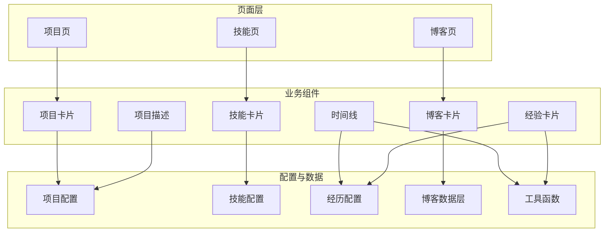
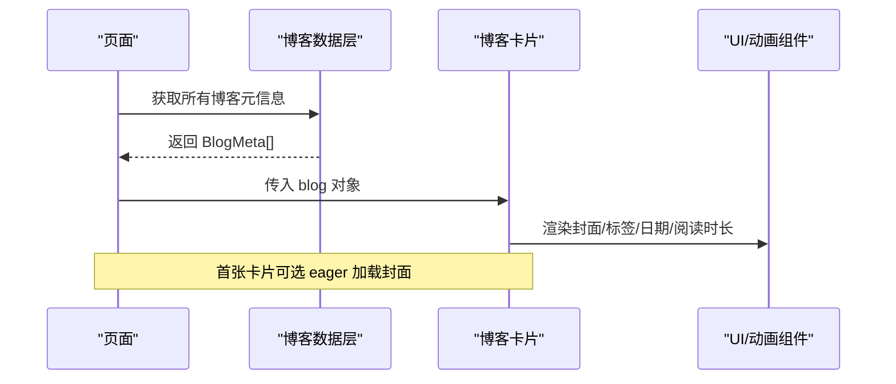
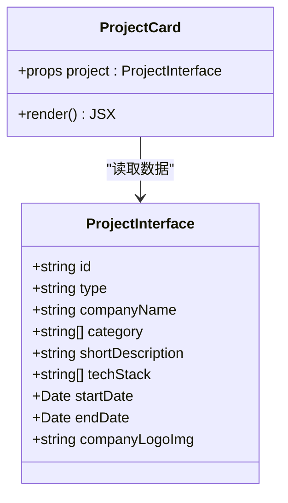
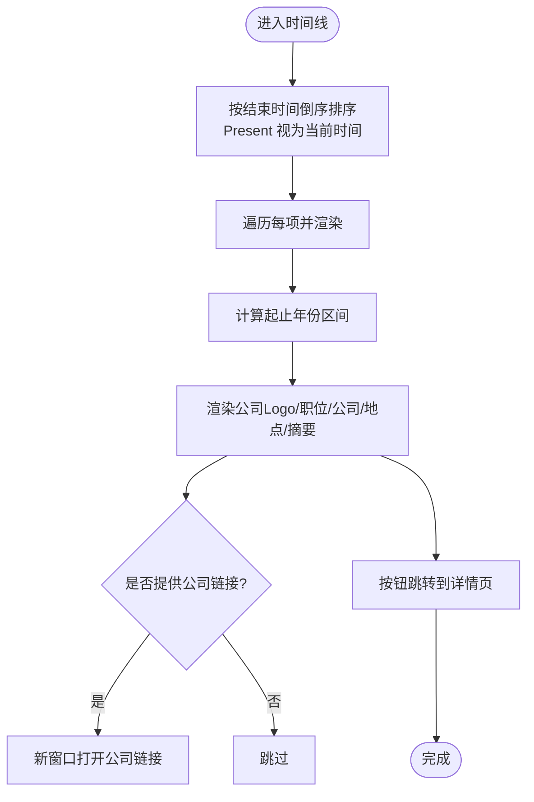
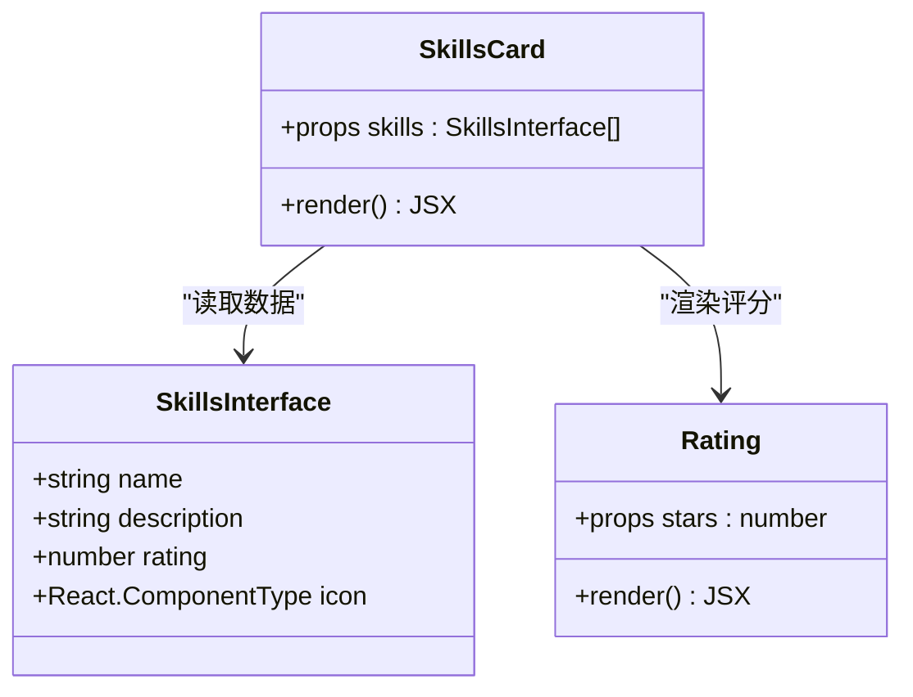
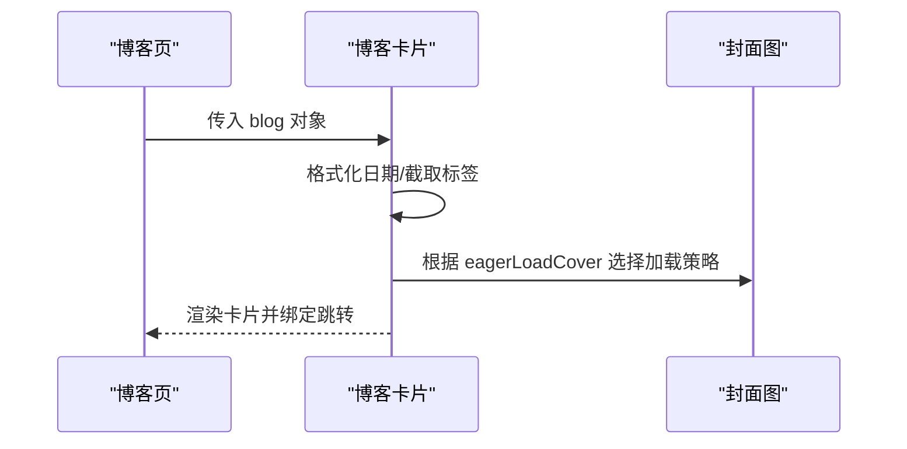
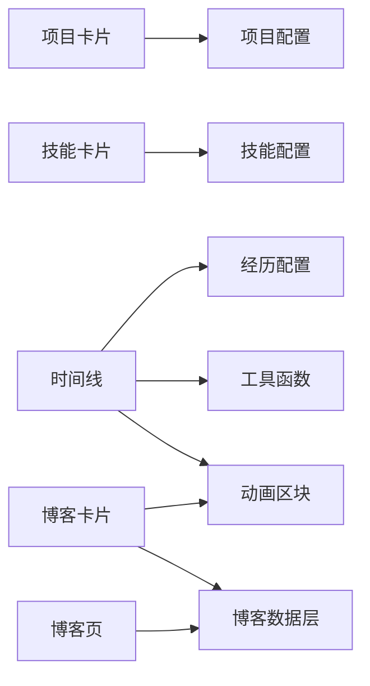

# 业务组件

<cite>
**本文引用的文件**
- [项目卡片](file://components/projects/project-card.tsx)
- [时间线](file://components/experience/timeline.tsx)
- [技能卡片](file://components/skills/skills-card.tsx)
- [评分组件](file://components/skills/rating.tsx)
- [博客卡片](file://components/blogs/blog-card.tsx)
- [经验卡片](file://components/experience/experience-card.tsx)
- [项目描述](file://components/projects/project-description.tsx)
- [项目配置](file://config/projects.ts)
- [技能配置](file://config/skills.ts)
- [经历配置](file://config/experience.ts)
- [常量定义](file://config/constants.ts)
- [工具函数](file://lib/utils.ts)
- [博客数据层](file://lib/blogs.ts)
- [项目页面](file://app/(root)/projects/page.tsx)
- [技能页面](file://app/(root)/skills/page.tsx)
- [博客列表页面](file://app/(root)/blogs/page.tsx)
- [动画区块](file://components/common/animated-section.tsx)
</cite>

## 目录
1. [简介](#简介)
2. [项目结构](#项目结构)
3. [核心组件](#核心组件)
4. [架构总览](#架构总览)
5. [详细组件分析](#详细组件分析)
6. [依赖关系分析](#依赖关系分析)
7. [性能考虑](#性能考虑)
8. [故障排查指南](#故障排查指南)
9. [结论](#结论)
10. [附录](#附录)

## 简介
本文件面向 Next.js 投资组合项目的“业务组件”进行系统化文档化，聚焦以下场景：项目展示、工作经历时间线、技能展示与评分、博客文章卡片。内容涵盖数据模型、状态管理、交互逻辑、API 集成、可配置项、事件回调、错误处理与用户体验优化；并提供组合使用模式、数据流设计与性能建议，帮助开发者理解并扩展这些组件。

## 项目结构
本项目采用“按功能域组织”的组件目录结构：
- components：业务组件与通用 UI 组件
- config：类型化配置（项目、技能、经历等）
- lib：服务端数据获取与工具函数（如 Notion 博客数据）
- app/(root)：页面级路由，负责组装数据与渲染业务组件

图表来源
- [项目页面](file://app/(root)/projects/page.tsx:1-59)
- [技能页面](file://app/(root)/skills/page.tsx:1-23)
- [博客列表页面](file://app/(root)/blogs/page.tsx:1-152)
- [项目卡片](file://components/projects/project-card.tsx:1-52)
- [时间线](file://components/experience/timeline.tsx:1-100)
- [技能卡片](file://components/skills/skills-card.tsx:1-31)
- [博客卡片](file://components/blogs/blog-card.tsx:1-98)
- [经验卡片](file://components/experience/experience-card.tsx:1-95)
- [项目描述](file://components/projects/project-description.tsx:1-24)
- [项目配置](file://config/projects.ts:1-422)
- [技能配置](file://config/skills.ts:1-154)
- [经历配置](file://config/experience.ts:1-69)
- [工具函数](file://lib/utils.ts:1-29)
- [博客数据层](file://lib/blogs.ts:1-550)

章节来源
- [项目页面](file://app/(root)/projects/page.tsx:1-59)
- [技能页面](file://app/(root)/skills/page.tsx:1-23)
- [博客列表页面](file://app/(root)/blogs/page.tsx:1-152)

## 核心组件
- 项目卡片：展示公司 Logo、标题、摘要、分类标签、技术栈入口与详情跳转。
- 时间线：按时间倒序展示工作经历，支持公司 Logo、链接、时长、详情跳转与滚动入场动效。
- 技能卡片：以网格形式展示技能名称、描述与星级评分。
- 博客卡片：封面图、标签、标题、摘要、日期与阅读时长，支持懒加载与首屏优先加载。
- 经验卡片：精简版经历条目，展示关键信息与技术标签。
- 项目描述：将段落与要点列表渲染为可读性良好的结构化文本。

章节来源
- [项目卡片](file://components/projects/project-card.tsx:1-52)
- [时间线](file://components/experience/timeline.tsx:1-100)
- [技能卡片](file://components/skills/skills-card.tsx:1-31)
- [博客卡片](file://components/blogs/blog-card.tsx:1-98)
- [经验卡片](file://components/experience/experience-card.tsx:1-95)
- [项目描述](file://components/projects/project-description.tsx:1-24)

## 架构总览
业务组件遵循“配置驱动 + 页面组装 + 组件渲染”的分层模式：
- 配置层：TypeScript 接口与数组集中管理项目、技能、经历等静态数据。
- 数据层：服务端模块从 Notion 拉取博客元信息与正文，并进行缓存与校验。
- 页面层：Next.js 页面负责获取数据、SEO 元数据与 JSON-LD，并将数据传递给业务组件。
- 组件层：纯展示型或轻量交互组件，通过 props 接收数据，调用工具函数与 UI 组件完成渲染。

图表来源
- [博客列表页面](file://app/(root)/blogs/page.tsx:1-152)
- [博客数据层](file://lib/blogs.ts:1-550)
- [博客卡片](file://components/blogs/blog-card.tsx:1-98)
- [动画区块](file://components/common/animated-section.tsx:1-51)

## 详细组件分析

### 项目卡片（ProjectCard）
- 数据模型
  - 输入：ProjectInterface（包含 id、type、companyName、category、shortDescription、techStack、图片与详情页信息等）。
  - 输出：可点击的项目卡片，带分类标签与详情跳转。
- 交互逻辑
  - 点击“Read more”跳转到 /projects/[id]。
  - 根据 type 显示不同图标（个人/职业）。
- 可配置项
  - 通过 ProjectInterface 字段控制展示内容与样式。
- 错误处理
  - 图片缺失时由 Next Image 占位；无外链时不渲染外部链接。
- 性能优化
  - 使用响应式 sizes 与 object-contain 提升大图加载体验。
- 组合使用
  - 在“项目页”中按分类筛选后批量渲染多个项目卡片。

图表来源
- [项目卡片](file://components/projects/project-card.tsx:1-52)
- [项目配置](file://config/projects.ts:1-422)

章节来源
- [项目卡片](file://components/projects/project-card.tsx:1-52)
- [项目配置](file://config/projects.ts:1-422)
- [项目页面](file://app/(root)/projects/page.tsx:1-59)

### 时间线（Timeline）
- 数据模型
  - 输入：ExperienceInterface[]（包含职位、公司、地点、起止时间、描述、成就、技能、公司链接与 Logo）。
- 处理逻辑
  - 按结束时间倒序排序，“Present”视为当前时间。
  - 使用工具函数格式化起止年份区间。
- 交互逻辑
  - 点击“View Details”跳转到 /experience/[id]。
  - 公司链接在新窗口打开。
- 可配置项
  - 通过 ExperienceInterface 字段控制展示内容。
- 错误处理
  - 缺少 Logo 时隐藏区域；空描述时仅显示标题与时间。
- 性能优化
  - 列表项包裹动画区块，延迟递增，避免同时大量重绘。

图表来源
- [时间线](file://components/experience/timeline.tsx:1-100)
- [经历配置](file://config/experience.ts:1-69)
- [工具函数](file://lib/utils.ts:1-29)
- [动画区块](file://components/common/animated-section.tsx:1-51)

章节来源
- [时间线](file://components/experience/timeline.tsx:1-100)
- [经历配置](file://config/experience.ts:1-69)
- [工具函数](file://lib/utils.ts:1-29)

### 技能卡片（SkillsCard）与评分（Rating）
- 数据模型
  - 输入：SkillsInterface[]（name、description、rating、icon）。
- 处理逻辑
  - 网格布局展示，每个卡片内嵌 Rating 组件。
  - Rating 根据 rating 值渲染 1~5 颗星。
- 可配置项
  - 通过 SkillsInterface 控制图标、描述与评分。
- 错误处理
  - 未设置 icon 时无法渲染；rating 超出范围时由上层配置保证。
- 性能优化
  - 纯展示组件，无额外状态，适合大批量渲染。

图表来源
- [技能卡片](file://components/skills/skills-card.tsx:1-31)
- [评分组件](file://components/skills/rating.tsx:1-41)
- [技能配置](file://config/skills.ts:1-154)

章节来源
- [技能卡片](file://components/skills/skills-card.tsx:1-31)
- [评分组件](file://components/skills/rating.tsx:1-41)
- [技能配置](file://config/skills.ts:1-154)
- [技能页面](file://app/(root)/skills/page.tsx:1-23)

### 博客卡片（BlogCard）
- 数据模型
  - 输入：BlogMeta（slug、title、date、description、tags、coverImage、readingTime、featured）。
- 处理逻辑
  - 格式化日期；首张卡片可启用 eager 加载封面；标签最多显示前 3 个，其余用“+N”表示。
- 交互逻辑
  - 整卡作为 Link 跳转到 /blogs/[slug]。
- 可配置项
  - eagerLoadCover 控制首图加载策略。
- 错误处理
  - 无封面图时不渲染图片区域；日期无效时由上游数据保证。
- 性能优化
  - 使用 Next Image 的 lazy/eager 与 sizes；hover 微动效提升交互感。

图表来源
- [博客卡片](file://components/blogs/blog-card.tsx:1-98)
- [博客列表页面](file://app/(root)/blogs/page.tsx:1-152)

章节来源
- [博客卡片](file://components/blogs/blog-card.tsx:1-98)
- [博客列表页面](file://app/(root)/blogs/page.tsx:1-152)

### 经验卡片（ExperienceCard）
- 数据模型
  - 输入：ExperienceInterface（同时间线使用的经历数据）。
- 处理逻辑
  - 展示公司 Logo、职位、公司名、地点、起止时间、首条描述、部分技能标签。
- 交互逻辑
  - 按钮跳转到 /experience/[id]；公司链接新窗口打开。
- 可配置项
  - 通过 ExperienceInterface 控制展示内容。
- 错误处理
  - 无 Logo 或公司链接时优雅降级。
- 性能优化
  - 小尺寸图片与截断文本，减少重排。

章节来源
- [经验卡片](file://components/experience/experience-card.tsx:1-95)
- [经历配置](file://config/experience.ts:1-69)
- [工具函数](file://lib/utils.ts:1-29)

### 项目描述（ProjectDescription）
- 作用：将段落与要点列表渲染为可读性良好的结构化内容。
- 输入：paragraphs、bullets。
- 适用场景：项目详情页的内容区。

章节来源
- [项目描述](file://components/projects/project-description.tsx:1-24)
- [项目配置](file://config/projects.ts:1-422)

## 依赖关系分析
- 组件对配置的依赖
  - 项目卡片依赖 ProjectInterface；技能卡片依赖 SkillsInterface；时间线与经验卡片依赖 ExperienceInterface。
- 组件对工具函数的依赖
  - 时间线与经验卡片使用 getDurationText 格式化时间区间；博客卡片使用 formatDate 格式化日期。
- 页面到数据层的依赖
  - 博客页通过 getAllBlogsMeta 获取元数据，并注入 SEO 与 JSON-LD。
- 动画与交互
  - 时间线与博客列表使用 AnimatedSection 实现滚动入场效果。

图表来源
- [项目卡片](file://components/projects/project-card.tsx:1-52)
- [技能卡片](file://components/skills/skills-card.tsx:1-31)
- [时间线](file://components/experience/timeline.tsx:1-100)
- [博客卡片](file://components/blogs/blog-card.tsx:1-98)
- [博客列表页面](file://app/(root)/blogs/page.tsx:1-152)
- [项目配置](file://config/projects.ts:1-422)
- [技能配置](file://config/skills.ts:1-154)
- [经历配置](file://config/experience.ts:1-69)
- [工具函数](file://lib/utils.ts:1-29)
- [博客数据层](file://lib/blogs.ts:1-550)
- [动画区块](file://components/common/animated-section.tsx:1-51)

章节来源
- [项目配置](file://config/projects.ts:1-422)
- [技能配置](file://config/skills.ts:1-154)
- [经历配置](file://config/experience.ts:1-69)
- [工具函数](file://lib/utils.ts:1-29)
- [博客数据层](file://lib/blogs.ts:1-550)
- [动画区块](file://components/common/animated-section.tsx:1-51)

## 性能考虑
- 图片加载
  - 使用 Next Image 的 sizes、object-contain、lazy/eager 策略，首屏优先加载首张博客封面。
- 列表渲染
  - 时间线与博客列表使用递增 delay 的动画区块，避免同时触发大量动画。
- 数据缓存
  - 博客数据层使用不稳定缓存（unstable_cache）并按 tag 失效，降低重复请求。
- 文本截断
  - 多处使用 line-clamp 限制行数，减少长文本导致的布局抖动。
- 资源体积
  - 图标与图片按需引入，避免不必要的包体积增长。

[本节为通用指导，无需特定文件引用]

## 故障排查指南
- 博客数据为空
  - 检查环境变量 NOTION_TOKEN 与 NOTION_DATA_SOURCE_ID 是否成对配置；若缺失则禁用博客并返回空列表。
- Notion 属性校验失败
  - 确保数据源属性类型与名称匹配（如 Status 必须包含 Published 选项），否则抛出明确错误。
- 重复 slug
  - 发布的博客不允许重复 slug，否则会报错；请修正 Notion 中的 Slug 字段。
- 图片路径无效
  - 封面图需为稳定站点相对路径或 HTTPS URL，否则会被拒绝。
- 时间格式异常
  - 起止时间应为有效日期；若 endDate 为字符串“Present”，将被视为当前时间。

章节来源
- [博客数据层](file://lib/blogs.ts:1-550)
- [工具函数](file://lib/utils.ts:1-29)

## 结论
该投资组合项目的业务组件以“配置驱动 + 页面组装 + 组件渲染”为核心架构，具备清晰的数据流与职责划分。项目卡片、时间线、技能卡片与博客卡片均具备良好的可扩展性与可维护性，配合动画与图片优化，提供了流畅的用户体验。通过统一的 TypeScript 接口与工具函数，新增或修改业务内容只需更新对应配置文件即可。

[本节为总结，无需特定文件引用]

## 附录
- 常用数据类型
  - ValidCategory：项目分类枚举（如 Full Stack、Frontend、Backend 等）。
  - ValidExpType：项目类型（Personal、Professional）。
  - ValidPages：页面标识（home、skills、projects、experience、contact、contributions、resume、blogs）。

章节来源
- [常量定义](file://config/constants.ts:1-91)