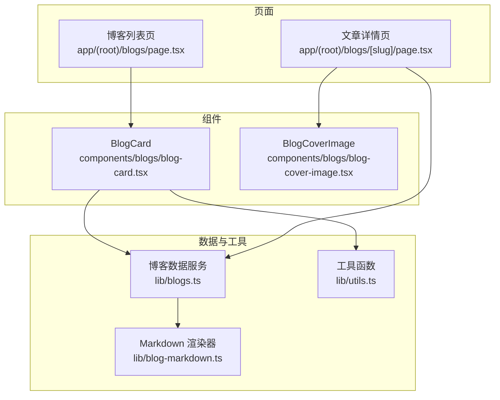
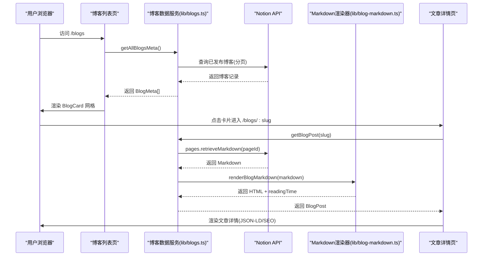
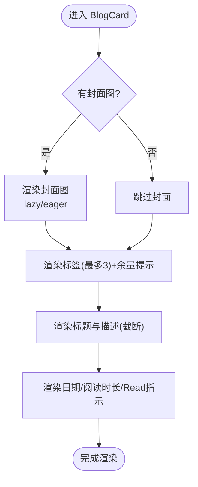
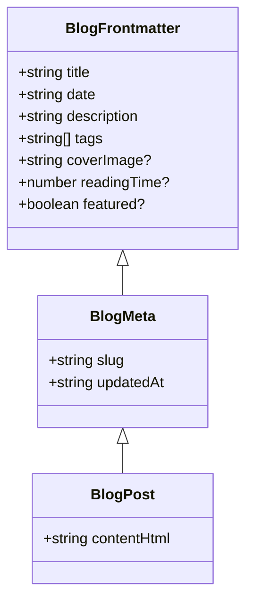
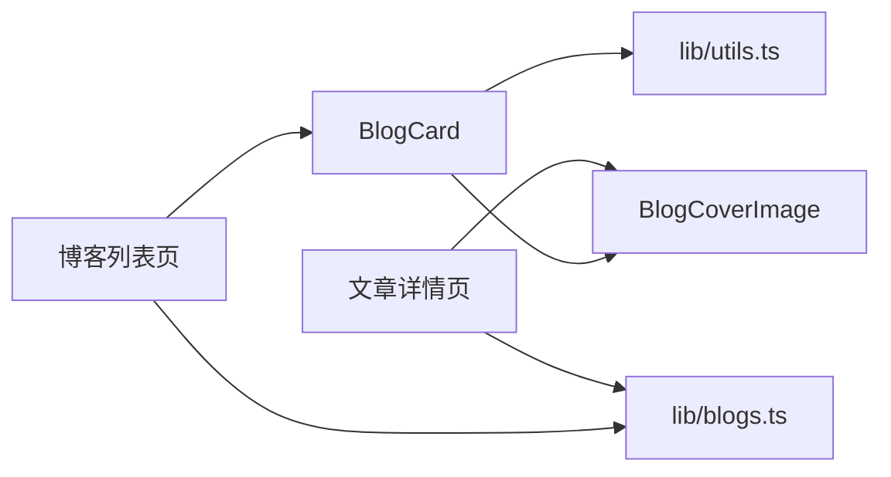

# 博客卡片组件

<cite>
**本文引用的文件**
- [components/blogs/blog-card.tsx](file://components/blogs/blog-card.tsx)
- [components/blogs/blog-cover-image.tsx](file://components/blogs/blog-cover-image.tsx)
- [lib/blogs.ts](file://lib/blogs.ts)
- [lib/utils.ts](file://lib/utils.ts)
- [app/(root)/blogs/page.tsx](file://app/(root)/blogs/page.tsx)
- [app/(root)/blogs/[slug]/page.tsx](file://app/(root)/blogs/[slug]/page.tsx)
- [lib/blog-markdown.ts](file://lib/blog-markdown.ts)
</cite>

## 目录
1. [简介](#简介)
2. [项目结构](#项目结构)
3. [核心组件](#核心组件)
4. [架构总览](#架构总览)
5. [详细组件分析](#详细组件分析)
6. [依赖关系分析](#依赖关系分析)
7. [性能考量](#性能考量)
8. [故障排查指南](#故障排查指南)
9. [结论](#结论)
10. [附录：使用示例与最佳实践](#附录使用示例与最佳实践)

## 简介
本文件为博客卡片组件（BlogCard）的完整技术文档，聚焦以下目标：
- 解释 BlogCard 如何展示文章预览、摘要、标签、封面图、阅读时长等元信息
- 说明 Markdown 内容提取、摘要生成、SEO 优化、图片懒加载与链接跳转机制
- 阐述与博客系统（Notion 数据源）的集成方式、数据获取流程、缓存策略与性能优化
- 提供在博客列表页中集成该组件的完整示例，以及自定义样式与处理不同文章内容格式的实践建议

## 项目结构
本项目采用 Next.js App Router 组织页面与组件，博客相关代码主要分布在以下位置：
- 组件层：blog-card.tsx、blog-cover-image.tsx
- 数据层：lib/blogs.ts（从 Notion 拉取并缓存博客元信息与正文）、lib/blog-markdown.ts（Markdown 转 HTML 与安全清洗）
- 页面层：app/(root)/blogs/page.tsx（博客列表页）、app/(root)/blogs/[slug]/page.tsx（文章详情页）
- 工具层：lib/utils.ts（日期格式化等）

图表来源
- [app/(root)/blogs/page.tsx:1-152](file://app/(root)/blogs/page.tsx#L1-L152)
- [app/(root)/blogs/[slug]/page.tsx:1-322](file://app/(root)/blogs/[slug]/page.tsx#L1-L322)
- [components/blogs/blog-card.tsx:1-98](file://components/blogs/blog-card.tsx#L1-L98)
- [components/blogs/blog-cover-image.tsx:1-69](file://components/blogs/blog-cover-image.tsx#L1-L69)
- [lib/blogs.ts:1-550](file://lib/blogs.ts#L1-L550)
- [lib/blog-markdown.ts:1-532](file://lib/blog-markdown.ts#L1-L532)
- [lib/utils.ts:1-29](file://lib/utils.ts#L1-L29)

章节来源
- [app/(root)/blogs/page.tsx:1-152](file://app/(root)/blogs/page.tsx#L1-L152)
- [lib/blogs.ts:1-550](file://lib/blogs.ts#L1-L550)

## 核心组件
- BlogCard：负责单篇文章卡片的展示，包括封面图、标签、标题、描述、日期、阅读时长和“Read”指示。支持可选的首屏优先加载封面图。
- BlogCoverImage：统一封装图片渲染逻辑，区分外部 URL 与本地资源，支持 fill/尺寸/sizes/loading/fetchPriority 等属性，实现懒加载与首屏优先加载。
- 博客数据服务（lib/blogs.ts）：从 Notion 数据源拉取已发布文章元信息，缓存结果；按需获取文章正文 Markdown 并转换为安全 HTML；估算阅读时间。
- Markdown 渲染器（lib/blog-markdown.ts）：将 Notion 导出的 Markdown 转换为 HTML，进行安全清洗、媒体与引用转换、表格/代码块/强调等语法支持，并限制最大深度与大小。

章节来源
- [components/blogs/blog-card.tsx:1-98](file://components/blogs/blog-card.tsx#L1-L98)
- [components/blogs/blog-cover-image.tsx:1-69](file://components/blogs/blog-cover-image.tsx#L1-L69)
- [lib/blogs.ts:1-550](file://lib/blogs.ts#L1-L550)
- [lib/blog-markdown.ts:1-532](file://lib/blog-markdown.ts#L1-L532)

## 架构总览
博客系统的数据流如下：
- 列表页请求时调用 getAllBlogsMeta() 获取所有已发布文章的元数据（标题、描述、标签、封面、日期、阅读时长等），并通过 BlogCard 渲染卡片网格。
- 点击卡片后跳转到 /blogs/[slug]，详情页通过 getBlogPost(slug) 获取文章元数据与 HTML 正文，并进行 SEO JSON-LD 注入。
- 数据来源于 Notion 数据源，经过严格校验（Zod）与缓存（Next unstable_cache），确保一致性与性能。
- Markdown 内容经 remark/rehype 管线处理，输出安全的 HTML，同时保留必要的语义化结构与外链能力。

图表来源
- [app/(root)/blogs/page.tsx:1-152](file://app/(root)/blogs/page.tsx#L1-L152)
- [app/(root)/blogs/[slug]/page.tsx:1-322](file://app/(root)/blogs/[slug]/page.tsx#L1-L322)
- [lib/blogs.ts:1-550](file://lib/blogs.ts#L1-L550)
- [lib/blog-markdown.ts:1-532](file://lib/blog-markdown.ts#L1-L532)

## 详细组件分析

### BlogCard 组件
- 输入数据：BlogMeta（包含 slug、title、date、description、tags、coverImage、readingTime、updatedAt 等）
- 展示逻辑：
  - 封面图：条件渲染，支持 eager/lazy 加载控制，响应式 sizes，hover 缩放动效
  - 标签：最多显示前 3 个，超出以 “+N” 形式提示
  - 标题与描述：截断显示，提升可读性
  - 底部信息：格式化日期、阅读时长、“Read” 指示箭头
  - 链接跳转：包裹 Link 指向 /blogs/[slug]
- 可定制点：
  - eagerLoadCover：首张卡片可设为 eager 以提升首屏体验
  - 样式：可通过 Tailwind 类名调整颜色、间距、阴影、圆角等

图表来源
- [components/blogs/blog-card.tsx:1-98](file://components/blogs/blog-card.tsx#L1-L98)

章节来源
- [components/blogs/blog-card.tsx:1-98](file://components/blogs/blog-card.tsx#L1-L98)

### BlogCoverImage 组件
- 功能：根据 src 是否为外部 URL 选择原生 img 或 Next Image；支持 fill、width/height、sizes、loading、fetchPriority
- 懒加载：默认 lazy，首屏可改为 eager
- 安全性：外部 URL 直接渲染，内部资源走 Next Image 优化

章节来源
- [components/blogs/blog-cover-image.tsx:1-69](file://components/blogs/blog-cover-image.tsx#L1-L69)

### 博客数据服务（lib/blogs.ts）
- 数据模型：
  - BlogFrontmatter：标题、日期、描述、标签、封面、阅读时长、是否精选
  - BlogMeta：在前者基础上增加 slug、updatedAt
  - BlogPost：在 BlogMeta 基础上增加 contentHtml
- 数据获取：
  - 从 Notion 数据源查询已发布文章，按 PublishedAt 降序排序
  - 使用 Zod 对字段进行强类型校验与约束（如 slug 格式、日期合法性、标签数量等）
  - 分页读取，去重 slug，保证唯一性
- 缓存策略：
  - 使用 Next unstable_cache 缓存已发布博客列表与单篇内容
  - 支持 revalidate 时间与 tags 标记，便于按需失效
- 正文渲染：
  - 通过 renderBlogMarkdown 将 Markdown 转为 HTML，并估算阅读时间
  - 若 Notion 对象不存在则返回 null，避免报错
- 导出接口：
  - getAllBlogSlugs、getAllBlogsMeta、getBlogPost、getFeaturedBlogs

图表来源
- [lib/blogs.ts:35-56](file://lib/blogs.ts#L35-L56)

章节来源
- [lib/blogs.ts:1-550](file://lib/blogs.ts#L1-L550)

### Markdown 渲染器（lib/blog-markdown.ts）
- 能力：
  - 将 Notion 导出的 Markdown 转换为 HTML
  - 支持 GFM、表格、代码块、强调、删除线、折叠区块、图片、音视频附件、引用等
  - 安全清洗：移除危险标签、限制嵌套深度、过滤临时链接
  - 稳定资源校验：仅允许稳定的内容 URL，否则降级为文本或链接
- 性能与安全：
  - 限制 Markdown 字节上限与 HTML 最大嵌套深度
  - 对未知块类型给出友好提示
  - 清理 Notion 特有属性与标签，保证最终 HTML 干净

章节来源
- [lib/blog-markdown.ts:1-532](file://lib/blog-markdown.ts#L1-L532)

### 列表页与详情页（SEO 与结构化数据）
- 列表页：
  - 注入 CollectionPage + Blog 的 JSON-LD，列出每篇文章的 BlogPosting 片段
  - 设置 canonical、Open Graph、Twitter Card 等元信息
- 详情页：
  - 注入 BlogPosting + BreadcrumbList 的 JSON-LD
  - 设置 robots、OG/Twitter 元信息，包含封面图、作者、发布时间、修改时间、关键词等
  - 面包屑导航与语义化结构（h1、section、address 等）

章节来源
- [app/(root)/blogs/page.tsx:1-152](file://app/(root)/blogs/page.tsx#L1-L152)
- [app/(root)/blogs/[slug]/page.tsx:1-322](file://app/(root)/blogs/[slug]/page.tsx#L1-L322)

## 依赖关系分析
- BlogCard 依赖：
  - BlogMeta 类型定义（来自 lib/blogs.ts）
  - formatDate 工具（来自 lib/utils.ts）
  - BlogCoverImage 组件（来自 components/blogs/blog-cover-image.tsx）
  - Next Link（路由跳转）
- 列表页依赖：
  - getAllBlogsMeta（来自 lib/blogs.ts）
  - 动画与容器组件（common 模块）
  - JSON-LD 序列化与站点配置
- 详情页依赖：
  - getBlogPost（来自 lib/blogs.ts）
  - BlogCoverImage、工具函数、JSON-LD、站点配置

图表来源
- [app/(root)/blogs/page.tsx:1-152](file://app/(root)/blogs/page.tsx#L1-L152)
- [components/blogs/blog-card.tsx:1-98](file://components/blogs/blog-card.tsx#L1-L98)
- [components/blogs/blog-cover-image.tsx:1-69](file://components/blogs/blog-cover-image.tsx#L1-L69)
- [lib/blogs.ts:1-550](file://lib/blogs.ts#L1-L550)
- [lib/utils.ts:1-29](file://lib/utils.ts#L1-L29)

章节来源
- [app/(root)/blogs/page.tsx:1-152](file://app/(root)/blogs/page.tsx#L1-L152)
- [components/blogs/blog-card.tsx:1-98](file://components/blogs/blog-card.tsx#L1-L98)
- [lib/blogs.ts:1-550](file://lib/blogs.ts#L1-L550)

## 性能考量
- 图片加载策略：
  - 列表页首张卡片封面可设置为 eager 加载，其余使用 lazy 以减少首屏压力
  - 使用 sizes 属性配合响应式布局，让浏览器选择合适尺寸的图片
- 缓存与增量更新：
  - 使用 Next unstable_cache 缓存博客列表与单篇内容，revalidate 时间可配置
  - 通过 tags 标记批量失效，便于部署或内容更新后刷新
- 内容体积控制：
  - Markdown 最大字节限制与 HTML 最大嵌套深度，防止异常大内容导致性能问题
- 渲染优化：
  - 列表页仅渲染元数据，正文 HTML 仅在详情页渲染
  - 使用动画组件延迟入场，改善感知性能

[本节为通用性能指导，不直接分析具体文件]

## 故障排查指南
- Notion 配置缺失或不完整：
  - 现象：控制台警告或抛出错误，提示需要 NOTION_TOKEN 与 NOTION_DATA_SOURCE_ID
  - 处理：检查环境变量是否正确设置，并确保两者同时存在
- 字段校验失败：
  - 现象：Zod 校验报错，指出某个字段不符合预期（如日期非法、标签过多、slug 格式错误）
  - 处理：修正 Notion 数据源中的对应字段，确保符合约束
- 内容过大或被截断：
  - 现象：抛出内容超过限制或 Notion 返回 truncated 的错误
  - 处理：拆分长文、减少超大附件或图片，降低 Markdown 体积
- 图片无法显示：
  - 现象：图片被替换为不可用提示或链接
  - 处理：确保图片地址为稳定内容 URL，避免临时链接；必要时改用外部稳定 CDN
- 详情页 404：
  - 现象：getBlogPost 返回 null，页面触发 notFound
  - 处理：确认 slug 是否存在于已发布列表中，或 Notion 页面状态是否为 Published

章节来源
- [lib/blogs.ts:92-121](file://lib/blogs.ts#L92-L121)
- [lib/blogs.ts:255-285](file://lib/blogs.ts#L255-L285)
- [lib/blogs.ts:422-467](file://lib/blogs.ts#L422-L467)
- [lib/blog-markdown.ts:19-21](file://lib/blog-markdown.ts#L19-L21)
- [lib/blog-markdown.ts:477-507](file://lib/blog-markdown.ts#L477-L507)

## 结论
BlogCard 组件通过简洁的元数据驱动展示了高质量的博客文章预览，结合 Notion 数据源与严格的校验、缓存与 Markdown 渲染管线，实现了高性能、可扩展且易于维护的博客系统。配合完善的 SEO 结构化数据与图片懒加载策略，既保证了用户体验，也提升了搜索引擎可见性。

[本节为总结性内容，不直接分析具体文件]

## 附录：使用示例与最佳实践

### 在博客列表页中集成 BlogCard
- 步骤：
  - 在列表页中调用 getAllBlogsMeta() 获取文章元数据
  - 遍历数组，为每个元素渲染 BlogCard，并为首项启用 eagerLoadCover
  - 使用网格布局与动画组件增强展示效果
- 参考路径：
  - [app/(root)/blogs/page.tsx:42-152](file://app/(root)/blogs/page.tsx#L42-L152)

### 自定义文章卡片样式
- 可通过 Tailwind 类名调整：
  - 边框、圆角、阴影、背景色
  - 标题与描述的字体大小、行高、截断行数
  - 标签的颜色与间距
  - 封面图的过渡与缩放效果
- 参考路径：
  - [components/blogs/blog-card.tsx:20-95](file://components/blogs/blog-card.tsx#L20-L95)

### 处理各种文章内容格式
- 支持：
  - 标题、段落、强调、删除线、代码块、表格、折叠区块、图片、音视频附件、引用
- 注意事项：
  - 图片需使用稳定 URL，否则会被降级为文本或链接
  - 超大内容将被拒绝或截断，需拆分或优化
- 参考路径：
  - [lib/blog-markdown.ts:205-382](file://lib/blog-markdown.ts#L205-L382)
  - [lib/blog-markdown.ts:477-507](file://lib/blog-markdown.ts#L477-L507)

### SEO 优化要点
- 列表页：
  - 注入 CollectionPage + Blog 的 JSON-LD，包含每篇文章的 BlogPosting
  - 设置 canonical、Open Graph、Twitter Card
- 详情页：
  - 注入 BlogPosting + BreadcrumbList 的 JSON-LD
  - 设置 robots、OG/Twitter 元信息，包含封面图、作者、发布时间、修改时间、关键词
- 参考路径：
  - [app/(root)/blogs/page.tsx:12-119](file://app/(root)/blogs/page.tsx#L12-L119)
  - [app/(root)/blogs/[slug]/page.tsx:26-174](file://app/(root)/blogs/[slug]/page.tsx#L26-L174)

### 图片懒加载与首屏优化
- 列表页首张卡片封面使用 eager 加载，其余使用 lazy
- 使用 sizes 属性适配不同屏幕宽度，减少带宽占用
- 参考路径：
  - [components/blogs/blog-card.tsx:27-38](file://components/blogs/blog-card.tsx#L27-L38)
  - [components/blogs/blog-cover-image.tsx:17-67](file://components/blogs/blog-cover-image.tsx#L17-L67)

### 链接跳转机制
- 卡片整体包裹 Link，点击任意区域跳转到 /blogs/[slug]
- 详情页提供返回“所有文章”的按钮，完善导航体验
- 参考路径：
  - [components/blogs/blog-card.tsx:21-24](file://components/blogs/blog-card.tsx#L21-L24)
  - [app/(root)/blogs/[slug]/page.tsx:294-304](file://app/(root)/blogs/[slug]/page.tsx#L294-L304)