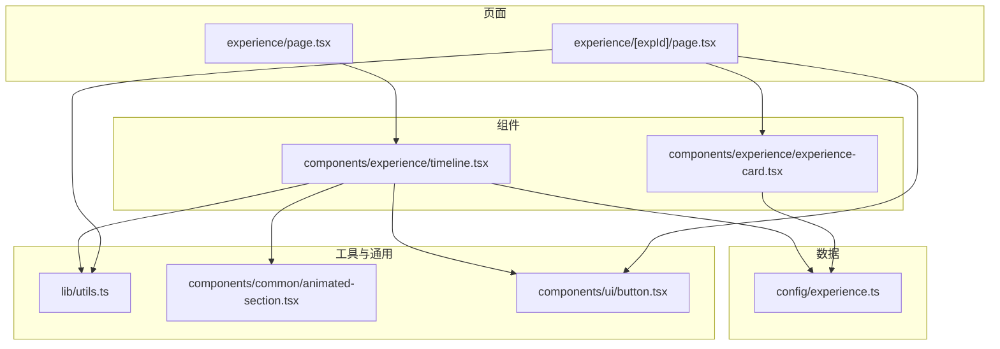
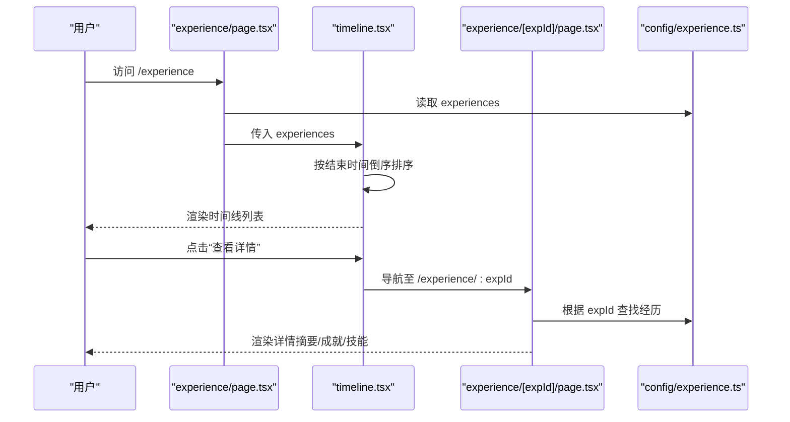
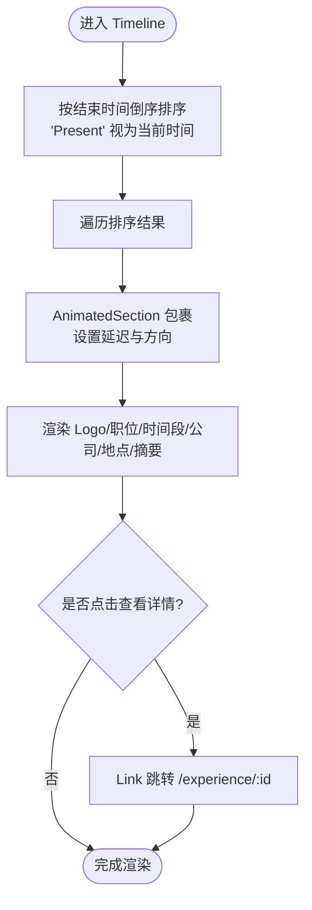
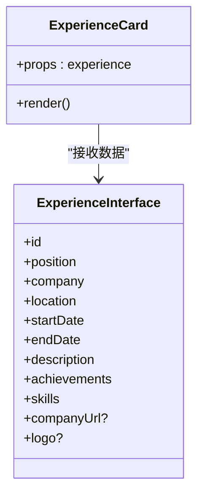
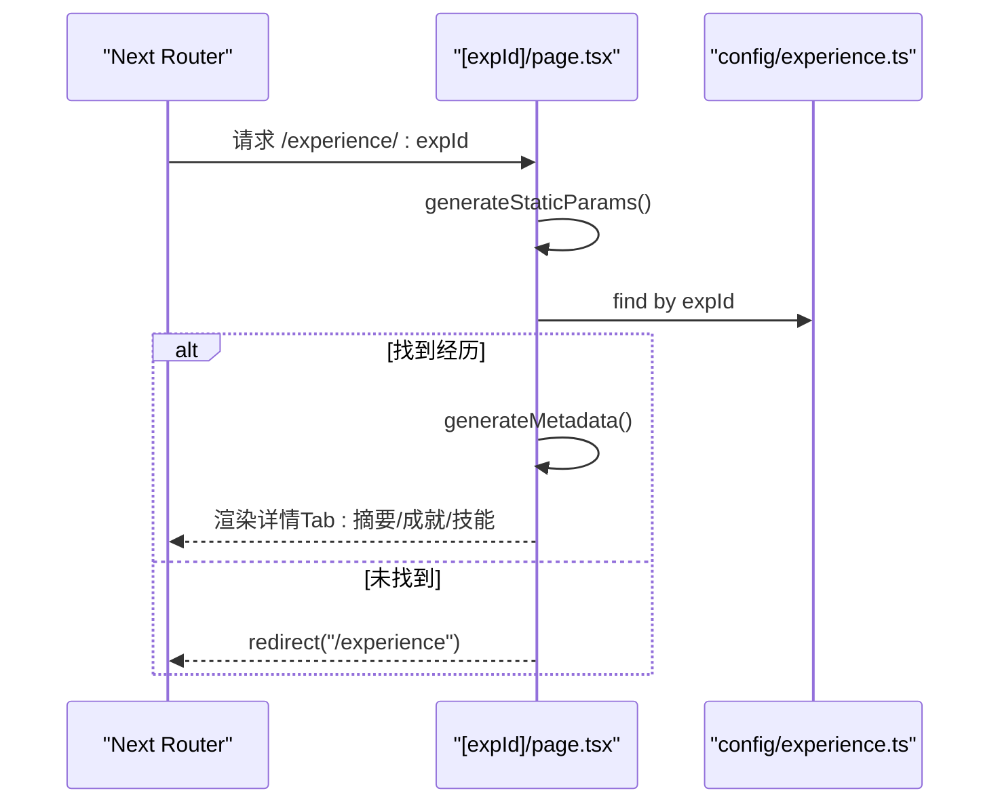
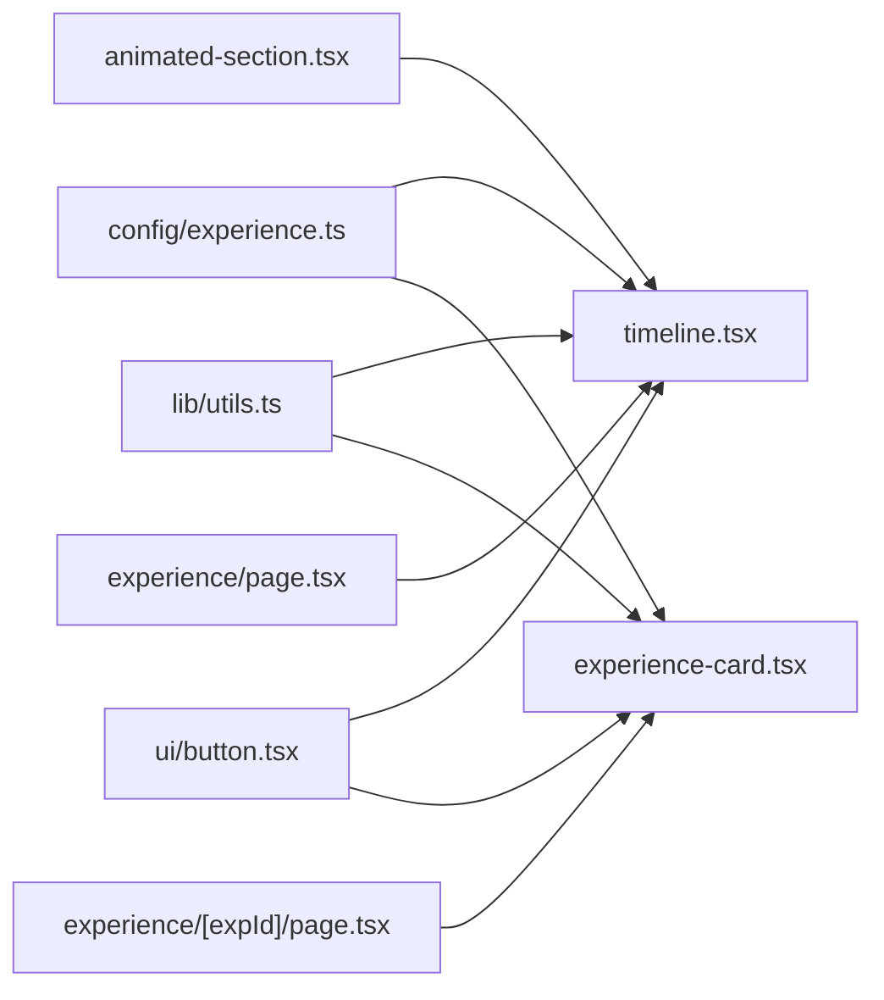

# 工作经历时间线组件

<cite>
**本文引用的文件**
- [timeline.tsx](file://components/experience/timeline.tsx)
- [experience-card.tsx](file://components/experience/experience-card.tsx)
- [experience.ts](file://config/experience.ts)
- [page.tsx](file://app/(root)/experience/page.tsx)
- [utils.ts](file://lib/utils.ts)
- [animated-section.tsx](file://components/common/animated-section.tsx)
- [constants.ts](file://config/constants.ts)
- [button.tsx](file://components/ui/button.tsx)
- [page.tsx](file://app/(root)/experience/[expId]/page.tsx)
</cite>

## 目录
1. [简介](#简介)
2. [项目结构](#项目结构)
3. [核心组件](#核心组件)
4. [架构总览](#架构总览)
5. [详细组件分析](#详细组件分析)
6. [依赖关系分析](#依赖关系分析)
7. [性能考量](#性能考量)
8. [故障排查指南](#故障排查指南)
9. [结论](#结论)
10. [附录：使用示例与最佳实践](#附录使用示例与最佳实践)

## 简介
本组件文档聚焦“工作经历时间线”功能，涵盖 Timeline 列表渲染、ExperienceCard 卡片展示、数据模型与处理、交互与动画、响应式布局、可访问性支持以及主题适配。同时提供完整的使用示例，包括如何新增工作经历条目、自定义样式与异常处理策略。

## 项目结构
该功能由页面路由、数据配置、通用 UI 与动画组件共同组成：
- 页面层：经验列表页与详情页路由
- 组件层：Timeline（时间线列表）、ExperienceCard（单条经历卡片）
- 数据层：ExperienceInterface 类型定义与 experiences 数据源
- 工具层：日期格式化、时长文本生成等
- 通用层：按钮、动画区块、图标等

图表来源
- [page.tsx:24-31](file://app/(root)/experience/page.tsx#L24-L31)
- [timeline.tsx:15-97](file://components/experience/timeline.tsx#L15-L97)
- [experience-card.tsx:14-92](file://components/experience/experience-card.tsx#L14-L92)
- [experience.ts:17-68](file://config/experience.ts#L17-L68)
- [utils.ts:17-28](file://lib/utils.ts#L17-L28)
- [animated-section.tsx:14-50](file://components/common/animated-section.tsx#L14-L50)
- [button.tsx:43-57](file://components/ui/button.tsx#L43-L57)

章节来源
- [page.tsx:24-31](file://app/(root)/experience/page.tsx#L24-L31)
- [timeline.tsx:15-97](file://components/experience/timeline.tsx#L15-L97)
- [experience-card.tsx:14-92](file://components/experience/experience-card.tsx#L14-L92)
- [experience.ts:17-68](file://config/experience.ts#L17-L68)

## 核心组件
- Timeline：接收 experiences 数组，按结束时间倒序排序后逐条渲染，每条包裹在 AnimatedSection 中实现滚动入场动画；展示公司 Logo、职位、公司名、地点、时间段与摘要描述，并提供“查看详情”跳转链接。
- ExperienceCard：用于在详情页或列表中以卡片形式展示单条经历，包含 Logo、职位、公司、地点、时间段、技能标签与“查看详情”按钮。

章节来源
- [timeline.tsx:15-97](file://components/experience/timeline.tsx#L15-L97)
- [experience-card.tsx:14-92](file://components/experience/experience-card.tsx#L14-L92)

## 架构总览
数据流从配置层出发，经页面注入到 Timeline，再由 Timeline 渲染为列表项；点击“查看详情”进入动态路由的详情页，详情页根据 expId 查找对应经历并展示摘要、成就与技术栈。

图表来源
- [page.tsx:24-31](file://app/(root)/experience/page.tsx#L24-L31)
- [timeline.tsx:15-97](file://components/experience/timeline.tsx#L15-L97)
- [page.tsx:48-56](file://app/(root)/experience/[expId]/page.tsx#L48-L56)
- [experience.ts:17-68](file://config/experience.ts#L17-L68)

## 详细组件分析

### Timeline 组件
- 数据组织与排序
  - 将传入的 experiences 复制后按 endDate 降序排列，若 endDate 为 "Present" 则视为当前时间参与排序，确保最新经历置顶。
- 渲染逻辑
  - 遍历排序后的数据，每个条目使用 AnimatedSection 包裹，设置延迟与方向，实现滚动时自下而上的渐入效果。
  - 内容区域包含：Logo、职位、时间段、公司名与外链、地点、首段描述摘要、“查看详情”按钮。
- 交互与导航
  - “查看详情”通过 Next.js Link 跳转到 /experience/:id，详情页根据 id 渲染详细内容。
- 响应式设计
  - 使用 Tailwind 断点控制布局：移动端纵向堆叠，桌面端横向布局；图片尺寸与字号随屏幕自适应。
- 可访问性与主题
  - 使用语义化标题与段落；外链带 rel="noopener noreferrer"；颜色与背景基于主题变量（如 background、border、foreground），配合 Button 组件的主题变体。
- 动画效果
  - 借助 AnimatedSection 的 motion 能力，结合 viewport 触发条件与 easeOut 缓动，提升滚动体验。

图表来源
- [timeline.tsx:15-97](file://components/experience/timeline.tsx#L15-L97)
- [animated-section.tsx:14-50](file://components/common/animated-section.tsx#L14-L50)

章节来源
- [timeline.tsx:15-97](file://components/experience/timeline.tsx#L15-L97)
- [animated-section.tsx:14-50](file://components/common/animated-section.tsx#L14-L50)

### ExperienceCard 组件
- 展示模式
  - 以卡片容器承载 Logo、职位、公司、地点、时间段、前两条技能标签与“查看更多”提示、以及“查看详情”按钮。
- 状态管理
  - 无内部状态，纯展示型组件，所有数据来自 props。
- 动画与响应式
  - 通过外层容器的过渡类实现 hover 与焦点态；布局在小屏与大屏间切换；技能标签采用弹性换行。
- 可访问性与主题
  - 外链具备安全属性；颜色与边框跟随主题变量；按钮使用统一样式系统。

图表来源
- [experience-card.tsx:14-92](file://components/experience/experience-card.tsx#L14-L92)
- [experience.ts:3-15](file://config/experience.ts#L3-L15)

章节来源
- [experience-card.tsx:14-92](file://components/experience/experience-card.tsx#L14-L92)
- [experience.ts:3-15](file://config/experience.ts#L3-L15)

### 详情页流程（Experience Detail）
- 静态参数生成：根据 experiences 列表生成所有 expId 的静态路由参数。
- 元信息生成：根据 expId 查找经历，构造页面标题与描述。
- 渲染逻辑：若未找到经历则重定向回 /experience；否则展示头部信息（Logo、职位、公司、地点、时间段）与三个 Tab（摘要、成就、技能）。
- 交互：返回按钮与“查看全部经历”按钮均通过 Link 导航。

图表来源
- [page.tsx:23-56](file://app/(root)/experience/[expId]/page.tsx#L23-L56)
- [experience.ts:17-68](file://config/experience.ts#L17-L68)

章节来源
- [page.tsx:23-56](file://app/(root)/experience/[expId]/page.tsx#L23-L56)
- [experience.ts:17-68](file://config/experience.ts#L17-L68)

## 依赖关系分析
- 数据依赖
  - Timeline 与 ExperienceCard 均依赖 ExperienceInterface 类型与 experiences 数据源。
- 工具依赖
  - getDurationText 用于生成“起始年 - 结束年/Present”的时长文本。
- UI 与动画依赖
  - Button 提供统一的交互入口；AnimatedSection 提供滚动入场动画；Icons 提供外链与箭头图标。
- 页面依赖
  - 列表页负责组装数据并传递给 Timeline；详情页负责根据 ID 检索并渲染详情。

图表来源
- [experience.ts:17-68](file://config/experience.ts#L17-L68)
- [utils.ts:17-28](file://lib/utils.ts#L17-L28)
- [animated-section.tsx:14-50](file://components/common/animated-section.tsx#L14-L50)
- [button.tsx:43-57](file://components/ui/button.tsx#L43-L57)
- [page.tsx:24-31](file://app/(root)/experience/page.tsx#L24-L31)
- [page.tsx:48-56](file://app/(root)/experience/[expId]/page.tsx#L48-L56)

章节来源
- [experience.ts:17-68](file://config/experience.ts#L17-L68)
- [utils.ts:17-28](file://lib/utils.ts#L17-L28)
- [animated-section.tsx:14-50](file://components/common/animated-section.tsx#L14-L50)
- [button.tsx:43-57](file://components/ui/button.tsx#L43-L57)
- [page.tsx:24-31](file://app/(root)/experience/page.tsx#L24-L31)
- [page.tsx:48-56](file://app/(root)/experience/[expId]/page.tsx#L48-L56)

## 性能考量
- 排序开销：每次渲染都会对 experiences 进行排序，建议在父级缓存排序结果或使用 useMemo 优化（如需）。
- 图片加载：Logo 使用固定宽高与 object-contain，避免布局抖动；建议按需懒加载或启用 Next/Image 优化。
- 动画触发：AnimatedSection 使用 once 与视口阈值，避免重复动画；大量条目时注意滚动性能。
- 路由预取：详情页使用静态参数生成，利于构建期优化与 SEO。

[本节为通用性能建议，不直接分析具体文件]

## 故障排查指南
- 详情页 404 或重定向
  - 现象：访问 /experience/:expId 被重定向回 /experience。
  - 原因：未在 experiences 中找到对应 id。
  - 处理：检查 config/experience.ts 中的 id 是否与路由一致；必要时在详情页增加友好提示。
- 时间显示异常
  - 现象：时间段显示不正确或出现 NaN。
  - 原因：startDate/endDate 格式不符合预期或 endDate 非 Date/"Present"。
  - 处理：确保使用 new Date("YYYY-MM-DD") 或字符串 "Present"；校验 getDurationText 输入。
- 排序不符合预期
  - 现象：最新经历未置顶。
  - 原因：endDate 为 "Present" 时的比较逻辑或数据本身顺序问题。
  - 处理：确认排序逻辑中将 "Present" 视为当前时间；必要时在数据层维护 sortOrder 字段。
- 外链安全问题
  - 现象：外链点击存在安全风险。
  - 处理：确保 target="_blank" 搭配 rel="noopener noreferrer"。
- 动画不触发
  - 现象：滚动时无入场动画。
  - 原因：AnimatedSection 的 viewport 阈值或父容器高度限制。
  - 处理：检查父容器是否允许滚动；调整 margin 或禁用 once 测试。

章节来源
- [page.tsx:48-56](file://app/(root)/experience/[expId]/page.tsx#L48-L56)
- [utils.ts:17-28](file://lib/utils.ts#L17-L28)
- [timeline.tsx:15-21](file://components/experience/timeline.tsx#L15-L21)
- [animated-section.tsx:30-46](file://components/common/animated-section.tsx#L30-L46)

## 结论
Timeline 与 ExperienceCard 组合提供了清晰、可扩展的工作经历展示方案。通过集中化的数据模型与工具函数，实现了良好的可维护性与一致性；结合响应式与动画，提升了用户体验。详情页通过静态参数与元信息生成，兼顾了 SEO 与性能。整体架构简洁、职责清晰，便于后续扩展与定制。

[本节为总结性内容，不直接分析具体文件]

## 附录：使用示例与最佳实践

- 新增工作经历条目
  - 在 config/experience.ts 中添加一条符合 ExperienceInterface 的对象，确保 id 唯一、日期有效、skills 属于 ValidSkills 集合。
  - 若需要外链与 Logo，补充 companyUrl 与 logo 字段。
  - 列表页会自动排序并渲染；详情页可通过 /experience/:id 访问。

- 自定义时间线样式
  - 修改 timeline.tsx 中容器与卡片的 Tailwind 类，例如间距、圆角、边框、阴影等。
  - 调整 AnimatedSection 的 delay 与 direction，以获得更丰富的入场效果。
  - 通过主题变量（background、border、foreground、primary 等）保持与全局主题一致。

- 处理异常情况
  - 详情页：当找不到对应经历时已实现重定向；可在重定向前添加 Toast 提示。
  - 数据校验：在新增条目时进行基本校验（必填字段、日期范围、技能白名单）。
  - 外链安全：始终为外部链接添加 rel="noopener noreferrer"。

- 事件绑定机制
  - 列表项“查看详情”通过 Next.js Link 进行客户端导航，无需额外事件监听。
  - 外链通过原生 a 标签打开新窗口，遵循安全规范。

- 可访问性支持
  - 使用语义化标签（h3、p、a）；为图片提供 alt；外链具备安全属性；按钮具备焦点样式。
  - 动画不影响键盘导航与屏幕阅读器阅读。

- 主题适配
  - 所有颜色与边框均基于主题变量，切换主题时自动适配。
  - 按钮使用统一样式系统，保证一致的交互反馈。

章节来源
- [experience.ts:3-15](file://config/experience.ts#L3-L15)
- [experience.ts:17-68](file://config/experience.ts#L17-L68)
- [timeline.tsx:23-94](file://components/experience/timeline.tsx#L23-L94)
- [animated-section.tsx:14-50](file://components/common/animated-section.tsx#L14-L50)
- [page.tsx:48-56](file://app/(root)/experience/[expId]/page.tsx#L48-L56)
- [button.tsx:43-57](file://components/ui/button.tsx#L43-L57)