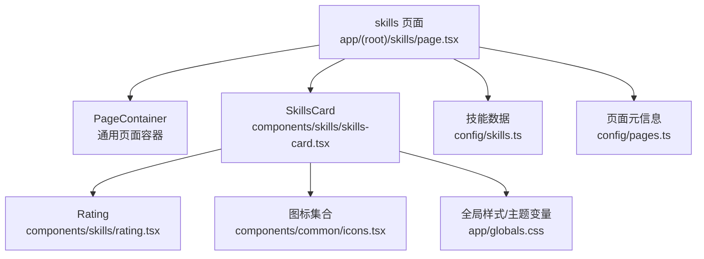
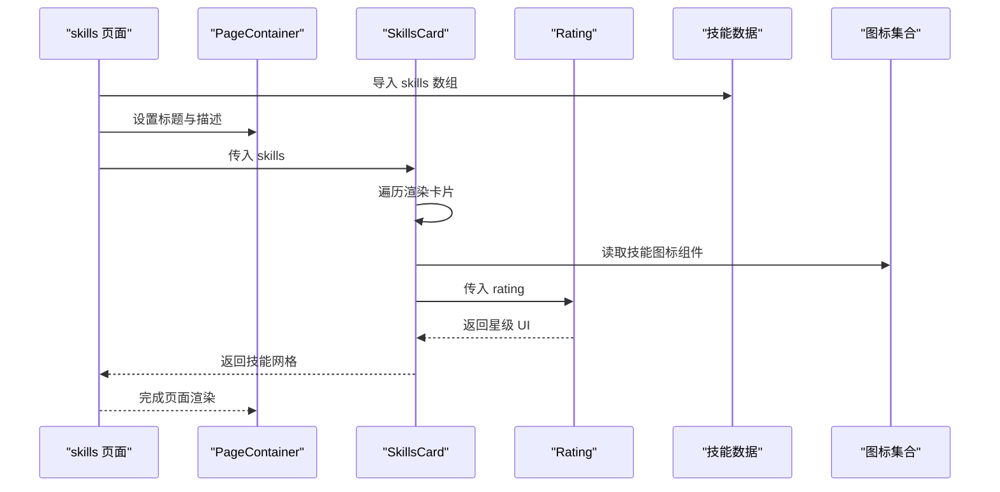
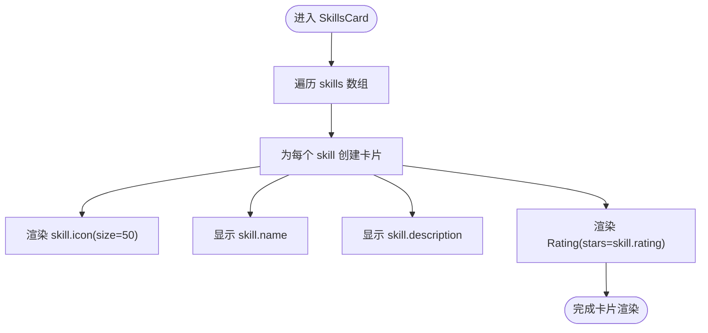
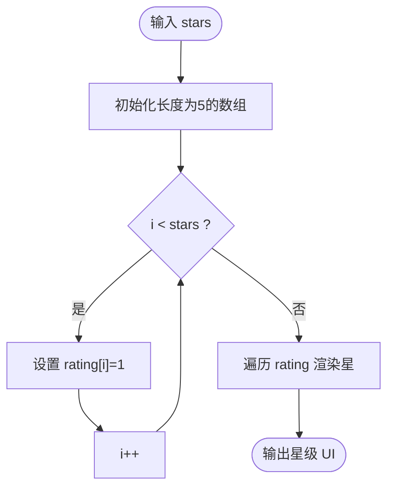
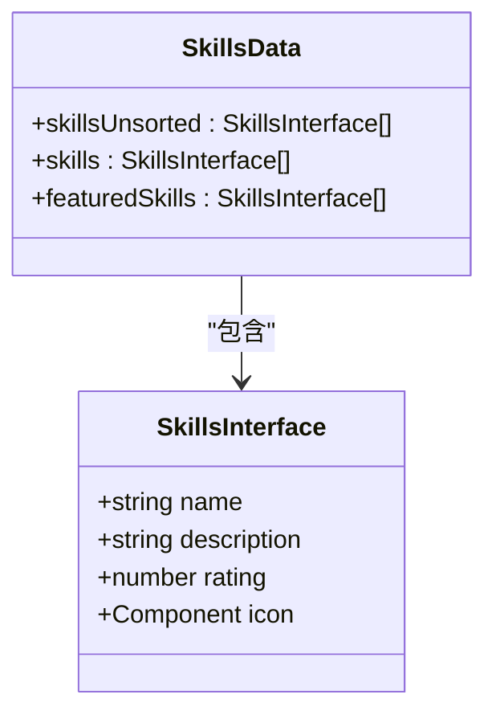
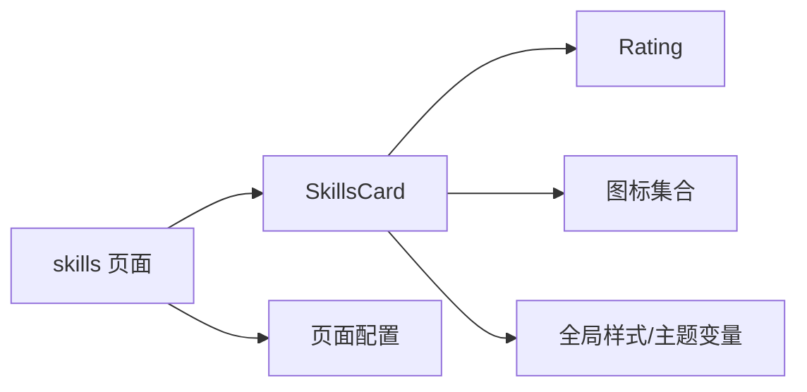

# 技能展示组件

<cite>
**本文引用的文件**
- [skills-card.tsx](file://components/skills/skills-card.tsx)
- [rating.tsx](file://components/skills/rating.tsx)
- [skills.ts](file://config/skills.ts)
- [page.tsx](file://app/(root)/skills/page.tsx)
- [icons.tsx](file://components/common/icons.tsx)
- [globals.css](file://app/globals.css)
- [pages.ts](file://config/pages.ts)
</cite>

## 目录
1. [简介](#简介)
2. [项目结构](#项目结构)
3. [核心组件](#核心组件)
4. [架构总览](#架构总览)
5. [详细组件分析](#详细组件分析)
6. [依赖关系分析](#依赖关系分析)
7. [性能与优化](#性能与优化)
8. [故障排查](#故障排查)
9. [结论](#结论)
10. [附录：使用示例与扩展指南](#附录使用示例与扩展指南)

## 简介
本文件为“技能展示组件”的完整技术文档，聚焦 SkillsCard 组件的技能分类展示逻辑、Rating 组件的熟练度评级实现、以及技能数据的可视化呈现。文档涵盖技能等级系统的设计模式、评分算法、动画效果与用户交互，并说明技能数据配置结构、动态加载机制、主题切换支持与响应式布局。文末提供实际使用示例，指导如何添加新技能、自定义评分样式与优化渲染性能。

## 项目结构
技能页面由 Next.js App Router 路由承载，通过 PageContainer 包裹标题与描述，SkillsCard 负责渲染技能卡片网格，Rating 负责星级评分显示。技能数据集中定义在配置文件中，图标统一来自公共图标库。

图表来源
- [page.tsx:1-23](file://app/(root)/skills/page.tsx#L1-L23)
- [skills-card.tsx:1-31](file://components/skills/skills-card.tsx#L1-L31)
- [rating.tsx:1-41](file://components/skills/rating.tsx#L1-L41)
- [skills.ts:1-154](file://config/skills.ts#L1-L154)
- [icons.tsx:1-218](file://components/common/icons.tsx#L1-L218)
- [pages.ts:1-81](file://config/pages.ts#L1-L81)
- [globals.css:1-761](file://app/globals.css#L1-L761)

章节来源
- [page.tsx:1-23](file://app/(root)/skills/page.tsx#L1-L23)
- [skills-card.tsx:1-31](file://components/skills/skills-card.tsx#L1-L31)
- [skills.ts:1-154](file://config/skills.ts#L1-L154)
- [icons.tsx:1-218](file://components/common/icons.tsx#L1-L218)
- [pages.ts:1-81](file://config/pages.ts#L1-L81)
- [globals.css:1-761](file://app/globals.css#L1-L761)

## 核心组件
- SkillsCard：接收技能数组，按响应式网格布局渲染每个技能的卡片，包含图标、名称、描述与 Rating 星级。
- Rating：根据传入的星级数值（0-5）渲染对应数量的实心星与空心星。
- 技能数据：集中定义在配置中，包含名称、描述、评分与图标引用，并提供排序后的导出与精选列表。

章节来源
- [skills-card.tsx:1-31](file://components/skills/skills-card.tsx#L1-L31)
- [rating.tsx:1-41](file://components/skills/rating.tsx#L1-L41)
- [skills.ts:1-154](file://config/skills.ts#L1-L154)

## 架构总览
技能页面的渲染流程如下：页面组件从配置导入技能数据，传递给 SkillsCard；SkillsCard 遍历数据并渲染卡片；每个卡片内调用 Rating 进行星级展示；所有视觉样式基于 Tailwind 与全局 CSS 主题变量，支持多主题切换。

图表来源
- [page.tsx:1-23](file://app/(root)/skills/page.tsx#L1-L23)
- [skills-card.tsx:1-31](file://components/skills/skills-card.tsx#L1-L31)
- [rating.tsx:1-41](file://components/skills/rating.tsx#L1-L41)
- [skills.ts:1-154](file://config/skills.ts#L1-L154)
- [icons.tsx:1-218](file://components/common/icons.tsx#L1-L218)

## 详细组件分析

### SkillsCard 组件
- 职责：接收技能数组，构建响应式网格布局，渲染每个技能的卡片。
- 布局策略：使用网格列数随屏幕宽度变化，保证移动端到桌面端的适配。
- 内容组织：每个卡片包含图标、名称、描述与星级评分区域。
- 可访问性：为图标提供 aria-hidden 属性，避免屏幕阅读器重复朗读装饰性元素。

图表来源
- [skills-card.tsx:1-31](file://components/skills/skills-card.tsx#L1-L31)
- [rating.tsx:1-41](file://components/skills/rating.tsx#L1-L41)

章节来源
- [skills-card.tsx:1-31](file://components/skills/skills-card.tsx#L1-L31)

### Rating 组件
- 职责：将数字评分转换为可视化的星级条。
- 评分算法：创建一个长度为 5 的数组，按传入 stars 数量填充前 N 个位置为“已点亮”，其余为“未点亮”。
- 视觉表现：已点亮星使用高亮色，未点亮星使用中性色；尺寸固定，间距一致。
- 复杂度：时间 O(N)（N=5），空间 O(1)。

图表来源
- [rating.tsx:1-41](file://components/skills/rating.tsx#L1-L41)

章节来源
- [rating.tsx:1-41](file://components/skills/rating.tsx#L1-L41)

### 技能数据模型与配置
- 数据结构：每项包含 name、description、rating、icon。
- 排序与精选：导出时按评分降序排序，并提供精选前若干项用于首页或摘要展示。
- 图标来源：通过统一的图标集合对象引用具体图标组件，便于统一管理。

图表来源
- [skills.ts:1-154](file://config/skills.ts#L1-L154)
- [icons.tsx:1-218](file://components/common/icons.tsx#L1-L218)

章节来源
- [skills.ts:1-154](file://config/skills.ts#L1-L154)
- [icons.tsx:1-218](file://components/common/icons.tsx#L1-L218)

### 页面集成与元信息
- 页面组件：从配置导入技能数据，设置页面标题与描述，并将数据传递给 SkillsCard。
- 元信息：通过 pagesConfig 统一管理各页面的标题与描述，确保 SEO 一致性。

章节来源
- [page.tsx:1-23](file://app/(root)/skills/page.tsx#L1-L23)
- [pages.ts:1-81](file://config/pages.ts#L1-L81)

## 依赖关系分析
- SkillsCard 依赖 Rating 与图标集合，同时受全局样式影响。
- Rating 仅依赖基础 SVG 图标与样式类。
- 技能数据集中管理，便于维护与扩展。
- 页面层负责装配与元信息注入。

图表来源
- [page.tsx:1-23](file://app/(root)/skills/page.tsx#L1-L23)
- [skills-card.tsx:1-31](file://components/skills/skills-card.tsx#L1-L31)
- [rating.tsx:1-41](file://components/skills/rating.tsx#L1-L41)
- [icons.tsx:1-218](file://components/common/icons.tsx#L1-L218)
- [pages.ts:1-81](file://config/pages.ts#L1-L81)
- [globals.css:1-761](file://app/globals.css#L1-L761)

章节来源
- [page.tsx:1-23](file://app/(root)/skills/page.tsx#L1-L23)
- [skills-card.tsx:1-31](file://components/skills/skills-card.tsx#L1-L31)
- [rating.tsx:1-41](file://components/skills/rating.tsx#L1-L41)
- [icons.tsx:1-218](file://components/common/icons.tsx#L1-L218)
- [pages.ts:1-81](file://config/pages.ts#L1-L81)
- [globals.css:1-761](file://app/globals.css#L1-L761)

## 性能与优化
- 渲染复杂度：SkillsCard 对 n 个技能进行线性遍历，时间复杂度 O(n)；Rating 固定为 5 颗星，时间复杂度 O(1)。
- 内存占用：Rating 内部数组长度固定为 5，空间开销极小。
- 图标复用：图标以组件形式引用，避免重复定义，利于 Tree Shaking。
- 主题变量：通过 CSS 变量控制颜色与圆角等，减少运行时计算。
- 建议优化：
  - 若技能数量较大，可对 SkillsCard 增加虚拟滚动或分页加载。
  - 对 Rating 可考虑缓存星级结果，避免重复计算。
  - 使用 React.memo 包裹 Rating 以减少不必要的重渲染。
  - 图片/图标懒加载与预加载结合，提升首屏性能。

[本节为通用性能讨论，不直接分析具体代码行]

## 故障排查
- 星级显示异常：检查传入 stars 是否为有效数字且范围在 0-5；确认 Rating 内部循环边界正确。
- 图标不显示：确认图标集合中存在对应键值，并确保组件类型签名兼容。
- 主题颜色不正确：检查根节点是否应用了正确的主题类名，确认 CSS 变量已生效。
- 响应式布局错乱：检查网格列断点与容器宽度设置，必要时调整 Tailwind 类名。

章节来源
- [rating.tsx:1-41](file://components/skills/rating.tsx#L1-L41)
- [icons.tsx:1-218](file://components/common/icons.tsx#L1-L218)
- [globals.css:1-761](file://app/globals.css#L1-L761)

## 结论
该技能展示组件采用简洁的数据驱动与组件化设计，SkillsCard 负责布局与组合，Rating 专注星级可视化，技能数据集中管理便于维护。通过 Tailwind 与全局 CSS 变量实现主题切换与响应式布局，满足多端展示需求。整体架构清晰、易于扩展，适合在个人作品集或简历站点中使用。

[本节为总结性内容，不直接分析具体代码行]

## 附录：使用示例与扩展指南

### 添加新技能
- 在技能配置中添加新条目，包含名称、描述、评分与图标引用。
- 如需新增图标，先在图标集合中注册对应图标组件，再在配置中引用。
- 页面会自动重新渲染，无需修改组件代码。

章节来源
- [skills.ts:1-154](file://config/skills.ts#L1-L154)
- [icons.tsx:1-218](file://components/common/icons.tsx#L1-L218)

### 自定义评分样式
- 通过全局样式中的主题变量调整星级颜色与尺寸。
- 可在 Rating 组件中替换 SVG 图标或引入第三方图标库。
- 如需半星或更细粒度评分，可扩展 Rating 的算法与渲染逻辑。

章节来源
- [rating.tsx:1-41](file://components/skills/rating.tsx#L1-L41)
- [globals.css:1-761](file://app/globals.css#L1-L761)

### 优化渲染性能
- 对大量技能列表启用分页或虚拟滚动。
- 使用 memoization 缓存 Rating 与卡片渲染结果。
- 延迟加载非关键资源（如大图或复杂图标）。

[本节为通用优化建议，不直接分析具体代码行]

### 主题切换支持
- 通过在全局样式中定义多个主题类名，并在根节点切换类名实现主题切换。
- 技能卡片与 Rating 自动继承主题变量，无需额外改动。

章节来源
- [globals.css:1-761](file://app/globals.css#L1-L761)

### 响应式布局
- SkillsCard 使用网格布局，在不同断点下自动调整列数。
- 可通过 Tailwind 类名进一步定制间距与对齐方式。

章节来源
- [skills-card.tsx:1-31](file://components/skills/skills-card.tsx#L1-L31)