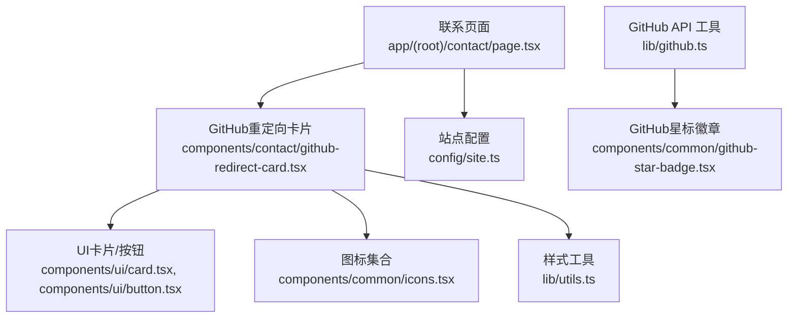
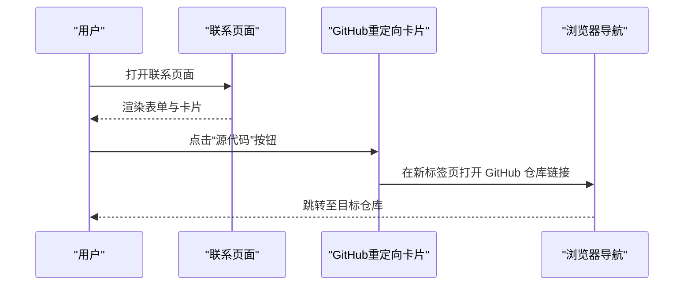
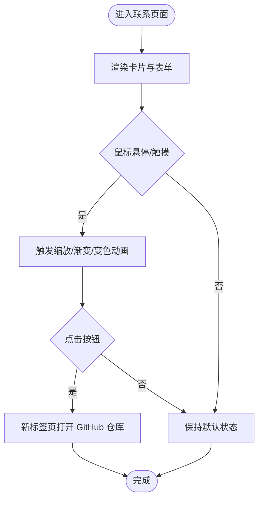
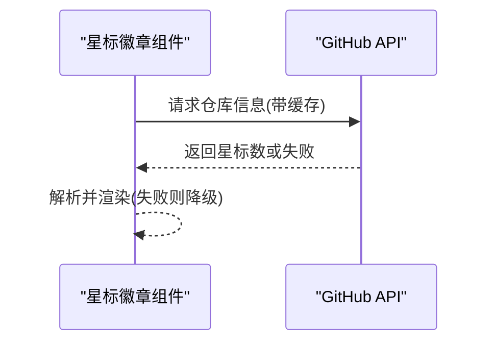
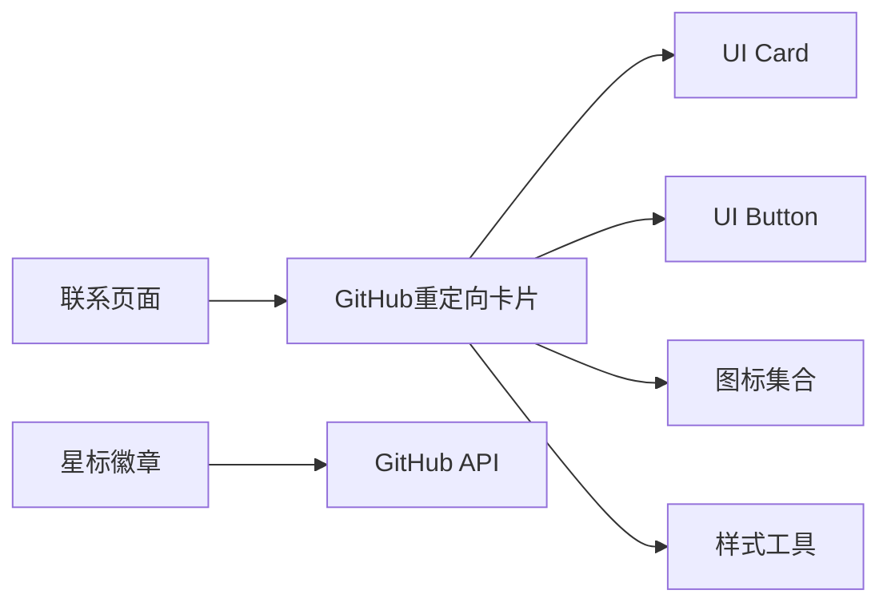

# 联系GitHub重定向组件

<cite>
**本文引用的文件**
- [github-redirect-card.tsx](file://components/contact/github-redirect-card.tsx)
- [contact/page.tsx](file://app/(root)/contact/page.tsx)
- [icons.tsx](file://components/common/icons.tsx)
- [card.tsx](file://components/ui/card.tsx)
- [button.tsx](file://components/ui/button.tsx)
- [utils.ts](file://lib/utils.ts)
- [site.ts](file://config/site.ts)
- [github.ts](file://lib/github.ts)
- [socials.ts](file://config/socials.ts)
</cite>

## 目录
1. [简介](#简介)
2. [项目结构](#项目结构)
3. [核心组件](#核心组件)
4. [架构总览](#架构总览)
5. [详细组件分析](#详细组件分析)
6. [依赖关系分析](#依赖关系分析)
7. [性能考虑](#性能考虑)
8. [故障排查指南](#故障排查指南)
9. [结论](#结论)
10. [附录：使用示例与配置](#附录使用示例与配置)

## 简介
本文件围绕“联系”页面中的 GitHub 重定向卡片组件，系统说明其重定向逻辑、用户交互体验、动画效果、社交媒体集成方式，以及与 GitHub API 的协作。文档还涵盖链接生成机制、安全考量、可访问性支持、主题适配，并提供实际使用示例，展示如何配置不同的 GitHub 仓库链接、自定义重定向行为，并将其集成到联系页面中。

## 项目结构
该功能由以下关键部分组成：
- 联系页面容器：负责布局与元数据，并嵌入 GitHub 重定向卡片。
- GitHub 重定向卡片：提供视觉呈现、交互按钮与重定向目标。
- 图标与 UI 基础组件：提供一致的样式与可访问性语义。
- 站点配置与工具函数：集中管理链接、工具方法等。
- GitHub API 集成（可选）：用于获取模板仓库星标数，增强社交证明。

图表来源
- [contact/page.tsx:13-28](file://app/(root)/contact/page.tsx#L13-L28)
- [github-redirect-card.tsx:9-42](file://components/contact/github-redirect-card.tsx#L9-L42)
- [card.tsx:5-77](file://components/ui/card.tsx#L5-L77)
- [button.tsx:7-57](file://components/ui/button.tsx#L7-L57)
- [icons.tsx:90-186](file://components/common/icons.tsx#L90-L186)
- [utils.ts:4-6](file://lib/utils.ts#L4-L6)
- [site.ts:1-12](file://config/site.ts#L1-L12)
- [github.ts:1-33](file://lib/github.ts#L1-L33)

章节来源
- [contact/page.tsx:1-30](file://app/(root)/contact/page.tsx#L1-L30)
- [github-redirect-card.tsx:1-43](file://components/contact/github-redirect-card.tsx#L1-L43)

## 核心组件
- GitHub 重定向卡片：以卡片形式展示引导文案、GitHub 图标与“源代码”按钮；点击后在新标签页打开指定 GitHub 仓库链接。
- 联系页面：将卡片与联系表单并列展示，形成“沟通 + 开源探索”的组合体验。
- 图标与 UI 组件：通过统一图标与基础 UI 组件保证一致性与可访问性。
- 站点配置：集中管理 GitHub 相关链接，便于全局维护。
- GitHub API 工具：按需拉取模板仓库星标数，提升社交证明（非重定向必需）。

章节来源
- [github-redirect-card.tsx:9-42](file://components/contact/github-redirect-card.tsx#L9-L42)
- [contact/page.tsx:13-28](file://app/(root)/contact/page.tsx#L13-L28)
- [site.ts:1-12](file://config/site.ts#L1-L12)
- [github.ts:1-33](file://lib/github.ts#L1-L33)

## 架构总览
GitHub 重定向卡片在联系页面中以侧边模块形式存在，承担“引导用户前往 GitHub 仓库”的职责。其重定向目标来源于组件内硬编码的链接；若需动态化，可通过站点配置或环境变量注入。GitHub API 集成主要用于其他位置的星标徽章展示，与卡片重定向解耦。

图表来源
- [contact/page.tsx:13-28](file://app/(root)/contact/page.tsx#L13-L28)
- [github-redirect-card.tsx:27-37](file://components/contact/github-redirect-card.tsx#L27-L37)

## 详细组件分析

### GitHub 重定向卡片
- 重定向逻辑
  - 通过 Next.js Link 组件实现外部链接跳转，target="_blank" 在新标签页打开。
  - 当前链接为硬编码的 GitHub 仓库地址；如需多仓库或多场景，建议抽取到站点配置或环境变量中，以便统一管理。
- 用户交互体验
  - 卡片整体具备 hover 缩放与底部渐变条显隐的过渡效果，增强反馈感。
  - 心形图标在 hover 时变色，强化“喜欢/收藏”的心理暗示。
  - 按钮采用 outline 风格，配合宽幅布局与图标，突出行动点。
- 动画效果
  - 使用 Tailwind 的 transition 与 duration 控制平滑过渡。
  - 利用 group 选择器在触摸设备上保持与 hover 一致的交互一致性。
- 社交媒体集成
  - 使用内置 GitHub 图标，确保品牌一致性。
  - 可与站点配置中的 GitHub 链接保持一致，避免多处维护成本。
- 链接生成机制
  - 当前为静态字符串；推荐改为从 siteConfig.links.templateRepo 或环境变量读取，提高可维护性。
- 安全考虑
  - 外部链接使用 target="_blank"，建议配合 rel="noopener noreferrer" 防止反向标签页劫持（可在升级时添加）。
  - 链接来源应受控，避免拼接不可信的用户输入。
- 可访问性支持
  - 按钮作为 Link 元素，具备键盘可聚焦与屏幕阅读器友好。
  - 图标通过 aria-hidden 隐藏装饰性内容，避免干扰读屏。
- 主题适配
  - 使用语义化颜色变量（如 text-muted-foreground），自动适配明暗主题。
  - 边框与背景色基于主题 token，确保对比度与可读性。

图表来源
- [github-redirect-card.tsx:11-40](file://components/contact/github-redirect-card.tsx#L11-L40)

章节来源
- [github-redirect-card.tsx:1-43](file://components/contact/github-redirect-card.tsx#L1-L43)
- [icons.tsx:170-186](file://components/common/icons.tsx#L170-L186)
- [card.tsx:5-77](file://components/ui/card.tsx#L5-L77)
- [button.tsx:7-57](file://components/ui/button.tsx#L7-L57)
- [utils.ts:4-6](file://lib/utils.ts#L4-L6)

### 联系页面集成
- 布局：左右分栏，左侧为联系表单，右侧为 GitHub 重定向卡片。
- 元数据：通过 pagesConfig 设置标题与描述，利于 SEO。
- 组合：将卡片与表单并列，既提供沟通渠道，又引导开源参与。

章节来源
- [contact/page.tsx:1-30](file://app/(root)/contact/page.tsx#L1-L30)
- [pages.ts:40-47](file://config/pages.ts#L40-L47)

### GitHub API 集成（星标徽章）
- 作用：获取模板仓库星标数量，用于社交证明。
- 缓存策略：通过 next.revalidate 进行服务端缓存，降低请求频率。
- 错误处理：网络异常或非 2xx 响应返回空值，前端降级显示。
- 与卡片的关系：两者解耦；卡片专注重定向，API 仅用于展示星标数。

图表来源
- [github.ts:12-32](file://lib/github.ts#L12-L32)
- [github-star-badge.tsx:12-39](file://components/common/github-star-badge.tsx#L12-L39)

章节来源
- [github.ts:1-33](file://lib/github.ts#L1-L33)
- [github-star-badge.tsx:1-40](file://components/common/github-star-badge.tsx#L1-L40)

## 依赖关系分析
- 组件耦合
  - 卡片依赖 UI 基础组件（Card/Button）、图标库与样式工具，耦合度低且职责单一。
  - 联系页面仅负责布局与元数据，对卡片无侵入式依赖。
- 外部依赖
  - Next.js Link 用于路由与外链跳转。
  - Tailwind 类名驱动样式与动画。
  - GitHub API 仅在星标徽章中使用，与卡片解耦。
- 潜在循环依赖
  - 未发现循环引用；各模块职责清晰。

图表来源
- [github-redirect-card.tsx:1-43](file://components/contact/github-redirect-card.tsx#L1-L43)
- [card.tsx:5-77](file://components/ui/card.tsx#L5-L77)
- [button.tsx:7-57](file://components/ui/button.tsx#L7-L57)
- [icons.tsx:90-186](file://components/common/icons.tsx#L90-L186)
- [utils.ts:4-6](file://lib/utils.ts#L4-L6)
- [github.ts:12-32](file://lib/github.ts#L12-L32)

章节来源
- [github-redirect-card.tsx:1-43](file://components/contact/github-redirect-card.tsx#L1-L43)
- [contact/page.tsx:1-30](file://app/(root)/contact/page.tsx#L1-L30)
- [github.ts:1-33](file://lib/github.ts#L1-L33)

## 性能考虑
- 首屏渲染：卡片为纯客户端组件，无额外数据请求，不影响首屏性能。
- 动画性能：使用 CSS 过渡与 transform，GPU 加速友好。
- 外部链接：新标签页打开，不阻塞主线程。
- API 调用：星标徽章使用服务端缓存，减少重复请求。

[本节为通用指导，无需具体文件引用]

## 故障排查指南
- 链接无效或跳转失败
  - 检查组件内的链接是否被修改或拼写错误。
  - 若改为动态链接，确认配置项是否正确加载。
- 主题不一致
  - 确认使用了语义化颜色变量，避免硬编码颜色。
- 可访问性问题
  - 确保外部链接具备合适的 rel 属性（如 noopener noreferrer）。
  - 图标使用 aria-hidden 避免读屏干扰。
- API 异常
  - 网络错误或 GitHub 限流时，徽章会降级显示；检查网络与缓存策略。

章节来源
- [github-redirect-card.tsx:27-37](file://components/contact/github-redirect-card.tsx#L27-L37)
- [github.ts:12-32](file://lib/github.ts#L12-L32)

## 结论
GitHub 重定向卡片以简洁直观的方式引导用户前往仓库，具备良好的交互与动画反馈，并与站点主题和可访问性规范保持一致。通过将链接来源集中化管理，可进一步提升可维护性与安全性。GitHub API 集成与卡片解耦，分别承担社交证明与重定向职责，架构清晰、易于扩展。

[本节为总结性内容，无需具体文件引用]

## 附录：使用示例与配置
- 基本用法
  - 在联系页面中直接引入并使用 GitHub 重定向卡片，与联系表单并列展示。
- 配置不同仓库链接
  - 方案一：将链接放入站点配置的 links.templateRepo，并在卡片中读取，便于全局维护。
  - 方案二：通过环境变量注入链接，部署时灵活切换。
- 自定义重定向行为
  - 如需在同一卡片中展示多个仓库，可增加按钮组或下拉菜单，按场景跳转到不同仓库。
  - 可为不同按钮设置不同的 rel 与 target，满足安全与体验需求。
- 集成到联系页面
  - 在联系页面中保留现有布局，将卡片置于右侧区域，确保移动端堆叠显示。
- 可访问性与主题
  - 为所有可交互元素提供键盘可达与焦点可见。
  - 使用语义化颜色与对比度，确保明暗主题下均易读。
- 与 GitHub API 的结合
  - 在需要处加入星标徽章，展示仓库热度；与卡片互不干扰。

章节来源
- [contact/page.tsx:13-28](file://app/(root)/contact/page.tsx#L13-L28)
- [site.ts:1-12](file://config/site.ts#L1-L12)
- [github.ts:12-32](file://lib/github.ts#L12-L32)
- [github-star-badge.tsx:12-39](file://components/common/github-star-badge.tsx#L12-L39)