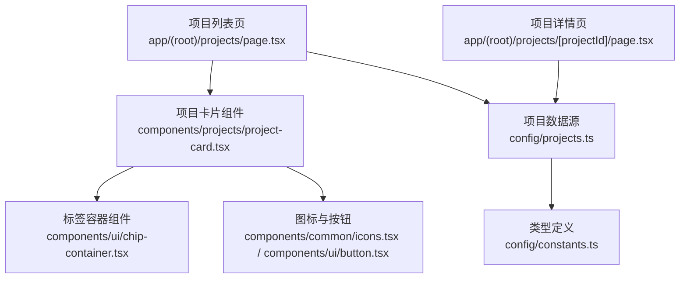
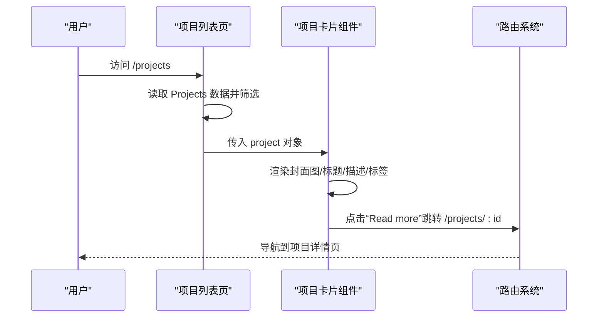
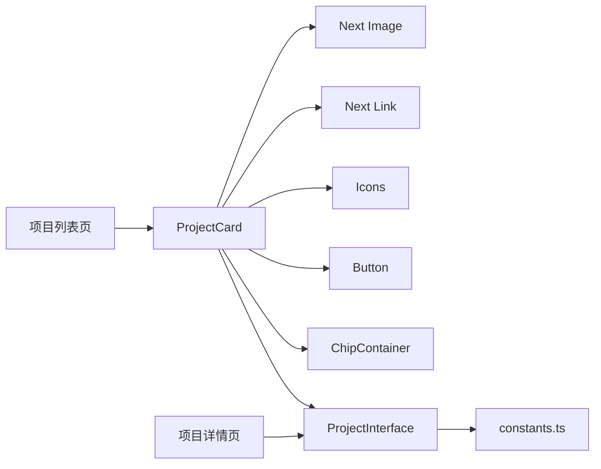

# 项目卡片组件

<cite>
**本文引用的文件**
- [components/projects/project-card.tsx](file://components/projects/project-card.tsx)
- [config/projects.ts](file://config/projects.ts)
- [app/(root)/projects/page.tsx](file://app/(root)/projects/page.tsx)
- [app/(root)/projects/[projectId]/page.tsx](file://app/(root)/projects/[projectId]/page.tsx)
- [components/ui/chip-container.tsx](file://components/ui/chip-container.tsx)
- [config/constants.ts](file://config/constants.ts)
</cite>

## 目录
1. [简介](#简介)
2. [项目结构](#项目结构)
3. [核心组件](#核心组件)
4. [架构总览](#架构总览)
5. [详细组件分析](#详细组件分析)
6. [依赖关系分析](#依赖关系分析)
7. [性能考虑](#性能考虑)
8. [故障排查指南](#故障排查指南)
9. [结论](#结论)
10. [附录](#附录)

## 简介
本项目卡片组件用于在项目列表页中展示单个项目的关键信息，包括封面图、项目名称、简短描述、技术标签与跳转按钮。它基于 Next.js App Router 构建，配合类型化配置数据与可复用的 UI 原子组件，实现响应式布局、图片优化与路由跳转。本文将围绕其设计模式、实现细节、Props 接口、数据模型、路由集成、样式定制、性能优化与错误处理进行系统化说明，并提供在项目中使用的示例路径与扩展建议。

## 项目结构
- 组件层：项目卡片位于 components/projects 下，复用通用 UI 组件（如 ChipContainer、Button）与图标库。
- 数据层：项目数据通过 config/projects.ts 中的 ProjectInterface 与 Projects 数组集中管理，便于统一维护与类型校验。
- 页面层：项目列表页 app/(root)/projects/page.tsx 负责渲染多个 ProjectCard；动态详情页 app/(root)/projects/[projectId]/page.tsx 负责根据 id 渲染详情。
- 常量与类型：config/constants.ts 定义了分类、技能等枚举类型，确保数据一致性。

图表来源
- [app/(root)/projects/page.tsx:14-28](file://app/(root)/projects/page.tsx#L14-L28)
- [components/projects/project-card.tsx:13-50](file://components/projects/project-card.tsx#L13-L50)
- [components/ui/chip-container.tsx:7-14](file://components/ui/chip-container.tsx#L7-L14)
- [config/projects.ts:50-64](file://config/projects.ts#L50-L64)
- [config/constants.ts:71-80](file://config/constants.ts#L71-L80)

章节来源
- [app/(root)/projects/page.tsx:1-59](file://app/(root)/projects/page.tsx#L1-L59)
- [components/projects/project-card.tsx:1-52](file://components/projects/project-card.tsx#L1-L52)
- [config/projects.ts:50-64](file://config/projects.ts#L50-L64)
- [config/constants.ts:71-80](file://config/constants.ts#L71-L80)

## 核心组件
- 项目卡片组件负责：
  - 展示项目封面图（使用 Next Image 的 fill 与 sizes 优化加载）。
  - 显示项目名称与简短描述（支持文本截断）。
  - 渲染分类标签（通过 ChipContainer）。
  - 提供“Read more”按钮跳转到项目详情页（Next Link）。
  - 根据项目类型显示个人/职业标识图标。

章节来源
- [components/projects/project-card.tsx:13-50](file://components/projects/project-card.tsx#L13-L50)

## 架构总览
项目卡片组件处于“展示层”，从配置数据获取项目信息并渲染。列表页负责筛选与网格布局，详情页负责完整内容展示。数据流自下而上：配置数据 -> 列表页 -> 卡片组件 -> 子组件（标签、按钮、图标）。

图表来源
- [app/(root)/projects/page.tsx:14-28](file://app/(root)/projects/page.tsx#L14-L28)
- [components/projects/project-card.tsx:35-40](file://components/projects/project-card.tsx#L35-L40)
- [app/(root)/projects/[projectId]/page.tsx:22-49](file://app/(root)/projects/[projectId]/page.tsx#L22-L49)

## 详细组件分析

### 组件 Props 接口与数据模型
- 组件 Props：
  - project: 类型为 ProjectInterface，包含项目唯一标识、类型、名称、分类、简述、链接、技术栈、起止时间、封面图、详细描述与页面信息等字段。
- 数据模型：
  - ProjectInterface 由 config/projects.ts 定义，结合 constants.ts 中的 ValidCategory、ValidExpType 等类型，保证数据一致性与可维护性。
  - 项目数据以数组形式集中管理，并提供精选前 N 项的导出。

章节来源
- [components/projects/project-card.tsx:9-11](file://components/projects/project-card.tsx#L9-L11)
- [config/projects.ts:50-64](file://config/projects.ts#L50-L64)
- [config/constants.ts:71-80](file://config/constants.ts#L71-L80)

### 项目信息展示逻辑
- 封面图：使用 Next Image 的 fill 与 sizes，适配不同屏幕宽度，提升加载性能与视觉体验。
- 标题与描述：标题加粗显示，描述支持最多三行截断，避免长文本破坏布局。
- 技术标签：通过 ChipContainer 将 category 数组渲染为可换行的标签集合。
- 跳转按钮：使用 Next Link 指向 /projects/:id，按钮样式与图标增强交互感。
- 类型标识：根据 type 字段显示个人/职业图标，增强信息层次。

章节来源
- [components/projects/project-card.tsx:16-48](file://components/projects/project-card.tsx#L16-L48)

### 图片处理与响应式布局
- 图片优化：
  - 使用 Next Image 的 fill 与 sizes，自动选择合适尺寸，减少带宽消耗。
  - 设置 object-contain 保持图片比例，背景色占位提升感知加载速度。
- 响应式布局：
  - 外层容器使用 flex 与 grow/shrink 控制高度自适应。
  - 列表页采用 grid 布局，在不同断点切换列数，卡片高度一致且内容自适应。
  - 标签区域使用 flex-wrap 自动换行，适配窄屏。

章节来源
- [components/projects/project-card.tsx:16-34](file://components/projects/project-card.tsx#L16-L34)
- [app/(root)/projects/page.tsx:22-27](file://app/(root)/projects/page.tsx#L22-L27)

### 技术标签显示
- 标签容器：ChipContainer 接收字符串数组，逐个渲染 Chip 组件，支持换行与间距。
- 数据来源：category 来自 ProjectInterface，类型受 ValidCategory 约束，确保标签值合法。
- 可扩展性：如需自定义标签样式或行为，可在 Chip 组件层面扩展。

章节来源
- [components/ui/chip-container.tsx:7-14](file://components/ui/chip-container.tsx#L7-L14)
- [config/projects.ts:50-64](file://config/projects.ts#L50-L64)
- [config/constants.ts:71-78](file://config/constants.ts#L71-L78)

### 与路由系统的集成
- 列表页：
  - 通过 ResponsiveTabs 提供“全部/个人/职业”筛选，调用 renderContent 过滤 Projects 并渲染卡片。
- 详情页：
  - 使用 generateStaticParams 生成静态参数，generateMetadata 动态生成元信息。
  - 根据 projectId 查找项目，不存在时重定向至列表页。
  - 详情页展示封面图、技术栈、描述与多图画廊，支持布局切换与图片来源标注。

章节来源
- [app/(root)/projects/page.tsx:14-59](file://app/(root)/projects/page.tsx#L14-L59)
- [app/(root)/projects/[projectId]/page.tsx:22-49](file://app/(root)/projects/[projectId]/page.tsx#L22-L49)
- [app/(root)/projects/[projectId]/page.tsx:144-198](file://app/(root)/projects/[projectId]/page.tsx#L144-L198)

### 可配置选项与样式定制
- 可配置项：
  - 项目数据：通过 config/projects.ts 的 Projects 数组配置每个项目的字段。
  - 标签类型：category 与 techStack 使用类型化枚举，限制可选值。
  - 详情页布局：pagesInfoArr 支持 layout 字段切换“stack/grid”。
- 样式定制：
  - 卡片容器：使用 Tailwind 类名控制边框、圆角、背景与间距。
  - 图片样式：object-contain、border、bg-muted 提升视觉一致性。
  - 按钮与图标：复用 Button 与 Icons 组件，保持一致风格。
  - 标签样式：通过 ChipContainer 与 Chip 组件统一外观。

章节来源
- [config/projects.ts:50-64](file://config/projects.ts#L50-L64)
- [components/projects/project-card.tsx:15-48](file://components/projects/project-card.tsx#L15-L48)
- [app/(root)/projects/[projectId]/page.tsx:163-198](file://app/(root)/projects/[projectId]/page.tsx#L163-L198)

### 性能优化策略
- 图片优化：
  - 使用 Next Image 的 fill 与 sizes，自动裁剪与压缩，减少首屏负载。
  - 详情页大图使用 priority 提升首屏关键资源优先级。
- 路由与数据：
  - 列表页本地筛选，避免额外请求。
  - 详情页使用 generateStaticParams 预生成路由，提升 SEO 与加载速度。
- 组件粒度：
  - 将标签、描述等拆分为独立组件，提高复用性与可测试性。

章节来源
- [components/projects/project-card.tsx:17-23](file://components/projects/project-card.tsx#L17-L23)
- [app/(root)/projects/[projectId]/page.tsx:22-24](file://app/(root)/projects/[projectId]/page.tsx#L22-L24)
- [app/(root)/projects/[projectId]/page.tsx:114-121](file://app/(root)/projects/[projectId]/page.tsx#L114-L121)

### 错误处理机制
- 详情页缺失项目：
  - 若根据 projectId 未找到项目，直接重定向至 /projects，避免空白页。
- 元信息生成：
  - 未找到项目时返回默认标题，防止无效 SEO 元信息。
- 前端健壮性：
  - 列表页筛选逻辑仅基于本地数据，无网络异常风险。
  - 图片 alt 与 sizes 属性完善，提升无障碍与加载体验。

章节来源
- [app/(root)/projects/[projectId]/page.tsx:26-49](file://app/(root)/projects/[projectId]/page.tsx#L26-L49)

## 依赖关系分析
- 组件依赖：
  - ProjectCard 依赖 Next Image、Next Link、Icons、Button、ChipContainer 与 ProjectInterface。
  - ChipContainer 依赖 Chip 组件。
- 数据依赖：
  - 项目数据来源于 config/projects.ts，类型约束来自 config/constants.ts。
- 页面依赖：
  - 列表页依赖 PageContainer、ResponsiveTabs 与项目数据。
  - 详情页依赖 ProjectDescription、CustomTooltip、工具函数与站点配置。

图表来源
- [components/projects/project-card.tsx:1-7](file://components/projects/project-card.tsx#L1-L7)
- [config/projects.ts:50-64](file://config/projects.ts#L50-L64)
- [config/constants.ts:71-80](file://config/constants.ts#L71-L80)
- [app/(root)/projects/page.tsx:1-8](file://app/(root)/projects/page.tsx#L1-L8)
- [app/(root)/projects/[projectId]/page.tsx:1-13](file://app/(root)/projects/[projectId]/page.tsx#L1-L13)

章节来源
- [components/projects/project-card.tsx:1-7](file://components/projects/project-card.tsx#L1-L7)
- [config/projects.ts:50-64](file://config/projects.ts#L50-L64)
- [config/constants.ts:71-80](file://config/constants.ts#L71-L80)
- [app/(root)/projects/page.tsx:1-8](file://app/(root)/projects/page.tsx#L1-L8)
- [app/(root)/projects/[projectId]/page.tsx:1-13](file://app/(root)/projects/[projectId]/page.tsx#L1-L13)

## 性能考虑
- 图片加载：
  - 使用 Next Image 的 fill 与 sizes 优化不同屏幕下的图片尺寸与加载时机。
  - 详情页大图使用 priority，优先加载首屏关键资源。
- 渲染效率：
  - 列表页本地筛选，避免重复请求。
  - 组件拆分合理，减少不必要的重渲染。
- 可访问性：
  - 图片 alt 与语义化标签提升无障碍体验。
  - 按钮与链接具备明确的交互提示。

[本节为通用性能指导，不直接分析具体文件]

## 故障排查指南
- 详情页无法打开：
  - 检查 generateStaticParams 是否正确生成所有项目 id。
  - 确认路由 params 与项目 id 匹配。
- 图片显示异常：
  - 检查图片路径是否存在，alt 与 sizes 是否合理。
  - 确认 Next Image 配置与 public 目录结构正确。
- 标签显示不全：
  - 检查 category 数组是否为空或包含非法值。
  - 确认 ChipContainer 与 Chip 组件样式未隐藏内容。
- 重定向问题：
  - 详情页未找到项目时会重定向至 /projects，检查路由与数据源。

章节来源
- [app/(root)/projects/[projectId]/page.tsx:22-49](file://app/(root)/projects/[projectId]/page.tsx#L22-L49)
- [components/projects/project-card.tsx:17-23](file://components/projects/project-card.tsx#L17-L23)
- [components/ui/chip-container.tsx:7-14](file://components/ui/chip-container.tsx#L7-L14)

## 结论
项目卡片组件通过类型化数据、可复用 UI 组件与 Next.js 生态能力，实现了高效、可维护且响应式的项目展示。其在列表页与详情页之间形成清晰的数据流与路由集成，具备良好的扩展性与性能表现。通过合理的样式定制与错误处理，能够在不同场景下稳定运行并提供良好的用户体验。

[本节为总结性内容，不直接分析具体文件]

## 附录

### 在项目列表页中使用组件的示例
- 列表页路径：app/(root)/projects/page.tsx
- 使用方式：
  - 导入 ProjectCard 与项目数据。
  - 通过 ResponsiveTabs 筛选项目类型。
  - 遍历项目数组并传入 project 对象给 ProjectCard。
- 参考路径：
  - [项目列表页渲染逻辑](file://app/(root)/projects/page.tsx#L14-L28)

章节来源
- [app/(root)/projects/page.tsx:14-28](file://app/(root)/projects/page.tsx#L14-L28)

### 自定义扩展建议
- 扩展标签样式：
  - 修改 ChipContainer 或 Chip 组件，增加颜色、大小或交互效果。
- 扩展卡片内容：
  - 在 ProjectCard 中添加更多字段展示，如网站链接、GitHub 链接等。
- 扩展详情页布局：
  - 利用 pagesInfoArr 的 layout 字段切换“stack/grid”，丰富展示形式。
- 参考路径：
  - [标签容器组件:7-14](file://components/ui/chip-container.tsx#L7-L14)
  - [项目卡片组件:13-50](file://components/projects/project-card.tsx#L13-L50)
  - [项目详情页画廊布局](file://app/(root)/projects/[projectId]/page.tsx#L163-L198)

章节来源
- [components/ui/chip-container.tsx:7-14](file://components/ui/chip-container.tsx#L7-L14)
- [components/projects/project-card.tsx:13-50](file://components/projects/project-card.tsx#L13-L50)
- [app/(root)/projects/[projectId]/page.tsx:163-198](file://app/(root)/projects/[projectId]/page.tsx#L163-L198)