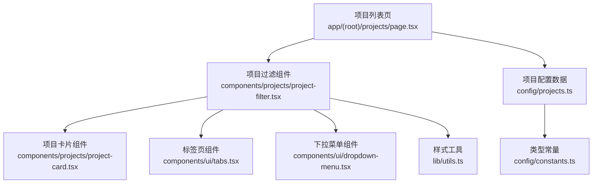
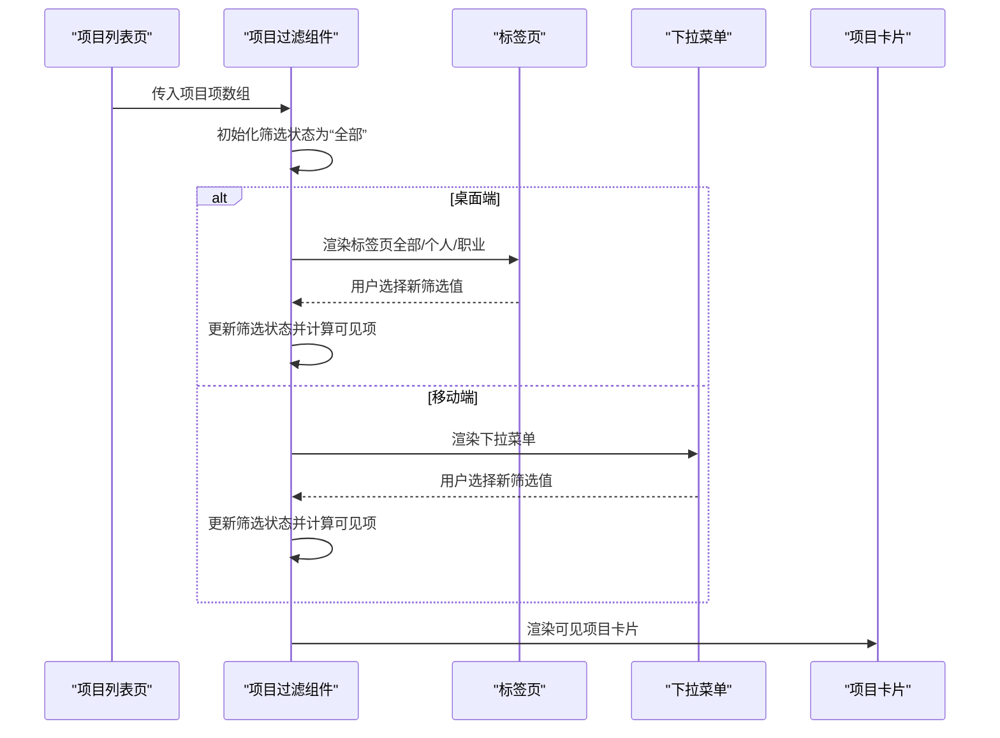
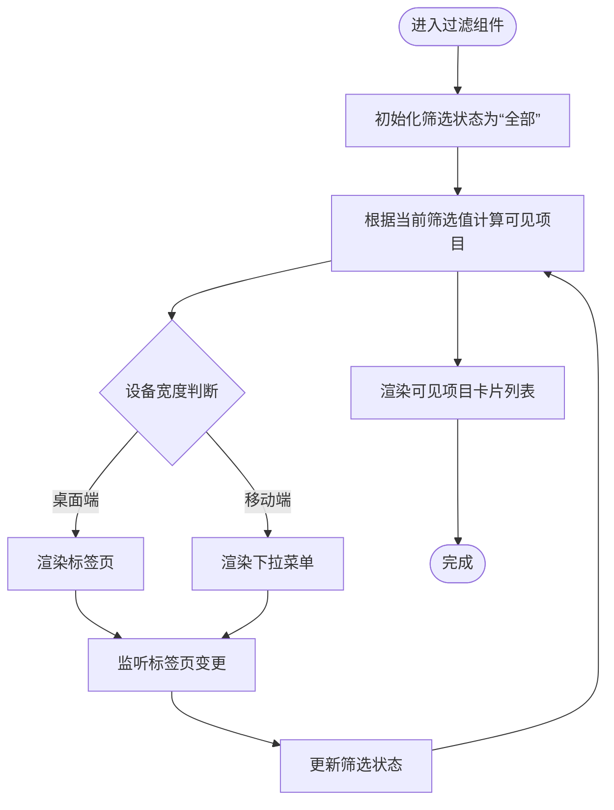
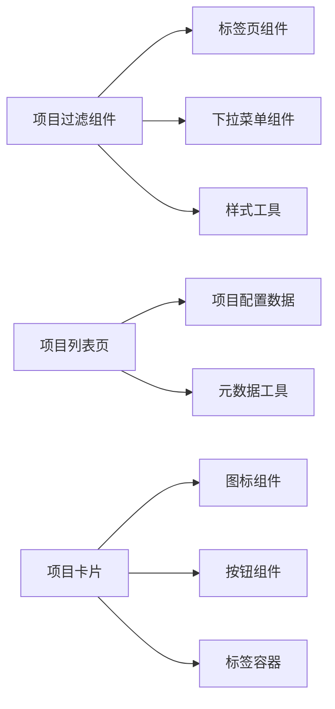

# 项目过滤组件

<cite>
**本文引用的文件**
- [components/projects/project-filter.tsx](file://components/projects/project-filter.tsx)
- [app/(root)/projects/page.tsx](file://app/(root)/projects/page.tsx)
- [config/projects.ts](file://config/projects.ts)
- [components/projects/project-card.tsx](file://components/projects/project-card.tsx)
- [components/ui/tabs.tsx](file://components/ui/tabs.tsx)
- [components/ui/dropdown-menu.tsx](file://components/ui/dropdown-menu.tsx)
- [config/constants.ts](file://config/constants.ts)
- [lib/utils.ts](file://lib/utils.ts)
</cite>

## 目录
1. [简介](#简介)
2. [项目结构](#项目结构)
3. [核心组件](#核心组件)
4. [架构总览](#架构总览)
5. [详细组件分析](#详细组件分析)
6. [依赖关系分析](#依赖关系分析)
7. [性能考量](#性能考量)
8. [故障排查指南](#故障排查指南)
9. [结论](#结论)
10. [附录](#附录)

## 简介
本项目过滤组件用于在“项目”页面中按类型（全部、个人、职业）筛选并展示项目卡片。它通过客户端状态管理当前筛选值，结合响应式 UI（桌面端使用标签页，移动端使用下拉菜单），渲染对应的项目列表。数据来源于配置驱动的项目清单，UI 由基础组件库与工具函数组合而成。

## 项目结构
- 页面入口：项目列表页将项目数据转换为过滤组件可接受的项数组，并传入过滤组件进行渲染。
- 过滤组件：维护当前激活的筛选值，计算可见项目集合，并在不同屏幕尺寸下切换交互形式。
- 数据模型：项目类型来自常量定义，确保类型安全与一致性。
- UI 基础：标签页与下拉菜单来自 Radix 封装的基础组件；样式合并使用工具函数。

图表来源
- [app/(root)/projects/page.tsx:14-33](file://app/(root)/projects/page.tsx#L14-L33)
- [components/projects/project-filter.tsx:39-103](file://components/projects/project-filter.tsx#L39-L103)
- [components/projects/project-card.tsx:14-58](file://components/projects/project-card.tsx#L14-L58)
- [components/ui/tabs.tsx:1-56](file://components/ui/tabs.tsx#L1-L56)
- [components/ui/dropdown-menu.tsx:1-201](file://components/ui/dropdown-menu.tsx#L1-L201)
- [config/projects.ts:70-413](file://config/projects.ts#L70-L413)
- [config/constants.ts:71-80](file://config/constants.ts#L71-L80)
- [lib/utils.ts:1-6](file://lib/utils.ts#L1-L6)

章节来源
- [app/(root)/projects/page.tsx:14-33](file://app/(root)/projects/page.tsx#L14-L33)
- [components/projects/project-filter.tsx:39-103](file://components/projects/project-filter.tsx#L39-L103)
- [config/projects.ts:70-413](file://config/projects.ts#L70-L413)
- [config/constants.ts:71-80](file://config/constants.ts#L71-L80)
- [components/ui/tabs.tsx:1-56](file://components/ui/tabs.tsx#L1-L56)
- [components/ui/dropdown-menu.tsx:1-201](file://components/ui/dropdown-menu.tsx#L1-L201)
- [lib/utils.ts:1-6](file://lib/utils.ts#L1-L6)

## 核心组件
- 项目过滤组件：负责筛选逻辑、响应式交互与可见项渲染。
- 项目卡片组件：展示单个项目的封面、标题、描述、分类标签与详情跳转。
- 页面容器：组装项目数据为过滤组件所需格式，并提供页面元信息。

章节来源
- [components/projects/project-filter.tsx:39-103](file://components/projects/project-filter.tsx#L39-L103)
- [components/projects/project-card.tsx:14-58](file://components/projects/project-card.tsx#L14-L58)
- [app/(root)/projects/page.tsx:14-33](file://app/(root)/projects/page.tsx#L14-L33)

## 架构总览
过滤流程从页面层开始，将项目配置映射为过滤组件所需的项数组；过滤组件根据当前筛选值计算可见项，并在不同设备宽度下提供不同的交互方式；最终渲染项目卡片列表。

图表来源
- [app/(root)/projects/page.tsx:14-33](file://app/(root)/projects/page.tsx#L14-L33)
- [components/projects/project-filter.tsx:39-103](file://components/projects/project-filter.tsx#L39-L103)
- [components/ui/tabs.tsx:1-56](file://components/ui/tabs.tsx#L1-L56)
- [components/ui/dropdown-menu.tsx:1-201](file://components/ui/dropdown-menu.tsx#L1-L201)
- [components/projects/project-card.tsx:14-58](file://components/projects/project-card.tsx#L14-L58)

## 详细组件分析

### 项目过滤组件
- 功能职责
  - 维护当前激活的筛选值（默认“全部”）。
  - 根据筛选值计算可见项目集合。
  - 在桌面端以标签页呈现筛选选项，在移动端以下拉菜单呈现。
  - 渲染可见项目内容。
- 关键实现要点
  - 筛选选项固定为“全部/个人/职业”，类型来自常量定义。
  - 使用类型守卫确保仅接受有效筛选值。
  - 通过条件渲染与 Tailwind 类名控制活跃态样式。
  - 使用工具函数合并类名，保证样式一致性与可维护性。
- 复杂度与性能
  - 筛选过程为线性过滤，时间复杂度 O(n)，n 为项目数量。
  - 仅在筛选值变化时重新计算可见项，避免不必要的重渲染。
  - 首屏图片懒加载策略由卡片组件控制，提升初始加载性能。

图表来源
- [components/projects/project-filter.tsx:39-103](file://components/projects/project-filter.tsx#L39-L103)
- [components/ui/tabs.tsx:1-56](file://components/ui/tabs.tsx#L1-L56)
- [components/ui/dropdown-menu.tsx:1-201](file://components/ui/dropdown-menu.tsx#L1-L201)

章节来源
- [components/projects/project-filter.tsx:39-103](file://components/projects/project-filter.tsx#L39-L103)
- [config/constants.ts:71-80](file://config/constants.ts#L71-L80)
- [lib/utils.ts:1-6](file://lib/utils.ts#L1-L6)

### 项目卡片组件
- 功能职责
  - 展示项目封面图、公司名称、简短描述、分类标签与详情跳转按钮。
  - 支持首张卡片优先加载图片以提升感知性能。
  - 根据项目类型显示不同类型图标。
- 关键实现要点
  - 使用 Next.js Image 组件优化图片加载与尺寸适配。
  - 分类标签通过 ChipContainer 统一展示。
  - 详情跳转链接指向动态路由详情页。

章节来源
- [components/projects/project-card.tsx:14-58](file://components/projects/project-card.tsx#L14-L58)

### 页面容器与数据装配
- 功能职责
  - 将项目配置数据转换为过滤组件所需的项数组（包含 id、type、content）。
  - 设置页面元信息（标题、描述等）。
  - 包裹过滤组件并提供页面容器布局。
- 关键实现要点
  - 使用 eagerLoadImage 对首项启用优先加载。
  - 通过 createPageMetadata 生成 SEO 元数据。

章节来源
- [app/(root)/projects/page.tsx:14-33](file://app/(root)/projects/page.tsx#L14-L33)

### 数据模型与常量
- 项目类型与类别
  - 项目类型限定为“Personal”或“Professional”。
  - 项目类别为预定义的技能与领域标签集合。
- 项目数据结构
  - 包含项目标识、类型、公司名、类别、描述、技术栈、起止时间、封面图、详细描述与页面图集等字段。
  - 导出精选项目切片供首页或其他位置复用。

章节来源
- [config/constants.ts:71-80](file://config/constants.ts#L71-L80)
- [config/projects.ts:54-68](file://config/projects.ts#L54-L68)
- [config/projects.ts:70-413](file://config/projects.ts#L70-L413)

## 依赖关系分析
- 组件耦合
  - 过滤组件依赖标签页与下拉菜单基础组件，以及工具函数进行样式合并。
  - 页面容器依赖项目配置数据与元数据工具。
  - 卡片组件依赖图标、按钮、标签容器与项目类型常量。
- 外部依赖
  - 基于 Radix UI 的标签页与下拉菜单提供无障碍与交互能力。
  - 使用 Tailwind CSS 与 clsx/tailwind-merge 进行样式管理。
- 潜在风险
  - 若项目类型扩展，需同步更新常量与过滤选项，避免类型不一致。
  - 大量项目数据可能导致首屏渲染压力，建议分页或虚拟滚动（如需）。

图表来源
- [components/projects/project-filter.tsx:39-103](file://components/projects/project-filter.tsx#L39-L103)
- [components/ui/tabs.tsx:1-56](file://components/ui/tabs.tsx#L1-L56)
- [components/ui/dropdown-menu.tsx:1-201](file://components/ui/dropdown-menu.tsx#L1-L201)
- [lib/utils.ts:1-6](file://lib/utils.ts#L1-L6)
- [app/(root)/projects/page.tsx:14-33](file://app/(root)/projects/page.tsx#L14-L33)
- [config/projects.ts:70-413](file://config/projects.ts#L70-L413)
- [components/projects/project-card.tsx:14-58](file://components/projects/project-card.tsx#L14-L58)

章节来源
- [components/projects/project-filter.tsx:39-103](file://components/projects/project-filter.tsx#L39-L103)
- [components/ui/tabs.tsx:1-56](file://components/ui/tabs.tsx#L1-L56)
- [components/ui/dropdown-menu.tsx:1-201](file://components/ui/dropdown-menu.tsx#L1-L201)
- [lib/utils.ts:1-6](file://lib/utils.ts#L1-L6)
- [app/(root)/projects/page.tsx:14-33](file://app/(root)/projects/page.tsx#L14-L33)
- [config/projects.ts:70-413](file://config/projects.ts#L70-L413)
- [components/projects/project-card.tsx:14-58](file://components/projects/project-card.tsx#L14-L58)

## 性能考量
- 图片加载
  - 首张卡片启用优先加载，其余采用懒加载，减少首屏带宽占用。
- 筛选计算
  - 线性过滤在常规项目规模下开销较小；若项目量增长，可考虑索引或缓存策略。
- 渲染优化
  - 使用 Fragment 包裹可见项，避免额外 DOM 层级。
  - 样式合并工具减少重复类名冲突与冗余。
- 可访问性
  - 基于 Radix 的标签页与下拉菜单提供键盘导航与焦点管理，提升可访问性。

[本节为通用指导，不直接分析具体文件]

## 故障排查指南
- 筛选无效
  - 检查传入的项目项是否包含正确的 type 字段，且与常量定义一致。
  - 确认筛选值变更回调是否正确更新状态。
- 移动端显示异常
  - 验证响应式类名是否正确应用，确保移动端下拉菜单可见。
- 图片加载缓慢
  - 检查图片资源路径与尺寸配置，必要时调整 sizes 与优先级。
- 类型错误
  - 新增项目类型时需同步更新常量与过滤选项，保持类型安全。

章节来源
- [components/projects/project-filter.tsx:39-103](file://components/projects/project-filter.tsx#L39-L103)
- [config/constants.ts:71-80](file://config/constants.ts#L71-L80)
- [components/projects/project-card.tsx:14-58](file://components/projects/project-card.tsx#L14-L58)

## 结论
项目过滤组件以配置驱动的方式实现了清晰、可扩展的项目筛选与展示。通过响应式交互与基础组件库的组合，兼顾了用户体验与可维护性。未来可在大数据量场景引入更高效的筛选与渲染策略，同时持续完善类型系统与可访问性。

[本节为总结性内容，不直接分析具体文件]

## 附录
- 相关组件与工具
  - 标签页组件：提供桌面端筛选交互。
  - 下拉菜单组件：提供移动端筛选交互。
  - 样式工具：合并类名，确保样式一致。
  - 项目配置：集中管理项目数据与类型定义。

章节来源
- [components/ui/tabs.tsx:1-56](file://components/ui/tabs.tsx#L1-L56)
- [components/ui/dropdown-menu.tsx:1-201](file://components/ui/dropdown-menu.tsx#L1-L201)
- [lib/utils.ts:1-6](file://lib/utils.ts#L1-L6)
- [config/projects.ts:70-413](file://config/projects.ts#L70-L413)