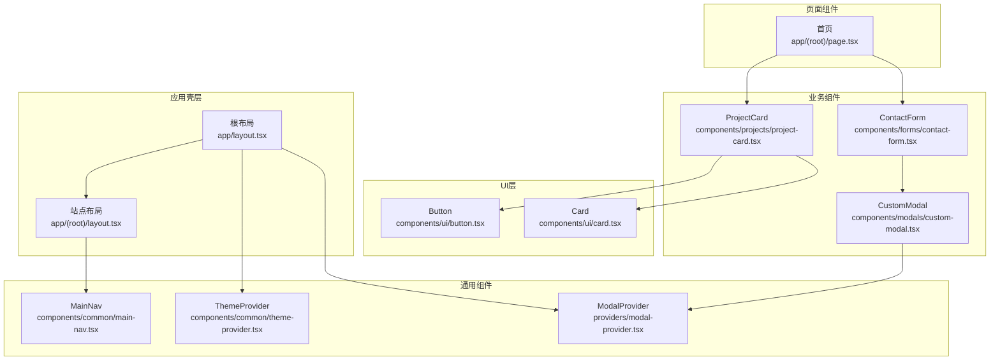
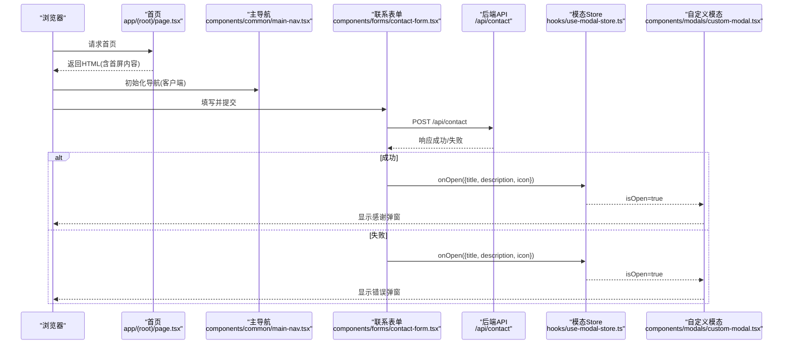
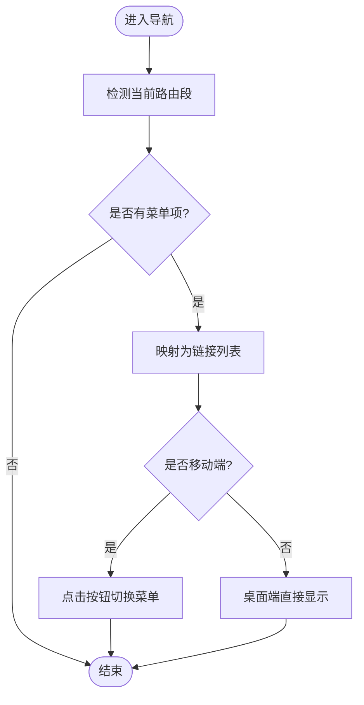
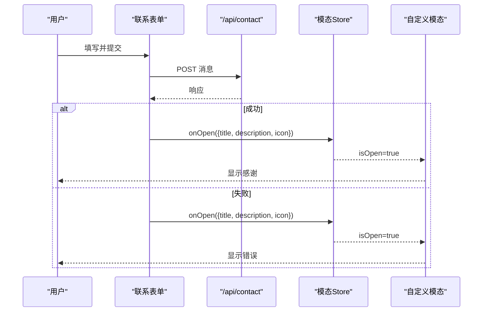
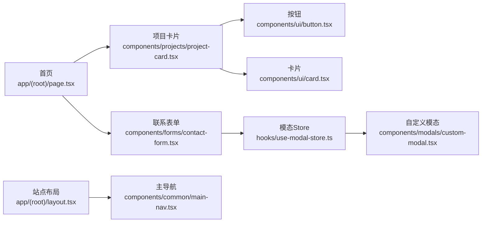

# 组件层次结构

<cite>
**本文引用的文件**
- [app/layout.tsx](file://app/layout.tsx)
- [app/(root)/layout.tsx](file://app/(root)/layout.tsx)
- [app/(root)/page.tsx](file://app/(root)/page.tsx)
- [components/common/main-nav.tsx](file://components/common/main-nav.tsx)
- [components/ui/button.tsx](file://components/ui/button.tsx)
- [components/ui/card.tsx](file://components/ui/card.tsx)
- [components/projects/project-card.tsx](file://components/projects/project-card.tsx)
- [components/forms/contact-form.tsx](file://components/forms/contact-form.tsx)
- [components/modals/custom-modal.tsx](file://components/modals/custom-modal.tsx)
- [providers/modal-provider.tsx](file://providers/modal-provider.tsx)
- [hooks/use-modal-store.ts](file://hooks/use-modal-store.ts)
- [config/routes.ts](file://config/routes.ts)
</cite>

## 目录
1. [简介](#简介)
2. [项目结构](#项目结构)
3. [核心组件](#核心组件)
4. [架构总览](#架构总览)
5. [详细组件分析](#详细组件分析)
6. [依赖关系分析](#依赖关系分析)
7. [性能考量](#性能考量)
8. [故障排查指南](#故障排查指南)
9. [结论](#结论)
10. [附录](#附录)

## 简介
本文件面向Next.js投资组合项目的组件化架构，系统化梳理UI组件、业务组件与页面组件的分层设计、职责边界与复用策略。重点说明：
- 组件分层与职责分离：基础UI组件（如按钮、卡片）→ 通用业务组件（如项目卡片、联系表单）→ 页面级组合（首页及各路由页面）。
- 数据传递与事件处理：通过props自上而下传递数据，事件回调自下而上触发；跨组件状态使用Zustand store与Provider注入。
- Server Components与Client Components选择：默认服务端渲染的页面/布局优先，仅在需要浏览器API或交互时标记"use client"。
- 组件树与交互流程：从根布局到导航、卡片、表单、模态框的完整链路可视化。

## 项目结构
- 应用壳层
  - 根布局负责全局元信息、主题与全局Provider挂载，确保全站一致的主题与模态能力。
  - 站点布局负责头部导航、主体区域与页脚，统一内容容器与响应式布局。
- 页面与路由
  - 首页聚合多个业务区块（项目、经历、贡献、技能、博客、联系），通过动画组件提升体验。
  - 各子路由页面按功能域组织，便于维护与扩展。
- 组件分层
  - UI层：无业务逻辑的可复用原子组件（按钮、卡片、输入等）。
  - 通用组件：跨页面复用的业务片段（导航、图标、动画、主题切换等）。
  - 业务组件：围绕特定领域（项目、经验、贡献、技能、表单、模态）的组合型组件。
  - 页面组件：组合业务组件并承载页面级数据获取与SEO。

图表来源
- [app/layout.tsx:87-131](file://app/layout.tsx#L87-L131)
- [app/(root)/layout.tsx:11-33](file://app/(root)/layout.tsx#L11-L33)
- [components/common/main-nav.tsx:34-99](file://components/common/main-nav.tsx#L34-L99)
- [components/ui/button.tsx:43-57](file://components/ui/button.tsx#L43-L57)
- [components/ui/card.tsx:5-87](file://components/ui/card.tsx#L5-L87)
- [components/projects/project-card.tsx:13-52](file://components/projects/project-card.tsx#L13-L52)
- [components/forms/contact-form.tsx:32-140](file://components/forms/contact-form.tsx#L32-L140)
- [components/modals/custom-modal.tsx:6-30](file://components/modals/custom-modal.tsx#L6-L30)
- [providers/modal-provider.tsx:7-24](file://providers/modal-provider.tsx#L7-L24)

章节来源
- [app/layout.tsx:87-131](file://app/layout.tsx#L87-L131)
- [app/(root)/layout.tsx:11-33](file://app/(root)/layout.tsx#L11-L33)

## 核心组件
- 根布局与站点布局
  - 根布局提供主题与全局模态能力，注入站点元信息与第三方脚本。
  - 站点布局提供统一的Header/Main/Footer结构，集中导航与模式切换入口。
- 导航组件
  - 主导航根据当前路由高亮，支持移动端菜单展开收起，使用客户端Hook进行路由感知与状态管理。
- 基础UI组件
  - 按钮：基于变体系统，支持多种样式尺寸与可组合插槽。
  - 卡片：语义化分块（头部、标题、描述、内容、底部），便于组合。
- 业务组件
  - 项目卡片：展示项目封面、摘要、标签与详情跳转。
  - 联系表单：表单校验、提交至后端API，成功后通过模态反馈。
  - 自定义模态：由全局Store驱动显示/隐藏，承载动态标题、描述与图标。
- 页面组件
  - 首页：聚合多模块区块，使用动画组件增强滚动入场效果，串联项目、经历、贡献、技能、博客与联系。

章节来源
- [app/layout.tsx:87-131](file://app/layout.tsx#L87-L131)
- [app/(root)/layout.tsx:11-33](file://app/(root)/layout.tsx#L11-L33)
- [components/common/main-nav.tsx:34-99](file://components/common/main-nav.tsx#L34-L99)
- [components/ui/button.tsx:43-57](file://components/ui/button.tsx#L43-L57)
- [components/ui/card.tsx:5-87](file://components/ui/card.tsx#L5-L87)
- [components/projects/project-card.tsx:13-52](file://components/projects/project-card.tsx#L13-L52)
- [components/forms/contact-form.tsx:32-140](file://components/forms/contact-form.tsx#L32-L140)
- [components/modals/custom-modal.tsx:6-30](file://components/modals/custom-modal.tsx#L6-L30)
- [app/(root)/page.tsx:36-354](file://app/(root)/page.tsx#L36-L354)

## 架构总览
- 分层原则
  - UI层：纯展示与交互原子能力，无业务上下文。
  - 通用层：跨页面复用的业务片段，封装常见交互与样式。
  - 业务层：围绕领域模型（项目、经历、贡献、技能、表单、模态）的组合。
  - 页面层：编排业务组件，负责数据获取、SEO与路由。
- 数据流
  - 页面组件通过配置与异步数据源加载数据，以props向下传递给业务组件。
  - 业务组件将数据进一步拆分为UI组件进行渲染。
  - 用户交互事件自下而上冒泡，必要时通过Store或回调更新状态。
- 服务端/客户端划分
  - 页面与布局默认作为Server Components，最大化SSR与缓存收益。
  - 需要浏览器API、事件监听、动画或全局状态的组件显式声明"use client"。

图表来源
- [app/(root)/page.tsx:36-354](file://app/(root)/page.tsx#L36-L354)
- [components/common/main-nav.tsx:34-99](file://components/common/main-nav.tsx#L34-L99)
- [components/forms/contact-form.tsx:45-75](file://components/forms/contact-form.tsx#L45-L75)
- [hooks/use-modal-store.ts:19-32](file://hooks/use-modal-store.ts#L19-L32)
- [components/modals/custom-modal.tsx:6-30](file://components/modals/custom-modal.tsx#L6-L30)

## 详细组件分析

### 根布局与站点布局
- 职责
  - 根布局：设置全局元信息、主题Provider、全局模态Provider与第三方脚本。
  - 站点布局：构建Header/Main/Footer骨架，集成主导航与模式切换。
- 关键点
  - 主题与模态在根层级提供，避免重复挂载。
  - 站点布局通过配置注入导航项，保持内容与结构解耦。

章节来源
- [app/layout.tsx:87-131](file://app/layout.tsx#L87-L131)
- [app/(root)/layout.tsx:11-33](file://app/(root)/layout.tsx#L11-L33)

### 主导航（客户端）
- 职责
  - 根据当前路由高亮菜单项，支持移动端菜单展开/收起。
  - 使用客户端Hook感知路由变化，控制菜单状态。
- 数据与事件
  - 接收路由配置数组，渲染为链接列表。
  - 点击菜单项触发导航，移动端按钮切换菜单可见性。

图表来源
- [components/common/main-nav.tsx:34-99](file://components/common/main-nav.tsx#L34-L99)
- [config/routes.ts:11-39](file://config/routes.ts#L11-L39)

章节来源
- [components/common/main-nav.tsx:34-99](file://components/common/main-nav.tsx#L34-L99)
- [config/routes.ts:11-39](file://config/routes.ts#L11-L39)

### 基础UI组件（按钮、卡片）
- 按钮
  - 基于变体系统，支持多种样式与尺寸，可通过插槽组合到其他元素。
- 卡片
  - 提供语义化分块，便于组合不同内容区域。

章节来源
- [components/ui/button.tsx:43-57](file://components/ui/button.tsx#L43-L57)
- [components/ui/card.tsx:5-87](file://components/ui/card.tsx#L5-L87)

### 业务组件：项目卡片
- 职责
  - 展示项目封面、名称、摘要、分类标签与详情跳转。
- 数据与事件
  - 通过props接收项目数据，点击“查看详情”跳转到详情页。
  - 使用基础UI组件完成样式与交互。

章节来源
- [components/projects/project-card.tsx:13-52](file://components/projects/project-card.tsx#L13-L52)
- [components/ui/button.tsx:43-57](file://components/ui/button.tsx#L43-L57)

### 业务组件：联系表单与模态反馈
- 联系表单
  - 使用表单库与校验规则，提交至后端API。
  - 成功则重置表单并通过模态提示感谢；失败则提示错误。
- 模态
  - 通过全局Store控制打开/关闭与内容，由Provider注入到根布局。

图表来源
- [components/forms/contact-form.tsx:45-75](file://components/forms/contact-form.tsx#L45-L75)
- [hooks/use-modal-store.ts:19-32](file://hooks/use-modal-store.ts#L19-L32)
- [components/modals/custom-modal.tsx:6-30](file://components/modals/custom-modal.tsx#L6-L30)
- [providers/modal-provider.tsx:7-24](file://providers/modal-provider.tsx#L7-L24)

章节来源
- [components/forms/contact-form.tsx:45-75](file://components/forms/contact-form.tsx#L45-L75)
- [hooks/use-modal-store.ts:19-32](file://hooks/use-modal-store.ts#L19-L32)
- [components/modals/custom-modal.tsx:6-30](file://components/modals/custom-modal.tsx#L6-L30)
- [providers/modal-provider.tsx:7-24](file://providers/modal-provider.tsx#L7-L24)

### 页面组件：首页
- 职责
  - 聚合项目、经历、贡献、技能、博客与联系等区块，提供快速入口。
  - 使用动画组件实现滚动入场效果，提升用户体验。
- 数据与事件
  - 异步获取精选博客，渲染对应卡片。
  - 各区块提供“查看全部”跳转至对应路由。

章节来源
- [app/(root)/page.tsx:36-354](file://app/(root)/page.tsx#L36-L354)

## 依赖关系分析
- 组件耦合
  - 页面组件依赖业务组件，业务组件依赖UI组件，形成清晰的单向依赖链。
  - 导航与站点布局通过配置解耦，便于扩展与维护。
- 外部依赖
  - 主题与模态通过Provider注入，避免在页面中重复引入。
  - 表单校验与状态管理采用成熟库，降低复杂度。
- 潜在循环依赖
  - 当前结构以分层为主，未见明显循环引用；新增组件时应遵循自顶向下的依赖方向。

图表来源
- [app/(root)/page.tsx:36-354](file://app/(root)/page.tsx#L36-L354)
- [components/projects/project-card.tsx:13-52](file://components/projects/project-card.tsx#L13-L52)
- [components/forms/contact-form.tsx:45-75](file://components/forms/contact-form.tsx#L45-L75)
- [components/ui/button.tsx:43-57](file://components/ui/button.tsx#L43-L57)
- [components/ui/card.tsx:5-87](file://components/ui/card.tsx#L5-L87)
- [hooks/use-modal-store.ts:19-32](file://hooks/use-modal-store.ts#L19-L32)
- [components/modals/custom-modal.tsx:6-30](file://components/modals/custom-modal.tsx#L6-L30)
- [app/(root)/layout.tsx:11-33](file://app/(root)/layout.tsx#L11-L33)
- [components/common/main-nav.tsx:34-99](file://components/common/main-nav.tsx#L34-L99)

章节来源
- [app/(root)/page.tsx:36-354](file://app/(root)/page.tsx#L36-L354)
- [components/common/main-nav.tsx:34-99](file://components/common/main-nav.tsx#L34-L99)
- [components/ui/button.tsx:43-57](file://components/ui/button.tsx#L43-L57)
- [components/ui/card.tsx:5-87](file://components/ui/card.tsx#L5-L87)
- [components/projects/project-card.tsx:13-52](file://components/projects/project-card.tsx#L13-L52)
- [components/forms/contact-form.tsx:45-75](file://components/forms/contact-form.tsx#L45-L75)
- [hooks/use-modal-store.ts:19-32](file://hooks/use-modal-store.ts#L19-L32)
- [components/modals/custom-modal.tsx:6-30](file://components/modals/custom-modal.tsx#L6-L30)
- [app/(root)/layout.tsx:11-33](file://app/(root)/layout.tsx#L11-L33)

## 性能考量
- 服务端渲染优先
  - 页面与布局默认在服务端执行，减少首屏时间；仅对需要交互的部分启用客户端组件。
- 资源优化
  - 图片使用懒加载与尺寸适配，避免阻塞渲染。
  - 动画组件按需触发，减少不必要的重排与重绘。
- 状态管理
  - 使用轻量级Store管理模态状态，避免全局状态膨胀。
- 可访问性与SEO
  - 根布局注入结构化数据与社交分享信息，提升搜索引擎收录质量。

[本节为通用指导，不直接分析具体文件]

## 故障排查指南
- 表单提交失败
  - 检查网络请求与后端接口状态码；确认表单校验规则是否符合预期。
  - 若失败，查看控制台错误日志，并根据错误提示调整字段或权限。
- 模态未显示
  - 确认Provider已正确挂载至根布局；检查Store的onOpen调用是否被触发。
  - 验证CustomModal是否正确订阅Store状态。
- 导航高亮异常
  - 检查useSelectedLayoutSegment的使用场景与路由段匹配逻辑。
  - 确认routes配置中的href与实际路由一致。

章节来源
- [components/forms/contact-form.tsx:45-75](file://components/forms/contact-form.tsx#L45-L75)
- [providers/modal-provider.tsx:7-24](file://providers/modal-provider.tsx#L7-L24)
- [hooks/use-modal-store.ts:19-32](file://hooks/use-modal-store.ts#L19-L32)
- [components/modals/custom-modal.tsx:6-30](file://components/modals/custom-modal.tsx#L6-L30)
- [components/common/main-nav.tsx:34-99](file://components/common/main-nav.tsx#L34-L99)

## 结论
本项目采用清晰的分层组件架构：UI层提供原子能力，通用层封装跨页面复用逻辑，业务层聚焦领域组合，页面层编排数据与SEO。通过Server Components与Client Components的合理划分，兼顾性能与交互。统一的Provider与Store机制确保了全局状态的一致性与可维护性。该设计有助于团队协作与长期演进。

[本节为总结性内容，不直接分析具体文件]

## 附录
- 组件选择准则
  - 是否需要浏览器API或事件监听？是则使用"use client"。
  - 是否涉及复杂状态或副作用？考虑放入业务组件并使用Store管理。
  - 是否纯展示？优先放在UI层，保持无副作用与高内聚。
- 最佳实践
  - 通过配置驱动导航与页面内容，减少硬编码。
  - 使用动画组件提升体验，但注意性能与可访问性。
  - 表单校验与错误提示保持一致的用户体验。

[本节为通用指导，不直接分析具体文件]