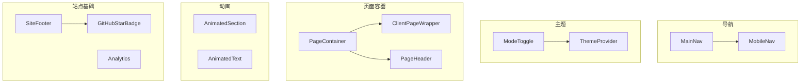
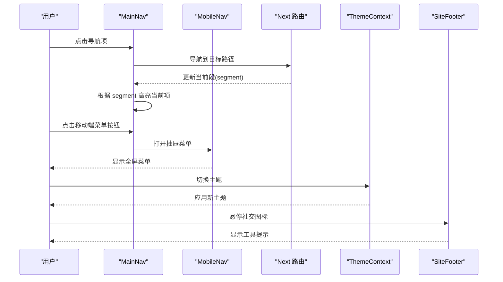
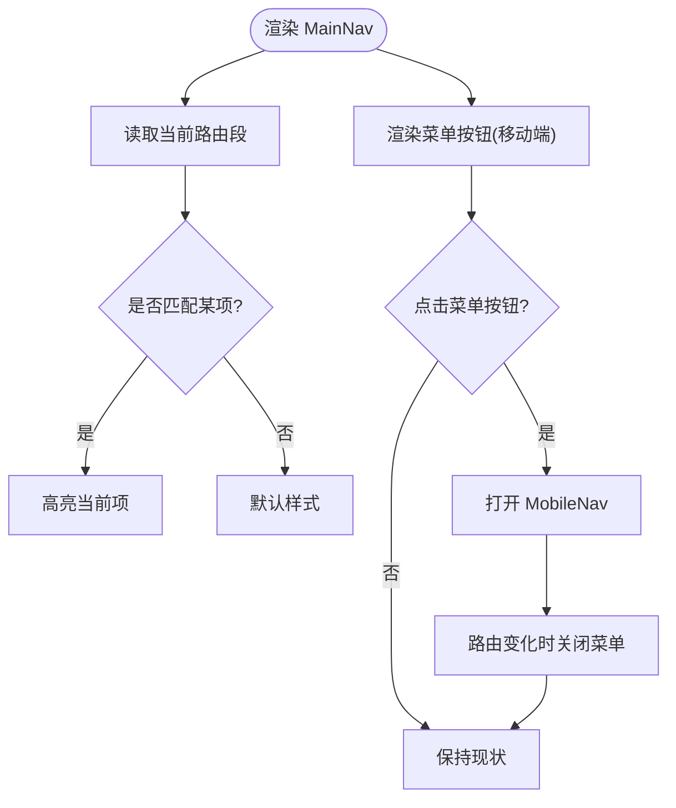
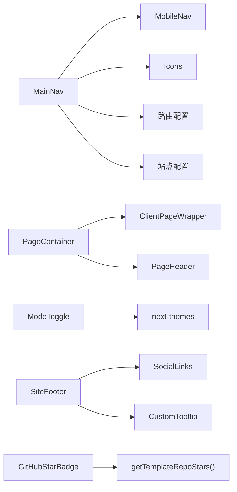

# 通用组件

<cite>
**本文引用的文件**
- [main-nav.tsx](file://components/common/main-nav.tsx)
- [mobile-nav.tsx](file://components/common/mobile-nav.tsx)
- [mode-toggle.tsx](file://components/common/mode-toggle.tsx)
- [theme-provider.tsx](file://components/common/theme-provider.tsx)
- [site-footer.tsx](file://components/common/site-footer.tsx)
- [animated-section.tsx](file://components/common/animated-section.tsx)
- [animated-text.tsx](file://components/common/animated-text.tsx)
- [client-page-wrapper.tsx](file://components/common/client-page-wrapper.tsx)
- [page-container.tsx](file://components/common/page-container.tsx)
- [page-header.tsx](file://components/common/page-header.tsx)
- [analytics.tsx](file://components/common/analytics.tsx)
- [github-star-badge.tsx](file://components/common/github-star-badge.tsx)
</cite>

## 目录
1. [简介](#简介)
2. [项目结构](#项目结构)
3. [核心组件](#核心组件)
4. [架构总览](#架构总览)
5. [详细组件分析](#详细组件分析)
6. [依赖分析](#依赖分析)
7. [性能考虑](#性能考虑)
8. [故障排查指南](#故障排查指南)
9. [结论](#结论)
10. [附录](#附录)

## 简介
本章节面向 Next.js 投资组合项目的“通用组件”体系，聚焦跨页面复用的基础设施：导航栏、主题切换器、动画效果、页脚等。文档从设计原则、复用策略与配置机制出发，说明状态管理、生命周期管理与协作方式，并提供定制化选项、性能优化与可访问性支持的使用指南、最佳实践与常见问题解决方案，帮助开发者高效使用与扩展这些通用能力。

## 项目结构
通用组件集中在 components/common 目录下，按职责划分：
- 导航与路由：MainNav、MobileNav
- 主题系统：ModeToggle、ThemeProvider
- 页面容器与头部：PageContainer、ClientPageWrapper、PageHeader
- 动画封装：AnimatedSection、AnimatedText
- 站点基础：SiteFooter、Analytics、GitHubStarBadge

图表来源
- [main-nav.tsx:15-99](file://components/common/main-nav.tsx#L15-L99)
- [mobile-nav.tsx:10-49](file://components/common/mobile-nav.tsx#L10-L49)
- [mode-toggle.tsx:15-71](file://components/common/mode-toggle.tsx#L15-L71)
- [theme-provider.tsx:8-11](file://components/common/theme-provider.tsx#L8-L11)
- [page-container.tsx:5-27](file://components/common/page-container.tsx#L5-L27)
- [client-page-wrapper.tsx:6-37](file://components/common/client-page-wrapper.tsx#L6-L37)
- [page-header.tsx:1-21](file://components/common/page-header.tsx#L1-L21)
- [site-footer.tsx:9-34](file://components/common/site-footer.tsx#L9-L34)
- [github-star-badge.tsx:8-40](file://components/common/github-star-badge.tsx#L8-L40)

章节来源
- [main-nav.tsx:15-99](file://components/common/main-nav.tsx#L15-L99)
- [mobile-nav.tsx:10-49](file://components/common/mobile-nav.tsx#L10-L49)
- [mode-toggle.tsx:15-71](file://components/common/mode-toggle.tsx#L15-L71)
- [theme-provider.tsx:8-11](file://components/common/theme-provider.tsx#L8-L11)
- [page-container.tsx:5-27](file://components/common/page-container.tsx#L5-L27)
- [client-page-wrapper.tsx:6-37](file://components/common/client-page-wrapper.tsx#L6-L37)
- [page-header.tsx:1-21](file://components/common/page-header.tsx#L1-L21)
- [site-footer.tsx:9-34](file://components/common/site-footer.tsx#L9-L34)
- [github-star-badge.tsx:8-40](file://components/common/github-star-badge.tsx#L8-L40)

## 核心组件
- 导航栏（MainNav）：响应式桌面/移动端导航，集成路由高亮、菜单展开收起、动效入场。
- 移动端导航（MobileNav）：全屏抽屉式菜单，锁定滚动，承载子项与附加内容。
- 主题切换器（ModeToggle）：基于 next-themes 的多主题切换下拉菜单，支持多风格主题与系统跟随。
- 主题提供者（ThemeProvider）：对 next-themes 的轻量封装，统一注入主题上下文。
- 页面容器（PageContainer）：组合客户端包装与页面头部，提供统一的页面布局骨架。
- 客户端页面包装（ClientPageWrapper）：为整页内容提供淡入上移的进入动画。
- 页面头部（PageHeader）：标题与描述的标准展示区，配合分隔线形成视觉层次。
- 动画区块（AnimatedSection）：基于视口的滚动入场动画，支持方向与延迟配置。
- 动画文本（AnimatedText）：可渲染多种语义标签的文本动画封装。
- 站点页脚（SiteFooter）：社交链接图标集合，带工具提示。
- 分析（Analytics）：Vercel 分析脚本挂载点。
- GitHub Star 徽章（GitHubStarBadge）：服务端获取仓库星数并展示的可访问链接。

章节来源
- [main-nav.tsx:15-99](file://components/common/main-nav.tsx#L15-L99)
- [mobile-nav.tsx:10-49](file://components/common/mobile-nav.tsx#L10-L49)
- [mode-toggle.tsx:15-71](file://components/common/mode-toggle.tsx#L15-L71)
- [theme-provider.tsx:8-11](file://components/common/theme-provider.tsx#L8-L11)
- [page-container.tsx:5-27](file://components/common/page-container.tsx#L5-L27)
- [client-page-wrapper.tsx:6-37](file://components/common/client-page-wrapper.tsx#L6-L37)
- [page-header.tsx:1-21](file://components/common/page-header.tsx#L1-L21)
- [animated-section.tsx:6-51](file://components/common/animated-section.tsx#L6-L51)
- [animated-text.tsx:6-49](file://components/common/animated-text.tsx#L6-L49)
- [site-footer.tsx:9-34](file://components/common/site-footer.tsx#L9-L34)
- [analytics.tsx:5-8](file://components/common/analytics.tsx#L5-L8)
- [github-star-badge.tsx:8-40](file://components/common/github-star-badge.tsx#L8-L40)

## 架构总览
通用组件围绕“导航 + 主题 + 页面容器 + 动画 + 站点基础”五大模块组织，遵循以下原则：
- 单一职责：每个组件只负责一个清晰的功能域。
- 可配置化：通过 props 暴露常用定制点（如动画方向、延迟、样式类名）。
- 客户端/服务端分离：需要浏览器 API 或交互逻辑的组件标注客户端；数据获取型组件采用服务端函数。
- 可访问性优先：为交互元素提供语义化标签与屏幕阅读器支持。
- 低耦合：通过配置与 props 解耦业务数据与展示逻辑。

图表来源
- [main-nav.tsx:34-99](file://components/common/main-nav.tsx#L34-L99)
- [mobile-nav.tsx:15-49](file://components/common/mobile-nav.tsx#L15-L49)
- [mode-toggle.tsx:15-71](file://components/common/mode-toggle.tsx#L15-L71)
- [site-footer.tsx:9-34](file://components/common/site-footer.tsx#L9-L34)

## 详细组件分析

### 导航栏（MainNav）
- 功能要点
  - 桌面端展示品牌与导航项，移动端提供汉堡菜单入口。
  - 根据当前路由段高亮对应导航项。
  - 点击菜单按钮切换移动端抽屉。
  - 为导航项添加入场与交互动效。
- 状态管理
  - 本地状态控制移动端菜单显隐。
  - 使用路由钩子同步当前段以计算高亮。
- 生命周期
  - 监听路由变化时关闭移动端菜单，避免状态残留。
- 协作关系
  - 与 MobileNav 组合实现响应式导航。
  - 与 Icons、路由配置、站点配置协作。
- 可访问性
  - 为菜单按钮提供清晰的交互反馈。
- 性能
  - 使用条件渲染减少不必要的 DOM。
  - 动效参数合理，避免过度重排。

图表来源
- [main-nav.tsx:34-99](file://components/common/main-nav.tsx#L34-L99)

章节来源
- [main-nav.tsx:15-99](file://components/common/main-nav.tsx#L15-L99)

### 移动端导航（MobileNav）
- 功能要点
  - 全屏抽屉式菜单，固定定位覆盖主内容。
  - 锁定页面滚动，防止背景滚动。
  - 渲染导航项与可选的子内容区域。
- 状态管理
  - 由父组件控制显隐，自身专注呈现与滚动锁定。
- 可访问性
  - 使用语义化结构与键盘可达的链接。
- 性能
  - 仅在需要时挂载，减少初始渲染开销。

章节来源
- [mobile-nav.tsx:10-49](file://components/common/mobile-nav.tsx#L10-L49)

### 主题切换器（ModeToggle）
- 功能要点
  - 下拉菜单提供多主题切换（浅色、深色、复古、赛博朋克、纸张、极光、合成波、系统）。
  - 按钮图标随主题切换进行过渡动画。
- 状态管理
  - 通过 next-themes 的 useTheme 获取与设置主题。
- 可访问性
  - 按钮包含 sr-only 文本，便于屏幕阅读器理解。
- 性能
  - 下拉菜单按需渲染，图标切换使用 CSS 过渡。

章节来源
- [mode-toggle.tsx:15-71](file://components/common/mode-toggle.tsx#L15-L71)

### 主题提供者（ThemeProvider）
- 功能要点
  - 对 next-themes 的 ThemeProvider 进行最小封装，便于集中配置与替换。
- 协作关系
  - 包裹应用根节点，使所有子组件可通过 useTheme 访问主题状态。

章节来源
- [theme-provider.tsx:8-11](file://components/common/theme-provider.tsx#L8-L11)

### 页面容器（PageContainer）
- 功能要点
  - 组合客户端页面包装与页面头部，提供统一的内容容器。
- 配置项
  - title、description 用于页面头部展示。
- 协作关系
  - 内部使用 ClientPageWrapper 与 PageHeader。

章节来源
- [page-container.tsx:5-27](file://components/common/page-container.tsx#L5-L27)

### 客户端页面包装（ClientPageWrapper）
- 功能要点
  - 为整页内容提供淡入上移的进入动画。
- 性能
  - 使用 motion 的 variants 与 transition 控制动画时长与缓动。

章节来源
- [client-page-wrapper.tsx:6-37](file://components/common/client-page-wrapper.tsx#L6-L37)

### 页面头部（PageHeader）
- 功能要点
  - 展示页面标题与描述，使用分隔线区分内容区域。
- 可访问性
  - 使用语义化标题层级。

章节来源
- [page-header.tsx:1-21](file://components/common/page-header.tsx#L1-L21)

### 动画区块（AnimatedSection）
- 功能要点
  - 基于视口触发滚动入场动画，支持方向与延迟配置。
- 配置项
  - children、className、delay、direction、id。
- 性能
  - viewport.once=true 确保动画仅触发一次，避免重复计算。

章节来源
- [animated-section.tsx:6-51](file://components/common/animated-section.tsx#L6-L51)

### 动画文本（AnimatedText）
- 功能要点
  - 将任意文本包裹为可动画的语义标签，支持自定义延迟与类名。
- 配置项
  - children、delay、className、as（渲染标签类型）。
- 性能
  - 使用 motion 的变体与延迟参数，避免多余重绘。

章节来源
- [animated-text.tsx:6-49](file://components/common/animated-text.tsx#L6-L49)

### 站点页脚（SiteFooter）
- 功能要点
  - 渲染社交链接图标，结合工具提示展示用户名。
- 配置
  - 通过 SocialLinks 配置驱动，易于扩展。
- 可访问性
  - 链接具备明确的 aria-label 与图标语义。

章节来源
- [site-footer.tsx:9-34](file://components/common/site-footer.tsx#L9-L34)

### 分析（Analytics）
- 功能要点
  - 挂载 Vercel 分析脚本，统计页面访问。
- 使用建议
  - 在应用根布局中引入，确保全局生效。

章节来源
- [analytics.tsx:5-8](file://components/common/analytics.tsx#L5-L8)

### GitHub Star 徽章（GitHubStarBadge）
- 功能要点
  - 服务端获取模板仓库星数并展示，点击跳转仓库。
- 可访问性
  - 动态生成 aria-label，包含星数信息。
- 性能
  - 使用服务端函数获取数据，避免客户端请求。

章节来源
- [github-star-badge.tsx:8-40](file://components/common/github-star-badge.tsx#L8-L40)

## 依赖分析
- 组件间依赖
  - MainNav 依赖 MobileNav、Icons、路由配置与站点配置。
  - PageContainer 依赖 ClientPageWrapper 与 PageHeader。
  - ModeToggle 依赖 next-themes 与 UI 下拉菜单组件。
  - SiteFooter 依赖 SocialLinks 与 CustomTooltip。
  - GitHubStarBadge 依赖服务端函数获取星数。
- 外部依赖
  - motion/react：动画库。
  - next-themes：主题管理。
  - @vercel/analytics：分析集成。

图表来源
- [main-nav.tsx:34-99](file://components/common/main-nav.tsx#L34-L99)
- [mobile-nav.tsx:15-49](file://components/common/mobile-nav.tsx#L15-L49)
- [mode-toggle.tsx:15-71](file://components/common/mode-toggle.tsx#L15-L71)
- [page-container.tsx:11-27](file://components/common/page-container.tsx#L11-L27)
- [site-footer.tsx:9-34](file://components/common/site-footer.tsx#L9-L34)
- [github-star-badge.tsx:12-40](file://components/common/github-star-badge.tsx#L12-L40)

章节来源
- [main-nav.tsx:34-99](file://components/common/main-nav.tsx#L34-L99)
- [mobile-nav.tsx:15-49](file://components/common/mobile-nav.tsx#L15-L49)
- [mode-toggle.tsx:15-71](file://components/common/mode-toggle.tsx#L15-L71)
- [page-container.tsx:11-27](file://components/common/page-container.tsx#L11-L27)
- [site-footer.tsx:9-34](file://components/common/site-footer.tsx#L9-L34)
- [github-star-badge.tsx:12-40](file://components/common/github-star-badge.tsx#L12-L40)

## 性能考虑
- 动画性能
  - 使用 motion 的 viewport 触发与 once 策略，避免重复动画。
  - 合理设置 duration 与 delay，降低首屏重排压力。
- 客户端/服务端边界
  - 需要浏览器 API 的组件使用客户端指令；数据获取型组件在服务端执行，减少客户端负载。
- 渲染优化
  - 条件渲染与懒加载，仅在必要时挂载复杂组件。
  - 使用语义化标签与最小 DOM 层级，提升可访问性与渲染效率。
- 主题切换
  - 通过 CSS 过渡与 transform 切换图标，避免布局抖动。

[本节为通用指导，不直接分析具体文件]

## 故障排查指南
- 导航高亮异常
  - 检查路由段读取与高亮判断逻辑是否正确。
  - 确认路由配置中的 href 与 segment 匹配规则。
- 移动端菜单无法关闭
  - 检查路由变化时是否重置菜单状态。
  - 确认 MobileNav 的遮罩层与事件绑定。
- 主题未生效
  - 确认 ThemeProvider 已包裹应用根节点。
  - 检查 ModeToggle 的 setTheme 调用与主题名称是否一致。
- 动画不触发
  - 检查 AnimatedSection 的 viewport 配置与元素是否在视口内。
  - 确认 motion 版本与浏览器兼容性。
- 分析未上报
  - 确认 Analytics 已在根布局引入且环境允许。
- 星数显示为空
  - 检查服务端获取函数返回与错误处理。
  - 确认网络权限与 API 可用性。

章节来源
- [main-nav.tsx:34-99](file://components/common/main-nav.tsx#L34-L99)
- [mobile-nav.tsx:15-49](file://components/common/mobile-nav.tsx#L15-L49)
- [mode-toggle.tsx:15-71](file://components/common/mode-toggle.tsx#L15-L71)
- [animated-section.tsx:30-51](file://components/common/animated-section.tsx#L30-L51)
- [analytics.tsx:5-8](file://components/common/analytics.tsx#L5-L8)
- [github-star-badge.tsx:12-40](file://components/common/github-star-badge.tsx#L12-L40)

## 结论
通用组件体系以清晰职责、可配置化与可访问性为核心，提供了导航、主题、页面容器、动画与站点基础能力。通过客户端/服务端边界划分与合理的性能策略，确保了良好的用户体验与可维护性。开发者可基于现有组件快速搭建一致的页面体验，并通过配置与扩展满足多样化需求。

[本节为总结性内容，不直接分析具体文件]

## 附录
- 使用指南
  - 在页面中使用 PageContainer 包裹内容，传入标题与描述。
  - 在导航区域引入 MainNav，并传入路由配置项。
  - 在应用根布局引入 ThemeProvider 与 Analytics。
  - 在需要滚入动画的区域使用 AnimatedSection 或 AnimatedText。
  - 在页脚引入 SiteFooter，通过配置扩展社交链接。
- 最佳实践
  - 保持组件 props 简洁明确，避免过多布尔开关。
  - 使用语义化标签与 ARIA 属性提升可访问性。
  - 将业务数据与展示逻辑分离，通过配置驱动 UI。
- 常见问题
  - 主题闪烁：确保 ThemeProvider 尽早挂载，避免 SSR 与 CSR 不一致。
  - 动画卡顿：减少同时触发的动画数量，合理设置持续时间。
  - 移动端菜单遮挡：检查 z-index 与固定定位层级。

[本节为通用指导，不直接分析具体文件]