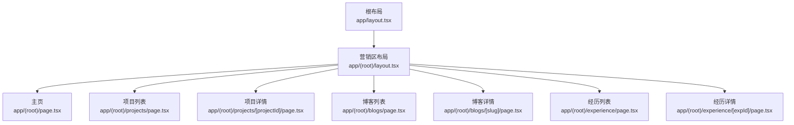
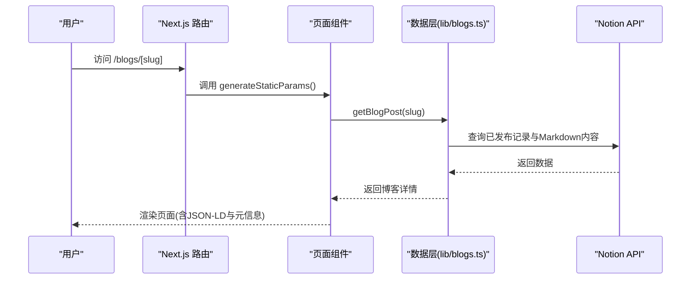
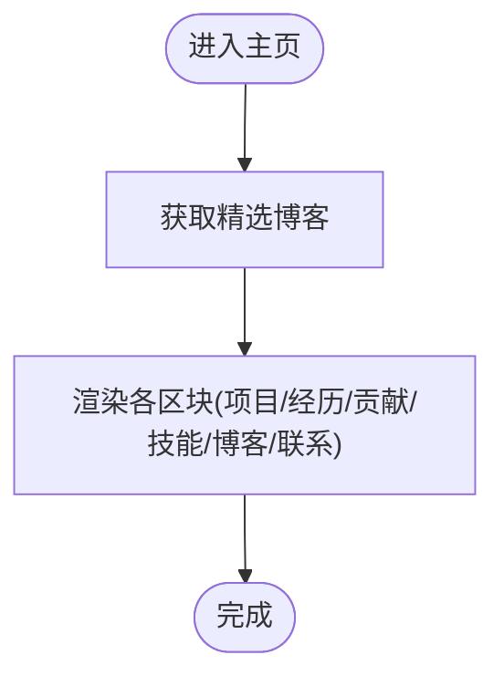
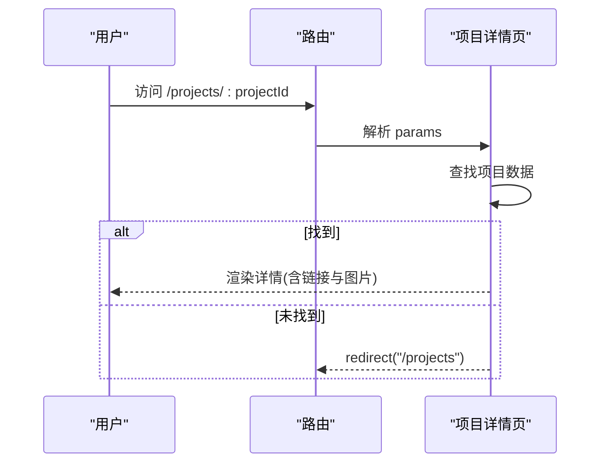
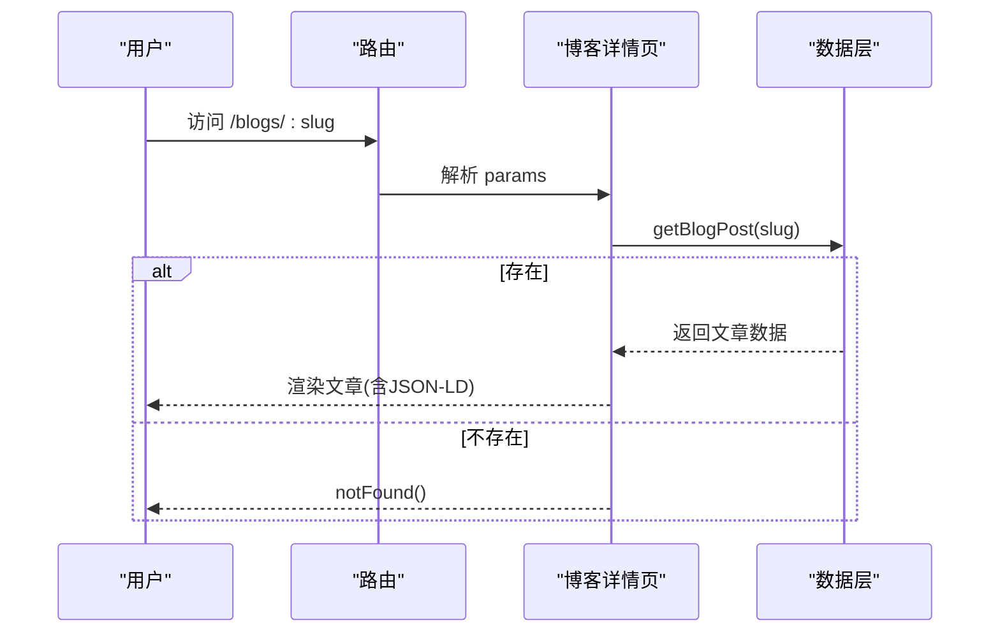
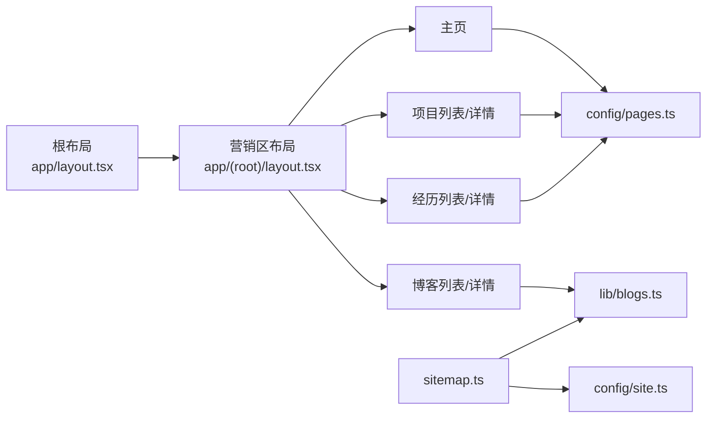

# 页面组件

<cite>
**本文引用的文件**
- [app/layout.tsx](file://app/layout.tsx)
- [app/(root)/layout.tsx](file://app/(root)/layout.tsx)
- [app/(root)/page.tsx](file://app/(root)/page.tsx)
- [app/(root)/projects/page.tsx](file://app/(root)/projects/page.tsx)
- [app/(root)/projects/[projectId]/page.tsx](file://app/(root)/projects/[projectId]/page.tsx)
- [app/(root)/blogs/page.tsx](file://app/(root)/blogs/page.tsx)
- [app/(root)/blogs/[slug]/page.tsx](file://app/(root)/blogs/[slug]/page.tsx)
- [app/(root)/experience/page.tsx](file://app/(root)/experience/page.tsx)
- [app/(root)/experience/[expId]/page.tsx](file://app/(root)/experience/[expId]/page.tsx)
- [lib/blogs.ts](file://lib/blogs.ts)
- [config/pages.ts](file://config/pages.ts)
- [config/site.ts](file://config/site.ts)
- [components/common/page-container.tsx](file://components/common/page-container.tsx)
- [components/common/client-page-wrapper.tsx](file://components/common/client-page-wrapper.tsx)
- [components/common/page-header.tsx](file://components/common/page-header.tsx)
- [app/sitemap.ts](file://app/sitemap.ts)
</cite>

## 目录
1. [简介](#简介)
2. [项目结构](#项目结构)
3. [核心组件](#核心组件)
4. [架构总览](#架构总览)
5. [详细组件分析](#详细组件分析)
6. [依赖关系分析](#依赖关系分析)
7. [性能考量](#性能考量)
8. [故障排查指南](#故障排查指南)
9. [结论](#结论)
10. [附录](#附录)

## 简介
本文件面向使用 Next.js App Router 的“投资组合”项目，系统化说明页面组件的架构与实现：包括主页、项目页、博客页、工作经历页等页面的职责分离、数据获取策略（服务端渲染/静态生成/缓存）、SEO 优化（元信息、结构化数据、站点地图）、路由参数传递与页面间导航机制、以及用户体验与性能优化实践。文档同时提供调试技巧与部署注意事项，帮助开发者构建高质量、可维护的页面组件。

## 项目结构
- 根布局 app/layout.tsx 负责全局 HTML、主题、分析与脚本注入，并定义全站 SEO 元信息。
- 营销区布局 app/(root)/layout.tsx 提供头部导航、页脚与主内容区域，统一页面容器。
- 页面集中在 app/(root) 下，按功能划分目录：
  - 主页 page.tsx
  - 项目列表与详情 projects/*
  - 博客列表与详情 blogs/*
  - 工作经历列表与详情 experience/*
  - 其他页面如 skills、contact、resume、contributions 等
- 公共 UI 与通用逻辑位于 components 与 lib 目录；配置集中于 config。

**图示来源**
- [app/layout.tsx:18-85](file://app/layout.tsx#L18-L85)
- [app/(root)/layout.tsx:11-31](file://app/(root)/layout.tsx#L11-L31)
- [app/(root)/page.tsx:28-35](file://app/(root)/page.tsx#L28-L35)
- [app/(root)/projects/page.tsx:9-12](file://app/(root)/projects/page.tsx#L9-L12)
- [app/(root)/projects/[projectId]/page.tsx:26-43](file://app/(root)/projects/[projectId]/page.tsx#L26-L43)
- [app/(root)/blogs/page.tsx:12-40](file://app/(root)/blogs/page.tsx#L12-L40)
- [app/(root)/blogs/[slug]/page.tsx:26-84](file://app/(root)/blogs/[slug]/page.tsx#L26-L84)
- [app/(root)/experience/page.tsx:9-22](file://app/(root)/experience/page.tsx#L9-L22)
- [app/(root)/experience/[expId]/page.tsx:27-46](file://app/(root)/experience/[expId]/page.tsx#L27-L46)

**章节来源**
- [app/layout.tsx:18-85](file://app/layout.tsx#L18-L85)
- [app/(root)/layout.tsx:11-31](file://app/(root)/layout.tsx#L11-L31)
- [app/(root)/page.tsx:28-35](file://app/(root)/page.tsx#L28-L35)

## 核心组件
- 根布局与营销区布局：集中处理全局样式、主题、SEO、分析与第三方脚本，保证页面一致性与可访问性。
- PageContainer/PageHeader：为内容页提供统一的标题与描述展示，简化页面头部复用。
- ClientPageWrapper：基于客户端动画包裹页面内容，提升过渡体验。
- 数据层 lib/blogs.ts：封装 Notion 博客数据获取、校验、缓存与内容渲染，提供列表与单篇接口。

**章节来源**
- [app/layout.tsx:87-131](file://app/layout.tsx#L87-L131)
- [app/(root)/layout.tsx:11-31](file://app/(root)/layout.tsx#L11-L31)
- [components/common/page-container.tsx:11-26](file://components/common/page-container.tsx#L11-L26)
- [components/common/page-header.tsx:6-20](file://components/common/page-header.tsx#L6-L20)
- [components/common/client-page-wrapper.tsx:25-36](file://components/common/client-page-wrapper.tsx#L25-L36)
- [lib/blogs.ts:492-536](file://lib/blogs.ts#L492-L536)

## 架构总览
- 渲染模式
  - 列表页与详情页均采用服务端渲染（SSR）或静态生成（SSG），通过 generateStaticParams 预生成路由参数，结合 unstable_cache 对数据请求进行缓存与按需失效。
- 数据获取策略
  - 博客数据通过 Notion Data Source API 拉取，并进行 Zod 校验；列表与详情分别缓存，支持 revalidate 时间控制。
  - 项目与经历数据来自本地配置，直接导入渲染。
- SEO 与结构化数据
  - 每个页面导出 metadata 设置标题、描述、Open Graph、Twitter Card、canonical 等。
  - 博客列表与文章页注入 BlogPosting、CollectionPage、BreadcrumbList 等 JSON-LD 结构化数据。
- 站点地图
  - sitemap.ts 动态聚合静态页面与博客文章，提供 lastModified、优先级与更新频率。

**图示来源**
- [app/(root)/blogs/[slug]/page.tsx:21-24](file://app/(root)/blogs/[slug]/page.tsx#L21-L24)
- [app/(root)/blogs/[slug]/page.tsx:86-92](file://app/(root)/blogs/[slug]/page.tsx#L86-L92)
- [lib/blogs.ts:492-536](file://lib/blogs.ts#L492-L536)
- [lib/blogs.ts:422-467](file://lib/blogs.ts#L422-L467)

**章节来源**
- [app/(root)/blogs/[slug]/page.tsx:21-84](file://app/(root)/blogs/[slug]/page.tsx#L21-L84)
- [lib/blogs.ts:404-420](file://lib/blogs.ts#L404-L420)
- [lib/blogs.ts:469-476](file://lib/blogs.ts#L469-L476)
- [app/sitemap.ts:6-71](file://app/sitemap.ts#L6-L71)

## 详细组件分析

### 主页（Home）
- 职责：聚合展示精选项目、经历、贡献、技能、博客与联系方式入口；注入个人与软件应用的结构化数据。
- 数据获取：异步获取精选博客列表；其余数据来自本地配置。
- SEO：导出页面级 metadata，包含 canonical；注入 Person 与 SoftwareApplication 的 JSON-LD。
- 交互与体验：使用动画组件与响应式布局，首屏图片优先加载。

**图示来源**
- [app/(root)/page.tsx:36-37](file://app/(root)/page.tsx#L36-L37)
- [app/(root)/page.tsx:68-351](file://app/(root)/page.tsx#L68-L351)

**章节来源**
- [app/(root)/page.tsx:28-35](file://app/(root)/page.tsx#L28-L35)
- [app/(root)/page.tsx:36-37](file://app/(root)/page.tsx#L36-L37)
- [app/(root)/page.tsx:68-351](file://app/(root)/page.tsx#L68-L351)

### 项目列表页（Projects）
- 职责：展示所有项目，并按类型（个人/专业）筛选。
- 数据获取：从本地配置 Projects 数组过滤渲染。
- SEO：导出页面元信息。
- 交互：使用响应式标签切换不同分类。

**章节来源**
- [app/(root)/projects/page.tsx:9-12](file://app/(root)/projects/page.tsx#L9-L12)
- [app/(root)/projects/page.tsx:14-58](file://app/(root)/projects/page.tsx#L14-L58)

### 项目详情页（Project Detail）
- 职责：根据路由参数 projectId 渲染项目详情，包含技术栈、描述、页面截图与外链。
- 数据获取：从本地配置查找对应项目；不存在时重定向到列表页。
- SEO：动态生成页面元信息，设置 canonical。
- 路由参数：generateStaticParams 预生成所有项目 ID，提升构建期性能与 SEO。

**图示来源**
- [app/(root)/projects/[projectId]/page.tsx:22-24](file://app/(root)/projects/[projectId]/page.tsx#L22-L24)
- [app/(root)/projects/[projectId]/page.tsx:26-43](file://app/(root)/projects/[projectId]/page.tsx#L26-L43)
- [app/(root)/projects/[projectId]/page.tsx:45-50](file://app/(root)/projects/[projectId]/page.tsx#L45-L50)

**章节来源**
- [app/(root)/projects/[projectId]/page.tsx:22-50](file://app/(root)/projects/[projectId]/page.tsx#L22-L50)
- [app/(root)/projects/[projectId]/page.tsx:52-213](file://app/(root)/projects/[projectId]/page.tsx#L52-L213)

### 博客列表页（Blogs）
- 职责：展示所有博客卡片，空状态友好提示。
- 数据获取：调用 getAllBlogsMeta 获取博客元信息；使用不稳定缓存减少重复请求。
- SEO：导出 Open Graph/Twitter Card；注入 CollectionPage 与 BreadcrumbList 的 JSON-LD。
- 体验：首张封面图懒加载优化，滚动动画增强。

**章节来源**
- [app/(root)/blogs/page.tsx:12-40](file://app/(root)/blogs/page.tsx#L12-L40)
- [app/(root)/blogs/page.tsx:42-151](file://app/(root)/blogs/page.tsx#L42-L151)
- [lib/blogs.ts:497-500](file://lib/blogs.ts#L497-L500)
- [lib/blogs.ts:404-420](file://lib/blogs.ts#L404-L420)

### 博客详情页（Blog Post）
- 职责：渲染单篇文章，包含标签、作者、日期、阅读时长、正文内容与面包屑导航。
- 数据获取：根据 slug 获取文章详情；不存在则触发 notFound。
- SEO：动态生成 article 类型的 Open Graph/Twitter Card；注入 BlogPosting 与 BreadcrumbList 的 JSON-LD。
- 路由参数：generateStaticParams 预生成所有 slug，提升构建期性能与 SEO。

**图示来源**
- [app/(root)/blogs/[slug]/page.tsx:21-24](file://app/(root)/blogs/[slug]/page.tsx#L21-L24)
- [app/(root)/blogs/[slug]/page.tsx:86-92](file://app/(root)/blogs/[slug]/page.tsx#L86-L92)
- [lib/blogs.ts:502-530](file://lib/blogs.ts#L502-L530)

**章节来源**
- [app/(root)/blogs/[slug]/page.tsx:26-84](file://app/(root)/blogs/[slug]/page.tsx#L26-L84)
- [app/(root)/blogs/[slug]/page.tsx:86-321](file://app/(root)/blogs/[slug]/page.tsx#L86-L321)
- [lib/blogs.ts:422-467](file://lib/blogs.ts#L422-L467)

### 工作经历列表页（Experience）
- 职责：以时间轴形式展示职业历程。
- 数据获取：从本地配置 experiences 数组渲染。
- SEO：导出页面元信息与 canonical。

**章节来源**
- [app/(root)/experience/page.tsx:9-33](file://app/(root)/experience/page.tsx#L9-L33)

### 工作经历详情页（Experience Detail）
- 职责：根据 expId 展示职位摘要、成就与技术栈，使用标签页组织内容。
- 数据获取：从本地配置查找对应经历；不存在时重定向到列表页。
- SEO：动态生成页面元信息与 canonical。
- 路由参数：generateStaticParams 预生成所有经历 ID。

**章节来源**
- [app/(root)/experience/[expId]/page.tsx:23-56](file://app/(root)/experience/[expId]/page.tsx#L23-L56)
- [app/(root)/experience/[expId]/page.tsx:58-209](file://app/(root)/experience/[expId]/page.tsx#L58-L209)

## 依赖关系分析
- 页面与布局
  - 所有页面均被营销区布局包裹，共享导航与页脚。
- 页面与数据层
  - 博客相关页面依赖 lib/blogs.ts 提供的列表与详情接口，并通过 unstable_cache 与 tags 管理缓存失效。
- 页面与配置
  - 页面标题、描述与元信息来自 config/pages.ts 与 config/site.ts，确保一致性。
- 站点地图
  - sitemap.ts 聚合静态路由与博客文章，依赖 siteConfig 与 getAllBlogsMeta。

**图示来源**
- [app/layout.tsx:87-131](file://app/layout.tsx#L87-L131)
- [app/(root)/layout.tsx:11-31](file://app/(root)/layout.tsx#L11-L31)
- [app/(root)/page.tsx:28-35](file://app/(root)/page.tsx#L28-L35)
- [app/(root)/projects/page.tsx:9-12](file://app/(root)/projects/page.tsx#L9-L12)
- [app/(root)/blogs/page.tsx:12-40](file://app/(root)/blogs/page.tsx#L12-L40)
- [app/(root)/experience/page.tsx:9-22](file://app/(root)/experience/page.tsx#L9-L22)
- [lib/blogs.ts:492-536](file://lib/blogs.ts#L492-L536)
- [config/pages.ts:15-81](file://config/pages.ts#L15-L81)
- [config/site.ts:1-39](file://config/site.ts#L1-L39)
- [app/sitemap.ts:6-71](file://app/sitemap.ts#L6-L71)

**章节来源**
- [app/sitemap.ts:6-71](file://app/sitemap.ts#L6-L71)
- [config/pages.ts:15-81](file://config/pages.ts#L15-L81)
- [config/site.ts:1-39](file://config/site.ts#L1-L39)

## 性能考量
- 构建期静态生成
  - 项目与经历详情页使用 generateStaticParams 预生成路由参数，减少运行时开销。
  - 博客详情页同样预生成 slug，提升首次加载与 SEO。
- 服务端缓存
  - 博客列表与详情通过 unstable_cache 与 tags 管理缓存，revalidate 时间可控，避免频繁请求 Notion API。
- 资源优化
  - 首屏图片使用 priority 与 sizes 属性优化加载；列表首项封面图 eagerLoadCover 提升感知速度。
- 客户端动画
  - 使用轻量级动画包裹页面内容，提升过渡体验而不阻塞关键渲染路径。

[本节为通用性能建议，不直接分析具体文件]

## 故障排查指南
- 博客数据缺失或未发布
  - 检查 Notion 数据源 Status 字段是否为 Published；若未发布或配置变更，将导致数据为空或抛出错误。
  - 参考日志与错误信息定位 Notion 客户端错误或对象未找到。
- 路由参数无效
  - 项目/经历详情页在找不到对应数据时会重定向到列表页；确认 generateStaticParams 是否覆盖所有有效 ID。
- 缓存未刷新
  - 修改博客内容后需确保 revalidate 或手动失效 tags 以更新缓存；检查环境变量 NOTION_BLOG_REVALIDATE_SECONDS。
- 元信息异常
  - 检查页面导出的 metadata 与 JSON-LD 是否正确注入；确认站点 URL 与 OG 图片地址可用。

**章节来源**
- [lib/blogs.ts:99-121](file://lib/blogs.ts#L99-L121)
- [lib/blogs.ts:287-335](file://lib/blogs.ts#L287-L335)
- [lib/blogs.ts:422-467](file://lib/blogs.ts#L422-L467)
- [app/(root)/projects/[projectId]/page.tsx:45-50](file://app/(root)/projects/[projectId]/page.tsx#L45-L50)
- [app/(root)/experience/[expId]/page.tsx:48-56](file://app/(root)/experience/[expId]/page.tsx#L48-L56)

## 结论
本项目基于 Next.js App Router 实现了清晰的页面组件架构：根布局与营销区布局统一管理全局体验；各页面职责明确，数据获取采用服务端渲染与静态生成结合，并通过缓存与预生成提升性能；SEO 通过元信息与结构化数据全面覆盖；路由参数与导航机制简洁可靠。遵循本文的最佳实践与排障建议，可高效构建高质量的页面组件。

[本节为总结性内容，不直接分析具体文件]

## 附录
- 开发最佳实践
  - 使用 generateStaticParams 预生成动态路由，提升构建期性能与 SEO。
  - 列表与详情数据尽量使用服务端函数封装，并在 lib 层做校验与缓存。
  - 页面元信息与结构化数据集中管理，保持跨页面一致性。
- 调试技巧
  - 利用浏览器开发者工具查看网络请求与缓存命中情况。
  - 检查 Notion 数据源配置与 Status 字段，确保数据可访问。
- 部署注意事项
  - 确保环境变量（如 Notion Token、Data Source ID、Google Measurement ID）正确配置。
  - 验证 sitemap 与 robots 配置，确保搜索引擎能正确抓取与索引。

[本节为通用指导，不直接分析具体文件]