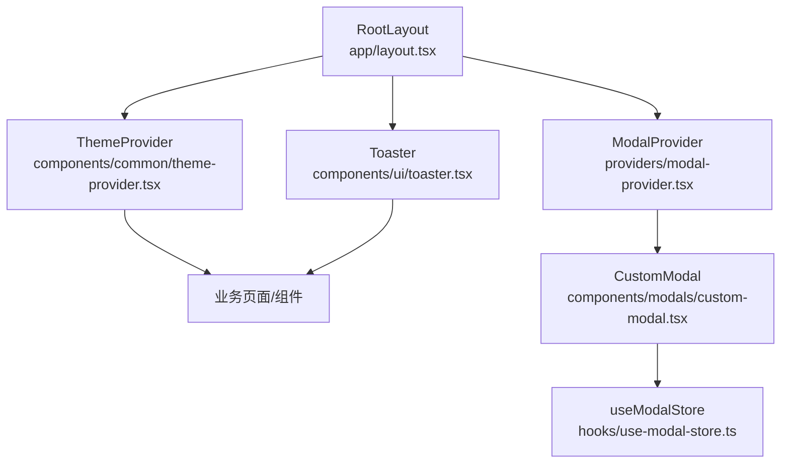
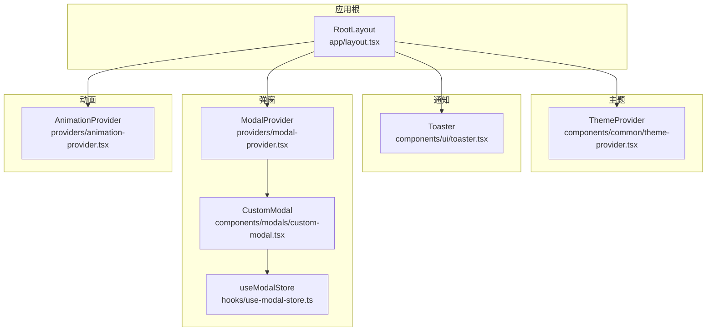
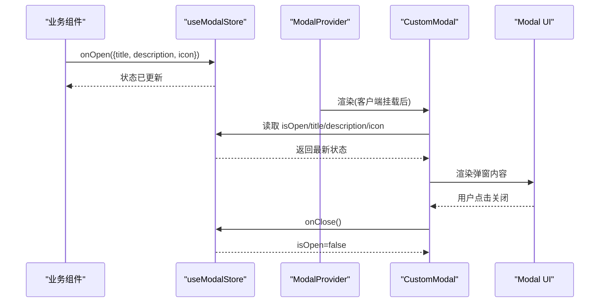
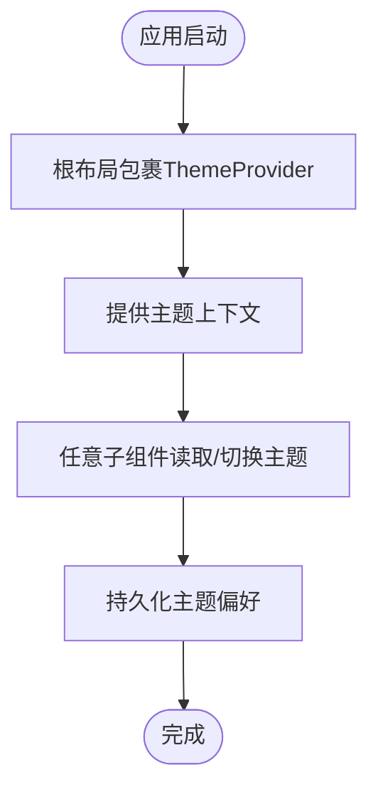
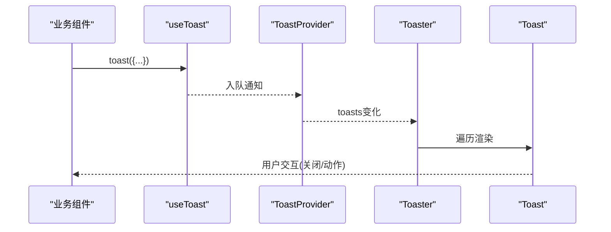
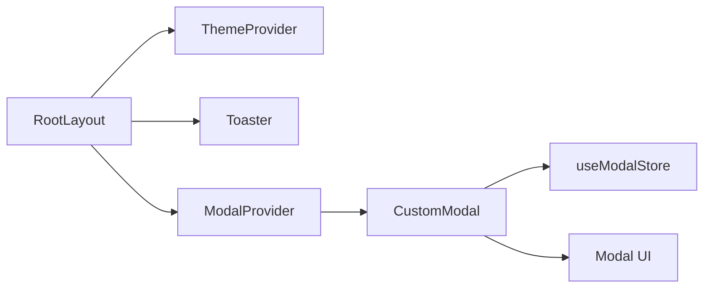
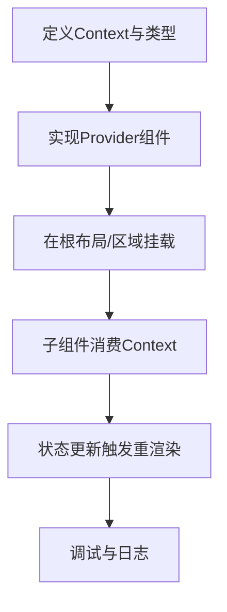

# Provider模式实现

<cite>
**本文引用的文件**
- [app/layout.tsx](file://app/layout.tsx)
- [providers/modal-provider.tsx](file://providers/modal-provider.tsx)
- [providers/animation-provider.tsx](file://providers/animation-provider.tsx)
- [components/common/theme-provider.tsx](file://components/common/theme-provider.tsx)
- [components/modals/custom-modal.tsx](file://components/modals/custom-modal.tsx)
- [hooks/use-modal-store.ts](file://hooks/use-modal-store.ts)
- [components/ui/toaster.tsx](file://components/ui/toaster.tsx)
- [components/ui/toast.tsx](file://components/ui/toast.tsx)
- [components/ui/modal.tsx](file://components/ui/modal.tsx)
</cite>

## 目录
1. [简介](#简介)
2. [项目结构](#项目结构)
3. [核心组件](#核心组件)
4. [架构总览](#架构总览)
5. [详细组件分析](#详细组件分析)
6. [依赖关系分析](#依赖关系分析)
7. [性能考量](#性能考量)
8. [故障排查指南](#故障排查指南)
9. [结论](#结论)
10. [附录：自定义Provider开发指南](#附录自定义provider开发指南)

## 简介
本文件围绕本项目中的“Provider模式”进行系统化说明，重点解释以下提供者的设计与实现：
- ModalProvider：全局弹窗容器的挂载与客户端渲染保护
- ThemeProvider：主题切换的上下文提供者（基于第三方库）
- AnimationProvider：动画能力的占位/扩展点（当前为透传children的骨架）

同时，文档将阐述React Context Provider的工作原理在本项目中的体现（Context创建、值传递、订阅与更新），并给出Provider与Consumer的交互模式、状态共享与事件处理、以及性能优化策略。最后提供自定义Provider的开发指南与典型使用场景。

## 项目结构
本项目采用Next.js App Router，应用根布局在顶层包裹多个Provider，以提供全局能力：
- 根布局中引入并包裹Theme、Toaster、Modal等全局能力
- 各Provider职责清晰：主题、通知、弹窗、动画等

图表来源
- [app/layout.tsx:99-145](file://app/layout.tsx#L99-L145)
- [components/common/theme-provider.tsx:5-7](file://components/common/theme-provider.tsx#L5-L7)
- [components/ui/toaster.tsx:13-35](file://components/ui/toaster.tsx#L13-L35)
- [providers/modal-provider.tsx:7-23](file://providers/modal-provider.tsx#L7-L23)
- [components/modals/custom-modal.tsx:6-29](file://components/modals/custom-modal.tsx#L6-L29)
- [hooks/use-modal-store.ts:22-35](file://hooks/use-modal-store.ts#L22-L35)

章节来源
- [app/layout.tsx:99-145](file://app/layout.tsx#L99-L145)

## 核心组件
- ModalProvider：负责在客户端挂载全局弹窗容器，避免服务端渲染时出现DOM不匹配问题。内部通过isMounted标志控制首次渲染时机，确保只在客户端渲染CustomModal。
- ThemeProvider：对next-themes提供的ThemeProvider进行轻量封装，统一配置属性（如attribute、themes等），在根布局中作为全局主题上下文提供者。
- AnimationProvider：当前作为动画能力的占位/扩展点，透传children，便于后续接入动画库或上下文。

章节来源
- [providers/modal-provider.tsx:7-23](file://providers/modal-provider.tsx#L7-L23)
- [components/common/theme-provider.tsx:5-7](file://components/common/theme-provider.tsx#L5-L7)
- [providers/animation-provider.tsx:5-11](file://providers/animation-provider.tsx#L5-L11)

## 架构总览
下图展示了根布局如何组合多个Provider，形成全局能力层；业务组件通过各自的能力（主题、通知、弹窗、动画）进行消费。

图表来源
- [app/layout.tsx:99-145](file://app/layout.tsx#L99-L145)
- [components/common/theme-provider.tsx:5-7](file://components/common/theme-provider.tsx#L5-L7)
- [components/ui/toaster.tsx:13-35](file://components/ui/toaster.tsx#L13-L35)
- [providers/modal-provider.tsx:7-23](file://providers/modal-provider.tsx#L7-L23)
- [components/modals/custom-modal.tsx:6-29](file://components/modals/custom-modal.tsx#L6-L29)
- [hooks/use-modal-store.ts:22-35](file://hooks/use-modal-store.ts#L22-L35)
- [providers/animation-provider.tsx:5-11](file://providers/animation-provider.tsx#L5-L11)

## 详细组件分析

### ModalProvider 与 CustomModal
- 设计要点
  - 使用客户端组件标记，结合isMounted状态，避免在服务端渲染时挂载弹窗容器，防止SSR水合不一致。
  - 仅渲染一次全局弹窗容器，实际弹窗内容通过Zustand store集中管理，任何组件均可触发打开/关闭。
- 数据流
  - 任意组件调用store的onOpen设置标题、描述、图标等，并打开弹窗。
  - CustomModal订阅store的isOpen、title、description、icon，渲染对应UI。
  - 关闭时调用onClose重置状态。

图表来源
- [providers/modal-provider.tsx:7-23](file://providers/modal-provider.tsx#L7-L23)
- [components/modals/custom-modal.tsx:6-29](file://components/modals/custom-modal.tsx#L6-L29)
- [hooks/use-modal-store.ts:22-35](file://hooks/use-modal-store.ts#L22-L35)
- [components/ui/modal.tsx:21-39](file://components/ui/modal.tsx#L21-L39)

章节来源
- [providers/modal-provider.tsx:7-23](file://providers/modal-provider.tsx#L7-L23)
- [components/modals/custom-modal.tsx:6-29](file://components/modals/custom-modal.tsx#L6-L29)
- [hooks/use-modal-store.ts:22-35](file://hooks/use-modal-store.ts#L22-L35)
- [components/ui/modal.tsx:21-39](file://components/ui/modal.tsx#L21-L39)

### ThemeProvider
- 设计要点
  - 对next-themes的ThemeProvider进行薄封装，统一配置项（如attribute、themes列表）。
  - 在根布局中包裹整个应用，使所有子组件可读取/切换主题。
- 工作原理
  - 内部维护主题状态，并通过Context向后代组件提供。
  - 支持系统主题、多主题切换，持久化到本地存储（由第三方库实现）。

图表来源
- [components/common/theme-provider.tsx:5-7](file://components/common/theme-provider.tsx#L5-L7)
- [app/layout.tsx:115-133](file://app/layout.tsx#L115-L133)

章节来源
- [components/common/theme-provider.tsx:5-7](file://components/common/theme-provider.tsx#L5-L7)
- [app/layout.tsx:115-133](file://app/layout.tsx#L115-L133)

### Toaster（ToastProvider）
- 设计要点
  - 使用Radix Toast的Provider包装，集中渲染通知列表。
  - 通过useToast Hook获取toasts数组，动态渲染每个Toast。
- 工作原理
  - 任何组件调用toast API即可入队一条通知，Toaster统一渲染和定位。

图表来源
- [components/ui/toaster.tsx:13-35](file://components/ui/toaster.tsx#L13-L35)
- [components/ui/toast.tsx:8-22](file://components/ui/toast.tsx#L8-L22)

章节来源
- [components/ui/toaster.tsx:13-35](file://components/ui/toaster.tsx#L13-L35)
- [components/ui/toast.tsx:8-22](file://components/ui/toast.tsx#L8-L22)

### AnimationProvider
- 设计要点
  - 当前为透传children的占位组件，便于未来注入动画上下文或全局动画配置。
- 使用建议
  - 可在根布局中按需包裹，或在需要动画能力的区域局部包裹。

章节来源
- [providers/animation-provider.tsx:5-11](file://providers/animation-provider.tsx#L5-L11)

## 依赖关系分析
- 根布局依赖：
  - ThemeProvider：提供主题上下文
  - Toaster：提供通知能力
  - ModalProvider：提供全局弹窗容器
- ModalProvider依赖：
  - CustomModal：弹窗UI
  - useModalStore：弹窗状态管理（Zustand）
- CustomModal依赖：
  - Modal：基础对话框组件
  - useModalStore：读取/更新弹窗状态

图表来源
- [app/layout.tsx:99-145](file://app/layout.tsx#L99-L145)
- [providers/modal-provider.tsx:7-23](file://providers/modal-provider.tsx#L7-L23)
- [components/modals/custom-modal.tsx:6-29](file://components/modals/custom-modal.tsx#L6-L29)
- [hooks/use-modal-store.ts:22-35](file://hooks/use-modal-store.ts#L22-L35)
- [components/ui/modal.tsx:21-39](file://components/ui/modal.tsx#L21-L39)

章节来源
- [app/layout.tsx:99-145](file://app/layout.tsx#L99-L145)
- [providers/modal-provider.tsx:7-23](file://providers/modal-provider.tsx#L7-L23)
- [components/modals/custom-modal.tsx:6-29](file://components/modals/custom-modal.tsx#L6-L29)
- [hooks/use-modal-store.ts:22-35](file://hooks/use-modal-store.ts#L22-L35)
- [components/ui/modal.tsx:21-39](file://components/ui/modal.tsx#L21-L39)

## 性能考量
- 客户端渲染保护：ModalProvider使用isMounted标志，避免服务端渲染阶段挂载弹窗容器，减少水合差异与不必要的重渲染。
- 状态粒度：弹窗状态集中在Zustand store，避免通过Context层层传递导致的无关组件重渲染。
- Provider最小化：ThemeProvider与Toaster均为全局能力，但各自职责单一，避免在Provider内放置过多逻辑。
- 懒加载与边界：如需更细粒度的动画能力，可将AnimationProvider下沉至页面级或组件级，按需启用。

[本节为通用性能建议，不直接分析具体代码文件]

## 故障排查指南
- 弹窗未显示
  - 检查ModalProvider是否在根布局正确挂载
  - 确认useModalStore的onOpen是否被调用且参数完整
  - 查看CustomModal是否正确读取store状态
- 主题不生效
  - 确认根布局已包裹ThemeProvider
  - 检查第三方库配置（如attribute、themes）
- 通知不出现
  - 确认Toaster已在根布局挂载
  - 检查useToast的使用方式与入队逻辑

章节来源
- [providers/modal-provider.tsx:7-23](file://providers/modal-provider.tsx#L7-L23)
- [components/modals/custom-modal.tsx:6-29](file://components/modals/custom-modal.tsx#L6-L29)
- [hooks/use-modal-store.ts:22-35](file://hooks/use-modal-store.ts#L22-L35)
- [components/ui/toaster.tsx:13-35](file://components/ui/toaster.tsx#L13-L35)
- [components/common/theme-provider.tsx:5-7](file://components/common/theme-provider.tsx#L5-L7)

## 结论
本项目通过根布局组合多个Provider，形成了清晰的全局能力分层：主题、通知、弹窗、动画。其中：
- ModalProvider专注于客户端挂载与全局弹窗容器
- ThemeProvider封装第三方主题能力，提供统一的主题上下文
- Toaster提供全局通知能力
- AnimationProvider预留动画扩展点

这种模式使得业务组件可以无感知地消费全局能力，同时保持职责分离与可维护性。

[本节为总结性内容，不直接分析具体代码文件]

## 附录：自定义Provider开发指南
- 接口设计
  - 明确Props类型，定义children与可选配置项
  - 对外暴露稳定的API（如方法、状态、事件回调）
- 错误处理
  - 在Provider入口处校验必要配置，抛出明确的错误信息
  - 对异步初始化失败提供降级方案
- 调试技巧
  - 使用开发工具打印关键状态变更
  - 为Provider添加日志开关，便于生产环境关闭
- 示例流程（概念性）
  - 创建Context
  - 实现Provider组件，维护状态并提供值
  - 在根布局或合适层级包裹
  - 在子组件中通过Hook或高阶组件消费

[本节为概念性指导，不直接分析具体代码文件]