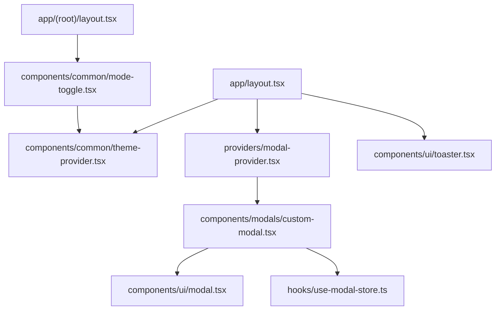
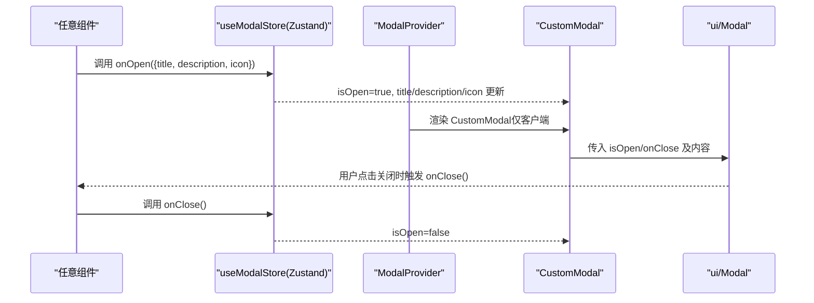
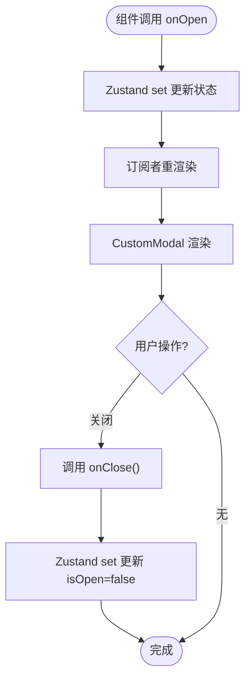
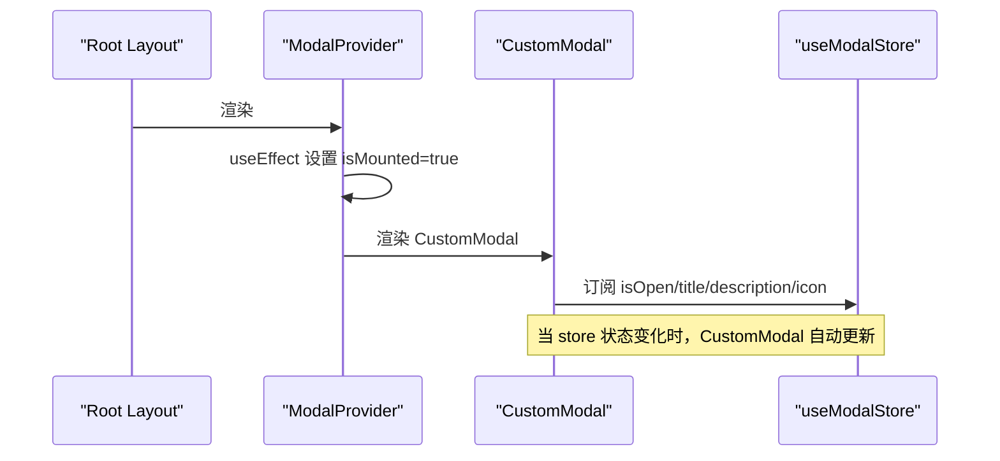
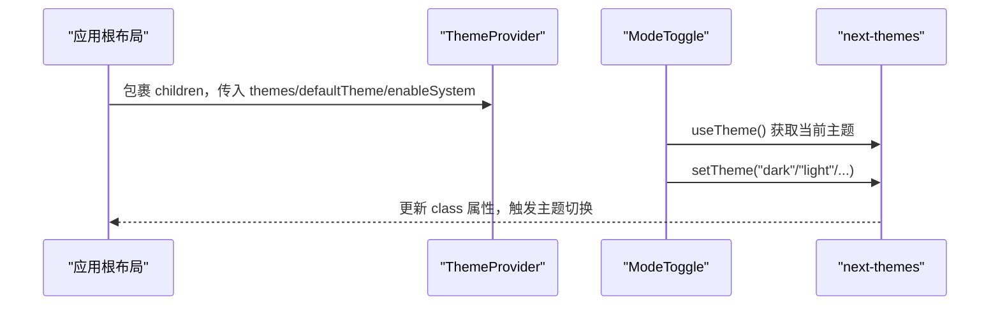
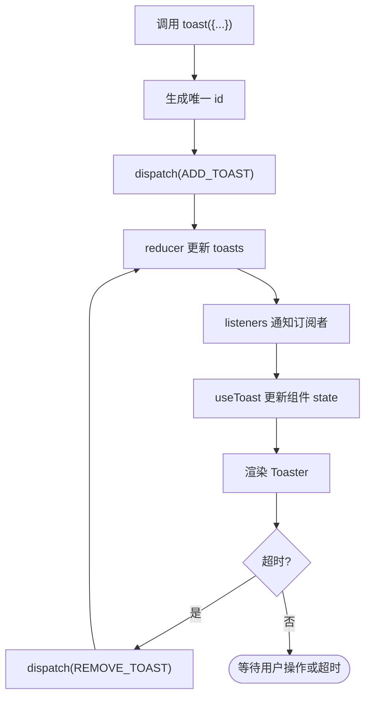
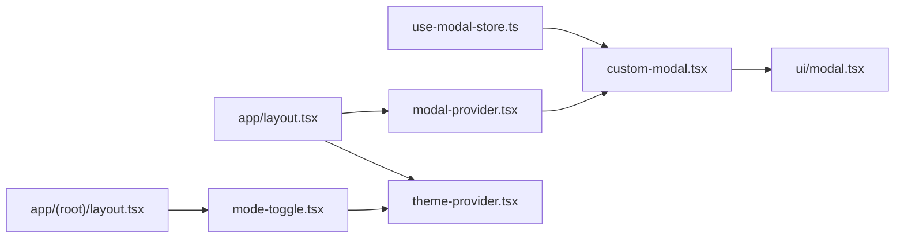

# 状态管理设计

<cite>
**本文引用的文件**
- [hooks/use-modal-store.ts](file://hooks/use-modal-store.ts)
- [components/modals/custom-modal.tsx](file://components/modals/custom-modal.tsx)
- [providers/modal-provider.tsx](file://providers/modal-provider.tsx)
- [components/ui/modal.tsx](file://components/ui/modal.tsx)
- [components/common/theme-provider.tsx](file://components/common/theme-provider.tsx)
- [components/common/mode-toggle.tsx](file://components/common/mode-toggle.tsx)
- [app/layout.tsx](file://app/layout.tsx)
- [app/(root)/layout.tsx](file://app/(root)/layout.tsx)
- [components/ui/use-toast.ts](file://components/ui/use-toast.ts)
</cite>

## 目录
1. [简介](#简介)
2. [项目结构](#项目结构)
3. [核心组件](#核心组件)
4. [架构总览](#架构总览)
5. [详细组件分析](#详细组件分析)
6. [依赖关系分析](#依赖关系分析)
7. [性能考量](#性能考量)
8. [故障排查指南](#故障排查指南)
9. [结论](#结论)
10. [附录](#附录)

## 简介
本项目的状态管理采用“分层策略”：
- 复杂业务与跨组件 UI 状态：使用 Zustand（如模态框全局状态 useModalStore）。
- 全局配置与主题：使用 React Context（通过 next-themes 的 ThemeProvider）实现主题切换与持久化。
- 组件内部状态：使用本地 state（useState/useEffect 等），避免不必要的跨组件共享。

该设计将“客户端 UI 状态”和“服务器数据状态”解耦，保持清晰的职责边界，便于维护与扩展。

## 项目结构
状态相关的关键位置与职责：
- hooks/use-modal-store.ts：定义并导出 Zustand store，提供模态框的全局状态与动作。
- providers/modal-provider.tsx：在应用根层级挂载 CustomModal，确保模态框始终存在且仅在客户端渲染。
- components/modals/custom-modal.tsx：订阅 useModalStore，渲染模态内容。
- components/ui/modal.tsx：基于 shadcn/ui Dialog 的通用模态容器。
- components/common/theme-provider.tsx：封装 next-themes 的 ThemeProvider，提供主题上下文。
- components/common/mode-toggle.tsx：通过 useTheme 切换主题，体现 Context 的使用。
- app/layout.tsx：应用根布局，注入 ThemeProvider、Toaster、ModalProvider。
- app/(root)/layout.tsx：页面级布局，集成 ModeToggle 等 UI。
- components/ui/use-toast.ts：自定义通知系统，使用 reducer + listeners 实现轻量全局通知状态。

图表来源
- [app/layout.tsx:99-133](file://app/layout.tsx#L99-L133)
- [components/common/theme-provider.tsx:1-7](file://components/common/theme-provider.tsx#L1-L7)
- [providers/modal-provider.tsx:1-23](file://providers/modal-provider.tsx#L1-L23)
- [components/modals/custom-modal.tsx:1-29](file://components/modals/custom-modal.tsx#L1-L29)
- [components/ui/modal.tsx:1-39](file://components/ui/modal.tsx#L1-L39)
- [hooks/use-modal-store.ts:1-35](file://hooks/use-modal-store.ts#L1-L35)
- [app/(root)/layout.tsx:11-31](file://app/(root)/layout.tsx#L11-L31)
- [components/common/mode-toggle.tsx:15-69](file://components/common/mode-toggle.tsx#L15-L69)

章节来源
- [app/layout.tsx:99-133](file://app/layout.tsx#L99-L133)
- [app/(root)/layout.tsx:11-31](file://app/(root)/layout.tsx#L11-L31)

## 核心组件
- useModalStore（Zustand）：集中管理模态框开关、标题、描述、图标及打开/关闭动作。
- ModalProvider：保证 CustomModal 在客户端挂载，避免 SSR 不匹配。
- CustomModal：消费 useModalStore，渲染具体模态内容。
- ThemeProvider：基于 next-themes 的主题上下文，支持多主题与持久化。
- ModeToggle：通过 useTheme 切换主题，展示 Context 的实际用法。
- Toast 系统：基于 reducer + listeners 的通知状态管理，用于用户反馈。

章节来源
- [hooks/use-modal-store.ts:1-35](file://hooks/use-modal-store.ts#L1-L35)
- [providers/modal-provider.tsx:1-23](file://providers/modal-provider.tsx#L1-L23)
- [components/modals/custom-modal.tsx:1-29](file://components/modals/custom-modal.tsx#L1-L29)
- [components/common/theme-provider.tsx:1-7](file://components/common/theme-provider.tsx#L1-L7)
- [components/common/mode-toggle.tsx:15-69](file://components/common/mode-toggle.tsx#L15-L69)
- [components/ui/use-toast.ts:1-189](file://components/ui/use-toast.ts#L1-L189)

## 架构总览
整体状态管理遵循“分层+解耦”原则：
- 全局 UI 状态（Zustand）：useModalStore 负责模态框状态，任何组件均可订阅与触发。
- 全局配置（React Context）：ThemeProvider 提供主题能力，ModeToggle 通过 useTheme 切换主题。
- 组件内状态：各表单、卡片等使用 useState 管理局部交互。
- 通知状态（reducer + listeners）：Toast 系统以最小耦合方式提供全局通知能力。

图表来源
- [hooks/use-modal-store.ts:22-35](file://hooks/use-modal-store.ts#L22-L35)
- [providers/modal-provider.tsx:7-23](file://providers/modal-provider.tsx#L7-L23)
- [components/modals/custom-modal.tsx:6-29](file://components/modals/custom-modal.tsx#L6-L29)
- [components/ui/modal.tsx:21-39](file://components/ui/modal.tsx#L21-L39)

## 详细组件分析

### useModalStore（Zustand 全局状态）
- 状态定义
  - isOpen：控制模态框显示/隐藏。
  - title/description/icon：模态框内容与图标。
- 动作函数
  - onOpen(data)：设置 isOpen=true，并写入标题、描述、图标。
  - onClose()：设置 isOpen=false。
- 订阅机制
  - 通过 create 创建 store，组件订阅后仅在对应字段变化时重渲染。
  - CustomModal 订阅 isOpen/title/description/icon，实现响应式更新。

图表来源
- [hooks/use-modal-store.ts:22-35](file://hooks/use-modal-store.ts#L22-L35)
- [components/modals/custom-modal.tsx:6-29](file://components/modals/custom-modal.tsx#L6-L29)

章节来源
- [hooks/use-modal-store.ts:1-35](file://hooks/use-modal-store.ts#L1-L35)
- [components/modals/custom-modal.tsx:1-29](file://components/modals/custom-modal.tsx#L1-L29)

### ModalProvider（客户端挂载）
- 作用：在应用根层级挂载 CustomModal，确保模态框始终存在于 DOM 中。
- 客户端渲染处理：使用 isMounted 标志，首次渲染返回 null，避免 SSR 与客户端不一致导致的警告。
- 与 useModalStore 的关系：CustomModal 内部订阅 useModalStore，因此 ModalProvider 间接驱动模态框生命周期。

图表来源
- [providers/modal-provider.tsx:1-23](file://providers/modal-provider.tsx#L1-L23)
- [components/modals/custom-modal.tsx:1-29](file://components/modals/custom-modal.tsx#L1-L29)
- [hooks/use-modal-store.ts:1-35](file://hooks/use-modal-store.ts#L1-L35)

章节来源
- [providers/modal-provider.tsx:1-23](file://providers/modal-provider.tsx#L1-L23)

### ThemeProvider（主题上下文）
- 工作机制
  - 基于 next-themes 的 ThemeProvider，提供 theme 上下文。
  - 支持多主题（light/dark/retro/cyberpunk/paper/aurora/synthwave），默认 system。
  - 通过 attribute="class" 将主题类名应用到根节点，实现 CSS 变量切换。
  - 启用 enableSystem 与 defaultTheme="system"，结合浏览器偏好与持久化存储。
- 客户端渲染处理
  - 使用 suppressHydrationWarning 避免 SSR 与客户端主题不一致的警告。
- 使用示例
  - ModeToggle 通过 useTheme().setTheme 切换主题，体现 Context 的消费。

图表来源
- [components/common/theme-provider.tsx:1-7](file://components/common/theme-provider.tsx#L1-L7)
- [components/common/mode-toggle.tsx:15-69](file://components/common/mode-toggle.tsx#L15-L69)
- [app/layout.tsx:105-133](file://app/layout.tsx#L105-L133)

章节来源
- [components/common/theme-provider.tsx:1-7](file://components/common/theme-provider.tsx#L1-L7)
- [components/common/mode-toggle.tsx:15-69](file://components/common/mode-toggle.tsx#L15-L69)
- [app/layout.tsx:105-133](file://app/layout.tsx#L105-L133)

### Toast 系统（通知状态）
- 实现模式
  - 使用 reducer 管理 toasts 列表，支持 ADD/UPDATE/DISMISS/REMOVE。
  - 通过 listeners 数组广播状态变更，useToast 订阅并同步到组件 state。
  - 自动移除队列：根据 TOAST_REMOVE_DELAY 定时清理 toast。
- 使用场景
  - 用户操作反馈（成功/失败提示）、全局消息提醒。

图表来源
- [components/ui/use-toast.ts:1-189](file://components/ui/use-toast.ts#L1-L189)

章节来源
- [components/ui/use-toast.ts:1-189](file://components/ui/use-toast.ts#L1-L189)

## 依赖关系分析
- useModalStore 被 CustomModal 订阅，CustomModal 由 ModalProvider 挂载。
- ThemeProvider 为 ModeToggle 提供 useTheme 能力，ModeToggle 位于页面布局中。
- app/layout.tsx 作为根布局，统一注入 ThemeProvider、Toaster、ModalProvider。
- ui/modal.tsx 依赖 shadcn/ui 的 Dialog 组件，作为模态容器。

图表来源
- [hooks/use-modal-store.ts:1-35](file://hooks/use-modal-store.ts#L1-L35)
- [components/modals/custom-modal.tsx:1-29](file://components/modals/custom-modal.tsx#L1-L29)
- [components/ui/modal.tsx:1-39](file://components/ui/modal.tsx#L1-L39)
- [providers/modal-provider.tsx:1-23](file://providers/modal-provider.tsx#L1-L23)
- [components/common/theme-provider.tsx:1-7](file://components/common/theme-provider.tsx#L1-L7)
- [components/common/mode-toggle.tsx:15-69](file://components/common/mode-toggle.tsx#L15-L69)
- [app/layout.tsx:99-133](file://app/layout.tsx#L99-L133)
- [app/(root)/layout.tsx:11-31](file://app/(root)/layout.tsx#L11-L31)

章节来源
- [app/layout.tsx:99-133](file://app/layout.tsx#L99-L133)
- [app/(root)/layout.tsx:11-31](file://app/(root)/layout.tsx#L11-L31)

## 性能考量
- Zustand 细粒度订阅：只有被使用的字段变化才会触发重渲染，减少不必要更新。
- 客户端渲染隔离：ModalProvider 使用 isMounted 避免 SSR 不匹配；ThemeProvider 使用 suppressHydrationWarning 降低闪烁风险。
- 通知去重与限流：Toast 限制同时显示数量，避免过多 UI 更新。
- 建议优化
  - 对大型 store 进行拆分，按领域划分（如 UI、业务、表单等）。
  - 对高频更新的字段使用 selector 或派生状态，进一步减少重渲染范围。
  - 对主题切换考虑懒加载样式资源，减少首屏体积。

[本节为通用指导，无需特定文件引用]

## 故障排查指南
- 模态框未显示
  - 检查 ModalProvider 是否正确挂载于根布局。
  - 确认 onOpen 是否被正确调用，store 的 isOpen 是否为 true。
  - 查看 CustomModal 是否接收到正确的 title/description/icon。
- 主题切换无效
  - 确认 ThemeProvider 已包裹应用根节点。
  - 检查 ModeToggle 是否调用了 setTheme，浏览器控制台是否有错误。
  - 若出现闪烁，确认 suppressHydrationWarning 与 enableSystem 配置。
- Toast 不消失或堆积
  - 检查 TOAST_REMOVE_DELAY 与 TOAST_LIMIT 配置。
  - 确认 dispatch(REMOVE_TOAST) 是否在超时后被调用。

章节来源
- [providers/modal-provider.tsx:1-23](file://providers/modal-provider.tsx#L1-L23)
- [components/modals/custom-modal.tsx:1-29](file://components/modals/custom-modal.tsx#L1-L29)
- [components/common/theme-provider.tsx:1-7](file://components/common/theme-provider.tsx#L1-L7)
- [components/common/mode-toggle.tsx:15-69](file://components/common/mode-toggle.tsx#L15-L69)
- [components/ui/use-toast.ts:1-189](file://components/ui/use-toast.ts#L1-L189)

## 结论
本项目采用“Zustand + React Context + 本地状态”的分层状态管理策略，清晰分离了全局 UI 状态、全局配置与组件内状态。useModalStore 提供了简洁的模态框管理能力，ThemeProvider 实现了灵活的主题切换与持久化，Toast 系统则提供了轻量而可靠的用户反馈机制。该设计兼顾可维护性与性能，适合中小型 Next.js 应用的扩展与维护。

[本节为总结性内容，无需特定文件引用]

## 附录
- 关键路径参考
  - 模态框状态定义与动作：[hooks/use-modal-store.ts:1-35](file://hooks/use-modal-store.ts#L1-L35)
  - 模态框渲染与订阅：[components/modals/custom-modal.tsx:1-29](file://components/modals/custom-modal.tsx#L1-L29)
  - 模态框容器：[components/ui/modal.tsx:1-39](file://components/ui/modal.tsx#L1-L39)
  - 模态框挂载：[providers/modal-provider.tsx:1-23](file://providers/modal-provider.tsx#L1-L23)
  - 主题提供者：[components/common/theme-provider.tsx:1-7](file://components/common/theme-provider.tsx#L1-L7)
  - 主题切换器：[components/common/mode-toggle.tsx:15-69](file://components/common/mode-toggle.tsx#L15-L69)
  - 应用根布局：[app/layout.tsx:99-133](file://app/layout.tsx#L99-L133)
  - 页面布局：[app/(root)/layout.tsx:11-31](file://app/(root)/layout.tsx#L11-L31)
  - 通知系统：[components/ui/use-toast.ts:1-189](file://components/ui/use-toast.ts#L1-L189)