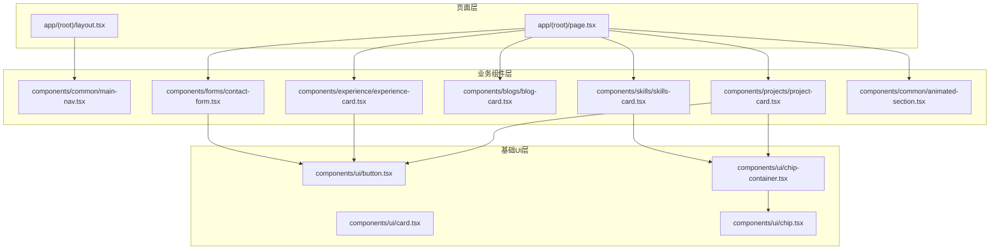
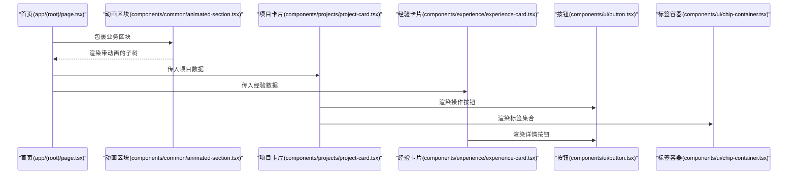
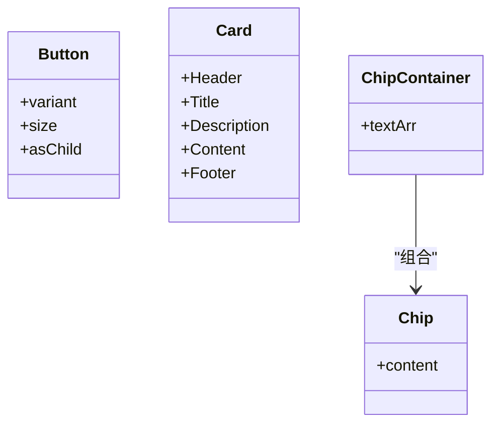
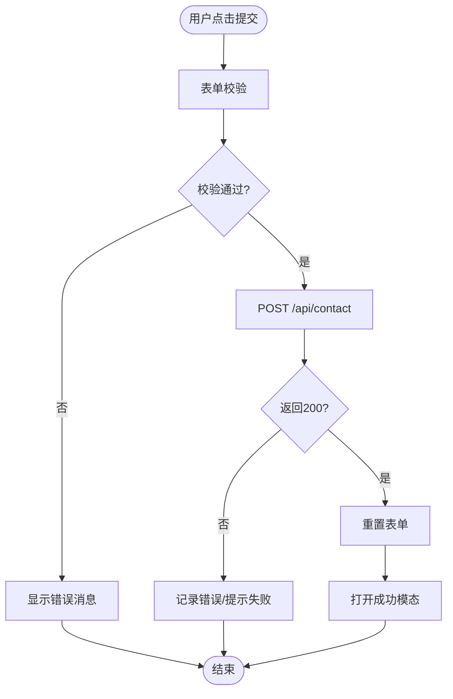
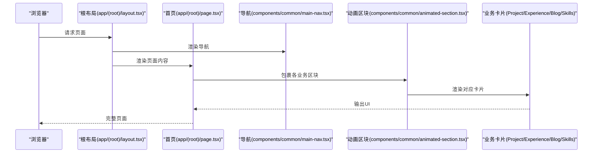
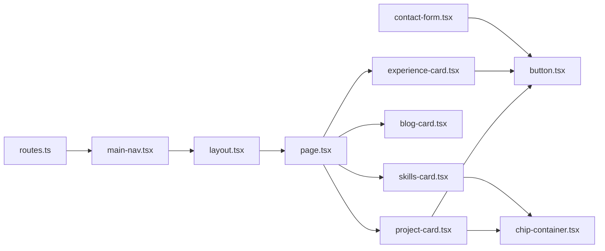

# 组件层次结构

<cite>
**本文引用的文件**
- [components/ui/button.tsx](file://components/ui/button.tsx)
- [components/ui/card.tsx](file://components/ui/card.tsx)
- [components/ui/chip.tsx](file://components/ui/chip.tsx)
- [components/ui/chip-container.tsx](file://components/ui/chip-container.tsx)
- [components/common/main-nav.tsx](file://components/common/main-nav.tsx)
- [components/common/animated-section.tsx](file://components/common/animated-section.tsx)
- [components/projects/project-card.tsx](file://components/projects/project-card.tsx)
- [components/experience/experience-card.tsx](file://components/experience/experience-card.tsx)
- [components/blogs/blog-card.tsx](file://components/blogs/blog-card.tsx)
- [components/skills/skills-card.tsx](file://components/skills/skills-card.tsx)
- [components/skills/rating.tsx](file://components/skills/rating.tsx)
- [components/forms/contact-form.tsx](file://components/forms/contact-form.tsx)
- [app/(root)/layout.tsx](file://app/(root)/layout.tsx)
- [app/(root)/page.tsx](file://app/(root)/page.tsx)
- [config/routes.ts](file://config/routes.ts)
</cite>

## 目录
1. [简介](#简介)
2. [项目结构](#项目结构)
3. [核心组件](#核心组件)
4. [架构总览](#架构总览)
5. [详细组件分析](#详细组件分析)
6. [依赖关系分析](#依赖关系分析)
7. [性能考虑](#性能考虑)
8. [故障排查指南](#故障排查指南)
9. [结论](#结论)
10. [附录](#附录)

## 简介
本文件系统化梳理项目的三层组件架构：基础UI组件层、通用业务组件层、页面级组件层。重点说明每层职责边界、依赖关系与复用策略，并通过类图、调用序列图和流程图展示从基础组件到页面组件的组装过程，辅以各层的实现模式与最佳实践指引。

## 项目结构
- 基础UI组件层（components/ui）：提供原子化、无业务语义的UI元素，如按钮、卡片、标签容器等，强调样式变体、可组合性与主题一致性。
- 通用业务组件层（components/common、components/projects、components/experience、components/blogs、components/skills、components/forms、components/modals）：围绕具体业务领域进行组合与编排，封装交互与展示逻辑，具备一定状态管理能力。
- 页面级组件层（app/(root)）：Next.js App Router 页面与布局，负责路由装配、数据获取、SEO元信息以及将业务组件按页面需求进行编排。

图表来源
- [app/(root)/layout.tsx:1-33](file://app/(root)/layout.tsx#L1-L33)
- [app/(root)/page.tsx:1-357](file://app/(root)/page.tsx#L1-L357)
- [components/common/main-nav.tsx:1-105](file://components/common/main-nav.tsx#L1-L105)
- [components/projects/project-card.tsx:1-51](file://components/projects/project-card.tsx#L1-L51)
- [components/experience/experience-card.tsx:1-112](file://components/experience/experience-card.tsx#L1-L112)
- [components/blogs/blog-card.tsx:1-96](file://components/blogs/blog-card.tsx#L1-L96)
- [components/skills/skills-card.tsx:1-31](file://components/skills/skills-card.tsx#L1-L31)
- [components/forms/contact-form.tsx:1-142](file://components/forms/contact-form.tsx#L1-L142)
- [components/common/animated-section.tsx:1-51](file://components/common/animated-section.tsx#L1-L51)
- [components/ui/button.tsx:1-57](file://components/ui/button.tsx#L1-L57)
- [components/ui/card.tsx:1-87](file://components/ui/card.tsx#L1-L87)
- [components/ui/chip-container.tsx:1-16](file://components/ui/chip-container.tsx#L1-L16)
- [components/ui/chip.tsx:1-12](file://components/ui/chip.tsx#L1-L12)

章节来源
- [app/(root)/layout.tsx:1-33](file://app/(root)/layout.tsx#L1-L33)
- [app/(root)/page.tsx:1-357](file://app/(root)/page.tsx#L1-L357)

## 核心组件
- 基础UI组件层
  - 按钮（Button）：基于样式变体系统，支持多尺寸与多种视觉风格，可通过 asChild 透传为任意可聚焦元素，便于与链接或第三方组件组合。
  - 卡片（Card）：提供头部、标题、描述、内容、底部等子块，统一圆角、边框与阴影，适合承载信息区块。
  - 标签（Chip/ChipContainer）：用于展示分类、标签集合，支持横向换行与间距控制。
- 通用业务组件层
  - 导航（MainNav）：响应式导航，桌面端显示主菜单，移动端提供折叠菜单；根据当前路由高亮；集成动画与图标。
  - 项目卡片（ProjectCard）、经验卡片（ExperienceCard）、博客卡片（BlogCard）、技能卡片（SkillsCard）：各自聚合图片、文本、标签、操作按钮等，面向业务数据渲染。
  - 表单（ContactForm）：基于表单库与校验规则，提交至服务端API并反馈结果。
  - 动画区块（AnimatedSection）：基于滚动视口的入场动画，提升页面动效体验。
- 页面级组件层
  - 根布局（Root Layout）：装配全局头部导航、页脚与主题切换等。
  - 首页（Home Page）：编排多个业务区块，使用配置数据驱动渲染，注入结构化数据与SEO元信息。

章节来源
- [components/ui/button.tsx:1-57](file://components/ui/button.tsx#L1-L57)
- [components/ui/card.tsx:1-87](file://components/ui/card.tsx#L1-L87)
- [components/ui/chip.tsx:1-12](file://components/ui/chip.tsx#L1-L12)
- [components/ui/chip-container.tsx:1-16](file://components/ui/chip-container.tsx#L1-L16)
- [components/common/main-nav.tsx:1-105](file://components/common/main-nav.tsx#L1-L105)
- [components/projects/project-card.tsx:1-51](file://components/projects/project-card.tsx#L1-L51)
- [components/experience/experience-card.tsx:1-112](file://components/experience/experience-card.tsx#L1-L112)
- [components/blogs/blog-card.tsx:1-96](file://components/blogs/blog-card.tsx#L1-L96)
- [components/skills/skills-card.tsx:1-31](file://components/skills/skills-card.tsx#L1-L31)
- [components/forms/contact-form.tsx:1-142](file://components/forms/contact-form.tsx#L1-L142)
- [components/common/animated-section.tsx:1-51](file://components/common/animated-section.tsx#L1-L51)
- [app/(root)/layout.tsx:1-33](file://app/(root)/layout.tsx#L1-L33)
- [app/(root)/page.tsx:1-357](file://app/(root)/page.tsx#L1-L357)

## 架构总览
下图展示了从页面到业务组件再到基础UI组件的调用链，体现“页面编排 → 业务组合 → 原子复用”的分层原则。

图表来源
- [app/(root)/page.tsx:146-187](file://app/(root)/page.tsx#L146-L187)
- [components/common/animated-section.tsx:1-51](file://components/common/animated-section.tsx#L1-L51)
- [components/projects/project-card.tsx:1-51](file://components/projects/project-card.tsx#L1-L51)
- [components/experience/experience-card.tsx:1-112](file://components/experience/experience-card.tsx#L1-L112)
- [components/ui/button.tsx:1-57](file://components/ui/button.tsx#L1-L57)
- [components/ui/chip-container.tsx:1-16](file://components/ui/chip-container.tsx#L1-L16)

## 详细组件分析

### 基础UI组件层
- 按钮（Button）
  - 职责：提供一致的视觉与交互基元，支持多变体与尺寸，支持 asChild 以适配不同宿主元素。
  - 关键特性：样式变体系统、焦点与禁用态、可组合性。
  - 复杂度：O(1) 渲染；样式计算由变体系统完成。
  - 优化建议：避免在高频列表内重复创建复杂样式对象；按需引入变体。
  - 参考路径
    - [components/ui/button.tsx:7-34](file://components/ui/button.tsx#L7-L34)
    - [components/ui/button.tsx:36-56](file://components/ui/button.tsx#L36-L56)

- 卡片（Card）
  - 职责：提供标准信息容器及子区域（Header/Title/Description/Content/Footer）。
  - 关键特性：统一的圆角、边框、阴影与排版间距。
  - 复杂度：O(1) 渲染；子区域组合灵活。
  - 参考路径
    - [components/ui/card.tsx:5-18](file://components/ui/card.tsx#L5-L18)
    - [components/ui/card.tsx:20-77](file://components/ui/card.tsx#L20-L77)

- 标签（Chip/ChipContainer）
  - 职责：展示一组标签，支持换行与间距。
  - 关键特性：Chip 单标签样式，ChipContainer 负责列表布局。
  - 复杂度：O(n) 渲染 n 个标签。
  - 参考路径
    - [components/ui/chip.tsx:1-12](file://components/ui/chip.tsx#L1-L12)
    - [components/ui/chip-container.tsx:1-16](file://components/ui/chip-container.tsx#L1-L16)

图表来源
- [components/ui/button.tsx:1-57](file://components/ui/button.tsx#L1-L57)
- [components/ui/card.tsx:1-87](file://components/ui/card.tsx#L1-L87)
- [components/ui/chip.tsx:1-12](file://components/ui/chip.tsx#L1-L12)
- [components/ui/chip-container.tsx:1-16](file://components/ui/chip-container.tsx#L1-L16)

章节来源
- [components/ui/button.tsx:1-57](file://components/ui/button.tsx#L1-L57)
- [components/ui/card.tsx:1-87](file://components/ui/card.tsx#L1-L87)
- [components/ui/chip.tsx:1-12](file://components/ui/chip.tsx#L1-L12)
- [components/ui/chip-container.tsx:1-16](file://components/ui/chip-container.tsx#L1-L16)

### 通用业务组件层
- 导航（MainNav）
  - 职责：构建响应式导航，处理当前路由高亮、移动端菜单展开/收起。
  - 依赖：Next 路由钩子、站点配置、图标与移动端导航。
  - 复杂度：O(m) 渲染 m 个菜单项；状态管理简单。
  - 参考路径
    - [components/common/main-nav.tsx:14-47](file://components/common/main-nav.tsx#L14-L47)
    - [components/common/main-nav.tsx:49-101](file://components/common/main-nav.tsx#L49-L101)

- 项目卡片（ProjectCard）
  - 职责：展示项目封面、名称、摘要、标签与跳转按钮。
  - 依赖：基础按钮、标签容器、图标与项目数据结构。
  - 复杂度：O(1) 渲染；标签数组 O(k)。
  - 参考路径
    - [components/projects/project-card.tsx:9-49](file://components/projects/project-card.tsx#L9-L49)

- 经验卡片（ExperienceCard）
  - 职责：展示职位、公司、地点、时间跨度、技能标签与详情入口。
  - 依赖：基础按钮、图标、日期处理辅助函数。
  - 复杂度：O(1) 渲染；技能标签 O(p)。
  - 参考路径
    - [components/experience/experience-card.tsx:11-25](file://components/experience/experience-card.tsx#L11-L25)
    - [components/experience/experience-card.tsx:31-107](file://components/experience/experience-card.tsx#L31-L107)

- 博客卡片（BlogCard）
  - 职责：展示封面、标签、标题、摘要、时间与阅读时长。
  - 依赖：图标与博客元数据。
  - 复杂度：O(1) 渲染；标签 O(t)。
  - 参考路径
    - [components/blogs/blog-card.tsx:11-93](file://components/blogs/blog-card.tsx#L11-L93)

- 技能卡片（SkillsCard）与评分（Rating）
  - 职责：网格展示技能条目，包含图标、名称、描述与星级评分。
  - 依赖：Rating 组件渲染星级。
  - 复杂度：O(n) 渲染 n 个技能；Rating 固定5星。
  - 参考路径
    - [components/skills/skills-card.tsx:8-28](file://components/skills/skills-card.tsx#L8-L28)
    - [components/skills/rating.tsx:5-39](file://components/skills/rating.tsx#L5-L39)

- 联系表单（ContactForm）
  - 职责：表单字段与校验、提交至后端API、成功后通过模态反馈。
  - 依赖：表单库、输入组件、按钮、模态存储。
  - 复杂度：O(1) 渲染；提交网络请求。
  - 参考路径
    - [components/forms/contact-form.tsx:21-71](file://components/forms/contact-form.tsx#L21-L71)
    - [components/forms/contact-form.tsx:73-139](file://components/forms/contact-form.tsx#L73-L139)

图表来源
- [components/forms/contact-form.tsx:21-71](file://components/forms/contact-form.tsx#L21-L71)
- [components/forms/contact-form.tsx:73-139](file://components/forms/contact-form.tsx#L73-L139)

章节来源
- [components/common/main-nav.tsx:14-101](file://components/common/main-nav.tsx#L14-L101)
- [components/projects/project-card.tsx:9-49](file://components/projects/project-card.tsx#L9-L49)
- [components/experience/experience-card.tsx:11-107](file://components/experience/experience-card.tsx#L11-L107)
- [components/blogs/blog-card.tsx:11-93](file://components/blogs/blog-card.tsx#L11-L93)
- [components/skills/skills-card.tsx:8-28](file://components/skills/skills-card.tsx#L8-L28)
- [components/skills/rating.tsx:5-39](file://components/skills/rating.tsx#L5-L39)
- [components/forms/contact-form.tsx:21-139](file://components/forms/contact-form.tsx#L21-L139)

### 页面级组件层
- 根布局（Root Layout）
  - 职责：装配全局头部（导航、星标徽章、主题切换）、主体内容与页脚。
  - 依赖：导航、站点配置。
  - 参考路径
    - [app/(root)/layout.tsx:11-31](file://app/(root)/layout.tsx#L11-L31)

- 首页（Home Page）
  - 职责：编排项目、经验、贡献、技能、博客、联系等区块；注入结构化数据与SEO；使用动画区块增强体验。
  - 依赖：各业务组件、动画组件、站点与页面配置、博客数据工具。
  - 参考路径
    - [app/(root)/page.tsx:28-80](file://app/(root)/page.tsx#L28-L80)
    - [app/(root)/page.tsx:146-353](file://app/(root)/page.tsx#L146-L353)

图表来源
- [app/(root)/layout.tsx:11-31](file://app/(root)/layout.tsx#L11-L31)
- [app/(root)/page.tsx:146-353](file://app/(root)/page.tsx#L146-L353)
- [components/common/main-nav.tsx:49-101](file://components/common/main-nav.tsx#L49-L101)
- [components/common/animated-section.tsx:14-49](file://components/common/animated-section.tsx#L14-L49)

章节来源
- [app/(root)/layout.tsx:11-31](file://app/(root)/layout.tsx#L11-L31)
- [app/(root)/page.tsx:28-353](file://app/(root)/page.tsx#L28-L353)

## 依赖关系分析
- 页面层依赖业务组件，业务组件依赖基础UI组件，形成单向依赖，降低耦合。
- 导航依赖路由配置，确保菜单与路由一致。
- 表单依赖输入与按钮等基础组件，并通过模态存储进行跨组件状态同步。

图表来源
- [config/routes.ts:1-29](file://config/routes.ts#L1-L29)
- [components/common/main-nav.tsx:1-105](file://components/common/main-nav.tsx#L1-L105)
- [app/(root)/layout.tsx:1-33](file://app/(root)/layout.tsx#L1-L33)
- [app/(root)/page.tsx:1-357](file://app/(root)/page.tsx#L1-L357)
- [components/projects/project-card.tsx:1-51](file://components/projects/project-card.tsx#L1-L51)
- [components/experience/experience-card.tsx:1-112](file://components/experience/experience-card.tsx#L1-L112)
- [components/blogs/blog-card.tsx:1-96](file://components/blogs/blog-card.tsx#L1-L96)
- [components/skills/skills-card.tsx:1-31](file://components/skills/skills-card.tsx#L1-L31)
- [components/forms/contact-form.tsx:1-142](file://components/forms/contact-form.tsx#L1-L142)
- [components/ui/button.tsx:1-57](file://components/ui/button.tsx#L1-L57)
- [components/ui/chip-container.tsx:1-16](file://components/ui/chip-container.tsx#L1-L16)

章节来源
- [config/routes.ts:1-29](file://config/routes.ts#L1-L29)
- [components/common/main-nav.tsx:1-105](file://components/common/main-nav.tsx#L1-L105)
- [app/(root)/layout.tsx:1-33](file://app/(root)/layout.tsx#L1-L33)
- [app/(root)/page.tsx:1-357](file://app/(root)/page.tsx#L1-L357)

## 性能考虑
- 列表渲染优化：对长列表（如博客、项目）建议使用稳定 key 与懒加载图片，减少首屏压力。
- 动画性能：滚动触发动画应限制触发频率与范围，必要时使用节流或 IntersectionObserver 优化。
- 组件粒度：将频繁更新的局部状态下沉到最小组件，避免整页重渲染。
- 资源加载：图片与字体按需加载，合理使用 Next/Image 的优先级与占位。

[本节为通用指导，不直接分析具体文件]

## 故障排查指南
- 表单提交无响应
  - 检查表单校验是否通过，确认 API 地址与方法正确。
  - 查看控制台错误日志与网络面板响应状态。
  - 参考路径
    - [components/forms/contact-form.tsx:47-71](file://components/forms/contact-form.tsx#L47-L71)
- 导航高亮异常
  - 确认当前路由段与配置中的 href 匹配。
  - 参考路径
    - [components/common/main-nav.tsx:40-85](file://components/common/main-nav.tsx#L40-L85)
    - [config/routes.ts:1-29](file://config/routes.ts#L1-L29)
- 卡片布局错乱
  - 检查外层容器栅格与卡片内部弹性布局是否正确应用。
  - 参考路径
    - [components/projects/project-card.tsx:14-49](file://components/projects/project-card.tsx#L14-L49)
    - [components/experience/experience-card.tsx:31-107](file://components/experience/experience-card.tsx#L31-L107)

章节来源
- [components/forms/contact-form.tsx:47-71](file://components/forms/contact-form.tsx#L47-L71)
- [components/common/main-nav.tsx:40-85](file://components/common/main-nav.tsx#L40-L85)
- [config/routes.ts:1-29](file://config/routes.ts#L1-L29)
- [components/projects/project-card.tsx:14-49](file://components/projects/project-card.tsx#L14-L49)
- [components/experience/experience-card.tsx:31-107](file://components/experience/experience-card.tsx#L31-L107)

## 结论
本项目采用清晰的三层组件架构：基础UI组件提供稳定的原子能力，通用业务组件封装领域逻辑与组合，页面层负责编排与数据装配。该分层有效降低了耦合度，提升了复用性与可维护性。通过统一的样式系统与组件契约，团队可在不同页面中快速拼装出一致的用户界面。

[本节为总结性内容，不直接分析具体文件]

## 附录
- 最佳实践
  - 基础组件保持无业务语义，专注样式与交互基元。
  - 业务组件尽量纯展示与轻量状态，复杂状态上移至页面或上下文。
  - 页面层只负责编排与数据流，避免过度下沉业务细节。
  - 使用配置驱动（如 routes、site、pages）减少硬编码，提高可维护性。
- 扩展建议
  - 为基础组件增加无障碍属性与键盘交互测试。
  - 为业务组件补充单元测试与可视化回归测试。
  - 引入设计令牌（Design Tokens）统一管理颜色、字号与间距。

[本节为通用指导，不直接分析具体文件]