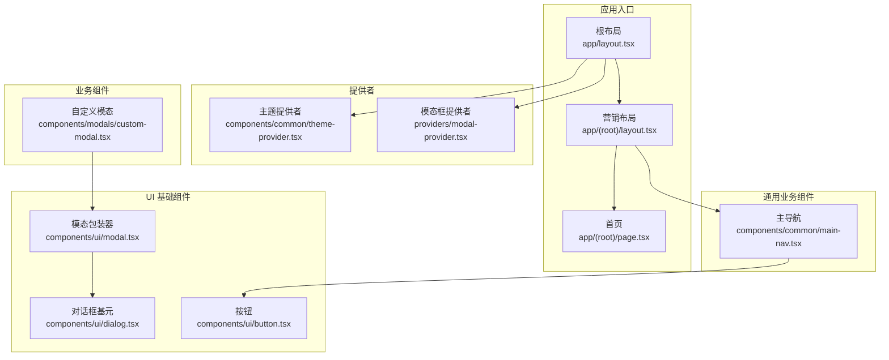
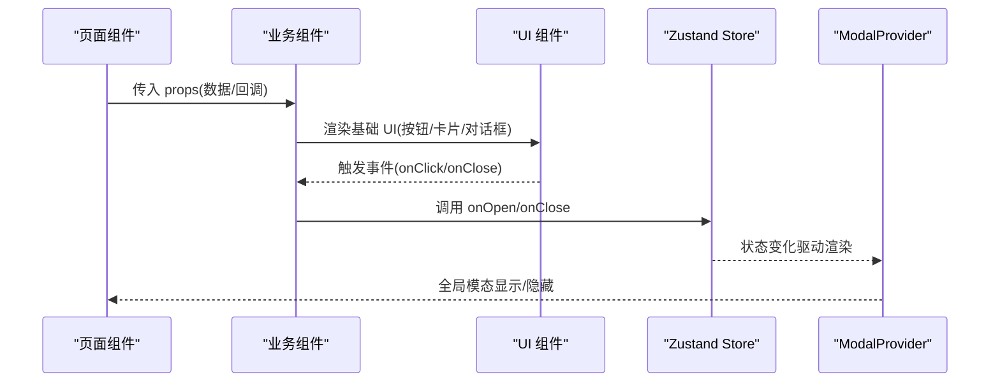
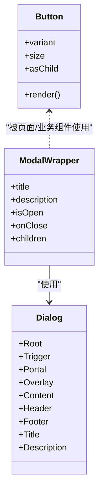
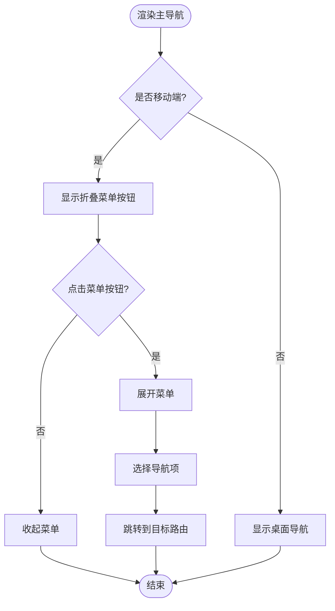
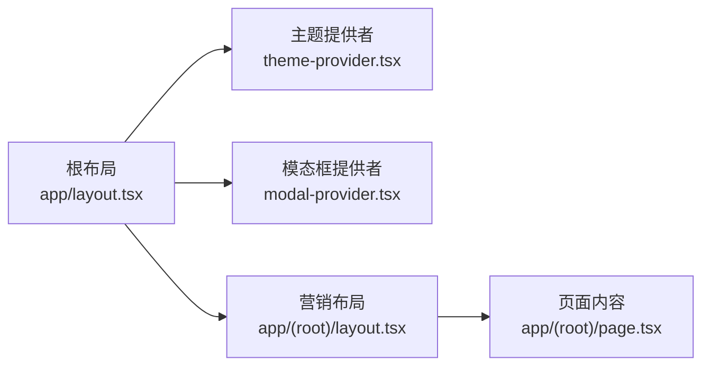
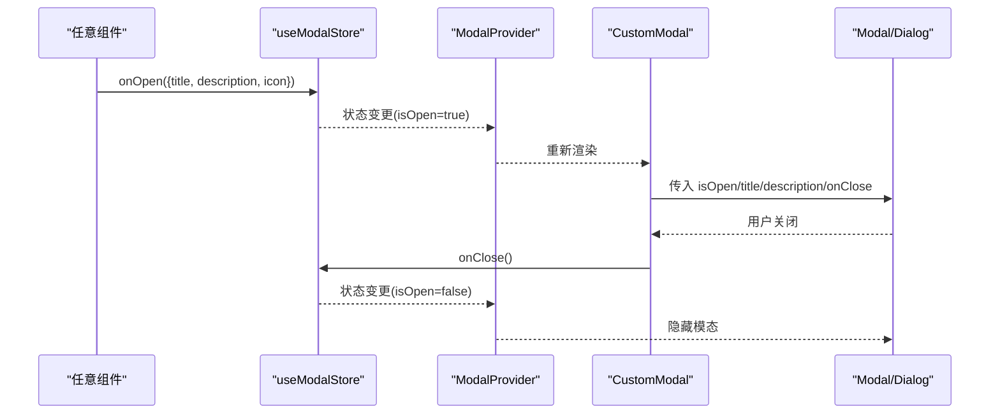
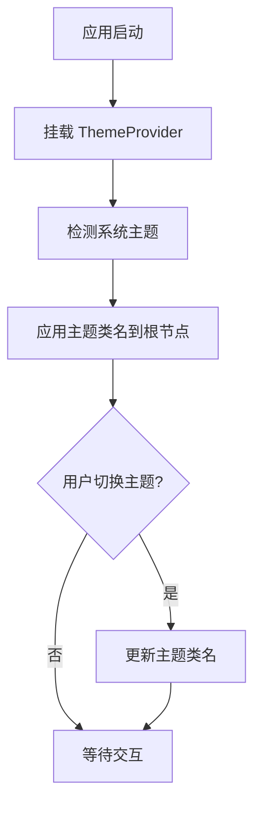
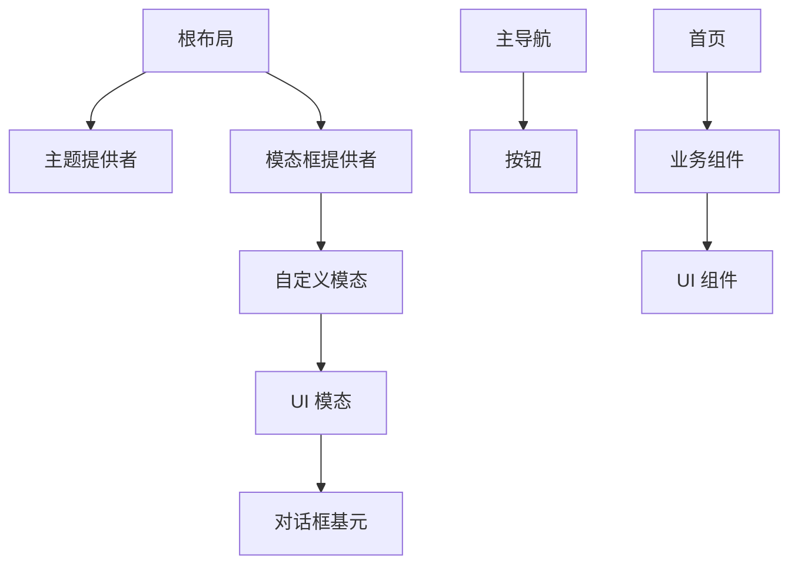
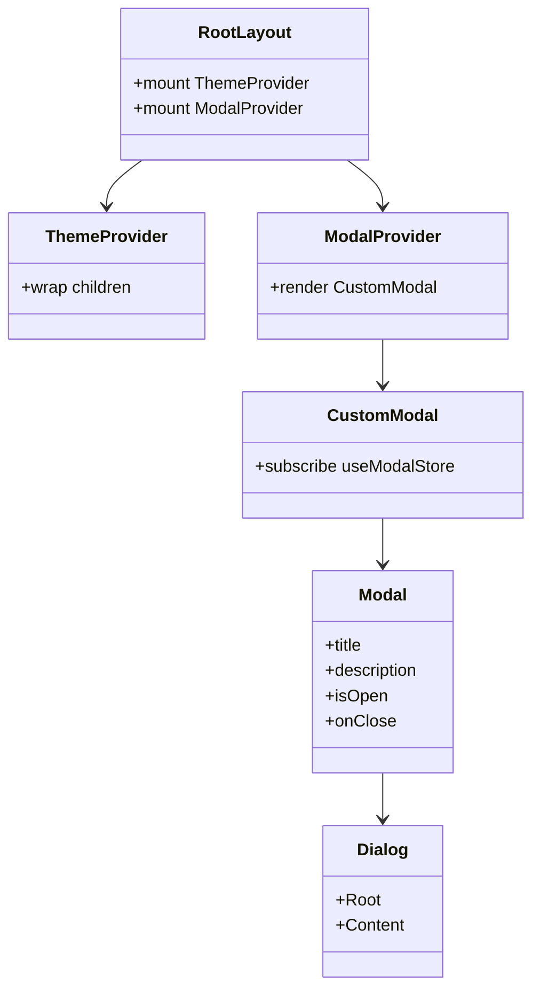
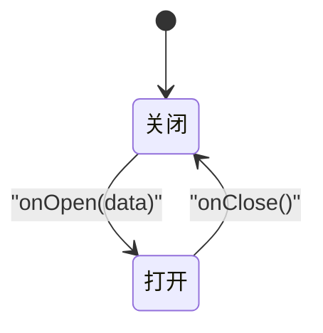

# 组件架构设计

<cite>
**本文引用的文件**
- [app/layout.tsx](file://app/layout.tsx)
- [components/common/theme-provider.tsx](file://components/common/theme-provider.tsx)
- [providers/modal-provider.tsx](file://providers/modal-provider.tsx)
- [hooks/use-modal-store.ts](file://hooks/use-modal-store.ts)
- [components/modals/custom-modal.tsx](file://components/modals/custom-modal.tsx)
- [components/ui/modal.tsx](file://components/ui/modal.tsx)
- [components/ui/dialog.tsx](file://components/ui/dialog.tsx)
- [components/ui/button.tsx](file://components/ui/button.tsx)
- [components/common/main-nav.tsx](file://components/common/main-nav.tsx)
- [app/(root)/layout.tsx](file://app/(root)/layout.tsx)
- [app/(root)/page.tsx](file://app/(root)/page.tsx)
</cite>

## 目录
1. [简介](#简介)
2. [项目结构](#项目结构)
3. [核心组件](#核心组件)
4. [架构总览](#架构总览)
5. [详细组件分析](#详细组件分析)
6. [依赖关系分析](#依赖关系分析)
7. [性能考量](#性能考量)
8. [故障排查指南](#故障排查指南)
9. [结论](#结论)
10. [附录](#附录)

## 简介
本文件系统化阐述该 Next.js 项目的 React 组件分层架构与数据流，覆盖基础 UI 组件、通用业务组件、页面级组件的职责划分；说明组件间数据传递机制（props、状态管理、上下文提供者）；总结可复用性设计原则（接口设计、样式隔离、事件处理）；并深入解析 ThemeProvider、ModalProvider 等核心提供者的实现原理与使用方式。文末提供组件关系图与状态流转图，帮助读者快速理解整体设计与关键流程。

## 项目结构
项目采用“按功能域 + 分层”的组织方式：
- app 层：Next.js App Router 的根布局与页面路由，负责全局上下文装配与页面组装。
- components 层：
  - ui：原子化基础 UI 组件（按钮、对话框、输入等），无业务语义。
  - common：跨页面复用的通用业务组件（导航、页头、动画、主题切换等）。
  - 业务模块：如 projects、experience、blogs、forms、modals 等，封装具体业务展示与交互。
- providers 层：应用级上下文提供者（主题、模态框等），在根布局挂载。
- hooks 层：跨组件共享的状态与逻辑（如模态框 store）。
- config/lib：配置与工具函数，解耦业务数据与展示。

图表来源
- [app/layout.tsx:99-145](file://app/layout.tsx#L99-L145)
- [components/common/theme-provider.tsx:5-7](file://components/common/theme-provider.tsx#L5-L7)
- [providers/modal-provider.tsx:7-23](file://providers/modal-provider.tsx#L7-L23)
- [components/ui/dialog.tsx:9-55](file://components/ui/dialog.tsx#L9-L55)
- [components/ui/modal.tsx:21-39](file://components/ui/modal.tsx#L21-L39)
- [components/modals/custom-modal.tsx:6-29](file://components/modals/custom-modal.tsx#L6-L29)
- [components/common/main-nav.tsx:40-105](file://components/common/main-nav.tsx#L40-L105)
- [components/ui/button.tsx:42-56](file://components/ui/button.tsx#L42-L56)
- [app/(root)/layout.tsx:11-32](file://app/(root)/layout.tsx#L11-L32)
- [app/(root)/page.tsx:37-357](file://app/(root)/page.tsx#L37-L357)

章节来源
- [app/layout.tsx:99-145](file://app/layout.tsx#L99-L145)
- [app/(root)/layout.tsx:11-32](file://app/(root)/layout.tsx#L11-L32)
- [app/(root)/page.tsx:37-357](file://app/(root)/page.tsx#L37-L357)

## 核心组件
- 基础 UI 组件
  - 按钮：基于 class-variance-authority 的多变体/尺寸组合，支持 asChild 透传，保证样式隔离与高复用。
  - 对话框：基于 Radix Dialog 的封装，提供 Overlay、Content、Header/Footer、Title/Description 等子组件，统一动画与可访问性。
  - 模态包装器：将 Radix 对话框与业务 props（标题、描述、打开/关闭）结合，简化上层调用。
- 通用业务组件
  - 主导航：响应式导航，集成移动端菜单、路由高亮、动画效果，使用 Next Navigation API 获取当前段。
  - 主题切换：通过 next-themes 提供的 ThemeProvider 暴露 theme 能力给全应用。
- 页面级组件
  - 根布局：注入全局样式、字体、SEO metadata、第三方脚本，并挂载 ThemeProvider、Toaster、ModalProvider。
  - 营销布局：包裹头部导航、主体内容与页脚，组织页面骨架。
  - 首页：聚合多个业务区块（项目、经验、贡献、技能、博客、联系），使用通用动画与卡片组件。

章节来源
- [components/ui/button.tsx:7-56](file://components/ui/button.tsx#L7-L56)
- [components/ui/dialog.tsx:9-121](file://components/ui/dialog.tsx#L9-L121)
- [components/ui/modal.tsx:13-39](file://components/ui/modal.tsx#L13-L39)
- [components/common/main-nav.tsx:14-105](file://components/common/main-nav.tsx#L14-L105)
- [components/common/theme-provider.tsx:5-7](file://components/common/theme-provider.tsx#L5-L7)
- [app/layout.tsx:99-145](file://app/layout.tsx#L99-L145)
- [app/(root)/layout.tsx:11-32](file://app/(root)/layout.tsx#L11-L32)
- [app/(root)/page.tsx:37-357](file://app/(root)/page.tsx#L37-L357)

## 架构总览
- 分层职责
  - 基础 UI 层：纯展示与交互原语，不感知业务数据，通过 props 暴露最小必要能力。
  - 通用业务层：组合 UI 层组件，承载跨页面复用的业务逻辑（导航、动画、表单容器等）。
  - 页面级组件：编排业务组件，负责页面级数据获取与渲染策略（SSR/CSR）。
- 数据流向
  - 自上而下：页面通过 props 向业务组件传递数据；业务组件再向下传递给 UI 组件。
  - 自下而上：UI 组件通过回调（onClick/onClose 等）向上触发事件；业务组件处理后再更新自身或全局状态。
  - 全局状态：通过 Zustand store（useModalStore）与 Context（ThemeProvider）进行跨层级共享。
- 提供者模式
  - ThemeProvider：在根布局挂载，为全应用提供主题能力。
  - ModalProvider：在根布局挂载，渲染全局模态容器，配合 useModalStore 控制显示与内容。

图表来源
- [app/(root)/page.tsx:37-357](file://app/(root)/page.tsx#L37-L357)
- [components/ui/button.tsx:42-56](file://components/ui/button.tsx#L42-L56)
- [hooks/use-modal-store.ts:22-35](file://hooks/use-modal-store.ts#L22-L35)
- [providers/modal-provider.tsx:7-23](file://providers/modal-provider.tsx#L7-L23)
- [components/modals/custom-modal.tsx:6-29](file://components/modals/custom-modal.tsx#L6-L29)

## 详细组件分析

### 基础 UI 组件：按钮与对话框
- 按钮
  - 使用 class-variance-authority 定义多 variant/size 组合，默认值集中管理。
  - 支持 asChild 透传，便于与 Link/Button 等原生元素无缝替换。
  - 样式通过 cn 合并，保持与 Tailwind 变量体系一致。
- 对话框
  - 基于 Radix Dialog 封装，提供 Portal、Overlay、Content、Header/Footer、Title/Description。
  - 统一动画与可访问性属性，确保键盘操作与屏幕阅读器友好。
  - 通过 forwardRef 暴露 ref，增强可测试性与外部控制能力。

图表来源
- [components/ui/button.tsx:7-56](file://components/ui/button.tsx#L7-L56)
- [components/ui/dialog.tsx:9-121](file://components/ui/dialog.tsx#L9-L121)
- [components/ui/modal.tsx:13-39](file://components/ui/modal.tsx#L13-L39)

章节来源
- [components/ui/button.tsx:7-56](file://components/ui/button.tsx#L7-L56)
- [components/ui/dialog.tsx:9-121](file://components/ui/dialog.tsx#L9-L121)
- [components/ui/modal.tsx:13-39](file://components/ui/modal.tsx#L13-L39)

### 通用业务组件：主导航
- 功能要点
  - 使用 Next Navigation API 获取当前段，实现路由高亮。
  - 响应式菜单：桌面端水平导航，移动端折叠菜单。
  - 动画与交互：hover/tap 缩放、入场动画。
- 数据与事件
  - 通过 props 接收导航项数组，内部维护移动端菜单展开状态。
  - 点击菜单项触发路由跳转，关闭移动端菜单。

图表来源
- [components/common/main-nav.tsx:40-105](file://components/common/main-nav.tsx#L40-L105)

章节来源
- [components/common/main-nav.tsx:40-105](file://components/common/main-nav.tsx#L40-L105)

### 页面级组件：根布局与营销布局
- 根布局
  - 注入全局样式、字体变量、SEO metadata、第三方脚本。
  - 挂载 ThemeProvider、Toaster、ModalProvider，确保全应用可用。
- 营销布局
  - 组织头部（导航、主题切换、徽章）、主体区域与页脚。
  - 作为各页面的共同外壳，保证一致的视觉与交互体验。

图表来源
- [app/layout.tsx:99-145](file://app/layout.tsx#L99-L145)
- [components/common/theme-provider.tsx:5-7](file://components/common/theme-provider.tsx#L5-L7)
- [providers/modal-provider.tsx:7-23](file://providers/modal-provider.tsx#L7-L23)
- [app/(root)/layout.tsx:11-32](file://app/(root)/layout.tsx#L11-L32)
- [app/(root)/page.tsx:37-357](file://app/(root)/page.tsx#L37-L357)

章节来源
- [app/layout.tsx:99-145](file://app/layout.tsx#L99-L145)
- [app/(root)/layout.tsx:11-32](file://app/(root)/layout.tsx#L11-L32)
- [app/(root)/page.tsx:37-357](file://app/(root)/page.tsx#L37-L357)

### 模态框系统：ModalProvider、CustomModal、useModalStore
- 状态管理
  - 使用 Zustand 创建 useModalStore，集中管理 isOpen、title、description、icon 以及 onOpen/onClose。
- 提供者
  - ModalProvider 在根布局挂载，避免 SSR 时 DOM 未就绪导致的警告，首次渲染后挂载 CustomModal。
- 自定义模态
  - CustomModal 订阅 useModalStore，将状态映射到 UI 模态包装器，渲染图标、标题与描述。
- 数据流
  - 任意组件调用 store.onOpen(data) 打开模态；store.onClose() 关闭模态；ModalProvider 始终存在以响应状态变化。

图表来源
- [hooks/use-modal-store.ts:22-35](file://hooks/use-modal-store.ts#L22-L35)
- [providers/modal-provider.tsx:7-23](file://providers/modal-provider.tsx#L7-L23)
- [components/modals/custom-modal.tsx:6-29](file://components/modals/custom-modal.tsx#L6-L29)
- [components/ui/modal.tsx:21-39](file://components/ui/modal.tsx#L21-L39)
- [components/ui/dialog.tsx:9-55](file://components/ui/dialog.tsx#L9-L55)

章节来源
- [hooks/use-modal-store.ts:22-35](file://hooks/use-modal-store.ts#L22-L35)
- [providers/modal-provider.tsx:7-23](file://providers/modal-provider.tsx#L7-L23)
- [components/modals/custom-modal.tsx:6-29](file://components/modals/custom-modal.tsx#L6-L29)
- [components/ui/modal.tsx:21-39](file://components/ui/modal.tsx#L21-L39)
- [components/ui/dialog.tsx:9-55](file://components/ui/dialog.tsx#L9-L55)

### 主题系统：ThemeProvider
- 实现原理
  - 对 next-themes 的 ThemeProvider 进行轻量封装，暴露统一入口。
  - 根布局中配置 attribute="class"、defaultTheme="system"、themes 列表，启用系统主题跟随与多主题切换。
- 使用方式
  - 在全局布局内包裹应用，所有子组件可通过 next-themes 的能力读取/切换主题。
  - 与 UI 组件的 CSS 变量/类名体系协作，实现暗色/亮色/自定义主题的无缝切换。

图表来源
- [components/common/theme-provider.tsx:5-7](file://components/common/theme-provider.tsx#L5-L7)
- [app/layout.tsx:115-128](file://app/layout.tsx#L115-L128)

章节来源
- [components/common/theme-provider.tsx:5-7](file://components/common/theme-provider.tsx#L5-L7)
- [app/layout.tsx:115-128](file://app/layout.tsx#L115-L128)

## 依赖关系分析
- 组件耦合
  - UI 组件低耦合，仅依赖工具函数与样式库。
  - 业务组件依赖 UI 组件与配置数据，尽量通过 props 解耦。
  - 页面组件依赖业务组件与数据源，承担编排职责。
- 直接/间接依赖
  - 根布局依赖所有提供者与全局资源。
  - 模态框系统通过 store 与 provider 形成松耦合闭环。
- 外部依赖
  - Radix Dialog、next-themes、motion/react、Zustand 等。

图表来源
- [app/layout.tsx:99-145](file://app/layout.tsx#L99-L145)
- [providers/modal-provider.tsx:7-23](file://providers/modal-provider.tsx#L7-L23)
- [components/modals/custom-modal.tsx:6-29](file://components/modals/custom-modal.tsx#L6-L29)
- [components/ui/modal.tsx:21-39](file://components/ui/modal.tsx#L21-L39)
- [components/ui/dialog.tsx:9-55](file://components/ui/dialog.tsx#L9-L55)
- [components/common/main-nav.tsx:40-105](file://components/common/main-nav.tsx#L40-L105)
- [components/ui/button.tsx:42-56](file://components/ui/button.tsx#L42-L56)
- [app/(root)/page.tsx:37-357](file://app/(root)/page.tsx#L37-L357)

章节来源
- [app/layout.tsx:99-145](file://app/layout.tsx#L99-L145)
- [components/common/main-nav.tsx:40-105](file://components/common/main-nav.tsx#L40-L105)
- [components/ui/button.tsx:42-56](file://components/ui/button.tsx#L42-L56)
- [components/ui/dialog.tsx:9-55](file://components/ui/dialog.tsx#L9-L55)
- [components/ui/modal.tsx:21-39](file://components/ui/modal.tsx#L21-L39)
- [components/modals/custom-modal.tsx:6-29](file://components/modals/custom-modal.tsx#L6-L29)
- [providers/modal-provider.tsx:7-23](file://providers/modal-provider.tsx#L7-L23)
- [app/(root)/page.tsx:37-357](file://app/(root)/page.tsx#L37-L357)

## 性能考量
- 首屏与渲染
  - 根布局中按需加载第三方脚本，减少阻塞。
  - 图片使用 Next Image，合理设置优先级与占位。
- 交互与动画
  - 导航与区块使用 motion/react 做轻量动画，注意延迟与时长以避免重排抖动。
- 状态更新
  - 模态框状态集中在 store，避免多层 props 传递带来的重复渲染。
- 可访问性
  - 对话框与按钮遵循 Radix 的可访问性约定，确保键盘与屏幕阅读器支持。

[本节为通用指导，不直接分析具体文件]

## 故障排查指南
- 模态框不显示
  - 检查 ModalProvider 是否在根布局正确挂载。
  - 确认 useModalStore 的 onOpen 被调用且参数完整。
  - 验证 CustomModal 是否正确订阅 store 并传入 Modal。
- 主题不生效
  - 确认 ThemeProvider 已包裹应用，attribute 设置为 class。
  - 检查 CSS 变量与 Tailwind 主题类名是否匹配。
- 导航高亮异常
  - 确认 useSelectedLayoutSegment 的使用场景与路由结构一致。
  - 检查导航项 href 与路由段是否对应。

章节来源
- [providers/modal-provider.tsx:7-23](file://providers/modal-provider.tsx#L7-L23)
- [hooks/use-modal-store.ts:22-35](file://hooks/use-modal-store.ts#L22-L35)
- [components/modals/custom-modal.tsx:6-29](file://components/modals/custom-modal.tsx#L6-L29)
- [components/common/theme-provider.tsx:5-7](file://components/common/theme-provider.tsx#L5-L7)
- [app/layout.tsx:115-128](file://app/layout.tsx#L115-L128)
- [components/common/main-nav.tsx:40-105](file://components/common/main-nav.tsx#L40-L105)

## 结论
本项目采用清晰的分层架构：基础 UI 组件专注展示与交互原语，通用业务组件负责跨页面复用逻辑，页面级组件编排业务区块与数据。数据传递遵循“自上而下 props、自下而上事件回调”的原则，并通过 Zustand 与 Context 实现全局状态与主题能力。ThemeProvider 与 ModalProvider 作为核心提供者，分别在根布局挂载，为全应用提供主题与模态能力。整体设计强调可复用性、样式隔离与可访问性，具备良好的扩展性与可维护性。

[本节为总结，不直接分析具体文件]

## 附录
- 组件关系图（代码级）

图表来源
- [app/layout.tsx:99-145](file://app/layout.tsx#L99-L145)
- [components/common/theme-provider.tsx:5-7](file://components/common/theme-provider.tsx#L5-L7)
- [providers/modal-provider.tsx:7-23](file://providers/modal-provider.tsx#L7-L23)
- [components/modals/custom-modal.tsx:6-29](file://components/modals/custom-modal.tsx#L6-L29)
- [components/ui/modal.tsx:21-39](file://components/ui/modal.tsx#L21-L39)
- [components/ui/dialog.tsx:9-55](file://components/ui/dialog.tsx#L9-L55)

- 状态流转图（模态框）

图表来源
- [hooks/use-modal-store.ts:22-35](file://hooks/use-modal-store.ts#L22-L35)
- [providers/modal-provider.tsx:7-23](file://providers/modal-provider.tsx#L7-L23)
- [components/modals/custom-modal.tsx:6-29](file://components/modals/custom-modal.tsx#L6-L29)