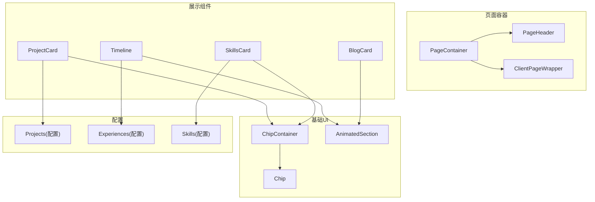
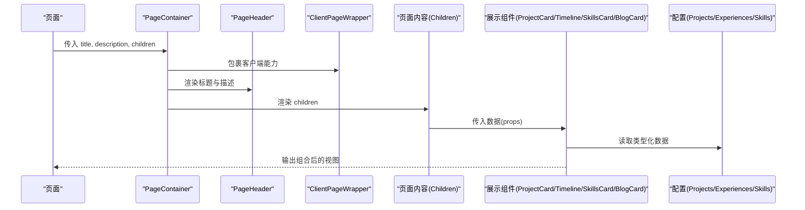
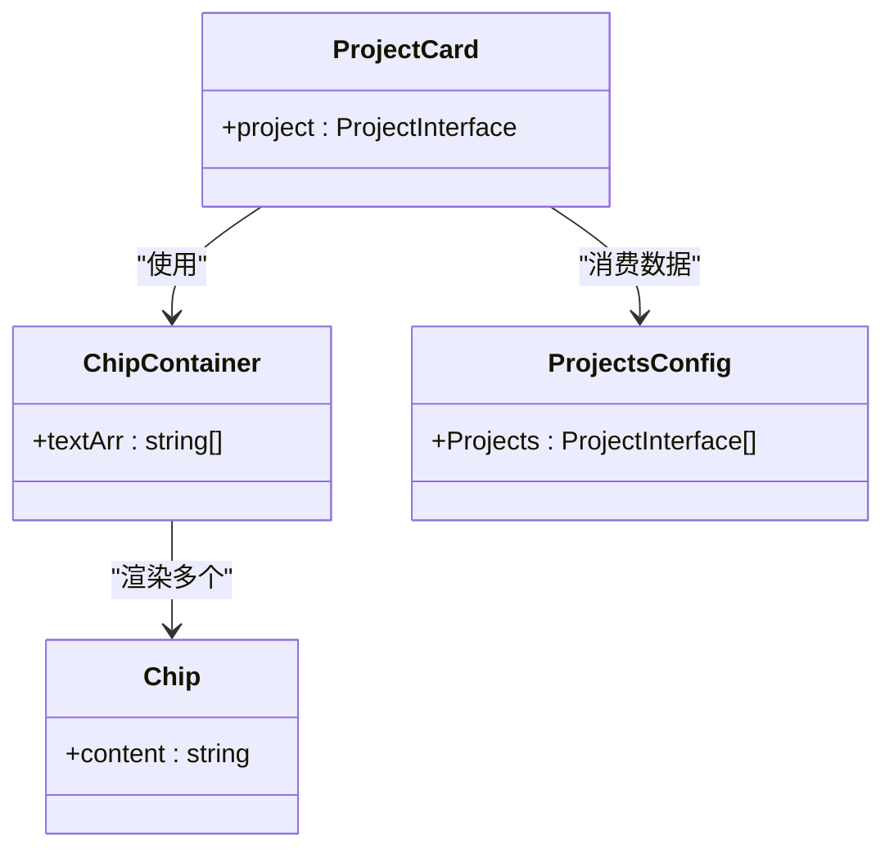
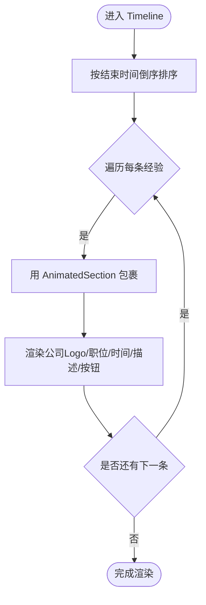
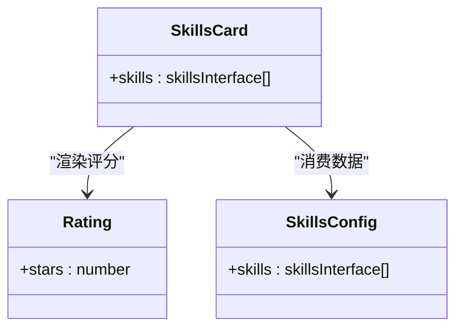
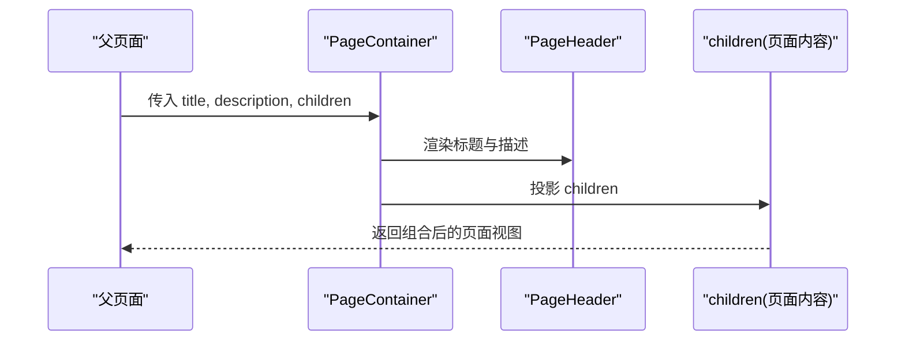
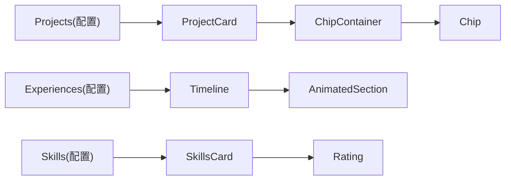

# 组件组合模式

<cite>
**本文引用的文件**
- [components/common/page-container.tsx](file://components/common/page-container.tsx)
- [components/common/page-header.tsx](file://components/common/page-header.tsx)
- [components/common/animated-section.tsx](file://components/common/animated-section.tsx)
- [components/projects/project-card.tsx](file://components/projects/project-card.tsx)
- [components/projects/project-description.tsx](file://components/projects/project-description.tsx)
- [components/experience/timeline.tsx](file://components/experience/timeline.tsx)
- [components/experience/experience-card.tsx](file://components/experience/experience-card.tsx)
- [components/skills/skills-card.tsx](file://components/skills/skills-card.tsx)
- [components/skills/rating.tsx](file://components/skills/rating.tsx)
- [components/blogs/blog-card.tsx](file://components/blogs/blog-card.tsx)
- [components/ui/chip-container.tsx](file://components/ui/chip-container.tsx)
- [components/ui/chip.tsx](file://components/ui/chip.tsx)
- [config/projects.ts](file://config/projects.ts)
- [config/experience.ts](file://config/experience.ts)
- [config/skills.ts](file://config/skills.ts)
</cite>

## 目录
1. [简介](#简介)
2. [项目结构](#项目结构)
3. [核心组件](#核心组件)
4. [架构总览](#架构总览)
5. [详细组件分析](#详细组件分析)
6. [依赖关系分析](#依赖关系分析)
7. [性能考量](#性能考量)
8. [故障排查指南](#故障排查指南)
9. [结论](#结论)
10. [附录](#附录)

## 简介
本文件聚焦于本项目中的“组件组合模式”，系统阐述复合组件、高阶组件（以客户端包装器体现）与渲染属性（以内容投影/插槽形式体现）的设计与实践。重点解析项目卡片、时间线、技能卡片等复杂组件的子组件拆分、数据流传递与样式组织；并说明 PageContainer 等布局组件如何通过插槽与内容投影实现可复用、可扩展的组合式页面容器。文末提供最佳实践建议，涵盖接口设计、默认值处理、类型安全与可访问性支持。

## 项目结构
- 业务页面通过统一的页面容器进行包裹，承载标题、描述与子内容区域。
- 展示型复杂组件（项目卡片、经验时间线、技能卡片、博客卡片）由更小的 UI 原子组件组合而成，遵循单一职责与可复用原则。
- 配置层集中管理数据结构与示例数据，组件仅消费类型安全的接口。

图表来源
- [components/common/page-container.tsx:1-27](file://components/common/page-container.tsx#L1-L27)
- [components/common/page-header.tsx:1-21](file://components/common/page-header.tsx#L1-L21)
- [components/projects/project-card.tsx:1-51](file://components/projects/project-card.tsx#L1-L51)
- [components/experience/timeline.tsx:1-117](file://components/experience/timeline.tsx#L1-L117)
- [components/skills/skills-card.tsx:1-31](file://components/skills/skills-card.tsx#L1-L31)
- [components/blogs/blog-card.tsx:1-96](file://components/blogs/blog-card.tsx#L1-L96)
- [components/ui/chip-container.tsx:1-16](file://components/ui/chip-container.tsx#L1-L16)
- [components/ui/chip.tsx:1-12](file://components/ui/chip.tsx#L1-L12)
- [components/common/animated-section.tsx:1-51](file://components/common/animated-section.tsx#L1-L51)
- [config/projects.ts:1-596](file://config/projects.ts#L1-L596)
- [config/experience.ts:1-93](file://config/experience.ts#L1-L93)
- [config/skills.ts:1-166](file://config/skills.ts#L1-L166)

章节来源
- [components/common/page-container.tsx:1-27](file://components/common/page-container.tsx#L1-L27)
- [components/common/page-header.tsx:1-21](file://components/common/page-header.tsx#L1-L21)
- [components/common/animated-section.tsx:1-51](file://components/common/animated-section.tsx#L1-L51)
- [components/projects/project-card.tsx:1-51](file://components/projects/project-card.tsx#L1-L51)
- [components/experience/timeline.tsx:1-117](file://components/experience/timeline.tsx#L1-L117)
- [components/skills/skills-card.tsx:1-31](file://components/skills/skills-card.tsx#L1-L31)
- [components/blogs/blog-card.tsx:1-96](file://components/blogs/blog-card.tsx#L1-L96)
- [components/ui/chip-container.tsx:1-16](file://components/ui/chip-container.tsx#L1-L16)
- [components/ui/chip.tsx:1-12](file://components/ui/chip.tsx#L1-L12)
- [config/projects.ts:1-596](file://config/projects.ts#L1-L596)
- [config/experience.ts:1-93](file://config/experience.ts#L1-L93)
- [config/skills.ts:1-166](file://config/skills.ts#L1-L166)

## 核心组件
- PageContainer：页面级容器，负责统一包装客户端能力、页面头部与内容区，并通过 children 插槽注入页面主体内容。
- ProjectCard：项目卡片，聚合图片、标题、描述、标签与操作按钮，使用 ChipContainer 展示分类标签。
- Timeline：经验时间线，接收经验数组，排序后逐项渲染，并使用 AnimatedSection 提供滚动入场动画。
- SkillsCard：技能卡片网格，将每项技能图标、名称、描述与评分（Rating）组合呈现。
- BlogCard：博客卡片，包含封面图、标签、标题、摘要与阅读信息，具备悬停动效与可访问性标注。
- PageHeader：页面标题与描述的统一展示。
- AnimatedSection：基于 motion 的滚动入场动画封装，接受 children、方向、延迟等参数。
- ChipContainer/Chip：标签容器与单项标签，用于展示分类或技术栈标签。

章节来源
- [components/common/page-container.tsx:1-27](file://components/common/page-container.tsx#L1-L27)
- [components/projects/project-card.tsx:1-51](file://components/projects/project-card.tsx#L1-L51)
- [components/experience/timeline.tsx:1-117](file://components/experience/timeline.tsx#L1-L117)
- [components/skills/skills-card.tsx:1-31](file://components/skills/skills-card.tsx#L1-L31)
- [components/blogs/blog-card.tsx:1-96](file://components/blogs/blog-card.tsx#L1-L96)
- [components/common/page-header.tsx:1-21](file://components/common/page-header.tsx#L1-L21)
- [components/common/animated-section.tsx:1-51](file://components/common/animated-section.tsx#L1-L51)
- [components/ui/chip-container.tsx:1-16](file://components/ui/chip-container.tsx#L1-L16)
- [components/ui/chip.tsx:1-12](file://components/ui/chip.tsx#L1-L12)

## 架构总览
下图展示了从页面容器到具体展示组件的组合关系，以及配置数据的流向。

图表来源
- [components/common/page-container.tsx:1-27](file://components/common/page-container.tsx#L1-L27)
- [components/common/page-header.tsx:1-21](file://components/common/page-header.tsx#L1-L21)
- [components/projects/project-card.tsx:1-51](file://components/projects/project-card.tsx#L1-L51)
- [components/experience/timeline.tsx:1-117](file://components/experience/timeline.tsx#L1-L117)
- [components/skills/skills-card.tsx:1-31](file://components/skills/skills-card.tsx#L1-L31)
- [components/blogs/blog-card.tsx:1-96](file://components/blogs/blog-card.tsx#L1-L96)
- [config/projects.ts:1-596](file://config/projects.ts#L1-L596)
- [config/experience.ts:1-93](file://config/experience.ts#L1-L93)
- [config/skills.ts:1-166](file://config/skills.ts#L1-L166)

## 详细组件分析

### 复合组件：项目卡片（ProjectCard）
- 组合方式：图片、标题、描述、标签（ChipContainer）、操作按钮组合为一张卡片。
- 数据流：从 Projects 配置中获取项目对象，映射至 props。
- 样式组织：使用响应式布局与边框、圆角、间距等样式类，保持视觉一致性。
- 可访问性：图片提供 alt，链接具有明确语义。

图表来源
- [components/projects/project-card.tsx:1-51](file://components/projects/project-card.tsx#L1-L51)
- [components/ui/chip-container.tsx:1-16](file://components/ui/chip-container.tsx#L1-L16)
- [components/ui/chip.tsx:1-12](file://components/ui/chip.tsx#L1-L12)
- [config/projects.ts:1-596](file://config/projects.ts#L1-L596)

章节来源
- [components/projects/project-card.tsx:1-51](file://components/projects/project-card.tsx#L1-L51)
- [components/ui/chip-container.tsx:1-16](file://components/ui/chip-container.tsx#L1-L16)
- [components/ui/chip.tsx:1-12](file://components/ui/chip.tsx#L1-L12)
- [config/projects.ts:1-596](file://config/projects.ts#L1-L596)

### 复合组件：经验时间线（Timeline）
- 组合方式：接收经验数组，排序后逐项渲染，每个条目使用 AnimatedSection 包裹以实现滚动动画。
- 数据处理：根据结束日期是否为“Present”计算持续时间文本，并按时间倒序排列。
- 交互：提供“查看详情”按钮，跳转到详情页。

图表来源
- [components/experience/timeline.tsx:1-117](file://components/experience/timeline.tsx#L1-L117)
- [components/common/animated-section.tsx:1-51](file://components/common/animated-section.tsx#L1-L51)
- [config/experience.ts:1-93](file://config/experience.ts#L1-L93)

章节来源
- [components/experience/timeline.tsx:1-117](file://components/experience/timeline.tsx#L1-L117)
- [components/common/animated-section.tsx:1-51](file://components/common/animated-section.tsx#L1-L51)
- [config/experience.ts:1-93](file://config/experience.ts#L1-L93)

### 复合组件：技能卡片（SkillsCard）
- 组合方式：网格布局下，每项技能由图标、名称、描述与评分（Rating）组成。
- 数据流：从 skills 配置中读取技能列表，按评分排序后展示。
- 可访问性：评分使用 aria-hidden 避免重复朗读装饰性图标。

图表来源
- [components/skills/skills-card.tsx:1-31](file://components/skills/skills-card.tsx#L1-L31)
- [components/skills/rating.tsx:1-41](file://components/skills/rating.tsx#L1-L41)
- [config/skills.ts:1-166](file://config/skills.ts#L1-L166)

章节来源
- [components/skills/skills-card.tsx:1-31](file://components/skills/skills-card.tsx#L1-L31)
- [components/skills/rating.tsx:1-41](file://components/skills/rating.tsx#L1-L41)
- [config/skills.ts:1-166](file://config/skills.ts#L1-L166)

### 复合组件：博客卡片（BlogCard）
- 组合方式：封面图、标签、标题、摘要、阅读时间与日期等信息组合。
- 可访问性：time 元素使用 dateTime，装饰性箭头使用 aria-hidden。
- 交互：整卡作为链接，悬停时图片缩放与阴影变化提升反馈。

章节来源
- [components/blogs/blog-card.tsx:1-96](file://components/blogs/blog-card.tsx#L1-L96)

### 布局组件：PageContainer（插槽/内容投影）
- 插槽模式：通过 children 注入任意页面内容，实现“外壳+内容”的组合。
- 内容投影：在固定头部（PageHeader）之后渲染 children，保证一致的页面骨架。
- 客户端包装：使用 ClientPageWrapper 确保页面内客户端功能可用。

图表来源
- [components/common/page-container.tsx:1-27](file://components/common/page-container.tsx#L1-L27)
- [components/common/page-header.tsx:1-21](file://components/common/page-header.tsx#L1-L21)

章节来源
- [components/common/page-container.tsx:1-27](file://components/common/page-container.tsx#L1-L27)
- [components/common/page-header.tsx:1-21](file://components/common/page-header.tsx#L1-L21)

### 高阶组件模式（客户端包装器）
- 通过 ClientPageWrapper 对页面进行客户端能力增强，属于高阶包装思路的体现。
- 优势：将客户端初始化逻辑与页面内容解耦，便于复用与测试。

章节来源
- [components/common/page-container.tsx:1-27](file://components/common/page-container.tsx#L1-L27)

### 渲染属性模式（内容投影/插槽）
- 多处采用 children 作为“渲染属性”的替代方案，如 PageContainer、AnimatedSection。
- 优点：灵活性强，调用方可自由决定内部渲染细节，同时保持外层一致的结构与行为。

章节来源
- [components/common/page-container.tsx:1-27](file://components/common/page-container.tsx#L1-L27)
- [components/common/animated-section.tsx:1-51](file://components/common/animated-section.tsx#L1-L51)

## 依赖关系分析
- 展示组件依赖配置层提供的类型化数据，保证类型安全与数据契约稳定。
- 基础 UI 组件被多个展示组件复用，降低重复代码与维护成本。
- 动画与客户端能力通过通用组件抽象，减少在各页面中的重复实现。

图表来源
- [config/projects.ts:1-596](file://config/projects.ts#L1-L596)
- [config/experience.ts:1-93](file://config/experience.ts#L1-L93)
- [config/skills.ts:1-166](file://config/skills.ts#L1-L166)
- [components/projects/project-card.tsx:1-51](file://components/projects/project-card.tsx#L1-L51)
- [components/experience/timeline.tsx:1-117](file://components/experience/timeline.tsx#L1-L117)
- [components/skills/skills-card.tsx:1-31](file://components/skills/skills-card.tsx#L1-L31)
- [components/ui/chip-container.tsx:1-16](file://components/ui/chip-container.tsx#L1-L16)
- [components/ui/chip.tsx:1-12](file://components/ui/chip.tsx#L1-L12)
- [components/common/animated-section.tsx:1-51](file://components/common/animated-section.tsx#L1-L51)
- [components/skills/rating.tsx:1-41](file://components/skills/rating.tsx#L1-L41)

章节来源
- [config/projects.ts:1-596](file://config/projects.ts#L1-L596)
- [config/experience.ts:1-93](file://config/experience.ts#L1-L93)
- [config/skills.ts:1-166](file://config/skills.ts#L1-L166)
- [components/projects/project-card.tsx:1-51](file://components/projects/project-card.tsx#L1-L51)
- [components/experience/timeline.tsx:1-117](file://components/experience/timeline.tsx#L1-L117)
- [components/skills/skills-card.tsx:1-31](file://components/skills/skills-card.tsx#L1-L31)
- [components/ui/chip-container.tsx:1-16](file://components/ui/chip-container.tsx#L1-L16)
- [components/ui/chip.tsx:1-12](file://components/ui/chip.tsx#L1-L12)
- [components/common/animated-section.tsx:1-51](file://components/common/animated-section.tsx#L1-L51)
- [components/skills/rating.tsx:1-41](file://components/skills/rating.tsx#L1-L41)

## 性能考量
- 列表渲染优化：时间线与技能卡片对数据进行排序后再渲染，避免不必要的重排。
- 图片优化：使用 Next.js Image 组件，合理设置尺寸与占位，减少布局抖动。
- 动画性能：AnimatedSection 仅在视口可见时触发动画，且只执行一次，降低重复开销。
- 标签渲染：ChipContainer 按需渲染字符串数组，避免深层嵌套带来的性能问题。

[本节为通用指导，不直接分析具体文件]

## 故障排查指南
- 类型错误：若出现类型不匹配，检查配置文件中接口定义与组件 props 是否一致（如 ProjectInterface、ExperienceInterface、skillsInterface）。
- 动画不生效：确认组件位于客户端环境（use client），并确保父级未阻止滚动或视口检测。
- 图片显示异常：检查图片路径与尺寸设置，确保资源存在且格式正确。
- 链接跳转失败：确认路由是否存在，href 是否与页面路由一致。

章节来源
- [config/projects.ts:1-596](file://config/projects.ts#L1-L596)
- [config/experience.ts:1-93](file://config/experience.ts#L1-L93)
- [config/skills.ts:1-166](file://config/skills.ts#L1-L166)
- [components/common/animated-section.tsx:1-51](file://components/common/animated-section.tsx#L1-L51)

## 结论
本项目通过清晰的组件分层与组合模式，实现了高内聚、低耦合的可维护界面体系。复合组件将展示逻辑拆分为更小单元，插槽与内容投影提升了灵活性，客户端包装器提供了稳定的运行时能力。配合类型化的配置数据，既保证了开发体验，也增强了运行时的健壮性。建议在后续迭代中继续遵循这些原则，逐步完善可访问性与性能优化。

## 附录
- 最佳实践清单
  - 接口设计：为所有组件定义明确的 props 接口，优先使用 TypeScript 类型约束。
  - 默认值处理：为可选 props 提供合理的默认值，避免空引用与渲染异常。
  - 类型安全：配置层与组件层共享类型定义，确保数据契约一致。
  - 可访问性：为关键交互元素提供语义化标签与必要的 aria 属性，装饰性元素使用 aria-hidden。
  - 组合优先：优先通过 children 与组合扩展组件能力，而非过度继承或复杂 props。
  - 样式组织：使用统一的样式类与主题变量，保持视觉一致性与可维护性。
  - 性能意识：合理使用动画与图片优化，避免不必要的重绘与网络请求。

[本节为通用指导，不直接分析具体文件]