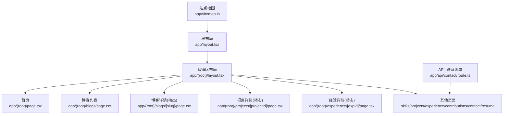
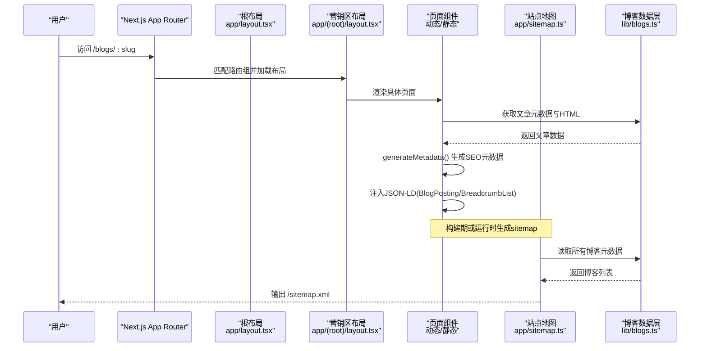
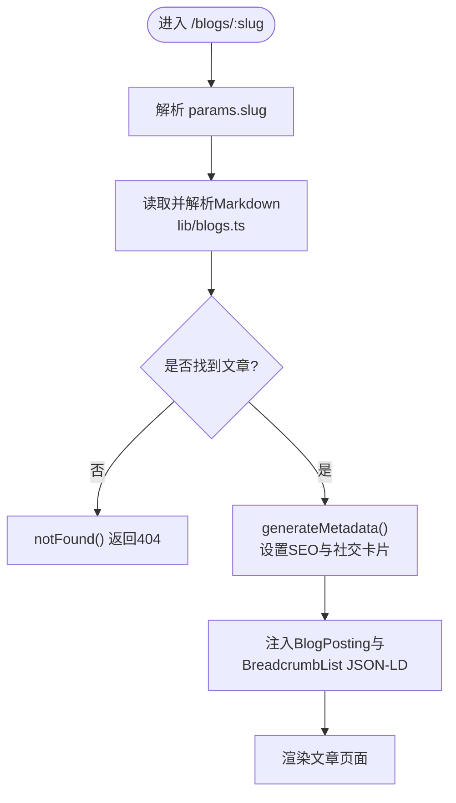
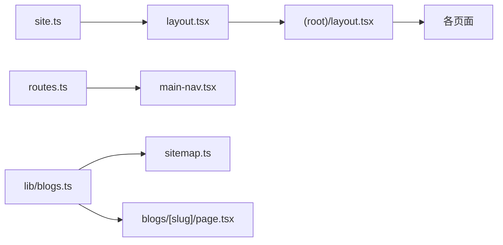
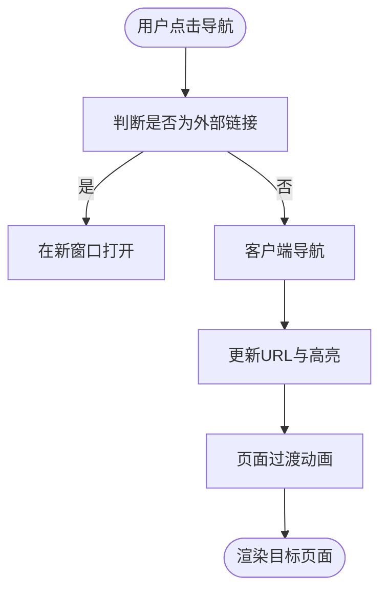

# 路由系统设计

<cite>
**本文引用的文件**
- [app/layout.tsx](file://app/layout.tsx)
- [app/(root)/layout.tsx](file://app/(root)/layout.tsx)
- [app/(root)/page.tsx](file://app/(root)/page.tsx)
- [app/(root)/blogs/[slug]/page.tsx](file://app/(root)/blogs/[slug]/page.tsx)
- [app/(root)/projects/[projectId]/page.tsx](file://app/(root)/projects/[projectId]/page.tsx)
- [app/sitemap.ts](file://app/sitemap.ts)
- [components/common/main-nav.tsx](file://components/common/main-nav.tsx)
- [components/common/animated-link.tsx](file://components/common/animated-link.tsx)
- [components/common/animated-page-transition.tsx](file://components/common/animated-page-transition.tsx)
- [config/routes.ts](file://config/routes.ts)
- [config/site.ts](file://config/site.ts)
- [lib/blogs.ts](file://lib/blogs.ts)
- [app/api/contact/route.ts](file://app/api/contact/route.ts)
</cite>

## 目录
1. [简介](#简介)
2. [项目结构](#项目结构)
3. [核心组件](#核心组件)
4. [架构总览](#架构总览)
5. [详细组件分析](#详细组件分析)
6. [依赖关系分析](#依赖关系分析)
7. [性能考量](#性能考量)
8. [故障排查指南](#故障排查指南)
9. [结论](#结论)
10. [附录](#附录)

## 简介
本文件系统化梳理本项目基于 Next.js App Router 的路由设计，覆盖路由组、动态路由、嵌套路由与并行路由的设计模式与应用场景；阐述 SEO 优化策略（站点地图、元数据、结构化数据）；说明路由级代码分割与性能优化；并给出导航系统实现（客户端导航、过渡动画、面包屑）。文末提供路由映射表与导航流程图，帮助读者快速理解与扩展。

## 项目结构
本项目采用文件系统即路由的约定式路由：
- 根布局：app/layout.tsx 定义全局 HTML、主题、分析与全局元信息。
- 营销区路由组：app/(root)/ 作为一组共享布局与导航的路由集合，便于复用头部、页脚与导航状态。
- 页面与动态段：
  - 静态页面：如 /skills、/projects、/experience、/contributions、/contact、/resume、/blogs。
  - 动态路由：/blogs/[slug]、/projects/[projectId]、/experience/[expId]。
- API 路由：app/api/* 用于服务端接口（如联系表单提交）。
- SEO：app/sitemap.ts 生成站点地图；各页面通过 metadata 与 JSON-LD 提升搜索引擎表现。
- 导航：配置化主导航 routesConfig，结合 usePathname/useSelectedLayoutSegment 高亮当前段。



图表来源
- [app/layout.tsx:1-145](file://app/layout.tsx#L1-L145)
- [app/(root)/layout.tsx:1-33](file://app/(root)/layout.tsx#L1-L33)
- [app/(root)/page.tsx:1-357](file://app/(root)/page.tsx#L1-L357)
- [app/(root)/blogs/[slug]/page.tsx:1-325](file://app/(root)/blogs/[slug]/page.tsx#L1-L325)
- [app/(root)/projects/[projectId]/page.tsx:1-159](file://app/(root)/projects/[projectId]/page.tsx#L1-L159)
- [app/sitemap.ts:1-72](file://app/sitemap.ts#L1-L72)
- [app/api/contact/route.ts:1-31](file://app/api/contact/route.ts#L1-L31)

章节来源
- [app/layout.tsx:1-145](file://app/layout.tsx#L1-L145)
- [app/(root)/layout.tsx:1-33](file://app/(root)/layout.tsx#L1-L33)
- [app/(root)/page.tsx:1-357](file://app/(root)/page.tsx#L1-L357)
- [app/sitemap.ts:1-72](file://app/sitemap.ts#L1-L72)

## 核心组件
- 根布局与全局元数据：在 app/layout.tsx 中集中设置 title、description、Open Graph、Twitter Card、robots、canonical、验证信息等，确保全站 SEO 基线一致。
- 营销区布局：app/(root)/layout.tsx 提供统一头部导航、页脚与主体容器，所有 (root) 下的页面自动继承。
- 导航组件：MainNav 使用 usePathname 与 useSelectedLayoutSegment 进行路由段匹配高亮，支持移动端菜单与动效。
- 动态路由页面：
  - 博客详情：app/(root)/blogs/[slug]/page.tsx 通过 generateStaticParams 预渲染所有文章，generateMetadata 为每篇文章生成独立 SEO 元数据与社交卡片，并注入 BlogPosting 与 BreadcrumbList 结构化数据。
  - 项目详情：app/(root)/projects/[projectId]/page.tsx 根据参数查找项目，未找到时重定向到列表页。
- 站点地图：app/sitemap.ts 聚合静态页面与动态博客条目，按优先级与更新频率标注。
- 数据层：lib/blogs.ts 负责读取 Markdown 内容、解析 frontmatter、生成 HTML 与阅读时长估算，供页面与 sitemap 复用。

章节来源
- [app/layout.tsx:30-97](file://app/layout.tsx#L30-L97)
- [app/(root)/layout.tsx:1-33](file://app/(root)/layout.tsx#L1-L33)
- [components/common/main-nav.tsx:1-105](file://components/common/main-nav.tsx#L1-L105)
- [app/(root)/blogs/[slug]/page.tsx:20-79](file://app/(root)/blogs/[slug]/page.tsx#L20-L79)
- [app/(root)/projects/[projectId]/page.tsx:23-28](file://app/(root)/projects/[projectId]/page.tsx#L23-L28)
- [app/sitemap.ts:6-70](file://app/sitemap.ts#L6-L70)
- [lib/blogs.ts:35-97](file://lib/blogs.ts#L35-L97)

## 架构总览
下图展示从浏览器请求到页面渲染的关键路径，包括路由组、动态路由、SEO 元数据与结构化数据的注入过程。



图表来源
- [app/(root)/blogs/[slug]/page.tsx:20-79](file://app/(root)/blogs/[slug]/page.tsx#L20-L79)
- [app/sitemap.ts:6-70](file://app/sitemap.ts#L6-L70)
- [lib/blogs.ts:35-97](file://lib/blogs.ts#L35-L97)
- [app/layout.tsx:30-97](file://app/layout.tsx#L30-L97)
- [app/(root)/layout.tsx:1-33](file://app/(root)/layout.tsx#L1-L33)

## 详细组件分析

### 路由组与嵌套路由
- 路由组 (root)：将营销相关页面组织在 app/(root)/ 下，复用同一布局与导航，避免重复代码，同时不影响 URL。
- 嵌套路由：每个功能模块以目录划分（如 blogs、projects、experience），子目录可继续细分，形成清晰的层级结构。
- 使用场景：
  - 多套布局：不同路由组可挂载不同 layout（例如后台 vs 前台）。
  - 分组导航：在 (root) 布局内集中处理导航高亮与交互逻辑。

章节来源
- [app/(root)/layout.tsx:1-33](file://app/(root)/layout.tsx#L1-L33)
- [components/common/main-nav.tsx:40-86](file://components/common/main-nav.tsx#L40-L86)

### 动态路由
- 博客详情 /blogs/[slug]：
  - 构建期参数：generateStaticParams 扫描所有 .md 文件生成 slug 列表，实现全量静态化。
  - 动态元数据：generateMetadata 根据 slug 拉取文章元数据，设置标题、描述、关键词、OG/Twitter 图片、canonical 等。
  - 结构化数据：注入 BlogPosting 与 BreadcrumbList JSON-LD，增强搜索结果展示。
  - 错误处理：找不到文章时调用 notFound()。
- 项目详情 /projects/[projectId]：
  - 参数校验：根据 projectId 查找项目，不存在则 redirect 到列表页。
- 经验详情 /experience/[expId]：
  - 与项目详情类似，遵循相同的动态路由模式。



图表来源
- [app/(root)/blogs/[slug]/page.tsx:20-79](file://app/(root)/blogs/[slug]/page.tsx#L20-L79)
- [lib/blogs.ts:35-97](file://lib/blogs.ts#L35-L97)

章节来源
- [app/(root)/blogs/[slug]/page.tsx:20-79](file://app/(root)/blogs/[slug]/page.tsx#L20-L79)
- [app/(root)/projects/[projectId]/page.tsx:23-28](file://app/(root)/projects/[projectId]/page.tsx#L23-L28)

### 并行路由（概念与落地建议）
- 概念：Next.js 支持使用特殊文件夹名（如 @folder）实现并行路由，可在同一层级渲染多个独立页面片段，常用于仪表盘的多面板布局。
- 本项目现状：未发现显式的并行路由实现。建议在需要并列展示多个独立视图时引入该模式，以提升首屏信息密度与交互效率。

[本节为概念性说明，不直接分析具体文件]

### SEO 优化策略
- 站点地图：app/sitemap.ts 汇总静态页面与动态博客，设置 lastModified、changeFrequency、priority，利于爬虫抓取与索引。
- 元数据：
  - 根布局：统一设置 title 模板、description、keywords、authors、Open Graph、Twitter Card、robots、canonical、验证信息等。
  - 页面级：博客详情页通过 generateMetadata 为每篇文章生成独立元数据，包含 OG 图片、发布时间、标签等。
- 结构化数据：
  - 首页：Person 与 SoftwareApplication 类型，强化个人品牌与模板应用识别。
  - 博客详情：BlogPosting 与 BreadcrumbList，提升搜索摘要与面包屑展示。
- 规范链接：canonical 指向唯一 URL，避免重复内容。

章节来源
- [app/sitemap.ts:6-70](file://app/sitemap.ts#L6-L70)
- [app/layout.tsx:30-97](file://app/layout.tsx#L30-L97)
- [app/(root)/page.tsx:28-80](file://app/(root)/page.tsx#L28-L80)
- [app/(root)/blogs/[slug]/page.tsx:25-79](file://app/(root)/blogs/[slug]/page.tsx#L25-L79)

### 导航系统与用户体验
- 客户端导航：
  - MainNav 使用 next/navigation 的 usePathname 与 useSelectedLayoutSegment 判断当前段，实现高亮与活动态。
  - AnimatedLink 封装 Link 并提供 hover/tap 动效，提升交互反馈。
  - AnimatedPageTransition 提供页面进出场动画，改善切换体验。
- 面包屑导航：
  - 博客详情页内置可见的面包屑，配合 BreadcrumbList JSON-LD，既服务用户也服务搜索引擎。
- 移动端适配：
  - 主导航包含移动端菜单开关，路由变化时自动收起菜单。

```mermaid
sequenceDiagram
participant U as "用户"
participant Nav as "MainNav"
participant Link as "AnimatedLink"
participant Page as "目标页面"
U->>Nav : 点击导航项
Nav->>Link : 触发客户端导航
Link->>Page : 渲染新页面(带过渡动画)
Page-->>Nav : 路由变化后高亮当前段
```

图表来源
- [components/common/main-nav.tsx:40-86](file://components/common/main-nav.tsx#L40-L86)
- [components/common/animated-link.tsx:16-41](file://components/common/animated-link.tsx#L16-L41)
- [components/common/animated-page-transition.tsx:10-47](file://components/common/animated-page-transition.tsx#L10-L47)

章节来源
- [components/common/main-nav.tsx:1-105](file://components/common/main-nav.tsx#L1-L105)
- [components/common/animated-link.tsx:1-42](file://components/common/animated-link.tsx#L1-L42)
- [components/common/animated-page-transition.tsx:1-48](file://components/common/animated-page-transition.tsx#L1-L48)

## 依赖关系分析
- 路由与布局：
  - app/layout.tsx 提供全局样式、字体、主题与分析脚本。
  - app/(root)/layout.tsx 组合 MainNav、SiteFooter 与页面主体。
- 数据与页面：
  - lib/blogs.ts 被 sitemap 与博客详情页共同依赖，保证数据一致性。
  - config/site.ts 集中站点信息与社交链接，被多处引用。
- 导航与配置：
  - config/routes.ts 定义主导航项，被 MainNav 消费。
  - components/common/main-nav.tsx 通过 next/navigation 感知路由段，驱动 UI 高亮。



图表来源
- [config/site.ts:1-41](file://config/site.ts#L1-L41)
- [config/routes.ts:1-29](file://config/routes.ts#L1-L29)
- [lib/blogs.ts:35-97](file://lib/blogs.ts#L35-L97)
- [app/sitemap.ts:6-70](file://app/sitemap.ts#L6-L70)
- [app/(root)/blogs/[slug]/page.tsx:20-79](file://app/(root)/blogs/[slug]/page.tsx#L20-L79)
- [app/layout.tsx:1-145](file://app/layout.tsx#L1-L145)
- [app/(root)/layout.tsx:1-33](file://app/(root)/layout.tsx#L1-L33)

章节来源
- [config/site.ts:1-41](file://config/site.ts#L1-L41)
- [config/routes.ts:1-29](file://config/routes.ts#L1-L29)
- [lib/blogs.ts:35-97](file://lib/blogs.ts#L35-L97)
- [app/sitemap.ts:6-70](file://app/sitemap.ts#L6-L70)
- [app/(root)/blogs/[slug]/page.tsx:20-79](file://app/(root)/blogs/[slug]/page.tsx#L20-L79)
- [app/layout.tsx:1-145](file://app/layout.tsx#L1-L145)
- [app/(root)/layout.tsx:1-33](file://app/(root)/layout.tsx#L1-L33)

## 性能考量
- 构建期静态化：
  - 博客详情页使用 generateStaticParams 预生成所有 slug，减少运行时 IO，提升首屏速度。
- 资源优化：
  - 图片使用 next/image，关键图片设置 priority 与合理尺寸，减少 CLS。
  - 字体使用 next/font/google 与本地字体变量，避免 FOIT/FOUT。
- 代码分割：
  - 客户端组件（如动画、导航）通过 "use client" 指令与按需导入，降低首屏体积。
  - 第三方脚本使用 next/script 的 afterInteractive 策略，避免阻塞渲染。
- 缓存与更新：
  - sitemap 中的 lastModified 与 changeFrequency 指导爬虫增量抓取。
  - 元数据与结构化数据在构建期或运行时按需生成，避免冗余计算。

[本节为通用性能建议，结合项目实践总结]

## 故障排查指南
- 环境变量缺失：
  - 根布局中要求 Google Analytics ID，缺失会抛出错误，需检查 NEXT_PUBLIC_GOOGLE_MEASUREMENT_ID。
  - 联系表单 API 依赖 GOOGLE_FORM_LINK 及字段 ID，缺失将返回 500。
- 动态路由 404：
  - 博客详情页未找到文章时调用 notFound()，确认 slug 是否存在于 content/blogs。
- 重定向异常：
  - 项目详情页若未找到对应项目，会重定向到 /projects，检查项目配置与 id 匹配。
- 导航高亮异常：
  - MainNav 使用 useSelectedLayoutSegment 匹配当前段，确认路由组与 href 前缀一致。

章节来源
- [app/layout.tsx:99-103](file://app/layout.tsx#L99-L103)
- [app/api/contact/route.ts:3-29](file://app/api/contact/route.ts#L3-L29)
- [app/(root)/blogs/[slug]/page.tsx:81-89](file://app/(root)/blogs/[slug]/page.tsx#L81-L89)
- [app/(root)/projects/[projectId]/page.tsx:23-28](file://app/(root)/projects/[projectId]/page.tsx#L23-L28)
- [components/common/main-nav.tsx:40-86](file://components/common/main-nav.tsx#L40-L86)

## 结论
本项目基于 Next.js App Router 实现了清晰的路由分层与复用机制：通过路由组统一管理营销区布局与导航；利用动态路由与静态参数生成实现高性能的博客与项目详情；以站点地图与丰富的元数据/结构化数据保障 SEO；并通过客户端导航与过渡动画提升用户体验。整体架构具备良好的可扩展性与维护性，适合持续迭代与功能扩展。

## 附录

### 路由映射表
- / → 首页（app/(root)/page.tsx）
- /skills → 技能页（app/(root)/skills/page.tsx）
- /projects → 项目列表（app/(root)/projects/page.tsx）
- /projects/[projectId] → 项目详情（app/(root)/projects/[projectId]/page.tsx）
- /experience → 经历列表（app/(root)/experience/page.tsx）
- /experience/[expId] → 经历详情（app/(root)/experience/[expId]/page.tsx）
- /contributions → 贡献页（app/(root)/contributions/page.tsx）
- /blogs → 博客列表（app/(root)/blogs/page.tsx）
- /blogs/[slug] → 博客详情（app/(root)/blogs/[slug]/page.tsx）
- /contact → 联系页（app/(root)/contact/page.tsx）
- /resume → 简历页（app/(root)/resume/page.tsx）
- /api/contact → 联系表单 API（app/api/contact/route.ts）
- /sitemap.xml → 站点地图（app/sitemap.ts）

[本节为概览性表格，不直接分析具体文件]

### 导航流程图


[本节为概念性流程图，不直接分析具体文件]