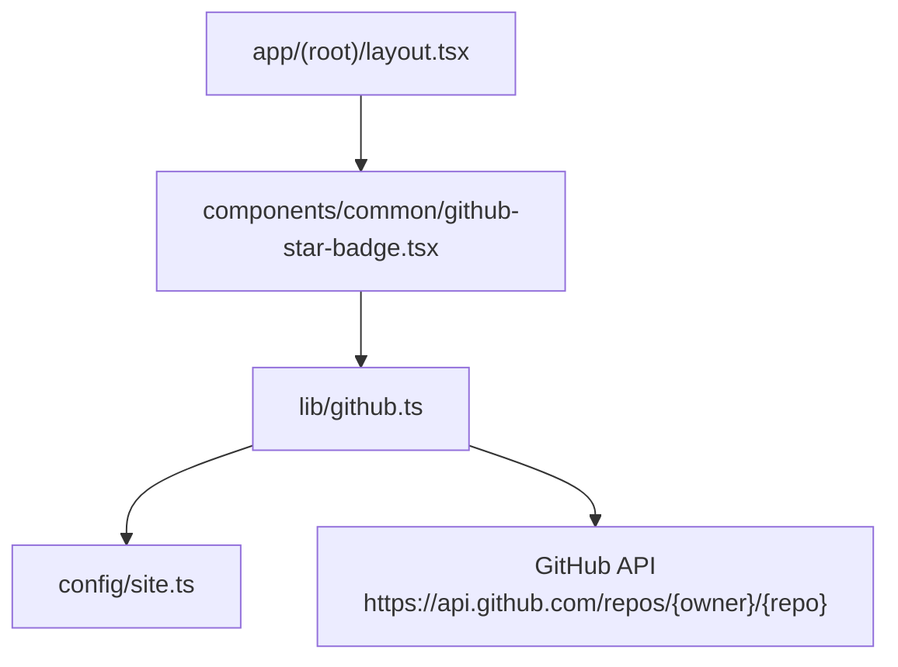
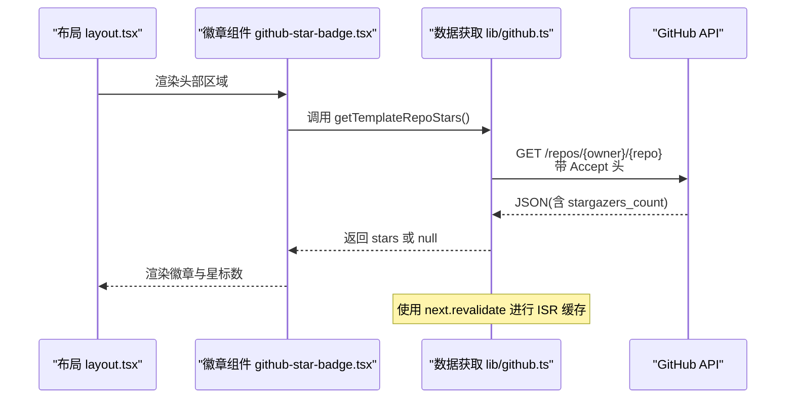
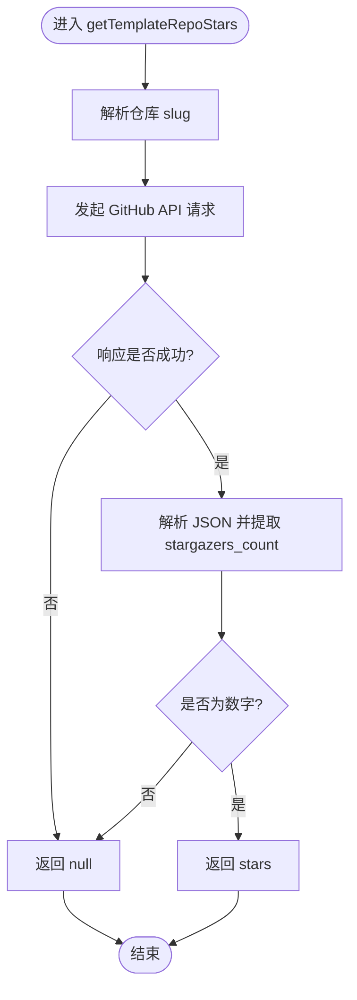
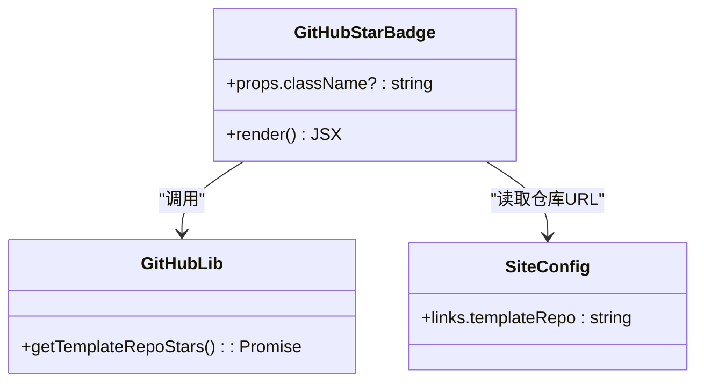
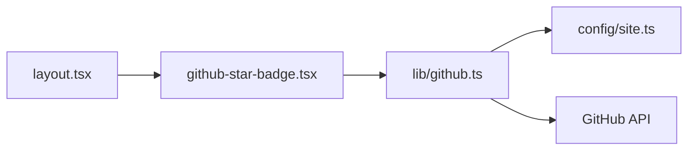

# GitHub集成

<cite>
**本文引用的文件**
- [lib/github.ts](file://lib/github.ts)
- [components/common/github-star-badge.tsx](file://components/common/github-star-badge.tsx)
- [config/site.ts](file://config/site.ts)
- [app/(root)/layout.tsx](file://app/(root)/layout.tsx)
- [next.config.js](file://next.config.js)
- [tsconfig.json](file://tsconfig.json)
</cite>

## 目录
1. [简介](#简介)
2. [项目结构](#项目结构)
3. [核心组件](#核心组件)
4. [架构总览](#架构总览)
5. [详细组件分析](#详细组件分析)
6. [依赖关系分析](#依赖关系分析)
7. [性能与缓存策略](#性能与缓存策略)
8. [故障排除指南](#故障排除指南)
9. [结论](#结论)
10. [附录：配置与扩展示例](#附录：配置与扩展示例)

## 简介
本仓库在Next.js应用中实现了GitHub集成功能，主要用于展示模板仓库的星标数量。该功能通过服务端组件调用GitHub API获取数据，并结合Next.js的增量静态再生（ISR）进行缓存与定时刷新。前端以徽章形式呈现，点击可跳转至仓库页面。当前实现未使用API路由，而是直接在服务端组件中发起请求；同时提供了可扩展的库函数用于未来接入更多GitHub数据。

## 项目结构
GitHub相关代码主要分布在以下位置：
- 数据获取层：lib/github.ts
- 展示层：components/common/github-star-badge.tsx
- 站点配置：config/site.ts（包含模板仓库URL）
- 布局集成：app/(root)/layout.tsx（在头部区域渲染徽章）
- 构建与路径别名：next.config.js、tsconfig.json

**图示来源**
- [app/(root)/layout.tsx:1-33](file://app/(root)/layout.tsx#L1-L33)
- [components/common/github-star-badge.tsx:1-39](file://components/common/github-star-badge.tsx#L1-L39)
- [lib/github.ts:1-33](file://lib/github.ts#L1-L33)
- [config/site.ts:1-39](file://config/site.ts#L1-L39)

**章节来源**
- [app/(root)/layout.tsx:1-33](file://app/(root)/layout.tsx#L1-L33)
- [components/common/github-star-badge.tsx:1-39](file://components/common/github-star-badge.tsx#L1-L39)
- [lib/github.ts:1-33](file://lib/github.ts#L1-L33)
- [config/site.ts:1-39](file://config/site.ts#L1-L39)

## 核心组件
- GitHubStarBadge：服务端异步组件，负责调用getTemplateRepoStars并渲染徽章链接与星标数。
- getTemplateRepoStars：封装对GitHub API的请求，解析仓库slug，设置Accept头，使用ISR缓存并返回星标数或null。
- siteConfig.links.templateRepo：集中管理模板仓库地址，便于统一修改。

这些组件共同构成“配置→数据获取→展示”的最小闭环，保证在构建/渲染时高效拉取并缓存GitHub数据。

**章节来源**
- [components/common/github-star-badge.tsx:1-39](file://components/common/github-star-badge.tsx#L1-L39)
- [lib/github.ts:1-33](file://lib/github.ts#L1-L33)
- [config/site.ts:1-39](file://config/site.ts#L1-L39)

## 架构总览
下图展示了从布局到数据获取再到外部API的完整调用链，以及Next.js ISR缓存的作用点。

**图示来源**
- [app/(root)/layout.tsx:1-33](file://app/(root)/layout.tsx#L1-L33)
- [components/common/github-star-badge.tsx:1-39](file://components/common/github-star-badge.tsx#L1-L39)
- [lib/github.ts:1-33](file://lib/github.ts#L1-L33)

## 详细组件分析

### 数据获取模块（lib/github.ts）
- 职责
  - 从siteConfig解析仓库slug（owner/repo）。
  - 向GitHub API发起GET请求，设置Accept头为GitHub JSON格式。
  - 使用next.revalidate实现ISR缓存，默认每6小时重新验证一次。
  - 安全处理网络错误与响应异常，失败时返回null以保证UI降级显示。
- 复杂度
  - 时间复杂度：O(1)（单次HTTP请求+JSON解析）。
  - 空间复杂度：O(1)。
- 优化点
  - 可通过环境变量调整revalidate周期。
  - 如需更高并发或更低延迟，可在Vercel等平台上利用边缘缓存或CDN。
  - 增加重试与退避策略以提升鲁棒性。

**图示来源**
- [lib/github.ts:1-33](file://lib/github.ts#L1-L33)

**章节来源**
- [lib/github.ts:1-33](file://lib/github.ts#L1-L33)

### 徽章组件（components/common/github-star-badge.tsx）
- 职责
  - 作为服务端组件异步获取stars。
  - 渲染指向模板仓库的链接，并在无障碍属性中附加星标信息。
  - 当stars为空时显示占位文本，确保UI稳定。
- 交互
  - 点击徽章跳转到配置的模板仓库URL。
- 样式
  - 使用Tailwind类名控制外观，支持自定义className覆盖。

**图示来源**
- [components/common/github-star-badge.tsx:1-39](file://components/common/github-star-badge.tsx#L1-L39)
- [config/site.ts:1-39](file://config/site.ts#L1-L39)
- [lib/github.ts:1-33](file://lib/github.ts#L1-L33)

**章节来源**
- [components/common/github-star-badge.tsx:1-39](file://components/common/github-star-badge.tsx#L1-L39)

### 布局集成（app/(root)/layout.tsx）
- 职责
  - 在头部区域引入并渲染GitHubStarBadge，提供移动端与桌面端的展示入口。
- 影响
  - 每次页面渲染都会触发徽章组件的服务端执行，但由于ISR缓存，实际网络请求仅在缓存失效或首次访问时发生。

**章节来源**
- [app/(root)/layout.tsx:1-33](file://app/(root)/layout.tsx#L1-L33)

## 依赖关系分析
- 组件耦合
  - 徽章组件依赖数据获取库与站点配置，耦合度低且职责清晰。
- 外部依赖
  - 仅依赖GitHub公开API，无需鉴权即可获取仓库基础信息（包括星标数）。
- 潜在循环依赖
  - 无循环引用，依赖方向单向：布局→组件→库→配置→外部API。

**图示来源**
- [app/(root)/layout.tsx:1-33](file://app/(root)/layout.tsx#L1-L33)
- [components/common/github-star-badge.tsx:1-39](file://components/common/github-star-badge.tsx#L1-L39)
- [lib/github.ts:1-33](file://lib/github.ts#L1-L33)
- [config/site.ts:1-39](file://config/site.ts#L1-L39)

**章节来源**
- [app/(root)/layout.tsx:1-33](file://app/(root)/layout.tsx#L1-L33)
- [components/common/github-star-badge.tsx:1-39](file://components/common/github-star-badge.tsx#L1-L39)
- [lib/github.ts:1-33](file://lib/github.ts#L1-L33)
- [config/site.ts:1-39](file://config/site.ts#L1-L39)

## 性能与缓存策略
- 缓存机制
  - 使用next.revalidate实现ISR缓存，默认每6小时重新验证一次，减少重复请求。
- 请求频率控制
  - 通过ISR避免高频请求；若需更细粒度控制，可将revalidate周期调整为环境变量。
- 响应速度优化建议
  - 将revalidate周期根据业务需求调优（例如生产环境可延长至12或24小时）。
  - 在Vercel等平台部署可利用其边缘缓存进一步降低延迟。
  - 为徽章添加骨架屏或占位符，提升首屏体验。
- 构建与路径
  - tsconfig.json中的路径别名@/*简化导入，提高可维护性。
  - next.config.js保持默认配置，便于后续扩展。

[本节为通用性能指导，不直接分析具体文件]

## 故障排除指南
- 常见问题
  - 徽章显示“Star”而非数字：可能因网络错误或API返回非预期字段，此时getTemplateRepoStars返回null，组件会降级显示。
  - 星标数长时间不更新：检查ISR缓存周期，确认是否需要缩短revalidate间隔。
  - 无法解析仓库slug：确认siteConfig.links.templateRepo为有效GitHub仓库URL。
- 定位步骤
  - 检查浏览器控制台与服务端日志，确认是否有网络异常。
  - 临时增大revalidate值观察变化，验证是否为缓存导致。
  - 在本地开发环境中直接访问GitHub API，验证接口可用性。
- 恢复措施
  - 修正仓库URL或网络问题后，等待下一次revalidate或手动触发重建。
  - 如需立即生效，可清理构建缓存或重启服务。

**章节来源**
- [lib/github.ts:1-33](file://lib/github.ts#L1-L33)
- [components/common/github-star-badge.tsx:1-39](file://components/common/github-star-badge.tsx#L1-L39)

## 结论
本项目以最小化方式实现了GitHub集成功能：通过服务端组件调用GitHub API获取仓库星标数，结合ISR缓存保障性能与稳定性。整体架构清晰、依赖简单，易于扩展更多GitHub数据或接入API路由。建议在生产环境中根据流量与更新频率调优缓存策略，并考虑增加重试与监控以提升健壮性。

[本节为总结性内容，不直接分析具体文件]

## 附录：配置与扩展示例

- 获取仓库信息
  - 参考：[lib/github.ts:1-33](file://lib/github.ts#L1-L33)
  - 说明：通过getTemplateRepoSlug解析仓库地址，再调用GitHub API获取仓库详情。

- 自定义徽章样式
  - 参考：[components/common/github-star-badge.tsx:1-39](file://components/common/github-star-badge.tsx#L1-L39)
  - 说明：通过className传入自定义样式，或使用Tailwind类名调整外观。

- 添加更多GitHub数据
  - 扩展思路：在lib/github.ts中新增函数，复用getTemplateRepoSlug与fetch逻辑，返回所需字段（如forks、issues、languages等）。
  - 在前端组件中调用新函数并渲染。

- 优化API响应速度
  - 调整缓存周期：在lib/github.ts中修改revalidate秒数，或通过环境变量注入。
  - 平台级优化：在Vercel等平台上启用边缘缓存与CDN加速。

- GitHub应用配置与环境变量
  - 当前实现无需额外GitHub App或Token，因为仅访问公开仓库信息。
  - 若未来需要访问私有仓库或更高配额，可在环境变量中配置GITHUB_TOKEN，并在请求头中添加Authorization。
  - 环境变量示例（供未来扩展使用）：
    - GITHUB_TOKEN=ghp_xxx...
    - REVALIDATE_SECONDS=21600
  - 注意：请勿将敏感信息提交至版本库。

- 关于API路由
  - 当前未使用API路由实现GitHub数据获取；如需独立API端点，可在app/api下新增route.ts，封装相同的数据获取逻辑并提供REST接口。
  - 优势：便于其他服务或客户端复用，并可单独设置速率限制与缓存策略。

**章节来源**
- [lib/github.ts:1-33](file://lib/github.ts#L1-L33)
- [components/common/github-star-badge.tsx:1-39](file://components/common/github-star-badge.tsx#L1-L39)
- [config/site.ts:1-39](file://config/site.ts#L1-L39)
- [next.config.js:1-4](file://next.config.js#L1-L4)
- [tsconfig.json:1-34](file://tsconfig.json#L1-L34)