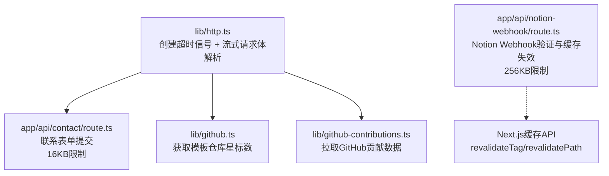
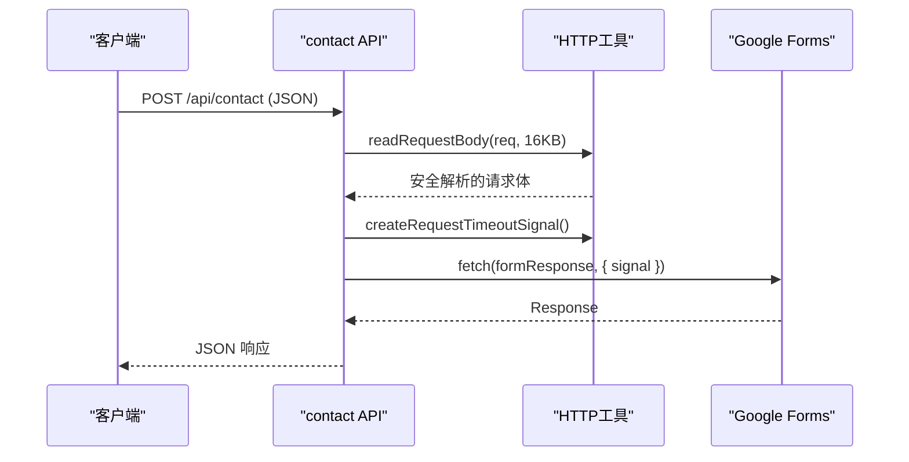
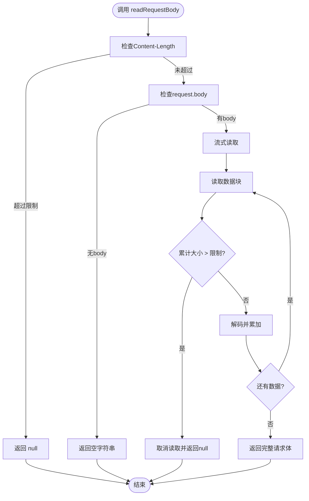
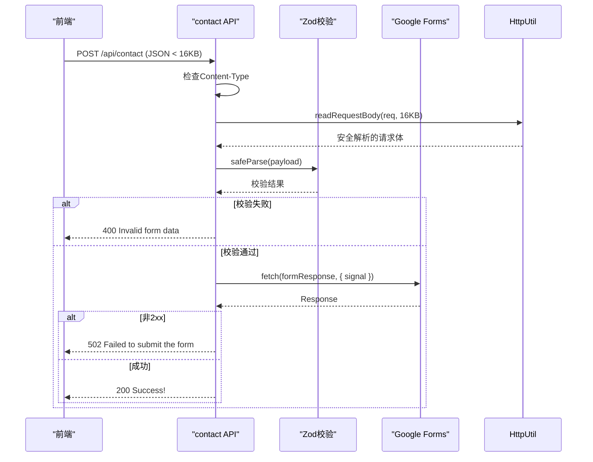
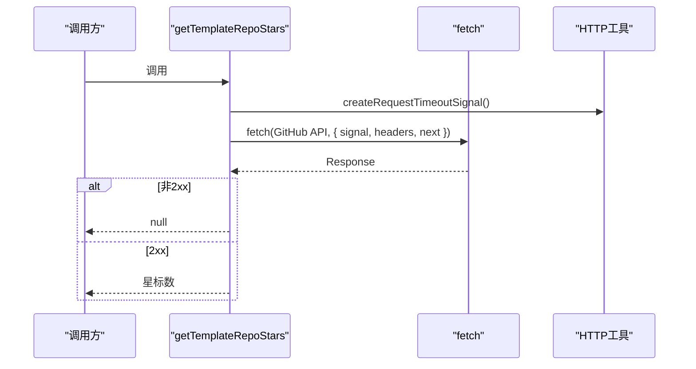
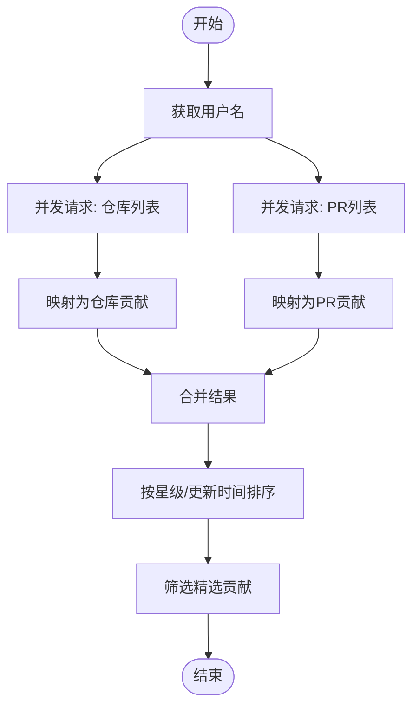
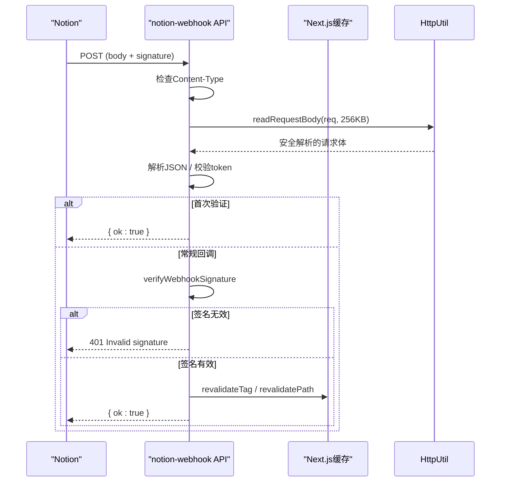
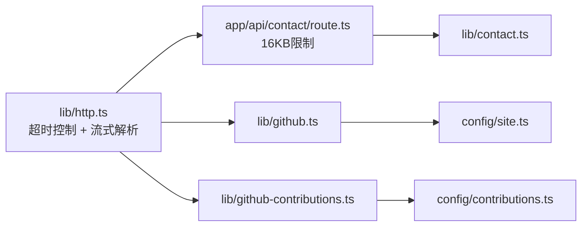

# HTTP工具库

<cite>
**本文引用的文件**
- [lib/http.ts](file://lib/http.ts)
- [app/api/contact/route.ts](file://app/api/contact/route.ts)
- [app/api/notion-webhook/route.ts](file://app/api/notion-webhook/route.ts)
- [lib/github.ts](file://lib/github.ts)
- [lib/github-contributions.ts](file://lib/github-contributions.ts)
- [lib/contact.ts](file://lib/contact.ts)
</cite>

## 更新摘要
**所做更改**
- 增强了HTTP工具库，添加了流式请求体解析功能
- 实现了针对内存耗尽攻击的安全防护措施
- 为不同API端点设置了合理的请求体大小限制（Webhook: 256KB, 表单: 16KB）
- 更新了联系表单和Notion Webhook路由以使用新的安全解析功能

## 目录
1. [简介](#简介)
2. [项目结构](#项目结构)
3. [核心组件](#核心组件)
4. [架构总览](#架构总览)
5. [详细组件分析](#详细组件分析)
6. [依赖关系分析](#依赖关系分析)
7. [性能考量](#性能考量)
8. [安全考虑](#安全考虑)
9. [故障排查指南](#故障排查指南)
10. [结论](#结论)

## 简介
本仓库包含一个增强的服务端HTTP工具库，位于 lib/http.ts。该工具库不仅提供统一的请求超时控制能力（基于 AbortSignal），还新增了安全的流式请求体解析功能，有效防止内存耗尽攻击。工具库在各API路由与数据获取模块中复用，确保对外部HTTP请求具备一致的超时、错误处理策略以及安全防护机制。该工具库遵循"仅服务端"约束，避免被客户端打包引入。

## 项目结构
围绕HTTP工具库的相关代码主要分布在以下位置：
- 工具实现：lib/http.ts（包含超时控制和流式解析功能）
- API路由使用示例：app/api/contact/route.ts、app/api/notion-webhook/route.ts
- 数据层调用示例：lib/github.ts、lib/github-contributions.ts
- 表单校验：lib/contact.ts（为API路由提供输入校验）

**图表来源**
- [lib/http.ts:1-51](file://lib/http.ts#L1-L51)
- [app/api/contact/route.ts:1-80](file://app/api/contact/route.ts#L1-L80)
- [lib/github.ts:1-42](file://lib/github.ts#L1-L42)
- [lib/github-contributions.ts:1-230](file://lib/github-contributions.ts#L1-L230)
- [app/api/notion-webhook/route.ts:1-107](file://app/api/notion-webhook/route.ts#L1-L107)

**章节来源**
- [lib/http.ts:1-51](file://lib/http.ts#L1-L51)
- [app/api/contact/route.ts:1-80](file://app/api/contact/route.ts#L1-L80)
- [lib/github.ts:1-42](file://lib/github.ts#L1-L42)
- [lib/github-contributions.ts:1-230](file://lib/github-contributions.ts#L1-L230)
- [app/api/notion-webhook/route.ts:1-107](file://app/api/notion-webhook/route.ts#L1-L107)

## 核心组件
- **超时信号工厂**：createRequestTimeoutSignal
  - 作用：返回一个可配置的AbortSignal，用于在fetch等网络请求中设置超时。
  - 默认超时：10秒。
  - 适用场景：所有需要对外发起HTTP请求的服务端逻辑。

- **流式请求体解析器**：readRequestBody
  - 作用：安全地读取请求体，支持流式处理和大小限制。
  - 安全防护：防止内存耗尽攻击，通过Content-Length预检查和流式读取限制。
  - 返回值：字符串形式的请求体或null（当超过大小限制时）。
  - 适用场景：所有接收请求体的API端点。

**章节来源**
- [lib/http.ts:1-51](file://lib/http.ts#L1-L51)

## 架构总览
HTTP工具库作为基础设施，被多个模块复用：
- API路由通过它来限制外部请求的等待时间和请求体大小，避免长时间阻塞和内存耗尽。
- 数据层模块在调用GitHub API时统一使用该信号，保证一致性与可维护性。
- Notion Webhook路由负责签名校验与缓存失效，使用安全的请求体解析功能。

**图表来源**
- [app/api/contact/route.ts:1-80](file://app/api/contact/route.ts#L1-L80)
- [lib/http.ts:1-51](file://lib/http.ts#L1-L51)

## 详细组件分析

### 组件A：HTTP工具库（lib/http.ts）
**更新** 新增了流式请求体解析功能，增强了安全性

- **设计要点**
  - 强制服务端运行：通过导入server-only，防止被客户端打包。
  - 统一超时：默认10秒，可通过参数覆盖。
  - 流式解析：使用ReadableStream安全地读取请求体，防止内存耗尽。
  - 双重防护：Content-Length预检查 + 流式读取限制。
  - 返回值：AbortSignal或解析后的请求体字符串。

- **安全特性**
  - Content-Length预检查：在开始读取前检查声明的大小。
  - 流式处理：逐块读取请求体，避免一次性加载到内存。
  - 自动清理：使用try-finally确保Reader正确释放。
  - 取消机制：超过限制时主动取消读取流。

- **复杂度与性能**
  - 时间复杂度：O(n)，n为请求体大小
  - 空间复杂度：O(k)，k为最大允许大小
  - 内存安全：通过流式处理避免大对象占用内存

**图表来源**
- [lib/http.ts:11-50](file://lib/http.ts#L11-L50)

**章节来源**
- [lib/http.ts:1-51](file://lib/http.ts#L1-L51)

### 组件B：联系表单API（app/api/contact/route.ts）
**更新** 集成了安全的请求体解析功能

- **功能概述**
  - 接收前端提交的表单数据，进行Zod校验。
  - 使用安全的流式解析器读取请求体，限制大小为16KB。
  - 将数据转发至Google Forms，并使用HTTP工具提供的超时信号。
  - 根据响应状态返回成功或错误信息。

- **关键流程**
  - 内容类型检查 -> 安全解析请求体 -> Zod校验 -> 构造查询参数 -> fetch提交 -> 返回结果。

- **安全措施**
  - 16KB请求体限制：防止恶意大请求消耗服务器资源。
  - 流式解析：避免一次性加载大量数据到内存。
  - 内容类型验证：只接受application/json格式。

**图表来源**
- [app/api/contact/route.ts:1-80](file://app/api/contact/route.ts#L1-L80)
- [lib/contact.ts:1-36](file://lib/contact.ts#L1-L36)
- [lib/http.ts:1-51](file://lib/http.ts#L1-L51)

**章节来源**
- [app/api/contact/route.ts:1-80](file://app/api/contact/route.ts#L1-L80)
- [lib/contact.ts:1-36](file://lib/contact.ts#L1-L36)

### 组件C：GitHub数据获取（lib/github.ts）
- **功能概述**
  - 从GitHub API获取模板仓库的星标数，带缓存与过期策略。
  - 使用HTTP工具提供的超时信号，避免请求挂起。

- **关键点**
  - 通过siteConfig获取仓库slug。
  - 设置Accept头以兼容GitHub API。
  - revalidate策略控制缓存刷新频率。

**图表来源**
- [lib/github.ts:1-42](file://lib/github.ts#L1-L42)
- [lib/http.ts:1-51](file://lib/http.ts#L1-L51)

**章节来源**
- [lib/github.ts:1-42](file://lib/github.ts#L1-L42)

### 组件D：GitHub贡献聚合（lib/github-contributions.ts）
- **功能概述**
  - 并行拉取用户的公开仓库与Pull Requests，并进行数据映射与排序。
  - 统一使用HTTP工具的超时信号，保障稳定性。
  - 提供精选贡献列表的生成逻辑。

- **关键点**
  - 使用统一的fetch封装，设置缓存与重验证策略。
  - 对错误进行降级处理（空数组返回），避免影响整体展示。
  - 通过配置项控制拉取数量与重验证间隔。

**图表来源**
- [lib/github-contributions.ts:1-230](file://lib/github-contributions.ts#L1-L230)
- [lib/http.ts:1-51](file://lib/http.ts#L1-L51)

**章节来源**
- [lib/github-contributions.ts:1-230](file://lib/github-contributions.ts#L1-L230)

### 组件E：Notion Webhook路由（app/api/notion-webhook/route.ts）
**更新** 集成了安全的请求体解析功能，支持更大的Webhook负载

- **功能概述**
  - 接收Notion发来的Webhook，支持首次验证token流程与后续签名校验。
  - 使用安全的流式解析器读取请求体，限制大小为256KB。
  - 校验通过后触发Next.js缓存失效，使博客与站点地图等页面重新生成。

- **关键流程**
  - 内容类型检查 -> 安全解析请求体 -> 验证token或签名 -> 触发缓存失效。

- **安全措施**
  - 256KB请求体限制：适应Notion Webhook可能的大负载。
  - 流式解析：安全处理可能的恶意大请求。
  - 严格的token格式验证：长度和字符集限制。

**图表来源**
- [app/api/notion-webhook/route.ts:1-107](file://app/api/notion-webhook/route.ts#L1-L107)

**章节来源**
- [app/api/notion-webhook/route.ts:1-107](file://app/api/notion-webhook/route.ts#L1-L107)

## 依赖关系分析
- **内聚与耦合**
  - lib/http.ts高度内聚，仅提供单一职责的工具函数。
  - 各模块通过导入该工具函数形成松耦合依赖，便于替换或扩展（如增加重试、指标上报等）。

- **外部依赖**
  - Next.js内置fetch与缓存API。
  - Zod用于输入校验。
  - @notionhq/client用于Webhook签名校验。

- **可能的循环依赖**
  - 当前结构中未发现循环依赖；工具库无业务逻辑，仅暴露纯函数。

**图表来源**
- [lib/http.ts:1-51](file://lib/http.ts#L1-L51)
- [app/api/contact/route.ts:1-80](file://app/api/contact/route.ts#L1-L80)
- [lib/github.ts:1-42](file://lib/github.ts#L1-L42)
- [lib/github-contributions.ts:1-230](file://lib/github-contributions.ts#L1-L230)
- [lib/contact.ts:1-36](file://lib/contact.ts#L1-L36)

**章节来源**
- [lib/http.ts:1-51](file://lib/http.ts#L1-L51)
- [app/api/contact/route.ts:1-80](file://app/api/contact/route.ts#L1-L80)
- [lib/github.ts:1-42](file://lib/github.ts#L1-L42)
- [lib/github-contributions.ts:1-230](file://lib/github-contributions.ts#L1-L230)
- [lib/contact.ts:1-36](file://lib/contact.ts#L1-L36)

## 性能考量
- **超时控制**
  - 统一10秒超时，避免长尾请求拖慢响应。可根据不同下游服务调整超时阈值。

- **缓存策略**
  - GitHub数据采用force-cache与revalidate策略，减少频繁请求。
  - Notion Webhook触发后精准失效缓存，提升更新效率。

- **并发与降级**
  - GitHub贡献数据并行拉取，提高吞吐。
  - 单个请求失败不影响整体展示（降级为空数组）。

- **内存优化**
  - 流式请求体解析避免大对象占用内存。
  - 合理的大小限制防止内存耗尽攻击。

- **可扩展点**
  - 可在工具层增加重试、指数退避、熔断与指标上报，进一步提升健壮性。

## 安全考虑
**新增** 针对内存耗尽攻击的全面防护

- **请求体大小限制**
  - 联系表单：16KB限制，适合表单数据。
  - Notion Webhook：256KB限制，适应Webhook负载。
  - 可根据业务需求调整限制大小。

- **流式处理**
  - 使用ReadableStream逐块读取请求体。
  - 避免一次性加载大请求到内存。
  - 自动清理资源，防止内存泄漏。

- **双重防护机制**
  - Content-Length预检查：快速拒绝明显过大的请求。
  - 流式读取限制：实际读取过程中的动态监控。

- **错误处理**
  - 超过限制时返回明确的HTTP状态码（413）。
  - 异常情况下主动取消读取流。
  - 完善的finally块确保资源释放。

## 故障排查指南
- **常见问题定位**
  - 表单提交失败：检查环境变量是否配置完整（Google Form链接与各字段ID）。
  - 超时错误：确认下游服务可用性，必要时增大超时或优化网络。
  - Webhook签名无效：核对NOTION_WEBHOOK_VERIFICATION_TOKEN与请求头x-notion-signature。
  - 请求体过大：检查客户端发送的数据大小是否超过限制。

- **建议的调试步骤**
  - 查看API路由的错误返回码与日志输出。
  - 检查Zod校验失败的具体字段与消息。
  - 对于GitHub API，确认Token权限与速率限制。
  - 监控内存使用情况，确认没有内存泄漏。

**章节来源**
- [app/api/contact/route.ts:1-80](file://app/api/contact/route.ts#L1-L80)
- [app/api/notion-webhook/route.ts:1-107](file://app/api/notion-webhook/route.ts#L1-L107)
- [lib/contact.ts:1-36](file://lib/contact.ts#L1-L36)

## 结论
本增强的HTTP工具库以最小化实现提供了稳定的超时控制能力和安全的流式请求体解析功能，并通过在各模块中的统一使用，显著提升了整体系统的健壮性、安全性和可维护性。结合Next.js的缓存机制与Zod校验，形成了清晰、可靠且安全的数据获取与API处理链路。新增的内存耗尽攻击防护措施确保了服务在各种负载情况下的稳定运行。未来可在工具层进一步增强重试、监控与可观测性，以满足更复杂的业务需求。