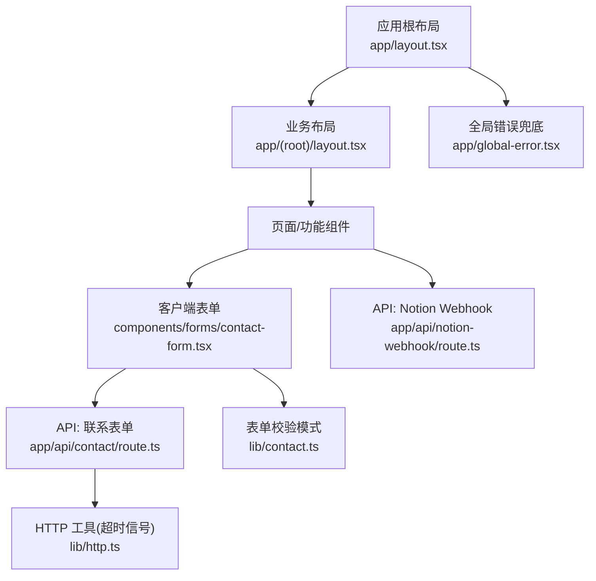
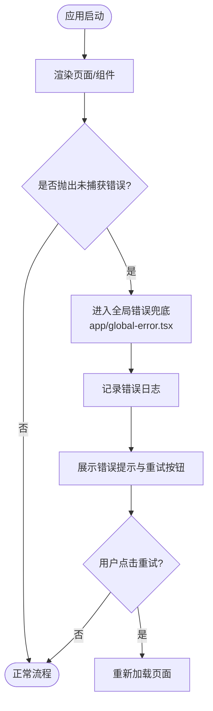
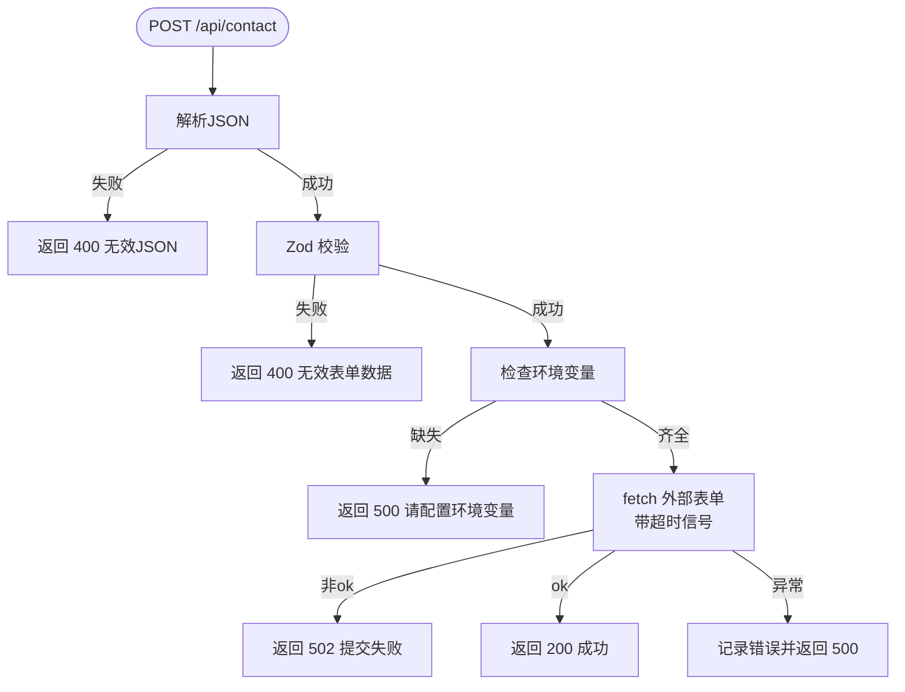
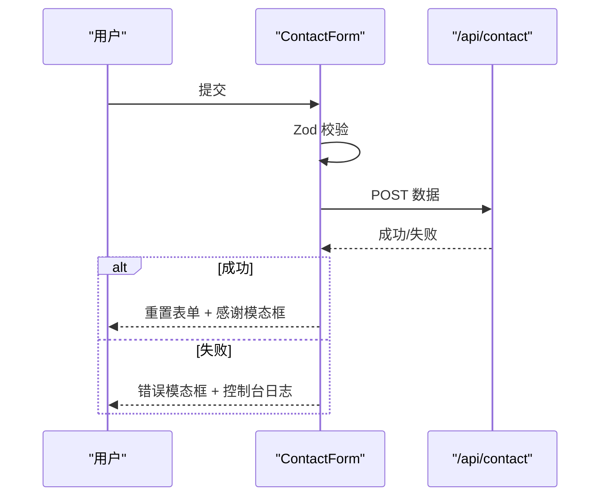
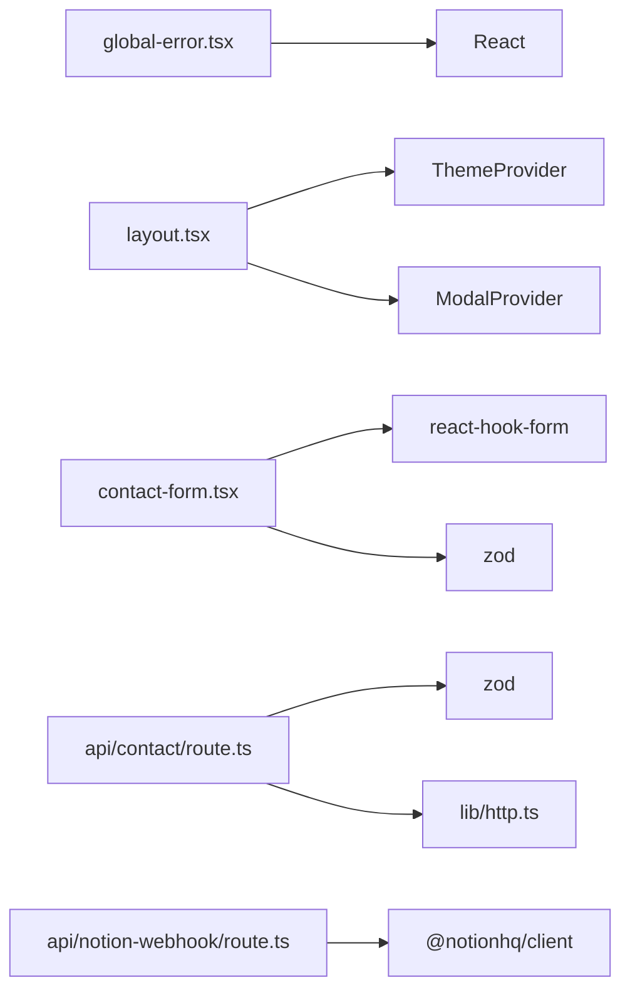

# 全局错误处理

<cite>
**本文引用的文件**
- [app/global-error.tsx](file://app/global-error.tsx)
- [app/layout.tsx](file://app/layout.tsx)
- [app/(root)/layout.tsx](file://app/(root)/layout.tsx)
- [app/api/contact/route.ts](file://app/api/contact/route.ts)
- [app/api/notion-webhook/route.ts](file://app/api/notion-webhook/route.ts)
- [lib/http.ts](file://lib/http.ts)
- [lib/contact.ts](file://lib/contact.ts)
- [components/forms/contact-form.tsx](file://components/forms/contact-form.tsx)
</cite>

## 目录
1. [简介](#简介)
2. [项目结构](#项目结构)
3. [核心组件](#核心组件)
4. [架构总览](#架构总览)
5. [详细组件分析](#详细组件分析)
6. [依赖分析](#依赖分析)
7. [性能考虑](#性能考虑)
8. [故障排查指南](#故障排查指南)
9. [结论](#结论)

## 简介
本文件聚焦于 Next.js 应用中的“全局错误处理”机制，覆盖客户端全局错误兜底、服务端 API 的错误返回与超时控制、表单校验与用户反馈，以及布局层对全局上下文（主题、模态框等）的注入。目标是帮助开发者理解：当页面渲染或网络请求出现异常时，系统如何捕获、上报并友好地提示用户，同时保证可重试与可观测性。

## 项目结构
本项目采用 Next.js App Router 组织路由与布局：
- 根布局 app/layout.tsx 提供全局元信息、主题与第三方脚本注入。
- 业务分组布局 app/(root)/layout.tsx 提供站点头部、导航与页脚。
- 全局错误兜底 app/global-error.tsx 在应用级捕获未处理错误并提供重试入口。
- API 路由位于 app/api/*，负责数据收发与外部服务交互，统一返回结构化错误响应。
- 客户端表单 components/forms/contact-form.tsx 使用 React Hook Form + Zod 进行校验与提交，并在失败时通过模态框反馈。



图表来源
- [app/layout.tsx:1-122](file://app/layout.tsx#L1-L122)
- [app/(root)/layout.tsx:1-33](file://app/(root)/layout.tsx#L1-L33)
- [app/global-error.tsx:1-46](file://app/global-error.tsx#L1-L46)
- [components/forms/contact-form.tsx:1-156](file://components/forms/contact-form.tsx#L1-L156)
- [app/api/contact/route.ts:1-61](file://app/api/contact/route.ts#L1-L61)
- [app/api/notion-webhook/route.ts:1-76](file://app/api/notion-webhook/route.ts#L1-L76)
- [lib/http.ts:1-9](file://lib/http.ts#L1-L9)
- [lib/contact.ts:1-15](file://lib/contact.ts#L1-L15)

章节来源
- [app/layout.tsx:1-122](file://app/layout.tsx#L1-L122)
- [app/(root)/layout.tsx:1-33](file://app/(root)/layout.tsx#L1-L33)
- [app/global-error.tsx:1-46](file://app/global-error.tsx#L1-L46)

## 核心组件
- 全局错误兜底（客户端）：在应用级捕获未处理错误，输出日志并提供“重试”按钮，便于恢复。
- 根布局：注入主题、分析脚本与全局 UI 上下文，确保错误页也能保持基本可用性与一致性。
- API 层：对输入进行严格校验与签名验证，对外部调用设置超时信号，统一返回状态码与消息。
- 客户端表单：基于 Zod 的字段级校验，提交失败时以模态框提示，成功则重置表单并展示感谢提示。

章节来源
- [app/global-error.tsx:1-46](file://app/global-error.tsx#L1-L46)
- [app/layout.tsx:1-122](file://app/layout.tsx#L1-L122)
- [app/api/contact/route.ts:1-61](file://app/api/contact/route.ts#L1-L61)
- [app/api/notion-webhook/route.ts:1-76](file://app/api/notion-webhook/route.ts#L1-L76)
- [lib/http.ts:1-9](file://lib/http.ts#L1-L9)
- [lib/contact.ts:1-15](file://lib/contact.ts#L1-L15)
- [components/forms/contact-form.tsx:1-156](file://components/forms/contact-form.tsx#L1-L156)

## 架构总览
下图展示了从用户操作到错误处理的完整链路，包括客户端全局错误兜底、表单校验、API 校验与外部调用、以及错误回显。

```mermaid
sequenceDiagram
participant U as "用户"
participant CF as "ContactForm<br/>components/forms/contact-form.tsx"
participant API as "API : /api/contact<br/>app/api/contact/route.ts"
participant HTTP as "HTTP 工具<br/>lib/http.ts"
participant EXT as "Google Forms"
participant GE as "全局错误兜底<br/>app/global-error.tsx"
U->>CF : 填写并提交表单
CF->>CF : Zod 字段校验(lib/contact.ts)
CF->>API : POST JSON
API->>API : 解析JSON/校验/检查环境变量
API->>HTTP : 创建超时信号
API->>EXT : fetch(formLink, {signal})
EXT-->>API : 响应(ok/非ok)
API-->>CF : 成功或错误响应
CF-->>U : 成功 : 模态框感谢; 失败 : 模态框错误
Note over CF,GE : 若发生未捕获异常，由全局错误兜底接管
GE-->>U : 显示“页面暂时无法加载”+“重试”
```

图表来源
- [components/forms/contact-form.tsx:1-156](file://components/forms/contact-form.tsx#L1-L156)
- [app/api/contact/route.ts:1-61](file://app/api/contact/route.ts#L1-L61)
- [lib/http.ts:1-9](file://lib/http.ts#L1-L9)
- [lib/contact.ts:1-15](file://lib/contact.ts#L1-L15)
- [app/global-error.tsx:1-46](file://app/global-error.tsx#L1-L46)

## 详细组件分析

### 全局错误兜底（客户端）
- 职责：捕获应用级未处理错误，记录日志，提供友好的中文提示与重试能力。
- 关键点：
  - 使用 useEffect 记录错误对象，便于调试定位。
  - 提供 retry 回调，触发浏览器重新加载当前路由。
  - 最小化样式，确保在任何状态下均可读可用。



图表来源
- [app/global-error.tsx:1-46](file://app/global-error.tsx#L1-L46)

章节来源
- [app/global-error.tsx:1-46](file://app/global-error.tsx#L1-L46)

### 根布局与业务布局
- 根布局负责：
  - 站点元信息、图标、OpenGraph/Twitter 卡片。
  - 主题提供者与全局模态框提供者，确保错误页也可用一致的 UI 上下文。
  - 第三方脚本注入（如分析与客服小部件）。
- 业务布局负责：
  - 顶部导航、模式切换、GitHub Star 徽章、页脚等通用结构。

章节来源
- [app/layout.tsx:1-122](file://app/layout.tsx#L1-L122)
- [app/(root)/layout.tsx:1-33](file://app/(root)/layout.tsx#L1-L33)

### 联系表单 API（服务端）
- 职责：接收联系表单数据，校验后转发至 Google Forms，并返回统一结果。
- 关键流程：
  - 解析请求体，非法 JSON 直接返回 400。
  - 使用 Zod 校验字段，不合法返回 400。
  - 校验必要环境变量缺失时返回 500。
  - 调用外部服务时使用超时信号，避免长时间阻塞。
  - 外部服务非 ok 返回 502；成功返回 200。
  - 异常路径记录错误日志并返回 500。



图表来源
- [app/api/contact/route.ts:1-61](file://app/api/contact/route.ts#L1-L61)
- [lib/http.ts:1-9](file://lib/http.ts#L1-L9)
- [lib/contact.ts:1-15](file://lib/contact.ts#L1-L15)

章节来源
- [app/api/contact/route.ts:1-61](file://app/api/contact/route.ts#L1-L61)
- [lib/contact.ts:1-15](file://lib/contact.ts#L1-L15)
- [lib/http.ts:1-9](file://lib/http.ts#L1-L9)

### Notion Webhook API（服务端）
- 职责：接收 Notion Webhook，支持首次验证 token 与后续事件签名校验，成功后触发缓存重建。
- 关键流程：
  - 读取原始 body，尝试 JSON 解析，失败返回 400。
  - 若为验证阶段且未配置 token，校验 token 格式并返回成功。
  - 若已配置 token，校验签名，失败返回 401。
  - 校验通过后，对指定路径与标签执行 revalidate，最后返回 200。

```mermaid
flowchart TD
W(["POST /api/notion-webhook"]) --> Read["读取body"]
Read --> Parse["JSON.parse"]
Parse --> |失败| E400["返回 400 无效JSON"]
Parse --> |成功| Mode{"是否为验证阶段?"}
Mode -- 是 --> VerifyToken["校验token格式"]
VerifyToken --> |失败| E400T["返回 400 无效token"]
VerifyToken --> |成功| WOK["返回 200 验证通过"]
Mode -- 否 --> CheckEnv{"是否已配置token?"}
CheckEnv -- 否|E503["返回 503 未配置验证"]
CheckEnv -- 是|Sig["校验签名"]
Sig --> |失败| E401["返回 401 签名无效"]
Sig --> |成功| Reval["revalidateTag/Path"]
Reval --> WOK2["返回 200 成功"]
```

图表来源
- [app/api/notion-webhook/route.ts:1-76](file://app/api/notion-webhook/route.ts#L1-L76)

章节来源
- [app/api/notion-webhook/route.ts:1-76](file://app/api/notion-webhook/route.ts#L1-L76)

### 客户端表单与用户反馈
- 职责：前端字段级校验、提交、成功/失败的用户反馈。
- 关键点：
  - 使用 zodResolver 与 contactSchema 进行强类型校验。
  - 提交失败时抛出错误，catch 中记录日志并通过模态框提示。
  - 成功时重置表单并弹出感谢模态框。



图表来源
- [components/forms/contact-form.tsx:1-156](file://components/forms/contact-form.tsx#L1-L156)
- [lib/contact.ts:1-15](file://lib/contact.ts#L1-L15)
- [app/api/contact/route.ts:1-61](file://app/api/contact/route.ts#L1-L61)

章节来源
- [components/forms/contact-form.tsx:1-156](file://components/forms/contact-form.tsx#L1-L156)
- [lib/contact.ts:1-15](file://lib/contact.ts#L1-L15)

## 依赖分析
- 全局错误兜底依赖 React 生命周期用于日志记录，并与 Next.js 运行时集成。
- 根布局依赖主题与模态框提供者，确保 UI 一致性。
- 表单组件依赖 React Hook Form、Zod 与自定义 UI 组件。
- API 路由依赖 Next.js 缓存 API、第三方 SDK（Notion）、以及自定义 HTTP 工具（超时信号）。



图表来源
- [app/global-error.tsx:1-46](file://app/global-error.tsx#L1-L46)
- [app/layout.tsx:1-122](file://app/layout.tsx#L1-L122)
- [components/forms/contact-form.tsx:1-156](file://components/forms/contact-form.tsx#L1-L156)
- [app/api/contact/route.ts:1-61](file://app/api/contact/route.ts#L1-L61)
- [app/api/notion-webhook/route.ts:1-76](file://app/api/notion-webhook/route.ts#L1-L76)
- [lib/http.ts:1-9](file://lib/http.ts#L1-L9)

章节来源
- [app/global-error.tsx:1-46](file://app/global-error.tsx#L1-L46)
- [app/layout.tsx:1-122](file://app/layout.tsx#L1-L122)
- [components/forms/contact-form.tsx:1-156](file://components/forms/contact-form.tsx#L1-L156)
- [app/api/contact/route.ts:1-61](file://app/api/contact/route.ts#L1-L61)
- [app/api/notion-webhook/route.ts:1-76](file://app/api/notion-webhook/route.ts#L1-L76)
- [lib/http.ts:1-9](file://lib/http.ts#L1-L9)

## 性能考虑
- 超时控制：对外部请求使用统一的超时信号，避免长连接拖慢响应。
- 校验前置：在服务端与客户端均进行数据校验，减少无效请求与渲染开销。
- 缓存失效：Webhook 成功后仅对必要路径与标签执行 revalidate，降低全量刷新成本。
- 错误页轻量：全局错误页无复杂依赖，确保在异常情况下仍可快速呈现。

[本节为通用指导，不直接分析具体文件]

## 故障排查指南
- 页面崩溃或白屏：
  - 观察全局错误页是否出现，确认是否触发了未捕获异常。
  - 检查控制台日志中的错误堆栈与 digest 标识。
- 表单提交失败：
  - 检查环境变量是否配置正确（Google Forms 相关）。
  - 查看 API 返回的状态码：400（参数错误）、500（环境缺失）、502（外部服务失败）。
  - 关注客户端控制台日志与模态框提示。
- Webhook 未生效：
  - 确认 Notion 验证阶段已成功接收并保存 token。
  - 检查签名校验是否通过，必要时核对 x-notion-signature 与 token。
  - 验证 revalidateTag/revalidatePath 是否命中预期路径。

章节来源
- [app/global-error.tsx:1-46](file://app/global-error.tsx#L1-L46)
- [app/api/contact/route.ts:1-61](file://app/api/contact/route.ts#L1-L61)
- [app/api/notion-webhook/route.ts:1-76](file://app/api/notion-webhook/route.ts#L1-L76)
- [components/forms/contact-form.tsx:1-156](file://components/forms/contact-form.tsx#L1-L156)

## 结论
本项目在全局错误处理方面形成了“客户端兜底 + 服务端校验 + 用户反馈”的闭环：
- 客户端通过全局错误页兜底未捕获异常，提供重试能力。
- 服务端通过严格的输入校验、签名验证与超时控制，保障稳定性与安全性。
- 用户侧通过模态框与清晰的状态码反馈，获得一致且友好的体验。
建议在生产环境中结合错误监控平台，将 console.error 与关键错误上报至集中式日志系统，以便更快定位与修复问题。