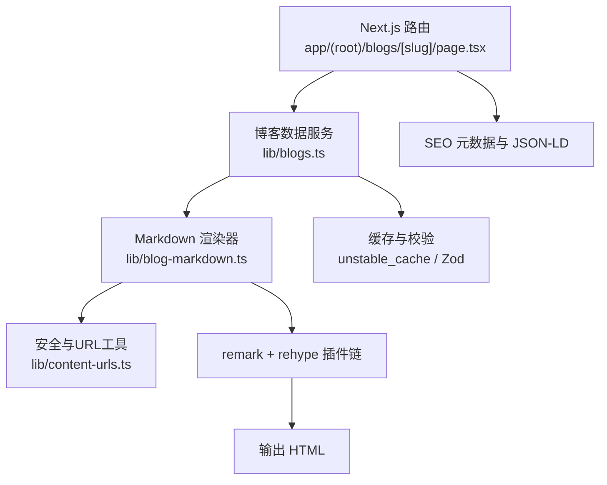
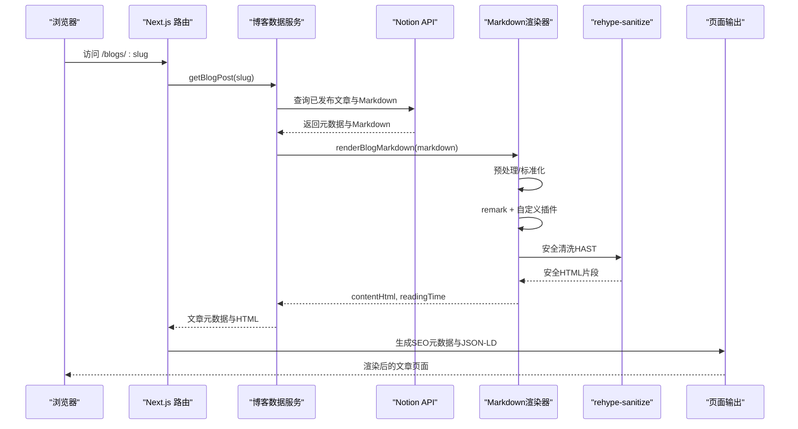
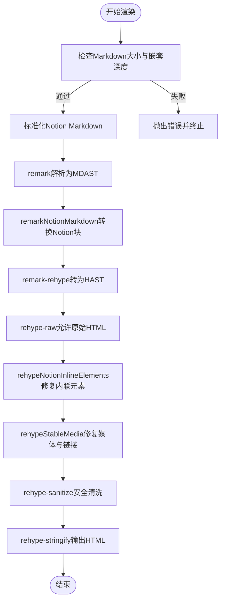
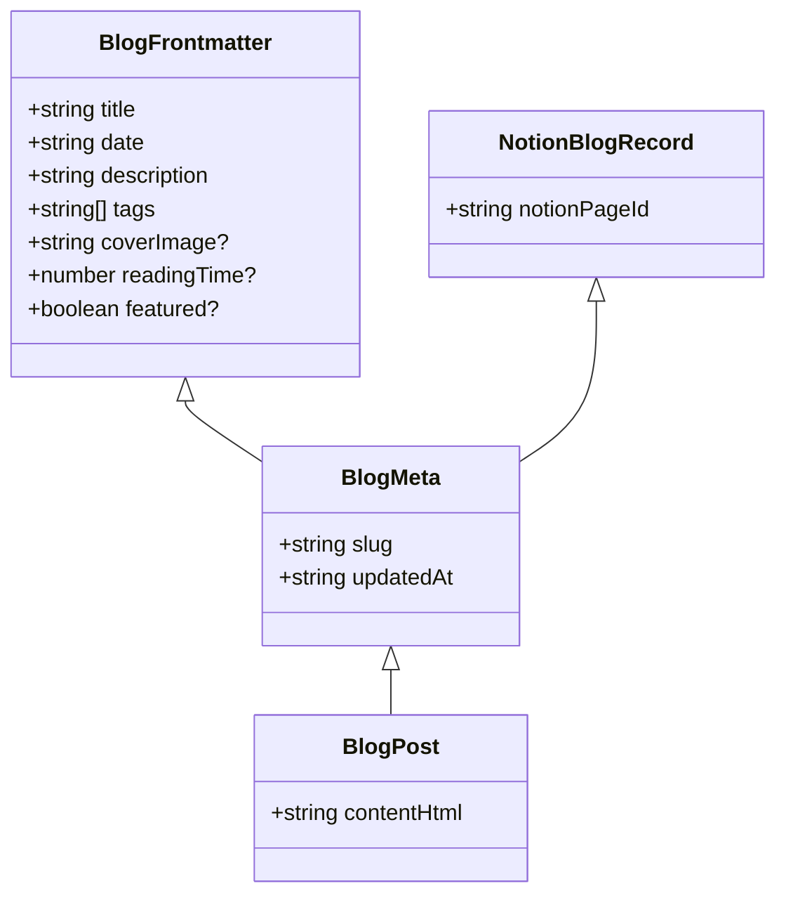
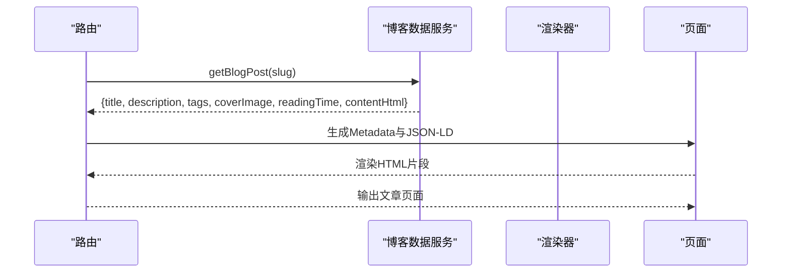
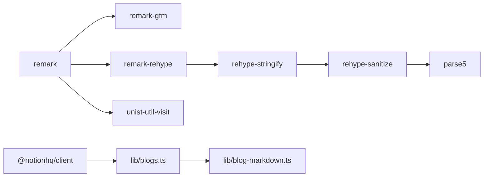

# Markdown文章解析

<cite>
**本文引用的文件**
- [lib/blog-markdown.ts](file://lib/blog-markdown.ts)
- [lib/blogs.ts](file://lib/blogs.ts)
- [app/(root)/blogs/[slug]/page.tsx](file://app/(root)/blogs/[slug]/page.tsx)
- [lib/content-urls.ts](file://lib/content-urls.ts)
- [package.json](file://package.json)
- [scripts/test-blog-markdown.mjs](file://scripts/test-blog-markdown.mjs)
</cite>

## 目录
1. [简介](#简介)
2. [项目结构](#项目结构)
3. [核心组件](#核心组件)
4. [架构总览](#架构总览)
5. [详细组件分析](#详细组件分析)
6. [依赖关系分析](#依赖关系分析)
7. [性能考量](#性能考量)
8. [故障排查指南](#故障排查指南)
9. [结论](#结论)
10. [附录](#附录)

## 简介
本文件为“Markdown文章解析系统”的完整技术文档，覆盖以下主题：
- remark处理器配置与Markdown到HTML转换流程
- 语法高亮实现策略与安全渲染机制
- frontmatter解析、标签提取、阅读时间计算与内容预处理
- 自定义插件开发、样式注入、图片处理与链接优化
- 内容安全策略、XSS防护与敏感信息过滤
- 扩展新Markdown语法、自定义渲染规则、集成第三方库与性能优化实践

该系统基于Next.js服务端渲染，使用remark生态将Markdown（含GFM）转换为安全的HTML，并通过rehype-sanitize进行白名单清洗，确保输出可安全注入页面。同时，系统支持从Notion数据源拉取Markdown并做增强块（callout、table等）的转换，提供稳定的图片与链接处理策略，以及阅读时间与SEO元数据的生成。

## 项目结构
- 内容来源：通过Notion API获取Markdown内容与元数据（标题、描述、标签、封面图、发布时间、阅读时间等），并进行缓存与校验。
- 解析管线：在服务器端对Markdown进行标准化、转换、安全清洗与字符串化，最终得到HTML片段。
- 页面渲染：Next.js路由加载文章元数据与HTML，生成SEO元信息（OpenGraph、Twitter Card、JSON-LD），并将HTML安全注入页面。

图表来源
- [app/(root)/blogs/[slug]/page.tsx:21-84](file://app/(root)/blogs/[slug]/page.tsx#L21-L84)
- [lib/blogs.ts:422-530](file://lib/blogs.ts#L422-L530)
- [lib/blog-markdown.ts:509-531](file://lib/blog-markdown.ts#L509-L531)
- [lib/content-urls.ts:1-44](file://lib/content-urls.ts#L1-L44)

章节来源
- [app/(root)/blogs/[slug]/page.tsx:21-84](file://app/(root)/blogs/[slug]/page.tsx#L21-L84)
- [lib/blogs.ts:422-530](file://lib/blogs.ts#L422-L530)
- [lib/blog-markdown.ts:509-531](file://lib/blog-markdown.ts#L509-L531)
- [lib/content-urls.ts:1-44](file://lib/content-urls.ts#L1-L44)

## 核心组件
- Markdown渲染器（lib/blog-markdown.ts）
  - 使用remark解析Markdown与GFM，再通过remark-rehype转为HAST树，最后经rehype-stringify输出HTML。
  - 内置自定义remark插件remarkNotionMarkdown，将Notion特有的HTML块（如callout、table、synced-block等）转换为标准Markdown，以便后续统一渲染。
  - 内置rehype插件rehypeNotionInlineElements与rehypeStableMedia，规范化媒体与引用节点，仅允许稳定URL，避免临时或危险链接。
  - 使用rehype-sanitize进行安全清洗，拒绝危险标签与属性，防止XSS。
  - 限制最大Markdown字节数与最大嵌套深度，防御DoS与栈溢出风险。
- 博客数据服务（lib/blogs.ts）
  - 从Notion数据源查询已发布文章，校验字段类型与格式（Zod），映射为前端可用的元数据与内容。
  - 提供阅读时间估算函数，基于拉丁词与CJK字符计数，忽略代码块与标记符号。
  - 使用Next.js unstable_cache对查询结果进行缓存与按tag失效。
- 路由与展示（app/(root)/blogs/[slug]/page.tsx）
  - 生成静态参数与元数据（title、description、keywords、OG/Twitter卡片）。
  - 注入BlogPosting与BreadcrumbList JSON-LD，提升SEO。
  - 将渲染后的HTML安全注入页面，并展示封面图、标签、作者、日期与阅读时间。
- URL安全工具（lib/content-urls.ts）
  - 判断站点相对路径、HTTPS URL、临时Notion文件URL，确保仅允许稳定且安全的资源地址。

章节来源
- [lib/blog-markdown.ts:1-532](file://lib/blog-markdown.ts#L1-L532)
- [lib/blogs.ts:1-550](file://lib/blogs.ts#L1-L550)
- [app/(root)/blogs/[slug]/page.tsx:1-322](file://app/(root)/blogs/[slug]/page.tsx#L1-L322)
- [lib/content-urls.ts:1-44](file://lib/content-urls.ts#L1-L44)

## 架构总览
下图展示了从请求到输出的完整流程，包括数据获取、Markdown预处理、插件处理、安全清洗与最终渲染。

图表来源
- [app/(root)/blogs/[slug]/page.tsx:21-84](file://app/(root)/blogs/[slug]/page.tsx#L21-L84)
- [lib/blogs.ts:422-530](file://lib/blogs.ts#L422-L530)
- [lib/blog-markdown.ts:509-531](file://lib/blog-markdown.ts#L509-L531)

## 详细组件分析

### Markdown渲染器（lib/blog-markdown.ts）
- 预处理与标准化
  - normalizeNotionMarkdown：在不破坏代码块的前提下，清理Notion特有属性与标签名，保证后续解析一致性。
  - 限制最大Markdown字节数与最大嵌套深度，防止恶意输入导致性能问题或崩溃。
- 自定义remark插件
  - remarkNotionMarkdown：遍历MDAST中的HTML节点，识别Notion块（callout、columns、details、synced-block、table等），将其转换为标准Markdown文本，再重新解析为MDAST片段插入原位置。
- 自定义rehype插件
  - rehypeNotionInlineElements：将媒体与引用节点（audio/file/pdf/video、database/page/mention-*）根据URL稳定性转换为a或span，避免不安全链接。
  - rehypeStableMedia：对img节点进行严格校验，非稳定URL替换为提示文本；移除临时Notion文件链接。
- 安全清洗与输出
  - rehype-sanitize：基于白名单过滤危险标签与属性，确保输出HTML安全。
  - rehype-stringify：将HAST序列化为HTML字符串。
- 表格与媒体处理
  - 将Notion table转换为标准Markdown表格，保留转义与换行；媒体节点转换为安全链接或占位文本。

图表来源
- [lib/blog-markdown.ts:509-531](file://lib/blog-markdown.ts#L509-L531)
- [lib/blog-markdown.ts:205-265](file://lib/blog-markdown.ts#L205-L265)
- [lib/blog-markdown.ts:410-432](file://lib/blog-markdown.ts#L410-L432)
- [lib/blog-markdown.ts:434-507](file://lib/blog-markdown.ts#L434-L507)

章节来源
- [lib/blog-markdown.ts:1-532](file://lib/blog-markdown.ts#L1-L532)

### 博客数据服务（lib/blogs.ts）
- 数据模型与校验
  - 定义BlogFrontmatter、BlogMeta、BlogPost等接口，使用Zod对Notion返回数据进行严格校验（标题、日期、标签、封面图、阅读时间等）。
- 数据获取与缓存
  - 通过Notion客户端查询已发布文章，分页获取并按PublishedAt降序排序。
  - 使用unstable_cache对记录列表与单篇文章内容进行缓存，支持按tag失效与可配置的revalidate时间。
- 阅读时间估算
  - estimateReadingTime：去除代码块与标记符号后，统计拉丁单词与CJK字符数量，按不同速率换算为分钟，最小值为1。
- 内容渲染与组合
  - 调用renderBlogMarkdown将Markdown转换为HTML，结合元数据生成最终文章对象。

图表来源
- [lib/blogs.ts:35-56](file://lib/blogs.ts#L35-L56)

章节来源
- [lib/blogs.ts:35-56](file://lib/blogs.ts#L35-L56)
- [lib/blogs.ts:422-530](file://lib/blogs.ts#L422-L530)
- [lib/blogs.ts:538-549](file://lib/blogs.ts#L538-L549)

### 路由与展示（app/(root)/blogs/[slug]/page.tsx）
- 静态参数与元数据
  - generateStaticParams：基于所有已发布文章的slug生成静态路由。
  - generateMetadata：设置title、description、keywords、canonical、OG与Twitter卡片信息。
- SEO结构化数据
  - 注入BlogPosting与BreadcrumbList JSON-LD，包含作者、发布时间、修改时间、图片、关键词、字数与预计阅读时间。
- 内容渲染
  - 将contentHtml以dangerouslySetInnerHTML方式注入页面，配合CSS类blog-content进行样式控制。
  - 展示封面图、标签、作者、日期与阅读时间，并提供导航与社交链接。

图表来源
- [app/(root)/blogs/[slug]/page.tsx:21-84](file://app/(root)/blogs/[slug]/page.tsx#L21-L84)
- [app/(root)/blogs/[slug]/page.tsx:101-174](file://app/(root)/blogs/[slug]/page.tsx#L101-L174)
- [app/(root)/blogs/[slug]/page.tsx:280-286](file://app/(root)/blogs/[slug]/page.tsx#L280-L286)

章节来源
- [app/(root)/blogs/[slug]/page.tsx:21-84](file://app/(root)/blogs/[slug]/page.tsx#L21-L84)
- [app/(root)/blogs/[slug]/page.tsx:101-174](file://app/(root)/blogs/[slug]/page.tsx#L101-L174)
- [app/(root)/blogs/[slug]/page.tsx:280-286](file://app/(root)/blogs/[slug]/page.tsx#L280-L286)

### URL安全与资源处理（lib/content-urls.ts）
- isSiteRelativeUrl：仅允许站点相对路径，禁止协议省略与反斜杠。
- isHttpsUrl：仅允许HTTPS协议。
- isTemporaryNotionFileUrl：检测临时签名或特定主机名，阻止不稳定的临时文件链接。
- isStableContentUrl：综合上述规则，确保资源地址稳定且安全。

章节来源
- [lib/content-urls.ts:1-44](file://lib/content-urls.ts#L1-L44)

## 依赖关系分析
- 核心依赖
  - remark、remark-gfm、remark-rehype：Markdown解析与GFM支持，MDAST到HAST转换。
  - rehype-raw、rehype-sanitize、rehype-stringify：允许原始HTML、安全清洗与字符串化。
  - parse5、unist-util-visit：HTML片段解析与树遍历。
  - zod：数据校验。
  - @notionhq/client：Notion API客户端。
  - next/third-parties与next/cache：SEO与缓存能力。
- 版本与锁定
  - package.json中声明了各依赖版本，pnpm-lock.yaml记录了精确解析哈希，确保构建可重复。

图表来源
- [package.json:13-49](file://package.json#L13-L49)
- [lib/blogs.ts:1-16](file://lib/blogs.ts#L1-L16)
- [lib/blog-markdown.ts:1-17](file://lib/blog-markdown.ts#L1-L17)

章节来源
- [package.json:13-49](file://package.json#L13-L49)
- [lib/blogs.ts:1-16](file://lib/blogs.ts#L1-L16)
- [lib/blog-markdown.ts:1-17](file://lib/blog-markdown.ts#L1-L17)

## 性能考量
- 输入限制
  - 限制Markdown最大字节数与最大嵌套深度，避免大文件或深层嵌套导致的内存与CPU压力。
- 缓存策略
  - 使用unstable_cache对文章列表与文章内容进行缓存，支持按tag失效与可配置revalidate时间，减少重复网络请求与解析开销。
- 解析优化
  - 在预处理阶段跳过代码块内的Notion属性清理，减少不必要的正则匹配。
  - 表格与媒体节点的处理采用局部遍历与最小化DOM操作，降低转换成本。
- 渲染优化
  - 仅在必要时注入HTML片段，结合CSS类blog-content进行样式隔离，减少重排与重绘。

[本节为通用性能建议，不直接分析具体文件]

## 故障排查指南
- 常见错误与定位
  - 超大Markdown：当输入超过限制时，渲染器会抛出错误，需检查Notion页面大小或拆分内容。
  - 深度嵌套HTML：超过最大嵌套深度时会报错，需简化Notion块结构。
  - 临时链接被移除：若图片无法显示，检查是否为临时Notion文件URL，应替换为稳定HTTPS或站点相对路径。
  - 字段校验失败：Notion属性类型不符或缺失会导致数据校验失败，需检查数据源配置。
- 测试用例
  - 脚本test-blog-markdown.mjs提供了多种场景的断言，包括标准Markdown与GFM、Notion增强块、深度嵌套与超大输入等，可用于回归验证。

章节来源
- [lib/blog-markdown.ts:19-21](file://lib/blog-markdown.ts#L19-L21)
- [lib/blog-markdown.ts:91-97](file://lib/blog-markdown.ts#L91-L97)
- [lib/content-urls.ts:20-36](file://lib/content-urls.ts#L20-L36)
- [scripts/test-blog-markdown.mjs:103-152](file://scripts/test-blog-markdown.mjs#L103-L152)

## 结论
该Markdown文章解析系统通过严谨的预处理、插件化扩展与安全清洗，实现了从Notion到安全HTML的稳定转换。系统具备完善的输入校验、缓存策略与SEO支持，适合生产环境使用。通过自定义remark与rehype插件，可灵活扩展新的语法与渲染规则；通过URL安全工具与sanitizer，有效防范XSS与不稳定资源风险。建议在新增功能时遵循现有模式，保持输入限制与安全检查的一致性。

[本节为总结性内容，不直接分析具体文件]

## 附录

### 如何添加新的Markdown语法支持
- 在remark管道中添加自定义插件，处理MDAST节点并转换为期望的Markdown或HTML片段。
- 若涉及HAST操作，可在rehype管道中添加对应插件，确保最终输出符合安全白名单。
- 示例参考：
  - 自定义remark插件：参见remarkNotionMarkdown的实现思路与用法。
  - 自定义rehype插件：参见rehypeNotionInlineElements与rehypeStableMedia的实现思路与用法。

章节来源
- [lib/blog-markdown.ts:410-432](file://lib/blog-markdown.ts#L410-L432)
- [lib/blog-markdown.ts:434-507](file://lib/blog-markdown.ts#L434-L507)

### 如何自定义渲染规则
- 在renderNode中增加对新标签的处理分支，将其转换为对应的Markdown或HTML。
- 对于表格、媒体与引用等复杂节点，参考现有实现进行安全与稳定性校验。

章节来源
- [lib/blog-markdown.ts:267-382](file://lib/blog-markdown.ts#L267-L382)

### 如何集成第三方库
- 在remark或rehype管道中引入第三方插件，注意顺序与兼容性。
- 若第三方插件输出可能包含危险内容，需在后续步骤中使用rehype-sanitize进行清洗。

章节来源
- [lib/blog-markdown.ts:509-531](file://lib/blog-markdown.ts#L509-L531)
- [package.json:37-43](file://package.json#L37-L43)

### 如何优化解析性能
- 合理设置缓存策略与revalidate时间，减少重复解析。
- 在预处理阶段尽可能减少不必要的正则匹配与DOM操作。
- 限制输入大小与嵌套深度，避免极端情况下的性能退化。

章节来源
- [lib/blogs.ts:404-420](file://lib/blogs.ts#L404-L420)
- [lib/blog-markdown.ts:19-21](file://lib/blog-markdown.ts#L19-L21)

### 内容安全策略、XSS防护与敏感信息过滤
- 使用rehype-sanitize进行白名单清洗，拒绝危险标签与属性。
- 通过isStableContentUrl与isTemporaryNotionFileUrl确保资源地址稳定且安全。
- 在渲染前对Notion特有属性进行清理，避免注入不可信内容。

章节来源
- [lib/blog-markdown.ts:46-54](file://lib/blog-markdown.ts#L46-L54)
- [lib/blog-markdown.ts:509-531](file://lib/blog-markdown.ts#L509-L531)
- [lib/content-urls.ts:20-44](file://lib/content-urls.ts#L20-L44)