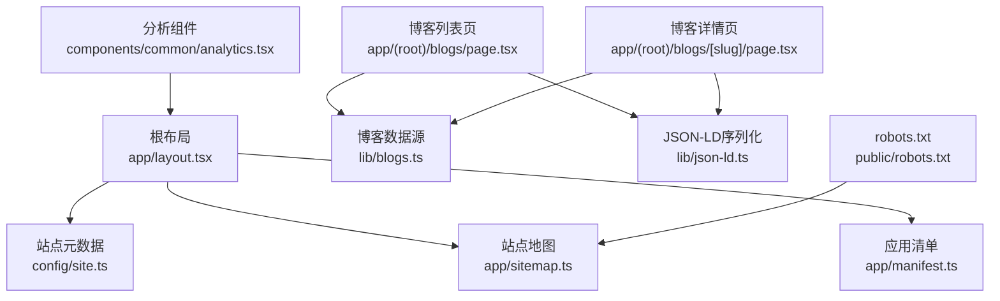
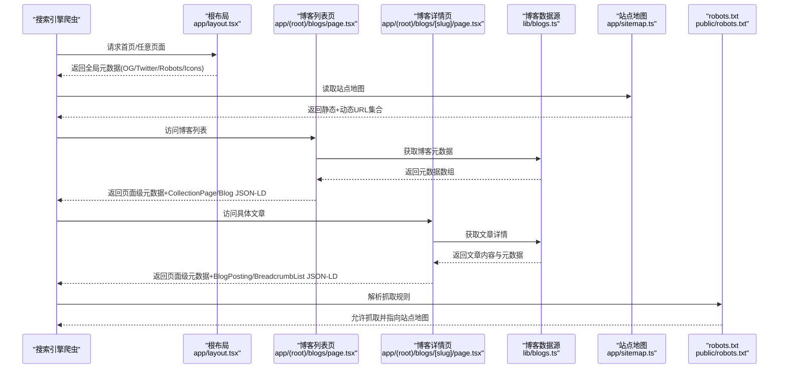
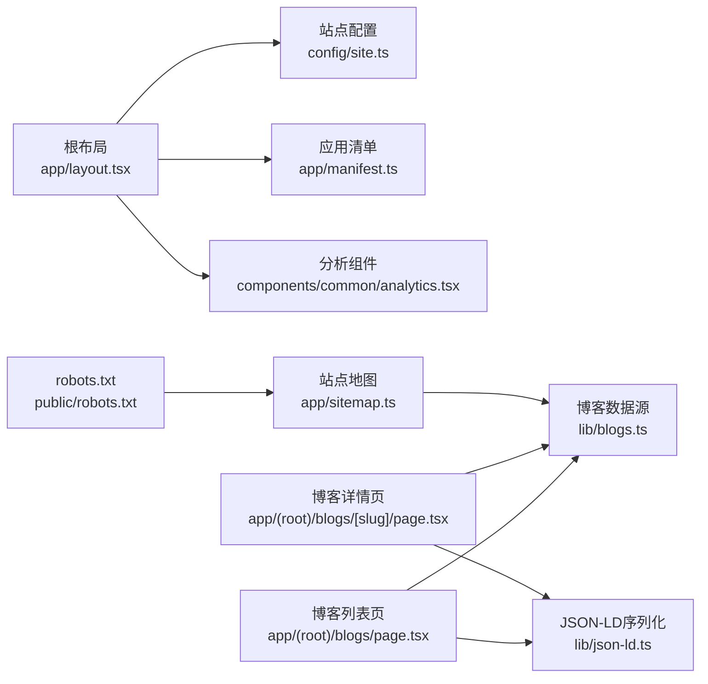

# 博客SEO优化

<cite>
**本文引用的文件**
- [app/layout.tsx](file://app/layout.tsx)
- [app/sitemap.ts](file://app/sitemap.ts)
- [app/manifest.ts](file://app/manifest.ts)
- [config/site.ts](file://config/site.ts)
- [lib/blogs.ts](file://lib/blogs.ts)
- [app/(root)/blogs/page.tsx](file://app/(root)/blogs/page.tsx)
- [app/(root)/blogs/[slug]/page.tsx](file://app/(root)/blogs/[slug]/page.tsx)
- [components/blogs/blog-card.tsx](file://components/blogs/blog-card.tsx)
- [public/robots.txt](file://public/robots.txt)
- [lib/json-ld.ts](file://lib/json-ld.ts)
- [components/common/analytics.tsx](file://components/common/analytics.tsx)
</cite>

## 目录
1. [简介](#简介)
2. [项目结构](#项目结构)
3. [核心组件](#核心组件)
4. [架构总览](#架构总览)
5. [详细组件分析](#详细组件分析)
6. [依赖关系分析](#依赖关系分析)
7. [性能考量](#性能考量)
8. [故障排查指南](#故障排查指南)
9. [结论](#结论)
10. [附录](#附录)

## 简介
本文件面向博客SEO优化，系统化阐述搜索引擎优化策略、元数据管理、结构化数据实现与站点地图生成。结合本项目在Next.js中的实现，说明Open Graph标签、Twitter卡片、JSON-LD格式与语义化HTML标记的落地方式；并给出关键词优化、内容结构规划、内部链接策略与性能指标优化的实践建议。同时提供动态元数据配置、sitemap.xml生成、面包屑导航与社交媒体预览的具体代码路径参考，以及Google Search Console集成、性能监控与SEO审计工具的使用指引。

## 项目结构
本项目采用Next.js App Router组织页面与路由，SEO相关能力分布在以下位置：
- 根布局与全局元数据：根布局中集中定义站点级标题模板、描述、作者、Open Graph、Twitter卡片、图标、规范链接、robots策略与验证信息。
- 站点地图：通过服务端函数按静态路由与动态博客列表生成sitemap.xml。
- 清单与PWA：应用清单用于跨端展示与安装体验。
- 博客模块：博客列表页与文章详情页分别定义页面级元数据、结构化数据（CollectionPage/BlogPosting）与面包屑导航。
- 资源与爬虫：robots.txt允许抓取并声明站点地图地址。
- 分析与监控：集成Vercel Analytics与Google Analytics。

图表来源
- [app/layout.tsx:18-85](file://app/layout.tsx#L18-L85)
- [app/sitemap.ts:6-70](file://app/sitemap.ts#L6-L70)
- [app/manifest.ts:3-37](file://app/manifest.ts#L3-L37)
- [config/site.ts:1-39](file://config/site.ts#L1-L39)
- [lib/blogs.ts:492-536](file://lib/blogs.ts#L492-L536)
- [app/(root)/blogs/page.tsx:12-40](file://app/(root)/blogs/page.tsx#L12-L40)
- [app/(root)/blogs/[slug]/page.tsx:26-84](file://app/(root)/blogs/[slug]/page.tsx#L26-L84)
- [lib/json-ld.ts:1-8](file://lib/json-ld.ts#L1-L8)
- [public/robots.txt:1-6](file://public/robots.txt#L1-L6)
- [components/common/analytics.tsx:1-7](file://components/common/analytics.tsx#L1-L7)

章节来源
- [app/layout.tsx:18-85](file://app/layout.tsx#L18-L85)
- [app/sitemap.ts:6-70](file://app/sitemap.ts#L6-L70)
- [app/manifest.ts:3-37](file://app/manifest.ts#L3-L37)
- [config/site.ts:1-39](file://config/site.ts#L1-L39)
- [public/robots.txt:1-6](file://public/robots.txt#L1-L6)

## 核心组件
- 根布局元数据：统一设置默认标题模板、描述、作者、Open Graph、Twitter卡片、图标、规范链接、robots策略与Google验证。
- 站点地图：聚合静态路由与博客条目，为每个页面指定lastModified、changeFrequency与priority。
- 博客数据层：从Notion数据源拉取已发布博客，进行校验、缓存与排序，并提供元数据与全文获取接口。
- 博客列表页：定义页面级元数据，注入CollectionPage与Blog结构化数据，渲染卡片网格。
- 博客详情页：定义页面级元数据，注入BlogPosting与BreadcrumbList结构化数据，渲染语义化内容与面包屑导航。
- JSON-LD序列化：安全转义后以script标签注入页面。
- robots.txt：允许所有爬虫抓取并指向站点地图。
- 分析：集成Vercel Analytics与Google Analytics。

章节来源
- [app/layout.tsx:18-85](file://app/layout.tsx#L18-L85)
- [app/sitemap.ts:6-70](file://app/sitemap.ts#L6-L70)
- [lib/blogs.ts:492-536](file://lib/blogs.ts#L492-L536)
- [app/(root)/blogs/page.tsx:12-40](file://app/(root)/blogs/page.tsx#L12-L40)
- [app/(root)/blogs/[slug]/page.tsx:26-84](file://app/(root)/blogs/[slug]/page.tsx#L26-L84)
- [lib/json-ld.ts:1-8](file://lib/json-ld.ts#L1-L8)
- [public/robots.txt:1-6](file://public/robots.txt#L1-L6)
- [components/common/analytics.tsx:1-7](file://components/common/analytics.tsx#L1-L7)

## 架构总览
下图展示了博客SEO的关键流程：根布局提供全局元数据与社交预览；博客列表与详情各自输出页面级元数据与结构化数据；站点地图由服务端函数生成；robots.txt引导爬虫；分析组件负责埋点与监控。

图表来源
- [app/layout.tsx:18-85](file://app/layout.tsx#L18-L85)
- [app/sitemap.ts:6-70](file://app/sitemap.ts#L6-L70)
- [app/(root)/blogs/page.tsx:12-40](file://app/(root)/blogs/page.tsx#L12-L40)
- [app/(root)/blogs/[slug]/page.tsx:26-84](file://app/(root)/blogs/[slug]/page.tsx#L26-L84)
- [lib/blogs.ts:492-536](file://lib/blogs.ts#L492-L536)
- [public/robots.txt:1-6](file://public/robots.txt#L1-L6)

## 详细组件分析

### 根布局与全局SEO
- 标题模板：使用默认标题与模板拼接，保证子页面标题一致性。
- 描述与作者：集中配置，便于维护。
- Open Graph：设置网站类型、语言、URL、标题、描述、站点名与图片尺寸。
- Twitter卡片：大图片卡片，包含标题、描述、图片与创作者。
- 图标与清单：favicon、shortcut、apple图标与应用清单路径。
- 规范链接：canonical指向站点根或当前页面。
- robots策略：允许索引与跟随，并对GoogleBot启用大图预览与无片段限制。
- Google验证：通过环境变量注入验证字符串。

章节来源
- [app/layout.tsx:18-85](file://app/layout.tsx#L18-L85)
- [config/site.ts:1-39](file://config/site.ts#L1-L39)

### 站点地图生成
- 静态路由：首页、技能、项目、经历、贡献、博客、联系、简历等，分别设置更新频率与优先级。
- 动态博客：遍历已发布博客，生成对应URL，使用最后编辑时间作为lastModified，年度更新频率与中等优先级。
- 合并返回：将静态与动态路由合并为完整站点地图。

章节来源
- [app/sitemap.ts:6-70](file://app/sitemap.ts#L6-L70)
- [lib/blogs.ts:497-500](file://lib/blogs.ts#L497-L500)

### 博客列表页SEO
- 页面元数据：标题、描述、规范链接、Open Graph与Twitter卡片，统一使用站点配置与页面配置。
- 结构化数据：
  - CollectionPage：描述列表页属性与所属网站。
  - Blog：列出每篇文章的标题、描述、发布日期、URL、作者、关键词与可选封面图。
- 面包屑：注入BreadcrumbList，提升层级理解。
- 渲染：卡片网格，首屏卡片可优先加载封面图以提升性能。

章节来源
- [app/(root)/blogs/page.tsx:12-40](file://app/(root)/blogs/page.tsx#L12-L40)
- [app/(root)/blogs/page.tsx:45-119](file://app/(root)/blogs/page.tsx#L45-L119)
- [components/blogs/blog-card.tsx:20-95](file://components/blogs/blog-card.tsx#L20-L95)

### 博客详情页SEO
- 动态元数据：根据文章标题、描述、封面图、标签、发布时间与更新时间生成OG与Twitter卡片。
- 规范链接：指向具体文章URL。
- robots策略：允许索引与跟随，启用大图预览与无片段限制。
- 结构化数据：
  - BlogPosting：包含标题、描述、发布时间、修改时间、作者、发布者、URL、主实体页面、图片、关键词、字数、阅读时间与所属博客。
  - BreadcrumbList：首页-博客-文章三级层次。
- 语义化HTML：article、nav、time、address等元素增强可访问性与可读性。
- 面包屑导航：可见且可访问，配合aria-label与aria-current提升无障碍体验。

章节来源
- [app/(root)/blogs/[slug]/page.tsx:26-84](file://app/(root)/blogs/[slug]/page.tsx#L26-L84)
- [app/(root)/blogs/[slug]/page.tsx:101-174](file://app/(root)/blogs/[slug]/page.tsx#L101-L174)
- [app/(root)/blogs/[slug]/page.tsx:176-211](file://app/(root)/blogs/[slug]/page.tsx#L176-L211)

### JSON-LD序列化
- 安全转义：对小于号、大于号、&与换行符进行转义，避免脚本注入风险。
- 注入方式：以script type="application/ld+json"形式嵌入页面。

章节来源
- [lib/json-ld.ts:1-8](file://lib/json-ld.ts#L1-L8)
- [app/(root)/blogs/page.tsx:112-119](file://app/(root)/blogs/page.tsx#L112-L119)
- [app/(root)/blogs/[slug]/page.tsx:167-174](file://app/(root)/blogs/[slug]/page.tsx#L167-L174)

### 博客数据源与缓存
- 数据拉取：从Notion数据源查询已发布博客，支持分页与排序。
- 数据校验：使用模式校验字段类型与约束，确保元数据质量。
- 缓存策略：使用Next.js缓存机制与标签，控制重新验证周期。
- 导出接口：提供获取全部元数据、单篇文章与精选文章的API。

章节来源
- [lib/blogs.ts:337-420](file://lib/blogs.ts#L337-L420)
- [lib/blogs.ts:422-536](file://lib/blogs.ts#L422-L536)

### robots与爬虫
- 允许所有爬虫抓取全站。
- 声明站点地图地址，便于搜索引擎发现与索引。

章节来源
- [public/robots.txt:1-6](file://public/robots.txt#L1-L6)

### 分析与监控
- Vercel Analytics：轻量级前端分析组件，易于集成。
- Google Analytics：在根布局中条件注入，基于环境变量配置。

章节来源
- [components/common/analytics.tsx:1-7](file://components/common/analytics.tsx#L1-L7)
- [app/layout.tsx:118-127](file://app/layout.tsx#L118-L127)

## 依赖关系分析

图表来源
- [app/layout.tsx:18-85](file://app/layout.tsx#L18-L85)
- [app/manifest.ts:3-37](file://app/manifest.ts#L3-L37)
- [components/common/analytics.tsx:1-7](file://components/common/analytics.tsx#L1-L7)
- [app/(root)/blogs/page.tsx:12-40](file://app/(root)/blogs/page.tsx#L12-L40)
- [app/(root)/blogs/[slug]/page.tsx:26-84](file://app/(root)/blogs/[slug]/page.tsx#L26-L84)
- [lib/blogs.ts:492-536](file://lib/blogs.ts#L492-L536)
- [lib/json-ld.ts:1-8](file://lib/json-ld.ts#L1-L8)
- [app/sitemap.ts:6-70](file://app/sitemap.ts#L6-L70)
- [public/robots.txt:1-6](file://public/robots.txt#L1-L6)

章节来源
- [app/layout.tsx:18-85](file://app/layout.tsx#L18-L85)
- [app/(root)/blogs/page.tsx:12-40](file://app/(root)/blogs/page.tsx#L12-L40)
- [app/(root)/blogs/[slug]/page.tsx:26-84](file://app/(root)/blogs/[slug]/page.tsx#L26-L84)
- [lib/blogs.ts:492-536](file://lib/blogs.ts#L492-L536)
- [lib/json-ld.ts:1-8](file://lib/json-ld.ts#L1-L8)
- [app/sitemap.ts:6-70](file://app/sitemap.ts#L6-L70)
- [public/robots.txt:1-6](file://public/robots.txt#L1-L6)

## 性能考量
- 图片优化：封面图使用响应式尺寸与懒加载，首屏卡片可优先加载以提升感知性能。
- 缓存策略：博客数据与文章正文采用服务端缓存与标签刷新，减少重复请求。
- 重验证周期：通过环境变量控制缓存有效期，平衡时效性与性能。
- 结构化数据体积：精简必要字段，避免过大JSON-LD影响首屏渲染。
- 分析脚本：按需注入与分析库异步加载，降低阻塞。

[本节为通用指导，不直接分析具体文件]

## 故障排查指南
- Notion配置缺失或不完整：当未设置必要环境变量时，日志会提示禁用或抛出错误；请检查令牌与数据源ID是否成对配置。
- 数据源属性类型不符：若属性类型不符合预期（如Status非status/select），会抛出错误；请在Notion中修正属性类型。
- 重复Slug：检测到重复发布的Slug时会报错；请确保唯一性。
- 内容截断：过长文章可能被截断；请缩减内容或拆分。
- 404处理：找不到文章时返回notFound；请确认slug有效。
- robots与sitemap：确保robots.txt正确声明站点地图地址，并在Search Console中提交。

章节来源
- [lib/blogs.ts:99-121](file://lib/blogs.ts#L99-L121)
- [lib/blogs.ts:287-335](file://lib/blogs.ts#L287-L335)
- [lib/blogs.ts:391-401](file://lib/blogs.ts#L391-L401)
- [lib/blogs.ts:422-467](file://lib/blogs.ts#L422-L467)
- [app/(root)/blogs/[slug]/page.tsx:86-92](file://app/(root)/blogs/[slug]/page.tsx#L86-L92)
- [public/robots.txt:1-6](file://public/robots.txt#L1-L6)

## 结论
本项目在Next.js中实现了较为完善的SEO基础：根布局统一管理全局元数据与社交预览；博客列表与详情页分别注入页面级元数据与结构化数据；站点地图覆盖静态与动态内容；robots.txt引导爬虫；分析组件支持监控。建议在现有基础上持续优化关键词与内容结构、完善内部链接、关注性能指标，并通过Google Search Console与SEO审计工具进行持续验证与改进。

[本节为总结，不直接分析具体文件]

## 附录

### SEO策略与实践清单
- 关键词优化
  - 在页面元数据中使用keywords字段（部分引擎权重较低，但仍有助于上下文理解）。
  - 在内容中自然融入关键词，保持标题、描述与正文一致。
  - 利用标签与分类构建主题聚类，增强内部链接。
- 内容结构规划
  - 每页一个H1，合理使用H2/H3构建层次。
  - 摘要与正文分离，提升可读性与抓取效率。
  - 为长文提供目录与锚点，改善用户体验。
- 内部链接策略
  - 相关文章推荐与侧边栏链接，提升页面间跳转。
  - 面包屑导航与分页链接，帮助爬虫理解层级。
- 性能指标优化
  - 图片压缩与懒加载，减少首屏负载。
  - 字体与脚本按需加载，避免阻塞。
  - 使用缓存与增量更新，缩短TTFB与FCP。

[本节为通用指导，不直接分析具体文件]

### 代码示例路径（不展示代码内容）
- 动态元数据配置（博客详情页）
  - [app/(root)/blogs/[slug]/page.tsx:26-84](file://app/(root)/blogs/[slug]/page.tsx#L26-L84)
- 生成sitemap.xml（服务端函数）
  - [app/sitemap.ts:6-70](file://app/sitemap.ts#L6-L70)
- 面包屑导航（可见与结构化数据）
  - [app/(root)/blogs/[slug]/page.tsx:176-211](file://app/(root)/blogs/[slug]/page.tsx#L176-L211)
  - [app/(root)/blogs/[slug]/page.tsx:139-163](file://app/(root)/blogs/[slug]/page.tsx#L139-L163)
- 社交媒体预览（Open Graph与Twitter卡片）
  - 根布局：[app/layout.tsx:33-62](file://app/layout.tsx#L33-L62)
  - 博客列表页：[app/(root)/blogs/page.tsx:18-39](file://app/(root)/blogs/page.tsx#L18-L39)
  - 博客详情页：[app/(root)/blogs/[slug]/page.tsx:51-76](file://app/(root)/blogs/[slug]/page.tsx#L51-L76)
- JSON-LD序列化与注入
  - 序列化函数：[lib/json-ld.ts:1-8](file://lib/json-ld.ts#L1-L8)
  - 列表页注入：[app/(root)/blogs/page.tsx:112-119](file://app/(root)/blogs/page.tsx#L112-L119)
  - 详情页注入：[app/(root)/blogs/[slug]/page.tsx:167-174](file://app/(root)/blogs/[slug]/page.tsx#L167-L174)

### Google Search Console集成与监控
- 验证站点：在根布局中通过环境变量注入Google验证字符串。
  - 参考：[app/layout.tsx:82-84](file://app/layout.tsx#L82-L84)
- 提交站点地图：在Search Console中提交https://nbarkiya.xyz/sitemap.xml。
  - 参考：[public/robots.txt:5-6](file://public/robots.txt#L5-L6)
- 性能监控：
  - 前端分析：Vercel Analytics组件。
    - 参考：[components/common/analytics.tsx:1-7](file://components/common/analytics.tsx#L1-L7)
  - 流量分析：Google Analytics条件注入。
    - 参考：[app/layout.tsx:118-127](file://app/layout.tsx#L118-L127)

### SEO审计工具使用建议
- Lighthouse：评估性能、可访问性、最佳实践与SEO得分。
- PageSpeed Insights：在线检测速度与核心指标。
- Screaming Frog：爬取站点，检查元数据、结构化数据与链接健康。
- Schema Markup Validator：验证JSON-LD是否正确。
- Rich Results Test：测试富媒体结果可用性。

[本节为通用指导，不直接分析具体文件]