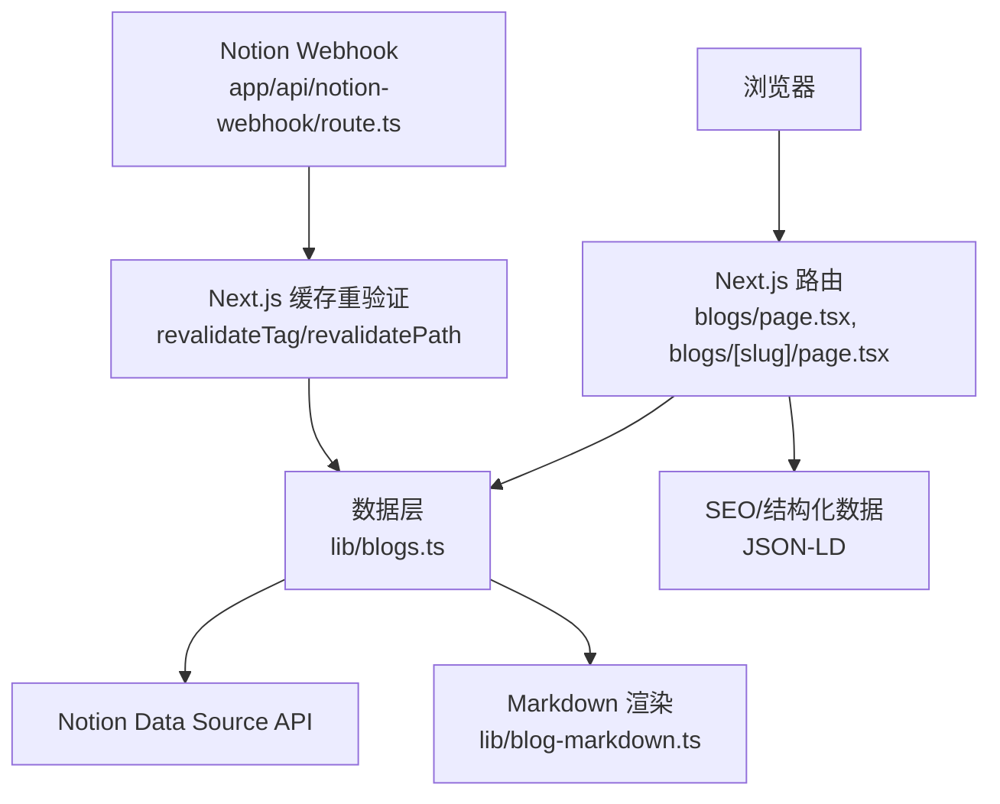
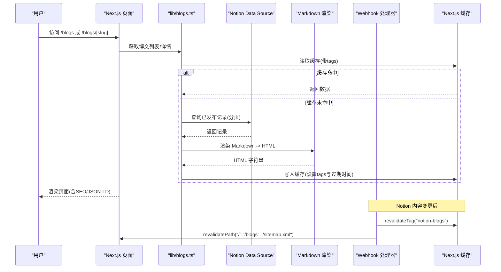
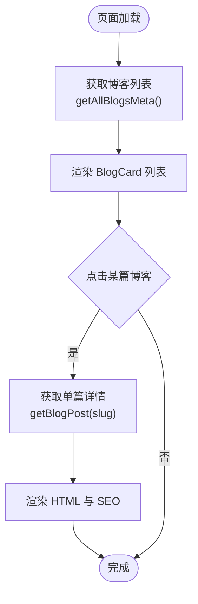
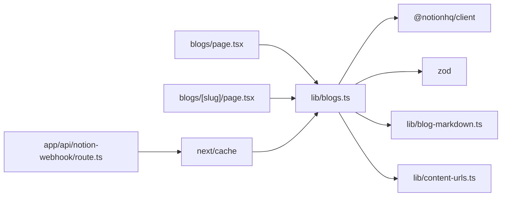

# 博客内容管理

<cite>
**本文引用的文件**
- [lib/blogs.ts](file://lib/blogs.ts)
- [app/(root)/blogs/[slug]/page.tsx](file://app/(root)/blogs/[slug]/page.tsx)
- [app/(root)/blogs/page.tsx](file://app/(root)/blogs/page.tsx)
- [components/blogs/blog-card.tsx](file://components/blogs/blog-card.tsx)
- [config/site.ts](file://config/site.ts)
- [config/pages.ts](file://config/pages.ts)
- [lib/content-urls.ts](file://lib/content-urls.ts)
- [lib/urls.ts](file://lib/urls.ts)
- [lib/utils.ts](file://lib/utils.ts)
- [lib/blog-markdown.ts](file://lib/blog-markdown.ts)
- [app/api/notion-webhook/route.ts](file://app/api/notion-webhook/route.ts)
</cite>

## 目录
1. [简介](#简介)
2. [项目结构](#项目结构)
3. [核心组件](#核心组件)
4. [架构总览](#架构总览)
5. [详细组件分析](#详细组件分析)
6. [依赖关系分析](#依赖关系分析)
7. [性能与缓存策略](#性能与缓存策略)
8. [故障排查指南](#故障排查指南)
9. [结论](#结论)
10. [附录：配置与环境变量](#附录配置与环境变量)

## 简介
本系统基于 Next.js 构建，使用 Notion Data Source 作为博客内容源，通过服务端渲染与缓存机制实现高性能、可维护的博客展示。文档重点覆盖以下方面：
- Notion 集成架构与数据源配置
- 内容同步机制（增量更新、Webhook）
- 缓存策略（Next.js 缓存标签与路径重验证）
- BlogPost 接口设计、Zod 数据校验、Slug 生成规则与状态管理
- Notion API 调用流程、错误处理与重试机制
- SEO 元数据与结构化数据（JSON-LD）
- 版本控制思路、草稿发布流程与阅读时长估算

## 项目结构
- 页面层
  - 博客列表页：app/(root)/blogs/page.tsx
  - 博客详情页：app/(root)/blogs/[slug]/page.tsx
- 数据层
  - Notion 数据获取与转换：lib/blogs.ts
  - Markdown 渲染与安全过滤：lib/blog-markdown.ts
  - URL 稳定性校验：lib/content-urls.ts
  - 站点配置：config/site.ts、config/pages.ts
- 组件层
  - 博客卡片：components/blogs/blog-card.tsx
- Webhook
  - Notion 变更回调：app/api/notion-webhook/route.ts

图表来源
- [app/(root)/blogs/page.tsx:12-40](file://app/(root)/blogs/page.tsx#L12-L40)
- [app/(root)/blogs/[slug]/page.tsx:21-84](file://app/(root)/blogs/[slug]/page.tsx#L21-L84)
- [lib/blogs.ts:337-420](file://lib/blogs.ts#L337-L420)
- [lib/blog-markdown.ts:509-531](file://lib/blog-markdown.ts#L509-L531)
- [app/api/notion-webhook/route.ts:13-74](file://app/api/notion-webhook/route.ts#L13-L74)

章节来源
- [app/(root)/blogs/page.tsx:1-152](file://app/(root)/blogs/page.tsx#L1-L152)
- [app/(root)/blogs/[slug]/page.tsx:1-322](file://app/(root)/blogs/[slug]/page.tsx#L1-L322)
- [lib/blogs.ts:1-550](file://lib/blogs.ts#L1-L550)

## 核心组件
- 数据访问与类型定义
  - 导出接口：BlogFrontmatter、BlogMeta、BlogPost
  - 内部记录：NotionBlogRecord（含 notionPageId）
  - 字段映射：Title、Slug、Status、PublishedAt、Description、Tags、CoverImage、ReadingTime、Featured
- 数据源配置与客户端
  - 环境变量：NOTION_TOKEN、NOTION_DATA_SOURCE_ID、NOTION_BLOG_REVALIDATE_SECONDS
  - Notion Client：设置认证、API 版本、超时与重试次数
- 数据校验与清洗
  - Zod Schema：严格校验 slug、日期、描述长度、标签数量、封面图 URL 等
  - URL 稳定性：仅允许站点相对路径或 HTTPS 链接，拒绝临时签名链接
- 内容渲染
  - Markdown 转 HTML：支持 GFM、安全过滤、稳定媒体资源替换
  - 阅读时长估算：按拉丁词数与中日韩字符数加权计算
- 页面渲染与 SEO
  - 列表页：集合型 JSON-LD、面包屑、OG/Twitter 元信息
  - 详情页：文章型 JSON-LD、作者/发布时间/修改时间、关键词、图片尺寸

章节来源
- [lib/blogs.ts:35-56](file://lib/blogs.ts#L35-L56)
- [lib/blogs.ts:66-87](file://lib/blogs.ts#L66-L87)
- [lib/blogs.ts:92-132](file://lib/blogs.ts#L92-L132)
- [lib/blogs.ts:255-285](file://lib/blogs.ts#L255-L285)
- [lib/blogs.ts:422-467](file://lib/blogs.ts#L422-L467)
- [lib/blogs.ts:538-549](file://lib/blogs.ts#L538-L549)
- [lib/content-urls.ts:1-43](file://lib/content-urls.ts#L1-L43)
- [lib/blog-markdown.ts:509-531](file://lib/blog-markdown.ts#L509-L531)
- [app/(root)/blogs/page.tsx:12-40](file://app/(root)/blogs/page.tsx#L12-L40)
- [app/(root)/blogs/[slug]/page.tsx:26-84](file://app/(root)/blogs/[slug]/page.tsx#L26-L84)

## 架构总览
系统采用“服务端数据获取 + 缓存 + Webhook 增量刷新”的架构：
- 首次请求时从 Notion Data Source 拉取已发布的博文列表与详情，并进行 Zod 校验与 Markdown 渲染
- 使用 Next.js unstable_cache 对查询结果进行缓存，并通过 tags 与 revalidateSeconds 控制失效周期
- 当 Notion 内容变更时，Webhook 触发 revalidateTag 与 revalidatePath，立即刷新相关页面与站点地图
- 所有对外暴露的 URL（如封面图）必须为稳定地址，避免临时签名链接导致后续访问失败

图表来源
- [lib/blogs.ts:337-420](file://lib/blogs.ts#L337-L420)
- [lib/blogs.ts:469-476](file://lib/blogs.ts#L469-L476)
- [lib/blog-markdown.ts:509-531](file://lib/blog-markdown.ts#L509-L531)
- [app/api/notion-webhook/route.ts:59-74](file://app/api/notion-webhook/route.ts#L59-L74)

## 详细组件分析

### Notion 集成与数据源配置
- 数据源属性要求
  - Title: title
  - Slug: rich_text
  - Status: select 或 status（必须包含 Published 选项）
  - PublishedAt: date
  - Description: rich_text
  - Tags: multi_select
  - CoverImage: rich_text 或 url
  - ReadingTime: number
  - Featured: checkbox
- 配置校验
  - 同时需要 NOTION_TOKEN 与 NOTION_DATA_SOURCE_ID，否则抛出配置不完整错误
  - 若两者均未设置，则禁用 Notion 博客并返回空列表
- 客户端初始化
  - 设置认证、API 版本、超时与重试次数（maxRetries=3）

章节来源
- [lib/blogs.ts:92-132](file://lib/blogs.ts#L92-L132)
- [lib/blogs.ts:287-335](file://lib/blogs.ts#L287-L335)

### 内容同步机制与增量更新
- 增量更新
  - 通过 Notion Webhook 接收变更事件，校验签名后执行 revalidateTag("notion-blogs") 与 revalidatePath(["/", "/blogs", "/sitemap.xml"])
  - 确保列表页、首页与站点地图即时刷新
- 增量策略
  - 查询时使用排序 PublishedAt 降序，便于前端展示最新内容
  - 分页拉取，游标驱动，避免遗漏
- 草稿与发布
  - 仅拉取 Status = Published 的记录；非 Published 视为草稿，不进入公开列表
  - 在 Notion 中切换 Status 到 Published 即可发布

章节来源
- [app/api/notion-webhook/route.ts:13-74](file://app/api/notion-webhook/route.ts#L13-L74)
- [lib/blogs.ts:337-402](file://lib/blogs.ts#L337-L402)

### 数据模型与 Zod 校验
- 数据模型
  - BlogFrontmatter：标题、日期、描述、标签、封面图、阅读时长、是否推荐
  - BlogMeta：扩展 slug 与更新时间
  - BlogPost：进一步扩展 contentHtml
- Zod 校验要点
  - slug：小写字母数字与连字符组成的模式，最大长度限制
  - 日期：PublishedAt 与 last_edited_time 必须可解析为有效日期
  - 描述：长度限制
  - 标签：数组元素长度与数量上限
  - 封面图：必须是稳定 URL（站点相对或 HTTPS），拒绝临时签名链接
  - 阅读时长：正整数上限
  - 推荐标记：布尔可选

章节来源
- [lib/blogs.ts:35-56](file://lib/blogs.ts#L35-L56)
- [lib/blogs.ts:66-87](file://lib/blogs.ts#L66-L87)
- [lib/content-urls.ts:1-43](file://lib/content-urls.ts#L1-L43)

### Slug 生成规则与状态管理
- Slug 规则
  - 正则匹配：仅允许小写字母、数字与连字符，且不能以连字符开头或结尾
  - 长度限制：最大 96 字符
  - 唯一性：在拉取列表中检测重复 slug，发现重复即抛错
- 状态管理
  - Status 字段支持 select 或 status 两种类型，但必须包含 Published 选项
  - 仅 Published 状态的记录会被拉取并展示

章节来源
- [lib/blogs.ts:33](file://lib/blogs.ts#L33)
- [lib/blogs.ts:391-401](file://lib/blogs.ts#L391-L401)
- [lib/blogs.ts:287-335](file://lib/blogs.ts#L287-L335)

### 内容渲染与阅读时长估算
- Markdown 渲染
  - 使用 remark 生态链：GFM、Notion 适配、HTML 注入、稳定媒体替换、安全过滤、字符串化
  - 限制 Markdown 字节大小，防止过大内容影响性能
- 阅读时长估算
  - 去除代码块与 HTML 标签、Markdown 语法符号
  - 拉丁词按 200 词/分钟估算，CJK 字符按 400 字/分钟估算
  - 最小值为 1 分钟

章节来源
- [lib/blog-markdown.ts:509-531](file://lib/blog-markdown.ts#L509-L531)
- [lib/blogs.ts:538-549](file://lib/blogs.ts#L538-L549)

### 页面渲染与 SEO 元数据
- 列表页
  - 提供 CollectionPage 与 Blog 的 JSON-LD，列出每篇文章的摘要、发布日期、URL、标签与封面图
  - 面包屑导航与 OG/Twitter 元信息
- 详情页
  - 提供 BlogPosting 与 BreadcrumbList 的 JSON-LD
  - 设置 canonical、Open Graph、Twitter Card、robots 指令
  - 显示作者、发布时间、修改时间、标签、封面图与阅读时长

章节来源
- [app/(root)/blogs/page.tsx:12-119](file://app/(root)/blogs/page.tsx#L12-L119)
- [app/(root)/blogs/[slug]/page.tsx:26-174](file://app/(root)/blogs/[slug]/page.tsx#L26-L174)

### 组件交互与数据流
- 列表页调用 getAllBlogsMeta 获取元数据，渲染 BlogCard
- 详情页调用 getBlogPost 获取完整内容，渲染 HTML 与 SEO 信息
- BlogCard 负责展示封面图、标签、标题、描述、日期与阅读时长

图表来源
- [app/(root)/blogs/page.tsx:42-147](file://app/(root)/blogs/page.tsx#L42-L147)
- [app/(root)/blogs/[slug]/page.tsx:86-174](file://app/(root)/blogs/[slug]/page.tsx#L86-L174)
- [components/blogs/blog-card.tsx:13-97](file://components/blogs/blog-card.tsx#L13-L97)

## 依赖关系分析
- 模块耦合
  - 页面层依赖 lib/blogs.ts 的数据接口
  - lib/blogs.ts 依赖 Notion SDK、Zod、Markdown 渲染与 URL 校验工具
  - Webhook 处理器依赖缓存重验证与 BLOG_CACHE_TAG
- 外部依赖
  - @notionhq/client：Data Source 查询、Webhook 签名校验
  - next/cache：unstable_cache、revalidateTag、revalidatePath
  - remark/rehype 生态：Markdown 处理与安全过滤
  - zod：运行时数据校验

图表来源
- [lib/blogs.ts:1-16](file://lib/blogs.ts#L1-L16)
- [app/api/notion-webhook/route.ts:1-7](file://app/api/notion-webhook/route.ts#L1-L7)
- [lib/blog-markdown.ts:1-17](file://lib/blog-markdown.ts#L1-L17)

章节来源
- [lib/blogs.ts:1-16](file://lib/blogs.ts#L1-L16)
- [app/api/notion-webhook/route.ts:1-7](file://app/api/notion-webhook/route.ts#L1-L7)

## 性能与缓存策略
- 缓存策略
  - 使用 unstable_cache 缓存 Notion 查询结果，key 包含 dataSourceId，避免多数据源冲突
  - 通过 tags 统一失效：BLOG_CACHE_TAG="notion-blogs"
  - 默认重新验证间隔为 900 秒，可通过 NOTION_BLOG_REVALIDATE_SECONDS 调整
- 网络与重试
  - Notion Client 设置超时 15 秒，重试次数 3 次，提升鲁棒性
- 内容体积控制
  - Markdown 字节上限限制，防止超大内容影响渲染性能
  - 封面图必须为稳定 URL，避免临时签名链接导致的后续访问失败
- 增量刷新
  - Webhook 触发后立即重验证相关路径与标签，减少用户感知延迟

章节来源
- [lib/blogs.ts:92-97](file://lib/blogs.ts#L92-L97)
- [lib/blogs.ts:123-132](file://lib/blogs.ts#L123-L132)
- [lib/blogs.ts:404-420](file://lib/blogs.ts#L404-L420)
- [lib/blogs.ts:469-476](file://lib/blogs.ts#L469-L476)
- [lib/blog-markdown.ts:509-515](file://lib/blog-markdown.ts#L509-L515)
- [app/api/notion-webhook/route.ts:59-74](file://app/api/notion-webhook/route.ts#L59-L74)

## 故障排查指南
- 配置缺失或不完整
  - 现象：控制台警告或抛出配置不完整错误
  - 处理：确保同时设置 NOTION_TOKEN 与 NOTION_DATA_SOURCE_ID
- 数据源属性类型不匹配
  - 现象：抛出属性类型无效错误
  - 处理：检查 Notion Data Source 的属性类型是否符合预期（如 Status 必须为 select 或 status，且包含 Published）
- 非 Published 记录被拉取
  - 现象：抛出非发布页面错误
  - 处理：确认 Notion 页面 Status 设置为 Published
- 重复 Slug
  - 现象：抛出重复 slug 错误
  - 处理：修正 Notion 中的 Slug，确保唯一性
- 临时签名链接
  - 现象：封面图不可用或被忽略
  - 处理：使用站点相对路径或 HTTPS 稳定链接
- Webhook 未生效
  - 现象：内容变更后页面未刷新
  - 处理：检查 NOTION_WEBHOOK_VERIFICATION_TOKEN 是否配置，确认签名校验通过并执行了 revalidateTag/revalidatePath

章节来源
- [lib/blogs.ts:99-121](file://lib/blogs.ts#L99-L121)
- [lib/blogs.ts:287-335](file://lib/blogs.ts#L287-L335)
- [lib/blogs.ts:391-401](file://lib/blogs.ts#L391-L401)
- [lib/content-urls.ts:20-43](file://lib/content-urls.ts#L20-L43)
- [app/api/notion-webhook/route.ts:23-74](file://app/api/notion-webhook/route.ts#L23-L74)

## 结论
该系统通过严谨的数据校验、稳定的 URL 策略、完善的缓存与增量刷新机制，实现了高效可靠的博客内容管理。Notion 作为内容源，配合 Next.js 的服务端渲染与缓存能力，提供了良好的性能与可维护性。SEO 元数据与结构化数据的完善，有助于提升搜索引擎可见性与社交分享体验。

## 附录：配置与环境变量
- 必需环境变量
  - NOTION_TOKEN：Notion 集成令牌
  - NOTION_DATA_SOURCE_ID：Notion Data Source 标识
  - NOTION_BLOG_REVALIDATE_SECONDS：缓存重新验证间隔（秒），默认 900
  - NOTION_WEBHOOK_VERIFICATION_TOKEN：Webhook 验证令牌（用于签名校验）
- 配置建议
  - 将 NOTION_TOKEN 与 NOTION_DATA_SOURCE_ID 成对设置，避免部分配置导致异常
  - 合理设置 NOTION_BLOG_REVALIDATE_SECONDS，平衡实时性与性能
  - 启用 Webhook 并配置验证令牌，确保内容变更后及时刷新

章节来源
- [lib/blogs.ts:92-132](file://lib/blogs.ts#L92-L132)
- [app/api/notion-webhook/route.ts:23-74](file://app/api/notion-webhook/route.ts#L23-L74)