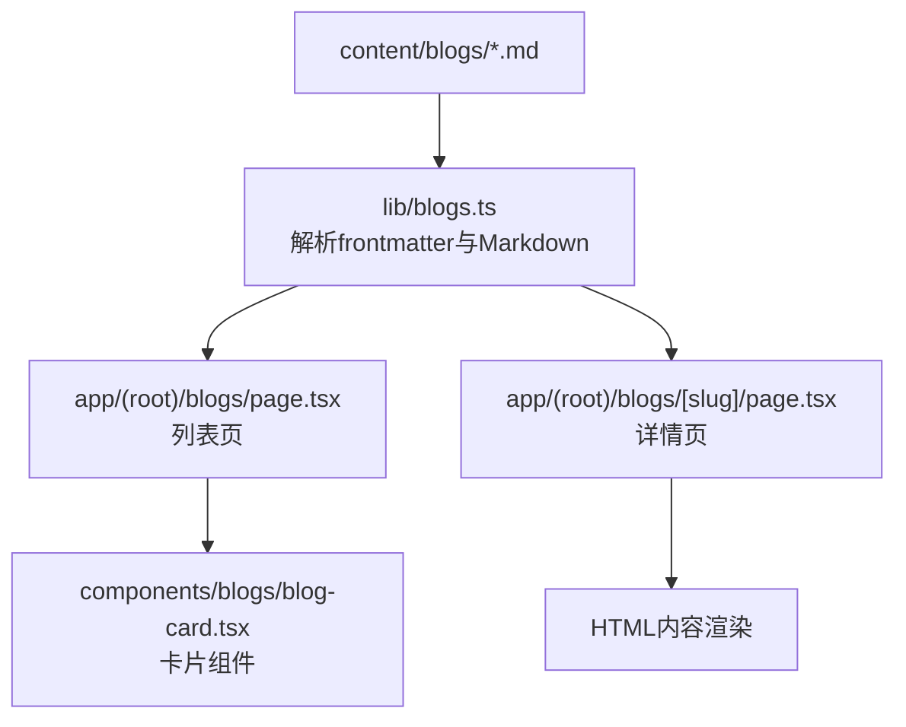
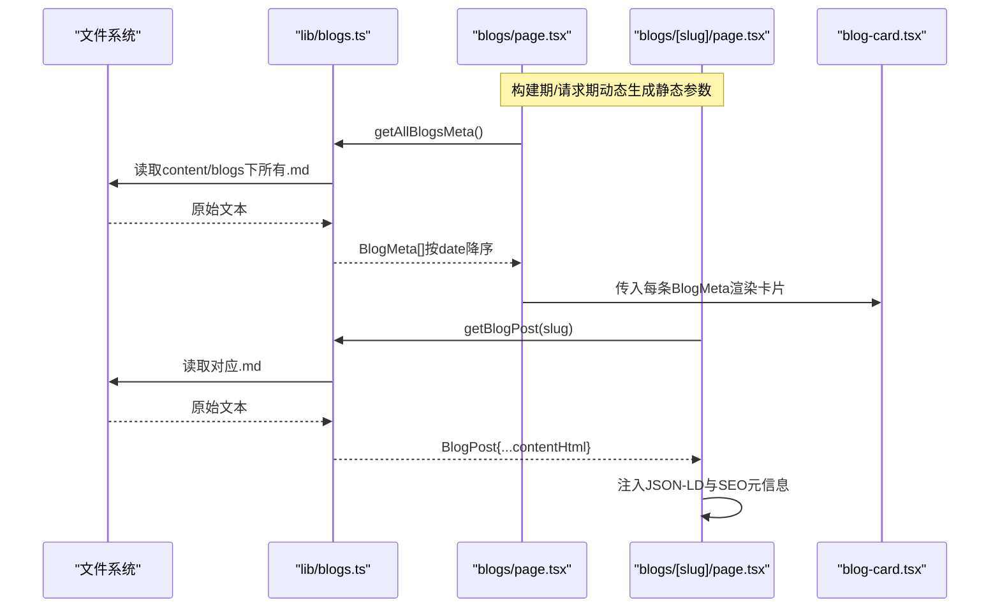
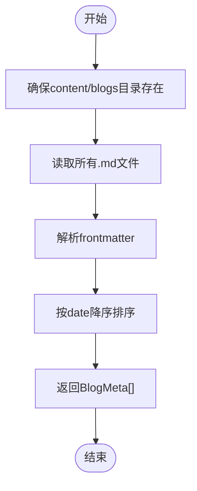
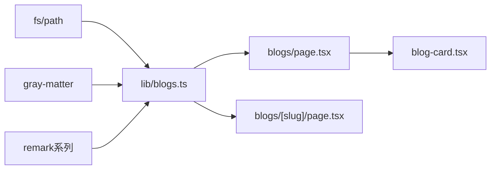
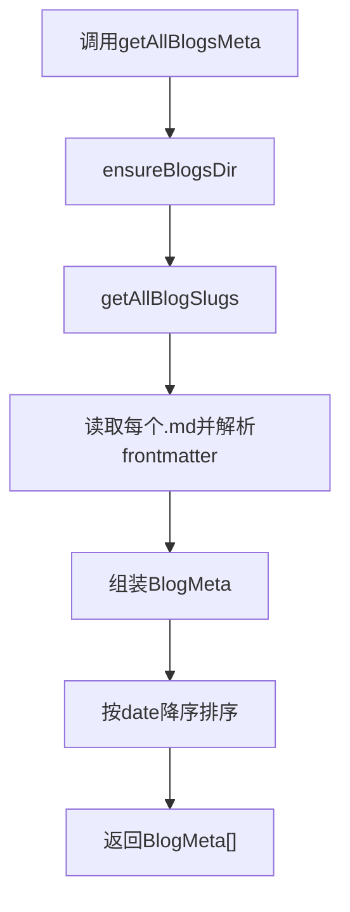
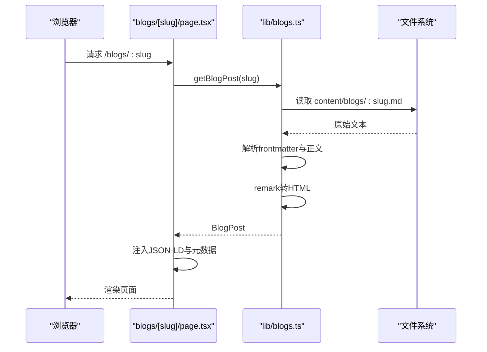

# 博客内容管理

<cite>
**本文引用的文件**
- [lib/blogs.ts](file://lib/blogs.ts)
- [app/(root)/blogs/page.tsx](file://app/(root)/blogs/page.tsx)
- [app/(root)/blogs/[slug]/page.tsx](file://app/(root)/blogs/[slug]/page.tsx)
- [components/blogs/blog-card.tsx](file://components/blogs/blog-card.tsx)
- [content/blogs/3d-card-threejs-blender.md](file://content/blogs/3d-card-threejs-blender.md)
- [content/blogs/aeo-vs-seo-chatgpt-ranking.md](file://content/blogs/aeo-vs-seo-chatgpt-ranking.md)
- [content/blogs/building-production-ai-chatbot-convot.md](file://content/blogs/building-production-ai-chatbot-convot.md)
- [content/blogs/how-i-got-150-stars-nextjs-portfolio-template.md](file://content/blogs/how-i-got-150-stars-nextjs-portfolio-template.md)
</cite>

## 目录
1. [简介](#简介)
2. [项目结构](#项目结构)
3. [核心组件](#核心组件)
4. [架构总览](#架构总览)
5. [详细组件分析](#详细组件分析)
6. [依赖关系分析](#依赖关系分析)
7. [性能考量](#性能考量)
8. [故障排查指南](#故障排查指南)
9. [结论](#结论)
10. [附录：最佳实践与示例](#附录：最佳实践与示例)

## 简介
本仓库实现了一个基于 Markdown 的博客内容管理系统。所有博客文章以 Markdown 文件形式存放在 content/blogs 目录下，通过灰度元数据（gray-matter）解析 frontmatter，并使用 remark 将 Markdown 渲染为 HTML。系统提供：
- 列出所有博客的 slug
- 获取所有博客的元数据并排序
- 根据 slug 获取完整博文（含 HTML 内容）
- 筛选“精选”博文
- 估算阅读时间

该方案适合初学者快速上手，同时为高级开发者提供了可扩展的数据模型和清晰的扩展点。

## 项目结构
- 内容层：content/blogs/*.md 存放博客文章，文件名即为文章的 slug。
- 逻辑层：lib/blogs.ts 负责读取、解析、转换与导出接口。
- 展示层：
  - app/(root)/blogs/page.tsx 渲染博客列表页，调用 getAllBlogsMeta()。
  - app/(root)/blogs/[slug]/page.tsx 渲染单篇博文，调用 getBlogPost(slug)。
  - components/blogs/blog-card.tsx 用于列表项卡片展示。

图表来源
- [lib/blogs.ts:9-97](file://lib/blogs.ts#L9-L97)
- [app/(root)/blogs/page.tsx:41-148](file://app/(root)/blogs/page.tsx#L41-L148)
- [app/(root)/blogs/[slug]/page.tsx:20-89](file://app/(root)/blogs/[slug]/page.tsx#L20-L89)
- [components/blogs/blog-card.tsx:11-95](file://components/blogs/blog-card.tsx#L11-L95)

章节来源
- [lib/blogs.ts:9-97](file://lib/blogs.ts#L9-L97)
- [app/(root)/blogs/page.tsx:41-148](file://app/(root)/blogs/page.tsx#L41-L148)
- [app/(root)/blogs/[slug]/page.tsx:20-89](file://app/(root)/blogs/[slug]/page.tsx#L20-L89)
- [components/blogs/blog-card.tsx:11-95](file://components/blogs/blog-card.tsx#L11-L95)

## 核心组件
- BlogFrontmatter：定义每篇文章的元数据结构，包含标题、日期、描述、标签、封面图、可选的阅读时间与是否精选等字段。
- BlogMeta：在 Frontmatter 基础上增加 slug。
- BlogPost：在 Meta 基础上增加 contentHtml，即渲染后的 HTML 内容。
- 工具函数：
  - getAllBlogSlugs：扫描 content/blogs 目录，返回所有 .md 文件的 slug。
  - getAllBlogsMeta：读取每个 .md 的 frontmatter，组装为 BlogMeta 并按 date 降序排序。
  - getBlogPost：读取指定 slug 的文章，解析 frontmatter 与正文，使用 remark + GFM 转换为 HTML。
  - getFeaturedBlogs：优先返回 featured=true 的文章，最多 3 条；若无则返回最新 3 条。
  - estimateReadingTime：按词数估算阅读时间（默认每分钟 200 词）。

章节来源
- [lib/blogs.ts:11-27](file://lib/blogs.ts#L11-L27)
- [lib/blogs.ts:35-97](file://lib/blogs.ts#L35-L97)

## 架构总览
下图展示了从文件系统到页面渲染的端到端流程：

图表来源
- [lib/blogs.ts:35-97](file://lib/blogs.ts#L35-L97)
- [app/(root)/blogs/page.tsx:41-148](file://app/(root)/blogs/page.tsx#L41-L148)
- [app/(root)/blogs/[slug]/page.tsx:20-89](file://app/(root)/blogs/[slug]/page.tsx#L20-L89)
- [components/blogs/blog-card.tsx:11-95](file://components/blogs/blog-card.tsx#L11-L95)

## 详细组件分析

### 博客文件组织结构与命名规范
- 位置：content/blogs
- 命名：每个 .md 文件名为一个 slug（不含 .md），例如 3d-card-threejs-blender.md 对应的 slug 为 3d-card-threejs-blender。
- 文件头：使用 YAML 风格的 frontmatter 包裹在 --- 之间，定义元数据。
- 正文：标准 Markdown，支持 GFM（表格、代码块等）。

章节来源
- [lib/blogs.ts:35-42](file://lib/blogs.ts#L35-L42)
- [content/blogs/3d-card-threejs-blender.md:1-9](file://content/blogs/3d-card-threejs-blender.md#L1-L9)
- [content/blogs/aeo-vs-seo-chatgpt-ranking.md:1-8](file://content/blogs/aeo-vs-seo-chatgpt-ranking.md#L1-L8)
- [content/blogs/building-production-ai-chatbot-convot.md:1-8](file://content/blogs/building-production-ai-chatbot-convot.md#L1-L8)
- [content/blogs/how-i-got-150-stars-nextjs-portfolio-template.md:1-9](file://content/blogs/how-i-got-150-stars-nextjs-portfolio-template.md#L1-L9)

### BlogFrontmatter 字段说明与验证规则
- title: 字符串，必填。用于页面标题、OG 标题、结构化数据 headline。
- date: 字符串，必填。ISO 日期格式（YYYY-MM-DD），用于排序与 SEO 发布时间。
- description: 字符串，必填。用于摘要、OG 描述、Twitter 描述。
- tags: 字符串数组，必填。用于关键词、页面标签展示。
- coverImage: 字符串，可选。封面图片路径，建议放在 public 目录下并通过绝对路径引用。
- readingTime: 数字，可选。若未设置，可使用 estimateReadingTime 自动估算。
- featured: 布尔值，可选。用于精选文章筛选。

注意：当前实现未对字段进行运行时校验，建议在业务层或构建时加入校验（如 zod）以确保类型安全。

章节来源
- [lib/blogs.ts:11-19](file://lib/blogs.ts#L11-L19)
- [lib/blogs.ts:45-62](file://lib/blogs.ts#L45-L62)
- [lib/blogs.ts:65-82](file://lib/blogs.ts#L65-L82)
- [lib/blogs.ts:85-97](file://lib/blogs.ts#L85-L97)

### 创建新博客文章步骤
1. 在 content/blogs 目录下新建 .md 文件，文件名即 slug。
2. 在文件顶部编写 frontmatter，至少包含 title、date、description、tags。
3. 如需封面图，添加 coverImage，并确保路径可访问（通常位于 public 下）。
4. 如需标记精选，添加 featured: true。
5. 如需自定义阅读时间，添加 readingTime；否则可由系统估算。
6. 编写正文内容，遵循 Markdown/GFM 语法。
7. 启动开发服务器后，可在 /blogs 列表页看到新文章，点击可进入详情页。

章节来源
- [lib/blogs.ts:35-42](file://lib/blogs.ts#L35-L42)
- [lib/blogs.ts:45-62](file://lib/blogs.ts#L45-L62)
- [app/(root)/blogs/page.tsx:41-148](file://app/(root)/blogs/page.tsx#L41-L148)
- [app/(root)/blogs/[slug]/page.tsx:20-89](file://app/(root)/blogs/[slug]/page.tsx#L20-L89)

### 博客文件读取机制
- getAllBlogSlugs：确保 content/blogs 目录存在，读取所有 .md 文件，去除后缀得到 slug 列表。
- getAllBlogsMeta：遍历 slug，读取对应 .md 文件，解析 frontmatter，组合成 BlogMeta，并按 date 降序排序。
- getBlogPost：读取指定 slug 的 .md，解析 frontmatter 与正文，使用 remark + remark-gfm + remark-html 将 Markdown 转为 HTML，返回 BlogPost。
- getFeaturedBlogs：从全部元数据中筛选 featured=true 的文章，最多取 3 条；若无精选，则返回最新 3 条。
- estimateReadingTime：按空格分词统计词数，除以 200 向上取整得到分钟数。

图表来源
- [lib/blogs.ts:29-62](file://lib/blogs.ts#L29-L62)

章节来源
- [lib/blogs.ts:29-97](file://lib/blogs.ts#L29-L97)

### 页面集成与渲染
- 列表页：调用 getAllBlogsMeta() 获取元数据，循环渲染 BlogCard，并为列表页注入 CollectionPage 与 BreadcrumbList 的 JSON-LD。
- 详情页：调用 getBlogPost(slug) 获取完整博文，注入 BlogPosting 与 BreadcrumbList 的 JSON-LD，并渲染封面图、标签、作者、日期、阅读时间与正文 HTML。
- 卡片组件：展示封面图、标签（最多 3 个）、标题、描述、日期与阅读时间。

章节来源
- [app/(root)/blogs/page.tsx:11-148](file://app/(root)/blogs/page.tsx#L11-L148)
- [app/(root)/blogs/[slug]/page.tsx:25-177](file://app/(root)/blogs/[slug]/page.tsx#L25-L177)
- [components/blogs/blog-card.tsx:11-95](file://components/blogs/blog-card.tsx#L11-L95)

## 依赖关系分析
- lib/blogs.ts 是核心模块，依赖：
  - fs/path：文件系统操作
  - gray-matter：解析 frontmatter
  - remark/remark-gfm/remark-html：Markdown 转 HTML
- 页面模块依赖 lib/blogs.ts 提供的接口，并在构建期/请求期生成静态参数与元数据。
- 组件模块仅消费 lib/blogs.ts 导出的类型与数据。

图表来源
- [lib/blogs.ts:1-8](file://lib/blogs.ts#L1-L8)
- [app/(root)/blogs/page.tsx:41-148](file://app/(root)/blogs/page.tsx#L41-L148)
- [app/(root)/blogs/[slug]/page.tsx:20-89](file://app/(root)/blogs/[slug]/page.tsx#L20-L89)
- [components/blogs/blog-card.tsx:11-95](file://components/blogs/blog-card.tsx#L11-L95)

章节来源
- [lib/blogs.ts:1-97](file://lib/blogs.ts#L1-L97)
- [app/(root)/blogs/page.tsx:41-148](file://app/(root)/blogs/page.tsx#L41-L148)
- [app/(root)/blogs/[slug]/page.tsx:20-89](file://app/(root)/blogs/[slug]/page.tsx#L20-L89)
- [components/blogs/blog-card.tsx:11-95](file://components/blogs/blog-card.tsx#L11-L95)

## 性能考量
- 构建期静态生成：generateStaticParams 会枚举所有 slug，适合文章数量适中的场景。
- 文件 I/O：getAllBlogSlugs/getAllBlogsMeta/getBlogPost 均涉及同步文件读取，建议在 Next.js 服务端组件中使用，避免客户端阻塞。
- Markdown 渲染：remark 链式处理，GFM 与 HTML 输出开销较小，但大量文章时应考虑缓存策略。
- 图片优化：封面图建议使用 next/image，并配置合适的宽高与优先级。
- 阅读时间：可通过 readingTime 手动设置以减少计算；或保留 estimateReadingTime 按需估算。

[本节为通用指导，不直接分析具体文件]

## 故障排查指南
- 找不到文章：getBlogPost 抛出异常时，详情页会调用 notFound()，请检查 slug 是否正确以及文件是否存在。
- 列表为空：确保 content/blogs 目录存在且包含 .md 文件；getAllBlogSlugs 会过滤非 .md 文件。
- 排序异常：确保 date 字段为有效 ISO 日期字符串，否则 Date 解析可能失败。
- 封面图不显示：确认 coverImage 路径指向 public 下的资源，并以绝对路径引用。
- 阅读时间不准确：若未设置 readingTime，estimateReadingTime 基于空格分词统计，复杂排版可能导致偏差，建议手动设置。

章节来源
- [lib/blogs.ts:35-97](file://lib/blogs.ts#L35-L97)
- [app/(root)/blogs/[slug]/page.tsx:81-89](file://app/(root)/blogs/[slug]/page.tsx#L81-L89)

## 结论
本项目以极简的文件驱动方式实现了完整的 Markdown 博客系统。通过清晰的数据模型与工具函数，既降低了新手的使用门槛，也为高级用户提供了良好的扩展点。结合 Next.js 的静态生成与 SEO 能力，能够快速搭建高性能、易维护的个人博客。

[本节为总结性内容，不直接分析具体文件]

## 附录：最佳实践与示例

### 文件命名约定
- 使用小写英文与连字符，避免特殊字符与空格。
- 文件名即 slug，需唯一且语义化。

章节来源
- [lib/blogs.ts:35-42](file://lib/blogs.ts#L35-L42)

### 元数据编写规范
- 标题：简洁明确，避免过长。
- 日期：使用 ISO 格式（YYYY-MM-DD）。
- 描述：精炼概括文章内容，利于 SEO 与社交分享。
- 标签：分类清晰，控制数量，便于检索与聚合。
- 封面图：放置于 public 目录，使用绝对路径。
- 阅读时间：长文建议手动设置，提高准确性。
- 精选：用于首页或列表置顶展示。

章节来源
- [lib/blogs.ts:11-19](file://lib/blogs.ts#L11-L19)
- [content/blogs/3d-card-threejs-blender.md:1-9](file://content/blogs/3d-card-threejs-blender.md#L1-L9)
- [content/blogs/aeo-vs-seo-chatgpt-ranking.md:1-8](file://content/blogs/aeo-vs-seo-chatgpt-ranking.md#L1-L8)
- [content/blogs/building-production-ai-chatbot-convot.md:1-8](file://content/blogs/building-production-ai-chatbot-convot.md#L1-L8)
- [content/blogs/how-i-got-150-stars-nextjs-portfolio-template.md:1-9](file://content/blogs/how-i-got-150-stars-nextjs-portfolio-template.md#L1-L9)

### 内容格式规范
- 使用标准 Markdown，必要时启用 GFM（表格、代码块、任务列表等）。
- 合理使用标题层级，保证文档结构清晰。
- 图片与链接使用相对或绝对路径，确保可访问性。

章节来源
- [lib/blogs.ts:70-75](file://lib/blogs.ts#L70-L75)

### 图片资源管理
- 将图片放入 public 目录，通过绝对路径引用（如 /projects/xxx.png）。
- 在详情页与列表卡中统一使用 next/image 进行优化。

章节来源
- [app/(root)/blogs/[slug]/page.tsx:267-281](file://app/(root)/blogs/[slug]/page.tsx#L267-L281)
- [components/blogs/blog-card.tsx:26-37](file://components/blogs/blog-card.tsx#L26-L37)

### 代码级流程图：获取并排序博客元数据

图表来源
- [lib/blogs.ts:29-62](file://lib/blogs.ts#L29-L62)

### 代码级序列图：详情页加载流程

图表来源
- [app/(root)/blogs/[slug]/page.tsx:25-89](file://app/(root)/blogs/[slug]/page.tsx#L25-L89)
- [lib/blogs.ts:65-82](file://lib/blogs.ts#L65-L82)