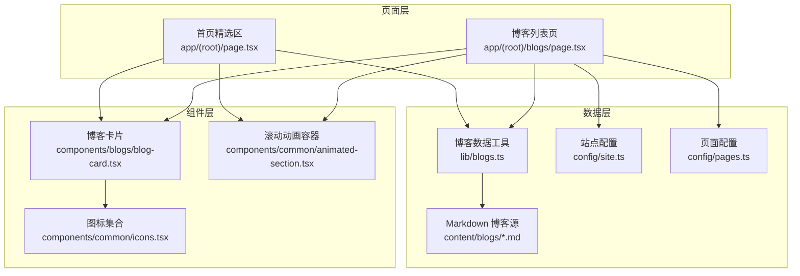
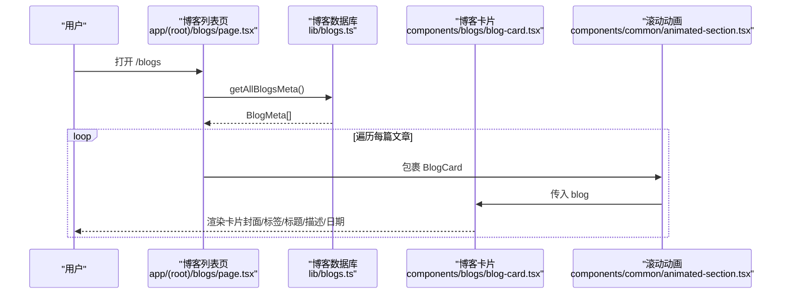
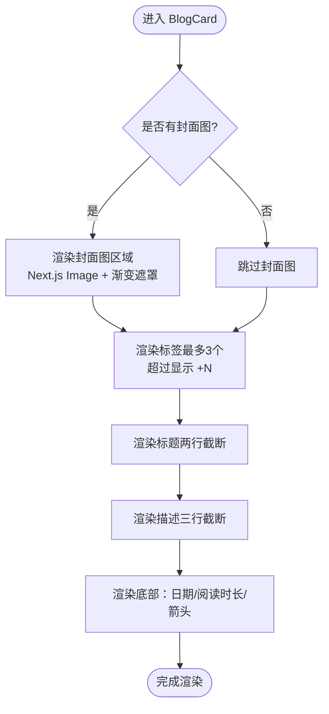
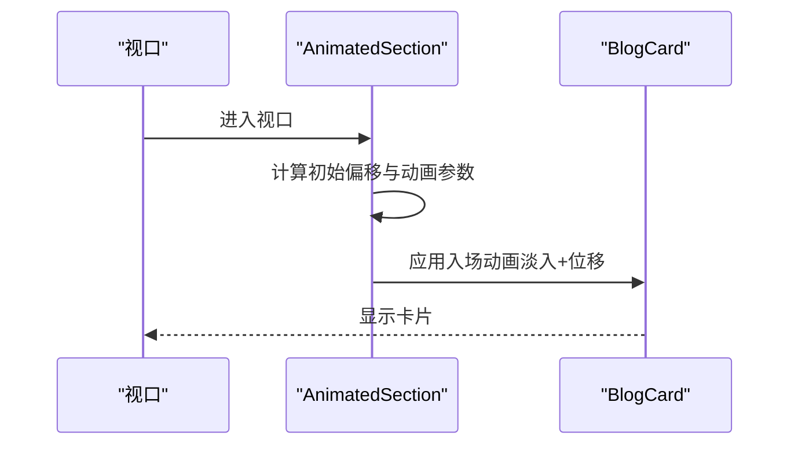
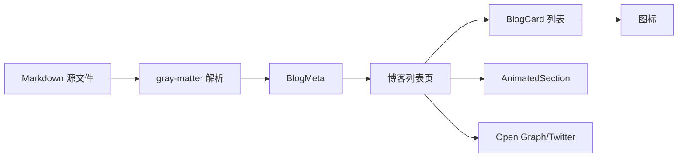

# 博客卡片组件

<cite>
**本文引用的文件**
- [components/blogs/blog-card.tsx](file://components/blogs/blog-card.tsx)
- [lib/blogs.ts](file://lib/blogs.ts)
- [app/(root)/blogs/page.tsx](file://app/(root)/blogs/page.tsx)
- [app/(root)/page.tsx](file://app/(root)/page.tsx)
- [components/common/animated-section.tsx](file://components/common/animated-section.tsx)
- [components/common/icons.tsx](file://components/common/icons.tsx)
- [config/site.ts](file://config/site.ts)
- [config/pages.ts](file://config/pages.ts)
- [content/blogs/3d-card-threejs-blender.md](file://content/blogs/3d-card-threejs-blender.md)
</cite>

## 目录
1. [简介](#简介)
2. [项目结构](#项目结构)
3. [核心组件与数据模型](#核心组件与数据模型)
4. [架构总览](#架构总览)
5. [详细组件分析](#详细组件分析)
6. [依赖关系分析](#依赖关系分析)
7. [性能考虑](#性能考虑)
8. [故障排查指南](#故障排查指南)
9. [结论](#结论)
10. [附录：使用示例与最佳实践](#附录使用示例与最佳实践)

## 简介
本文件围绕博客卡片组件 BlogCard 的设计、实现与使用进行系统化说明。内容涵盖：
- 文章摘要显示、标签展示、发布日期格式化等视觉呈现
- Props 接口定义与字段含义（slug、title、description、tags、date 等）
- 响应式布局在不同屏幕尺寸下的适配策略
- 动画效果集成（Framer Motion 滚动触发动画）
- SEO 优化特性（结构化数据、社交媒体预览图片、可访问性支持）
- 自定义样式方法（Tailwind CSS 类名覆盖与主题变量）
- 完整使用示例（列表展示、网格布局、精选文章展示）
- 性能优化策略（懒加载、图片优化、内存管理）

## 项目结构
BlogCard 位于 components/blogs 下，配合 lib/blogs.ts 提供的博客元数据读取能力，在 app/(root)/blogs/page.tsx 中渲染博客列表，并在首页 app/(root)/page.tsx 中展示精选文章。滚动动画由 components/common/animated-section.tsx 提供。图标来自 components/common/icons.tsx。站点配置与页面文案分别来自 config/site.ts 与 config/pages.ts。博客源数据以 Markdown 形式存放在 content/blogs 目录下。

图表来源
- [components/blogs/blog-card.tsx:1-96](file://components/blogs/blog-card.tsx#L1-L96)
- [lib/blogs.ts:1-97](file://lib/blogs.ts#L1-L97)
- [app/(root)/blogs/page.tsx:1-153](file://app/(root)/blogs/page.tsx#L1-L153)
- [app/(root)/page.tsx:285-324](file://app/(root)/page.tsx#L285-L324)
- [components/common/animated-section.tsx:1-51](file://components/common/animated-section.tsx#L1-L51)
- [components/common/icons.tsx:71-101](file://components/common/icons.tsx#L71-L101)
- [config/site.ts:1-41](file://config/site.ts#L1-L41)
- [config/pages.ts:66-75](file://config/pages.ts#L66-L75)

章节来源
- [components/blogs/blog-card.tsx:1-96](file://components/blogs/blog-card.tsx#L1-L96)
- [lib/blogs.ts:1-97](file://lib/blogs.ts#L1-L97)
- [app/(root)/blogs/page.tsx:1-153](file://app/(root)/blogs/page.tsx#L1-L153)
- [app/(root)/page.tsx:285-324](file://app/(root)/page.tsx#L285-L324)
- [components/common/animated-section.tsx:1-51](file://components/common/animated-section.tsx#L1-L51)
- [components/common/icons.tsx:71-101](file://components/common/icons.tsx#L71-L101)
- [config/site.ts:1-41](file://config/site.ts#L1-L41)
- [config/pages.ts:66-75](file://config/pages.ts#L66-L75)

## 核心组件与数据模型
- 组件：BlogCard 接收一个 blog 对象作为 props，负责渲染封面图、标签、标题、描述、日期与阅读时长等信息，并包裹为可点击链接。
- 数据模型：
  - BlogFrontmatter：包含 title、date、description、tags、coverImage、readingTime、featured
  - BlogMeta：在 Frontmatter 基础上增加 slug
  - BlogPost：在 Meta 基础上增加 contentHtml（用于详情页）
- 数据获取：
  - getAllBlogsMeta：读取 content/blogs 下的所有 .md 文件，解析 frontmatter，按 date 倒序返回
  - getFeaturedBlogs：优先返回 featured=true 的文章，最多 3 篇；否则返回最新 3 篇
  - estimateReadingTime：根据文章内容估算阅读时间（分钟）

章节来源
- [lib/blogs.ts:11-27](file://lib/blogs.ts#L11-L27)
- [lib/blogs.ts:44-62](file://lib/blogs.ts#L44-L62)
- [lib/blogs.ts:84-96](file://lib/blogs.ts#L84-L96)

## 架构总览
博客列表页通过 getAllBlogsMeta 获取全部博客元数据，并以网格布局渲染多个 BlogCard。每个卡片被 AnimatedSection 包裹以实现滚动进入视口时的入场动画。首页的“精选文章”区域通过 getFeaturedBlogs 获取数据，同样使用 BlogCard 展示。SEO 方面，列表页注入 CollectionPage 与 BreadcrumbList 的结构化数据，并使用 Open Graph/Twitter Card 配置社交预览。

图表来源
- [app/(root)/blogs/page.tsx:41-147](file://app/(root)/blogs/page.tsx#L41-L147)
- [lib/blogs.ts:44-62](file://lib/blogs.ts#L44-L62)
- [components/blogs/blog-card.tsx:11-95](file://components/blogs/blog-card.tsx#L11-L95)
- [components/common/animated-section.tsx:14-49](file://components/common/animated-section.tsx#L14-L49)

## 详细组件分析

### BlogCard 组件
- 设计模式
  - 受控展示：仅依赖传入的 blog 数据渲染，无内部状态
  - 组合式 UI：将封面图、标签、标题、描述、底部信息组合为统一卡片
  - 可访问性：使用 article、time、aria-label 等语义化元素提升无障碍体验
- 视觉呈现
  - 封面图：固定高度区域，使用 Next.js Image 的 fill 模式自适应，悬停时轻微缩放
  - 标签：最多显示前 3 个标签，超出部分以 “+N” 提示
  - 标题：两行截断，悬停时高亮
  - 描述：三行截断，自动撑满剩余空间
  - 底部：日期（本地化格式）、可选阅读时长、箭头指示
- 交互
  - 整卡为 Link，指向 /blogs/[slug]
  - 悬停阴影、边框颜色变化、轻微上移
  - 封面图悬停缩放
- 日期格式化
  - 使用 toLocaleDateString("en-US", { month: "long", day: "numeric", year: "numeric" })
  - 同时生成 ISO 字符串写入 time 的 dateTime 属性，利于 SEO 与可访问性

图表来源
- [components/blogs/blog-card.tsx:20-95](file://components/blogs/blog-card.tsx#L20-L95)

章节来源
- [components/blogs/blog-card.tsx:7-95](file://components/blogs/blog-card.tsx#L7-L95)

### 数据模型与类型定义
- BlogFrontmatter
  - title: string — 文章标题
  - date: string — 发布日期（ISO 或可解析日期字符串）
  - description: string — 文章摘要
  - tags: string[] — 标签数组
  - coverImage?: string — 封面图路径（可选）
  - readingTime?: number — 阅读时长（分钟，可选）
  - featured?: boolean — 是否精选（可选）
- BlogMeta
  - 继承 Frontmatter，新增 slug: string — 文章唯一标识（对应文件名）
- BlogPost
  - 继承 Meta，新增 contentHtml: string — 解析后的 HTML 内容（详情页使用）

章节来源
- [lib/blogs.ts:11-27](file://lib/blogs.ts#L11-L27)

### 响应式设计
- 网格布局
  - 单列到多列：grid-cols-1 → sm:grid-cols-2 → lg:grid-cols-3
  - 间距：gap-4 或 gap-5
- 卡片内部
  - 封面图高度固定，使用 object-cover 保持比例
  - 文本截断：line-clamp-2/3 控制标题与描述行数
- 交互反馈
  - 悬停阴影、边框色变化、轻微位移
  - 封面图缩放过渡
- 可访问性
  - 语义化标签 article、time
  - aria-label 标注标签区域
  - 图片 alt 使用标题

章节来源
- [app/(root)/blogs/page.tsx:136-147](file://app/(root)/blogs/page.tsx#L136-L147)
- [components/blogs/blog-card.tsx:27-90](file://components/blogs/blog-card.tsx#L27-L90)

### 动画效果集成
- 滚动触发动画
  - 使用 AnimatedSection 包裹每个 BlogCard
  - 默认从下方淡入，支持方向与延迟配置
  - viewport.once=true 确保动画只触发一次
- 卡片内动效
  - 封面图悬停缩放
  - 整体悬停阴影与边框变化
  - 箭头图标悬停位移

图表来源
- [components/common/animated-section.tsx:14-49](file://components/common/animated-section.tsx#L14-L49)
- [app/(root)/blogs/page.tsx:137-146](file://app/(root)/blogs/page.tsx#L137-L146)

章节来源
- [components/common/animated-section.tsx:1-51](file://components/common/animated-section.tsx#L1-L51)
- [app/(root)/blogs/page.tsx:137-146](file://app/(root)/blogs/page.tsx#L137-L146)

### SEO 优化特性
- 结构化数据
  - 列表页注入 CollectionPage，包含主实体 Blog 与 BlogPosting 列表
  - 注入 BreadcrumbList 表示站点层级
- 社交媒体预览
  - Open Graph 与 Twitter Card 配置标题、描述、图片、站点名与作者
- 可访问性
  - 语义化标签与 aria-label
  - time 元素的 dateTime 属性便于机器理解

章节来源
- [app/(root)/blogs/page.tsx:11-39](file://app/(root)/blogs/page.tsx#L11-L39)
- [app/(root)/blogs/page.tsx:44-120](file://app/(root)/blogs/page.tsx#L44-L120)
- [components/blogs/blog-card.tsx:42-74](file://components/blogs/blog-card.tsx#L42-L74)

### 自定义样式方法
- Tailwind CSS 类名覆盖
  - 通过 className 扩展外层容器或内部区块
  - 利用 group-hover 实现悬停联动效果
- 主题变量
  - 使用 bg-background、text-foreground、border-border 等语义化颜色变量
  - 通过 primary/muted 等主题色实现统一风格
- 图标替换
  - 通过 icons.tsx 集中管理图标，可按需替换或扩展

章节来源
- [components/blogs/blog-card.tsx:20-90](file://components/blogs/blog-card.tsx#L20-L90)
- [components/common/icons.tsx:71-101](file://components/common/icons.tsx#L71-L101)

## 依赖关系分析
- 组件依赖
  - BlogCard 依赖 next/image、next/link、icons、blog 数据模型
  - 列表页依赖 blogs 工具函数、站点与页面配置、动画容器
- 数据流
  - Markdown 文件 → gray-matter 解析 → remark 处理（详情页）→ 返回元数据/HTML
  - 列表页聚合元数据并渲染卡片
- 外部依赖
  - Framer Motion（motion/react）用于滚动动画
  - Next.js 内置 SEO 与图片优化

图表来源
- [lib/blogs.ts:1-8](file://lib/blogs.ts#L1-L8)
- [lib/blogs.ts:44-62](file://lib/blogs.ts#L44-L62)
- [app/(root)/blogs/page.tsx:41-147](file://app/(root)/blogs/page.tsx#L41-L147)
- [components/blogs/blog-card.tsx:1-95](file://components/blogs/blog-card.tsx#L1-L95)

章节来源
- [lib/blogs.ts:1-97](file://lib/blogs.ts#L1-L97)
- [app/(root)/blogs/page.tsx:1-153](file://app/(root)/blogs/page.tsx#L1-L153)
- [components/blogs/blog-card.tsx:1-96](file://components/blogs/blog-card.tsx#L1-L96)

## 性能考虑
- 图片优化
  - 使用 Next.js Image 的 fill 模式与 object-cover，减少重排
  - 建议启用图片优化与缓存（Next.js 默认行为）
- 懒加载
  - 滚动动画仅在进入视口时触发，避免首屏过度渲染
- 内存管理
  - 列表项使用稳定 key（slug），减少不必要的重渲染
  - 避免在卡片内创建闭包或大型对象
- 构建期优化
  - 列表页在服务器端获取元数据，减少客户端开销
  - 详情页按需解析 HTML，避免全量预渲染

[本节为通用性能指导，不直接分析具体代码文件]

## 故障排查指南
- 封面图不显示
  - 检查 coverImage 路径是否正确，确认资源存在于 public 目录
  - 确认 Next.js Image 配置与域名白名单（如使用外部 CDN）
- 日期格式异常
  - 确认 date 字段为可解析的日期字符串
  - 如需本地化语言，调整 toLocaleDateString 的区域设置
- 标签过多导致溢出
  - 当前限制显示前 3 个，超出部分以 “+N” 提示
  - 如需更多展示，可在外层容器调整布局或添加展开逻辑
- 动画不触发
  - 确认 AnimatedSection 已正确包裹卡片
  - 检查 viewport.margin 与 once 配置是否符合预期
- SEO 未生效
  - 确认 metadata 与 Script 注入顺序正确
  - 验证 Open Graph/Twitter 图片 URL 可访问

章节来源
- [components/blogs/blog-card.tsx:27-74](file://components/blogs/blog-card.tsx#L27-L74)
- [components/common/animated-section.tsx:30-49](file://components/common/animated-section.tsx#L30-L49)
- [app/(root)/blogs/page.tsx:11-39](file://app/(root)/blogs/page.tsx#L11-L39)

## 结论
BlogCard 是一个简洁、可复用且易于定制的博客卡片组件。它通过清晰的 Props 接口、良好的语义化结构与可访问性支持，结合响应式布局与滚动动画，提供了优秀的用户体验。配合 lib/blogs.ts 的数据能力与页面的 SEO 配置，能够高效支撑博客列表与精选文章的展示需求。对于高级开发者，可通过 Tailwind 类名与主题变量灵活定制样式，并通过扩展数据模型与动画参数满足更复杂的业务场景。

[本节为总结性内容，不直接分析具体代码文件]

## 附录：使用示例与最佳实践

### 在博客列表页中使用
- 获取数据：调用 getAllBlogsMeta 获取全部博客元数据
- 网格布局：使用 grid-cols-1 sm:grid-cols-2 lg:grid-cols-3 实现响应式网格
- 动画包裹：用 AnimatedSection 包裹每个 BlogCard，设置 delay 与 direction
- SEO：注入 CollectionPage 与 BreadcrumbList 结构化数据，配置 Open Graph/Twitter

章节来源
- [app/(root)/blogs/page.tsx:41-147](file://app/(root)/blogs/page.tsx#L41-L147)

### 在首页展示精选文章
- 获取数据：调用 getFeaturedBlogs 获取精选文章（最多 3 篇）
- 网格布局：同列表页，但通常用于首页的精选区块
- 导航：提供“查看全部”按钮跳转到 /blogs

章节来源
- [app/(root)/page.tsx:285-324](file://app/(root)/page.tsx#L285-L324)

### Markdown 源文件格式
- Frontmatter 字段：title、date、description、tags、coverImage、readingTime、featured
- 正文：使用 Markdown 编写，支持 GFM 语法
- 阅读时长：可由 estimateReadingTime 估算，或直接提供 readingTime

章节来源
- [content/blogs/3d-card-threejs-blender.md:1-9](file://content/blogs/3d-card-threejs-blender.md#L1-L9)
- [lib/blogs.ts:91-96](file://lib/blogs.ts#L91-L96)

### 最佳实践
- 始终为图片提供有意义的 alt 文本
- 使用稳定的 key（slug）渲染列表项
- 合理设置封面图尺寸与压缩，提升加载性能
- 在需要时扩展 BlogMeta 以支持更多展示字段（如作者、分类）
- 通过 AnimatedSection 的 delay 与 direction 控制入场节奏，提升观感

[本节为实践指导，不直接分析具体代码文件]