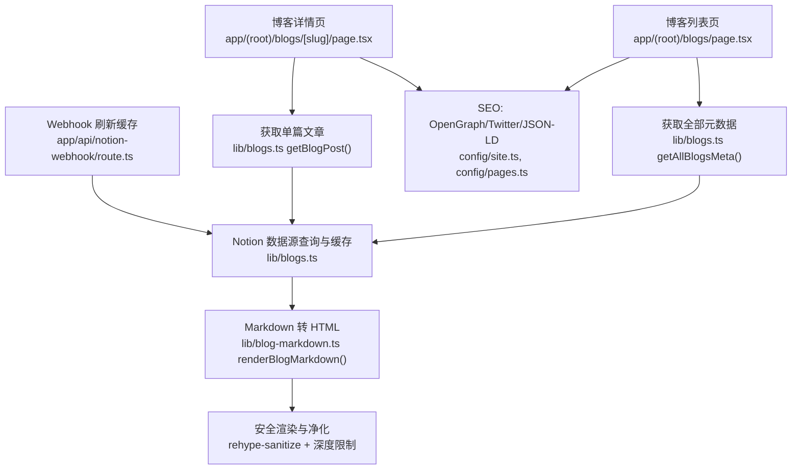
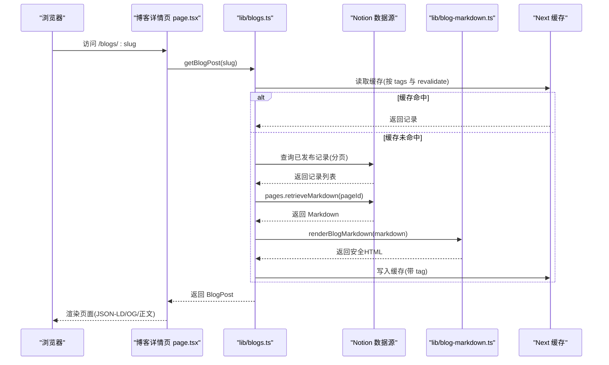
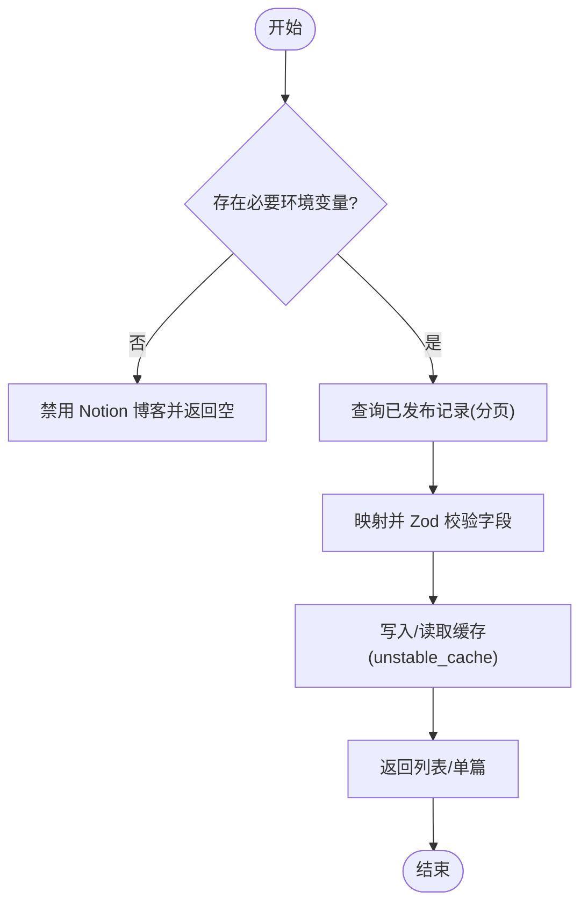
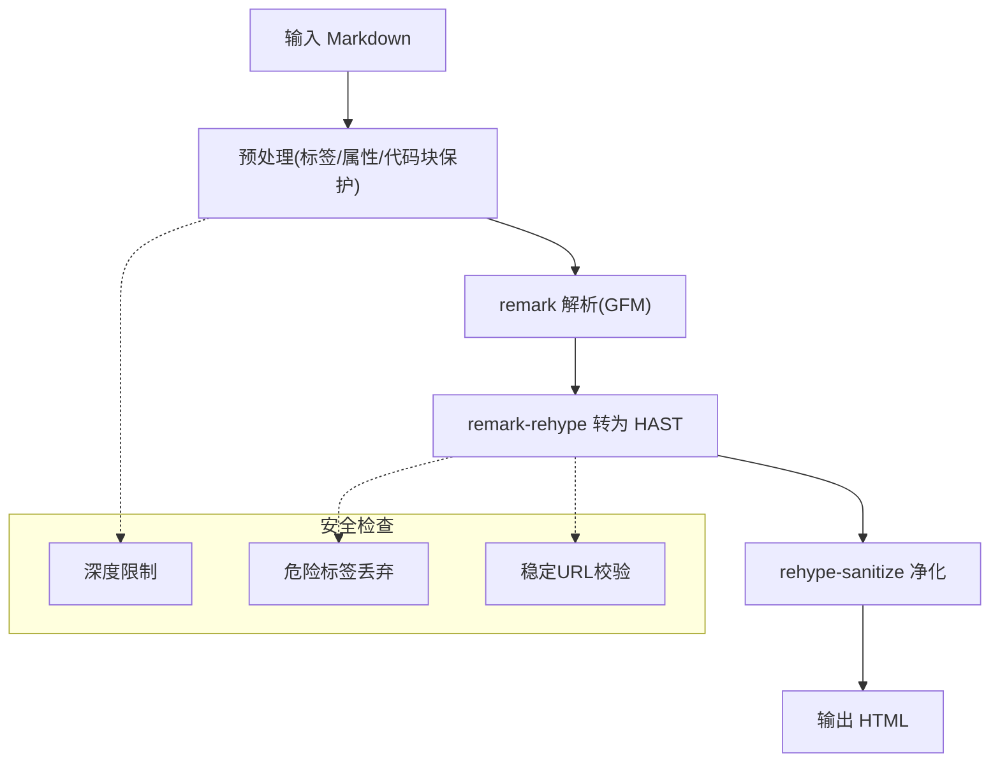
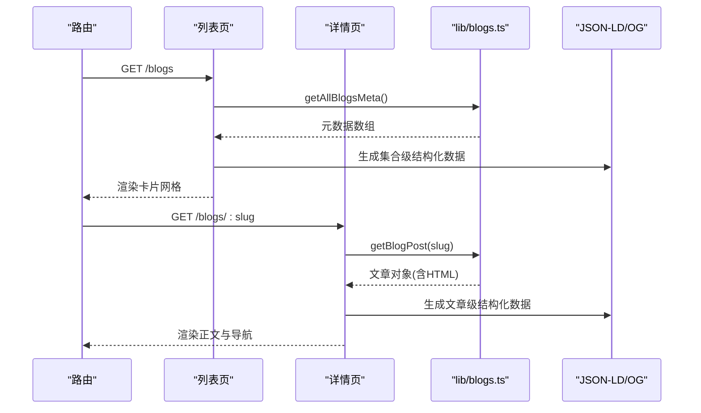
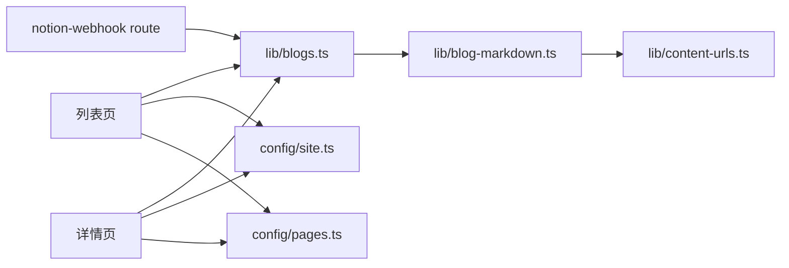

# 博客系统

<cite>
**本文引用的文件**
- [lib/blogs.ts](file://lib/blogs.ts)
- [lib/blog-markdown.ts](file://lib/blog-markdown.ts)
- [lib/content-urls.ts](file://lib/content-urls.ts)
- [app/(root)/blogs/page.tsx](file://app/(root)/blogs/page.tsx)
- [app/(root)/blogs/[slug]/page.tsx](file://app/(root)/blogs/[slug]/page.tsx)
- [components/blogs/blog-card.tsx](file://components/blogs/blog-card.tsx)
- [components/blogs/blog-cover-image.tsx](file://components/blogs/blog-cover-image.tsx)
- [config/site.ts](file://config/site.ts)
- [config/pages.ts](file://config/pages.ts)
- [app/api/notion-webhook/route.ts](file://app/api/notion-webhook/route.ts)
</cite>

## 目录
1. [简介](#简介)
2. [项目结构](#项目结构)
3. [核心组件](#核心组件)
4. [架构总览](#架构总览)
5. [详细组件分析](#详细组件分析)
6. [依赖关系分析](#依赖关系分析)
7. [性能考量](#性能考量)
8. [故障排查指南](#故障排查指南)
9. [结论](#结论)
10. [附录](#附录)

## 简介
本博客系统基于 Next.js App Router，采用“内容即数据”的设计：文章元数据与正文来自 Notion 数据库，通过服务端函数在构建期或请求期拉取、缓存并渲染为静态 HTML。系统实现了：
- 基于 Notion 的 Markdown 内容管理与解析流程
- 安全的 HTML 渲染（包含深度限制、危险标签过滤、稳定链接校验）
- 列表页与详情页的 SEO 优化（Open Graph、Twitter Card、JSON-LD）
- 标签与精选文章展示、阅读时长估算
- Webhook 驱动的增量缓存失效
- 封面图懒加载与外部/内部资源自适应

注意：本项目未使用本地 Markdown 文件作为内容源；若需切换为本地 .md 文件方案，可参考文末附录中的迁移建议。

## 项目结构
- 路由层
  - 博客列表页：app/(root)/blogs/page.tsx
  - 博客详情页：app/(root)/blogs/[slug]/page.tsx
- 数据与渲染层
  - 博客数据获取与缓存：lib/blogs.ts
  - Markdown 转换与安全渲染：lib/blog-markdown.ts
  - 内容 URL 安全校验：lib/content-urls.ts
- UI 组件
  - 卡片与封面图：components/blogs/blog-card.tsx、components/blogs/blog-cover-image.tsx
- 配置
  - 站点信息与 OG 图片：config/site.ts
  - 页面文案与元信息：config/pages.ts
- 缓存刷新
  - Notion Webhook 处理：app/api/notion-webhook/route.ts

图表来源
- [app/(root)/blogs/page.tsx:1-152](file://app/(root)/blogs/page.tsx#L1-L152)
- [app/(root)/blogs/[slug]/page.tsx:1-322](file://app/(root)/blogs/[slug]/page.tsx#L1-L322)
- [lib/blogs.ts:1-550](file://lib/blogs.ts#L1-L550)
- [lib/blog-markdown.ts:1-532](file://lib/blog-markdown.ts#L1-L532)
- [config/site.ts:1-39](file://config/site.ts#L1-L39)
- [config/pages.ts:1-81](file://config/pages.ts#L1-L81)
- [app/api/notion-webhook/route.ts:1-75](file://app/api/notion-webhook/route.ts#L1-L75)

章节来源
- [app/(root)/blogs/page.tsx:1-152](file://app/(root)/blogs/page.tsx#L1-L152)
- [app/(root)/blogs/[slug]/page.tsx:1-322](file://app/(root)/blogs/[slug]/page.tsx#L1-L322)
- [lib/blogs.ts:1-550](file://lib/blogs.ts#L1-L550)
- [lib/blog-markdown.ts:1-532](file://lib/blog-markdown.ts#L1-L532)
- [config/site.ts:1-39](file://config/site.ts#L1-L39)
- [config/pages.ts:1-81](file://config/pages.ts#L1-L81)
- [app/api/notion-webhook/route.ts:1-75](file://app/api/notion-webhook/route.ts#L1-L75)

## 核心组件
- 数据模型
  - BlogFrontmatter：标题、日期、描述、标签、封面图、阅读时长、是否精选
  - BlogMeta：在前置基础上增加 slug 与更新时间
  - BlogPost：在元数据基础上增加 contentHtml
- 数据获取
  - getAllBlogsMeta：返回所有已发布文章的元数据
  - getBlogPost：根据 slug 获取文章详情（含 HTML 内容与阅读时长）
  - getFeaturedBlogs：返回精选文章（最多 3 篇）
- 渲染管线
  - renderBlogMarkdown：将 Notion 导出的 Markdown 转换为安全 HTML
  - 安全策略：深度限制、危险标签丢弃、仅允许稳定 URL、临时签名链接移除
- 页面组件
  - 列表页：生成集合级 JSON-LD、OG/Twitter 元信息、卡片网格
  - 详情页：生成文章级 JSON-LD、面包屑、封面图、正文渲染
- 图片组件
  - BlogCoverImage：自动识别外部/内部资源，按需懒加载或优先加载

章节来源
- [lib/blogs.ts:35-53](file://lib/blogs.ts#L35-L53)
- [lib/blogs.ts:492-536](file://lib/blogs.ts#L492-L536)
- [lib/blog-markdown.ts:509-531](file://lib/blog-markdown.ts#L509-L531)
- [app/(root)/blogs/page.tsx:12-40](file://app/(root)/blogs/page.tsx#L12-L40)
- [app/(root)/blogs/[slug]/page.tsx:26-84](file://app/(root)/blogs/[slug]/page.tsx#L26-L84)
- [components/blogs/blog-cover-image.tsx:1-69](file://components/blogs/blog-cover-image.tsx#L1-L69)

## 架构总览
系统以 Next.js Server Components 为主，数据从 Notion 数据源读取并通过 unstable_cache 进行服务端缓存；Markdown 经 remark/rehype 管道转换为 HTML，并在渲染前进行严格的安全净化。列表页与详情页分别注入集合与文章级 JSON-LD，配合 Open Graph/Twitter Card 提升社交分享效果。

图表来源
- [app/(root)/blogs/[slug]/page.tsx:21-92](file://app/(root)/blogs/[slug]/page.tsx#L21-L92)
- [lib/blogs.ts:404-420](file://lib/blogs.ts#L404-L420)
- [lib/blogs.ts:422-467](file://lib/blogs.ts#L422-L467)
- [lib/blog-markdown.ts:509-531](file://lib/blog-markdown.ts#L509-L531)

## 详细组件分析

### 数据层：lib/blogs.ts
- 功能要点
  - 环境变量校验：NOTION_TOKEN 与 NOTION_DATA_SOURCE_ID 必须成对设置
  - 属性映射与校验：Zod 校验字段类型与长度，Slug 正则匹配 kebab-case
  - 分页查询：按 PublishedAt 降序，支持 has_more 游标翻页
  - 缓存策略：unstable_cache 按 tags 命名空间缓存，revalidate 秒数可配置
  - 阅读时长估算：去除代码块与标记后统计拉丁词与中日韩字符
- 关键接口
  - getAllBlogSlugs、getAllBlogsMeta、getBlogPost、getFeaturedBlogs

图表来源
- [lib/blogs.ts:92-121](file://lib/blogs.ts#L92-L121)
- [lib/blogs.ts:337-402](file://lib/blogs.ts#L337-L402)
- [lib/blogs.ts:404-420](file://lib/blogs.ts#L404-L420)
- [lib/blogs.ts:492-536](file://lib/blogs.ts#L492-L536)

章节来源
- [lib/blogs.ts:92-121](file://lib/blogs.ts#L92-L121)
- [lib/blogs.ts:337-402](file://lib/blogs.ts#L337-L402)
- [lib/blogs.ts:404-420](file://lib/blogs.ts#L404-L420)
- [lib/blogs.ts:492-536](file://lib/blogs.ts#L492-L536)

### 渲染层：lib/blog-markdown.ts
- 功能要点
  - 预处理：规范化 Notion 自定义标签与属性，保护代码块内内容
  - 转换链：remark -> remark-gfm -> remark-rehype -> rehype-raw -> rehype-stringify
  - 安全策略：
    - 最大嵌套深度限制（防止恶意深层嵌套）
    - 危险标签丢弃（script/style/iframe/svg 等）
    - 仅允许稳定 URL（站点相对路径或 HTTPS），移除临时签名链接
    - 最终通过 rehype-sanitize 净化
  - 特殊元素处理：表格、引用块、媒体、同步块、提及日期等
- 输出：纯 HTML 字符串，供 dangerouslySetInnerHTML 安全渲染

图表来源
- [lib/blog-markdown.ts:19-55](file://lib/blog-markdown.ts#L19-L55)
- [lib/blog-markdown.ts:205-265](file://lib/blog-markdown.ts#L205-L265)
- [lib/blog-markdown.ts:477-507](file://lib/blog-markdown.ts#L477-L507)
- [lib/blog-markdown.ts:509-531](file://lib/blog-markdown.ts#L509-L531)

章节来源
- [lib/blog-markdown.ts:19-55](file://lib/blog-markdown.ts#L19-L55)
- [lib/blog-markdown.ts:205-265](file://lib/blog-markdown.ts#L205-L265)
- [lib/blog-markdown.ts:477-507](file://lib/blog-markdown.ts#L477-L507)
- [lib/blog-markdown.ts:509-531](file://lib/blog-markdown.ts#L509-L531)

### 页面层：列表页与详情页
- 列表页
  - 获取全部元数据并渲染卡片网格
  - 注入 CollectionPage + Blog JSON-LD 与 BreadcrumbList
  - 首屏卡片封面图优先加载
- 详情页
  - generateStaticParams 预生成路由参数
  - generateMetadata 动态生成 OG/Twitter/Robots
  - 注入 BlogPosting + BreadcrumbList
  - 正文通过 dangerouslySetInnerHTML 渲染（已由渲染层净化）

图表来源
- [app/(root)/blogs/page.tsx:12-152](file://app/(root)/blogs/page.tsx#L12-L152)
- [app/(root)/blogs/[slug]/page.tsx:21-174](file://app/(root)/blogs/[slug]/page.tsx#L21-L174)
- [lib/blogs.ts:492-536](file://lib/blogs.ts#L492-L536)

章节来源
- [app/(root)/blogs/page.tsx:12-152](file://app/(root)/blogs/page.tsx#L12-L152)
- [app/(root)/blogs/[slug]/page.tsx:21-174](file://app/(root)/blogs/[slug]/page.tsx#L21-L174)

### 组件层：卡片与封面图
- BlogCard
  - 显示标签、标题、摘要、日期、阅读时长
  - 首张卡片封面图 eager 加载，其余 lazy
- BlogCoverImage
  - 外部链接使用原生 img，内部资源使用 next/image
  - 支持 fill/尺寸/sizes/loading/fetchPriority

章节来源
- [components/blogs/blog-card.tsx:1-98](file://components/blogs/blog-card.tsx#L1-L98)
- [components/blogs/blog-cover-image.tsx:1-69](file://components/blogs/blog-cover-image.tsx#L1-L69)

### 配置层：站点与页面文案
- siteConfig：站点名、作者、OG 图片、社交链接
- pagesConfig：各页面标题与描述，用于 SEO 元信息

章节来源
- [config/site.ts:1-39](file://config/site.ts#L1-L39)
- [config/pages.ts:1-81](file://config/pages.ts#L1-L81)

### 缓存刷新：Notion Webhook
- 验证签名后触发 revalidateTag(BLOG_CACHE_TAG) 与相关路径重验证
- 支持首次验证 token 流程

章节来源
- [app/api/notion-webhook/route.ts:1-75](file://app/api/notion-webhook/route.ts#L1-L75)

## 依赖关系分析
- 模块耦合
  - 页面层依赖 lib/blogs.ts 提供的数据接口
  - lib/blogs.ts 依赖 lib/blog-markdown.ts 进行内容渲染
  - 渲染层依赖 lib/content-urls.ts 进行 URL 安全校验
  - 页面层依赖 config/site.ts 与 config/pages.ts 提供站点与页面元信息
  - Webhook 通过 BLOG_CACHE_TAG 与 lib/blogs.ts 解耦联动

图表来源
- [app/(root)/blogs/page.tsx:1-152](file://app/(root)/blogs/page.tsx#L1-L152)
- [app/(root)/blogs/[slug]/page.tsx:1-322](file://app/(root)/blogs/[slug]/page.tsx#L1-L322)
- [lib/blogs.ts:1-550](file://lib/blogs.ts#L1-L550)
- [lib/blog-markdown.ts:1-532](file://lib/blog-markdown.ts#L1-L532)
- [lib/content-urls.ts:1-44](file://lib/content-urls.ts#L1-L44)
- [config/site.ts:1-39](file://config/site.ts#L1-L39)
- [config/pages.ts:1-81](file://config/pages.ts#L1-L81)
- [app/api/notion-webhook/route.ts:1-75](file://app/api/notion-webhook/route.ts#L1-L75)

章节来源
- [lib/blogs.ts:1-550](file://lib/blogs.ts#L1-L550)
- [lib/blog-markdown.ts:1-532](file://lib/blog-markdown.ts#L1-L532)
- [lib/content-urls.ts:1-44](file://lib/content-urls.ts#L1-L44)
- [app/(root)/blogs/page.tsx:1-152](file://app/(root)/blogs/page.tsx#L1-L152)
- [app/(root)/blogs/[slug]/page.tsx:1-322](file://app/(root)/blogs/[slug]/page.tsx#L1-L322)
- [config/site.ts:1-39](file://config/site.ts#L1-L39)
- [config/pages.ts:1-81](file://config/pages.ts#L1-L81)
- [app/api/notion-webhook/route.ts:1-75](file://app/api/notion-webhook/route.ts#L1-L75)

## 性能考量
- 构建期与请求期结合
  - 列表页与详情页均通过服务端函数获取数据，并使用 unstable_cache 缓存
  - 可通过环境变量控制 revalidate 周期
- 网络与渲染优化
  - 封面图按需懒加载，首屏卡片优先加载
  - 外部图片使用原生 img，内部资源使用 next/image 优化
- 内容大小与复杂度控制
  - Markdown 字节上限与 HTML 嵌套深度限制，避免过大或过深内容导致性能问题
- 缓存失效
  - Webhook 触发精准 tag 失效，减少全量重建

[本节为通用指导，不直接分析具体文件]

## 故障排查指南
- 常见错误与定位
  - 缺少 Notion 配置：检查 NOTION_TOKEN 与 NOTION_DATA_SOURCE_ID 是否同时设置
  - 属性类型不匹配：确认 Notion 数据库字段类型与名称符合预期（如 Status 必须包含 Published）
  - Slug 重复或不合法：确保唯一且符合正则规则
  - 内容过大或嵌套过深：缩短文章或降低嵌套层级
  - 临时链接失效：使用稳定的站点相对路径或 HTTPS 链接
- 调试步骤
  - 查看控制台警告与错误信息（例如 Notion 客户端错误、属性缺失）
  - 检查 Webhook 是否成功触发缓存刷新
  - 通过浏览器开发者工具检查 JSON-LD 与 OG/Twitter 元信息是否正确

章节来源
- [lib/blogs.ts:92-121](file://lib/blogs.ts#L92-L121)
- [lib/blogs.ts:255-285](file://lib/blogs.ts#L255-L285)
- [lib/blogs.ts:337-402](file://lib/blogs.ts#L337-L402)
- [lib/blog-markdown.ts:19-55](file://lib/blog-markdown.ts#L19-L55)
- [lib/content-urls.ts:20-44](file://lib/content-urls.ts#L20-L44)
- [app/api/notion-webhook/route.ts:23-75](file://app/api/notion-webhook/route.ts#L23-L75)

## 结论
该博客系统以 Notion 为内容源，通过严谨的数据校验与安全渲染，提供了高性能、可扩展的博客能力。其分层清晰、缓存策略完善，并具备完善的 SEO 与社交分享支持。对于需要快速迭代内容的团队或个人，该方案兼顾了易用性与安全性。

[本节为总结性内容，不直接分析具体文件]

## 附录

### 如何添加新文章（基于 Notion）
- 在 Notion 中创建数据库“Blog Posts”，包含以下字段（名称区分大小写）：
  - Title（Title）、Slug（Text）、Status（Status/Select，必须包含 Draft 与 Published）、PublishedAt（Date）、Description（Text）、Tags（Multi-select）、CoverImage（Text，站点相对路径或稳定 HTTPS）、ReadingTime（Number，可选）、Featured（Checkbox）
- 为数据库建立内部连接并授予读取权限，将连接添加到数据库
- 在数据库设置中复制数据源 ID（非页面 URL 中的数据库 ID）
- 在 .env.local 中配置：
  - NOTION_TOKEN=ntn_...
  - NOTION_DATA_SOURCE_ID=...
  - NOTION_BLOG_REVALIDATE_SECONDS=900（可选）
- 新建页面填写必填字段，正文即为文章内容，状态设为 Published
- 部署后，列表页与详情页将自动拉取并渲染

章节来源
- [README.md:74-113](file://README.md#L74-L113)
- [lib/blogs.ts:21-31](file://lib/blogs.ts#L21-L31)
- [lib/blogs.ts:92-121](file://lib/blogs.ts#L92-L121)
- [lib/blogs.ts:337-402](file://lib/blogs.ts#L337-L402)

### 自定义博客样式
- 列表页与详情页使用 Tailwind 类名进行布局与动画，可在对应页面文件中调整
- 卡片组件支持覆盖默认样式，或通过 className 传入自定义样式
- 封面图组件支持 sizes、loading、fetchPriority 等属性，可按需优化加载体验

章节来源
- [app/(root)/blogs/page.tsx:120-152](file://app/(root)/blogs/page.tsx#L120-L152)
- [app/(root)/blogs/[slug]/page.tsx:176-318](file://app/(root)/blogs/[slug]/page.tsx#L176-L318)
- [components/blogs/blog-card.tsx:1-98](file://components/blogs/blog-card.tsx#L1-L98)
- [components/blogs/blog-cover-image.tsx:1-69](file://components/blogs/blog-cover-image.tsx#L1-L69)

### 集成第三方服务（示例：GitHub Stars）
- 项目中已提供 GitHub Stars 徽章组件与 API 路由，可作为第三方服务集成的参考
- 如需接入其他服务，建议在 app/api 下新增路由，遵循认证与错误处理规范

章节来源
- [components/common/github-star-badge.tsx](file://components/common/github-star-badge.tsx)
- [app/api/github-stars/route.ts](file://app/api/github-stars/route.ts)

### 优化加载性能
- 启用 Webhook 实时刷新缓存，减少轮询与延迟
- 合理设置 revalidate 周期，平衡新鲜度与性能
- 使用封面图懒加载与首屏优先加载策略
- 控制文章内容大小与嵌套深度，避免渲染瓶颈

章节来源
- [app/api/notion-webhook/route.ts:59-75](file://app/api/notion-webhook/route.ts#L59-L75)
- [lib/blogs.ts:92-97](file://lib/blogs.ts#L92-L97)
- [components/blogs/blog-cover-image.tsx:17-69](file://components/blogs/blog-cover-image.tsx#L17-L69)
- [lib/blog-markdown.ts:19-55](file://lib/blog-markdown.ts#L19-L55)

### 搜索实现（概念性说明）
- 当前仓库未提供前端搜索实现。可基于已获取的元数据（title、description、tags）在客户端进行轻量级过滤
- 如需服务端搜索，可考虑引入搜索引擎或向量检索服务，并将结果与现有数据模型对接

[本节为概念性说明，不直接分析具体文件]

### 迁移到本地 Markdown（概念性说明）
- 若希望改用本地 .md 文件作为内容源，可保留页面层不变，替换 lib/blogs.ts 中的数据获取逻辑为文件系统读取与 frontmatter 解析
- 建议使用 gray-matter 解析 frontmatter，并结合 remark/rehype 管道进行安全渲染
- 保持 BlogMeta/BlogPost 接口一致，便于页面层无需改动

[本节为概念性说明，不直接分析具体文件]